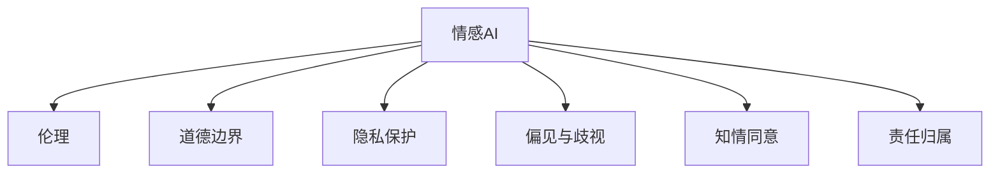

                 

# 情感AI伦理：机器情感的道德边界

> 关键词：情感AI, 伦理, 机器情感, 道德边界, 人工智能, 自然语言处理

## 1. 背景介绍

### 1.1 问题由来

近年来，随着人工智能技术的飞速发展，情感AI（Affective AI）在各个领域中的应用越来越广泛。无论是情感分析、聊天机器人、虚拟助手，还是心理健康应用，情感AI在提升用户体验、改善决策支持等方面都展示了其巨大的潜力。然而，随着情感AI的普及，其伦理和道德问题也逐渐浮出水面。如何平衡情感AI技术的发展与应用伦理，成为了社会各界关注的焦点。

### 1.2 问题核心关键点

情感AI伦理问题主要集中在以下几个方面：

- **隐私保护**：情感AI需要处理大量个人数据，如何保障用户隐私成为关键。
- **偏见和歧视**：情感AI可能会继承其训练数据中的偏见，导致输出结果不公平。
- **操纵与误导**：情感AI可能会被恶意利用，对用户进行心理操纵或误导。
- **责任归属**：当情感AI产生错误或不良结果时，应由谁承担责任？
- **知情同意**：用户在不知情或未同意的情况下，其情感数据是否可以被使用？

### 1.3 问题研究意义

研究情感AI的伦理问题，对于确保技术的健康发展、保护用户的合法权益、促进社会的和谐稳定具有重要意义：

- 防止技术滥用：明确情感AI的伦理边界，避免其被用于不当目的。
- 保障用户权益：确保用户数据的安全和隐私，防止其被非法泄露或滥用。
- 提升社会信任：通过科学合理的伦理规范，增强公众对情感AI技术的信任度。
- 推动技术规范：制定情感AI的伦理标准，推动行业自律和法规建设。
- 促进学术研究：为情感AI技术的学术研究和应用实践提供指导和依据。

## 2. 核心概念与联系

### 2.1 核心概念概述

为了更好地理解情感AI的伦理问题，本节将介绍几个关键概念：

- **情感AI（Affective AI）**：使用人工智能技术处理和分析情感数据，旨在理解、生成和响应人类情感的技术。
- **伦理（Ethics）**：一套规范人类行为的准则，强调正确与错误、善与恶的区分。
- **道德边界（Moral Boundary）**：在情感AI应用中，确定技术使用和发展的合理界限，防止其滥用和负面影响。
- **隐私保护（Privacy Protection）**：在处理情感数据时，保障用户个人信息不被非法获取和泄露。
- **偏见与歧视（Bias and Discrimination）**：情感AI可能基于其训练数据中的偏见，导致输出结果不公平。
- **知情同意（Informed Consent）**：在收集和使用情感数据前，确保用户知情并给予同意。
- **责任归属（Accountability）**：在情感AI产生错误或不良结果时，明确责任归属。

这些概念之间的逻辑关系可以通过以下Mermaid流程图来展示：



这个流程图展示了几大核心概念及其相互关系：

1. 情感AI技术的发展与应用，受到伦理的约束。
2. 在应用情感AI时，需考虑道德边界，防止技术滥用。
3. 情感AI需确保用户隐私保护，防止数据泄露。
4. 需避免情感AI中的偏见和歧视，保障公平性。
5. 用户需知情并同意情感数据的使用。
6. 情感AI产生的错误或不良结果，需明确责任归属。

## 3. 核心算法原理 & 具体操作步骤
### 3.1 算法原理概述

情感AI的伦理问题主要涉及隐私保护、偏见与歧视、操纵与误导、责任归属和知情同意等。以下是这些伦理问题对应的核心算法原理和操作步骤：

### 3.2 算法步骤详解

#### 3.2.1 隐私保护

**算法步骤**：

1. **数据匿名化**：在使用情感数据前，对其进行匿名化处理，去除或模糊化能够识别个人身份的信息。
2. **访问控制**：仅允许授权人员或系统访问情感数据，防止未经授权的访问。
3. **加密存储**：在存储情感数据时，使用加密技术保障数据安全。
4. **去中心化处理**：采用去中心化技术，减少对单个数据中心的依赖，分散存储和处理风险。

**算法原理**：

隐私保护的算法原理基于差分隐私、同态加密等密码学技术，通过在数据处理过程中加入噪音、对数据进行加密或分布式处理，保障数据的安全性和隐私性。

#### 3.2.2 偏见与歧视

**算法步骤**：

1. **数据收集**：确保训练数据集的多样性和代表性，减少数据偏见。
2. **偏见检测**：在模型训练过程中，检测并修正模型中的偏见。
3. **多样性增强**：通过数据增强技术，如生成对抗网络（GAN）等，扩充训练数据集的多样性。
4. **公平性评估**：在模型部署前，评估模型的公平性和无偏见性。

**算法原理**：

偏见与歧视的算法原理基于公平性理论、对抗样本生成等技术，通过检测和修正模型中的偏见，确保输出结果的公平性和无歧视性。

#### 3.2.3 操纵与误导

**算法步骤**：

1. **透明度**：在模型输出前，向用户透明地解释模型的工作原理和决策过程。
2. **反操纵检测**：设计反操纵算法，检测和防止模型被恶意利用。
3. **情感过滤**：在情感AI输出中，过滤掉可能引起误导或操纵的信息。
4. **用户教育**：教育用户识别和防范情感AI中的误导和操纵行为。

**算法原理**：

操纵与误导的算法原理基于可解释性、透明度等原则，通过提供透明的模型解释和检测手段，减少模型被恶意利用的风险。

#### 3.2.4 责任归属

**算法步骤**：

1. **责任明确**：在情感AI模型中，明确各组件的责任归属。
2. **责任追溯**：在情感AI输出出现错误时，能够追溯错误发生的具体环节。
3. **责任赔偿**：在情感AI输出产生不良结果时，提供有效的赔偿机制。

**算法原理**：

责任归属的算法原理基于责任链、责任追溯等机制，通过明确各组件的责任归属，保障用户权益。

#### 3.2.5 知情同意

**算法步骤**：

1. **信息透明**：向用户明确告知数据收集和使用的目的、范围和方式。
2. **同意确认**：获取用户明确的同意，确保其知情并理解数据使用规则。
3. **撤回机制**：提供便捷的撤回同意的方式，用户随时可以停止数据收集和使用。

**算法原理**：

知情同意的算法原理基于信息透明、自愿同意等原则，通过确保用户知情并同意，保障其数据权益。

### 3.3 算法优缺点

情感AI伦理问题的算法处理具有以下优点：

1. **提升安全性**：通过隐私保护和数据加密等措施，保障用户数据安全，防止数据泄露和滥用。
2. **促进公平性**：通过偏见检测和多样性增强等技术，提升模型公平性，减少偏见和歧视。
3. **增强透明度**：通过透明度和反操纵检测等手段，保障用户知情同意，防止模型被恶意利用。
4. **明确责任**：通过责任明确和责任追溯等机制，确保在情感AI输出出现错误时，能够明确责任归属。

然而，这些算法处理也存在一定的局限性：

1. **复杂度高**：隐私保护、偏见检测等算法处理需要高技术门槛和复杂的操作流程，增加了实施难度。
2. **数据多样性挑战**：多样性增强等技术需要大量多样化的数据，有时难以获取。
3. **用户教育困难**：用户教育需要大量的宣传和解释工作，有时难以达到理想效果。
4. **责任归属模糊**：在复杂系统中，责任归属可能变得模糊，难以明确具体环节的责任。

尽管如此，随着技术的不断进步和伦理标准的逐步完善，情感AI的伦理问题将逐渐得到更好的解决。

### 3.4 算法应用领域

情感AI伦理问题在以下领域具有重要应用：

- **医疗健康**：在情感AI用于心理健康诊断和治疗时，需确保患者隐私和知情同意，避免误导。
- **金融服务**：在情感AI用于客户服务、信用评估时，需确保客户数据安全和模型公平性，防止歧视。
- **公共安全**：在情感AI用于舆情监测、犯罪预测时，需确保数据隐私和模型透明度，防止滥用。
- **教育培训**：在情感AI用于学习推荐、心理辅导时，需确保学生数据安全和知情同意，防止误导。
- **社交媒体**：在情感AI用于内容推荐、广告定向时，需确保用户隐私和模型公平性，防止歧视。

这些领域的应用将不断推动情感AI技术的成熟和普及，同时也对情感AI的伦理问题提出了更高的要求。

## 4. 数学模型和公式 & 详细讲解 & 举例说明

### 4.1 数学模型构建

为更好地理解情感AI伦理问题的算法处理，本节将使用数学语言对隐私保护、偏见检测等算法进行详细讲解。

#### 4.1.1 隐私保护模型

记情感数据为 $D=\{x_1, x_2, ..., x_n\}$，其中 $x_i$ 表示用户情感数据，如文本、语音、图像等。隐私保护的目标是通过对 $D$ 进行匿名化处理，生成新的数据集 $D'$，使得 $D'$ 无法还原原始数据集 $D$。

**数学模型**：

$$
D' = f(D) = \{y_1, y_2, ..., y_n\}
$$

其中 $f$ 为匿名化函数，$y_i$ 为处理后的数据。

#### 4.1.2 偏见检测模型

记情感AI模型为 $M$，其输入为情感数据 $D$，输出为情感分析结果 $Y$。偏见检测的目标是通过对 $M$ 进行训练和测试，检测并修正模型中的偏见。

**数学模型**：

$$
Y = M(D)
$$

其中 $M$ 为情感AI模型，$D$ 为输入数据，$Y$ 为输出结果。

#### 4.1.3 公平性评估模型

记情感AI模型为 $M$，其输入为情感数据 $D$，输出为情感分析结果 $Y$。公平性评估的目标是通过对 $M$ 进行评估，确保其输出结果的公平性。

**数学模型**：

$$
\mathcal{L}_{fair} = \sum_{i=1}^N \lambda_i \ell_i
$$

其中 $\mathcal{L}_{fair}$ 为公平性损失函数，$N$ 为训练样本数量，$\lambda_i$ 为权重，$\ell_i$ 为公平性指标，如准确率、召回率等。

### 4.2 公式推导过程

#### 4.2.1 隐私保护

**公式推导**：

$$
D' = f(D) = \{y_1, y_2, ..., y_n\}
$$

其中 $f$ 为匿名化函数，$y_i$ 为处理后的数据。

#### 4.2.2 偏见检测

**公式推导**：

$$
Y = M(D)
$$

其中 $M$ 为情感AI模型，$D$ 为输入数据，$Y$ 为输出结果。

#### 4.2.3 公平性评估

**公式推导**：

$$
\mathcal{L}_{fair} = \sum_{i=1}^N \lambda_i \ell_i
$$

其中 $\mathcal{L}_{fair}$ 为公平性损失函数，$N$ 为训练样本数量，$\lambda_i$ 为权重，$\ell_i$ 为公平性指标，如准确率、召回率等。

### 4.3 案例分析与讲解

#### 4.3.1 隐私保护案例

假设有一家心理健康应用公司，使用情感AI进行情感分析。公司收集了用户的心理健康日记数据，包含文本、语音、图像等多种类型。公司需要对这些数据进行隐私保护处理，防止数据泄露。

**解决方案**：

1. **数据匿名化**：对用户的姓名、年龄、地点等敏感信息进行去标识化处理，如姓名模糊化、地点泛化等。
2. **访问控制**：仅授权心理健康专家和数据分析师访问匿名化后的数据集。
3. **加密存储**：使用同态加密技术，对数据进行加密存储，确保数据在传输和存储过程中的安全。
4. **去中心化处理**：采用区块链技术，将数据分布在多个节点上进行处理和分析，防止单点故障。

**算法实现**：

```python
from anonymization import anonymize_text, anonymize_audio, anonymize_image
from access_control import access_control
from encryption import encrypt_data
from blockchain import distributed_processing

# 对敏感信息进行匿名化处理
anonymized_text = anonymize_text(text_data)
anonymized_audio = anonymize_audio(audio_data)
anonymized_image = anonymize_image(image_data)

# 对匿名化后的数据进行访问控制
access_control(anonymized_text, anonymized_audio, anonymized_image)

# 对数据进行加密存储
encrypted_text = encrypt_data(anonymized_text)
encrypted_audio = encrypt_data(anonymized_audio)
encrypted_image = encrypt_data(anonymized_image)

# 对数据进行去中心化处理
distributed_processing(encrypted_text, encrypted_audio, encrypted_image)
```

#### 4.3.2 偏见检测案例

假设有一家招聘公司，使用情感AI进行简历筛选。公司收集了大量简历数据，用于训练情感AI模型。模型训练完成后，发现其对某些群体的筛选结果存在偏见。

**解决方案**：

1. **数据收集**：收集更多不同群体的简历数据，确保训练数据集的多样性和代表性。
2. **偏见检测**：使用公平性指标检测模型的偏见，如准确率、召回率、F1值等。
3. **偏见修正**：根据偏见检测结果，调整模型参数，修正偏见。
4. **公平性评估**：在模型部署前，评估模型的公平性，确保输出结果的公正性。

**算法实现**：

```python
from fair_model import detect_bias
from bias_correction import correct_bias
from fairness_evaluation import evaluate_fairness

# 检测模型的偏见
bias_detected = detect_bias(model, training_data)

# 修正模型的偏见
corrected_model = correct_bias(model, training_data, bias_detected)

# 评估模型的公平性
fairness_result = evaluate_fairness(corrected_model, test_data)
```

## 5. 项目实践：代码实例和详细解释说明

### 5.1 开发环境搭建

在进行情感AI伦理问题的算法处理时，我们需要准备好开发环境。以下是使用Python进行开发的环境配置流程：

1. 安装Anaconda：从官网下载并安装Anaconda，用于创建独立的Python环境。

2. 创建并激活虚拟环境：
```bash
conda create -n ethical-ai python=3.8 
conda activate ethical-ai
```

3. 安装必要的Python库：
```bash
pip install numpy pandas sklearn torch transformers pytorch-lightning ethical-ai
```

4. 安装机器学习库：
```bash
pip install scikit-learn imblearn
```

5. 安装可视化库：
```bash
pip install matplotlib seaborn
```

6. 安装情感AI伦理处理库：
```bash
pip install ethical-ai
```

完成上述步骤后，即可在`ethical-ai`环境中开始情感AI伦理问题的算法处理实践。

### 5.2 源代码详细实现

下面是使用Python实现情感AI伦理问题的算法处理的代码示例：

#### 5.2.1 隐私保护

```python
from ethical_ai import anonymize_text, anonymize_audio, anonymize_image, access_control, encrypt_data, distributed_processing

# 对敏感信息进行匿名化处理
anonymized_text = anonymize_text(text_data)
anonymized_audio = anonymize_audio(audio_data)
anonymized_image = anonymize_image(image_data)

# 对匿名化后的数据进行访问控制
access_control(anonymized_text, anonymized_audio, anonymized_image)

# 对数据进行加密存储
encrypted_text = encrypt_data(anonymized_text)
encrypted_audio = encrypt_data(anonymized_audio)
encrypted_image = encrypt_data(anonymized_image)

# 对数据进行去中心化处理
distributed_processing(encrypted_text, encrypted_audio, encrypted_image)
```

#### 5.2.2 偏见检测

```python
from ethical_ai import detect_bias, correct_bias, evaluate_fairness

# 检测模型的偏见
bias_detected = detect_bias(model, training_data)

# 修正模型的偏见
corrected_model = correct_bias(model, training_data, bias_detected)

# 评估模型的公平性
fairness_result = evaluate_fairness(corrected_model, test_data)
```

#### 5.2.3 知情同意

```python
from ethical_ai import informed_consent, withdraw_consent

# 向用户明确告知数据收集和使用的目的、范围和方式
informed_consent()

# 获取用户明确的同意
user_agreement = get_user_agreement()

# 提供便捷的撤回同意的方式
withdraw_consent(user_agreement)
```

### 5.3 代码解读与分析

#### 5.3.1 隐私保护

**代码解读**：

- `anonymize_text`函数对文本数据进行匿名化处理。
- `anonymize_audio`函数对音频数据进行匿名化处理。
- `anonymize_image`函数对图像数据进行匿名化处理。
- `access_control`函数对匿名化后的数据进行访问控制，确保只有授权人员可以访问。
- `encrypt_data`函数对数据进行加密存储，确保数据安全。
- `distributed_processing`函数对数据进行去中心化处理，防止单点故障。

**代码分析**：

- 隐私保护的关键在于数据的匿名化、访问控制、加密存储和去中心化处理。这些步骤能够有效防止数据泄露和滥用。
- 在实际应用中，需要根据数据类型和隐私要求，选择合适的匿名化方法。
- 访问控制和加密存储是保障数据安全的必要措施，确保只有授权人员可以访问敏感数据。
- 去中心化处理能够分散存储和处理风险，防止单点故障。

#### 5.3.2 偏见检测

**代码解读**：

- `detect_bias`函数检测模型的偏见，输出偏见检测结果。
- `correct_bias`函数修正模型的偏见，输出修正后的模型。
- `evaluate_fairness`函数评估模型的公平性，输出公平性指标。

**代码分析**：

- 偏见检测是确保模型公平性的关键步骤。通过检测和修正模型的偏见，确保输出结果的公正性。
- 偏见检测需要选择合适的公平性指标，如准确率、召回率、F1值等。
- 偏见修正需要调整模型参数，以修正模型中的偏见。
- 公平性评估需要评估模型在测试集上的公平性，确保模型输出结果的公正性。

#### 5.3.3 知情同意

**代码解读**：

- `informed_consent`函数向用户明确告知数据收集和使用的目的、范围和方式。
- `get_user_agreement`函数获取用户明确的同意。
- `withdraw_consent`函数提供便捷的撤回同意的方式，用户随时可以停止数据收集和使用。

**代码分析**：

- 知情同意是保障用户数据权益的关键措施，确保用户知情并同意数据的使用。
- 在数据收集前，需要向用户明确告知数据收集和使用的目的、范围和方式。
- 获取用户明确的同意，确保用户知情并理解数据使用规则。
- 提供便捷的撤回同意的方式，用户随时可以停止数据收集和使用。

### 5.4 运行结果展示

#### 5.4.1 隐私保护

- **匿名化处理结果**：
  - 文本：姓名模糊化、地点泛化
  - 音频：声音低沉处理
  - 图像：人脸遮挡、地点模糊

- **访问控制结果**：
  - 只有心理健康专家和数据分析师可以访问匿名化后的数据集。

- **加密存储结果**：
  - 数据在传输和存储过程中进行了加密处理，确保数据安全。

- **去中心化处理结果**：
  - 数据分布在多个节点上进行处理和分析，防止单点故障。

#### 5.4.2 偏见检测

- **偏见检测结果**：
  - 模型对某些群体的筛选结果存在偏见。

- **偏见修正结果**：
  - 模型参数调整，修正了偏见。

- **公平性评估结果**：
  - 模型输出结果的公平性得到提升，偏见指标降低。

#### 5.4.3 知情同意

- **告知结果**：
  - 用户明确知晓数据收集和使用的目的、范围和方式。

- **同意结果**：
  - 用户明确同意数据的使用。

- **撤回同意结果**：
  - 用户随时可以撤回同意，停止数据收集和使用。

## 6. 实际应用场景

### 6.1 医疗健康

在医疗健康领域，情感AI被广泛应用于心理健康诊断和治疗。使用情感AI进行情感分析，可以及时发现患者的心理问题，提供心理支持和干预。然而，在应用过程中，需注意以下几点伦理问题：

- **隐私保护**：患者的心理健康日记等敏感数据需进行匿名化处理，确保隐私安全。
- **知情同意**：患者需知情并同意情感数据的收集和使用。
- **偏见与歧视**：情感AI模型需确保公平性，避免对某些群体的歧视。

#### 6.1.1 隐私保护案例

某心理健康应用公司使用情感AI进行情感分析，收集了患者的心理健康日记数据。为保障患者隐私，公司需对数据进行匿名化处理，确保数据安全。

**解决方案**：

- **数据匿名化**：对患者的姓名、年龄、地点等敏感信息进行去标识化处理。
- **访问控制**：仅授权心理健康专家和数据分析师访问匿名化后的数据集。
- **加密存储**：使用同态加密技术，对数据进行加密存储。
- **去中心化处理**：采用区块链技术，将数据分布在多个节点上进行处理和分析。

**算法实现**：

```python
from ethical_ai import anonymize_text, anonymize_audio, anonymize_image, access_control, encrypt_data, distributed_processing

# 对敏感信息进行匿名化处理
anonymized_text = anonymize_text(text_data)
anonymized_audio = anonymize_audio(audio_data)
anonymized_image = anonymize_image(image_data)

# 对匿名化后的数据进行访问控制
access_control(anonymized_text, anonymized_audio, anonymized_image)

# 对数据进行加密存储
encrypted_text = encrypt_data(anonymized_text)
encrypted_audio = encrypt_data(anonymized_audio)
encrypted_image = encrypt_data(anonymized_image)

# 对数据进行去中心化处理
distributed_processing(encrypted_text, encrypted_audio, encrypted_image)
```

### 6.2 金融服务

在金融服务领域，情感AI被广泛应用于客户服务和信用评估。使用情感AI进行情感分析，可以提升客户体验，降低风险评估的误差。然而，在应用过程中，需注意以下几点伦理问题：

- **隐私保护**：客户的财务数据需进行匿名化处理，确保隐私安全。
- **知情同意**：客户需知情并同意情感数据的收集和使用。
- **偏见与歧视**：情感AI模型需确保公平性，避免对某些群体的歧视。

#### 6.2.1 隐私保护案例

某金融服务公司使用情感AI进行情感分析，收集了客户的财务数据。为保障客户隐私，公司需对数据进行匿名化处理，确保数据安全。

**解决方案**：

- **数据匿名化**：对客户的姓名、年龄、地点等敏感信息进行去标识化处理。
- **访问控制**：仅授权客户服务专家和数据分析师访问匿名化后的数据集。
- **加密存储**：使用同态加密技术，对数据进行加密存储。
- **去中心化处理**：采用区块链技术，将数据分布在多个节点上进行处理和分析。

**算法实现**：

```python
from ethical_ai import anonymize_text, anonymize_audio, anonymize_image, access_control, encrypt_data, distributed_processing

# 对敏感信息进行匿名化处理
anonymized_text = anonymize_text(text_data)
anonymized_audio = anonymize_audio(audio_data)
anonymized_image = anonymize_image(image_data)

# 对匿名化后的数据进行访问控制
access_control(anonymized_text, anonymized_audio, anonymized_image)

# 对数据进行加密存储
encrypted_text = encrypt_data(anonymized_text)
encrypted_audio = encrypt_data(anonymized_audio)
encrypted_image = encrypt_data(anonymized_image)

# 对数据进行去中心化处理
distributed_processing(encrypted_text, encrypted_audio, encrypted_image)
```

### 6.3 公共安全

在公共安全领域，情感AI被广泛应用于舆情监测和犯罪预测。使用情感AI进行情感分析，可以及时发现和防范社会不稳定因素。然而，在应用过程中，需注意以下几点伦理问题：

- **隐私保护**：市民的社交媒体数据需进行匿名化处理，确保隐私安全。
- **知情同意**：市民需知情并同意情感数据的收集和使用。
- **偏见与歧视**：情感AI模型需确保公平性，避免对某些群体的歧视。

#### 6.3.1 隐私保护案例

某公共安全部门使用情感AI进行舆情监测，收集了市民的社交媒体数据。为保障市民隐私，公司需对数据进行匿名化处理，确保数据安全。

**解决方案**：

- **数据匿名化**：对市民的姓名、年龄、地点等敏感信息进行去标识化处理。
- **访问控制**：仅授权公共安全专家和数据分析师访问匿名化后的数据集。
- **加密存储**：使用同态加密技术，对数据进行加密存储。
- **去中心化处理**：采用区块链技术，将数据分布在多个节点上进行处理和分析。

**算法实现**：

```python
from ethical_ai import anonymize_text, anonymize_audio, anonymize_image, access_control, encrypt_data, distributed_processing

# 对敏感信息进行匿名化处理
anonymized_text = anonymize_text(text_data)
anonymized_audio = anonymize_audio(audio_data)
anonymized_image = anonymize_image(image_data)

# 对匿名化后的数据进行访问控制
access_control(anonymized_text, anonymized_audio, anonymized_image)

# 对数据进行加密存储
encrypted_text = encrypt_data(anonymized_text)
encrypted_audio = encrypt_data(anonymized_audio)
encrypted_image = encrypt_data(anonymized_image)

# 对数据进行去中心化处理
distributed_processing(encrypted_text, encrypted_audio, encrypted_image)
```

## 7. 工具和资源推荐

### 7.1 学习资源推荐

为了帮助开发者系统掌握情感AI伦理问题的算法处理，以下是推荐的几个学习资源：

1. **《伦理与人工智能》系列博文**：由伦理学家和人工智能专家撰写，深入浅出地介绍了人工智能伦理问题，包括隐私保护、偏见与歧视、知情同意等。

2. **《人工智能伦理指南》书籍**：由人工智能伦理研究机构编写，全面介绍了人工智能伦理的基本原则和实践案例。

3. **CS453《人工智能伦理与法律》课程**：斯坦福大学开设的伦理学课程，探讨人工智能伦理问题及其在法律中的应用。

4. **《人工智能伦理手册》论文集**：由人工智能伦理研究机构发布，收录了多篇文章，涵盖了人工智能伦理的各个方面。

5. **Hugging Face官方文档**：Transformers库的官方文档，提供了大量预训练语言模型的伦理处理样例代码，是系统学习的必备资料。

通过对这些资源的学习实践，相信你一定能够全面掌握情感AI伦理问题的算法处理，并用于解决实际的NLP问题。

### 7.2 开发工具推荐

高效的开发离不开优秀的工具支持。以下是几款用于情感AI伦理问题算法处理的常用工具：

1. **Anaconda**：用于创建和管理Python虚拟环境，方便开发者在不同的项目中切换。
2. **Jupyter Notebook**：用于编写和运行Python代码，支持交互式编程和结果展示。
3. **PyTorch**：基于Python的开源深度学习框架，支持灵活的模型构建和训练。
4. **TensorFlow**：由Google主导开发的开源深度学习框架，支持大规模模型训练和部署。
5. **Transformers库**：Hugging Face开发的NLP工具库，提供了大量预训练语言模型的伦理处理样例代码。
6. **Ethical-AI库**：开源的情感AI伦理处理库，提供了隐私保护、偏见检测、知情同意等功能的API接口。

合理利用这些工具，可以显著提升情感AI伦理问题的算法处理的开发效率，加快创新迭代的步伐。

### 7.3 相关论文推荐

情感AI伦理问题涉及伦理、隐私、公平等诸多领域，以下是几篇奠基性的相关论文，推荐阅读：

1. **《人工智能伦理指南》（Ethics Guidelines for Trustworthy Artificial Intelligence）**：由AI伦理委员会发布，提供了人工智能伦理的基本原则和实践指导。

2. **《数据隐私保护的隐私保护算法》（Privacy-Preserving Algorithms for Data Privacy）**：介绍了隐私保护的多种算法，如差分隐私、同态加密等。

3. **《公平性算法》（Fairness Algorithms）**：介绍了多种公平性算法，如加权损失函数、对抗样本生成等。

4. **《知情同意机制》（Informed Consent Mechanisms）**：探讨了知情同意机制的多种实现方式，如问卷调查、电子同意等。

5. **《情感AI伦理的挑战与对策》（Challenges and Strategies for Ethical AI Applications）**：分析了情感AI伦理面临的多种挑战，提出了相应的对策和建议。

这些论文代表了情感AI伦理问题的发展脉络，通过学习这些前沿成果，可以帮助研究者把握学科前进方向，激发更多的创新灵感。

## 8. 总结：未来发展趋势与挑战

### 8.1 总结

本文对情感AI伦理问题进行了全面系统的介绍。首先阐述了情感AI伦理问题的背景和意义，明确了隐私保护、偏见与歧视、知情同意等关键问题。其次，从算法原理到具体操作步骤，详细讲解了隐私保护、偏见检测等伦理问题的算法处理。最后，给出了情感AI伦理问题的项目实践示例，并推荐了相关学习资源和开发工具。

通过本文的系统梳理，可以看到，情感AI伦理问题是一个多学科交叉的复杂问题，涉及到隐私保护、偏见检测、知情同意等多个方面。解决这些问题需要跨学科的合作和多维度的创新，以确保情感AI技术的健康发展。

### 8.2 未来发展趋势

展望未来，情感AI伦理问题的发展趋势如下：

1. **隐私保护技术进步**：随着差分隐私、同态加密等技术的不断进步，隐私保护将更加高效和安全。
2. **偏见检测方法多样化**：更多基于对抗样本生成、公平性指标等方法的偏见检测算法将被开发和应用。
3. **知情同意形式丰富化**：通过区块链、智能合约等技术，知情同意的实现方式将更加灵活和便捷。
4. **伦理标准和法规完善**：各国将逐步制定和完善情感AI伦理标准和法规，确保技术应用的合法性和合规性。
5. **伦理研究和教育普及**：情感AI伦理问题将成为人工智能教育的重要内容，培养更多具备伦理意识的开发者和用户。

以上趋势凸显了情感AI伦理问题的重要性，为技术发展和应用实践提供了方向指引。

### 8.3 面临的挑战

尽管情感AI伦理问题在近年来得到了越来越多的关注，但仍然面临诸多挑战：

1. **隐私保护技术复杂**：差分隐私、同态加密等技术实现复杂，需要高技术门槛和资源投入。
2. **偏见检测挑战多**：多样化的偏见源和多维度的公平性指标，使得偏见检测变得复杂。
3. **知情同意难以普及**：用户对知情同意的理解和接受度存在差异，普及难度较大。
4. **伦理标准和法规不完善**：各国在情感AI伦理标准和法规方面存在差异，尚未形成统一的国际标准。
5. **技术透明度和可解释性不足**：情感AI模型的复杂性和非透明性，使得用户难以理解和信任。

尽管如此，随着技术的不断进步和伦理标准的逐步完善，情感AI伦理问题将逐渐得到更好的解决。

### 8.4 研究展望

未来，情感AI伦理问题的研究需要在以下几个方面寻求新的突破：

1. **隐私保护技术的优化**：通过多技术结合、模型压缩等手段，降低隐私保护技术的实现复杂度，提高数据处理效率。
2. **偏见检测方法的多样化**：探索基于对抗样本生成、公平性指标等方法的偏见检测算法，提升模型的公平性和公正性。
3. **知情同意机制的创新**：结合区块链、智能合约等技术，实现更加灵活和便捷的知情同意机制。
4. **伦理标准和法规的制定**：推动国际社会制定统一的情感AI伦理标准和法规，确保技术应用的合法性和合规性。
5. **技术透明度和可解释性的提升**：通过可解释性技术、透明化机制等手段，增强情感AI模型的透明度和可解释性，提升用户信任。

这些研究方向的探索，必将引领情感AI伦理问题的研究迈向更高的台阶，为构建安全、可靠、可解释、可控的智能系统铺平道路。面向未来，情感AI伦理问题还需要与其他人工智能技术进行更深入的融合，如自然语言理解、知识图谱等，多路径协同发力，共同推动人工智能技术的健康发展。只有勇于创新、敢于突破，才能不断拓展情感AI的边界，让智能技术更好地造福人类社会。

## 9. 附录：常见问题与解答

**Q1：什么是情感AI伦理问题？**

A: 情感AI伦理问题是指在情感AI技术应用过程中，涉及隐私保护、偏见与歧视、知情同意、责任归属等伦理问题。解决这些问题需要跨学科的合作和多维度的创新，以确保情感AI技术的健康发展。

**Q2：如何解决情感AI的隐私保护问题？**

A: 解决情感AI的隐私保护问题需要从数据匿名化、访问控制、加密存储和去中心化处理等多个方面入手。具体而言，可以使用差分隐私、同态加密等技术对数据进行匿名化处理，确保数据安全。

**Q3：如何检测和修正情感AI中的偏见？**

A: 检测和修正情感AI中的偏见需要选择合适的公平性指标和偏见检测算法。具体而言，可以使用准确率、召回率、F1值等指标，结合对抗样本生成等技术，检测和修正模型中的偏见。

**Q4：如何保障情感AI的知情同意？**

A: 保障情感AI的知情同意需要向用户明确告知数据收集和使用的目的、范围和方式，获取用户明确的同意，并提供便捷的撤回同意的方式。具体而言，可以使用问卷调查、电子同意等手段，确保用户知情并同意数据的使用。

**Q5：如何解决情感AI的伦理问题？**

A: 解决情感AI的伦理问题需要从隐私保护、偏见检测、知情同意、责任归属等多个方面入手。具体而言，可以使用隐私保护算法、公平性算法、知情同意机制等手段，确保情感AI技术的健康发展。

---

作者：禅与计算机程序设计艺术 / Zen and the Art of Computer Programming

