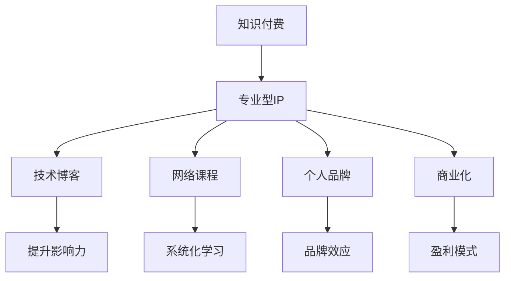

                 

# 打造专业型知识付费IP:程序员的机会

> 关键词：知识付费, 专业型IP, 程序员, 技术博客, 自媒体, 网络课程, 个人品牌, 商业化, 内容创作, 品牌营销

## 1. 背景介绍

### 1.1 问题由来

在互联网经济高速发展的今天，知识付费作为一种新兴的商业模式，正迅速崛起。从线上阅读、视频课程，到线下讲座、咨询辅导，知识付费服务不断拓展边界，满足用户日益增长的知识需求。然而，尽管市场竞争激烈，优质内容供给却相对不足，尤其是针对程序员这一专业型群体的内容更是稀缺。

程序员是互联网行业的中坚力量，长期以来缺乏系统、深入、针对性的学习资源。一方面，他们对于技术快速迭代和应用场景深入理解有着高需求；另一方面，他们对于知识的更新与升华也有着强烈愿望。在这样的背景下，利用程序员对知识的渴求，打造一个专业型知识付费IP，无疑是一个巨大的商机。

### 1.2 问题核心关键点

打造专业型知识付费IP，核心在于：

1. 专业化内容：通过程序员的视角，深入浅出地讲解技术原理、开发技巧和实际案例，提供真正有价值的学习资源。
2. 系统性框架：构建从入门到进阶的知识体系，帮助程序员建立完整的知识结构，提升编程能力。
3. 互动性体验：通过在线讨论、实时互动等方式，与学员建立紧密联系，增强学习效果。
4. 市场化运作：将专业内容商品化，通过广告、会员、课程销售等方式实现盈利。
5. 品牌化推广：打造IP品牌，通过内容、社群、社交媒体等多渠道进行推广，吸引更多目标用户。

本文将从多个维度，全面探讨如何打造一个成功的专业型知识付费IP，帮助程序员实现技术突破和职业发展。

## 2. 核心概念与联系

### 2.1 核心概念概述

1. **知识付费**：指通过付费方式获取知识服务，包括阅读、视频、课程、咨询等，以提高自身价值和学习效率。
2. **专业型IP**：即通过提供专业化、系统化的内容服务，形成具有独特品牌特色的知识型IP，吸引目标用户群体。
3. **程序员**：指在计算机软件、硬件、网络等领域从事开发、测试、运维、管理等工作的专业人员。
4. **技术博客**：指通过撰写技术文章，分享知识经验，提升自身影响力的技术社区。
5. **网络课程**：指通过线上平台，提供系统性、交互性的课程内容，帮助用户掌握新技能。
6. **个人品牌**：指通过持续的内容创作和市场推广，在特定领域建立品牌效应，提升个人知名度。
7. **商业化**：指将知识内容转化为商业模式，通过多元化的盈利方式，实现商业价值。

### 2.2 核心概念原理和架构的 Mermaid 流程图(Mermaid 流程节点中不要有括号、逗号等特殊字符)



这个流程图展示了知识付费IP的各个组成部分及其相互联系：

- **知识付费**：作为IP创建的初衷，是构建内容平台的基础。
- **专业型IP**：连接知识付费、技术博客、网络课程等多个环节，形成独特的品牌效应。
- **技术博客**：通过分享技术经验和案例，提升内容影响力。
- **网络课程**：提供系统化、互动化的学习资源，帮助用户掌握新技能。
- **个人品牌**：通过持续的内容输出和市场推广，建立品牌知名度。
- **商业化**：将内容转化为盈利模式，实现商业价值。

这些环节相互支持，共同推动IP的成功发展。

## 3. 核心算法原理 & 具体操作步骤

### 3.1 算法原理概述

打造专业型知识付费IP，核心算法原理包括：

1. **内容分发算法**：通过用户行为数据分析，实现个性化推荐，提升用户粘性。
2. **社区互动算法**：通过建立互动机制，鼓励用户参与内容创作和反馈，增强社区活跃度。
3. **学习效果评估算法**：通过学习效果反馈，优化课程内容和教学方法，提升学习成效。

### 3.2 算法步骤详解

**Step 1: 内容定位**

- **受众分析**：明确目标受众的年龄、职业、技术水平等特征，了解其学习需求。
- **内容调研**：搜集行业内领先的技术博客、网络课程，分析其受欢迎的原因。
- **课程设计**：设计从入门到进阶的系统化课程结构，确保内容连续性和深度。

**Step 2: 内容创作**

- **技术文章**：撰写深度剖析的技术文章，讲解具体实现和应用案例。
- **视频课程**：录制系统性教学视频，涵盖基础知识、实践技巧和项目实战。
- **在线互动**：设置实时问答环节，回答用户的技术问题，建立互动平台。

**Step 3: 平台搭建**

- **平台选择**：选择合适的知识付费平台，如知乎、简书、网易云课堂等。
- **界面设计**：设计简洁、易用的内容展示界面，提升用户体验。
- **技术支持**：搭建稳定的技术架构，确保平台性能和数据安全。

**Step 4: 营销推广**

- **内容推广**：通过社交媒体、技术博客等渠道进行内容推广，吸引目标用户。
- **品牌建设**：建立独特的IP品牌形象，设计专属标志和口号。
- **用户互动**：通过线上社群、线下活动等方式，增强用户粘性和品牌忠诚度。

### 3.3 算法优缺点

专业型知识付费IP的优点包括：

1. **市场潜力大**：程序员群体庞大，技术更新快，知识需求持续增长。
2. **技术含量高**：内容涉及深度技术原理和实践技巧，价值高。
3. **互动性强**：通过实时互动、社群讨论等方式，提升学习效果。
4. **盈利模式多样**：包括付费订阅、课程销售、广告收益等，多元化盈利。

同时，其缺点也不容忽视：

1. **内容创作难度大**：需要具备深厚的技术背景和丰富的实战经验。
2. **用户需求多样化**：不同用户的技术水平和兴趣点不同，难以满足多样化需求。
3. **平台运营复杂**：需要持续的内容输出和平台维护，投入较大。
4. **竞争激烈**：市场上有大量免费资源和高质量付费内容，难以脱颖而出。

### 3.4 算法应用领域

专业型知识付费IP主要应用于以下领域：

- **技术博客**：如CSDN、博客园、简书等，通过撰写技术文章，分享知识经验。
- **网络课程**：如网易云课堂、Udemy、Coursera等，提供系统化、交互性的学习资源。
- **线上社区**：如知乎、Stack Overflow、Reddit等，通过实时互动、社群讨论等方式，增强用户粘性。
- **线下活动**：如技术沙龙、编程马拉松、技术讲座等，面对面交流，提升学习效果。

## 4. 数学模型和公式 & 详细讲解 & 举例说明

### 4.1 数学模型构建

在知识付费IP的运营过程中，可以建立以下数学模型：

- **用户行为分析模型**：通过用户行为数据（如浏览时间、互动次数、课程评分等），建立用户兴趣模型，实现个性化推荐。
- **课程效果评估模型**：通过学习效果反馈（如完成率、测验成绩、用户评价等），评估课程质量和教学效果，进行持续优化。
- **互动效果评估模型**：通过互动数据（如提问数、评论数、点赞数等），评估社区活跃度和用户参与度。

### 4.2 公式推导过程

以用户行为分析模型为例，推导其核心公式：

$$
P=\frac{U}{I}
$$

其中，$P$ 为个性化推荐概率，$U$ 为用户行为数据，$I$ 为用户兴趣模型。

通过分析用户行为数据，建立用户兴趣模型 $I$，然后计算个性化推荐概率 $P$，实现精准推荐。

### 4.3 案例分析与讲解

**案例分析**：以知乎为例，通过分析用户浏览、评论、点赞等行为数据，建立用户兴趣模型，实现内容的个性化推荐。

**讲解**：知乎通过大数据分析，结合用户历史行为数据和热门内容标签，实现内容推荐算法，提升用户粘性。具体步骤包括：
1. 数据收集：收集用户的行为数据，如浏览次数、评论数、点赞数等。
2. 数据处理：对数据进行清洗、归一化、特征提取等预处理。
3. 模型训练：使用机器学习算法，如协同过滤、内容过滤等，建立用户兴趣模型。
4. 推荐实现：根据用户兴趣模型，计算推荐概率，生成个性化内容推荐列表。

## 5. 项目实践：代码实例和详细解释说明

### 5.1 开发环境搭建

**Step 1: 环境配置**

- **Python环境**：安装Anaconda或Miniconda，创建虚拟环境。
- **开发工具**：安装Visual Studio Code、PyCharm等IDE，配置Git、GitHub等版本控制工具。
- **数据处理**：准备必要的用户行为数据，如浏览记录、互动数据等。

**Step 2: 平台搭建**

- **网站搭建**：使用Django、Flask等Web框架，搭建知识付费平台。
- **数据库配置**：选择MySQL、PostgreSQL等关系型数据库，配置数据表。
- **API接口**：设计API接口，提供课程订阅、互动评论等功能。

### 5.2 源代码详细实现

以下是一个简单的技术博客文章发布和评论功能的代码实现：

**博客发布功能**：

```python
from flask import Flask, request, jsonify

app = Flask(__name__)

@app.route('/article', methods=['POST'])
def create_article():
    data = request.get_json()
    title = data['title']
    content = data['content']
    # 将博客文章保存到数据库
    save_to_database(title, content)
    return jsonify({'success': True})

@app.route('/article', methods=['GET'])
def get_articles():
    articles = get_articles_from_database()
    return jsonify(articles)
```

**评论功能**：

```python
@app.route('/comment', methods=['POST'])
def create_comment():
    data = request.get_json()
    article_id = data['article_id']
    comment = data['comment']
    # 将评论保存到数据库
    save_to_database(article_id, comment)
    return jsonify({'success': True})

@app.route('/comments', methods=['GET'])
def get_comments():
    article_id = request.args.get('id')
    comments = get_comments_from_database(article_id)
    return jsonify(comments)
```

### 5.3 代码解读与分析

**博客发布功能**：

- **数据接收**：使用Flask框架的`request.get_json()`方法，从请求体中获取JSON格式的数据。
- **数据处理**：提取博客文章的标题和内容。
- **数据库操作**：将博客文章保存到数据库中。
- **响应生成**：使用`jsonify`方法，将成功响应以JSON格式返回。

**评论功能**：

- **数据接收**：与博客发布类似，提取文章ID和评论内容。
- **数据库操作**：将评论保存到数据库中。
- **响应生成**：返回成功响应。

以上代码展示了Flask框架的基础功能，包括路由定义、数据接收、数据处理、数据库操作和响应生成。实际开发中，还需要进一步完善用户权限、数据安全、性能优化等方面的功能。

### 5.4 运行结果展示

**博客发布**：
- **界面展示**：用户可以访问博客发布页面，输入标题和内容，提交后保存成功。
- **数据展示**：通过后端API，获取所有博客文章，并在前端展示。

**评论功能**：
- **界面展示**：用户可以访问文章详情页面，查看评论并发表新评论。
- **数据展示**：通过后端API，获取指定文章的评论列表，并在前端展示。

## 6. 实际应用场景

### 6.1 技术博客平台

**应用场景**：程序员可以通过技术博客平台分享自己的技术文章和心得，提升个人影响力。平台可以提供编辑器、发布管理、分类标签等功能。

**具体实现**：程序员使用编辑器撰写技术文章，发布后自动保存到数据库。平台提供文章浏览、评论、点赞等互动功能，并根据用户行为数据实现个性化推荐。

### 6.2 网络课程平台

**应用场景**：网络课程平台提供系统化的编程课程，帮助程序员掌握新技术和新工具。课程形式包括视频、文档、实验项目等。

**具体实现**：平台邀请知名程序员录制课程视频，设计课程内容和结构，并配备习题和实验项目。用户通过订阅课程，获取完整的学习资源，并参与课程互动。

### 6.3 在线社区平台

**应用场景**：在线社区平台提供程序员交流讨论的空间，建立技术社群，促进知识共享和技能提升。社区可以涵盖问答、讨论、项目分享等形式。

**具体实现**：平台搭建问答系统，邀请专家定期回答技术问题。用户可以发布技术文章和项目，邀请其他用户评论和讨论。平台提供积分和等级制度，激励用户积极参与。

### 6.4 未来应用展望

随着技术的发展和市场的成熟，未来专业型知识付费IP将面临更多新的应用场景和机遇：

1. **虚拟技术培训**：利用虚拟现实和增强现实技术，提供沉浸式学习体验，增强用户互动。
2. **智能学习助手**：开发智能推荐系统，根据用户学习进度和兴趣，动态调整课程推荐，提供个性化学习方案。
3. **跨平台应用**：通过多终端支持，提升用户学习便捷性，如移动端、Web端、桌面端等。
4. **企业内训**：为大型企业提供定制化的技术培训和内部知识共享，提升团队技术水平和知识储备。
5. **国际交流**：通过国际化布局，吸引全球程序员参与内容创作和交流，提升平台国际影响力。

## 7. 工具和资源推荐

### 7.1 学习资源推荐

1. **在线课程**：
   - **Coursera**：提供大量计算机科学和技术领域的在线课程。
   - **Udacity**：提供针对程序员的编程和数据科学课程。
   - **edX**：提供麻省理工学院、哈佛大学等知名高校的在线课程。

2. **技术博客**：
   - **CSDN**：国内知名的技术博客平台，涵盖各种编程语言和技术栈。
   - **博客园**：提供丰富的编程经验和技术分享。
   - **Medium**：国外知名的技术博客平台，汇聚大量高质量文章。

3. **编程工具**：
   - **Visual Studio Code**：开源的代码编辑器，支持多语言编程。
   - **PyCharm**：专业的Python开发工具，提供丰富的插件和集成功能。
   - **GitHub**：全球最大的代码托管平台，方便版本控制和代码协作。

### 7.2 开发工具推荐

1. **Web框架**：
   - **Flask**：轻量级Web框架，适合快速开发和扩展。
   - **Django**：全功能的Web框架，提供丰富的插件和模型工具。
   - **FastAPI**：高性能的Web框架，支持异步编程和自动生成API。

2. **数据库**：
   - **MySQL**：流行的关系型数据库，支持高并发和高可用性。
   - **PostgreSQL**：功能强大的关系型数据库，支持复杂的查询和分析。
   - **MongoDB**：非关系型数据库，适合处理大规模非结构化数据。

3. **云平台**：
   - **AWS**：亚马逊云平台，提供丰富的云服务资源。
   - **Azure**：微软云平台，支持混合云和边缘计算。
   - **Google Cloud**：谷歌云平台，提供强大的AI和机器学习工具。

### 7.3 相关论文推荐

1. **知识付费研究**：
   - **Knowledge Service Pricing: An Experimental Comparison of Demand Estimation Algorithms**：分析知识付费平台的用户行为和价格策略。
   - **User Behavior in Knowledge Marketplaces**：研究用户在知识付费平台上的行为模式和消费决策。
   - **A Survey of Human Computation and Crowdsourcing in Digital Markets**：综述人机协同和众包技术在知识付费中的应用。

2. **编程技术**：
   - **Software Engineering in the Age of Artificial Intelligence**：探讨AI技术对软件开发的影响和应用。
   - **Practical Programming Patterns and Techniques**：提供实用的编程模式和技术工具，提升开发效率。
   - **Design Patterns: Elements of Reusable Object-Oriented Software**：经典的软件设计模式，帮助构建可维护的代码结构。

3. **内容运营**：
   - **The Content Marketing Handbook**：提供全面的内容营销策略和运营方法。
   - **Content Marketing Strategy and Execution**：实战指南，帮助企业构建内容营销体系。
   - **The Future of Content Marketing**：探讨内容营销的未来趋势和技术变革。

## 8. 总结：未来发展趋势与挑战

### 8.1 研究成果总结

本文从多个角度探讨了打造专业型知识付费IP的可行性，包括内容创作、平台搭建、市场推广和商业化运作。通过实例分析，展示了知识付费IP的实施路径和实际效果。

### 8.2 未来发展趋势

未来专业型知识付费IP将呈现以下发展趋势：

1. **技术融合**：与AI、AR/VR等技术结合，提升学习体验和互动效果。
2. **个性化推荐**：通过大数据和机器学习，实现个性化内容推荐，提升用户粘性。
3. **多终端支持**：支持多终端设备，提升用户使用便捷性。
4. **国际化布局**：吸引全球用户，提升平台国际影响力。
5. **商业多元化**：通过多种盈利方式，实现平台可持续发展。

### 8.3 面临的挑战

在打造专业型知识付费IP的过程中，可能面临以下挑战：

1. **内容质量**：高质量的内容创作需要时间和精力，难以快速产出。
2. **市场竞争**：平台众多，用户选择多样化，难以脱颖而出。
3. **技术门槛**：需要具备一定的技术背景和开发经验，门槛较高。
4. **用户维护**：用户粘性低，需要持续的内容更新和互动。
5. **商业可持续**：盈利模式单一，难以实现可持续发展。

### 8.4 研究展望

未来的研究方向可以从以下几个方面进行：

1. **内容创新**：开发更多新颖的编程技术、工具和实战案例，提升内容吸引力。
2. **技术优化**：优化平台架构，提升性能和安全性，降低开发和运维成本。
3. **市场细分**：细分目标用户群体，提供更有针对性的内容和服务。
4. **用户运营**：通过数据驱动的用户运营策略，提升用户参与度和转化率。
5. **国际拓展**：拓展全球市场，提高国际影响力，吸引更多全球程序员参与。

## 9. 附录：常见问题与解答

**Q1: 如何提高知识付费IP的内容质量？**

A: 提高内容质量的关键在于不断创新和优化：
1. **专家团队**：邀请行业内的专家和知名开发者，确保内容的权威性和深度。
2. **用户反馈**：定期收集用户反馈，及时调整内容方向和结构。
3. **持续更新**：定期发布新内容和技术更新，保持内容的新鲜度。
4. **互动机制**：建立互动机制，鼓励用户参与内容创作和反馈，增强社区活跃度。

**Q2: 如何降低知识付费IP的运营成本？**

A: 运营成本的控制主要依赖于高效的资源利用和管理：
1. **技术优化**：使用开源工具和框架，降低开发和运维成本。
2. **自动化流程**：引入自动化测试和部署工具，提高生产效率。
3. **社区共建**：建立社区，鼓励用户贡献内容，减少内容生产和维护成本。
4. **数据驱动**：通过数据分析，优化内容推荐和运营策略，降低运营成本。

**Q3: 如何提升知识付费IP的用户粘性？**

A: 提升用户粘性需要从用户体验和互动机制入手：
1. **个性化推荐**：通过大数据和机器学习，实现个性化内容推荐，提升用户粘性。
2. **互动机制**：建立互动机制，如实时问答、在线讨论等，增强用户参与感。
3. **激励机制**：引入积分、等级等激励机制，提升用户活跃度。
4. **持续更新**：定期发布新内容和技术更新，保持内容的新鲜度。

**Q4: 如何平衡知识付费IP的商业化与用户需求？**

A: 平衡商业化和用户需求需要策略性操作：
1. **多样化盈利**：提供多种盈利方式，如付费订阅、课程销售、广告收益等，多元化盈利。
2. **用户反馈**：定期收集用户反馈，及时调整内容方向和盈利策略，确保用户需求得到满足。
3. **透明化运营**：公开运营数据和收益情况，增加用户信任感。
4. **用户体验**：优先考虑用户体验，避免过度商业化带来的负面影响。

**Q5: 如何提升知识付费IP的品牌影响力？**

A: 提升品牌影响力需要全方位的多渠道推广：
1. **社交媒体**：通过各大社交媒体平台进行内容推广，吸引更多目标用户。
2. **内容营销**：通过撰写高质量的博客文章和技术文章，提升品牌知名度。
3. **合作推广**：与行业内的知名博客和媒体合作，提升品牌影响力。
4. **用户互动**：通过线上社群、线下活动等方式，增强用户粘性和品牌忠诚度。

---

作者：禅与计算机程序设计艺术 / Zen and the Art of Computer Programming

