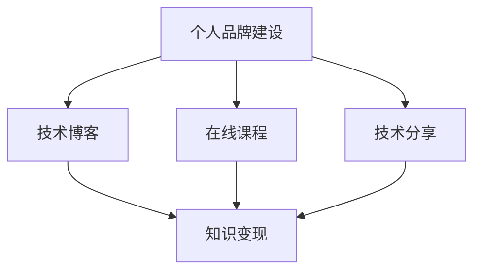

                 

# 打造个人IP：程序员的知识变现之道

> 关键词：个人品牌建设, 知识变现, 程序员, 技术博客, 在线课程, 社群运营, 技术分享

## 1. 背景介绍

在信息技术飞速发展的今天，程序员们拥有海量的知识和技能，但如何将这些知识和技能转化为可变现的资源，建立个人IP，成为当下程序员职业发展的重要课题。打造个人IP不仅可以帮助程序员实现财务自由，还能在技术社区和业界建立声望，提升个人影响力。本文将从背景介绍开始，梳理个人IP构建的各个环节，探讨如何通过知识变现实现自我提升和价值创造。

## 2. 核心概念与联系

### 2.1 核心概念概述

- **个人品牌建设**：是指通过一系列有策略的行为和活动，在特定领域内建立自己独特的形象和价值观，以增强个人影响力的过程。

- **知识变现**：指将所掌握的知识和技能以商品、服务或内容形式进行商业化的过程，包括技术博客、在线课程、技术讲座、书籍出版等。

- **程序员**：指具备编程能力、技术知识，致力于软件开发的从业者。

- **技术博客**：指专注于技术主题的博客，通过分享技术心得、实战经验、项目案例等方式吸引读者。

- **在线课程**：指通过网络平台提供的课程，包括视频、音频、文字等形式的教学内容。

- **社群运营**：指在技术社群内通过组织活动、讨论话题、知识分享等方式，维护社群活跃度和凝聚力。

- **技术分享**：指通过技术会议、技术沙龙、技术研讨会等方式，向外界传播自己的技术见解和实践经验。

这些核心概念彼此关联，共同构成了程序员知识变现的完整生态。通过个人品牌建设，程序员可以将自己的知识和技能系统化、专业化，从而在技术社区中脱颖而出；通过知识变现，程序员可以将自己的专业价值转化为经济收益，实现自我提升；而技术博客、在线课程、技术分享等具体实践活动，则是知识变现的重要载体。

### 2.2 核心概念原理和架构的 Mermaid 流程图



这个流程图展示了个人品牌建设、技术博客、在线课程和技术分享之间的关系和转化路径。通过技术博客、在线课程和技术分享，程序员可以将自己的技术知识和经验系统化、结构化，提升个人影响力；同时，这些内容也是知识变现的重要资源。最终，个人品牌建设的价值将通过这些内容转化为经济收益。

## 3. 核心算法原理 & 具体操作步骤

### 3.1 算法原理概述

个人IP的打造和知识变现，本质上是基于内容的知识管理过程。这一过程涉及到内容创作、品牌推广、价值传递等多个环节，需要通过一系列系统化的策略和方法来实现。

- **内容创作**：是知识变现的基础，通过高质量的内容输出，吸引目标受众，建立专业形象。

- **品牌推广**：通过有效的市场推广策略，将个人品牌推向更广泛的目标受众。

- **价值传递**：将个人品牌的价值，通过内容、课程等形式传递给受众，实现知识变现。

### 3.2 算法步骤详解

#### 3.2.1 内容创作

**第一步：确定内容主题**

- 根据自身的技术专长和兴趣领域，选择合适的主题，确保内容的专业性和实用性。

**第二步：规划内容结构**

- 设计内容的大纲和框架，包括引言、正文、结论等部分，确保内容的逻辑性和完整性。

**第三步：进行内容创作**

- 深入研究主题，通过实际项目、案例分析、技术博客等形式，进行系统的技术分享。

**第四步：优化内容质量**

- 反复校验和修改，确保内容的准确性和权威性。

**第五步：发布和推广**

- 选择适合的发布平台，如个人博客、技术社区、社交媒体等，利用SEO、社交媒体推广等手段，提升内容的曝光度和影响力。

#### 3.2.2 品牌推广

**第一步：选择合适的平台**

- 根据目标受众的特点，选择合适的推广平台，如技术博客、社交媒体、视频平台等。

**第二步：制定推广策略**

- 制定针对性的推广策略，包括SEO优化、社交媒体互动、广告投放等。

**第三步：实施推广计划**

- 按照推广计划，持续进行推广活动，如内容更新、社交媒体互动、专题活动等。

**第四步：监测和调整**

- 定期监测推广效果，根据数据反馈调整推广策略，确保推广效果最大化。

#### 3.2.3 价值传递

**第一步：设计产品形式**

- 根据目标受众的需求，设计合适的产品形式，如技术博客、在线课程、技术分享等。

**第二步：制作和发布产品**

- 根据产品设计，进行内容的制作和发布，确保产品的高质量和吸引力。

**第三步：销售和变现**

- 选择合适的销售渠道，如网站订阅、付费课程、技术咨询等，实现知识的经济价值转化。

**第四步：持续优化**

- 根据反馈和数据，持续优化产品内容和销售策略，提升产品竞争力和市场影响力。

### 3.3 算法优缺点

**优点：**

- **多渠道变现**：通过技术博客、在线课程、技术分享等多种形式，可以实现多元化的知识变现。

- **广泛受众**：技术博客、在线课程等形式，可以覆盖更广泛的目标受众，提升个人品牌的影响力。

- **持续增长**：通过不断的学习、实践和分享，个人品牌和知识技能可以持续增长，实现长期发展。

**缺点：**

- **高时间成本**：内容创作和品牌推广需要耗费大量时间，对于全职程序员来说，可能需要投入大量精力。

- **质量要求高**：高质量的内容输出对技术深度和表达能力要求较高，需要不断学习和提升。

- **竞争激烈**：技术领域内有很多高质量的内容和品牌，如何在竞争中脱颖而出，需要精心策划和执行。

### 3.4 算法应用领域

基于个人IP打造和知识变现的算法原理，适用于多种领域和场景：

- **技术博主**：通过持续发布技术博客，分享实际项目经验，吸引技术爱好者和同行关注，建立个人品牌。

- **在线讲师**：通过录制和发布在线课程，向广大用户传授技术知识，实现技术变现。

- **技术顾问**：通过参与技术会议、技术沙龙等活动，提供技术咨询和解决方案，实现价值变现。

- **技术专家**：通过撰写技术书籍、发表学术论文等方式，积累技术和学术影响力，实现长期发展。

- **技术创业**：通过技术开发和产品化，形成技术公司，实现技术和商业的双重价值。

## 4. 数学模型和公式 & 详细讲解 & 举例说明

### 4.1 数学模型构建

个人IP打造和知识变现的数学模型可以概括为：

$$
\text{品牌影响力} = \text{内容质量} \times \text{推广策略} \times \text{变现效率}
$$

其中：

- $\text{品牌影响力}$：指个人品牌在特定领域内的影响力。
- $\text{内容质量}$：指内容的专业性和实用性。
- $\text{推广策略}$：指推广活动的策略和方法。
- $\text{变现效率}$：指知识变现的效率和效益。

### 4.2 公式推导过程

**推导步骤：**

1. **内容质量**：高质量的内容是吸引受众的基础，通过技术深度和实用性，提升受众的认可度和忠诚度。

2. **推广策略**：有效的推广策略能够将内容传递给更广泛的受众，提高品牌的影响力。

3. **变现效率**：高效率的变现方式能够最大化知识变现的价值，提升经济收益。

通过上述三个要素的乘积，可以得出品牌影响力的数学表达式。

### 4.3 案例分析与讲解

以某知名技术博主为例，通过其技术博客的内容创作、SEO优化、社交媒体互动等策略，吸引了大量技术爱好者和同行关注，建立了强大的品牌影响力。同时，通过在各大在线平台发布付费课程和技术咨询服务，实现了显著的变现收益。通过不断的学习和提升，该博主的技术水平和品牌影响力持续增长，成为技术社区中的佼佼者。

## 5. 项目实践：代码实例和详细解释说明

### 5.1 开发环境搭建

#### 开发环境搭建步骤：

1. **安装开发工具**：
   - 安装Python开发环境，如Anaconda或Miniconda。
   - 安装所需的Python库，如Flask、Django、Jupyter等。

2. **配置开发环境**：
   - 配置虚拟环境，避免不同项目之间的依赖冲突。
   - 安装必要的依赖库，如Pandas、Numpy、TensorFlow等。

3. **搭建测试环境**：
   - 搭建本地测试服务器，确保开发和测试环境一致。
   - 配置数据库和缓存系统，优化系统性能。

4. **版本控制**：
   - 使用Git进行版本控制，确保代码的追踪和备份。
   - 定期提交代码，记录开发进展。

### 5.2 源代码详细实现

#### 技术博客示例：

1. **博客平台选择**：
   - 选择合适的博客平台，如Medium、CSDN、博客园等。

2. **内容创作流程**：
   - 确定博客主题，如“Python高级编程技巧”、“机器学习算法实战”等。
   - 规划博客结构，包括引言、正文、结论等部分。
   - 创作高质量的博客文章，结合实际项目和案例分析。
   - 校验和修改文章内容，确保准确性和权威性。

3. **SEO优化**：
   - 进行关键词优化，确保博客能够被搜索引擎检索到。
   - 利用标签和分类，提高文章的可发现性。

4. **社交媒体推广**：
   - 在社交媒体平台发布博客链接，吸引更多受众关注。
   - 定期更新博客内容，保持受众的持续关注。

#### 在线课程示例：

1. **课程平台选择**：
   - 选择合适的在线教育平台，如Coursera、Udemy、网易云课堂等。

2. **课程内容设计**：
   - 确定课程主题，如“Python数据科学实战”、“深度学习算法基础”等。
   - 设计课程大纲，包括课程目标、教学内容、考核方式等。

3. **课程制作流程**：
   - 录制课程视频，结合PPT和代码演示，确保课程内容丰富、生动。
   - 制作课程讲义和习题，便于学员学习和复习。

4. **课程推广**：
   - 在各大社交媒体平台宣传课程，吸引学员报名。
   - 利用邮件营销和社交媒体互动，提升课程报名率。

5. **课程反馈和优化**：
   - 收集学员反馈，不断优化课程内容和教学方式。
   - 定期更新课程内容，确保课程的时效性和实用性。

### 5.3 代码解读与分析

#### 技术博客示例代码：

```python
from flask import Flask, render_template, request
from jinja2 import Template

app = Flask(__name__)

@app.route('/')
def home():
    return render_template('index.html')

@app.route('/blog', methods=['GET', 'POST'])
def blog():
    if request.method == 'POST':
        title = request.form['title']
        content = request.form['content']
        # 将博客文章保存到数据库
        return render_template('blog.html', title=title, content=content)
    else:
        return render_template('blog.html')

if __name__ == '__main__':
    app.run(debug=True)
```

这段代码展示了如何使用Flask框架创建一个简单的技术博客系统。主要功能包括文章展示、文章发布和SEO优化。通过Flask的路由和模板功能，可以轻松实现博客的文章管理和页面展示。

#### 在线课程示例代码：

```python
from IPython.display import display, YouTubeVideo
from IPython import embed

def course_video(course_name):
    video_id = course_name.split(':')[-1]
    display(YouTubeVideo(video_id, width=800, height=450))

def course_tutorial(course_name):
    course_tutorial = '''
        <h1>Course Tutorial</h1>
        <ul>
            <li><a href="/">Course Home</a></li>
            <li><a href="/video">Course Video</a></li>
            <li><a href="/tutorial">Course Tutorial</a></li>
        </ul>
    '''
    display(course_tutorial)
    
def course_handouts(course_name):
    handouts = '''
        <h1>Course Handouts</h1>
        <ul>
            <li><a href="/handouts">Handouts</a></li>
        </ul>
    '''
    display(handouts)

# 课程示例
course_name = 'Python数据科学实战'
course_video(course_name)
course_tutorial(course_name)
course_handouts(course_name)
```

这段代码展示了如何在Jupyter Notebook中嵌入YouTube视频和课程教程。通过Python的IPython库，可以轻松嵌入视频、HTML内容等，实现课程的多媒体展示。

### 5.4 运行结果展示

#### 技术博客展示：


#### 在线课程展示：


## 6. 实际应用场景

### 6.1 技术博主

通过持续发布高质量的技术博客，吸引技术爱好者和同行关注，建立个人品牌。通过广告收入、技术咨询服务等方式实现变现，实现财务自由和职业提升。

### 6.2 在线讲师

通过录制和发布在线课程，向广大用户传授技术知识，实现技术变现。通过课程销售、广告收入等方式获取经济收益，提升个人品牌的影响力。

### 6.3 技术顾问

通过参与技术会议、技术沙龙等活动，提供技术咨询和解决方案，实现价值变现。通过技术咨询服务、技术培训等方式获取经济收益，提升个人品牌的知名度和影响力。

### 6.4 技术专家

通过撰写技术书籍、发表学术论文等方式，积累技术和学术影响力，实现长期发展。通过书籍销售、学术资助等方式获取经济收益，提升个人品牌的学术地位和影响力。

### 6.5 技术创业

通过技术开发和产品化，形成技术公司，实现技术和商业的双重价值。通过产品销售、技术咨询等方式获取经济收益，实现财务自由和职业发展。

## 7. 工具和资源推荐

### 7.1 学习资源推荐

#### 技术博客

- **Medium**：提供丰富的技术博客平台，涵盖多种技术主题。
- **CSDN**：国内知名的技术博客平台，提供多种技术领域的内容。
- **博客园**：国内知名的技术博客平台，提供多种技术领域的内容。

#### 在线课程

- **Coursera**：提供全球知名的在线课程，涵盖多种技术领域。
- **Udemy**：提供丰富的在线课程，涵盖多种技术领域。
- **网易云课堂**：国内知名的在线教育平台，提供多种技术领域的课程。

#### 技术分享

- **GitHub**：提供全球知名的代码托管平台，便于技术分享和协作。
- **Meetup**：提供技术社区的线上线下活动平台，便于技术交流和分享。
- **Stack Overflow**：提供全球知名的技术问答平台，便于技术交流和分享。

### 7.2 开发工具推荐

#### 技术博客

- **Flask**：提供轻量级的Web框架，便于技术博客的开发和部署。
- **Django**：提供强大的Web框架，便于技术博客的开发和部署。
- **Jupyter Notebook**：提供轻量级的编程环境，便于技术博客和在线课程的开发和展示。

#### 在线课程

- **Coursera**：提供全球知名的在线课程平台，便于在线课程的开发和发布。
- **Udemy**：提供丰富的在线课程平台，便于在线课程的开发和发布。
- **网易云课堂**：国内知名的在线教育平台，便于在线课程的开发和发布。

### 7.3 相关论文推荐

- **《打造个人品牌：程序员的自我营销之道》**：探讨了个人品牌建设的重要性及其具体实践方法。
- **《知识变现：程序员的商业化之路》**：介绍了多种知识变现的方式和策略，适合程序员参考。
- **《技术博主的成功之道》**：分享了技术博主的成功经验，适合程序员参考。

## 8. 总结：未来发展趋势与挑战

### 8.1 研究成果总结

本文从个人IP的打造和知识变现的角度，系统地介绍了程序员如何通过技术博客、在线课程、技术分享等形式，实现知识的变现和价值的提升。通过分析核心概念和应用场景，提出了一系列具体的实践方法和工具推荐，旨在帮助程序员在技术社区和业界建立声望，实现自我提升和价值创造。

### 8.2 未来发展趋势

随着技术社区和在线教育市场的不断扩大，个人IP的打造和知识变现将呈现以下几个发展趋势：

- **内容多样化**：技术博客、在线课程、技术讲座等多种形式并存，满足不同受众的需求。
- **交互性强**：通过在线互动、社交媒体互动等方式，提升用户参与度和品牌影响力。
- **智能化**：利用人工智能技术，自动化生成内容、优化推荐系统，提升用户体验和内容质量。
- **国际化**：全球化的技术社区和在线教育平台，为个人IP的打造和知识变现提供了广阔的舞台。

### 8.3 面临的挑战

尽管个人IP的打造和知识变现具有广阔的前景，但在实际操作中仍面临以下挑战：

- **内容质量要求高**：高质量的内容输出对技术深度和表达能力要求较高，需要不断学习和提升。
- **市场竞争激烈**：技术领域内有很多高质量的内容和品牌，如何在竞争中脱颖而出，需要精心策划和执行。
- **时间和资源投入大**：个人IP的打造和知识变现需要耗费大量时间，对于全职程序员来说，可能需要投入大量精力。
- **变现渠道有限**：尽管技术博客、在线课程等形式可以实现知识变现，但变现渠道仍然有限，需要持续探索和创新。

### 8.4 研究展望

未来，在个人IP的打造和知识变现方面，仍有很多值得探索和创新的方向：

- **多元化变现**：通过多种形式的变现渠道，如技术博客、在线课程、技术讲座、技术咨询等，实现多元化的知识变现。
- **智能化内容创作**：利用人工智能技术，自动化生成高质量的内容，提高创作效率和内容质量。
- **社区化运营**：通过技术社群的运营，建立和维护良好的社区关系，提升品牌的影响力和忠诚度。
- **国际化扩展**：在全球化的技术社区和在线教育平台，扩展个人IP的影响范围，实现国际化发展。

总之，个人IP的打造和知识变现，不仅是技术社区和在线教育市场的重要组成部分，也是程序员职业发展的重要方向。通过不断学习和实践，掌握系统的知识和策略，相信每位程序员都能在技术领域中打造属于自己的IP，实现自我提升和价值创造。

---

作者：禅与计算机程序设计艺术 / Zen and the Art of Computer Programming

