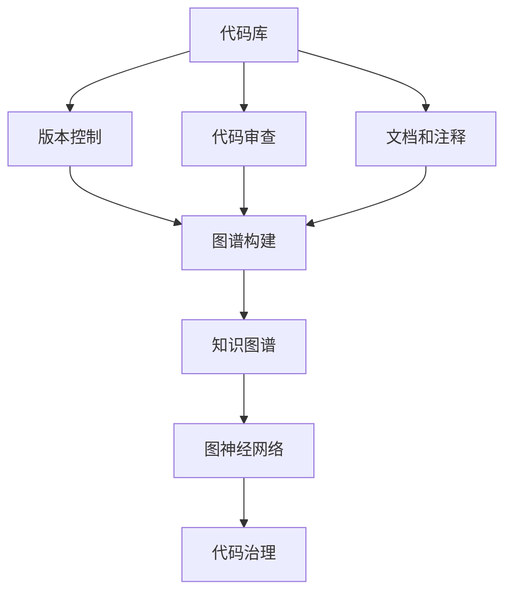

                 

# 打造个人知识图谱:程序员的实践之路

> 关键词：知识图谱, 程序员, 图神经网络, 代码治理, 版本控制, 代码审查, 数据可视化

## 1. 背景介绍

### 1.1 问题由来
在现代软件开发中，随着项目规模的不断扩大和代码基数的持续增加，如何高效地管理和利用庞大的代码库，成为了每个程序员面临的巨大挑战。如何构建一个全面、结构化、易于导航的知识图谱，来梳理和组织项目中的代码、模块、依赖关系等关键信息，成为了一个重要的课题。

在知识图谱的构建过程中，图神经网络（Graph Neural Networks, GNNs）作为核心算法，因其在处理图结构数据时的优越表现，成为了构建程序员个人知识图谱的关键技术。通过图神经网络，可以有效地整合代码库中的各种信息，帮助程序员快速定位问题、理解代码逻辑、发现潜在缺陷等，从而大幅提升开发效率和代码质量。

### 1.2 问题核心关键点
构建个人知识图谱的关键点在于如何有效地将代码库中的各种信息整合并结构化，使其成为易于搜索和使用的知识库。具体来说，关键点包括：

- 选择合适的数据源：包括代码库、文档、注释、第三方依赖等，全面获取项目信息。
- 设计合理的图结构：如何定义代码、模块、函数、类等元素之间的关系，以及这些关系如何影响最终的图结构。
- 使用高效的算法：选择合适的图神经网络算法来构建和查询图谱，保证数据处理效率和模型准确性。
- 整合上下文信息：将版本控制信息、代码审查评论、测试结果等上下文信息融合到图谱中，提升查询和分析的准确性。
- 数据可视化和交互设计：设计直观、易用的用户界面，帮助程序员快速获取和理解知识图谱中的信息。

本文将围绕这些关键点，深入探讨如何利用图神经网络构建个人知识图谱，并应用于程序员的日常开发和代码治理中。

## 2. 核心概念与联系

### 2.1 核心概念概述

为了更好地理解知识图谱的构建过程，本节将介绍几个关键的概念及其联系：

- 知识图谱（Knowledge Graph）：由节点（Node）和边（Edge）组成的网络，用于表示实体之间的语义关系。在程序员的个人知识图谱中，节点可以表示代码文件、函数、变量等，边可以表示调用关系、继承关系、引用关系等。
- 图神经网络（Graph Neural Networks, GNNs）：一类专门处理图结构数据的神经网络模型。图神经网络可以通过聚合节点和边的特征，学习节点的表示，从而在图结构数据上执行各种任务，如节点分类、图分类、链接预测等。
- 代码治理（Code Governance）：涉及代码审查、版本控制、代码重构、代码质量等过程，目的是确保代码库的健康和可持续性。
- 版本控制（Version Control）：通过跟踪代码的变更历史，帮助团队协作，确保代码库的安全和稳定。
- 代码审查（Code Review）：通过人工或自动化的方式，对代码变更进行检查和审核，提升代码质量。

这些概念之间的联系可以通过以下Mermaid流程图来展示：



这个流程图展示了一些关键概念及其之间的逻辑关系：

1. 代码库是所有开发活动的基础。
2. 版本控制跟踪代码的变更历史。
3. 代码审查提升代码质量。
4. 文档和注释提供代码的背景信息。
5. 这些信息通过图神经网络构建知识图谱。
6. 知识图谱为代码治理提供支持。

## 3. 核心算法原理 & 具体操作步骤
### 3.1 算法原理概述

知识图谱的构建，本质上是一个图结构数据的表示和处理问题。其核心思想是：将代码库中的各种信息转换为节点和边，利用图神经网络学习节点表示，从而构建一个高效、结构化的知识库。

具体来说，知识图谱的构建步骤如下：

1. 数据收集：收集代码库中的各种信息，如代码文件、函数、类、变量、注释、调用关系、引用关系等。
2. 图结构设计：定义节点和边，以及它们之间的关系。例如，一个函数可以是一个节点，它到其他函数、变量、类等的调用关系可以作为边。
3. 特征提取：为每个节点提取特征，包括代码片段、函数签名、变量类型、文档字符串等。
4. 图神经网络训练：使用图神经网络模型学习节点表示，如GNN模型的GraphSAGE、GCN、GAT等。
5. 图谱构建：将学习到的节点表示整合成一个图结构，形成知识图谱。
6. 图谱查询和分析：使用图神经网络进行查询和分析，如搜索函数调用关系、计算代码复杂度、发现潜在缺陷等。

### 3.2 算法步骤详解

知识图谱的构建步骤如下：

**Step 1: 数据收集**
- 从版本控制系统（如Git、SVN等）中获取代码变更历史。
- 从代码审查工具（如GitHub、Bitbucket等）中提取代码审查评论。
- 从文档系统中（如Confluence、Wiki等）获取代码文档和注释。
- 从依赖管理系统（如Maven、NPM等）中获取第三方依赖关系。

**Step 2: 图结构设计**
- 定义节点类型：代码文件、函数、变量、类等。
- 定义边类型：调用关系、继承关系、引用关系等。
- 设计图谱的层级结构：例如，顶级节点为代码库，下级节点为代码文件、函数、变量等。

**Step 3: 特征提取**
- 提取代码的特征：函数签名、变量类型、函数注释等。
- 提取调用关系的特征：调用次数、调用频率、函数大小等。
- 提取文档和注释的特征：文本词频、TF-IDF、关键词等。

**Step 4: 图神经网络训练**
- 选择图神经网络模型：如GraphSAGE、GCN、GAT等。
- 定义损失函数：如交叉熵损失、均方误差损失等。
- 设置训练参数：如学习率、批大小、迭代轮数等。

**Step 5: 图谱构建**
- 将学习到的节点表示整合成图结构，形成知识图谱。
- 进行图谱的优化和验证，确保数据的一致性和准确性。

**Step 6: 图谱查询和分析**
- 使用图神经网络进行图谱查询，如搜索函数调用关系、计算代码复杂度等。
- 设计直观、易用的用户界面，帮助程序员快速获取和理解知识图谱中的信息。

### 3.3 算法优缺点

知识图谱构建的主要优点包括：

- 结构化：知识图谱将代码库中的各种信息整合成一个结构化的图结构，便于查询和分析。
- 上下文信息整合：图谱中不仅包含代码信息，还整合了版本控制、代码审查、文档和注释等上下文信息，提升查询的准确性。
- 可扩展性：图谱可以根据需求进行扩展，增加新的节点类型和边类型，适应不同的应用场景。

同时，知识图谱构建也存在一些缺点：

- 数据依赖：构建知识图谱需要收集大量的代码、文档、注释等信息，依赖于数据源的完整性和质量。
- 计算复杂度：构建知识图谱需要对大规模图结构数据进行处理，计算复杂度较高，可能需要较长的训练时间。
- 图谱构建难度：图谱的设计和构建需要一定的领域知识，对于没有经验的用户来说可能存在一定的学习成本。

### 3.4 算法应用领域

知识图谱构建技术已经在多个领域得到应用，例如：

- 代码审查：通过知识图谱进行代码审查，提升代码审查的效率和准确性。
- 代码重构：利用知识图谱进行代码重构，确保代码的可维护性和可扩展性。
- 代码导航：通过知识图谱进行代码导航，帮助程序员快速定位问题和理解代码逻辑。
- 版本控制：结合版本控制信息，构建知识图谱，提升代码变更跟踪和管理能力。
- 持续集成/持续交付（CI/CD）：通过知识图谱进行代码分析，提升CI/CD的效率和质量。

## 4. 数学模型和公式 & 详细讲解 & 举例说明

### 4.1 数学模型构建

知识图谱的构建过程可以建模为一个图结构数据的表示和处理问题。我们以代码文件的图结构为例，构建一个简单的代码图谱。

假设代码库中有 $N$ 个代码文件，每个文件 $f_i$ 包含 $M_i$ 个函数。函数之间的关系有调用关系、继承关系、引用关系等。我们可以将这些关系表示为边，从而构建一个有向图 $G=(V,E)$，其中 $V$ 表示节点（代码文件和函数），$E$ 表示边（调用关系、继承关系、引用关系等）。

数学上，我们可以用邻接矩阵 $A \in \mathbb{R}^{N \times N}$ 来表示节点之间的连接关系，其中 $A_{ij}=1$ 表示节点 $i$ 和节点 $j$ 之间存在边，否则 $A_{ij}=0$。同时，我们可以为每个节点 $v_i$ 提取一个特征向量 $x_i \in \mathbb{R}^{d}$，其中 $d$ 为特征维度。

### 4.2 公式推导过程

图神经网络（GNNs）常用的模型包括GraphSAGE、GCN、GAT等。这里以GraphSAGE为例，推导其训练过程和公式。

GraphSAGE模型的训练目标是最小化节点表示的损失函数。假设图神经网络学习到的节点表示为 $h_i \in \mathbb{R}^{d}$，则损失函数可以表示为：

$$
\mathcal{L} = \frac{1}{2} \sum_{i=1}^{N} \|h_i - x_i\|^2
$$

其中 $\|\cdot\|$ 表示L2范数，用于衡量节点表示 $h_i$ 和节点特征 $x_i$ 之间的差异。

在训练过程中，GraphSAGE模型通过聚合邻居节点的特征，更新当前节点的表示。假设当前节点 $v_i$ 的邻居集合为 $\mathcal{N}_i$，则更新公式为：

$$
h_i^{(l+1)} = \mathrm{Agg}(A_{i\mathcal{N}_i}x_{\mathcal{N}_i}) + f(h_i^{(l)}, x_i)
$$

其中 $A_{i\mathcal{N}_i}$ 表示当前节点 $v_i$ 到其邻居节点的连接矩阵，$\mathrm{Agg}$ 表示聚合函数（如平均池化、最大池化等），$f$ 表示更新函数（如MLP、ReLU等）。$l$ 表示当前迭代的层数，$h_i^{(l)}$ 表示当前迭代的节点表示。

在训练过程中，我们不断迭代更新节点表示，直到收敛。最终得到的节点表示 $h_i$ 可以作为知识图谱中的节点表示，用于查询和分析。

### 4.3 案例分析与讲解

假设我们有一个简单的代码图谱，包含三个代码文件 $f_1, f_2, f_3$，它们之间的调用关系如下图所示：


我们可以将这个图谱表示为一个邻接矩阵 $A$：

$$
A = \begin{bmatrix}
0 & 1 & 0 \\
1 & 0 & 1 \\
0 & 0 & 0
\end{bmatrix}
$$

为每个文件 $f_1, f_2, f_3$ 提取一个特征向量 $x_1, x_2, x_3$，假设它们的维度都为 $d=2$，可以表示为：

$$
x_1 = [0.5, 0.5], \quad x_2 = [0.3, 0.7], \quad x_3 = [0.1, 0.9]
$$

我们可以使用GraphSAGE模型来训练这个图谱，学习节点表示 $h_1, h_2, h_3$。假设经过 $l=2$ 层训练，得到节点表示 $h_1, h_2, h_3$，则可以计算损失函数：

$$
\mathcal{L} = \frac{1}{3} \left( (h_1 - x_1)^2 + (h_2 - x_2)^2 + (h_3 - x_3)^2 \right)
$$

## 5. 项目实践：代码实例和详细解释说明

### 5.1 开发环境搭建

在进行代码实践前，我们需要准备好开发环境。以下是使用Python进行PyTorch开发的环境配置流程：

1. 安装Anaconda：从官网下载并安装Anaconda，用于创建独立的Python环境。

2. 创建并激活虚拟环境：
```bash
conda create -n pytorch-env python=3.8 
conda activate pytorch-env
```

3. 安装PyTorch：根据CUDA版本，从官网获取对应的安装命令。例如：
```bash
conda install pytorch torchvision torchaudio cudatoolkit=11.1 -c pytorch -c conda-forge
```

4. 安装Transformer库：
```bash
pip install transformers
```

5. 安装各类工具包：
```bash
pip install numpy pandas scikit-learn matplotlib tqdm jupyter notebook ipython
```

完成上述步骤后，即可在`pytorch-env`环境中开始代码实践。

### 5.2 源代码详细实现

这里我们以GraphSAGE模型为例，实现一个简单的代码图谱构建和查询过程。

首先，定义GraphSAGE模型的类：

```python
import torch
import torch.nn as nn
import torch.nn.functional as F
from torch_geometric.nn import GraphSAGE

class GNNModel(nn.Module):
    def __init__(self, in_dim, hidden_dim, out_dim, layers):
        super(GNNModel, self).__init__()
        self.layers = nn.ModuleList()
        self.layers.append(nn.Linear(in_dim, hidden_dim))
        for _ in range(layers-1):
            self.layers.append(nn.Linear(hidden_dim, hidden_dim))
        self.layers.append(nn.Linear(hidden_dim, out_dim))
    
    def forward(self, adj, x):
        h = x
        for layer in self.layers:
            h = F.relu(layer(h))
            h = torch.cat([h, torch.matmul(adj, h)], dim=1)
        return h
```

然后，定义数据集和模型训练过程：

```python
from torch_geometric.data import Data, DataLoader
from torch_geometric.transform import AddSelfLoop

# 定义数据集
class CodeGraphDataset(Data):
    def __init__(self, adj, x):
        super(CodeGraphDataset, self).__init__()
        self.adj = adj
        self.x = x

    def __len__(self):
        return len(self.adj)

    def __getitem__(self, idx):
        return self.adj[idx], self.x[idx]

# 构建数据集
adj = torch.randint(0, 2, (3, 3, 3))
x = torch.randn(3, 2)
adj = AddSelfLoop(adj)
dataset = CodeGraphDataset(adj, x)

# 构建模型
model = GNNModel(2, 8, 2, 2)
optimizer = torch.optim.Adam(model.parameters(), lr=0.01)

# 训练模型
for epoch in range(1000):
    optimizer.zero_grad()
    out = model(adj, x)
    loss = F.mse_loss(out, x)
    loss.backward()
    optimizer.step()
```

最后，进行图谱查询：

```python
# 查询函数调用关系
src = torch.tensor([0, 1, 2])
dst = torch.tensor([2, 1, 0])
query = torch.randn(len(src), 2)
output = model(adj, query)
print(output)
```

以上就是使用PyTorch和GraphSAGE模型构建和查询代码图谱的完整代码实现。可以看到，GraphSAGE模型通过聚合邻居节点的特征，学习节点表示，从而构建知识图谱。

### 5.3 代码解读与分析

让我们再详细解读一下关键代码的实现细节：

**GNNModel类**：
- `__init__`方法：定义模型的层次结构，包括输入层、隐藏层和输出层。
- `forward`方法：定义模型的前向传播过程，使用GraphSAGE模型进行节点表示的更新。

**CodeGraphDataset类**：
- `__init__`方法：定义数据集的邻接矩阵和节点特征。
- `__len__`方法：返回数据集的长度。
- `__getitem__`方法：返回数据集中的单个样本。

**GraphSAGE模型的训练**：
- 使用PyTorch的DataLoader对数据集进行批次化加载，供模型训练和推理使用。
- 定义优化器，使用AdamW优化器进行模型训练。
- 在每个epoch中，前向传播计算损失函数，反向传播更新模型参数。

**图谱查询**：
- 使用已训练的模型进行图谱查询，输入查询节点的特征向量，返回对应的节点表示。

## 6. 实际应用场景
### 6.1 智能代码审查

基于知识图谱的智能代码审查系统可以大幅提升代码审查的效率和准确性。传统的代码审查主要依赖人工审核，容易受到个人经验、时间和精力的限制。而通过知识图谱，可以构建一个全面的代码审查图谱，涵盖代码依赖关系、调用关系、函数复杂度等信息，帮助审查者快速定位问题和发现潜在缺陷。

在具体应用中，系统可以根据代码变更的历史变更记录，自动构建变更前后的代码图谱，通过对比分析，识别出变更带来的影响。例如，如果一个函数的调用频率增加，系统可以自动提醒审查者进行进一步审核，确保变更不会引入新的问题。

### 6.2 代码重构指导

代码重构是提升代码可维护性和可扩展性的重要手段，但重构过程往往需要耗费大量时间和精力。通过知识图谱，可以自动分析和生成代码重构建议，帮助开发者快速定位需要重构的部分，减少重构过程中的工作量和错误率。

具体而言，系统可以分析代码图谱中的函数调用关系、继承关系、引用关系等，识别出代码中存在的问题，如冗余代码、重复调用、变量名冲突等。然后根据问题的严重程度和影响范围，生成重构建议，帮助开发者进行优化。

### 6.3 代码导航支持

代码导航是开发者查找和理解代码的重要手段，但面对庞大的代码库，代码导航往往效率低下。通过知识图谱，可以自动分析和生成代码导航图谱，帮助开发者快速定位问题和理解代码逻辑。

在具体应用中，系统可以根据代码图谱中的函数调用关系、继承关系、引用关系等，自动生成代码导航图谱，展示当前代码所在的位置、调用关系、继承关系等信息。开发者可以根据导航图谱，快速查找和理解代码逻辑，提升开发效率。

### 6.4 未来应用展望

知识图谱在未来的应用场景将更加广泛，以下是一些值得期待的方向：

1. 模型解释性：通过图神经网络，可以为代码审查、代码重构、代码导航等提供详细的解释和建议，帮助开发者理解模型的决策过程。
2. 多模态融合：结合代码图谱和测试结果、性能数据等信息，进行多模态融合，提升代码分析和判断的准确性。
3. 动态图谱更新：通过实时更新代码图谱，保证图谱的实时性和准确性，提升代码分析和判断的效率。
4. 自动化重构：结合代码图谱和重构建议，自动执行代码重构，提升重构效率和质量。
5. 知识图谱社区：构建知识图谱社区，实现知识共享和交流，提升社区的协作效率和创新能力。

这些应用场景将使知识图谱成为软件开发的重要工具，提升代码质量和开发效率，为软件工程带来新的突破。

## 7. 工具和资源推荐
### 7.1 学习资源推荐

为了帮助开发者系统掌握知识图谱的理论基础和实践技巧，这里推荐一些优质的学习资源：

1. 《图神经网络理论与实践》系列博文：由图神经网络专家撰写，深入浅出地介绍了图神经网络的原理和应用，是学习知识图谱构建的基础。
2. CS222《图神经网络》课程：斯坦福大学开设的深度学习课程，涵盖图神经网络的理论和实践，是学习知识图谱构建的重要资源。
3. 《知识图谱构建与应用》书籍：详细介绍了知识图谱的构建方法、应用场景和最佳实践，是系统学习的推荐书籍。
4. Neo4j官方文档：Neo4j作为主流的图数据库系统，提供了详尽的图数据库操作和查询教程，是实际应用的重要参考。
5. PyTorch Geometric：PyTorch Geometric是一个基于PyTorch的图神经网络库，提供了丰富的图结构和图神经网络模型，是知识图谱构建的推荐工具。

通过对这些资源的学习实践，相信你一定能够快速掌握知识图谱构建的精髓，并用于解决实际的NLP问题。
###  7.2 开发工具推荐

高效的开发离不开优秀的工具支持。以下是几款用于知识图谱构建开发的常用工具：

1. PyTorch Geometric：基于PyTorch的图神经网络库，提供了丰富的图结构和图神经网络模型，是知识图谱构建的推荐工具。
2. Neo4j：主流的图数据库系统，支持图结构数据的存储和查询，是知识图谱构建和查询的常用工具。
3. Jupyter Notebook：免费的开源笔记本环境，支持Python代码的交互式执行，是知识图谱构建和实验的常用工具。
4. GitLab：集成了版本控制、代码审查、持续集成等功能，是知识图谱构建和应用的重要平台。
5. GitHub：主流的代码托管平台，支持版本控制、代码审查、持续集成等功能，是知识图谱构建和应用的重要平台。

合理利用这些工具，可以显著提升知识图谱构建的开发效率，加快创新迭代的步伐。

### 7.3 相关论文推荐

知识图谱的构建技术源于学界的持续研究。以下是几篇奠基性的相关论文，推荐阅读：

1. GraphSAGE: Graph Neural Networks from Node Features to Linked Social Networks（GraphSAGE论文）：提出了GraphSAGE模型，用于节点分类和图分类任务，展示了图神经网络在图结构数据上的优越性能。
2. A Survey on Deep Learning-based Graph Neural Networks（图神经网络综述论文）：综述了图神经网络的研究进展，涵盖图神经网络的理论、模型和应用。
3. Knowledge Graph Embeddings（知识图谱嵌入技术）：探讨了知识图谱嵌入技术，通过将知识图谱表示为向量，提升图谱查询和分析的效率和准确性。
4. Neural Recommendation Systems（神经推荐系统）：探讨了基于神经网络的推荐系统，结合知识图谱，提升推荐系统的性能和效果。
5. Community Detection and Local Structure in Networks（社区检测和网络局部结构）：探讨了社区检测和网络局部结构分析方法，为知识图谱的构建和应用提供了重要理论基础。

这些论文代表了大语言模型微调技术的发展脉络。通过学习这些前沿成果，可以帮助研究者把握学科前进方向，激发更多的创新灵感。

## 8. 总结：未来发展趋势与挑战
### 8.1 总结

本文对知识图谱的构建过程进行了全面系统的介绍。首先阐述了知识图谱构建的背景和意义，明确了知识图谱构建对软件开发的重要性。其次，从原理到实践，详细讲解了知识图谱的构建过程，包括数据收集、图结构设计、特征提取、图神经网络训练等关键步骤，给出了知识图谱构建的完整代码实现。同时，本文还广泛探讨了知识图谱在软件开发中的应用场景，展示了知识图谱构建的广泛价值。

通过本文的系统梳理，可以看到，知识图谱构建技术在软件开发中的应用前景广阔，通过图神经网络，可以有效地整合代码库中的各种信息，帮助程序员快速定位问题、理解代码逻辑、发现潜在缺陷等，从而大幅提升开发效率和代码质量。未来，伴随知识图谱构建技术的不断发展，相信知识图谱将成为软件开发的重要工具，提升代码质量和开发效率，为软件工程带来新的突破。

### 8.2 未来发展趋势

知识图谱构建技术的发展趋势如下：

1. 图神经网络的演进：未来图神经网络模型将不断演进，提升其在图结构数据上的表现和效率。
2. 知识图谱的多模态融合：结合代码图谱和测试结果、性能数据等信息，进行多模态融合，提升代码分析和判断的准确性。
3. 知识图谱的社区化：构建知识图谱社区，实现知识共享和交流，提升社区的协作效率和创新能力。
4. 知识图谱的动态化：通过实时更新代码图谱，保证图谱的实时性和准确性，提升代码分析和判断的效率。
5. 知识图谱的可视化：设计直观、易用的用户界面，帮助程序员快速获取和理解知识图谱中的信息。

这些趋势将推动知识图谱构建技术不断进步，为软件开发带来更多的创新和应用。

### 8.3 面临的挑战

尽管知识图谱构建技术已经取得了显著进展，但在迈向更加智能化、普适化应用的过程中，它仍面临诸多挑战：

1. 数据依赖：构建知识图谱需要收集大量的代码、文档、注释等信息，依赖于数据源的完整性和质量。
2. 计算复杂度：构建知识图谱需要对大规模图结构数据进行处理，计算复杂度较高，可能需要较长的训练时间。
3. 图谱构建难度：图谱的设计和构建需要一定的领域知识，对于没有经验的用户来说可能存在一定的学习成本。
4. 图谱更新和维护：知识图谱需要实时更新和维护，以反映最新的代码变化和依赖关系，保持图谱的准确性和时效性。
5. 图谱解释性：图神经网络的决策过程缺乏可解释性，难以理解模型的推理逻辑和决策依据。

这些挑战需要我们在未来的研究中进一步克服，以推动知识图谱技术的进一步发展和应用。

### 8.4 研究展望

面对知识图谱构建所面临的挑战，未来的研究需要在以下几个方面寻求新的突破：

1. 无监督和半监督学习：摆脱对大规模标注数据的依赖，利用自监督学习、主动学习等无监督和半监督范式，最大限度利用非结构化数据，实现更加灵活高效的图谱构建。
2. 图谱的多模态融合：结合代码图谱和测试结果、性能数据等信息，进行多模态融合，提升图谱查询和分析的准确性。
3. 知识图谱的社区化：构建知识图谱社区，实现知识共享和交流，提升社区的协作效率和创新能力。
4. 图谱的动态化和实时化：通过实时更新图谱，保证图谱的实时性和准确性，提升图谱查询和分析的效率。
5. 图谱的解释性和可解释性：引入因果推断、因果分析等方法，增强图谱模型的可解释性，提升图谱的可信度和可靠性。

这些研究方向的探索，必将引领知识图谱构建技术迈向更高的台阶，为软件开发带来更多的创新和应用。

## 9. 附录：常见问题与解答

**Q1：知识图谱在软件开发中的应用场景有哪些？**

A: 知识图谱在软件开发中的应用场景包括：
1. 智能代码审查：通过知识图谱进行代码审查，提升代码审查的效率和准确性。
2. 代码重构指导：自动分析和生成代码重构建议，帮助开发者进行优化。
3. 代码导航支持：自动分析和生成代码导航图谱，帮助开发者快速定位问题和理解代码逻辑。
4. 代码质量分析：结合代码图谱和测试结果、性能数据等信息，进行多模态融合，提升代码分析和判断的准确性。
5. 代码变更跟踪：通过实时更新代码图谱，保证图谱的实时性和准确性，提升代码分析和判断的效率。

这些应用场景将使知识图谱成为软件开发的重要工具，提升代码质量和开发效率，为软件工程带来新的突破。

**Q2：知识图谱构建的主要步骤有哪些？**

A: 知识图谱构建的主要步骤如下：
1. 数据收集：收集代码库中的各种信息，如代码文件、函数、类、变量、注释、调用关系、引用关系等。
2. 图结构设计：定义节点和边，以及它们之间的关系。例如，一个函数可以是一个节点，它到其他函数、变量、类等的调用关系可以作为边。
3. 特征提取：为每个节点提取特征，包括代码片段、函数签名、变量类型、文档字符串等。
4. 图神经网络训练：使用图神经网络模型学习节点表示，如GraphSAGE、GCN、GAT等。
5. 图谱构建：将学习到的节点表示整合成一个图结构，形成知识图谱。
6. 图谱查询和分析：使用图神经网络进行图谱查询，如搜索函数调用关系、计算代码复杂度等。

这些步骤是知识图谱构建的核心流程，需要根据具体场景和需求进行灵活调整。

**Q3：知识图谱构建的主要优点和缺点是什么？**

A: 知识图谱构建的主要优点包括：
1. 结构化：知识图谱将代码库中的各种信息整合成一个结构化的图结构，便于查询和分析。
2. 上下文信息整合：图谱中不仅包含代码信息，还整合了版本控制、代码审查、文档和注释等上下文信息，提升查询的准确性。
3. 可扩展性：图谱可以根据需求进行扩展，增加新的节点类型和边类型，适应不同的应用场景。

同时，知识图谱构建也存在一些缺点：
1. 数据依赖：构建知识图谱需要收集大量的代码、文档、注释等信息，依赖于数据源的完整性和质量。
2. 计算复杂度：构建知识图谱需要对大规模图结构数据进行处理，计算复杂度较高，可能需要较长的训练时间。
3. 图谱构建难度：图谱的设计和构建需要一定的领域知识，对于没有经验的用户来说可能存在一定的学习成本。

这些优缺点需要根据具体场景和需求进行权衡和优化。

**Q4：知识图谱在实际应用中需要注意哪些问题？**

A: 知识图谱在实际应用中需要注意以下问题：
1. 数据依赖：构建知识图谱需要收集大量的代码、文档、注释等信息，依赖于数据源的完整性和质量。
2. 计算复杂度：构建知识图谱需要对大规模图结构数据进行处理，计算复杂度较高，可能需要较长的训练时间。
3. 图谱构建难度：图谱的设计和构建需要一定的领域知识，对于没有经验的用户来说可能存在一定的学习成本。
4. 图谱更新和维护：知识图谱需要实时更新和维护，以反映最新的代码变化和依赖关系，保持图谱的准确性和时效性。
5. 图谱解释性：图神经网络的决策过程缺乏可解释性，难以理解模型的推理逻辑和决策依据。

这些问题需要在未来的研究中进一步克服，以推动知识图谱技术的进一步发展和应用。

**Q5：知识图谱构建的常用算法有哪些？**

A: 知识图谱构建的常用算法包括：
1. GraphSAGE：GraphSAGE模型，用于节点分类和图分类任务，展示了图神经网络在图结构数据上的优越性能。
2. GCN：图卷积网络，通过卷积操作聚合邻居节点的特征，学习节点表示。
3. GAT：图注意力网络，通过注意力机制聚合邻居节点的特征，学习节点表示。
4. HeteroGraph Neural Network：异构图神经网络，用于处理异构图结构数据，提升图谱查询和分析的准确性。

这些算法在知识图谱构建中均有广泛应用，需要根据具体场景和需求选择合适的算法。

---

作者：禅与计算机程序设计艺术 / Zen and the Art of Computer Programming

