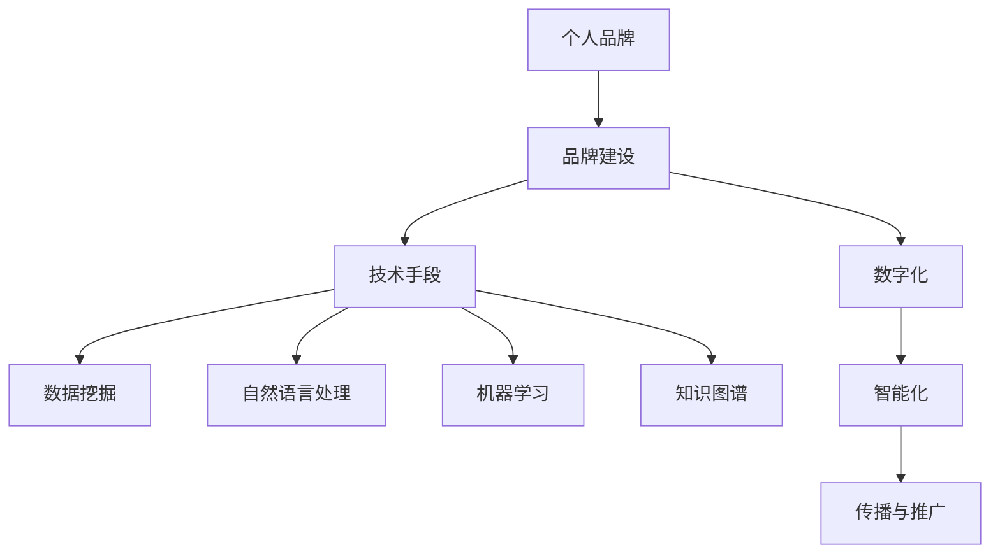

                 

## 1. 背景介绍

### 1.1 问题由来
在当今信息爆炸的时代，个人品牌建设已成为职业发展的关键一环。无论是在职场晋升、跨界转型，还是自我价值实现的道路上，个人品牌的影响力不容忽视。特别是在数字化、智能化不断发展的背景下，个人品牌的建设不仅是一个市场行为，更是一个技术驱动的过程。如何有效地运用技术手段打造个人品牌，成为了每个职场人面临的重要课题。

### 1.2 问题核心关键点
本文将聚焦于打造个人品牌的技术方法论，探讨如何通过技术手段在数字化时代建立起符合个人定位和价值主张的个人品牌。我们的目标是通过数据驱动、技术赋能，帮助读者构建一个清晰、有辨识度的个人品牌形象。

### 1.3 问题研究意义
建立个人品牌不仅是对个人价值的一次梳理和展示，更是对个人影响力的一次系统性提升。技术方法论的引入，可以大大加速品牌建设的过程，使其更具科学性和可操作性。这不仅有助于个人在职场竞争中脱颖而出，还能推动个人的持续学习和成长，为职业发展开辟新的道路。

## 2. 核心概念与联系

### 2.1 核心概念概述
在探讨个人品牌技术方法论之前，我们先明确几个关键概念及其相互联系：

- **个人品牌**：指通过一系列行为和表现，在目标群体中建立起来的独特的、正面的形象和价值主张。

- **品牌建设**：指通过规划、执行和管理一系列活动，建立和维护个人品牌形象的过程。

- **技术手段**：包括但不限于数据挖掘、自然语言处理、机器学习、知识图谱等技术，通过自动化和智能化工具提升品牌建设效率。

- **数字化**：利用互联网、大数据等数字技术手段，实现品牌信息的数字化管理与传播。

- **智能化**：引入人工智能、深度学习等技术，提升品牌信息的自动化处理和智能化分析能力。

这些概念构成了个人品牌建设的技术框架，通过技术手段的运用，可以更加精准、高效地塑造和传播个人品牌。

### 2.2 核心概念原理和架构的 Mermaid 流程图



这个流程图展示了个人品牌建设中，技术手段如何与品牌建设的其他环节相互支撑：

1. **数据挖掘**：通过收集和分析个人行为数据，发现个人优势和价值主张。
2. **自然语言处理**：利用NLP技术分析个人社交媒体内容，了解公众对个人品牌的看法。
3. **机器学习**：使用机器学习算法预测个人品牌的未来趋势和受众需求。
4. **知识图谱**：构建个人知识图谱，展现个人专长和成就。
5. **智能化**：应用AI技术，自动化品牌信息的生成和优化。
6. **传播与推广**：利用数字化手段，将品牌信息传播至目标受众，提升品牌曝光度和影响力。

## 3. 核心算法原理 & 具体操作步骤

### 3.1 算法原理概述
个人品牌建设的技术方法论，本质上是将品牌建设的数据和过程自动化、智能化的过程。其核心思想是通过数据驱动，借助算法模型，对个人品牌的构建进行系统化和科学化的规划与执行。

### 3.2 算法步骤详解
基于上述思想，个人品牌建设的技术方法论可以分为以下几步：

1. **数据收集与预处理**：
   - **目标**：收集与个人品牌相关的数据，如社交媒体互动、工作经历、专业技能等。
   - **方法**：使用爬虫工具、API接口等手段，从社交网络、职业平台、公开资料等渠道获取数据。
   - **预处理**：清洗数据，去除噪声，确保数据的准确性和完整性。

2. **品牌画像构建**：
   - **目标**：通过数据挖掘和分析，构建个人品牌的画像。
   - **方法**：利用聚类、分类等算法，对收集的数据进行分析，提取关键特征。
   - **应用**：创建个人品牌档案，形成清晰、一致的品牌形象。

3. **内容生成与优化**：
   - **目标**：根据个人品牌画像，生成并优化品牌内容。
   - **方法**：利用自然语言处理、生成对抗网络等技术，生成高质量的文本、图像等内容。
   - **应用**：在个人网站、社交媒体、博客等平台发布品牌相关内容。

4. **传播策略制定**：
   - **目标**：制定有效的品牌传播策略，提升品牌曝光度和影响力。
   - **方法**：使用社交网络分析、影响力预测等技术，分析受众行为和偏好。
   - **应用**：选择适合的传播渠道，设计有针对性的推广活动。

### 3.3 算法优缺点
个人品牌建设的技术方法论具有以下优点：
1. **效率提升**：自动化和智能化的技术手段可以大大提升品牌建设的效率，缩短时间成本。
2. **数据驱动**：通过数据驱动的决策，使品牌建设更加科学、精准。
3. **个性化定制**：根据个人特点和需求，量身定制品牌策略。
4. **实时更新**：能够实时响应市场和受众的变化，动态调整品牌策略。

但同时也存在以下缺点：
1. **技术门槛**：需要一定的技术背景和能力，对技术不太熟悉的职场人可能难以操作。
2. **成本投入**：数据收集和处理、技术工具的采购和使用都需要一定的资金投入。
3. **隐私风险**：数据收集和处理过程中，可能涉及个人隐私泄露的风险。

### 3.4 算法应用领域
个人品牌建设的技术方法论，在多个领域都有广泛应用：

- **职业发展**：在求职、职场晋升、转行等过程中，通过技术手段提升个人品牌的竞争力和影响力。
- **知识分享**：在知识传播和教育领域，利用技术手段扩大个人品牌的传播范围和影响力。
- **个人品牌营销**：在个人创业、品牌推广等场景中，通过技术手段提升个人品牌的市场认知度和商业价值。

## 4. 数学模型和公式 & 详细讲解 & 举例说明

### 4.1 数学模型构建
在个人品牌建设中，数学模型主要用来量化和分析个人品牌的相关数据。这里以品牌影响力预测模型为例，介绍其数学模型的构建过程。

设 $x_i$ 为第 $i$ 个人的历史互动数据，$y$ 为当前品牌的受众影响力。我们构建一个线性回归模型，用于预测品牌影响力的变化。模型的形式为：

$$
y = w_0 + w_1 x_1 + w_2 x_2 + ... + w_n x_n + \epsilon
$$

其中，$w_0$ 为截距，$w_1, w_2, ..., w_n$ 为不同特征的权重，$\epsilon$ 为随机误差项。

### 4.2 公式推导过程
为了求解模型的参数 $w_0, w_1, ..., w_n$，我们需要使用最小二乘法来优化目标函数。目标函数为：

$$
J(w) = \frac{1}{2N} \sum_{i=1}^N (y_i - \hat{y}_i)^2
$$

其中 $\hat{y}_i$ 为模型对第 $i$ 个样本的预测值。我们的目标是最小化目标函数 $J(w)$。

使用梯度下降算法，对目标函数求导得到梯度：

$$
\frac{\partial J(w)}{\partial w_k} = \frac{1}{N} \sum_{i=1}^N -2(x_{ki} - \bar{x}_i)(y_i - \hat{y}_i)
$$

其中 $\bar{x}_i$ 为第 $i$ 个特征的均值。

通过更新 $w_k$，使目标函数 $J(w)$ 逐渐减小，直至收敛。

### 4.3 案例分析与讲解
假设我们收集了某个人在社交媒体上的互动数据，包括点赞数、评论数、分享数等。使用上述线性回归模型，我们可以构建一个品牌影响力的预测模型，来预测未来一段时间内该品牌的受众影响力。

具体实现步骤如下：

1. 收集并清洗数据，去除噪声和异常值。
2. 使用聚类算法对不同特征进行归因，提取关键影响因子。
3. 构建线性回归模型，并使用梯度下降法求解参数。
4. 对未来的互动数据进行预测，输出品牌影响力的变化趋势。

## 5. 项目实践：代码实例和详细解释说明

### 5.1 开发环境搭建
为了进行品牌影响力预测模型的开发，我们需要搭建Python开发环境，并使用相关的数据处理和机器学习库。

1. 安装Python 3.8及以上版本。
2. 安装Anaconda，创建虚拟环境，并安装必要的依赖库，如NumPy、Pandas、Scikit-learn等。
3. 安装PyTorch、TensorFlow等深度学习框架，以便进行模型训练。
4. 安装Jupyter Notebook，用于交互式编程和数据可视化。

### 5.2 源代码详细实现
以下是一个基于PyTorch实现品牌影响力预测模型的代码示例：

```python
import torch
import torch.nn as nn
import torch.optim as optim
import pandas as pd
import numpy as np
from sklearn.model_selection import train_test_split
from sklearn.preprocessing import StandardScaler

# 加载数据
data = pd.read_csv('interaction_data.csv')
X = data.drop('influence', axis=1)
y = data['influence']

# 数据预处理
scaler = StandardScaler()
X_scaled = scaler.fit_transform(X)

# 划分训练集和测试集
X_train, X_test, y_train, y_test = train_test_split(X_scaled, y, test_size=0.2, random_state=42)

# 构建模型
class LinearRegression(nn.Module):
    def __init__(self, input_dim):
        super(LinearRegression, self).__init__()
        self.linear = nn.Linear(input_dim, 1)
        self.mse_loss = nn.MSELoss()

    def forward(self, x):
        return self.linear(x)

# 模型训练
model = LinearRegression(X_train.shape[1])
optimizer = optim.SGD(model.parameters(), lr=0.01)
criterion = nn.MSELoss()

for epoch in range(1000):
    model.train()
    optimizer.zero_grad()
    output = model(X_train)
    loss = criterion(output, y_train)
    loss.backward()
    optimizer.step()
    if epoch % 100 == 0:
        print(f'Epoch {epoch+1}, loss: {loss.item()}')

# 模型测试
model.eval()
with torch.no_grad():
    output = model(X_test)
    loss = criterion(output, y_test)
    print(f'Test loss: {loss.item()}')
```

### 5.3 代码解读与分析
在上述代码中，我们首先加载了社交媒体互动数据，并对数据进行了预处理和标准化。然后，我们定义了一个线性回归模型，并使用随机梯度下降法对其进行了训练。最后，我们在测试集上评估了模型的预测性能。

### 5.4 运行结果展示
通过运行上述代码，我们可以得到品牌影响力的预测结果。假设模型的预测结果为 $y_{pred}$，我们可以通过对比 $y_{pred}$ 与实际影响 $y_{test}$，评估模型的预测准确度。

```python
# 预测结果
y_pred = model(X_test)

# 评估结果
print(f'Test MSE: {torch.mean((y_pred - y_test) ** 2).item()}')
```

## 6. 实际应用场景

### 6.1 职业发展

在职业发展中，个人品牌建设尤为重要。通过技术手段，可以更加精准地了解自己在行业中的位置和影响力，制定更有效的职业发展策略。例如：

- **职业规划**：利用数据分析工具，评估自己在不同职业路径上的发展潜力。
- **网络拓展**：通过社交网络分析，识别并连接行业内的关键人物，扩大人脉网络。
- **简历优化**：使用自然语言处理技术，自动生成和优化个人简历，提升招聘成功率。

### 6.2 知识分享

在知识传播和教育领域，个人品牌建设不仅有助于提升个人影响力，还能促进知识的共享和传播。例如：

- **内容创作**：利用内容生成技术，自动创作高质量的博客、文章等，提升内容的专业性和吸引力。
- **知识传播**：通过社交媒体、视频平台等渠道，扩大个人知识的影响范围和受众。
- **教育培训**：利用智能化的教学工具，提供个性化的学习体验，提升学习效果。

### 6.3 个人品牌营销

在个人品牌营销中，技术手段可以提供强大的数据分析和预测能力，帮助提升品牌的市场认知度和商业价值。例如：

- **市场调研**：通过数据挖掘和分析，了解目标市场的需求和趋势，制定更有针对性的营销策略。
- **品牌定位**：利用品牌画像构建技术，明确个人品牌的核心价值和定位。
- **产品推广**：利用社交媒体和搜索引擎优化等手段，提升品牌的在线可见度和互动率。

## 7. 工具和资源推荐

### 7.1 学习资源推荐
1. **《数据科学导论》**：由著名数据科学家Vladimir Mladenovic著作，系统介绍了数据科学的基本原理和应用。
2. **《深度学习》**：Ian Goodfellow等人合著的经典教材，详细讲解了深度学习的基本概念和技术。
3. **《Python机器学习》**：由Sebastian Raschka著作，介绍了Python在机器学习中的应用。
4. **Kaggle数据科学竞赛平台**：提供丰富的数据集和竞赛，帮助提升数据处理和模型训练的能力。
5. **Coursera、edX等在线课程平台**：提供各类数据科学和机器学习的在线课程，提升个人学习效率。

### 7.2 开发工具推荐
1. **Jupyter Notebook**：强大的交互式编程工具，支持Python、R等多种语言。
2. **Git**：版本控制系统，方便团队协作和代码管理。
3. **Docker**：容器化平台，方便应用部署和环境管理。
4. **Python IDE**：如PyCharm、VS Code等，提升开发效率和代码质量。
5. **数据可视化工具**：如Matplotlib、Seaborn、Tableau等，提升数据可视化的效果和效率。

### 7.3 相关论文推荐
1. **《深度学习中的因果推断》**：Pearl等人合著的深度学习与因果推断的交叉研究。
2. **《数据科学的未来》**：Tomas Sauerburger对数据科学未来发展方向的探讨。
3. **《机器学习在职业发展中的应用》**：Saurabh Gupta等人探讨了机器学习在职业发展中的具体应用。
4. **《智能营销：从数据到决策》**：Fred Chong等人讨论了智能营销中的数据驱动决策方法。
5. **《知识图谱与智能信息检索》**：刘文等人合著，介绍了知识图谱在信息检索中的应用。

## 8. 总结：未来发展趋势与挑战

### 8.1 总结
本文详细介绍了基于技术手段的个人品牌建设方法论。通过数据驱动和智能化技术，个人品牌建设可以更加精准、高效地进行，提升了品牌建设的科学性和可操作性。从数据收集、品牌画像构建、内容生成到传播策略制定，每个环节都可以借助技术手段进行优化和提升。

### 8.2 未来发展趋势
展望未来，个人品牌建设技术将呈现以下几个趋势：

1. **智能化程度提升**：随着AI技术的不断进步，品牌建设将更加智能化和自动化，减少人工干预。
2. **数据驱动决策**：数据将贯穿品牌建设的各个环节，提升决策的科学性和精准性。
3. **多模态融合**：利用文本、图像、视频等多种模态数据，构建更加全面和立体的个人品牌形象。
4. **实时更新**：品牌建设能够实时响应市场和受众的变化，动态调整策略，保持品牌的竞争力。

### 8.3 面临的挑战
尽管个人品牌建设技术方法论在不断进步，但仍面临以下挑战：

1. **数据隐私保护**：个人品牌建设过程中涉及大量个人数据，如何保护用户隐私是一个重要的挑战。
2. **技术门槛**：品牌建设的许多技术手段需要一定的技术背景和能力，普及程度还有待提高。
3. **效果评估**：如何科学、客观地评估品牌建设的效果，仍是一个需要深入研究的问题。

### 8.4 研究展望
未来的研究应在以下几个方面进行探索：

1. **隐私保护技术**：开发更加安全和隐私友好的品牌建设工具，保护用户数据安全。
2. **易用性提升**：简化品牌建设的流程和工具，降低技术门槛，提高用户体验。
3. **效果评估方法**：建立科学、客观的品牌效果评估标准，帮助企业和个人更全面地评估品牌建设的效果。

## 9. 附录：常见问题与解答

**Q1：数据收集与预处理中需要注意哪些问题？**

A: 数据收集与预处理是品牌建设的基础，需要注意以下几个问题：
1. **数据来源**：选择可靠的、权威的数据来源，避免数据噪声和偏差。
2. **数据清洗**：去除异常值、重复值和无关数据，确保数据的准确性和完整性。
3. **数据标准化**：对数据进行标准化处理，避免数据单位和量纲不一致带来的问题。

**Q2：品牌影响力预测模型的选择与构建有哪些关键点？**

A: 品牌影响力预测模型的选择与构建需要考虑以下几个关键点：
1. **数据类型**：根据数据类型选择适合的模型，如时间序列数据可以选择ARIMA模型，图像数据可以选择卷积神经网络等。
2. **模型复杂度**：选择简单或复杂的模型取决于数据量和模型的准确度要求，需进行实验对比。
3. **参数调整**：根据模型表现，调整模型参数，优化模型的预测效果。

**Q3：品牌建设过程中如何利用技术手段提升效果？**

A: 品牌建设过程中可以借助多种技术手段提升效果：
1. **数据可视化**：通过可视化工具展示数据分析结果，发现品牌建设的趋势和问题。
2. **自动化工具**：利用自动化工具，如爬虫、数据清洗工具，提升数据处理的效率和准确性。
3. **机器学习模型**：应用机器学习模型，进行数据挖掘和预测，提升决策的科学性和精准性。

**Q4：品牌建设的技术手段与传统手段相比有哪些优势？**

A: 品牌建设的技术手段与传统手段相比有以下优势：
1. **效率提升**：自动化和智能化的技术手段可以大大提升品牌建设的效率，缩短时间成本。
2. **数据驱动**：通过数据驱动的决策，使品牌建设更加科学、精准。
3. **个性化定制**：根据个人特点和需求，量身定制品牌策略，提升品牌建设的效果。

---

作者：禅与计算机程序设计艺术 / Zen and the Art of Computer Programming

