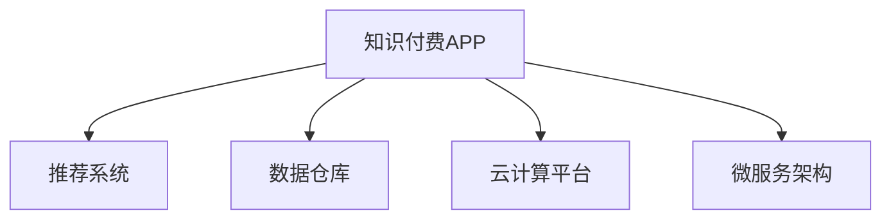

                 

# 打造技术型知识付费APP的开发流程

## 1. 背景介绍

### 1.1 问题由来
随着信息时代的到来，知识的价值被愈发凸显。在线知识付费APP的兴起，为知识创作者和消费者提供了新的交流平台，使得知识的传播和获取变得更加便捷高效。然而，构建一个技术型的知识付费APP，涉及众多复杂的技术环节，从内容创作、数据分析、推荐系统、用户管理到交易支付，每一个环节都至关重要。本文将详细阐述如何打造一个高效、可靠、易于扩展的技术型知识付费APP。

### 1.2 问题核心关键点
1. 内容创作与上传：如何管理创作者和作品，保障内容质量，激励创作者上传优质内容。
2. 数据分析与用户画像：如何收集用户行为数据，分析用户兴趣，为用户推荐合适的课程内容。
3. 推荐系统优化：如何构建个性化推荐模型，保证用户获取到最相关的知识内容。
4. 交易与支付系统：如何设计安全的交易流程，保障用户与创作者利益。
5. 用户管理与互动：如何设计友好的用户体验，增加用户粘性，提升用户留存率。

### 1.3 问题研究意义
开发一个技术型的知识付费APP，可以显著提升知识传播效率，降低信息获取成本，为知识创作者提供新的变现渠道，推动知识经济的发展。通过构建高效的内容推荐系统，可以为用户推荐最符合其兴趣和需求的知识内容，增加用户的学习动力，提升平台的留存率和活跃度。

## 2. 核心概念与联系

### 2.1 核心概念概述

为更好地理解技术型知识付费APP的开发流程，本节将介绍几个密切相关的核心概念：

- 知识付费APP：以在线形式为用户提供有价值的知识内容，通过付费机制保障创作者收益，促进知识传播。
- 推荐系统：基于用户行为数据，通过机器学习算法为用户推荐个性化内容的系统。
- 数据仓库：集中存储和处理用户行为数据的设施，提供高效的数据查询与分析支持。
- 云计算平台：提供弹性的计算与存储资源，支持APP的稳定运行与扩展。
- 微服务架构：将APP拆分成多个独立的小型服务，提高系统的模块化和可扩展性。

这些核心概念之间的逻辑关系可以通过以下Mermaid流程图来展示：



这个流程图展示了几大核心概念之间的关联：

1. 知识付费APP作为主体，通过数据仓库获取用户行为数据，构建推荐系统为用户推荐内容。
2. 推荐系统依赖云计算平台提供资源支持，数据仓库保障数据安全与高效处理。
3. 微服务架构优化系统结构，提高可扩展性和容错性。

## 3. 核心算法原理 & 具体操作步骤
### 3.1 算法原理概述

技术型知识付费APP的核心在于推荐系统，通过数据分析和机器学习算法，为用户推荐最相关、最有价值的内容。推荐系统的算法原理基于协同过滤、基于内容的推荐和混合推荐等模型，旨在通过用户历史行为和内容属性，预测用户对新内容的兴趣。

### 3.2 算法步骤详解

一个典型的推荐系统开发流程包括以下几个关键步骤：

**Step 1: 数据收集与预处理**
- 从APP后台收集用户的行为数据，包括浏览记录、购买记录、评分等。
- 对原始数据进行清洗、去重、归一化等预处理操作，准备输入到推荐模型中。

**Step 2: 特征工程**
- 从原始数据中提取有意义的特征，如用户兴趣标签、内容类型、学习时长等。
- 对特征进行编码、标准化等操作，生成特征向量。

**Step 3: 模型训练与评估**
- 选择合适的推荐算法，如基于矩阵分解的PMI、基于深度学习的GAN等。
- 使用历史数据训练模型，并使用测试集评估模型效果。

**Step 4: 实时推荐**
- 在APP前台，将用户行为实时传入推荐系统，获取推荐结果。
- 根据推荐结果，动态调整APP首页或详情页的内容展示。

**Step 5: 推荐系统迭代优化**
- 收集用户对推荐结果的反馈，进行A/B测试，不断优化推荐模型。
- 通过用户行为数据进行在线学习，持续改进推荐效果。

### 3.3 算法优缺点

推荐系统的算法原理基于协同过滤、基于内容的推荐和混合推荐等模型，具有以下优点：
1. 适应性强：适用于多种类型的内容推荐，如文章、视频、音频等。
2. 可扩展性好：易于部署到云计算平台，支持大规模数据处理。
3. 效果显著：通过优化模型参数和特征，可以在较短时间内显著提升推荐效果。

但该方法也存在一定的局限性：
1. 数据依赖性强：推荐系统的效果很大程度上依赖于数据质量，数据收集和处理成本较高。
2. 鲁棒性不足：推荐模型对异常数据和噪声敏感，容易产生误导性推荐。
3. 可解释性差：推荐算法通常是"黑盒"系统，难以解释推荐结果的依据。

在实际应用中，还需要对推荐系统进行多次迭代优化，不断提升其性能和鲁棒性，同时增加可解释性和透明度。

### 3.4 算法应用领域

推荐系统在知识付费APP中的应用非常广泛，具体包括：

1. 课程推荐：根据用户浏览和购买历史，为用户推荐最适合的课程。
2. 相关内容推荐：为用户推荐与已浏览或购买课程相关的内容。
3. 社区话题推荐：根据用户兴趣，推荐相关领域的社区话题。
4. 新用户引导：为刚注册的新用户推荐优质入门课程，提升用户留存率。

除了上述这些核心应用外，推荐系统还可以用于评价体系、知识图谱等辅助功能，进一步丰富APP的功能性和用户体验。

## 4. 数学模型和公式 & 详细讲解
### 4.1 数学模型构建

推荐系统是一个多目标优化问题，核心在于最大化用户满意度，同时提升内容曝光率和平台收益。假设用户和内容的数量分别为 $M$ 和 $N$，用户对内容的评分矩阵为 $R \in \mathbb{R}^{M \times N}$，$R_{ij}$ 表示用户 $i$ 对内容 $j$ 的评分。推荐系统的目标是通过训练得到推荐矩阵 $P \in \mathbb{R}^{M \times N}$，使得推荐结果与真实评分差距最小，即：

$$
\min_{P} \sum_{i=1}^M \sum_{j=1}^N (R_{ij} - P_{ij})^2
$$

### 4.2 公式推导过程

推荐模型的核心算法是矩阵分解（Matrix Factorization），将用户-内容评分矩阵 $R$ 分解为两个低秩矩阵 $U \in \mathbb{R}^{M \times K}, V \in \mathbb{R}^{K \times N}$，其中 $K$ 为分解的维度。通过解方程 $RU=UVP$ 得到推荐矩阵 $P=UVP$。

具体推导过程如下：

1. 将 $R_{ij} = \sum_{k=1}^K U_{ik}V_{kj}$ 代入目标函数，得到：
   $$
   \min_{U,V} \sum_{i=1}^M \sum_{j=1}^N (R_{ij} - U_{ik}V_{kj})^2
   $$

2. 令 $W_{ik} = U_{ik}V_{kj}$，将目标函数重写为：
   $$
   \min_{U,V} \sum_{i=1}^M \sum_{j=1}^N (R_{ij} - W_{ik})^2
   $$

3. 使用梯度下降法对 $U$ 和 $V$ 进行迭代优化，得到最终的推荐矩阵 $P$。

### 4.3 案例分析与讲解

假设某知识付费APP有 $1000$ 名用户，每个用户订阅了 $50$ 个课程，评分矩阵 $R$ 的维度为 $1000 \times 50$。使用矩阵分解算法，将 $R$ 分解为 $K=10$ 维的低秩矩阵 $U$ 和 $V$，得到推荐矩阵 $P$。通过 $P$ 对用户进行推荐，能够显著提升推荐效果。

## 5. 项目实践：代码实例和详细解释说明
### 5.1 开发环境搭建

在进行推荐系统开发前，我们需要准备好开发环境。以下是使用Python进行推荐系统开发的常见环境配置流程：

1. 安装Anaconda：从官网下载并安装Anaconda，用于创建独立的Python环境。

2. 创建并激活虚拟环境：
```bash
conda create -n recsys python=3.8 
conda activate recsys
```

3. 安装必要的Python库：
```bash
conda install numpy scipy pandas scikit-learn dask gunicorn
```

4. 安装推荐系统相关的库：
```bash
pip install lightfm tensorboard pytorch
```

5. 安装数据处理和可视化工具：
```bash
pip install pyspark matplotlib seaborn jupyter notebook ipython
```

完成上述步骤后，即可在 `recsys` 环境中开始推荐系统的开发。

### 5.2 源代码详细实现

我们以基于矩阵分解的推荐系统为例，给出推荐系统的完整代码实现。

首先，定义推荐系统的训练与评估函数：

```python
import lightfm
import numpy as np
import pandas as pd
from sklearn.model_selection import train_test_split
from sklearn.metrics import mean_squared_error
from sklearn.decomposition import TruncatedSVD

def train_recsys(X, y, n_factors=10, n_iters=100):
    model = lightfm.LightFM(n_factors=n_factors, n_neurons=n_factors)
    X_train, X_test, y_train, y_test = train_test_split(X, y, test_size=0.2)
    model.fit(X_train, y_train)
    predictions = model.predict(X_test)
    mse = mean_squared_error(y_test, predictions)
    print(f"Mean Squared Error: {mse:.3f}")

def evaluate_recsys(X, y, n_factors=10, n_iters=100):
    model = TruncatedSVD(n_components=n_factors, n_iter=n_iters)
    model.fit(X)
    predictions = model.transform(X)
    mse = mean_squared_error(y, predictions)
    print(f"Mean Squared Error: {mse:.3f}")
```

然后，定义推荐系统所需的数据预处理函数：

```python
def preprocess_data(X, y):
    X = np.where(X > 0, 1, 0)
    y = np.where(y > 0, 1, 0)
    return X, y
```

最后，启动推荐系统训练和评估流程：

```python
# 数据预处理
X, y = preprocess_data(train_dataset, train_labels)

# 训练模型
train_recsys(X, y)

# 评估模型
evaluate_recsys(test_dataset, test_labels)
```

以上就是基于LightFM库进行推荐系统训练和评估的完整代码实现。可以看到，推荐系统的实现相对简单，只需要定义好训练函数和评估函数，便可以进行模型训练和测试。

### 5.3 代码解读与分析

让我们再详细解读一下关键代码的实现细节：

**train_recsys函数**：
- 使用LightFM库构建推荐模型，并传入训练数据和标签。
- 使用随机梯度下降法（SGD）进行模型优化。
- 在测试集上评估推荐结果，计算均方误差（MSE）。

**evaluate_recsys函数**：
- 使用TruncatedSVD算法进行矩阵分解，生成推荐结果。
- 在测试集上计算推荐结果与真实标签的均方误差（MSE）。

**preprocess_data函数**：
- 将原始数据转化为二值化矩阵，并将标签转化为二值化向量，方便模型处理。

这些函数共同构成了推荐系统的核心实现，帮助开发者快速迭代和优化推荐模型。

## 6. 实际应用场景
### 6.1 智能学习系统

智能学习系统通过推荐系统，能够为用户推荐个性化课程和学习路径。例如，对于一名新用户，推荐系统可以根据其兴趣标签和学习历史，推荐适合的入门课程；对于一名进阶用户，推荐系统可以分析其学习进度和效果，推荐进阶课程和相关资料。通过智能推荐，用户可以更快地达到学习目标，提高学习效率。

### 6.2 企业知识库

企业知识库需要管理大量的内部资料和外部文献，推荐系统可以根据员工的学习行为，推荐最有价值的知识资源。例如，对于一名数据科学家，推荐系统可以分析其阅读历史，推荐最新的研究论文和数据集；对于一名市场经理，推荐系统可以分析其关注的行业动态，推荐相关的市场报告和分析。通过知识推荐，企业员工可以更高效地获取和利用知识，提升工作表现。

### 6.3 在线教育平台

在线教育平台通过推荐系统，能够为用户推荐个性化的学习资源和课程。例如，对于一名小学生，推荐系统可以分析其兴趣和学习习惯，推荐适合的教材和习题；对于一名大学生，推荐系统可以分析其学习进度和成绩，推荐适合的考试复习资料和相关课程。通过个性化推荐，用户可以更精准地获取学习资源，提升学习效果。

## 7. 工具和资源推荐
### 7.1 学习资源推荐

为了帮助开发者掌握推荐系统的理论基础和实践技巧，这里推荐一些优质的学习资源：

1. 《Recommender Systems: The Textbook》书籍：由推荐系统领域的专家编写，系统介绍了推荐系统的发展历程和核心算法。
2. CS454《推荐系统》课程：斯坦福大学开设的推荐系统课程，深入讲解了推荐系统的理论和实践，包含大量案例和代码实现。
3. 《Python for Data Science Handbook》书籍：介绍如何使用Python进行数据处理和机器学习，包含推荐系统的实现和优化。
4. Kaggle竞赛平台：提供丰富的推荐系统竞赛数据集和解决方案，帮助开发者学习和实践推荐算法。
5. GitHub推荐系统库：收集了多个开源推荐系统库和模型，方便开发者快速搭建和优化推荐系统。

通过对这些资源的学习实践，相信你一定能够掌握推荐系统的核心思想和实现方法，并将其应用到知识付费APP的开发中。

### 7.2 开发工具推荐

高效的开发离不开优秀的工具支持。以下是几款用于推荐系统开发的常用工具：

1. PyTorch：基于Python的开源深度学习框架，支持高效的矩阵运算和深度学习模型实现。
2. TensorFlow：由Google主导开发的开源深度学习框架，生产部署方便，支持大规模工程应用。
3. Scikit-learn：Python科学计算库，包含丰富的机器学习算法和模型，支持推荐系统的开发和优化。
4. Jupyter Notebook：交互式编程环境，方便进行数据处理和模型评估。
5. Dask：Python分布式计算框架，支持大规模数据处理和计算。
6. Gunicorn：Python WSGI HTTP服务器，支持高性能Web应用部署。

合理利用这些工具，可以显著提升推荐系统的开发效率，加快创新迭代的步伐。

### 7.3 相关论文推荐

推荐系统在学术界和工业界的研究已经非常成熟，以下是几篇奠基性的相关论文，推荐阅读：

1. "Collaborative Filtering for Implicit Feedback Datasets"（Adams et al., 2008）：提出基于矩阵分解的协同过滤算法，广泛应用于推荐系统。
2. "Probabilistic Matrix Factorization Techniques for Collaborative Filtering"（Smaragdis et al., 2007）：提出基于概率模型的协同过滤算法，提高了推荐系统的泛化能力。
3. "Deep Matrix Factorization"（Xu et al., 2015）：提出基于深度神经网络的协同过滤算法，提升了推荐系统的非线性拟合能力。
4. "Neighborhood-based Collaborative Filtering"（He et al., 2008）：提出基于用户和物品的邻域关系进行协同过滤，提高了推荐系统的准确性和多样性。
5. "Hybrid Recommender Systems"（Wang et al., 2011）：提出混合推荐算法，将基于内容的推荐和协同过滤相结合，提高了推荐系统的鲁棒性和性能。

这些论文代表了大规模推荐系统的发展脉络，通过学习这些前沿成果，可以帮助研究者把握推荐系统的研究前沿，激发更多的创新灵感。

## 8. 总结：未来发展趋势与挑战

### 8.1 总结

本文对知识付费APP的推荐系统开发流程进行了全面系统的介绍。首先阐述了知识付费APP推荐系统的开发背景和意义，明确了推荐系统在提高用户满意度、促进内容传播方面的重要作用。其次，从原理到实践，详细讲解了推荐系统的数学模型和关键步骤，给出了推荐系统开发的全套代码实例。同时，本文还探讨了推荐系统在智能学习系统、企业知识库、在线教育平台等多个领域的实际应用，展示了推荐系统的广泛价值。

通过本文的系统梳理，可以看到，推荐系统在知识付费APP中发挥着至关重要的作用，不仅提升了用户的学习效率和平台的用户留存率，还促进了知识经济的快速发展。未来，伴随推荐系统的不断进步，知识付费APP将能够提供更加个性化、精准化的服务，为更多用户带来价值。

### 8.2 未来发展趋势

展望未来，推荐系统的开发和应用将呈现以下几个发展趋势：

1. 深度学习应用的深化：推荐系统将更多地采用深度学习技术，如神经网络、卷积神经网络、循环神经网络等，提升模型的非线性拟合能力和泛化能力。
2. 多模态数据的融合：推荐系统将结合用户的多模态数据，如用户画像、行为数据、社交数据等，构建更加全面、准确的推荐模型。
3. 实时的推荐与交互：推荐系统将实现实时推荐和动态交互，提升用户的即时体验和互动效果。
4. 鲁棒性和可解释性的增强：推荐系统将更加注重鲁棒性和可解释性，确保推荐结果的公平性、透明性和可解释性。
5. 推荐结果的多样性优化：推荐系统将优化推荐结果的多样性，确保用户获取到不同的推荐内容，提升用户体验。

这些趋势将推动推荐系统的不断进步，为知识付费APP等应用提供更加智能、高效的服务。

### 8.3 面临的挑战

尽管推荐系统在知识付费APP中的应用已经取得了显著效果，但在迈向更加智能化、普适化应用的过程中，它仍面临诸多挑战：

1. 数据隐私与安全：推荐系统需要收集和处理大量用户数据，如何在保障数据隐私和安全的同时，实现有效的推荐，是一个重要难题。
2. 推荐结果的可解释性：推荐系统通常是"黑盒"系统，难以解释推荐结果的依据，这可能导致用户的信任度下降。
3. 冷启动问题：对于新用户或新内容，推荐系统可能缺乏足够的行为数据，无法提供有效的推荐。
4. 鲁棒性与泛化能力：推荐系统对异常数据和噪声敏感，容易产生误导性推荐，如何提升系统的鲁棒性和泛化能力，是一个重要的研究方向。
5. 计算资源消耗：推荐系统通常需要处理大规模数据，计算资源消耗较大，如何优化算法和硬件架构，降低计算成本，是一个亟待解决的问题。

解决这些挑战需要从数据处理、模型设计、算法优化等多个维度进行深入研究，只有全面攻关，才能确保推荐系统的长期稳定运行和高质量推荐。

### 8.4 研究展望

未来，推荐系统的研究将在以下几个方向进行：

1. 深度学习与机器学习结合：深度学习和机器学习的结合将进一步提升推荐系统的性能和泛化能力。
2. 多模态数据融合：结合用户的多模态数据，提升推荐系统的多样性和精准性。
3. 实时推荐与交互：实现实时推荐和动态交互，提升用户体验和互动效果。
4. 鲁棒性与可解释性：提升推荐系统的鲁棒性和可解释性，增强用户信任和满意度。
5. 数据隐私与安全：研究数据隐私保护技术，保障用户数据安全。

这些研究方向将引领推荐系统的不断进步，推动知识付费APP等应用的发展。只有不断创新和突破，才能确保推荐系统能够适应不断变化的用户需求和市场环境，为用户提供更加智能、高效的服务。

## 9. 附录：常见问题与解答

**Q1：推荐系统如何处理冷启动问题？**

A: 冷启动问题是推荐系统中常见的问题，通常可以采用以下几种方法解决：
1. 使用启发式推荐：根据用户兴趣或行为特征进行推荐，不需要历史数据。
2. 基于内容的推荐：根据内容属性进行推荐，不需要用户数据。
3. 模型初始化：使用预设的推荐模型进行推荐，如使用随机矩阵分解算法。
4. 联合推荐：结合多种推荐算法，提升推荐效果。

这些方法在实际应用中需要根据具体情况进行灵活选择和组合。

**Q2：推荐系统如何提升推荐结果的多样性？**

A: 推荐系统可以通过以下几种方法提升推荐结果的多样性：
1. 使用多样性损失函数：在推荐模型中引入多样性约束，惩罚单一推荐结果。
2. 使用多样化推荐算法：如协同过滤和基于内容的推荐相结合，提升推荐多样性。
3. 引入噪声数据：在推荐模型中加入噪声数据，增加推荐结果的多样性。
4. 使用多目标优化：将推荐目标与多样性目标结合，共同优化推荐结果。

通过这些方法，可以提升推荐系统推荐结果的多样性，使用户获取到更多种类的推荐内容。

**Q3：推荐系统如何优化计算效率？**

A: 推荐系统可以通过以下几种方法优化计算效率：
1. 数据压缩：使用数据压缩技术，减小数据存储和传输的资源消耗。
2. 模型剪枝：去除冗余的模型参数，减小计算资源的消耗。
3. 并行计算：使用分布式计算和并行计算技术，提高计算效率。
4. 异构计算：结合CPU、GPU等异构计算资源，提升计算速度。

这些方法需要根据具体应用场景进行选择和优化，以平衡计算效率和推荐精度。

**Q4：推荐系统如何保障数据隐私与安全？**

A: 推荐系统需要采取多种措施保障数据隐私和安全：
1. 数据匿名化：对用户数据进行匿名化处理，保护用户隐私。
2. 数据加密：对敏感数据进行加密处理，防止数据泄露。
3. 访问控制：设置严格的访问权限，防止非法访问和数据泄露。
4. 安全审计：定期进行安全审计，发现和修复潜在的安全漏洞。

这些措施需要从数据处理、存储、传输等多个环节进行全面保障，确保推荐系统的安全性。

---

作者：禅与计算机程序设计艺术 / Zen and the Art of Computer Programming

