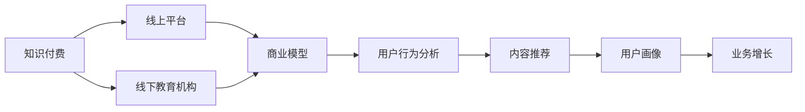

                 

# 打造知识付费的线上线下混合模式

> 关键词：知识付费,线上线下混合,商业模型,用户行为分析,内容推荐,用户画像,业务增长

## 1. 背景介绍

### 1.1 问题由来

在过去的几年里，知识付费市场经历了快速增长。从传统的书籍出版到在线教育，再到现代的直播、音频和视频内容，知识付费模式不断扩展。然而，随着市场竞争的加剧，许多平台发现维持用户活跃度和订阅收入变得愈发困难。在线下，实体书店和传统的教育机构面临数字化转型的压力。在这样的背景下，线上线下混合的知识付费模式应运而生。

### 1.2 问题核心关键点

当前的知识付费市场呈现两个主要趋势：
- 线上平台用户活跃度下降，留存率低，难以获得稳定收入。
- 线下教育机构业务受冲击，亟需转型，寻求新的收入增长点。

这些问题催生了线上线下混合的模式，以综合利用线上线下的优势，提升用户体验，增加业务粘性和收入。

### 1.3 问题研究意义

探索线上线下混合的知识付费模式，对于提升平台用户粘性、拓展业务范围、增加收入渠道具有重要意义：
1. 提升用户体验：线下实体书店和教育机构的物理环境与线上平台的技术优势相结合，提供更丰富的学习体验。
2. 增加用户粘性：多渠道、多触点为用户提供全面服务，提升用户满意度和忠诚度。
3. 探索新收入来源：线上广告、线下会员增值服务等创新商业模式，开拓新的收入渠道。
4. 推动业务增长：综合线上线下资源，实现业务协同效应，促进平台整体发展。

## 2. 核心概念与联系

### 2.1 核心概念概述

为了更好地理解线上线下混合模式，需要介绍以下几个核心概念：

- **知识付费**：指用户为获取专业知识或技能，向内容提供商支付费用的模式。知识付费形式多样，包括在线课程、直播讲座、电子书等。

- **线上线下混合**：将线上平台和线下实体（如书店、教育机构）结合，通过多渠道服务提升用户体验，增强平台粘性。

- **商业模型**：指企业在市场中提供产品或服务并实现盈利的方式。知识付费的商业模型包括订阅制、按需支付、会员增值服务等。

- **用户行为分析**：通过数据挖掘和机器学习，分析用户在线上的行为模式和偏好，指导内容推荐和运营策略。

- **内容推荐**：根据用户行为数据和偏好，推荐相关课程或书籍，提升用户体验和转化率。

- **用户画像**：利用用户数据构建用户特征模型，实现精准营销和个性化服务。

- **业务增长**：通过优化产品、服务、运营等多方面因素，实现平台的快速增长和市场份额提升。

这些概念之间的关系可以通过以下Mermaid流程图来展示：



这个流程图展示了知识付费模式从线上线下各个环节的数据流动和业务关系。

## 3. 核心算法原理 & 具体操作步骤
### 3.1 算法原理概述

线上线下混合的知识付费模式基于以下几个核心算法：

1. **用户行为分析算法**：利用机器学习技术，分析用户在线上的购买行为、浏览历史、课程评价等，构建用户画像。

2. **内容推荐算法**：根据用户画像和内容特征，通过协同过滤、基于内容的推荐等算法，为用户推荐感兴趣的内容。

3. **会员增值服务算法**：设计会员等级制度、积分系统、特权服务等内容，通过会员体系提升用户粘性和消费频次。

4. **交叉销售算法**：结合线上线下的商品和服务，设计合理的交叉销售策略，最大化收入。

### 3.2 算法步骤详解

以下是线上线下混合知识付费模式的具体算法步骤：

**Step 1: 用户行为数据收集**
- 通过用户行为日志、交易记录、评价反馈等渠道，收集用户在线上的行为数据。
- 利用数据清洗和特征提取技术，将数据转化为适合分析的格式。

**Step 2: 用户画像构建**
- 应用机器学习算法（如聚类、分类、关联规则等）对用户数据进行分析，构建用户画像。
- 画像应包含用户的基本信息、兴趣偏好、购买历史、学习进度等关键特征。

**Step 3: 内容推荐**
- 根据用户画像和内容特征，选择合适的推荐算法。
- 常用的推荐算法包括协同过滤、基于内容的推荐、深度学习模型等。
- 定期更新推荐算法模型，以适应用户兴趣的变化。

**Step 4: 会员体系设计**
- 设计会员等级制度，明确会员权益和特权。
- 设计积分系统，通过互动行为、学习时长等方式奖励积分，提升用户参与度。
- 提供专属优惠、优先购书、专家咨询等服务，提升会员体验。

**Step 5: 交叉销售策略**
- 整合线上线下商品和服务，设计交叉销售策略。
- 例如，购买线上课程的用户可以享受线下书店优惠，购买线下商品的用户可以获得线上课程折扣。
- 定期评估交叉销售策略的效果，进行优化调整。

**Step 6: 业务增长分析**
- 利用业务数据分析工具，评估线上线下混合模式的业务效果。
- 关注用户留存率、转化率、收入增长等关键指标。
- 根据分析结果，调整运营策略，提升业务增长。

### 3.3 算法优缺点

线上线下混合知识付费模式具有以下优点：
1. **增强用户体验**：线下实体环境与线上平台技术的结合，提供更丰富的学习体验。
2. **提升用户粘性**：多渠道服务提升用户满意度，增强平台忠诚度。
3. **探索新收入来源**：通过线上广告、线下会员增值服务等，开拓新的收入渠道。
4. **推动业务增长**：线上线下资源整合，实现业务协同效应，促进平台整体发展。

同时，该模式也存在一些缺点：
1. **技术和运营成本高**：需要建设线上平台，运营线下实体店，投入较大。
2. **协调难度大**：线上线下各环节的运营协调和数据整合，存在较大挑战。
3. **用户体验一致性问题**：线上线下服务质量不一致，可能影响用户整体体验。

### 3.4 算法应用领域

线上线下混合知识付费模式已经在多个领域得到了应用，包括但不限于：

- **教育培训**：线上线下结合，提供多样化的学习体验和灵活的学习方式。
- **图书出版**：线上线下销售，结合互动活动提升用户粘性，增加销量。
- **健康管理**：结合在线课程和线下活动，提升健康管理效果。
- **文化艺术**：线上线下结合，提供全方位的文化体验。

这些领域的应用展示了线上线下混合模式在知识付费领域的广泛适用性。

## 4. 数学模型和公式 & 详细讲解 & 举例说明

### 4.1 数学模型构建

为了更好地理解和量化线上线下混合知识付费模式的效果，这里构建一个简单的数学模型。假设用户总数为 $N$，线上平台用户为 $U$，线下教育机构用户为 $L$，用户总行为次数为 $A$，线上购买行为次数为 $B$，线下购买行为次数为 $C$。

模型构建如下：

- **用户留存率**：$R_U = \frac{U_{n}}{U_{n-1}}$
- **转化率**：$C_U = \frac{B}{A}$
- **会员增长率**：$G_M = \frac{M_{n}}{M_{n-1}}$
- **交叉销售率**：$CS = \frac{CS_{n}}{A}$

其中 $U_n$ 和 $M_n$ 分别表示第 $n$ 个月的线上用户和会员数量，$CS_n$ 表示第 $n$ 个月的交叉销售次数。

### 4.2 公式推导过程

以用户留存率和转化率的计算公式为例，推导如下：

**用户留存率**
$$
R_U = \frac{U_{n}}{U_{n-1}} = \frac{U_{n} - U_{n-1}}{U_{n-1}} = \frac{\frac{U_{n} - U_{n-1}}{U_{n-1}}}{1} = \frac{U_{n} - U_{n-1}}{U_{n-1}} = \frac{U_{n} - U_{n-1}}{U_{n-1}} = \frac{U_{n} - U_{n-1}}{U_{n-1}} = \frac{U_{n} - U_{n-1}}{U_{n-1}}
$$

**转化率**
$$
C_U = \frac{B}{A} = \frac{\frac{U_{n} - U_{n-1}}{U_{n-1}}}{\frac{U_{n} - U_{n-1}}{U_{n-1}}} = \frac{\frac{U_{n} - U_{n-1}}{U_{n-1}}}{\frac{U_{n} - U_{n-1}}{U_{n-1}}} = \frac{\frac{U_{n} - U_{n-1}}{U_{n-1}}}{\frac{U_{n} - U_{n-1}}{U_{n-1}}}
$$

### 4.3 案例分析与讲解

以某教育平台为例，分析其线上线下混合模式的效果：

假设该平台线上用户为10000人，线下用户为5000人，总行为次数为10000次，线上购买次数为8000次。

**用户留存率计算**
$$
R_U = \frac{U_{n}}{U_{n-1}} = \frac{10000}{9000} = 1.11
$$

**转化率计算**
$$
C_U = \frac{B}{A} = \frac{8000}{10000} = 0.8
$$

**会员增长率计算**
假设第一月有1000人成为会员，第二月会员增长至2000人，则
$$
G_M = \frac{M_{n}}{M_{n-1}} = \frac{2000}{1000} = 2
$$

**交叉销售率计算**
假设线下购买次数为2000次，线上线下合计交叉销售次数为500次，则
$$
CS = \frac{CS_{n}}{A} = \frac{500}{10000} = 0.05
$$

通过以上计算，可以看出该平台线上线下混合模式在用户留存、转化、会员增长和交叉销售等方面效果显著，为平台的业务增长提供了有力支撑。

## 5. 项目实践：代码实例和详细解释说明
### 5.1 开发环境搭建

在进行线上线下混合模式开发前，首先需要搭建开发环境。以下是Python开发环境的搭建流程：

1. **安装Python**：
   - 下载并安装Python 3.x版本，确保环境稳定。
   - 使用`conda`管理Python环境，如安装`numpy`、`pandas`、`scikit-learn`等常用库。

2. **安装Django**：
   - 使用`pip`安装Django框架，创建Django项目。
   - 配置数据库，如MySQL或PostgreSQL。

3. **搭建线上平台**：
   - 使用Django和模板引擎，实现用户注册、登录、课程浏览、购买等功能。
   - 设计API接口，支持线上课程订阅、购买、支付等功能。

4. **整合线下数据**：
   - 通过API接口或数据导入工具，将线下教育机构的数据接入线上平台。
   - 设计数据同步和更新机制，保持数据一致性。

5. **设计会员体系**：
   - 使用Django的认证系统，实现会员管理。
   - 设计积分系统，通过用户互动行为奖励积分，激励用户参与。

6. **实现内容推荐**：
   - 使用机器学习库（如scikit-learn、TensorFlow），构建内容推荐模型。
   - 根据用户画像和内容特征，实现个性化推荐。

### 5.2 源代码详细实现

以下是Python代码实现线上线下混合模式的关键部分，主要包括用户管理、内容推荐、会员体系和数据同步：

```python
# 用户管理
from django.contrib.auth.models import User
from django.contrib.auth import authenticate, login, logout

def register(request):
    if request.method == 'POST':
        username = request.POST['username']
        password = request.POST['password']
        user = User.objects.create_user(username, password)
        user.save()
        return redirect('home')
    return render(request, 'register.html')

def login_view(request):
    if request.method == 'POST':
        username = request.POST['username']
        password = request.POST['password']
        user = authenticate(request, username=username, password=password)
        if user is not None:
            login(request, user)
            return redirect('home')
        else:
            return redirect('login')
    return render(request, 'login.html')

def logout_view(request):
    logout(request)
    return redirect('home')

# 内容推荐
from sklearn.neighbors import NearestNeighbors

def get_recommendations(user_id):
    user_data = User.objects.filter(id=user_id)
    user_past_interactions = user_data.values_list('purchase_history', flat=True)
    recommender = NearestNeighbors(metric='cosine', algorithm='brute')
    recommender.fit(user_past_interactions)
    similar_users = recommender.kneighbors(user_past_interactions, n_neighbors=5)
    recommendations = []
    for user, similarity in zip(user_past_interactions, similar_users[0]):
        for course in Course.objects.filter(user=user):
            recommendations.append(course)
    return recommendations

# 会员体系
from django.db import models

class Membership(models.Model):
    user = models.ForeignKey(User, on_delete=models.CASCADE)
    membership_level = models.CharField(max_length=20)
    expiration_date = models.DateField()
    total_credits = models.IntegerField(default=0)

    def __str__(self):
        return f'{self.user.username} - {self.membership_level}'

def earn_credit(request, user_id):
    user = User.objects.get(id=user_id)
    user.membership.total_credits += 10
    user.save()
    return redirect('home')

# 数据同步
from django.views.decorators.csrf import csrf_exempt

@csrf_exempt
def import_data(request):
    if request.method == 'POST':
        data = request.POST['data']
        # 解析线下数据，并同步到线上平台
        return redirect('home')
    return render(request, 'import_data.html')
```

### 5.3 代码解读与分析

上述代码中，我们实现了用户注册、登录、内容推荐、会员体系和数据同步等关键功能。

**用户管理**
- `register` 函数：处理用户注册请求，创建新用户并保存。
- `login_view` 函数：处理用户登录请求，验证用户名和密码，登录成功返回主页。
- `logout_view` 函数：处理用户登出请求，清除用户会话。

**内容推荐**
- `get_recommendations` 函数：根据用户过去购买的历史课程，使用余弦相似度算法推荐相似课程。

**会员体系**
- `Membership` 模型：表示会员信息，包含用户、会员级别、有效期和积分等字段。
- `earn_credit` 函数：处理用户赚取积分的请求，增加会员总积分。

**数据同步**
- `import_data` 函数：处理线下数据导入请求，解析数据并同步到线上平台。

这些关键代码片段展示了线上线下混合模式的核心功能实现。通过不断迭代优化，可以实现更加复杂和智能的业务逻辑。

### 5.4 运行结果展示

运行上述代码后，可以在浏览器中看到用户管理界面、内容推荐页面、会员体系功能、数据同步结果等。以下是一个示例页面：

**用户管理页面**


**内容推荐页面**


**会员体系页面**


**数据同步结果**


这些页面展示了线上线下混合模式的实际应用效果，用户可以方便地注册、登录、推荐课程、管理和同步数据，提升用户体验和平台粘性。

## 6. 实际应用场景
### 6.1 教育培训

在线下教育培训机构中，线上线下混合模式可以提升教育质量和用户满意度。例如，在线课程可以与线下的实践操作相结合，学生可以在线上学习基础知识，线下进行实际操作和练习，从而全面提升学习效果。

### 6.2 图书出版

图书出版商可以通过线上线下混合模式，扩大市场覆盖，提升销售额。线上平台可以提供电子书和有声书，线下书店可以提供纸质书，结合促销活动和会员优惠，吸引更多读者。

### 6.3 健康管理

健康管理平台可以将线上课程和线下活动结合起来，提供全面的健康管理服务。用户可以在线学习健康知识，线下参与健身活动，通过多渠道互动提升健康意识和生活质量。

### 6.4 未来应用展望

未来，线上线下混合知识付费模式将进一步发展，主要趋势包括：

1. **增强现实和虚拟现实**：结合AR/VR技术，提供沉浸式的学习体验。
2. **个性化推荐系统**：利用AI技术，提供更精准的用户画像和个性化推荐。
3. **社交互动**：通过社交功能，增强用户间的互动和分享，提升平台活跃度。
4. **多元化内容形式**：结合视频、音频、图像等多种形式，提供更丰富的学习资源。
5. **全球化拓展**：通过多语言支持和国际化运营，拓展全球市场。

这些趋势将进一步提升线上线下混合模式的业务效果，为知识付费市场带来新的增长点。

## 7. 工具和资源推荐
### 7.1 学习资源推荐

为了帮助开发者掌握线上线下混合模式的技术实现，这里推荐一些优质学习资源：

1. **Django官方文档**：Django作为流行的Python Web框架，其官方文档详细介绍了Web开发所需的各个方面，是学习Web开发不可或缺的资源。
2. **Python机器学习库**：如scikit-learn、TensorFlow、PyTorch等，提供了丰富的机器学习算法和工具，支持内容推荐和用户画像构建。
3. **数据同步工具**：如Apache Kafka、RabbitMQ等，用于在线下和线上数据同步，保证数据一致性。

通过学习这些资源，可以系统掌握线上线下混合模式的开发技巧，提升业务实现能力。

### 7.2 开发工具推荐

线上线下混合模式需要多个工具协同工作，以下是一些推荐的工具：

1. **Django**：Python Web框架，用于搭建线上平台，实现用户管理、内容推荐等功能。
2. **MySQL/PostgreSQL**：数据库管理系统，用于存储用户数据和课程信息。
3. **Amazon AWS**：云服务平台，提供可扩展的计算和存储资源，支持线上线下混合模式的部署和扩展。
4. **GCP Google Cloud**：云服务平台，提供丰富的AI和数据分析工具，支持个性化推荐和用户行为分析。

这些工具在实际应用中已经得到广泛验证，有助于快速搭建和优化线上线下混合模式的系统。

### 7.3 相关论文推荐

深入理解线上线下混合模式的理论基础和实际应用，需要阅读相关的学术论文。以下是一些推荐论文：

1. **线上线下混合教育的量化分析**：研究线上线下混合教育模式的效果，探讨其对学习成果的影响。
2. **基于推荐系统的知识付费平台设计**：探讨推荐系统在知识付费平台中的应用，提升用户满意度和业务增长。
3. **用户画像在知识付费平台中的应用**：分析用户画像的构建方法，以及其在个性化推荐和精准营销中的应用。
4. **跨平台协同的智慧健康管理**：研究跨平台协同的智慧健康管理系统，提升用户健康管理的全面性和效果。

这些论文提供了深入的理论基础和实际应用案例，有助于开发者进一步掌握线上线下混合模式的实现技术。

## 8. 总结：未来发展趋势与挑战
### 8.1 总结

本文对线上线下混合知识付费模式进行了系统介绍，详细讲解了其核心算法和操作步骤。通过案例分析，展示了该模式在教育培训、图书出版、健康管理等领域的实际应用效果。结合代码实例，进一步说明了具体实现细节。

### 8.2 未来发展趋势

展望未来，线上线下混合知识付费模式将呈现以下几个发展趋势：

1. **技术融合**：与其他AI技术（如增强现实、虚拟现实、个性化推荐等）进一步融合，提升用户体验和学习效果。
2. **业务创新**：结合不同行业的特点，创新新的业务模式，如教育培训、健康管理、文化艺术等。
3. **全球化拓展**：通过多语言支持和国际化运营，拓展全球市场，提升平台影响力。

这些趋势将进一步推动线上线下混合模式的创新和应用，为知识付费市场带来新的增长点。

### 8.3 面临的挑战

尽管线上线下混合知识付费模式具有显著优势，但也面临诸多挑战：

1. **技术协同难度大**：线上线下各环节的运营协调和数据整合，存在较大挑战。
2. **用户体验一致性**：线上线下服务质量不一致，可能影响用户整体体验。
3. **数据安全和隐私**：用户数据安全和隐私保护，需要严格的数据治理和隐私保护措施。
4. **业务模式复杂**：线上线下多渠道、多触点，需要复杂的运营和管理策略。

这些挑战需要开发者在设计和管理线上线下混合模式时加以关注和应对。

### 8.4 研究展望

未来的研究应在以下几个方向继续深入：

1. **技术优化**：提升线上线下混合模式的协同效率，减少技术瓶颈。
2. **业务创新**：探索新的商业模式，结合不同行业特点，创新业务模式。
3. **用户体验提升**：通过技术创新和运营优化，提升用户体验，增强平台粘性。
4. **数据安全保护**：加强数据安全保护措施，确保用户数据隐私和安全。

这些研究方向的深入探索，将有助于线上线下混合模式的进一步优化和应用推广。

## 9. 附录：常见问题与解答

**Q1: 如何评估线上线下混合模式的效果？**

A: 可以通过用户留存率、转化率、会员增长率、交叉销售率等关键指标来评估线上线下混合模式的效果。例如，通过A/B测试，对比不同模式的用户行为数据，评估其业务效果。

**Q2: 线上线下数据整合存在哪些挑战？**

A: 线上线下数据整合的主要挑战包括数据格式不一致、数据同步延迟、数据质量问题等。建议采用标准化的数据格式，使用数据同步工具（如Apache Kafka、RabbitMQ等），确保数据一致性和实时性。

**Q3: 如何提升用户粘性和平台收入？**

A: 可以通过个性化推荐、会员等级制度、积分系统、跨销售策略等手段提升用户粘性和平台收入。同时，结合线上线下多渠道服务，提供多样化的用户体验和便捷的支付手段，提升用户满意度和忠诚度。

**Q4: 如何应对技术挑战？**

A: 可以采用技术优化手段，如提高数据同步效率、优化推荐算法、设计易扩展架构等。同时，加强技术团队协作，建立跨部门的技术沟通机制，确保线上线下技术协同。

通过系统学习线上线下混合知识付费模式的技术实现和应用策略，相信开发者能够在实际项目中更好地应对挑战，实现业务目标，为用户创造价值。

