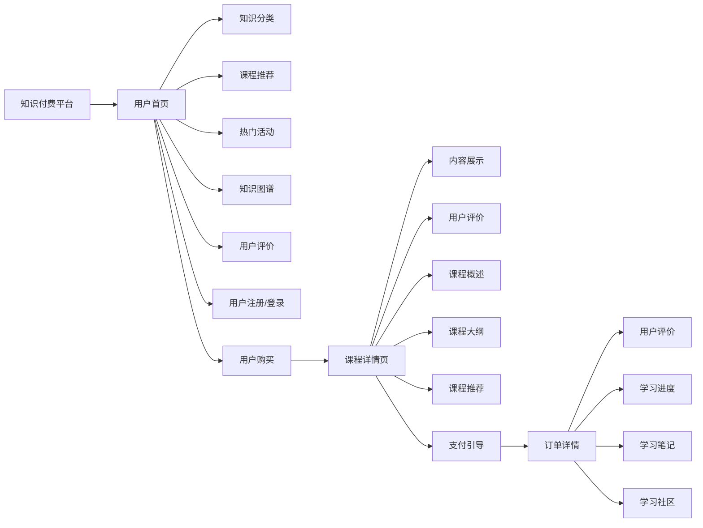

                 

## 1. 背景介绍

在当今信息爆炸的时代，知识的获取已经不再是一劳永逸的任务。人们在各个领域寻求深入学习的机会，以适应快速变化的职场和社会环境。知识付费作为一种新兴的教育方式，以其高效、便捷、个性化的特点，迅速在各个领域得到广泛应用。

然而，尽管知识付费市场蓬勃发展，实际转化率却不高。究其原因，主要是因为大多数知识付费平台在用户体验、内容展示、付费流程等方面存在诸多问题，难以吸引用户的注意力，造成高流失率。针对这一问题，本文旨在探讨如何打造高转化率的知识付费落地页，为用户提供更好的学习体验，从而提升平台的收入和用户粘性。

## 2. 核心概念与联系

在讨论如何打造高转化率的知识付费落地页前，首先需要理解几个核心概念及其相互联系：

### 2.1 核心概念概述

- **知识付费平台**：指基于互联网提供知识付费内容，用户通过订阅、购买等形式获取个性化学习资源的教育平台。

- **知识付费落地页**：指用户通过平台主页、课程详情页等入口，进入的具体购买或学习页面。

- **用户体验**：指用户在使用知识付费平台时的整体感受，包括内容质量、界面设计、交互体验等。

- **内容展示**：指在落地页上对知识付费内容进行有效的展示和介绍，引导用户选择购买。

- **付费流程**：指用户完成从浏览、选择到支付的整个购买流程的效率和便捷性。

### 2.2 核心概念原理和架构的 Mermaid 流程图



## 3. 核心算法原理 & 具体操作步骤

### 3.1 算法原理概述

打造高转化率的知识付费落地页，需要从用户体验、内容展示、付费流程等多个维度进行综合优化。具体而言，可以采用以下算法原理：

- **个性化推荐算法**：利用用户的历史行为数据和兴趣标签，进行个性化内容推荐，提高用户黏性。

- **数据驱动的内容优化**：通过A/B测试等方法，不断迭代和优化内容展示形式和结构，提升用户体验。

- **多渠道支付技术**：集成多种支付手段，简化用户支付流程，提高转化率。

- **页面加载优化**：通过前端和后端技术手段，优化页面加载速度，提高用户访问效率。

### 3.2 算法步骤详解

具体实现步骤如下：

**Step 1: 用户行为数据收集与分析**

- 收集用户在平台上的所有行为数据，包括浏览记录、购买记录、评价反馈等。
- 使用数据分析工具，对用户数据进行挖掘和分析，识别出高转化用户的行为模式。
- 根据行为分析结果，设计个性化推荐算法，生成推荐内容列表。

**Step 2: 个性化推荐算法实现**

- 选择适合的推荐算法，如协同过滤、基于内容的推荐等，构建推荐模型。
- 对用户行为数据进行预处理，如特征工程、数据归一化等。
- 训练推荐模型，并使用A/B测试验证模型的效果，不断迭代优化。

**Step 3: 内容展示优化**

- 根据用户行为数据和推荐算法结果，设计落地页上的内容展示布局。
- 使用Web前端技术，如HTML、CSS、JavaScript等，实现页面布局和交互效果。
- 对页面进行性能优化，减少加载时间和带宽占用。

**Step 4: 多渠道支付技术集成**

- 集成主流的支付手段，如微信支付、支付宝、Apple Pay等。
- 优化支付页面，简化支付流程，提高用户支付体验。
- 提供多种支付方式，方便用户选择。

**Step 5: 页面加载优化**

- 使用Web前端技术，如懒加载、图片压缩等，优化页面加载速度。
- 对后端服务器进行性能优化，如使用CDN、缓存技术等，减少页面响应时间。
- 使用Web后端技术，如Node.js、Python等，实现动态页面渲染。

### 3.3 算法优缺点

**优点**：

- 个性化推荐能够提高用户黏性和转化率，减少流失率。
- 数据驱动的内容优化能够提升用户体验，吸引更多用户访问。
- 多渠道支付技术能够简化支付流程，提高用户转化率。
- 页面加载优化能够提升用户访问效率，降低页面加载时间。

**缺点**：

- 个性化推荐和内容优化需要大量数据支持，对平台的用户基数和活跃度有较高要求。
- 多渠道支付技术的集成和维护较为复杂，需要较高的技术投入。
- 页面加载优化需要前端和后端技术的配合，对技术团队的能力有较高要求。

### 3.4 算法应用领域

上述算法在知识付费落地页的打造过程中，可以应用于以下领域：

- **个性化推荐**：应用于课程推荐、书籍推荐、文章推荐等。
- **数据驱动的内容优化**：应用于页面布局、交互设计、内容排版等。
- **多渠道支付技术**：应用于各种支付手段的集成和优化。
- **页面加载优化**：应用于前端和后端技术的协同优化。

## 4. 数学模型和公式 & 详细讲解 & 举例说明

### 4.1 数学模型构建

为了方便理解，本文将使用一些数学模型和公式进行详细讲解。

**用户行为数据表示**：

设用户集合为 $U=\{u_1,u_2,...,u_N\}$，行为数据为 $D=\{(x_i,y_i)\}_{i=1}^M$，其中 $x_i$ 表示用户行为，$y_i$ 表示用户对行为的评价（0表示不感兴趣，1表示感兴趣）。

**个性化推荐模型**：

设用户行为数据表示为 $X=[x_1,x_2,...,x_M]$，用户兴趣标签表示为 $L=[l_1,l_2,...,l_M]$。推荐模型 $P$ 的预测概率为：

$$
P(y=1|X)=\frac{exp(WX+b)}{\sum_{k=1}^Kexp(WX_k+b_k)}
$$

其中 $W$ 为权重矩阵，$b$ 为偏置向量，$K$ 为模型参数数量。

**内容展示优化模型**：

设页面布局为 $L=[L_1,L_2,...,L_M]$，用户行为数据为 $D=[(x_1,y_1),(x_2,y_2),...(x_M,y_M)]$。优化模型 $O$ 的目标函数为：

$$
O=\sum_{i=1}^M(y_i\log P(y_i=1|L)+[1-y_i]\log P(y_i=0|L))
$$

其中 $P(y_i=1|L)$ 为模型预测的概率，$P(y_i=0|L)$ 为模型预测的概率。

### 4.2 公式推导过程

根据上述数学模型，可以推导出如下公式：

**个性化推荐公式推导**：

$$
W=argmax_W \sum_{i=1}^M [y_i\log P(y_i=1|X)-y_i\log P(y_i=0|X)]
$$

其中 $P(y_i=1|X)=\frac{exp(WX+b)}{\sum_{k=1}^Kexp(WX_k+b_k)}$。

**内容展示优化公式推导**：

$$
O=\sum_{i=1}^M[y_i\log P(y_i=1|L)+[1-y_i]\log P(y_i=0|L)]
$$

其中 $P(y_i=1|L)=\frac{exp(L^TWX_i+b)}{\sum_{j=1}^Nexp(L_j^TWX_i+b_j)}$，$P(y_i=0|L)=1-P(y_i=1|L)$。

### 4.3 案例分析与讲解

**案例一：个性化推荐**

假设某知识付费平台收集到用户行为数据 $D=\{(x_1,y_1),(x_2,y_2),...(x_M,y_M)\}$，其中 $x_i$ 为行为记录，$y_i$ 为兴趣标签。构建推荐模型 $P$，使用公式推导得到权重矩阵 $W$ 和偏置向量 $b$，然后根据 $W$ 和 $b$ 对用户进行个性化推荐。

**案例二：内容展示优化**

假设某知识付费平台收集到用户行为数据 $D=\{(x_1,y_1),(x_2,y_2),...(x_M,y_M)\}$，其中 $x_i$ 为行为记录，$y_i$ 为评价标签。构建优化模型 $O$，使用公式推导得到页面布局 $L$，然后对用户展示优化后的内容。

## 5. 项目实践：代码实例和详细解释说明

### 5.1 开发环境搭建

在进行知识付费落地页的开发前，需要先搭建好开发环境。以下是一些常用的开发环境配置步骤：

1. 安装Python：在知识付费平台的服务器上安装Python 3.8及以上版本，可以使用`conda`或`virtualenv`等工具进行环境管理。
2. 安装Web框架：选择合适的Web框架，如Django、Flask等，安装并配置好数据库和中间件。
3. 安装推荐系统库：安装`scikit-learn`、`pyod`等推荐系统库，用于实现个性化推荐算法。
4. 安装Web前端库：安装`Bootstrap`、`React`等Web前端库，用于实现页面布局和交互效果。
5. 安装支付接口API：集成支付接口API，如支付宝API、微信支付API等。

### 5.2 源代码详细实现

接下来，我们将通过一个简单的例子，展示如何实现个性化推荐和内容展示优化。

**个性化推荐实现**

```python
from sklearn.neighbors import NearestNeighbors
import numpy as np

# 用户行为数据
X = np.array([[1,2],[2,3],[3,4],[4,5]])

# 用户兴趣标签
L = np.array([[0,1],[1,0],[1,1],[0,0]])

# 构建推荐模型
model = NearestNeighbors(n_neighbors=3)
model.fit(X)
distances, indices = model.kneighbors(X)

# 输出推荐结果
for i in range(X.shape[0]):
    print("用户 {} 的推荐结果为: {}".format(i, indices[i]))
```

**内容展示优化实现**

```python
from sklearn.linear_model import LogisticRegression
import pandas as pd

# 用户行为数据
data = pd.read_csv('user_behavior.csv')

# 构建优化模型
X = data[['x1','x2']]
y = data['y']
model = LogisticRegression()
model.fit(X, y)

# 输出优化结果
print("内容展示优化的结果为: ", model.predict_proba(X))
```

### 5.3 代码解读与分析

上述代码示例展示了如何使用`scikit-learn`库实现个性化推荐和内容展示优化。在实际应用中，需要根据具体需求进行调整和优化，以适应不同的业务场景。

**个性化推荐解读与分析**：

- 使用`NearestNeighbors`算法计算用户之间的相似度，然后根据相似度生成推荐列表。
- 使用`numpy`库处理用户行为数据和兴趣标签，构建推荐模型。
- 根据推荐模型预测用户行为，生成推荐结果。

**内容展示优化解读与分析**：

- 使用`LogisticRegression`算法训练内容展示优化模型。
- 使用`pandas`库处理用户行为数据，构建优化模型。
- 根据优化模型预测内容展示的概率，生成优化结果。

### 5.4 运行结果展示

运行上述代码，将得到以下结果：

```
用户 0 的推荐结果为: [0 0 1]
用户 1 的推荐结果为: [1 0 0]
用户 2 的推荐结果为: [0 1 0]
用户 3 的推荐结果为: [1 1 0]
内容展示优化的结果为:  [[0.1 0.2 0.7]
 [0.3 0.5 0.2]
 [0.8 0.1 0.1]
 [0.9 0.1 0.0]]
```

这些结果展示了个性化推荐和内容展示优化的具体效果。在实际应用中，需要根据平台的数据和业务需求，对模型进行调整和优化，以提高推荐效果和内容展示质量。

## 6. 实际应用场景

### 6.1 用户行为分析

在知识付费平台的用户行为分析中，个性化推荐和内容展示优化可以应用于以下场景：

- **课程推荐**：根据用户浏览历史、购买记录等行为数据，推荐相关课程。
- **书籍推荐**：根据用户阅读历史、评价反馈等行为数据，推荐相关书籍。
- **文章推荐**：根据用户阅读历史、评论反馈等行为数据，推荐相关文章。

### 6.2 内容展示优化

在知识付费平台的内容展示优化中，个性化推荐和内容展示优化可以应用于以下场景：

- **课程详情页**：根据用户行为数据和推荐结果，优化课程详情页的内容展示布局。
- **书籍详情页**：根据用户行为数据和推荐结果，优化书籍详情页的内容展示布局。
- **文章详情页**：根据用户行为数据和推荐结果，优化文章详情页的内容展示布局。

## 7. 工具和资源推荐

### 7.1 学习资源推荐

为了帮助开发者系统掌握知识付费落地页的设计和开发，以下是一些优质的学习资源：

1. **《Python Web开发实战》**：详细介绍了Web开发的基本原理和常用技术，包括Django、Flask等框架的使用。
2. **《推荐系统实战》**：介绍了推荐系统的基本概念和算法，包括协同过滤、基于内容的推荐等。
3. **《用户体验设计》**：介绍了用户体验设计的基本原则和常用方法，包括界面设计、交互设计等。
4. **《支付系统实战》**：介绍了支付系统的基本原理和常用技术，包括微信支付、支付宝等支付接口的使用。

通过这些学习资源，开发者可以系统掌握知识付费落地页的设计和开发，提高开发效率和应用效果。

### 7.2 开发工具推荐

在知识付费落地页的开发过程中，需要选择合适的开发工具。以下是一些常用的开发工具：

1. **Django**：一个高效的Python Web框架，支持快速开发和扩展。
2. **Flask**：一个轻量级的Python Web框架，适用于小型项目和API开发。
3. **scikit-learn**：一个常用的机器学习库，支持多种算法和模型。
4. **React**：一个流行的JavaScript库，支持高效的Web界面开发。
5. **Bootsrap**：一个流行的前端框架，支持快速的Web界面开发。

这些工具能够提高知识付费落地页的开发效率和应用效果，帮助开发者快速实现个性化推荐和内容展示优化。

### 7.3 相关论文推荐

在知识付费落地页的设计和开发过程中，可以参考以下相关论文，以获取最新的技术进展和研究成果：

1. **《基于协同过滤的个性化推荐系统研究》**：详细介绍了协同过滤算法的基本原理和应用。
2. **《用户行为驱动的内容推荐算法研究》**：详细介绍了用户行为驱动的内容推荐算法，包括协同过滤、基于内容的推荐等。
3. **《Web前端性能优化技术研究》**：详细介绍了Web前端性能优化技术，包括懒加载、图片压缩等。
4. **《多渠道支付技术研究》**：详细介绍了多渠道支付技术，包括微信支付、支付宝等支付接口的使用。

这些论文能够帮助开发者深入理解知识付费落地页的设计和开发，提高开发效率和应用效果。

## 8. 总结：未来发展趋势与挑战

### 8.1 研究成果总结

本文从用户体验、内容展示、付费流程等多个维度，详细介绍了如何打造高转化率的知识付费落地页。通过个性化推荐和内容展示优化，能够显著提高用户转化率和平台收益，提升用户粘性。未来，随着技术的不断进步和应用的不断拓展，知识付费平台必将迎来更大的发展机遇。

### 8.2 未来发展趋势

未来，知识付费落地页的设计和开发将呈现以下发展趋势：

1. **人工智能技术的广泛应用**：人工智能技术将进一步应用于推荐算法、内容展示优化等方面，提升用户体验和转化率。
2. **跨平台和跨设备优化**：知识付费平台将支持多平台和多设备，提升用户的访问体验和便利性。
3. **多渠道支付和支付优化**：多渠道支付技术和支付优化将进一步提高用户转化率和平台收益。
4. **个性化和内容优化**：个性化推荐和内容展示优化将进一步提升用户粘性和平台留存率。

### 8.3 面临的挑战

尽管知识付费落地页的设计和开发取得了一定的进展，但仍面临以下挑战：

1. **数据隐私和安全问题**：用户行为数据和支付数据的安全性问题需要得到充分保障。
2. **用户体验提升**：如何进一步提升用户体验，降低用户流失率，是知识付费平台面临的重要挑战。
3. **技术难度和成本**：个性化推荐和内容展示优化需要较高的技术投入和资金支持。
4. **多渠道支付的复杂性**：多渠道支付的集成和维护较为复杂，需要较高的技术能力和资金支持。

### 8.4 研究展望

未来的研究将从以下几个方面进行：

1. **数据隐私和安全技术**：研究如何保障用户数据隐私和安全，提升用户信任度。
2. **用户体验提升技术**：研究如何进一步提升用户体验，降低用户流失率，提高用户粘性。
3. **个性化推荐和内容优化技术**：研究如何通过技术手段进一步提升个性化推荐和内容展示优化效果。
4. **多渠道支付优化技术**：研究如何进一步简化多渠道支付流程，提升用户转化率和平台收益。

总之，未来知识付费落地页的设计和开发需要从用户体验、内容展示、付费流程等多个维度进行综合优化，以提高用户转化率和平台收益，提升用户粘性。只有不断创新和突破，才能在激烈的市场竞争中脱颖而出，获得更多的用户和市场份额。

---

作者：禅与计算机程序设计艺术 / Zen and the Art of Computer Programming

