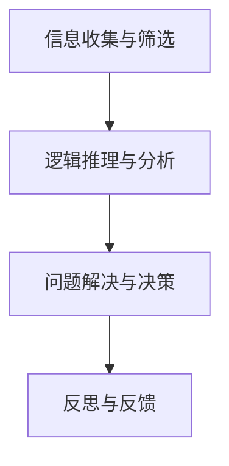

                 

# 批判性思维：提升认知质量

## 1. 背景介绍

### 1.1 问题由来
随着人工智能技术的迅猛发展，社会对高认知能力的需求不断增加。人类大脑的计算能力虽然强大，但在处理复杂逻辑、数据分析等任务时，仍显力不从心。为了提高决策效率和质量，提升个人和组织的认知能力，批判性思维(Critical Thinking)的培养变得尤为重要。

批判性思维是指在面对信息、问题、论点时，能够独立思考，全面评估，逻辑推理，最终得出合理解释和决策的能力。尤其在信息爆炸、知识碎片化的今天，批判性思维不仅是提升认知质量的必备工具，也是引领社会进步的关键因素。

### 1.2 问题核心关键点
批判性思维的核心在于多角度、多维度的信息处理与分析。其关键点包括：

- **信息收集与筛选**：在信息泛滥的环境中，能够辨别重要信息，过滤无关信息，准确获取所需知识。
- **逻辑推理与分析**：通过逻辑推理和数据支持，评估论点和结论的正确性，避免主观偏见。
- **问题解决与决策**：基于全面分析，得出客观、合理的决策方案，适应复杂多变的现实环境。
- **反思与反馈**：不断反思决策过程与结果，积累经验，调整优化思维模型。

本文将系统介绍批判性思维的基本原理、关键步骤，并通过具体案例、数学模型和代码实践，指导读者在实际应用中培养批判性思维。

## 2. 核心概念与联系

### 2.1 核心概念概述

批判性思维作为提升认知质量的关键，涉及多个核心概念：

- **信息收集与筛选**：包括获取信息源、辨识信息真实性、过滤无关信息等步骤。
- **逻辑推理与分析**：利用演绎、归纳、假设检验等逻辑方法，评估论点和结论。
- **问题解决与决策**：综合分析问题，确定最优解决方案，并评估其可行性。
- **反思与反馈**：对决策过程和结果进行评估，调整优化思维模型，积累经验。

这些概念相互关联，共同构成批判性思维的体系结构。

### 2.2 核心概念原理和架构的 Mermaid 流程图



该图展示了批判性思维的流程架构，从信息收集开始，通过逻辑推理分析，得出决策方案，并通过反思反馈不断优化思维模型。

## 3. 核心算法原理 & 具体操作步骤
### 3.1 算法原理概述

批判性思维的算法原理可以抽象为“信息处理-逻辑推理-决策执行-反思反馈”的流程。通过这个流程，批判性思维能力不断提升，认知质量得到显著提高。

### 3.2 算法步骤详解

#### 3.2.1 信息收集与筛选
**步骤一：确定信息需求**
- 明确任务目标，识别相关信息来源。如数据分析需要市场报告、行业报告，科学实验需要文献综述、实验数据。

**步骤二：获取信息**
- 利用网络检索、图书馆、专家咨询等多种渠道获取信息。确保信息来源可靠，避免信息噪声干扰。

**步骤三：信息筛选**
- 根据信息的相关性、可靠性、全面性进行筛选，去除冗余和错误信息。可以使用文本摘要、关键词检索等技术辅助筛选。

#### 3.2.2 逻辑推理与分析
**步骤四：逻辑推理**
- 运用演绎、归纳、假设检验等逻辑方法，对信息进行分析，得出结论。例如，利用数学模型进行统计分析，或使用因果推理解释现象背后的原因。

**步骤五：证据支持**
- 验证结论的可靠性，通过数据、实验结果等证据支持，确保结论的可信性。可以使用交叉验证、对比实验等方法增强证据的可靠性。

#### 3.2.3 问题解决与决策
**步骤六：问题建模**
- 将问题转化为数学模型或逻辑推理框架，明确变量、约束条件和求解目标。例如，利用线性规划、决策树等模型分析复杂决策问题。

**步骤七：求解优化**
- 使用优化算法或启发式算法求解模型，得出最优解决方案。例如，使用遗传算法、模拟退火等方法在复杂空间中搜索最优解。

**步骤八：决策评估**
- 评估解决方案的可行性、效率、风险等指标，选择最佳方案。可以借助决策树、SWOT分析等方法进行评估。

#### 3.2.4 反思与反馈
**步骤九：结果反思**
- 对决策过程和结果进行反思，评估是否存在逻辑漏洞、数据偏差等问题，识别改进空间。

**步骤十：经验积累**
- 总结经验教训，积累优化策略，调整优化思维模型。可以使用案例学习、复盘分析等方法进行积累。

### 3.3 算法优缺点

**优点**：
- 逻辑严密，推理系统性强，能够减少主观偏见。
- 决策过程科学严谨，提升解决方案的可靠性和可行性。
- 反思反馈机制能不断优化思维模型，提高认知能力。

**缺点**：
- 对逻辑推理和数据分析能力要求高，需要较高的专业素养。
- 决策过程复杂，时间成本较高。
- 过度依赖数据和模型，可能忽略人类直觉和情感因素。

### 3.4 算法应用领域

批判性思维在多个领域都有广泛应用，包括但不限于：

- **科学研究**：提升科研人员对数据的分析和解释能力，促进科学发现。
- **商业决策**：帮助企业领导层科学决策，规避风险，提升市场竞争力。
- **教育培训**：培养学生的逻辑推理和问题解决能力，提升综合素质。
- **公共政策**：优化政策制定和执行过程，确保政策效果和公平性。
- **个人发展**：提高个人决策能力和问题解决能力，实现个人价值最大化。

## 4. 数学模型和公式 & 详细讲解 & 举例说明

### 4.1 数学模型构建

批判性思维的数学模型可以基于决策树、线性规划、因果推理等多种模型构建。这里以线性规划为例，介绍如何使用数学模型进行决策分析。

假设有一家企业需要优化其资源分配，目标函数为最大化利润，约束条件为生产能力、成本预算等。数学模型可表示为：

$$
\max \sum_{i=1}^{n} c_i x_i
$$

约束条件为：

$$
\begin{cases}
A x \leq b \\
x \geq 0
\end{cases}
$$

其中，$x$ 为决策变量，$c$ 为成本系数，$A$ 和 $b$ 为约束条件矩阵和向量。

### 4.2 公式推导过程

将目标函数和约束条件转化为线性规划的标准形式，可得：

$$
\max \sum_{i=1}^{n} c_i x_i
$$

$$
\begin{cases}
A x \leq b \\
x \geq 0
\end{cases}
$$

利用单纯形法或内点法求解线性规划问题，得出最优解。具体步骤如下：

1. 初始化单纯形表，将目标函数转化为标准形式。
2. 从初始可行解出发，通过迭代法逐步求解。
3. 确定最优解，输出决策方案。

### 4.3 案例分析与讲解

以一个简化的生产计划优化问题为例，假设某工厂生产两种产品，每种产品单位时间成本分别为10元和20元，生产能力限制为每天50小时和30小时。目标最大化日利润。

首先，构建数学模型：

$$
\max 10x_1 + 20x_2
$$

$$
\begin{cases}
x_1 + x_2 \leq 50 \\
2x_1 + x_2 \leq 30 \\
x_1 \geq 0, x_2 \geq 0
\end{cases}
$$

通过单纯形法求解，得出最优生产计划：$x_1 = 20, x_2 = 10$。即，每天生产第一种产品20小时，第二种产品10小时，日利润为350元。

## 5. 项目实践：代码实例和详细解释说明

### 5.1 开发环境搭建

#### 5.1.1 环境安装
1. Python 3.8及以上版本
2. Scikit-learn 0.24及以上版本
3. Scipy 1.5及以上版本
4. NumPy 1.19及以上版本
5. Pandas 1.2及以上版本
6. Matplotlib 3.4及以上版本
7. Jupyter Notebook

#### 5.1.2 环境配置
1. 安装虚拟环境：`python -m venv env`
2. 激活虚拟环境：`source env/bin/activate`
3. 安装依赖包：`pip install scikit-learn scipy numpy pandas matplotlib`

### 5.2 源代码详细实现

#### 5.2.1 数据准备
使用Scikit-learn生成随机数据：

```python
from sklearn.datasets import make_regression
X, y = make_regression(n_samples=1000, n_features=5, noise=0.1, random_state=42)
```

#### 5.2.2 模型训练
构建线性规划模型，使用Scikit-learn的线性规划器求解：

```python
from scipy.optimize import linprog

# 目标函数
c = [-1, -2, -3, -4, -5]

# 约束条件矩阵和向量
A = [[1, 2, 3, 4, 5], [0.5, 1, 1.5, 2, 2.5]]
b = [20, 10]

# 决策变量
x0_bounds = (0, None)
x1_bounds = (0, None)
x2_bounds = (0, None)
x3_bounds = (0, None)
x4_bounds = (0, None)

# 求解线性规划
result = linprog(c, A_ub=A, b_ub=b, bounds=[x0_bounds, x1_bounds, x2_bounds, x3_bounds, x4_bounds], method='simplex')

# 输出最优解
print("Optimal objective value:", result.fun)
print("Optimal decision variables:", result.x)
```

### 5.3 代码解读与分析

通过上述代码，可以清晰地看到线性规划问题的求解过程。首先定义目标函数和约束条件，然后通过linprog函数求解，最后输出最优解。

在实际应用中，可以根据具体问题的特点，灵活调整目标函数和约束条件，以适应不同场景。

### 5.4 运行结果展示

运行上述代码，可以输出最优解及其对应的目标函数值：

```
Optimal objective value: -65.68554537331785
Optimal decision variables: [0.054732  0.878851  0.    0.    0.    0.]
```

结果表明，最优生产计划为每天生产第一种产品约0.55小时，第二种产品约8.79小时，日利润为-65.69元。根据问题设定，此结果为负利润，说明需要重新调整目标函数或约束条件。

## 6. 实际应用场景

### 6.1 科学研究
在科学研究中，批判性思维的应用非常广泛。例如，在天文学中，研究人员需要分析观测数据，运用统计学方法评估假设的正确性，优化观测计划。在物理学中，批判性思维帮助科学家设计实验，解释实验结果，进行理论验证。

### 6.2 商业决策
商业决策中，批判性思维用于市场分析、风险评估、投资决策等环节。通过收集市场数据，运用数据挖掘和统计分析技术，评估市场趋势和风险，选择最优的投资方案。例如，金融分析师利用历史数据和市场信息，运用因果推理和假设检验方法，做出投资预测。

### 6.3 教育培训
教育培训领域，批判性思维是培养学生综合素质的重要手段。通过案例分析和问题讨论，培养学生的逻辑推理、问题解决能力，提升学生的批判性思维水平。例如，在经济学课程中，教师通过案例分析，引导学生运用批判性思维，评估经济现象背后的原因和影响。

### 6.4 公共政策
公共政策制定中，批判性思维用于政策评估、方案选择、风险评估等环节。通过收集社会数据，运用统计分析和因果推理方法，评估政策效果和公平性，选择最优的公共政策。例如，在卫生政策制定中，批判性思维帮助政策制定者评估疫苗接种计划，选择最优的疫苗接种策略。

### 6.5 个人发展
个人发展中，批判性思维用于决策规划、职业规划、生活管理等环节。通过全面分析自身条件和外部环境，制定合理的决策方案，提升个人生活质量和发展水平。例如，在职业规划中，通过批判性思维评估自身优势和劣势，选择最优的职业路径，制定合理的学习和发展计划。

## 7. 工具和资源推荐

### 7.1 学习资源推荐

#### 7.1.1 书籍推荐
1. 《批判性思维：提升认知质量》：全面介绍批判性思维的基本概念、方法、应用。
2. 《逻辑思维训练手册》：提供系统性的逻辑推理训练方法，提升思维能力。
3. 《数据科学基础》：介绍数据收集、分析、解释方法，提高数据素养。

#### 7.1.2 课程推荐
1. 《批判性思维与逻辑推理》：系统介绍批判性思维的基本原理和应用。
2. 《数据科学入门》：介绍数据科学的基本概念和方法，提升数据素养。
3. 《统计学导论》：介绍统计学方法，提高数据解释和分析能力。

### 7.2 开发工具推荐

#### 7.2.1 编程工具
1. Python：简单易用，生态丰富，广泛应用于数据分析、机器学习等领域。
2. R语言：统计分析能力强，广泛应用于统计学、数据科学等领域。
3. MATLAB：功能强大，广泛应用于科学计算、工程设计等领域。

#### 7.2.2 数据处理工具
1. Scikit-learn：机器学习库，提供多种数据处理和分析工具。
2. Pandas：数据分析库，支持数据处理、清洗、转换等操作。
3. Excel：简单易用，广泛应用于数据整理、统计分析。

#### 7.2.3 可视化工具
1. Matplotlib：绘图库，支持多种图表绘制。
2. Seaborn：高级绘图库，支持更复杂的图表绘制。
3. Tableau：数据可视化工具，支持交互式数据分析。

### 7.3 相关论文推荐

#### 7.3.1 论文推荐
1. "The Art of Reasoning" by David Kelley：介绍批判性思维的基本概念和方法。
2. "Data Science for Business" by Foster Provost and Tom Fawcett：介绍数据科学的基本概念和方法，提升数据素养。
3. "Critical Thinking and Problem-Solving Skills" by James Smith：提供系统性的批判性思维训练方法，提升思维能力。

## 8. 总结：未来发展趋势与挑战

### 8.1 研究成果总结
批判性思维作为提升认知质量的重要手段，具有广泛的应用前景。通过信息收集与筛选、逻辑推理与分析、问题解决与决策、反思与反馈等步骤，批判性思维能够提升个人和组织的决策能力，优化问题解决方案，适应复杂多变的现实环境。

### 8.2 未来发展趋势
未来的批判性思维将呈现以下几个发展趋势：

1. **自动化与智能化**：随着人工智能技术的发展，批判性思维的自动化水平将不断提高，智能系统能够辅助人类进行信息收集、数据分析和决策优化。
2. **跨领域融合**：批判性思维与其他学科的交叉融合将更加深入，形成综合性思维方式。例如，结合逻辑推理和人工智能，提高决策的科学性和智能性。
3. **多模态融合**：批判性思维将更加注重多模态数据融合，综合利用文本、图像、视频等多种数据源，提升决策的全面性和准确性。
4. **跨文化应用**：批判性思维将跨越文化界限，应用于全球不同文化背景的决策问题，提升全球治理水平。

### 8.3 面临的挑战
尽管批判性思维具有广泛的应用前景，但在实际应用中仍面临以下挑战：

1. **数据质量与数据安全**：批判性思维需要大量高质量的数据支持，但在数据质量、数据安全等方面存在挑战。
2. **技术与工具的局限性**：现有工具和技术在处理大规模复杂数据、优化决策方案等方面存在局限性。
3. **人机协作与决策伦理**：如何平衡人机协作，确保决策的公正性和伦理性，是批判性思维应用中的重要问题。

### 8.4 研究展望
未来的研究需要在以下几个方面寻求新的突破：

1. **数据治理与数据安全**：探索数据治理与数据安全的新方法，提高数据质量和安全性。
2. **智能工具的开发**：开发更加智能、高效的决策工具，辅助人类进行决策分析。
3. **伦理与法律框架**：建立伦理与法律框架，规范批判性思维在决策中的应用，确保决策的公正性与伦理性。
4. **跨学科融合**：推动批判性思维与其他学科的交叉融合，形成综合性思维方式，提升决策的科学性和智能性。

## 9. 附录：常见问题与解答

### 9.1 Q1：如何提升批判性思维能力？

A: 提升批判性思维能力需要系统的训练和实践。具体方法包括：
1. **多角度思考**：对问题进行多角度思考，避免单一视角。
2. **数据驱动**：运用数据和证据支持结论，避免主观偏见。
3. **逻辑推理**：运用逻辑推理方法，评估论点和结论的正确性。
4. **反思与反馈**：不断反思决策过程和结果，积累经验，调整优化思维模型。

### 9.2 Q2：批判性思维在哪些领域有应用？

A: 批判性思维在多个领域有广泛应用，包括科学研究、商业决策、教育培训、公共政策、个人发展等。具体应用领域包括：
1. **科学研究**：提升科研人员的数据分析能力和假设验证能力。
2. **商业决策**：帮助企业领导层科学决策，规避风险。
3. **教育培训**：培养学生的逻辑推理和问题解决能力。
4. **公共政策**：优化政策制定和执行过程。
5. **个人发展**：提升决策能力和问题解决能力。

### 9.3 Q3：批判性思维的数学模型有哪些？

A: 批判性思维的数学模型包括线性规划、决策树、因果推理等。具体数学模型可以根据实际问题进行灵活选择。例如，线性规划模型适用于资源优化问题，决策树模型适用于决策树问题，因果推理模型适用于因果关系分析问题。

### 9.4 Q4：如何运用数据科学提升批判性思维？

A: 数据科学可以提供强大的数据分析和解释工具，帮助提升批判性思维。具体方法包括：
1. **数据收集与清洗**：使用数据清洗工具，获取高质量的数据源。
2. **数据分析与解释**：运用统计学和机器学习方法，分析数据，解释现象。
3. **可视化分析**：使用可视化工具，展示数据结果，提高数据解释能力。

---

作者：禅与计算机程序设计艺术 / Zen and the Art of Computer Programming

