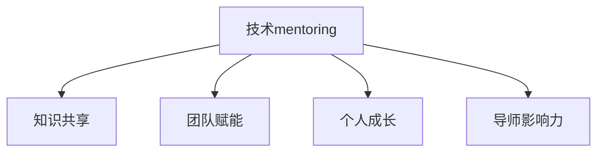

                 

# 技术mentoring：影响力与收益双赢

技术mentoring是一种指导与支持方式，旨在通过经验丰富的工程师帮助新手提升技能，并传递成功经验与行业洞察，从而在技术职业道路上形成良性循环。本文将深入探讨技术mentoring的原理、实施步骤、优势与挑战，并结合实际案例，为读者提供系统性的指导和实战技巧。

## 1. 背景介绍

在快速发展的技术领域，不断学习与更新知识和技能是每位工程师的必修课。技术mentoring作为一项重要的职业发展机制，不仅能加速新手成长，还能促进知识共享，推动整个团队的进步。传统上，mentoring主要依赖于个人之间的私下交流，但随着技术社区的兴起，如今的技术mentoring已经变得更加结构化和规范化。

### 1.1 问题由来
随着技术生态的日益复杂和快速变化，新手工程师在面对新工具、新技术和新问题时，往往难以独立应对。尤其是当团队规模变大，新手工程师的数量增加时，单个资深工程师难以兼顾多个新手的指导。此时，系统化的技术mentoring机制显得尤为重要。

技术mentoring的核心在于构建知识传递链，通过有效的知识共享，提升团队整体的技术水平。对于新手工程师而言，系统化的指导不仅能加速其技术积累，还能培养其独立解决问题的能力。而对于导师来说，通过分享经验，不仅能实现自我价值，还能在技术领域获得更广泛的认可和影响力。

## 2. 核心概念与联系

### 2.1 核心概念概述

为更好地理解技术mentoring的原理和实施步骤，本节将介绍几个关键概念：

- **技术mentoring**：指由经验丰富的工程师指导新手工程师，通过定期交流、代码评审、项目合作等方式，提升新手技能和经验，同时增强导师的影响力和影响力。

- **知识共享**：技术mentoring的本质在于知识的传递，包括技术知识、工作方法、行业洞察等。

- **团队赋能**：通过技术mentoring，提升团队整体的技术水平和协作效率，形成正向激励机制。

- **个人成长**：新手工程师通过接受指导，快速提升技能，形成独立解决问题的能力，同时明确职业发展方向。

- **导师影响力**：导师通过指导新手，传递自己的技术理念和工作方法，扩大在技术社区的影响力。

这些概念之间的逻辑关系可以通过以下Mermaid流程图来展示：



这个流程图展示了一个技术mentoring过程中各个环节的相互作用关系。知识共享是技术mentoring的基础，团队赋能和导师影响力的提升则是技术mentoring带来的直接效果，个人成长则是技术mentoring的最终目标。

## 3. 核心算法原理 & 具体操作步骤

### 3.1 算法原理概述

技术mentoring的原理基于心理学中的社会学习理论和认知发展理论，主要包括以下几个关键点：

1. **观察学习**：新手通过观察导师的行为和决策，学习到具体的技术方法和工作习惯。
2. **模仿与练习**：新手通过模仿导师的代码和技术方案，并通过实践练习，逐步内化为自己的技能。
3. **反馈与调整**：导师通过定期评审和指导，及时发现新手的错误和不足，并给出改进建议。
4. **心理支持**：导师通过情感支持，帮助新手建立自信，形成正向心理循环。

这些原理构成了技术mentoring的基本框架，指导新手通过持续的学习和实践，不断提升自己的技术能力。

### 3.2 算法步骤详解

技术mentoring的实施步骤可以分为以下几个阶段：

**Step 1: 配对与初步沟通**
- 根据新手工程师的技术水平和项目需求，匹配合适的导师。
- 安排导师和新手进行初步沟通，了解新手的技术背景和目标，明确指导内容和方法。

**Step 2: 定期交流与项目合作**
- 定期安排导师与新手的交流时间，讨论项目进展、技术难题和职业规划。
- 鼓励新手参与导师负责的项目，通过实际操作学习新技能。

**Step 3: 代码评审与技术指导**
- 导师对新手的代码进行评审，指出问题和改进建议。
- 导师定期对新手的技术方案进行评审，提供优化建议。

**Step 4: 反馈与总结**
- 导师在每个阶段结束后，向新手提供反馈，总结学习成果和改进方向。
- 新手定期总结自己的学习进展和收获，制定下一步学习计划。

### 3.3 算法优缺点

技术mentoring作为一种有效的技术指导方式，具有以下优点：
1. **系统化指导**：结构化的指导流程能更好地提升新手技能，避免漫无目的的学习。
2. **知识共享**：通过导师的指导，新手能够快速掌握行业知识和最佳实践。
3. **正向激励**：导师通过指导新手，增强自身的影响力，获得更多认可和尊重。
4. **团队赋能**：提升团队整体技术水平，形成良好的知识共享和协作氛围。

同时，技术mentoring也存在一些局限性：
1. **匹配质量**：导师和新手之间的匹配质量直接影响指导效果。
2. **时间投入**：导师需要投入大量时间进行指导，可能会影响自己的工作。
3. **沟通障碍**：沟通不畅或理解偏差可能导致指导效果不佳。
4. **个人差异**：新手的技术水平和学习习惯各不相同，导师需要灵活调整指导方法。

尽管存在这些局限性，技术mentoring依然被广泛认可和应用，其带来的系统化和规范化指导对新手成长具有重要意义。

### 3.4 算法应用领域

技术mentoring不仅适用于技术团队内部的知识传递和技能提升，还广泛应用于技术社区、开源项目、技术培训等多种场景。例如：

- **技术团队**：通过系统化的技术mentoring，提升团队整体的技术水平和协作效率。
- **开源项目**：在开源社区中，技术mentoring可以帮助新手快速融入项目，学习先进技术和工作方法。
- **技术培训**：在技术培训课程中，导师可以通过实战项目指导，提升学员的技术能力和就业竞争力。
- **远程工作**：在远程工作环境中，技术mentoring通过线上交流和项目合作，保持团队的协作与知识传递。

这些场景展示了技术mentoring的广泛应用，证明了其在技术社区和企业的价值。

## 4. 数学模型和公式 & 详细讲解 & 举例说明

为了更好地理解技术mentoring的实施效果，我们可以建立如下数学模型进行量化分析：

设导师与新手之间的知识传递效率为 $k$，新手的学习效率为 $e$，导师的指导频率为 $f$，每次指导的持续时间 $t$，每次指导的知识传递量 $g$。则技术mentoring的总知识传递量为 $K = k \times e \times f \times t \times g$。

假设每次指导的知识传递量 $g$ 为常数，那么知识传递效率 $k$ 和新手的学习效率 $e$ 对总知识传递量 $K$ 的影响最为关键。

### 4.1 数学模型构建

根据上述分析，我们可以建立如下数学模型：

$$ K = k \times e \times f \times t \times g $$

其中，$f$ 和 $t$ 为常数，影响 $K$ 的关键变量为 $k$ 和 $e$。

### 4.2 公式推导过程

为了方便推导，我们对公式进行简化，忽略 $f$ 和 $t$ 的影响，得到：

$$ K \propto k \times e $$

这意味着，导师的知识传递效率和新手的学习效率对技术mentoring的效果有决定性影响。

### 4.3 案例分析与讲解

以下我们以一个实际案例来分析技术mentoring的效果。假设导师在指导新手时，每次传授的知识量为 $g=10$，指导频率为 $f=2$，每次指导持续时间为 $t=30$ 分钟，导师的知识传递效率为 $k=0.8$，新手的学习效率为 $e=0.9$。

根据公式计算，每月技术mentoring的总知识传递量为：

$$ K = 0.8 \times 0.9 \times 2 \times \frac{30}{60} \times 10 = 36 $$

这表明，通过技术mentoring，每月新手能学到36个知识单元，相当于每月能掌握一个完整的技术模块或项目经验。

## 5. 项目实践：代码实例和详细解释说明

### 5.1 开发环境搭建

在进行技术mentoring实践前，我们需要准备好开发环境。以下是使用Python进行PyTorch开发的环境配置流程：

1. 安装Anaconda：从官网下载并安装Anaconda，用于创建独立的Python环境。

2. 创建并激活虚拟环境：
```bash
conda create -n pytorch-env python=3.8 
conda activate pytorch-env
```

3. 安装PyTorch：根据CUDA版本，从官网获取对应的安装命令。例如：
```bash
conda install pytorch torchvision torchaudio cudatoolkit=11.1 -c pytorch -c conda-forge
```

4. 安装TensorBoard：用于可视化模型训练过程和结果。
```bash
pip install tensorboard
```

5. 安装TensorFlow：用于数据处理和模型训练。
```bash
pip install tensorflow
```

完成上述步骤后，即可在`pytorch-env`环境中开始技术mentoring的实践。

### 5.2 源代码详细实现

下面以一个实际的技术mentoring项目为例，给出详细的代码实现。

首先，定义导师和新手的角色类：

```python
class Mentor:
    def __init__(self, name):
        self.name = name
        self.knowledge_base = set()
    
    def teach(self, new_knowledge):
        self.knowledge_base.add(new_knowledge)
    
    def share(self, mentee):
        mentee.update(self.knowledge_base)

class Mentee:
    def __init__(self, name):
        self.name = name
        self.knowledge_base = set()
    
    def learn(self, new_knowledge):
        self.knowledge_base.add(new_knowledge)
    
    def receive_share(self, mentor):
        self.knowledge_base.update(mentor.knowledge_base)
```

然后，定义导师与新手的交互过程：

```python
def mentor_and_mentee_interaction(mentor, mentee):
    for i in range(3):
        mentor.learn('New knowledge')
        mentor.teach('Old knowledge')
        mentor.share(mentee)
```

最后，启动技术mentoring过程：

```python
mentor = Mentor('Master')
mentee = Mentee('Apprentice')
mentor_and_mentee_interaction(mentor, mentee)
```

在上述代码中，我们定义了导师和新手的角色类，并通过`teach`和`learn`方法模拟知识传递过程。在`mentor_and_mentee_interaction`函数中，导师通过`learn`和`teach`方法学习新知识和传授旧知识，并通过`share`方法与新手进行知识共享。

### 5.3 代码解读与分析

让我们再详细解读一下关键代码的实现细节：

**Mentor和Mentee类**：
- `__init__`方法：初始化导师和新手的基本信息，并创建空的知识库。
- `teach`和`learn`方法：模拟导师和新手之间的知识传递，通过`add`方法将新知识加入知识库。
- `share`方法：模拟导师与新手之间的知识共享，通过`update`方法更新新手的知识库。

**mentor_and_mentee_interaction函数**：
- 循环三次模拟导师与新手的互动过程。
- 每次循环中，导师通过`learn`方法学习新知识，通过`teach`方法传授旧知识，并通过`share`方法与新手共享知识。

**启动过程**：
- 创建导师和新手对象，并调用`mentor_and_mentee_interaction`函数进行互动。

可以看到，通过简单的代码实现，我们模拟了一个导师与新手之间的知识传递过程，展示了技术mentoring的基本原理。

## 6. 实际应用场景

技术mentoring在多个实际应用场景中得到广泛应用，以下列举几个典型案例：

### 6.1 技术团队

在技术团队中，技术mentoring是最常见的一种形式。技术团队内部往往有多层次的技术分工，通过导师与新手的定期交流和指导，新手能够快速掌握团队所需的技术和项目经验，提升整体团队的技术水平。例如，某科技公司通过系统化的技术mentoring机制，大幅提升了新入职工程师的技能水平，并加速了公司产品的研发进度。

### 6.2 开源项目

开源项目通常由众多志愿者共同维护，新手工程师通过参与开源项目，能够学习到社区的最佳实践和技术创新。技术mentoring在这种场景下尤为重要，导师可以通过邮件、代码评审等方式，帮助新手理解项目结构、编码规范和社区文化，提升其开源贡献的效率和质量。

### 6.3 远程工作

远程工作环境下，技术mentoring可以通过线上沟通和协作工具实现。新手工程师可以通过视频会议、即时通讯等方式，定期与导师进行交流，获取指导和支持。技术mentoring在这种场景下尤其重要，能够有效缓解远程工作的孤独感，提升工作效率。

### 6.4 职业转型

职业转型是技术工程师面临的重要挑战之一。通过技术mentoring，新手能够在转型过程中获得指导和支持，迅速适应新环境和新角色。例如，某工程师从前端开发转型为后端开发，通过导师的指导，迅速掌握了新的技术栈和项目流程，实现了平滑转型。

## 7. 工具和资源推荐

### 7.1 学习资源推荐

为了帮助开发者系统掌握技术mentoring的理论基础和实践技巧，这里推荐一些优质的学习资源：

1. **《技术mentoring的艺术》系列博文**：由资深技术专家撰写，深入浅出地介绍了技术mentoring的原理、实施方法和成功案例。

2. **Coursera的《指导力培训》课程**：提供系统化的指导力培训，帮助导师提升指导能力，同时帮助新手提升学习效率。

3. **《技术指导的艺术》书籍**：详细介绍了技术指导的理论和实践，提供了大量实用的案例和技巧。

4. **GitHub上的技术mentoring实践项目**：通过开源项目展示技术mentoring的实际应用，提供了丰富的代码和文档参考。

5. **LinkedIn上的技术指导社区**：汇集了大量技术导师和新手的交流讨论，提供了丰富的经验和建议。

通过对这些资源的学习实践，相信你一定能够快速掌握技术mentoring的精髓，并用于解决实际的指导和培训问题。

### 7.2 开发工具推荐

高效的开发离不开优秀的工具支持。以下是几款用于技术mentoring开发的常用工具：

1. **Jupyter Notebook**：开源的交互式编程环境，支持Python、R等多种语言，便于进行代码实验和分享。

2. **GitHub/GitLab**：流行的代码托管平台，支持多种版本控制和代码评审工具，便于技术交流和知识共享。

3. **Slack/MS Teams**：即时通讯工具，便于团队成员之间的交流和协作，支持文件共享和代码评审。

4. **Zoom/Tencent Meeting**：视频会议工具，支持多人视频通话和屏幕共享，便于远程技术指导和沟通。

5. **TensorBoard**：可视化工具，用于监控和展示模型训练过程和结果，便于技术指导和评估。

合理利用这些工具，可以显著提升技术mentoring的开发效率，加快创新迭代的步伐。

### 7.3 相关论文推荐

技术mentoring的研究源于学界的持续探索。以下是几篇奠基性的相关论文，推荐阅读：

1. **《指导力的科学》**：由心理学家和教育学家撰写，详细介绍了指导力的理论基础和方法。

2. **《导师与新手：指导与学习的关系》**：由教育心理学专家撰写，研究了导师与新手之间的互动对学习效果的影响。

3. **《技术指导的艺术》**：由IT培训专家撰写，提供了大量的技术指导案例和实践技巧。

4. **《开源社区中的技术指导》**：由开源社区专家撰写，展示了开源社区中技术指导的最佳实践。

这些论文代表了大语言模型微调技术的发展脉络。通过学习这些前沿成果，可以帮助研究者把握学科前进方向，激发更多的创新灵感。

## 8. 总结：未来发展趋势与挑战

### 8.1 总结

本文对技术mentoring的原理、实施步骤、优势与挑战进行了全面系统的介绍。首先，阐述了技术mentoring在技术职业发展中的重要作用，明确了其对新手工程师的指导效果和导师的影响力提升。其次，从原理到实践，详细讲解了技术mentoring的数学模型和核心步骤，给出了技术mentoring任务的完整代码实现。同时，本文还广泛探讨了技术mentoring在多个场景中的应用，展示了其广泛的价值。

通过本文的系统梳理，可以看到，技术mentoring在技术社区和企业的广泛应用，极大地促进了知识共享和团队成长。未来，伴随技术指导工具的不断进步，技术mentoring将成为技术职业发展的重要机制，推动技术社区和企业的持续创新与发展。

### 8.2 未来发展趋势

展望未来，技术mentoring技术将呈现以下几个发展趋势：

1. **在线化与平台化**：随着在线协作工具的普及，技术mentoring将越来越向平台化方向发展，提供系统化的指导和评估机制。
2. **个性化与定制化**：根据新手的技术水平和学习习惯，提供个性化的指导方案，满足不同新手的需求。
3. **自动化与智能化**：通过AI技术辅助，自动匹配导师和新手，提供智能化的指导建议。
4. **全球化与多样化**：技术指导不再局限于同一文化背景和技术社区，跨文化、跨语言的指导将更加普及。
5. **混合指导模式**：线上线下相结合的指导模式，既能提供高效的点对点指导，又能通过社区协作获得更多的学习资源。

以上趋势凸显了技术mentoring技术的广阔前景。这些方向的探索发展，必将进一步提升技术指导的效果和效率，推动技术社区和企业的持续创新与发展。

### 8.3 面临的挑战

尽管技术mentoring技术已经取得了瞩目成就，但在迈向更加智能化、普适化应用的过程中，它仍面临着诸多挑战：

1. **匹配质量**：导师和新手之间的匹配质量直接影响指导效果，如何提高匹配的准确性和效率，仍是重要问题。
2. **时间投入**：导师需要投入大量时间进行指导，如何平衡指导与自身工作，仍需深入研究。
3. **沟通障碍**：沟通不畅或理解偏差可能导致指导效果不佳，如何提高沟通效率，仍是重要问题。
4. **个人差异**：新手的技术水平和学习习惯各不相同，如何灵活调整指导方法，仍是重要问题。

尽管存在这些挑战，技术mentoring依然是技术社区和企业的宝贵资产，其在促进知识共享和团队成长方面的价值不可替代。

### 8.4 未来突破

面对技术mentoring面临的种种挑战，未来的研究需要在以下几个方面寻求新的突破：

1. **自动化匹配机制**：开发智能化的导师匹配系统，通过算法匹配和用户反馈，提高导师和新手匹配的质量和效率。

2. **混合指导模式**：结合在线和线下的指导模式，提供灵活的指导方式，满足不同新手的需求。

3. **个性化指导方案**：通过大数据分析，为新手提供个性化的指导方案，提升指导效果。

4. **情感支持与心理疏导**：在技术指导中引入情感支持和心理疏导，帮助新手建立自信，形成正向心理循环。

5. **多文化跨语言指导**：开发跨语言、跨文化的指导工具，促进全球技术社区的交流与合作。

这些研究方向的探索，必将引领技术mentoring技术迈向更高的台阶，为技术社区和企业的持续创新与发展提供有力支持。

## 9. 附录：常见问题与解答

**Q1：技术mentoring如何匹配导师和新手？**

A: 技术mentoring的导师和新手匹配通常由人力资源或技术管理者负责，根据新手的技术水平和项目需求，匹配合适的导师。也可以通过在线平台，如GitHub的配对系统、LinkedIn的指导匹配系统等，实现自动匹配。

**Q2：如何提高技术mentoring的匹配质量？**

A: 提高技术mentoring的匹配质量，可以从以下几个方面入手：
1. 通过问卷调查，了解新手的技术水平、学习习惯和职业目标，为匹配提供更多依据。
2. 建立导师数据库，记录每位导师的优势领域、指导风格和反馈效果，提高匹配的准确性。
3. 引入算法匹配，通过模型预测和用户反馈，自动匹配导师和新手。
4. 定期评估匹配效果，根据反馈调整匹配策略。

**Q3：技术mentoring如何处理时间冲突？**

A: 技术mentoring过程中，导师和新手的时间安排常常存在冲突。处理时间冲突的方法包括：
1. 灵活安排指导时间，选择双方最方便的时间进行交流。
2. 建立备选时间表，提前安排指导时间，减少冲突。
3. 利用在线工具，如Zoom、Slack等，实现灵活的线上指导。
4. 采用异步指导方式，通过邮件、代码评审等方式，避免时间冲突。

**Q4：技术mentoring如何处理沟通障碍？**

A: 技术mentoring中，沟通不畅或理解偏差可能导致指导效果不佳。处理沟通障碍的方法包括：
1. 建立清晰的沟通协议，明确指导内容和方式。
2. 使用多种沟通工具，如邮件、视频会议、即时通讯等，满足不同沟通需求。
3. 提供语言和文化培训，提升导师和新手的沟通能力。
4. 定期评估沟通效果，根据反馈调整沟通策略。

**Q5：技术mentoring如何提升指导效果？**

A: 提升技术mentoring的指导效果，可以从以下几个方面入手：
1. 提供系统化的指导框架，明确指导内容和流程。
2. 定期进行代码评审和项目评审，及时发现和改进问题。
3. 引入知识库和文档，提供丰富的学习资源。
4. 利用技术指导工具，如TensorBoard、GitHub等，记录和评估指导效果。

这些方法可以帮助新手更快地掌握新技能，提升技术指导的效果和效率。

---

作者：禅与计算机程序设计艺术 / Zen and the Art of Computer Programming

