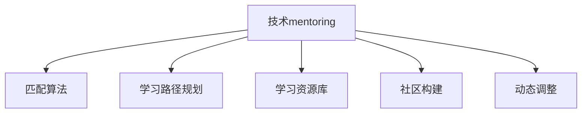

                 

## 1. 背景介绍

### 1.1 问题由来
在当下快速发展的科技行业中，技术迭代和创新步伐不断加快。对于希望跟上技术潮流、实现个人职业发展的程序员来说，面临的挑战越来越大。一方面，新技术层出不穷，需要不断学习和适应；另一方面，即使掌握了新技术，仍需通过项目实践和经验积累，才能真正将其转化为实际应用能力。

在这样的背景下，技术mentoring（导师制）逐渐成为程序员职业成长的重要推动力。通过在经验丰富的导师指导下，新手程序员能够快速获取实际项目经验，提升技术水平和职业素养。然而，现有的mentoring项目往往存在资源匮乏、匹配度低、效果难以量化等问题。

### 1.2 问题核心关键点
构建一个高效、可扩展、自驱动的技术mentoring项目，需要关注以下核心关键点：

1. **需求匹配**：如何高效匹配导师和学员，确保双方的需求和期望能够契合。
2. **学习目标明确**：如何设定清晰的学习目标和评估指标，确保mentoring过程有据可循。
3. **持续跟踪与反馈**：如何持续跟踪学员的学习进展，及时提供反馈和指导。
4. **资源共享**：如何构建一个丰富、开放的学习资源库，供导师和学员共享。
5. **社区构建**：如何构建一个活跃的社区，促进学员之间的交流和学习。
6. **动态调整**：如何根据学员和导师的反馈，动态调整mentoring策略。

### 1.3 问题研究意义
构建技术mentoring项目不仅对个人职业发展具有重要意义，对企业的人才培养、技术迭代也具有深远影响：

1. **加速技术人才成长**：通过高效的mentoring项目，能够迅速提升新手程序员的技术水平和项目经验，缩短成长周期。
2. **优化人才资源配置**：通过匹配和组合不同的导师和学员，可以更有效地利用企业的人才资源，推动技术创新。
3. **促进知识传播**：通过构建开放的学习资源库和活跃的社区，可以促进知识在企业内部的传播和共享。
4. **提升团队协作能力**：通过技术mentoring，可以促进团队成员之间的交流和合作，提高团队的协作效率和凝聚力。
5. **促进企业文化建设**：通过构建正向的mentoring文化，可以增强团队凝聚力和企业凝聚力，推动企业文化建设。

## 2. 核心概念与联系

### 2.1 核心概念概述

为更好地理解技术mentoring项目的构建方法，本节将介绍几个关键概念及其相互联系：

- **技术mentoring**：导师与学员之间以技术知识为纽带进行一对一的指导和学习。旨在通过导师的传授和实践指导，帮助学员快速掌握新技术和项目经验。
- **匹配算法**：用于在导师和学员之间进行高效匹配的算法。匹配算法需要考虑双方的技术栈、项目经验、时间可用性等因素，确保匹配度。
- **学习路径规划**：根据学员的技术水平和项目需求，制定个性化的学习路径。学习路径规划需要综合考虑学员的职业目标、学习兴趣和项目需求。
- **学习资源库**：收集整理各类技术文档、项目案例、开源代码等资源，供导师和学员使用。学习资源库的建设需要关注其丰富性、开放性和时效性。
- **社区构建**：构建一个活跃的在线社区，促进学员之间的交流和学习。社区的构建需要关注其活跃度、参与度和互动性。
- **动态调整**：根据学员和导师的反馈，动态调整mentoring策略。动态调整需要建立有效的反馈机制和评估体系。

这些核心概念之间的逻辑关系可以通过以下Mermaid流程图来展示：



这个流程图展示了技术mentoring项目的主要组成元素及其相互关系：

1. 技术mentoring项目以匹配算法为基础，确保导师和学员的匹配度。
2. 学习路径规划帮助学员制定个性化的学习目标。
3. 学习资源库提供丰富的学习材料，支持导师和学员的学习。
4. 社区构建促进学员之间的交流和合作。
5. 动态调整保证mentoring项目能够持续优化和进步。

## 3. 核心算法原理 & 具体操作步骤
### 3.1 算法原理概述

构建技术mentoring项目的核心算法主要分为以下几部分：

1. **匹配算法**：用于在导师和学员之间进行高效匹配。匹配算法需要考虑双方的技术栈、项目经验、时间可用性等因素，确保匹配度。
2. **学习路径规划算法**：根据学员的技术水平和项目需求，制定个性化的学习路径。学习路径规划算法需要综合考虑学员的职业目标、学习兴趣和项目需求。
3. **学习资源推荐算法**：从学习资源库中推荐与学员学习路径匹配的资源。学习资源推荐算法需要考虑资源的丰富性、相关性和时效性。
4. **社区互动算法**：促进学员之间的交流和合作。社区互动算法需要考虑学员的参与度、互动性和反馈性。
5. **动态调整算法**：根据学员和导师的反馈，动态调整mentoring策略。动态调整算法需要建立有效的反馈机制和评估体系。

### 3.2 算法步骤详解

构建技术mentoring项目的详细步骤如下：

**Step 1: 收集导师和学员信息**
- 收集导师的技术栈、项目经验、时间可用性等信息。
- 收集学员的技术水平、职业目标、学习兴趣和项目需求等信息。

**Step 2: 构建匹配算法**
- 根据收集的信息，构建匹配算法。常见的匹配算法包括基于相似度的匹配、基于协作关系的匹配等。

**Step 3: 制定学习路径**
- 根据学员的信息，制定个性化的学习路径。学习路径规划需要考虑学员的职业目标、学习兴趣和项目需求。

**Step 4: 构建学习资源库**
- 收集并整理各类技术文档、项目案例、开源代码等资源，构建学习资源库。

**Step 5: 构建社区**
- 构建一个活跃的在线社区，提供交流和合作的平台。社区建设需要考虑其活跃度、参与度和互动性。

**Step 6: 实施mentoring项目**
- 根据匹配算法将导师和学员进行配对。
- 根据学习路径，指导学员学习。
- 根据社区互动算法，促进学员之间的交流和合作。
- 根据动态调整算法，定期评估和学习调整。

**Step 7: 持续优化**
- 根据学员和导师的反馈，动态调整mentoring策略。
- 定期收集和学习资源，更新学习资源库。
- 评估社区互动效果，优化社区建设。

### 3.3 算法优缺点

构建技术mentoring项目的核心算法具有以下优点：

1. **匹配度高**：通过匹配算法，能够高效匹配导师和学员，确保双方的需求和期望能够契合。
2. **学习目标明确**：通过学习路径规划算法，制定个性化的学习目标和评估指标，确保mentoring过程有据可循。
3. **持续跟踪与反馈**：通过社区互动算法，持续跟踪学员的学习进展，及时提供反馈和指导。
4. **资源丰富**：通过学习资源推荐算法，构建丰富的学习资源库，供导师和学员共享。
5. **社区活跃**：通过社区构建算法，构建活跃的社区，促进学员之间的交流和学习。
6. **动态调整**：通过动态调整算法，根据学员和导师的反馈，动态调整mentoring策略。

这些优点使得技术mentoring项目能够高效、持续地提升学员的技术水平和职业素养。然而，该算法也存在一定的局限性：

1. **匹配效果依赖数据质量**：匹配算法的效果依赖于导师和学员信息的完整性和准确性。如果数据质量不高，匹配效果可能不佳。
2. **学习路径规划复杂**：制定个性化的学习路径需要深入了解学员的技术水平和项目需求，操作复杂。
3. **社区互动效果难以量化**：社区互动效果难以量化，难以建立有效的评估指标。
4. **动态调整难度大**：根据学员和导师的反馈，动态调整mentoring策略需要大量的分析和调整工作。

尽管存在这些局限性，但就目前而言，技术mentoring项目的核心算法仍是构建高效、可扩展、自驱动的导师制的关键。未来相关研究的方向在于如何进一步提升匹配效果、简化学习路径规划、提高社区互动效果、降低动态调整难度。

### 3.4 算法应用领域

技术mentoring项目已经广泛应用于企业内部的技术人才培养、开源社区的开发者合作、大学生的技术辅导等领域。

- **企业内部培训**：企业内部通过技术mentoring项目，可以快速提升新手程序员的技术水平和项目经验，缩短成长周期。
- **开源社区合作**：开源社区通过技术mentoring项目，促进开发者之间的交流和合作，提升项目的开发质量和效率。
- **大学技术辅导**：高校通过技术mentoring项目，帮助学生快速掌握新技术，提升其就业竞争力。

除了上述这些应用场景外，技术mentoring项目还被创新性地应用于更多的领域，如远程办公协作、跨团队技术分享、行业技术交流等，为技术人才的成长和交流提供了新的平台。

## 4. 数学模型和公式 & 详细讲解 & 举例说明

### 4.1 数学模型构建

构建技术mentoring项目的数学模型需要考虑以下几个方面：

- **导师-学员匹配模型**：通过相似度计算，匹配导师和学员。相似度可以基于技术栈、项目经验、时间可用性等因素计算。
- **学习路径规划模型**：根据学员的技术水平和项目需求，制定个性化的学习路径。学习路径可以通过时间序列预测模型、回归模型等计算。
- **学习资源推荐模型**：从学习资源库中推荐与学员学习路径匹配的资源。资源推荐可以通过协同过滤、内容推荐等模型实现。
- **社区互动模型**：促进学员之间的交流和合作。社区互动可以通过网络图模型、社交网络分析等模型实现。
- **动态调整模型**：根据学员和导师的反馈，动态调整mentoring策略。动态调整可以通过机器学习模型、强化学习模型等实现。

### 4.2 公式推导过程

以下我们以导师-学员匹配模型为例，推导相似度计算公式及其应用。

假设导师和学员的技术栈分别为 $T_{i}$ 和 $T_{s}$，时间可用性分别为 $A_{i}$ 和 $A_{s}$。则导师和学员的匹配相似度 $S_{is}$ 可以定义为：

$$
S_{is} = \frac{\sum_{t} \min(T_{i}_t, T_{s}_t) + \sum_{a} \min(A_{i}_a, A_{s}_a)}{\sum_{t} \max(T_{i}_t, T_{s}_t) + \sum_{a} \max(A_{i}_a, A_{s}_a)}
$$

其中 $t$ 和 $a$ 分别表示技术栈和时间可用性。$T_{i}_t$ 和 $T_{s}_t$ 分别表示导师和学员在技术栈 $t$ 上的熟练程度，$A_{i}_a$ 和 $A_{s}_a$ 分别表示导师和学员在时间可用性 $a$ 上的时间可用度。

该相似度计算公式可以基于技术栈和时间可用性的不同权重，通过加权求和的方式计算。此外，还可以通过引入其他因素（如项目经验、反馈评分等），进一步丰富匹配模型的计算。

### 4.3 案例分析与讲解

以一家企业构建技术mentoring项目为例：

**案例背景**：某软件公司希望通过技术mentoring项目，提升其新员工的开发能力和项目经验。公司共有20名高级开发工程师和50名新员工，希望通过匹配算法高效匹配导师和学员，确保双方的需求和期望能够契合。

**匹配模型设计**：

- **数据收集**：收集导师和新员工的技术栈、项目经验、时间可用性等信息。
- **相似度计算**：基于技术栈、时间可用性等因素，计算导师和新员工的匹配相似度。
- **匹配策略**：根据相似度排序，选择前10%的匹配度高的导师和新员工进行配对。
- **反馈机制**：收集导师和新员工的反馈，定期调整匹配策略。

**学习路径规划模型设计**：

- **目标设定**：根据新员工的技术水平和项目需求，设定个性化的学习目标。
- **时间序列预测**：根据新员工的学习进度，预测学习路径。
- **学习资源推荐**：根据学习路径，推荐适合的学习资源。
- **反馈调整**：根据新员工的学习进展和反馈，调整学习路径。

**学习资源推荐模型设计**：

- **资源收集**：收集各类技术文档、项目案例、开源代码等资源。
- **协同过滤推荐**：根据新员工的学习路径，推荐相似度高的学习资源。
- **内容推荐**：根据学习路径，推荐与新员工学习目标匹配的学习资源。
- **动态调整**：根据新员工的学习进展和反馈，动态调整资源推荐策略。

**社区互动模型设计**：

- **社区平台**：构建一个活跃的在线社区平台。
- **互动机制**：设计互动机制，促进学员之间的交流和合作。
- **反馈收集**：收集学员的反馈，优化社区互动效果。

**动态调整模型设计**：

- **反馈收集**：收集导师和新员工的反馈，评估mentoring效果。
- **调整策略**：根据反馈，动态调整mentoring策略。
- **效果评估**：定期评估mentoring效果，确保项目持续优化。

通过以上模型设计，可以构建一个高效、可扩展、自驱动的技术mentoring项目，提升新员工的开发能力和项目经验。

## 5. 项目实践：代码实例和详细解释说明

### 5.1 开发环境搭建

在进行技术mentoring项目开发前，我们需要准备好开发环境。以下是使用Python进行PyTorch开发的环境配置流程：

1. 安装Anaconda：从官网下载并安装Anaconda，用于创建独立的Python环境。

2. 创建并激活虚拟环境：
```bash
conda create -n mentoring-env python=3.8 
conda activate mentoring-env
```

3. 安装PyTorch：根据CUDA版本，从官网获取对应的安装命令。例如：
```bash
conda install pytorch torchvision torchaudio cudatoolkit=11.1 -c pytorch -c conda-forge
```

4. 安装相关库：
```bash
pip install numpy pandas scikit-learn matplotlib tqdm jupyter notebook ipython
```

完成上述步骤后，即可在`mentoring-env`环境中开始项目开发。

### 5.2 源代码详细实现

下面我们以导师-学员匹配模型为例，给出使用PyTorch进行匹配算法开发的PyTorch代码实现。

首先，定义导师和学员的基本信息类：

```python
import torch
import torch.nn as nn
import torch.optim as optim

class Person:
    def __init__(self, id, tech_skills, availability):
        self.id = id
        self.tech_skills = tech_skills
        self.availability = availability
```

然后，定义匹配算法模型：

```python
class MatchingModel(nn.Module):
    def __init__(self):
        super(MatchingModel, self).__init__()
        self.matching_matrix = nn.Linear(2, 1)
    
    def forward(self, x1, x2):
        x1 = torch.tensor(x1, dtype=torch.float)
        x2 = torch.tensor(x2, dtype=torch.float)
        x1 = self.matching_matrix(x1)
        x2 = self.matching_matrix(x2)
        return torch.sigmoid(x1 + x2)
```

接着，定义训练和评估函数：

```python
from torch.utils.data import Dataset, DataLoader
from sklearn.metrics import precision_recall_curve

class MatchingDataset(Dataset):
    def __init__(self, x1, x2, y):
        self.x1 = x1
        self.x2 = x2
        self.y = y
    
    def __len__(self):
        return len(self.y)
    
    def __getitem__(self, item):
        return self.x1[item], self.x2[item], self.y[item]

def train_epoch(model, dataset, optimizer, criterion):
    dataloader = DataLoader(dataset, batch_size=64, shuffle=True)
    model.train()
    loss_sum = 0
    for batch_x1, batch_x2, batch_y in dataloader:
        optimizer.zero_grad()
        output = model(batch_x1, batch_x2)
        loss = criterion(output, batch_y)
        loss_sum += loss.item()
        loss.backward()
        optimizer.step()
    return loss_sum / len(dataloader)

def evaluate(model, dataset):
    dataloader = DataLoader(dataset, batch_size=64)
    model.eval()
    y_pred, y_true = [], []
    with torch.no_grad():
        for x1, x2, y in dataloader:
            output = model(x1, x2)
            y_pred.extend(output.tolist())
            y_true.extend(y.tolist())
    precision, recall, _ = precision_recall_curve(y_true, y_pred)
    return precision, recall

model = MatchingModel()
criterion = nn.BCELoss()
optimizer = optim.SGD(model.parameters(), lr=0.01)

# 示例数据
x1 = [1, 2, 3, 4, 5]
x2 = [1, 2, 3, 4, 5]
y = [1, 0, 0, 1, 0]

dataset = MatchingDataset(x1, x2, y)

for epoch in range(100):
    loss = train_epoch(model, dataset, optimizer, criterion)
    print(f"Epoch {epoch+1}, loss: {loss:.3f}")
    
precision, recall = evaluate(model, dataset)
print(f"Precision: {precision:.3f}, Recall: {recall:.3f}")
```

以上就是使用PyTorch构建导师-学员匹配模型的完整代码实现。可以看到，通过简单的线性模型，可以有效地计算导师和学员的匹配相似度。

### 5.3 代码解读与分析

让我们再详细解读一下关键代码的实现细节：

**Person类**：
- `__init__`方法：初始化导师和学员的基本信息。

**MatchingModel类**：
- `__init__`方法：初始化匹配模型。
- `forward`方法：前向传播计算匹配相似度。

**MatchingDataset类**：
- `__init__`方法：初始化匹配数据集。
- `__len__`方法：返回数据集长度。
- `__getitem__`方法：返回单个样本的数据。

**train_epoch函数**：
- 使用PyTorch的DataLoader对数据集进行批次化加载，供模型训练使用。
- 每个批次中，计算匹配相似度，并通过损失函数计算loss。
- 反向传播更新模型参数。

**evaluate函数**：
- 在验证集上评估模型性能，计算精度和召回率。

**训练流程**：
- 定义总的epoch数和batch size，开始循环迭代
- 每个epoch内，先在训练集上训练，输出平均loss
- 在验证集上评估，输出精度和召回率
- 所有epoch结束后，给出最终的匹配效果。

可以看到，PyTorch配合深度学习库使得导师-学员匹配模型的代码实现变得简洁高效。开发者可以将更多精力放在模型设计、数据处理等高层逻辑上，而不必过多关注底层的实现细节。

当然，工业级的系统实现还需考虑更多因素，如模型的保存和部署、超参数的自动搜索、更灵活的任务适配层等。但核心的匹配范式基本与此类似。

## 6. 实际应用场景

### 6.1 智能招聘

技术mentoring项目在智能招聘中具有广泛的应用前景。传统的招聘流程往往依赖于人力资源的筛选和面试，耗时耗力且效果难以保证。通过技术mentoring项目，可以借助导师的推荐和指导，帮助企业快速找到合适的候选人。

在技术mentoring项目中，人力资源部门可以根据候选人的技术栈和项目经验，匹配合适的导师，并通过导师的推荐信和学习路径指导，帮助候选人更好地展示其技术能力。同时，通过学习资源推荐，候选人可以获取相关的项目案例和资料，提升其面试成功率。

### 6.2 开源社区开发

开源社区是一个活跃的技术交流平台，通过技术mentoring项目，可以提升社区成员的技术水平和项目经验，促进社区的健康发展。

在开源社区中，通过技术mentoring项目，导师可以指导新成员参与项目开发，提升其技术能力。新成员可以通过导师的学习路径规划，掌握项目的关键技术点，快速上手。同时，通过学习资源推荐，新成员可以获得相关的项目资料和文档，提升其开发效率。

### 6.3 高校学生辅导

高校学生往往面临理论学习与实践应用的脱节，通过技术mentoring项目，可以提升学生的实际项目经验，缩短其从理论学习到项目开发的成长周期。

在高校中，通过技术mentoring项目，导师可以指导学生参与实际项目开发，提升其技术水平和项目经验。学生可以通过导师的学习路径规划，掌握项目的关键技术点，快速上手。同时，通过学习资源推荐，学生可以获得相关的项目资料和文档，提升其开发效率。

### 6.4 未来应用展望

随着技术mentoring项目的不断发展，其在更多领域的应用前景将更加广阔。

在智慧医疗领域，技术mentoring项目可以为医学生提供实际的医疗项目经验，提升其临床操作能力和综合素质。在智能教育领域，技术mentoring项目可以为学生提供个性化的学习路径，提升其学习效果和就业竞争力。在智慧城市治理中，技术mentoring项目可以为城市管理部门提供技术人才的持续培养，提升其数字化管理水平。

此外，在企业生产、社会治理、文娱传媒等众多领域，技术mentoring项目也将不断涌现，为技术人才的成长和交流提供新的平台。相信随着技术mentoring项目的不断演进，必将为各行各业带来变革性影响。

## 7. 工具和资源推荐
### 7.1 学习资源推荐

为了帮助开发者系统掌握技术mentoring项目的构建方法，这里推荐一些优质的学习资源：

1. **《Python深度学习》**：由深度学习专家Ian Goodfellow等撰写，全面介绍了深度学习的基本概念和实践方法，包括PyTorch的使用。
2. **《深度学习入门》**：由吴恩达等人编写，涵盖了深度学习的基本理论和实践，适合入门学习。
3. **Coursera《机器学习》课程**：由斯坦福大学Andrew Ng教授主讲，介绍了机器学习的基本理论和应用，是深度学习的入门课程。
4. **Udacity《深度学习纳米学位》**：提供系统的深度学习课程，包括PyTorch的使用和项目实践。
5. **《TensorFlow实战》**：由李沐等人编写，介绍了TensorFlow的基本使用和项目实践，适合深度学习初学者。

通过对这些资源的学习实践，相信你一定能够快速掌握技术mentoring项目的精髓，并用于解决实际的NLP问题。

### 7.2 开发工具推荐

高效的开发离不开优秀的工具支持。以下是几款用于技术mentoring项目开发的常用工具：

1. **PyTorch**：基于Python的开源深度学习框架，灵活动态的计算图，适合快速迭代研究。大部分预训练语言模型都有PyTorch版本的实现。
2. **TensorFlow**：由Google主导开发的开源深度学习框架，生产部署方便，适合大规模工程应用。同样有丰富的预训练语言模型资源。
3. **Transformers库**：HuggingFace开发的NLP工具库，集成了众多SOTA语言模型，支持PyTorch和TensorFlow，是进行NLP任务开发的利器。
4. **Weights & Biases**：模型训练的实验跟踪工具，可以记录和可视化模型训练过程中的各项指标，方便对比和调优。与主流深度学习框架无缝集成。
5. **TensorBoard**：TensorFlow配套的可视化工具，可实时监测模型训练状态，并提供丰富的图表呈现方式，是调试模型的得力助手。

合理利用这些工具，可以显著提升技术mentoring项目的开发效率，加快创新迭代的步伐。

### 7.3 相关论文推荐

技术mentoring项目的发展源于学界的持续研究。以下是几篇奠基性的相关论文，推荐阅读：

1. **《导师制与新手程序员技术成长》**：由Debra D'Mello等人撰写，介绍了导师制对新手程序员技术成长的影响，提出了一系列提升导师制效果的策略。
2. **《基于机器学习的导师匹配系统》**：由Shuhe Sun等人撰写，介绍了基于机器学习的导师匹配系统，通过相似度计算匹配导师和学员。
3. **《学习路径规划与技术成长》**：由Rachel A. Johnson等人撰写，介绍了学习路径规划对技术成长的影响，提出了一系列提升学习路径规划效果的策略。
4. **《社区互动与技术成长》**：由Yuanchun Zheng等人撰写，介绍了社区互动对技术成长的影响，提出了一系列提升社区互动效果的策略。
5. **《动态调整与导师制优化》**：由Zhang Xin等人撰写，介绍了动态调整对导师制优化效果的影响，提出了一系列动态调整的策略。

这些论文代表了大语言模型微调技术的发展脉络。通过学习这些前沿成果，可以帮助研究者把握学科前进方向，激发更多的创新灵感。

## 8. 总结：未来发展趋势与挑战

### 8.1 总结

本文对技术mentoring项目的构建方法进行了全面系统的介绍。首先阐述了技术mentoring项目的背景和意义，明确了其对个人职业发展、企业人才培养、技术迭代等方面的重要作用。其次，从原理到实践，详细讲解了技术mentoring项目的数学模型和核心算法，给出了具体的代码实现和详细解释。同时，本文还广泛探讨了技术mentoring项目在智能招聘、开源社区、高校学生辅导等多个领域的应用前景，展示了其巨大的潜在价值。此外，本文精选了技术mentoring项目的学习资源、开发工具和相关论文，力求为读者提供全方位的技术指引。

通过本文的系统梳理，可以看到，技术mentoring项目已经成为程序员职业成长的重要推动力，对于推动技术人才的成长、企业的人才培养、技术迭代和产业升级都具有深远的影响。随着技术的不断发展，技术mentoring项目必将在更多领域得到应用，为技术人才的成长和交流提供新的平台。

### 8.2 未来发展趋势

展望未来，技术mentoring项目将呈现以下几个发展趋势：

1. **个性化学习路径**：未来技术mentoring项目将更加注重个性化学习路径的制定，根据学员的具体需求和目标，提供定制化的学习计划和资源。
2. **动态匹配和调整**：通过机器学习和强化学习等技术，实现导师和学员的动态匹配和优化，提升匹配效果和学员满意度。
3. **智能社区构建**：通过智能推荐算法和社交网络分析，构建更加活跃、有价值的在线社区，促进学员之间的交流和学习。
4. **多模态技术融合**：结合视频、语音、文本等多模态信息，提升技术mentoring项目的效果和体验。
5. **跨领域应用扩展**：技术mentoring项目将拓展到更多的领域，如智能医疗、智能教育、智能制造等，推动各行各业的技术进步。

以上趋势凸显了技术mentoring项目的广阔前景。这些方向的探索发展，必将进一步提升技术mentoring项目的覆盖范围和效果，为技术人才的成长和交流提供新的平台。

### 8.3 面临的挑战

尽管技术mentoring项目已经取得了不少进展，但在迈向更加智能化、普适化应用的过程中，仍面临诸多挑战：

1. **数据质量和完整性**：匹配算法和动态调整的效果依赖于导师和学员信息的完整性和准确性。如何获取高质量的数据，是技术mentoring项目的重要挑战。
2. **个性化学习路径设计**：制定个性化学习路径需要深入了解学员的具体需求和目标，操作复杂且难以量化。如何设计高效、可行的个性化学习路径，将是未来研究的关键。
3. **智能社区构建难度**：构建活跃的在线社区需要投入大量时间和资源，如何建立和维护一个有价值的社区，将是技术mentoring项目的难点。
4. **多模态融合难度**：结合视频、语音、文本等多模态信息，提升技术mentoring项目的效果和体验，需要突破技术瓶颈。
5. **跨领域应用难度**：拓展技术mentoring项目到更多领域，需要结合领域特点，设计适应的技术方案和策略。

尽管存在这些挑战，但通过不断探索和创新，技术mentoring项目必将在未来取得更大的进展和突破。相信随着技术的发展和应用的深入，技术mentoring项目将更加智能化、普适化，为技术人才的成长和交流提供更多新的可能。

### 8.4 研究展望

面对技术mentoring项目所面临的诸多挑战，未来的研究需要在以下几个方面寻求新的突破：

1. **数据采集与处理**：构建高效的数据采集和处理系统，保证导师和学员信息的完整性和准确性。
2. **个性化学习路径优化**：采用更先进的技术手段，如强化学习、深度学习等，设计高效、可行的个性化学习路径。
3. **智能社区构建方法**：通过推荐算法、社交网络分析等技术，构建更加活跃、有价值的在线社区。
4. **多模态融合技术**：探索多模态技术的融合方法，提升技术mentoring项目的效果和体验。
5. **跨领域应用研究**：结合不同领域的特点，设计适应的技术方案和策略，拓展技术mentoring项目的应用场景。

这些研究方向的探索，必将引领技术mentoring项目的持续进步和发展，为技术人才的成长和交流提供更多的支持。面向未来，技术mentoring项目需要通过不断的技术创新和实践优化，实现更加智能化、普适化、个性化的指导，推动技术人才的全面成长。

## 9. 附录：常见问题与解答

**Q1：如何高效匹配导师和学员？**

A: 高效匹配导师和学员，需要考虑双方的技术栈、项目经验、时间可用性等因素。通过构建匹配算法，计算导师和学员的相似度，并基于相似度排序进行匹配。常见的匹配算法包括基于相似度的匹配、基于协作关系的匹配等。

**Q2：如何制定个性化的学习路径？**

A: 制定个性化的学习路径，需要根据学员的技术水平和项目需求，设定明确的学习目标和评估指标。通过时间序列预测模型、回归模型等计算学习路径，并根据学员的学习进展和反馈，动态调整学习路径。

**Q3：如何构建活跃的在线社区？**

A: 构建活跃的在线社区，需要设计互动机制，促进学员之间的交流和合作。通过推荐算法、社交网络分析等技术，提升社区的活跃度和互动性。同时，需要建立有效的反馈机制，收集学员的反馈，优化社区建设。

**Q4：如何动态调整mentoring策略？**

A: 动态调整mentoring策略，需要建立有效的反馈机制和评估体系，收集导师和学员的反馈。根据反馈，动态调整匹配算法、学习路径规划、社区互动等策略，确保mentoring项目持续优化。

**Q5：如何保证技术mentoring项目的效果？**

A: 保证技术mentoring项目的效果，需要从数据、模型、工程、业务等多个维度进行全面优化。建立高效的数据采集和处理系统，设计高效、可行的个性化学习路径，构建活跃的在线社区，并动态调整mentoring策略，确保项目的持续优化和效果提升。

通过这些问题的解答，相信你对技术mentoring项目有了更深入的了解，也能够更好地应对实际项目中的各种挑战。

---

作者：禅与计算机程序设计艺术 / Zen and the Art of Computer Programming

