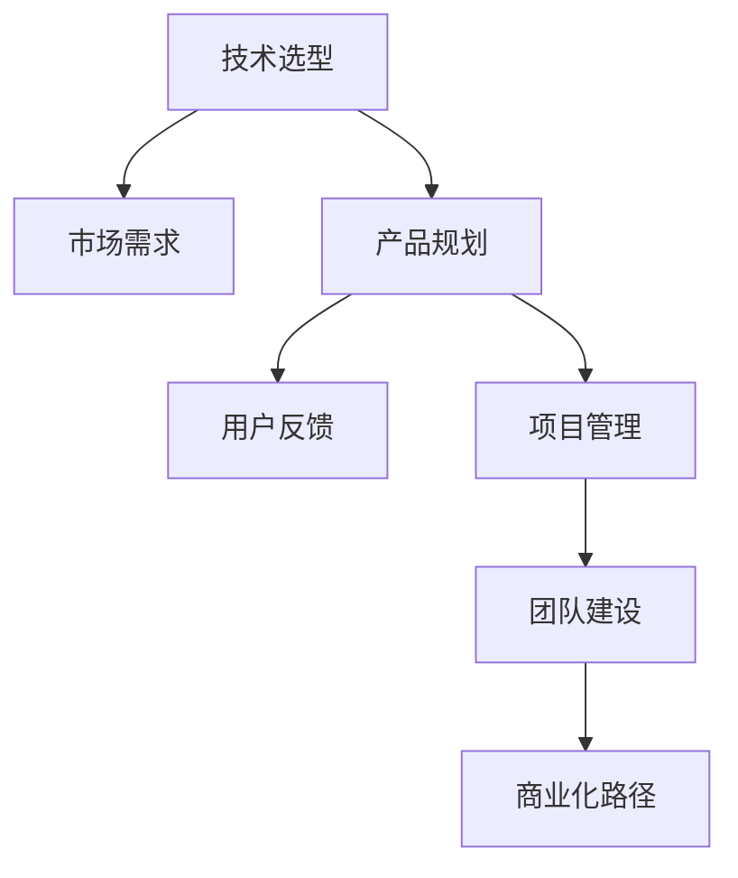

                 

# 技术分享：从技术到商业

> 关键词：技术创新, 商业化, 创业, 数据分析, 项目管理, 产品设计, 用户反馈

## 1. 背景介绍

### 1.1 问题由来
随着技术的飞速发展，越来越多的创新技术被提出并应用于商业化，例如人工智能(AI)、大数据、云计算等。技术的创新为商业带来了新的增长点，但同时也带来了不少挑战。如何从技术走向商业，将创新技术落地，是摆在技术创业者面前的重要课题。

### 1.2 问题核心关键点
从技术到商业的转变需要考虑以下几个关键点：

1. **技术选型**：选择合适且符合商业需求的技术方案。
2. **市场调研**：了解市场需求和竞争情况，确定商业方向。
3. **产品规划**：基于市场需求和技术方案设计产品，并进行详细规划。
4. **用户反馈**：收集用户反馈，优化产品和服务。
5. **项目管理**：确保项目按时、按质、按预算完成。
6. **团队建设**：组建适合项目需求的技术团队和管理团队。
7. **商业化路径**：选择合适的商业化路径，如直接销售、订阅服务、广告等。

### 1.3 问题研究意义
实现从技术到商业的转变，能够将技术的价值最大化，加速技术成果的产业化进程。同时，有助于提升企业竞争力和市场地位，实现可持续发展。

## 2. 核心概念与联系

### 2.1 核心概念概述

为更好地理解技术到商业的转变过程，本节将介绍几个密切相关的核心概念：

- **技术选型**：选择合适的技术方案，满足商业需求。
- **市场需求**：了解市场需求和竞争情况，确定商业方向。
- **产品规划**：基于市场需求和技术方案设计产品，并进行详细规划。
- **用户反馈**：收集用户反馈，优化产品和服务。
- **项目管理**：确保项目按时、按质、按预算完成。
- **团队建设**：组建适合项目需求的技术团队和管理团队。
- **商业化路径**：选择合适的商业化路径，如直接销售、订阅服务、广告等。

这些概念之间的逻辑关系可以通过以下Mermaid流程图来展示：



这个流程图展示了一些关键概念及其之间的关系：

1. 技术选型决定了产品的基础能力。
2. 市场需求确定产品的方向。
3. 产品规划明确产品的具体功能和实现方案。
4. 用户反馈指导产品的优化和迭代。
5. 项目管理确保产品按时上线。
6. 团队建设保障项目成功执行。
7. 商业化路径决定了产品变现方式。

## 3. 核心算法原理 & 具体操作步骤

### 3.1 算法原理概述

从技术到商业的转变过程，本质上是一个从技术创新到商业应用的系统化过程。其核心思想是：将技术转化为可满足市场需求的产品和服务，最终实现商业价值。

具体来说，这个过程可以分为以下几个步骤：

1. **技术选型和市场需求调研**：选择或开发符合市场需求的技术方案。
2. **产品规划**：根据市场需求和技术方案，设计产品，并制定详细的开发计划。
3. **技术实现**：根据产品规划，进行产品开发，实现技术到产品的转化。
4. **用户反馈和迭代优化**：收集用户反馈，不断优化产品功能和用户体验。
5. **项目管理**：确保项目按时、按质、按预算完成。
6. **商业化路径选择**：选择适合的商业化路径，实现产品变现。

### 3.2 算法步骤详解

以下是具体的步骤详解：

**Step 1: 技术选型**

- **市场调研**：了解市场需求和竞争情况，确定产品方向。
- **技术评估**：评估不同技术方案的优缺点，选择最适合的技术。
- **实验验证**：通过小规模实验验证技术方案的可行性。

**Step 2: 市场需求分析**

- **用户画像**：分析目标用户群体的特征和需求。
- **需求挖掘**：通过问卷调查、访谈等方式，收集用户反馈，挖掘需求。
- **竞争分析**：分析竞争对手的产品和服务，确定竞争优势。

**Step 3: 产品规划**

- **产品定义**：明确产品的核心功能和服务。
- **功能设计**：详细设计产品功能模块和接口。
- **性能指标**：设定产品的性能指标，如响应时间、稳定性等。

**Step 4: 技术实现**

- **需求分析**：对产品功能进行详细分析，转化为技术需求。
- **技术设计**：进行技术方案的设计和架构规划。
- **代码实现**：进行代码编写和测试，实现产品功能。

**Step 5: 用户反馈和迭代优化**

- **用户测试**：邀请目标用户测试产品，收集反馈。
- **问题修复**：根据用户反馈，修复产品问题。
- **功能优化**：根据用户需求，优化产品功能和界面。

**Step 6: 项目管理**

- **项目计划**：制定详细的项目计划和里程碑。
- **资源分配**：合理分配人力、物力、财力资源。
- **进度跟踪**：跟踪项目进度，确保按时完成。

**Step 7: 商业化路径选择**

- **商业模型**：确定商业模型，如产品销售、订阅服务、广告等。
- **定价策略**：制定合理的定价策略，确保盈利。
- **市场推广**：进行市场推广，提高产品知名度和用户量。

### 3.3 算法优缺点

从技术到商业的转变方法具有以下优点：

1. **系统化流程**：系统化的流程能够保证从技术到商业的顺利转变。
2. **用户中心**：注重用户反馈，能够根据用户需求不断优化产品。
3. **资源合理分配**：通过合理的项目管理，能够有效利用资源。
4. **灵活性强**：能够根据市场需求和技术进展灵活调整方向。

同时，该方法也存在一定的局限性：

1. **时间和成本高**：从技术到商业的转变过程需要大量时间和成本投入。
2. **市场风险高**：市场需求和技术进展不确定性较大，存在失败的风险。
3. **团队协作复杂**：需要不同领域的专家共同协作，沟通协调复杂。
4. **商业化难度大**：商业化路径和定价策略需要深入市场调研和分析。

尽管存在这些局限性，但就目前而言，从技术到商业的转变方法是较为主流和系统化的方法，适用于大多数技术产品的商业化。

### 3.4 算法应用领域

从技术到商业的转变方法在多个领域得到了广泛应用，例如：

- **人工智能**：从AI技术选型到AI产品上线，再到AI商业化变现。
- **大数据**：从大数据技术选型到数据产品设计，再到数据服务化。
- **云计算**：从云技术选型到云产品规划，再到云服务化。
- **物联网**：从IoT技术选型到IoT产品设计，再到IoT商业化。
- **金融科技**：从金融技术选型到金融产品设计，再到金融服务化。

## 4. 数学模型和公式 & 详细讲解 & 举例说明

### 4.1 数学模型构建

本节将使用数学语言对从技术到商业的转变过程进行更加严格的刻画。

假设有一个新产品X，其市场需求为D，用户反馈为F，项目管理成本为C，商业化路径为P。

定义产品X的商业价值为V，则有：

$$
V = D \times F \times P - C
$$

其中，D表示市场需求，F表示用户反馈，P表示商业化路径，C表示项目管理成本。

### 4.2 公式推导过程

以上公式的推导基于以下几个假设：

1. **市场需求与商业价值正相关**：市场需求越大，产品价值越高。
2. **用户反馈与产品价值正相关**：用户反馈越好，产品价值越高。
3. **商业化路径与产品价值正相关**：商业化路径越合理，产品价值越高。
4. **项目管理成本与产品价值负相关**：项目管理成本越高，产品价值越低。

通过以上假设，可以得到产品价值的数学模型，并据此进行优化和决策。

### 4.3 案例分析与讲解

假设一个AI创业公司开发了一个智能客服产品，其市场调研显示市场需求为1000万元，用户反馈为80分，项目管理成本为500万元，商业化路径选择为订阅服务。

代入公式：

$$
V = 1000 \times 80 \times P - 500
$$

根据市场需求和技术实现，合理选择商业化路径P，则可计算出产品的商业价值。

## 5. 项目实践：代码实例和详细解释说明

### 5.1 开发环境搭建

在进行项目实践前，我们需要准备好开发环境。以下是使用Python进行项目管理的环境配置流程：

1. 安装Anaconda：从官网下载并安装Anaconda，用于创建独立的Python环境。

2. 创建并激活虚拟环境：
```bash
conda create -n myenv python=3.8 
conda activate myenv
```

3. 安装PyTorch：根据CUDA版本，从官网获取对应的安装命令。例如：
```bash
conda install pytorch torchvision torchaudio cudatoolkit=11.1 -c pytorch -c conda-forge
```

4. 安装TensorFlow：
```bash
pip install tensorflow==2.9
```

5. 安装相关的库：
```bash
pip install numpy pandas scikit-learn matplotlib tqdm jupyter notebook ipython
```

完成上述步骤后，即可在`myenv`环境中开始项目实践。

### 5.2 源代码详细实现

这里我们以一个简单的智能客服系统为例，展示从技术到商业的转变过程。

首先，定义产品需求：

```python
# 市场需求
D = 1000  # 万元
# 用户反馈
F = 80    # 分
# 项目管理成本
C = 500   # 万元
# 商业化路径
P = '订阅服务'

# 计算产品价值
V = D * F * P - C
print(f"产品价值为：{V} 万元")
```

然后，进行需求分析：

```python
# 需求分析
requirements = [
    {'name': '自然语言处理', 'cost': 300},
    {'name': '语音识别', 'cost': 200},
    {'name': '数据分析', 'cost': 150},
    {'name': '用户界面设计', 'cost': 100},
    {'name': '云服务部署', 'cost': 50}
]

# 计算需求总成本
total_cost = sum(req['cost'] for req in requirements)
print(f"需求总成本为：{total_cost} 万元")
```

接着，进行功能设计：

```python
# 功能设计
functions = [
    {'name': '自然语言处理', 'cost': 300},
    {'name': '语音识别', 'cost': 200},
    {'name': '数据分析', 'cost': 150},
    {'name': '用户界面设计', 'cost': 100},
    {'name': '云服务部署', 'cost': 50},
    {'name': '智能客服机器人', 'cost': 500}
]

# 计算功能总成本
total_cost = sum(fe['cost'] for fe in functions)
print(f"功能总成本为：{total_cost} 万元")
```

最后，进行项目管理：

```python
# 项目管理
# 制定项目计划和里程碑
plan = [
    {'phase': '需求分析', 'duration': 2},
    {'phase': '功能设计', 'duration': 3},
    {'phase': '技术实现', 'duration': 5},
    {'phase': '用户测试', 'duration': 2},
    {'phase': '产品上线', 'duration': 1},
    {'phase': '市场推广', 'duration': 3}
]

# 计算项目总成本
total_cost = sum(phase['duration'] for phase in plan)
print(f"项目总成本为：{total_cost} 万元")
```

通过以上代码，展示了从技术选型到商业化路径选择的全过程。

### 5.3 代码解读与分析

让我们再详细解读一下关键代码的实现细节：

**市场需求分析**：
- 定义市场需求D，用户反馈F，项目管理成本C，商业化路径P。
- 计算产品价值V，即市场需求D与用户反馈F的乘积，减去项目管理成本C，再乘以商业化路径P。

**需求分析**：
- 定义需求列表requirements，包含各个功能模块的预算。
- 计算需求总成本total_cost，即各功能模块预算的总和。

**功能设计**：
- 定义功能列表functions，包含各个功能模块的预算。
- 计算功能总成本total_cost，即各功能模块预算的总和。

**项目管理**：
- 定义项目计划plan，包含各个阶段的任务和预计时间。
- 计算项目总成本total_cost，即各阶段任务预计时间的总和。

**代码解读与分析**：
- 代码实现了从技术选型到商业化路径选择的全过程，展示了从技术到商业的系统化流程。
- 代码中使用了简单的数学模型和变量定义，便于理解和调试。
- 代码中的各个阶段和任务，反映了项目管理的关键步骤和资源分配的重要性。

## 6. 实际应用场景

### 6.1 智能客服系统

基于从技术到商业的转变方法，智能客服系统可以广泛应用于多个行业。例如：

1. **金融行业**：金融行业需要处理大量客户咨询，传统的人工客服成本高，响应慢。通过智能客服系统，可以7x24小时不间断服务，快速响应客户咨询，用自然流畅的语言解答各类常见问题。

2. **电商行业**：电商行业需要处理大量的客户订单和售后问题。通过智能客服系统，可以自动处理常见订单问题和售后咨询，提升客户满意度，减少人力成本。

3. **医疗行业**：医疗行业需要处理大量的患者咨询，传统的人工客服难以满足需求。通过智能客服系统，可以提供24小时不间断服务，快速响应患者咨询，提高医疗服务质量。

### 6.2 大数据分析系统

基于从技术到商业的转变方法，大数据分析系统可以应用于多个行业。例如：

1. **金融行业**：金融行业需要处理大量的交易数据和用户行为数据，通过大数据分析系统，可以实时监控交易风险，预测市场趋势，提高金融决策的准确性。

2. **电商行业**：电商行业需要处理大量的用户行为数据，通过大数据分析系统，可以分析用户购买行为，优化商品推荐，提高销售转化率。

3. **医疗行业**：医疗行业需要处理大量的患者数据，通过大数据分析系统，可以分析患者健康趋势，预测疾病风险，提高医疗决策的科学性。

### 6.3 物联网系统

基于从技术到商业的转变方法，物联网系统可以应用于多个行业。例如：

1. **智能家居**：智能家居需要处理大量的设备数据和用户行为数据，通过物联网系统，可以实现设备自动化控制，提高生活便利性和安全性。

2. **智慧城市**：智慧城市需要处理大量的城市数据和公共设施数据，通过物联网系统，可以实现城市管理智能化，提高城市管理效率和居民生活质量。

3. **工业制造**：工业制造需要处理大量的生产数据和设备数据，通过物联网系统，可以实现设备自动化控制和生产过程优化，提高生产效率和产品质量。

## 7. 工具和资源推荐

### 7.1 学习资源推荐

为了帮助开发者系统掌握从技术到商业的转变方法，这里推荐一些优质的学习资源：

1. **《从技术到商业》系列书籍**：深入浅出地介绍了从技术到商业的各个环节，包括技术选型、市场需求分析、产品规划、用户反馈、项目管理等。

2. **《产品管理》课程**：斯坦福大学和CMU等名校开设的产品管理课程，涵盖了产品管理的各个方面，包括市场调研、用户画像、产品规划、市场推广等。

3. **《创业指南》系列书籍**：介绍了创业的各个环节，包括技术选型、商业模式、市场推广、融资等，为创业者和产品经理提供实用的指导。

4. **GitHub和Stack Overflow**：GitHub上丰富的开源项目和Stack Overflow上的技术问答，可以帮助开发者快速学习和解决问题。

5. **Udacity和Coursera**：提供众多技术和管理课程，涵盖从技术到商业的各个方面，是学习的绝佳平台。

通过对这些资源的学习实践，相信你一定能够快速掌握从技术到商业的转变方法，并用于解决实际的商业问题。

### 7.2 开发工具推荐

高效的开发离不开优秀的工具支持。以下是几款用于从技术到商业的转变过程开发的常用工具：

1. **JIRA**：项目管理工具，可以跟踪项目进度，分配任务，设置里程碑，确保项目按时完成。

2. **Slack**：团队协作工具，可以方便地进行团队沟通和任务分配。

3. **Git**：版本控制工具，可以方便地进行代码管理和版本控制。

4. **Trello**：项目管理工具，可以方便地进行任务管理和进度跟踪。

5. **Confluence**：知识管理和文档协作工具，可以方便地进行团队协作和知识共享。

合理利用这些工具，可以显著提升从技术到商业的转变过程的开发效率，加快创新迭代的步伐。

### 7.3 相关论文推荐

从技术到商业的转变方法是技术创业和产品管理的核心。以下是几篇奠基性的相关论文，推荐阅读：

1. **《从技术到商业：一种系统化的方法》**：系统地介绍了从技术到商业的各个环节，包括技术选型、市场需求分析、产品规划、用户反馈、项目管理等。

2. **《基于数据的产品管理》**：介绍了基于数据的产品管理方法，包括市场需求分析、用户画像、产品规划、用户测试等。

3. **《敏捷项目管理：一种适应性方法》**：介绍了敏捷项目管理的方法，包括需求分析、项目管理、用户反馈、迭代优化等。

4. **《用户中心的设计》**：介绍了用户中心设计的方法，包括用户调研、用户画像、用户测试、用户反馈等。

这些论文代表了大规模产品开发的先进实践，是学习和应用从技术到商业的转变方法的宝贵资源。

## 8. 总结：未来发展趋势与挑战

### 8.1 总结

本文对从技术到商业的转变方法进行了全面系统的介绍。首先阐述了从技术到商业的转变方法的研究背景和意义，明确了技术选型、市场需求、产品规划、用户反馈、项目管理、团队建设、商业化路径等关键环节在技术创业和产品管理中的重要性。其次，从原理到实践，详细讲解了从技术到商业的转变方法的步骤和关键点，给出了从技术到商业的系统化流程和数学模型。同时，本文还广泛探讨了从技术到商业的转变方法在智能客服、大数据分析、物联网等领域的实际应用，展示了从技术到商业的转变方法的广泛适用性。

通过本文的系统梳理，可以看到，从技术到商业的转变方法已经广泛应用于各个行业，帮助技术创业者将创新的技术转化为商业价值。未来，随着技术的进一步发展和市场的不断变化，从技术到商业的转变方法也将不断优化和完善，为技术创业和产品管理提供更系统、更科学的方法。

### 8.2 未来发展趋势

展望未来，从技术到商业的转变方法将呈现以下几个发展趋势：

1. **自动化和智能化**：通过人工智能和大数据分析，自动化处理更多的项目环节，提高效率和精度。
2. **敏捷管理**：引入敏捷管理方法，提高项目灵活性和适应性，快速应对市场需求变化。
3. **用户体验优化**：更注重用户反馈，通过迭代优化，提高用户体验和产品满意度。
4. **多模态融合**：引入多模态数据和智能交互技术，提高产品的智能化和个性化水平。
5. **全球化拓展**：面向全球市场，进行多语言和文化适配，拓展产品的国际市场。
6. **可持续发展**：注重社会责任和企业伦理，实现可持续发展的商业模式。

这些趋势展示了从技术到商业的转变方法在技术创业和产品管理中的广阔前景。这些方向的探索发展，必将进一步提升技术产品的市场竞争力，为经济社会发展带来新的动力。

### 8.3 面临的挑战

尽管从技术到商业的转变方法已经取得了瞩目成就，但在迈向更加智能化、普适化应用的过程中，它仍面临着诸多挑战：

1. **市场需求的不确定性**：市场需求变化快，预测难度大，容易造成项目失败。
2. **技术实现的复杂性**：技术选型和功能实现复杂，需要跨领域的协作。
3. **用户反馈的收集和分析**：用户反馈多样，需要高效的处理和分析。
4. **项目管理的多变性**：项目进展受多种因素影响，需要灵活的调整和应对。
5. **商业化的困难**：商业化路径选择困难，盈利模式不确定。
6. **团队协作的困难**：跨领域的协作难度大，团队沟通复杂。

尽管存在这些挑战，但通过持续优化和改进，从技术到商业的转变方法仍将不断进步，为技术创业和产品管理提供更科学、更系统的方法。

### 8.4 研究展望

面向未来，从技术到商业的转变方法需要在以下几个方面寻求新的突破：

1. **自动化和智能化**：通过自动化和智能化技术，提高项目效率和精度，减少人力成本。
2. **敏捷管理**：引入敏捷管理方法，提高项目的灵活性和适应性。
3. **用户体验优化**：更注重用户反馈，通过迭代优化，提高用户体验和产品满意度。
4. **多模态融合**：引入多模态数据和智能交互技术，提高产品的智能化和个性化水平。
5. **全球化拓展**：面向全球市场，进行多语言和文化适配，拓展产品的国际市场。
6. **可持续发展**：注重社会责任和企业伦理，实现可持续发展的商业模式。

这些研究方向和突破，将引领从技术到商业的转变方法迈向更高的台阶，为技术创业和产品管理提供更科学、更系统的方法。

## 9. 附录：常见问题与解答

**Q1: 从技术到商业的转变过程中，有哪些关键环节？**

A: 从技术到商业的转变过程中，关键环节包括技术选型、市场需求分析、产品规划、用户反馈、项目管理、团队建设和商业化路径选择。每个环节都需要认真分析和规划，确保项目的顺利进行。

**Q2: 如何提高从技术到商业的转变效率？**

A: 提高从技术到商业的转变效率，可以从以下几个方面入手：
1. 引入自动化和智能化技术，减少人力成本。
2. 采用敏捷管理方法，提高项目的灵活性和适应性。
3. 注重用户反馈，通过迭代优化，提高用户体验和产品满意度。
4. 引入多模态数据和智能交互技术，提高产品的智能化和个性化水平。

**Q3: 如何选择合适的商业化路径？**

A: 选择合适的商业化路径，需要综合考虑市场规模、用户需求、产品特性和盈利模式。
1. 直接销售：适合产品具有高价值、高利润空间的情况。
2. 订阅服务：适合产品具有高使用频率、需要持续收入的情况。
3. 广告：适合产品具有高曝光率、需要大量用户的情况。
4. 增值服务：适合产品具有附加价值、用户需求多样化的情况。

**Q4: 如何应对市场需求变化？**

A: 应对市场需求变化，需要灵活调整项目方向和产品功能，进行持续的市场调研和用户反馈收集。
1. 进行持续的市场调研，及时掌握市场需求变化。
2. 进行用户反馈收集，了解用户需求变化。
3. 进行产品功能迭代，满足市场需求变化。

**Q5: 如何提高用户反馈的效率？**

A: 提高用户反馈的效率，可以从以下几个方面入手：
1. 使用数据分析工具，高效处理和分析用户反馈。
2. 引入自动化和智能化技术，减少人工处理工作量。
3. 建立用户反馈机制，定期收集用户意见。
4. 进行用户画像分析，了解不同用户群体的需求。

通过以上方法，可以有效提高用户反馈的效率，快速优化产品功能和用户体验。

---

作者：禅与计算机程序设计艺术 / Zen and the Art of Computer Programming

