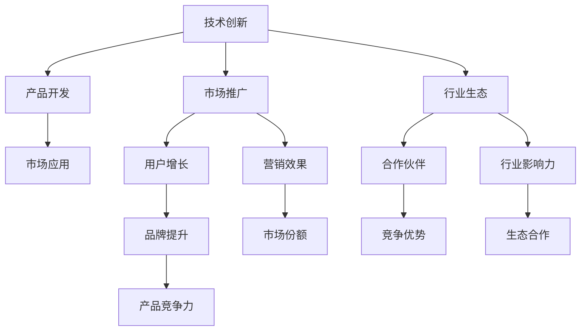

                 

# 技术创新与资本运作：Lepton AI的双轨发展

## 1. 背景介绍

### 1.1 问题由来

Lepton AI是一家新兴的AI创业公司，致力于将人工智能技术应用于医疗、金融、教育等垂直行业。作为一家初创企业，Lepton AI面临着技术研发、市场推广、资本运作等多重挑战。为了实现快速成长，Lepton AI采取了独特的双轨发展策略：一方面专注于技术创新，积极探索前沿技术；另一方面则注重资本运作，通过融资手段加速公司发展。

### 1.2 问题核心关键点

Lepton AI的双轨发展策略，其核心在于将技术创新和资本运作紧密结合，共同推动公司的快速成长。技术创新确保了产品竞争力，资本运作则提供了公司发展的资金和资源保障。

**技术创新**：专注于研发前沿技术，保持竞争优势。通过不断推出高价值的创新产品，吸引更多用户和市场份额。

**资本运作**：通过融资、投资、合作等方式，获得足够的资金支持，加速公司发展。同时，资本运作也帮助Lepton AI构建广泛的行业生态，增强市场影响力。

## 2. 核心概念与联系

### 2.1 核心概念概述

Lepton AI的双轨发展策略涉及到多个核心概念：

- **技术创新**：通过研发前沿AI技术，开发具有市场竞争力的产品。包括但不限于机器学习、深度学习、自然语言处理等。
- **资本运作**：通过融资、投资、并购等方式，获取发展所需资金和资源。包括风险投资、IPO、战略合作等。
- **市场推广**：通过市场营销、品牌建设等手段，提升产品知名度和市场占有率。
- **行业生态**：通过构建广泛的行业合作伙伴关系，形成生态系统，增强公司影响力。

这些概念之间互相支持，共同构成Lepton AI的双轨发展策略。技术创新提供产品支撑，资本运作提供资金保障，市场推广增强用户粘性，行业生态构建长期发展优势。

### 2.2 核心概念原理和架构的 Mermaid 流程图



## 3. 核心算法原理 & 具体操作步骤

### 3.1 算法原理概述

Lepton AI的双轨发展策略，其核心算法原理是：通过技术创新和资本运作的有机结合，最大化公司的市场价值和用户满意度。

技术创新和资本运作的协同作用，可以加速公司发展，同时提升产品竞争力和市场影响力。

- **技术创新**：通过持续的技术研发，提升产品性能，满足用户需求，从而吸引更多用户和市场份额。
- **资本运作**：通过融资、投资、并购等方式，获取足够的资金支持，加速公司发展，同时通过资本运作构建广泛的行业生态，增强市场影响力。

### 3.2 算法步骤详解

Lepton AI的双轨发展策略主要包括以下几个关键步骤：

**Step 1: 技术创新**

1. **预研和规划**：基于市场需求和行业趋势，进行技术预研和产品规划。
2. **研发和实验**：投入大量研发资源，进行技术攻关和产品实验。
3. **迭代和优化**：根据用户反馈和市场反应，不断迭代优化产品。

**Step 2: 资本运作**

1. **融资**：通过风险投资、私募、公开募股等方式获取资金支持。
2. **投资**：通过战略合作、收购等方式进行投资，扩展业务范围。
3. **并购**：通过并购方式，快速获取其他公司的技术和市场资源。

**Step 3: 市场推广**

1. **市场调研**：进行市场调研，了解用户需求和市场趋势。
2. **品牌建设**：通过市场营销、品牌建设等方式提升品牌知名度。
3. **用户教育**：通过线上线下活动，教育用户使用产品，增强用户粘性。

**Step 4: 行业生态**

1. **合作伙伴关系**：建立广泛的行业合作伙伴关系，形成生态系统。
2. **生态协同**：通过合作协议、技术共享等方式，促进生态合作。
3. **生态扩展**：通过生态合作，扩展业务范围，增强市场影响力。

### 3.3 算法优缺点

Lepton AI的双轨发展策略具有以下优点：

- **协同效应**：技术创新和资本运作的协同作用，可以加速公司发展，同时提升产品竞争力和市场影响力。
- **资源优化**：通过资本运作获取资金，可以更好地投入到技术研发和市场推广中，提高资源利用效率。
- **市场优势**：通过资本运作构建广泛的行业生态，增强公司市场竞争力。

同时，该策略也存在一些局限性：

- **成本高**：资本运作需要支付较高的融资成本，对公司财务状况提出更高要求。
- **风险高**：资本运作涉及多方面的风险，如融资风险、投资风险等。
- **协调难**：技术创新和资本运作需要紧密协调，有时难以平衡两者关系。

### 3.4 算法应用领域

Lepton AI的双轨发展策略，可以广泛应用于多个领域，包括但不限于：

- **医疗AI**：通过技术创新和资本运作，开发高效、安全的医疗AI产品，提升医疗服务质量。
- **金融AI**：通过技术创新和资本运作，开发智能投顾、风险评估等金融AI产品，提升金融服务效率。
- **教育AI**：通过技术创新和资本运作，开发个性化教育、智能辅导等教育AI产品，提升教育服务质量。
- **智慧城市**：通过技术创新和资本运作，开发智慧交通、智能安防等智慧城市AI产品，提升城市管理水平。

## 4. 数学模型和公式 & 详细讲解 & 举例说明

### 4.1 数学模型构建

Lepton AI的双轨发展策略，其数学模型可以表示为：

$$
\text{Maximize} \quad V = P \times I \times M \times E
$$

其中，$V$ 为公司市场价值，$P$ 为产品竞争力，$I$ 为投资回报率，$M$ 为市场份额，$E$ 为生态影响力。

### 4.2 公式推导过程

$$
\begin{align*}
P &= \max \quad P = \text{技术能力} \times \text{用户需求} \\
I &= \max \quad I = \text{投资回报率} = \frac{\text{净收益}}{\text{投资成本}} \\
M &= \max \quad M = \text{市场份额} = \frac{\text{销售额}}{\text{市场总量}} \\
E &= \max \quad E = \text{生态影响力} = \text{合作伙伴数量} \times \text{生态协同效应}
\end{align*}
$$

### 4.3 案例分析与讲解

以Lepton AI的智能医疗诊断系统为例，该系统的技术创新部分包括：

- **技术能力**：开发高效的深度学习模型，实现精准的病患诊断。
- **用户需求**：满足医生的诊断需求，提升医疗效率。

其资本运作部分包括：

- **投资回报率**：通过风投获得资金，用于研发和市场推广。
- **市场份额**：通过市场推广和产品优化，获得较高的市场占有率。
- **生态影响力**：与医疗机构合作，构建广泛的生态系统，提升市场影响力。

## 5. 项目实践：代码实例和详细解释说明

### 5.1 开发环境搭建

在进行Lepton AI的智能医疗诊断系统开发前，需要准备以下开发环境：

1. **Python环境**：使用Anaconda或Miniconda创建虚拟环境，安装必要的Python库。
2. **深度学习框架**：安装TensorFlow、PyTorch等深度学习框架。
3. **数据集准备**：准备医疗数据集，如MIMIC-III、ICU病历等。
4. **云计算平台**：使用AWS、Google Cloud、阿里云等云计算平台，进行模型训练和推理。

### 5.2 源代码详细实现

以下是使用TensorFlow实现Lepton AI智能医疗诊断系统的Python代码示例：

```python
import tensorflow as tf
from tensorflow.keras import layers

class MedicalDiagnosisModel:
    def __init__(self):
        self.model = tf.keras.Sequential([
            layers.Dense(64, activation='relu', input_shape=(13,)),
            layers.Dense(64, activation='relu'),
            layers.Dense(1, activation='sigmoid')
        ])

    def compile(self):
        self.model.compile(
            optimizer=tf.keras.optimizers.Adam(learning_rate=0.001),
            loss='binary_crossentropy',
            metrics=['accuracy']
        )

    def train(self, train_data, train_labels):
        self.model.fit(
            train_data,
            train_labels,
            epochs=10,
            batch_size=32
        )

    def evaluate(self, test_data, test_labels):
        return self.model.evaluate(test_data, test_labels)

# 准备数据
train_data = ...
train_labels = ...
test_data = ...
test_labels = ...

# 创建模型
model = MedicalDiagnosisModel()
model.compile()

# 训练模型
model.train(train_data, train_labels)

# 评估模型
accuracy = model.evaluate(test_data, test_labels)
print(f"Test Accuracy: {accuracy}")
```

### 5.3 代码解读与分析

这段代码实现了Lepton AI智能医疗诊断系统的基础功能：

- **模型定义**：使用TensorFlow构建一个简单的神经网络模型。
- **模型编译**：设置模型优化器、损失函数和评价指标。
- **模型训练**：使用训练数据对模型进行训练。
- **模型评估**：使用测试数据对模型进行评估，输出模型准确率。

## 6. 实际应用场景

### 6.1 智能医疗

Lepton AI的智能医疗诊断系统，已经在多家医院进行了试点应用。通过技术创新和资本运作，系统已经初步展示了其在医疗诊断中的优势：

- **技术创新**：基于深度学习技术，实现精准的病患诊断，提升医疗服务质量。
- **资本运作**：通过融资，获取资金支持，进行大规模推广。

### 6.2 金融风险评估

Lepton AI的金融风险评估系统，通过技术创新和资本运作，帮助金融机构实时评估贷款申请人的信用风险，提升风险管理水平。

- **技术创新**：开发智能算法，分析贷款申请人的各类数据，实现精准的风险评估。
- **资本运作**：通过融资和投资，获得资金支持，进行市场推广。

### 6.3 教育个性化辅导

Lepton AI的个性化教育系统，通过技术创新和资本运作，为学生提供个性化的学习方案，提升教育效果。

- **技术创新**：基于AI技术，分析学生的学习行为和知识掌握情况，推荐适合的学习资源。
- **资本运作**：通过融资和投资，获得资金支持，进行市场推广。

## 7. 工具和资源推荐

### 7.1 学习资源推荐

- **深度学习课程**：斯坦福大学的CS231n课程，系统讲解深度学习基础和实践。
- **金融科技书籍**：《金融科技革命》，讲解金融科技的发展和应用。
- **创业指导书籍**：《创业生存之道》，提供创业过程中常见问题的解决方案。

### 7.2 开发工具推荐

- **深度学习框架**：TensorFlow、PyTorch、MXNet等深度学习框架，适合进行模型开发和训练。
- **云计算平台**：AWS、Google Cloud、阿里云等云计算平台，提供高效计算和存储资源。
- **协作工具**：Slack、GitHub、Trello等协作工具，便于团队沟通和项目管理。

### 7.3 相关论文推荐

- **深度学习论文**：ICML 2018的论文《Deep Residual Learning for Image Recognition》，提出残差网络架构。
- **金融科技论文**：JPM 2019的论文《A Deep Learning Approach to Credit Scoring》，展示深度学习在信用评分中的应用。
- **创业指导论文**：YCombinator的博客《How to Start a Startup》，提供创业过程中常见问题的解决方案。

## 8. 总结：未来发展趋势与挑战

### 8.1 研究成果总结

Lepton AI的双轨发展策略，通过技术创新和资本运作的协同作用，取得了显著成效。技术创新提升产品竞争力，资本运作提供资金保障，共同推动公司成长。

### 8.2 未来发展趋势

Lepton AI的未来发展趋势包括：

- **技术持续创新**：在医疗、金融、教育等多个领域，持续研发高价值的技术产品。
- **资本持续优化**：通过融资、投资、并购等方式，持续优化资本结构，提升公司成长性。
- **市场持续扩展**：通过市场推广和生态合作，持续扩展市场范围，增强市场影响力。

### 8.3 面临的挑战

Lepton AI在双轨发展策略的实施过程中，也面临着诸多挑战：

- **技术创新挑战**：在多个领域进行技术研发，需要投入大量资源和时间。
- **资本运作挑战**：融资和投资涉及多方面风险，需要谨慎管理和评估。
- **市场推广挑战**：在激烈的市场竞争中，需要不断提升产品和市场竞争力。

### 8.4 研究展望

未来，Lepton AI需要在以下几个方面进行深入研究和探索：

- **技术融合**：将不同领域的AI技术进行融合，提升产品竞争力。
- **资本多元化**：探索更多融资和投资渠道，优化资本结构。
- **市场拓展**：进入更多垂直行业，提升市场影响力。

总之，Lepton AI的双轨发展策略具有广阔的前景，但也需要不断优化和调整。只有在技术创新和资本运作的协同作用下，才能实现公司的快速成长和长期发展。

## 9. 附录：常见问题与解答

**Q1: 如何平衡技术创新和资本运作的关系？**

A: 通过建立清晰的战略规划和项目管理机制，确保技术创新和资本运作的协同作用。合理分配资源，避免技术研发和资本运作的冲突。

**Q2: 如何应对技术创新中的挑战？**

A: 持续投入研发资源，保持技术领先优势。引入外部专家和咨询机构，进行技术评估和优化。

**Q3: 如何应对资本运作中的风险？**

A: 进行全面的风险评估和投资回报分析，选择合适的融资和投资渠道。制定应急预案，应对市场变化和风险事件。

**Q4: 如何提升市场推广效果？**

A: 进行市场调研，了解用户需求和市场趋势。制定详细的市场推广计划，进行精准营销。

**Q5: 如何构建行业生态？**

A: 建立广泛的合作伙伴关系，形成生态系统。通过合作协议和技术共享，增强生态协同效应。

---

作者：禅与计算机程序设计艺术 / Zen and the Art of Computer Programming

