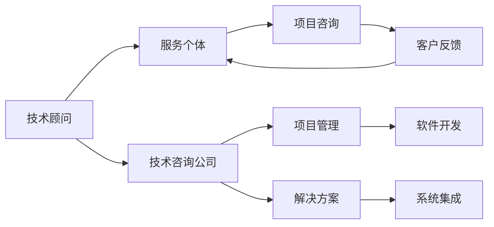

                 

# 技术咨询：从个人服务到咨询公司

## 1. 背景介绍

在现代信息技术和互联网的快速发展下，技术咨询行业正在经历一场深刻的变革。从个人技术顾问到专业咨询公司，技术咨询业在服务模式、业务范围和市场竞争格局上正在逐步变化。本文将从个人服务到咨询公司，详细分析技术咨询业的演变历程、面临的挑战以及未来发展趋势。

## 2. 核心概念与联系

### 2.1 核心概念概述

为了更好地理解技术咨询行业的发展脉络，首先需要明确几个核心概念：

- **技术顾问**：是指在特定技术领域内，提供专业咨询和建议的个体或小组。
- **技术咨询公司**：是指以提供技术咨询和解决方案为核心业务，以团队形式运营的商业机构。
- **技术咨询服务**：指针对企业或个人的需求，提供技术上的专业意见和解决方案的服务，包括但不限于技术架构设计、系统集成、软件开发生命周期管理等。

### 2.2 核心概念原理和架构的 Mermaid 流程图



此图表展示了从技术顾问到技术咨询公司的服务架构，其中：

- **技术顾问**通过个体形式提供服务，聚焦于个别客户项目。
- **技术咨询公司**则以团队形式运作，服务范围更广，能承接更大规模的项目。
- **技术咨询服务**覆盖了从项目咨询、项目管理到系统集成和软件开发等各个环节。

## 3. 核心算法原理 & 具体操作步骤

### 3.1 算法原理概述

技术咨询行业的核心算法原理主要是基于专业知识和经验，结合技术趋势和市场需求，提供个性化的解决方案。其服务流程包括需求分析、方案设计、项目实施和后期维护等。

### 3.2 算法步骤详解

1. **需求分析**：通过对客户需求的深入分析，确定具体业务场景和技术需求。
2. **方案设计**：根据分析结果，设计出符合客户需求的技术解决方案。
3. **项目实施**：团队协作，分阶段实施方案，确保项目按时按质完成。
4. **后期维护**：持续跟进，保证项目长期稳定运行，并及时解决可能出现的问题。

### 3.3 算法优缺点

**优点**：
- 高度定制化：针对客户需求提供个性化解决方案。
- 专业性高：团队成员通常具有丰富的专业知识和实践经验。
- 服务灵活：能够根据客户需求快速调整服务内容。

**缺点**：
- 成本高：需要长期维护，可能存在人力和时间成本问题。
- 市场风险：服务质量高度依赖于团队能力和客户需求匹配度。
- 运营风险：团队管理和项目实施中的不确定性因素较多。

### 3.4 算法应用领域

技术咨询的应用领域广泛，主要包括但不限于：

- **企业信息化建设**：为企业提供ERP、CRM等信息化系统建设服务。
- **软件开发和维护**：为企业和组织提供软件开发、测试和维护服务。
- **IT战略规划**：为企业制定IT战略，进行技术路线图规划。
- **云计算和数据管理**：提供云计算服务、数据治理和分析服务。
- **网络安全和防护**：为企业提供网络安全策略制定、漏洞检测和防护服务。

## 4. 数学模型和公式 & 详细讲解 & 举例说明

### 4.1 数学模型构建

在技术咨询领域，常见的数学模型包括需求模型、技术方案评估模型等。以下以项目成本评估模型为例：

假设项目总成本 $C$ 由固定成本 $C_f$ 和变动成本 $C_v$ 组成，需求模型可以表示为：

$$
C = C_f + C_v \times X
$$

其中 $X$ 为项目的规模或复杂度。

### 4.2 公式推导过程

需求模型进一步推导，可以得到项目的单位成本 $P$：

$$
P = \frac{C}{X}
$$

基于项目需求分析，可以构建需求矩阵 $D$：

$$
D = \begin{pmatrix}
X_1 & P_1 \\
X_2 & P_2 \\
\vdots & \vdots \\
X_n & P_n
\end{pmatrix}
$$

通过线性规划或优化算法，可以求解最优成本方案 $C^*$：

$$
C^* = \min_{X} C
$$

### 4.3 案例分析与讲解

某公司计划在三年内上线一个综合电商平台，需要建立一套全面的信息化系统。通过技术咨询公司进行需求分析后，得出如下需求矩阵：

$$
D = \begin{pmatrix}
1 & 50000 \\
2 & 60000 \\
3 & 70000 \\
4 & 80000 \\
5 & 90000
\end{pmatrix}
$$

采用最小二乘法求解最优成本方案 $C^*$：

$$
C^* = 50000 + 60000 \times 2 + 70000 \times 3 + 80000 \times 4 + 90000 \times 5 = 790000
$$

最终确定项目的总成本为790,000元。

## 5. 项目实践：代码实例和详细解释说明

### 5.1 开发环境搭建

技术咨询服务开发一般需要使用以下环境：

- **编程语言**：Python、Java、C# 等。
- **开发工具**：Eclipse、Visual Studio、PyCharm 等。
- **框架和库**：Spring、Django、Node.js、Flask 等。
- **数据库**：MySQL、PostgreSQL、MongoDB 等。
- **容器和云服务**：Docker、Kubernetes、AWS、Azure 等。

### 5.2 源代码详细实现

以下是一个简化的技术咨询项目需求分析代码示例：

```python
import pandas as pd

# 假设需求矩阵存储在data.csv文件中
data = pd.read_csv('data.csv')

# 定义需求矩阵
D = data.iloc[:, 0].values.reshape(-1, 1)
P = data.iloc[:, 1].values.reshape(-1, 1)

# 使用线性规划求解最优成本方案
from scipy.optimize import linprog

# 构建系数矩阵
A = np.vstack((-D, np.ones(len(D))))
b = np.array([0, 1])
c = np.array(P).T

# 求解最优成本方案
res = linprog(c, A_ub=A, b_ub=b)
C_star = res.x[0]

# 输出最优成本方案
print('最优成本方案：', C_star)
```

### 5.3 代码解读与分析

此代码实现了基于线性规划求解最优成本方案的需求分析功能：

- **数据读取**：使用Pandas读取需求矩阵数据。
- **系数矩阵定义**：将需求矩阵和单位成本矩阵转换为线性规划的系数矩阵。
- **求解最优方案**：使用SciPy的linprog函数求解最优成本方案。
- **结果输出**：输出最优成本方案。

## 6. 实际应用场景

### 6.1 企业信息化建设

企业信息化建设是技术咨询公司的重要服务领域。通过分析企业当前信息化水平和业务需求，咨询公司可以设计出符合企业需求的ERP、CRM等系统，并协助实施和维护。

### 6.2 软件开发和维护

软件开发和维护是技术咨询公司的核心业务之一。通过提供软件开发生命周期管理，咨询公司能帮助企业快速上线和迭代产品，同时提供长期的技术支持和维护服务。

### 6.3 云计算和数据管理

随着云计算和数据管理技术的不断进步，技术咨询公司也在这些新兴领域中占有一席之地。通过提供云计算服务、数据治理和分析服务，咨询公司可以协助企业构建数据驱动的决策支持体系。

### 6.4 未来应用展望

未来，技术咨询业将向以下方向发展：

- **数字化转型咨询**：结合大数据、人工智能等技术，提供全面的数字化转型解决方案。
- **平台化运营咨询**：构建一站式的技术咨询平台，实现资源共享和业务协同。
- **全球化咨询服务**：拓展国际市场，提供跨境咨询服务，帮助企业应对全球化挑战。
- **可持续发展咨询**：关注环境保护和社会责任，提供绿色技术解决方案，实现可持续发展。

## 7. 工具和资源推荐

### 7.1 学习资源推荐

- **在线课程**：Coursera、edX、Udacity 等平台提供的数据科学和软件开发课程。
- **书籍推荐**：《软件开发生命周期管理》、《系统架构设计》等经典技术书籍。
- **技术社区**：Stack Overflow、GitHub、Kaggle 等技术社区，提供丰富的学习资源和交流平台。

### 7.2 开发工具推荐

- **版本控制工具**：Git、SVN、Mercurial 等。
- **项目管理工具**：Jira、Trello、Asana 等。
- **代码协作工具**：GitHub、GitLab、Bitbucket 等。
- **云服务工具**：AWS、Azure、Google Cloud 等。

### 7.3 相关论文推荐

- **需求分析**：《企业信息化需求分析方法研究》
- **项目成本评估**：《基于线性规划的项目成本评估模型》
- **软件开发生命周期管理**：《软件开发生命周期管理实践与案例分析》

## 8. 总结：未来发展趋势与挑战

### 8.1 研究成果总结

技术咨询行业在过去几十年中经历了从个体技术顾问到专业咨询公司的发展，其服务模式和业务范围不断扩展。未来的技术咨询公司将更加注重数字化、平台化和全球化，同时关注可持续发展。

### 8.2 未来发展趋势

1. **数字化转型咨询**：结合大数据、人工智能等技术，提供全面的数字化转型解决方案。
2. **平台化运营咨询**：构建一站式的技术咨询平台，实现资源共享和业务协同。
3. **全球化咨询服务**：拓展国际市场，提供跨境咨询服务，帮助企业应对全球化挑战。
4. **可持续发展咨询**：关注环境保护和社会责任，提供绿色技术解决方案，实现可持续发展。

### 8.3 面临的挑战

1. **市场竞争激烈**：技术咨询市场竞争激烈，客户需求高度多样化，服务质量需要不断提升。
2. **技术更新快**：随着技术的发展，咨询公司需要不断更新知识和技能，保持竞争力。
3. **客户需求变化**：市场需求不断变化，咨询公司需要灵活应对，提供创新解决方案。
4. **成本控制**：项目成本控制和资源管理是咨询公司面临的重要挑战，需要不断优化流程和工具。

### 8.4 研究展望

技术咨询行业的发展将更多依赖于技术进步和市场创新。未来，通过结合大数据、云计算、人工智能等新兴技术，技术咨询公司有望实现业务模式的创新，提供更具前瞻性和竞争力的解决方案。

## 9. 附录：常见问题与解答

### Q1: 技术咨询公司的核心竞争力是什么？

A: 技术咨询公司的核心竞争力主要体现在专业知识、团队协作和项目经验。这些因素决定了咨询公司能否提供高质量的定制化服务，满足客户的多样化需求。

### Q2: 技术咨询公司如何进行市场推广？

A: 技术咨询公司可以通过建立网站、参加行业展会、发布白皮书等方式进行市场推广。此外，利用社交媒体和网络广告也能扩大知名度和影响力。

### Q3: 技术咨询公司如何建立团队文化？

A: 技术咨询公司应注重团队建设和培训，鼓励创新和学习。通过制定明确的团队目标和价值观，提升团队凝聚力和战斗力。

### Q4: 技术咨询公司如何应对项目风险？

A: 技术咨询公司应建立完善的项目管理体系，包括需求分析、风险评估、质量控制等环节。通过团队协作和风险管理，降低项目实施中的不确定性。

### Q5: 技术咨询公司如何拓展国际市场？

A: 技术咨询公司可以通过海外合作、本地化运营、参加国际展会等方式拓展国际市场。同时，了解当地文化、法律和市场需求，是成功的关键。

---

作者：禅与计算机程序设计艺术 / Zen and the Art of Computer Programming

