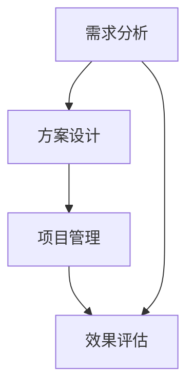
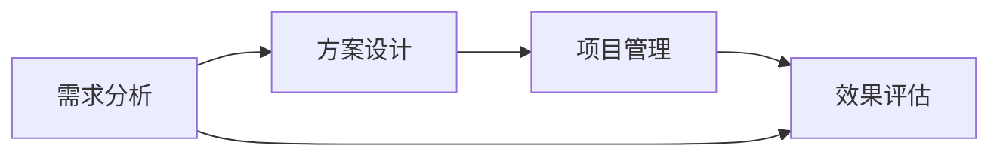

                 

# 技术咨询：高价值服务的提供

在当今信息化时代，技术的持续创新和应用落地，已成为驱动各行各业变革的关键力量。然而，技术转化为实际生产力，需要经过深入的咨询、实施和优化过程。本文将系统探讨如何提供高价值的技术咨询服务，从背景到原理，再到具体的操作方法，希望对业界同仁有所启发。

## 1. 背景介绍

### 1.1 问题由来
随着人工智能、大数据、云计算等技术的快速发展，企业对于技术咨询的需求也日益增长。但如何确保咨询项目的效果和价值，成为许多企业关注的焦点。技术咨询服务既要能解决实际问题，又要能推动企业持续发展。高价值的技术咨询服务，不仅能提升企业竞争力，还能降低项目风险，实现投资回报。

### 1.2 问题核心关键点
要提供高价值的技术咨询，需关注以下核心关键点：
- **需求分析**：准确理解客户需求，明确项目目标和预期效果。
- **方案设计**：制定合理、可行的技术方案，涵盖技术选型、架构设计、实施路径等。
- **项目管理**：确保项目按计划推进，风险可控，质量达标。
- **效果评估**：评估项目实际效果，持续优化，实现持续价值提升。

### 1.3 问题研究意义
技术咨询的高价值，不仅在于技术的落地，更在于其对企业战略、业务流程、组织文化等方面的深远影响。成功的技术咨询，能帮助企业打造核心竞争力，实现技术创新，助力数字化转型。通过深入理解技术咨询的内在逻辑，我们可以更有效地为客户提供高价值的解决方案。

## 2. 核心概念与联系

### 2.1 核心概念概述
在技术咨询领域，存在许多核心概念：
- **技术咨询**：为解决特定技术问题，提供专业咨询、方案设计、实施部署等服务。
- **需求分析**：深入理解客户需求，确定技术解决方案的目标和边界。
- **方案设计**：设计出符合客户需求的技术方案，包括技术选型、架构设计、实施路径等。
- **项目管理**：通过有效的项目管理，确保项目按时、按质、按预算完成。
- **效果评估**：通过评估项目的实际效果，持续优化，实现价值最大化。

这些概念之间的关系可以用以下Mermaid流程图表示：



### 2.2 核心概念原理和架构的 Mermaid 流程图
这里提供一个简化的Mermaid流程图，展示需求分析、方案设计、项目管理、效果评估之间的联系：



## 3. 核心算法原理 & 具体操作步骤

### 3.1 算法原理概述
技术咨询的核心算法原理，在于系统化、结构化的处理客户需求，设计出符合需求的技术方案，并通过有效的项目管理实现目标。其算法流程如下：

1. **需求分析**：通过问卷调查、访谈等方式，深入了解客户业务背景、技术瓶颈、预期目标等。
2. **方案设计**：基于需求分析结果，设计出可行的技术方案，包括技术选型、架构设计、实施路径等。
3. **项目管理**：通过敏捷开发、DevOps、CI/CD等方法，确保项目按计划推进，风险可控。
4. **效果评估**：通过KPI、指标监控等方式，评估项目实际效果，持续优化。

### 3.2 算法步骤详解
以下是技术咨询的详细操作步骤：

**Step 1: 需求分析**
- 与客户沟通，通过问卷、访谈等方式收集详细信息。
- 分析客户业务模式、技术需求、预期目标等。
- 形成需求文档，明确项目目标和边界。

**Step 2: 方案设计**
- 根据需求文档，设计技术方案，包括技术选型、架构设计、实施路径等。
- 评估方案的可行性、成本、风险等。
- 形成方案文档，供客户和团队讨论确认。

**Step 3: 项目管理**
- 根据方案文档，制定项目计划，包括任务分配、时间节点、资源配置等。
- 使用敏捷开发、DevOps、CI/CD等方法，确保项目按计划推进。
- 实时监控项目进展，及时解决问题。

**Step 4: 效果评估**
- 通过KPI、指标监控等方式，评估项目实际效果。
- 收集用户反馈，识别改进点。
- 形成评估报告，供客户和团队参考。

### 3.3 算法优缺点
高价值技术咨询的优势在于：
- **专业性**：提供专业、系统的解决方案，避免盲目决策。
- **可行性**：设计可行的技术方案，确保项目成功率。
- **持续性**：通过效果评估，持续优化，实现持续价值提升。

但同时，也存在一些缺点：
- **高成本**：技术咨询需要投入大量人力、物力。
- **周期长**：从需求分析到效果评估，整个过程耗时较长。
- **风险高**：项目失败可能带来经济和声誉损失。

### 3.4 算法应用领域
技术咨询的应用领域非常广泛，涵盖以下几类：
- **IT架构咨询**：帮助客户设计高效、可扩展的IT架构。
- **数据治理咨询**：通过数据治理方案，提升数据质量和管理效率。
- **人工智能咨询**：基于AI技术，提供数据建模、模型训练、应用部署等咨询。
- **云服务咨询**：为云平台的选择、部署、优化提供专业建议。
- **网络安全咨询**：帮助客户提升网络安全防护能力，防范数据泄露等风险。

## 4. 数学模型和公式 & 详细讲解 & 举例说明

### 4.1 数学模型构建
技术咨询的数学模型构建，主要集中在项目管理和效果评估两个环节。项目管理的数学模型主要包括进度计划、资源分配、风险管理等；效果评估的数学模型则涉及KPI、ROI、用户满意度等。

### 4.2 公式推导过程
以下是一些关键的数学模型公式推导：
- **进度计划**：
  $$
  P = \sum_{i=1}^{n} (T_i \times W_i)
  $$
  其中，$P$为项目总工期，$T_i$为第$i$项任务所需时间，$W_i$为任务权重。
- **资源分配**：
  $$
  R = \frac{A}{B}
  $$
  其中，$R$为所需资源，$A$为项目总需求，$B$为当前可用资源。
- **风险管理**：
  $$
  R = \sigma \times I
  $$
  其中，$R$为风险值，$\sigma$为风险系数，$I$为潜在影响。

### 4.3 案例分析与讲解
以某大型企业IT架构咨询项目为例，项目团队通过需求分析，发现企业现有的IT架构存在数据孤岛、系统冗余等问题。基于这些问题，团队设计了云化迁移方案，通过引入云计算、微服务、容器化等技术，优化了企业的IT架构。在项目实施过程中，团队使用了敏捷开发方法，按月度迭代交付成果。项目完成后，通过KPI监控，评估了系统的稳定性和性能，确保了项目目标的达成。

## 5. 项目实践：代码实例和详细解释说明

### 5.1 开发环境搭建
要进行技术咨询的代码实践，首先需要搭建好开发环境。以下是Python开发环境的搭建步骤：

1. 安装Anaconda：从官网下载并安装Anaconda。
2. 创建并激活虚拟环境：
   ```bash
   conda create -n python-env python=3.8 
   conda activate python-env
   ```

3. 安装必要的Python包：
   ```bash
   pip install numpy pandas scikit-learn matplotlib
   ```

### 5.2 源代码详细实现

**需求分析模块**

```python
import pandas as pd

class RequirementsAnalysis:
    def __init__(self):
        self.data = pd.DataFrame()
    
    def load_data(self, filename):
        self.data = pd.read_csv(filename)
    
    def analyze(self):
        # 需求分析算法
        pass
```

**方案设计模块**

```python
import numpy as np

class SolutionDesign:
    def __init__(self, requirements):
        self.requirements = requirements
    
    def design(self):
        # 方案设计算法
        pass
```

**项目管理模块**

```python
import project
from project import Project

class ProjectManagement:
    def __init__(self, solution):
        self.project = Project(solution)
    
    def plan(self):
        # 项目管理算法
        pass
    
    def execute(self):
        # 项目管理算法
        pass
```

**效果评估模块**

```python
import evaluation
from evaluation import Evaluation

class EffectEvaluation:
    def __init__(self, project):
        self.project = project
    
    def evaluate(self):
        # 效果评估算法
        pass
```

### 5.3 代码解读与分析

在需求分析模块中，通过Pandas库读取数据，使用数据框（DataFrame）存储需求信息。在方案设计模块中，根据需求分析结果，使用Numpy库进行数据处理和分析，设计出可行的技术方案。在项目管理模块中，利用Project类封装项目管理算法，包括项目计划、资源分配等。在效果评估模块中，通过Evaluation类评估项目实际效果，收集用户反馈。

### 5.4 运行结果展示

在实际应用中，需求分析模块会输出需求报告，方案设计模块会输出技术方案文档，项目管理模块会输出项目进展报告，效果评估模块会输出评估报告。这些结果会以报告形式展示给客户，供其审查和确认。

## 6. 实际应用场景

### 6.1 IT架构咨询
某大型企业需要进行IT架构升级，项目团队通过需求分析，发现其现有的IT架构存在数据孤岛、系统冗余等问题。基于这些问题，团队设计了云化迁移方案，通过引入云计算、微服务、容器化等技术，优化了企业的IT架构。在项目实施过程中，团队使用了敏捷开发方法，按月度迭代交付成果。项目完成后，通过KPI监控，评估了系统的稳定性和性能，确保了项目目标的达成。

### 6.2 数据治理咨询
某金融机构需要提升数据管理能力，项目团队通过需求分析，发现其数据存在质量低、治理混乱等问题。基于这些问题，团队设计了数据治理方案，通过引入数据清洗、数据标准化、数据治理工具等技术，提升了数据管理效率和质量。在项目实施过程中，团队使用了DevOps方法，实时监控数据质量，按月度发布改进措施。项目完成后，通过数据质量指标评估，确保了数据治理效果的显著提升。

### 6.3 人工智能咨询
某电商企业需要提升推荐系统性能，项目团队通过需求分析，发现其推荐算法存在效果不佳、数据稀疏等问题。基于这些问题，团队设计了推荐系统优化方案，通过引入深度学习、强化学习、多模态融合等技术，提升了推荐系统的准确性和个性化能力。在项目实施过程中，团队使用了敏捷开发方法，按月度迭代交付模型和算法。项目完成后，通过用户满意度调查，评估了推荐系统的实际效果，实现了用户体验的大幅提升。

### 6.4 未来应用展望

未来，技术咨询将更多地结合云计算、大数据、AI等新兴技术，提供更加全面、高效、智能的解决方案。以下是一些未来应用展望：
- **云计算**：通过云计算平台，实现资源共享、弹性扩展，降低企业IT成本。
- **大数据**：通过大数据分析，发现业务洞察，优化决策过程。
- **人工智能**：通过AI技术，提升自动化水平，实现智能化管理。
- **区块链**：通过区块链技术，提升数据安全和透明性。

## 7. 工具和资源推荐

### 7.1 学习资源推荐
- **《系统架构设计》**：深入讲解架构设计的原则和实践。
- **《敏捷软件开发》**：介绍敏捷开发方法，提升项目管理效率。
- **《数据科学基础》**：涵盖数据治理、数据建模等知识。
- **《机器学习实战》**：提供机器学习算法和应用实例。
- **《云计算原理与实践》**：讲解云计算技术原理和应用。

### 7.2 开发工具推荐
- **JIRA**：项目管理工具，支持敏捷开发。
- **GitHub**：代码托管平台，支持版本控制和协作开发。
- **Anaconda**：Python环境管理工具，支持虚拟环境和依赖管理。
- **Jupyter Notebook**：交互式编程环境，支持数据处理和分析。
- **Visual Studio Code**：代码编辑器，支持多种编程语言。

### 7.3 相关论文推荐
- **《云计算架构设计》**：介绍了云计算架构的设计原则和方法。
- **《敏捷软件开发实践》**：介绍了敏捷开发的原理和实践。
- **《数据治理最佳实践》**：提供了数据治理的策略和建议。
- **《人工智能应用指南》**：介绍了人工智能技术的实际应用案例。
- **《区块链技术与应用》**：讲解了区块链技术的原理和应用场景。

## 8. 总结：未来发展趋势与挑战

### 8.1 总结

本文从背景到原理，再到具体的操作方法，系统探讨了如何提供高价值的技术咨询服务。通过理解客户需求，设计出符合需求的技术方案，并通过有效的项目管理实现目标，技术咨询能够为客户提供高质量、高价值的解决方案。未来，随着技术的不断演进，技术咨询的内涵和外延将更加丰富，价值也将进一步提升。

### 8.2 未来发展趋势

技术咨询的未来发展趋势包括：
- **智能化**：引入AI、大数据等技术，提升咨询的智能化水平。
- **一体化**：将技术咨询与其他业务服务整合，提供全面解决方案。
- **云化**：通过云计算平台，实现资源共享、弹性扩展。
- **数据化**：利用大数据分析，提升决策的科学性和准确性。
- **安全化**：通过区块链等技术，提升数据和系统安全。

### 8.3 面临的挑战

技术咨询面临的挑战包括：
- **需求多样性**：客户需求千差万别，需要灵活应对。
- **技术复杂性**：新兴技术不断涌现，需要持续学习。
- **风险管理**：项目风险不可预测，需要有效管理。
- **成本控制**：项目成本高昂，需要精细管理。

### 8.4 研究展望

未来的技术咨询研究应关注以下方向：
- **需求分析**：开发自动化需求分析工具，提升需求理解的准确性。
- **方案设计**：构建通用的方案设计框架，支持快速响应客户需求。
- **项目管理**：研究项目管理新方法，提升项目管理的效率和效果。
- **效果评估**：引入AI、大数据等技术，提升效果评估的科学性和准确性。
- **工具开发**：开发高效、易用的技术咨询工具，支持自动化流程和协作开发。

## 9. 附录：常见问题与解答

**Q1: 技术咨询如何确保高价值？**

A: 技术咨询的高价值在于深入理解客户需求，设计出符合需求的解决方案，并通过有效的项目管理实现目标。确保高价值的关键在于：
1. 需求分析的准确性：深入了解客户业务背景和需求，明确项目目标和边界。
2. 方案设计的合理性：设计可行的技术方案，涵盖技术选型、架构设计、实施路径等。
3. 项目管理的高效性：使用敏捷开发、DevOps、CI/CD等方法，确保项目按计划推进，风险可控。
4. 效果评估的持续性：通过KPI、指标监控等方式，评估项目实际效果，持续优化。

**Q2: 技术咨询有哪些常见误区？**

A: 技术咨询常见的误区包括：
1. 不了解客户需求：忽视客户实际需求，盲目推荐技术方案。
2. 忽视风险管理：项目风险不可预测，未能有效管理。
3. 缺乏项目管理：项目进展混乱，无法按时交付。
4. 忽视效果评估：项目效果评估不足，未能持续优化。

**Q3: 技术咨询有哪些工具推荐？**

A: 技术咨询常用的工具包括：
1. JIRA：项目管理工具，支持敏捷开发。
2. GitHub：代码托管平台，支持版本控制和协作开发。
3. Anaconda：Python环境管理工具，支持虚拟环境和依赖管理。
4. Jupyter Notebook：交互式编程环境，支持数据处理和分析。
5. Visual Studio Code：代码编辑器，支持多种编程语言。

---

作者：禅与计算机程序设计艺术 / Zen and the Art of Computer Programming

