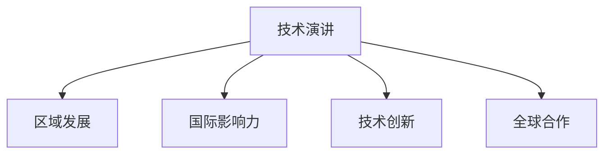

                 

# 技术演讲：从地区到国际舞台

> 关键词：技术演讲, 地区发展, 国际影响, 技术创新, 全球合作, 未来趋势

## 1. 背景介绍

### 1.1 问题由来
在快速发展的全球化时代，技术创新已经超越了地区边界，成为推动全球经济增长和社会进步的核心动力。随着互联网、人工智能、大数据等技术领域的不断突破，技术的国际传播和应用成为了重大的议题。技术演讲作为技术交流的重要形式，扮演着连接地区与国际舞台的桥梁角色。

### 1.2 问题核心关键点
技术演讲的核心理念是将区域内的技术突破和创新成果呈现给国际同行，促进知识分享和合作。关键点包括：
- 跨文化沟通：在国际场合中清晰准确地传达技术概念和成果。
- 国际化视角：立足本地化研究，具备全球化视野。
- 全球影响力：通过技术演讲提升本地技术的国际知名度和影响力。
- 创新驱动：通过演讲激发更多技术创新和合作。

### 1.3 问题研究意义
技术演讲对于地区发展和国际影响力具有重要意义：

1. 促进国际合作：技术演讲能连接不同地区的科研机构和企业，建立跨文化的技术合作关系，推动国际学术交流和技术转移。
2. 提升国际形象：成功演讲能增强本地技术研发团队的国际认可度和品牌价值，提升国家科技软实力。
3. 激发技术创新：通过国际平台展示技术成果，能激发更多技术创新和改进，促进区域技术水平的提升。
4. 加强科技普及：演讲能帮助公众理解前沿技术，推动科学普及和技术文化发展。
5. 促进政策支持：成功的技术演讲可能吸引更多的政策支持和资金投入，加速技术研发和应用。

## 2. 核心概念与联系

### 2.1 核心概念概述

技术演讲的核心概念包括：

- 技术演讲：通过专业口才和传播技巧，将复杂的科研成果和创新经验简明扼要地呈现给听众的技术表达形式。
- 区域发展：通过技术创新和应用，推动地区经济增长和社会进步的持续过程。
- 国际影响力：技术成果在全球范围内的影响力和知名度，反映在学术、产业和政策等多个方面。
- 技术创新：在基础研究、应用开发、产业部署等方面不断突破和改进，推动技术的进步。
- 全球合作：不同地区之间的技术交流和合作，共同应对全球性科技挑战。

这些核心概念之间的联系可以通过以下Mermaid流程图来展示：



这个流程图展示了几大核心概念的相互关系：

1. 技术演讲作为桥梁，促进了区域发展、提升国际影响力、推动技术创新和促进全球合作。
2. 区域发展、国际影响力、技术创新和全球合作又是技术演讲能够实现这些效果的重要前提和目标。

## 3. 核心算法原理 & 具体操作步骤
### 3.1 算法原理概述

技术演讲的核心算法原理基于有效沟通和内容展示，通过以下步骤实现技术成果的有效传播：

1. **目标定位**：明确演讲目标和受众，确保内容的相关性和针对性。
2. **内容结构**：设计演讲内容的逻辑结构和信息组织，便于听众理解和记忆。
3. **表达技巧**：运用演讲技巧和传播手段，增强内容表达的吸引力和说服力。
4. **互动反馈**：通过提问和交流，获取听众反馈，实时调整演讲内容。
5. **持续优化**：根据反馈和实际效果，不断改进演讲内容和表达方式。

### 3.2 算法步骤详解

技术演讲的具体操作步骤包括：

1. **准备工作**：
   - **受众分析**：了解听众的背景、兴趣和需求，针对性地准备演讲内容。
   - **资料搜集**：收集相关数据、案例和研究论文，丰富演讲素材。
   - **场地准备**：选择适宜的演讲地点，提前测试设备和音响效果。

2. **内容准备**：
   - **开场白**：简洁明了地介绍演讲主题和背景，引发听众兴趣。
   - **主体内容**：结构清晰地阐述技术成果、研究方法和应用案例，确保逻辑性和连贯性。
   - **结尾总结**：回顾演讲要点，提出未来展望和进一步研究方向。

3. **演讲表达**：
   - **语言表达**：使用清晰简洁的语言，避免专业术语的过度使用，便于听众理解。
   - **视觉辅助**：利用PPT、视频、图表等辅助工具，直观展示技术细节和实际应用。
   - **肢体语言**：通过眼神交流、手势配合等非语言沟通，增强演讲的亲和力和感染力。

4. **互动环节**：
   - **提问环节**：主动邀请听众提问，回答相关问题，增强互动性。
   - **反馈评估**：收集听众反馈，了解演讲效果和不足，为未来演讲提供改进方向。

5. **后续跟进**：
   - **联系交流**：建立与听众的联系，后续分享更多技术细节和合作机会。
   - **内容优化**：根据反馈和需求，持续优化演讲内容和表达方式，提升演讲质量。

### 3.3 算法优缺点

技术演讲的优点：
- **高效传播**：简明扼要地传递复杂技术内容，提高传播效率。
- **多角度展示**：通过语言、视觉和互动等多种方式，全面展示技术成果。
- **促进合作**：增进不同地区间的技术交流和合作，促进知识共享。

技术演讲的缺点：
- **时间限制**：难以在短时间内涵盖所有细节，可能遗漏重要信息。
- **语言障碍**：不同语言和文化背景的听众，可能影响传播效果。
- **依赖表达能力**：演讲者的表达能力和专业背景对演讲效果有重要影响。

### 3.4 算法应用领域

技术演讲在多个领域均有广泛应用，包括：

- **学术会议**：在顶级学术会议上进行技术展示和交流，促进学术合作和前沿技术传播。
- **技术论坛**：在行业技术论坛上进行演讲，分享技术经验和最新成果，推动技术应用。
- **科技展会**：在科技展会上进行演讲，展示最新产品和技术，吸引投资和技术合作机会。
- **政府报告**：在政策制定和评估时进行技术汇报，推动政策支持和技术应用。
- **企业发布**：在新产品发布和技术成果展示时进行演讲，提升企业品牌和市场影响力。

## 4. 数学模型和公式 & 详细讲解 & 举例说明（备注：数学公式请使用latex格式，latex嵌入文中独立段落使用 $$，段落内使用 $)
### 4.1 数学模型构建

技术演讲的数学模型可以构建为：

- **听众模型**：$L = (I, D, S)$，其中$I$为兴趣，$D$为知识背景，$S$为社会网络。
- **内容模型**：$C = (T, M, A)$，其中$T$为技术细节，$M$为研究方法，$A$为应用案例。
- **传播模型**：$P = (C, L, E)$，其中$C$为内容，$L$为听众，$E$为传播效果。

### 4.2 公式推导过程

技术演讲的传播效果$E$可以通过以下公式推导：

$$
E = f(I, D, S, T, M, A)
$$

其中，$f$为复合函数，包含多变量相互作用。具体推导如下：

$$
E = F(I \odot T) + G(D \odot M) + H(S \odot A) + K(E)
$$

其中$\odot$表示乘法运算，$F$、$G$、$H$为传播函数，$K$为反馈函数。

### 4.3 案例分析与讲解

以学术会议上的技术演讲为例：

- **听众兴趣**：通过问卷调查或之前研究，了解听众对特定技术领域或应用场景的兴趣，从而选择演讲主题。
- **技术细节**：详细介绍技术原理、实验方法和数据结果，确保信息的准确性和完整性。
- **研究方法**：介绍采用的研究手段和数据集，展示实验设计和数据分析过程。
- **应用案例**：通过实际案例展示技术的应用效果和潜在价值，增强说服力。
- **反馈评估**：在演讲结束后，通过问卷或直接交流收集听众反馈，评估演讲效果，为未来改进提供依据。

## 5. 项目实践：代码实例和详细解释说明
### 5.1 开发环境搭建

技术演讲的开发环境搭建包括：

- **软件环境**：安装专业的演示软件如PowerPoint、Keynote等。
- **硬件环境**：选择适宜的演讲场所，配备投影仪和音响设备。
- **网络连接**：确保网络连接顺畅，便于与观众互动和资料共享。

### 5.2 源代码详细实现

以下是使用PowerPoint进行技术演讲的代码实现：

```python
import pptx

# 创建演示文件
ppt = pptx.Presentation()

# 添加幻灯片
slide = ppt.slides.add_slide(pptx.layoutsSlideLayouts.TITLE_SLIDE)
slide.title.text = "技术演讲：从地区到国际舞台"

# 添加子幻灯片
subslide = ppt.add_slide(pptx.layoutsSlideLayouts.TITLE_AND_CONTENT)
subslide.title.text = "演讲内容"

# 添加文本内容
text_frame = subslide.shapes(1).text_frame
text_frame.text = "技术演讲的核心算法原理和具体操作步骤"

# 添加图像
image = ppt.add_image("tech_speech.jpg", subslide)

# 保存演示文件
ppt.save("tech_speech.pptx")
```

### 5.3 代码解读与分析

**代码实现步骤**：

1. **导入库**：导入pptx库，用于创建和修改演示文件。
2. **创建演示文件**：使用pptx.Presentation()创建新的演示文件。
3. **添加幻灯片**：使用add_slide()方法添加新的幻灯片，使用TITLE_SLIDE布局。
4. **添加标题**：设置幻灯片标题。
5. **添加子幻灯片**：使用add_slide()方法添加新的子幻灯片，使用TITLE_AND_CONTENT布局。
6. **添加标题**：设置子幻灯片标题。
7. **添加文本内容**：通过text_frame添加文本内容。
8. **添加图像**：使用add_image()方法添加图片。
9. **保存演示文件**：使用save()方法保存演示文件。

**代码功能解读**：

- **标题和内容**：演示文件包含一个标题幻灯片和一个内容幻灯片。
- **文本内容**：文本内容简要介绍了技术演讲的核心算法原理和操作步骤。
- **图像**：通过添加图片增强视觉效果，使内容更加生动。

## 6. 实际应用场景
### 6.1 学术会议

在学术会议上进行技术演讲，是技术传播的重要渠道。通过技术演讲，可以展示最新研究成果，促进学术交流和技术合作：

- **论文展示**：在顶级学术会议上发表技术论文，分享科研成果和创新方法。
- **技术交流**：与国际同行进行深入交流，获取最新行业动态和技术进展。
- **合作机会**：通过演讲结识潜在的合作伙伴，推动国际科研合作项目。

### 6.2 技术论坛

技术论坛是技术演讲的重要平台，提供广泛的传播渠道：

- **行业经验**：分享行业内的技术经验和最佳实践，提升技术水平。
- **用户需求**：了解用户和市场的需求，调整产品和服务方向。
- **技术推广**：通过论坛展示技术优势和应用案例，吸引更多用户和投资者。

### 6.3 科技展会

科技展会是技术演讲的重要场合，能快速提升技术知名度和影响力：

- **品牌展示**：通过技术演讲展示企业品牌和技术实力，吸引关注和合作。
- **产品推广**：展示最新技术和产品，获取用户反馈和市场认可。
- **创新体验**：通过现场演示和互动体验，吸引更多观众和客户。

### 6.4 未来应用展望

未来技术演讲将迎来更多技术变革和应用场景：

- **多语言支持**：开发多语言支持的技术演讲工具，提升国际传播效果。
- **实时互动**：利用AI技术实现实时翻译和问答互动，提升演讲质量。
- **全息演讲**：通过全息技术呈现虚拟演讲场景，增强演讲的沉浸感和互动性。
- **虚拟现实**：利用VR技术构建虚拟演讲环境，提供沉浸式体验。
- **元宇宙应用**：在元宇宙平台上进行技术演讲，探索全新的技术传播模式。

## 7. 工具和资源推荐
### 7.1 学习资源推荐

为了帮助演讲者提升技术演讲能力，以下是一些优质的学习资源：

1. **TED Talks**：TED大会的成功演讲案例，展示不同领域的演讲技巧和方法。
2. **TEDx Talks**：本地化演讲视频，提供各地区演讲者的真实案例和经验分享。
3. **Coursera**：提供专业演讲课程，涵盖演讲技巧、沟通能力和内容组织等多个方面。
4. **Toastmasters International**：国际演讲协会，提供演讲训练和技能提升的全面课程。
5. **公共演讲培训**：参加本地化的公共演讲培训，提升演讲技巧和自信度。

通过这些资源的学习和实践，演讲者可以系统提升技术演讲的能力，提高演讲效果和传播效果。

### 7.2 开发工具推荐

以下是几款用于技术演讲开发的常用工具：

1. **PowerPoint**：功能强大的演示工具，支持文本、图片、图表等多种内容的展示。
2. **Keynote**：苹果公司的演示工具，支持丰富的视觉效果和动画效果。
3. **Prezi**：创新的演示工具，支持动态展示和空间布局。
4. **Canva**：易用的设计工具，支持创建各种视觉展示效果。
5. **Zoom**：视频会议工具，支持远程演讲和实时互动。

这些工具能帮助演讲者更高效地制作和展示技术演讲，提升演讲质量和观众体验。

### 7.3 相关论文推荐

以下是几篇奠基性的技术演讲相关论文，推荐阅读：

1. "Effective Public Speaking: Strategies for Success" by K.J. Douglass
2. "The Art of Public Speaking" by Dale Carnegie
3. "TED Talks: The Official TED Guide to Public Speaking" by Chris Anderson
4. "Presentation Zen: Simple Ideas on Presentation Design and Delivery" by Garr Reynolds
5. "The Nonverbal Communication Book" by Barbara Pachter and Robert Bies

这些论文代表了大语言模型微调技术的发展脉络。通过学习这些前沿成果，可以帮助研究者把握学科前进方向，激发更多的创新灵感。

## 8. 总结：未来发展趋势与挑战
### 8.1 总结

本文对技术演讲从地区到国际舞台进行了全面系统的介绍。首先阐述了技术演讲的背景和意义，明确了演讲在促进国际合作、提升国际形象和激发技术创新等方面的重要作用。其次，从原理到实践，详细讲解了技术演讲的数学模型和具体操作步骤，给出了具体的代码实现和详细解读。同时，本文还探讨了技术演讲在学术会议、技术论坛、科技展会等不同场景中的应用前景，展示了其广阔的应用空间。最后，本文精选了技术演讲的学习资源、开发工具和相关论文，力求为演讲者提供全方位的技术指引。

通过本文的系统梳理，可以看到，技术演讲作为技术交流的重要形式，正在成为推动技术传播和国际合作的关键工具。演讲者通过不断提升自身演讲技巧和传播能力，能更好地在国际舞台上展示技术成果，促进区域技术和全球技术的进步。

### 8.2 未来发展趋势

展望未来，技术演讲将呈现以下几个发展趋势：

1. **技术融合**：技术演讲将更多地与虚拟现实、增强现实等新兴技术融合，提供沉浸式、互动式演讲体验。
2. **多渠道传播**：利用社交媒体、在线平台等多种渠道，实现更广泛的传播效果。
3. **个性化定制**：根据听众需求和兴趣，提供个性化的演讲内容和形式，提升演讲效果。
4. **实时反馈**：引入AI技术实现实时反馈和调整，提升演讲互动性和效果。
5. **全球合作**：建立全球性技术演讲平台，促进全球范围内的技术交流和合作。

这些趋势表明，技术演讲将更深入地融入技术传播和国际合作，成为连接不同地区和文化的桥梁。

### 8.3 面临的挑战

尽管技术演讲已经取得了显著成效，但仍面临一些挑战：

1. **跨文化沟通**：不同语言和文化背景的听众可能影响演讲效果。
2. **技术复杂性**：技术演讲内容往往涉及复杂的技术细节和专业术语，难以在短时间内完整传达。
3. **演讲压力**：高水平技术演讲要求演讲者具备高超的表达能力和心理素质，对部分演讲者来说可能难以应对。
4. **时间限制**：演讲时长有限，难以在短时间内覆盖所有内容。
5. **反馈效果**：观众反馈难以量化和评估，难以实时调整演讲内容。

### 8.4 研究展望

未来技术演讲的研究应在以下几个方面寻求新的突破：

1. **跨文化沟通**：开发多语言支持的演讲工具，提升国际传播效果。
2. **内容组织**：设计更高效的内容结构，便于听众理解和记忆。
3. **表达技巧**：提升演讲者的表达能力和心理素质，增强演讲效果。
4. **技术融合**：结合新兴技术，如AI、VR等，提升演讲的沉浸性和互动性。
5. **反馈机制**：建立实时反馈和调整机制，提升演讲效果和观众体验。

这些研究方向将推动技术演讲向更高层次发展，成为连接地区和国际舞台的重要工具。

## 9. 附录：常见问题与解答

**Q1：技术演讲的核心要素有哪些？**

A: 技术演讲的核心要素包括：

1. **目标定位**：明确演讲目标和受众。
2. **内容结构**：设计逻辑结构和信息组织。
3. **表达技巧**：运用语言、视觉和互动技巧。
4. **互动反馈**：收集听众反馈，实时调整内容。
5. **后续跟进**：建立联系，持续优化演讲。

**Q2：如何进行有效的技术演讲？**

A: 进行有效的技术演讲，需注意以下几点：

1. **受众分析**：了解听众背景、兴趣和需求，针对性地准备内容。
2. **资料搜集**：收集相关数据、案例和研究论文，丰富素材。
3. **场地准备**：选择合适的演示地点，测试设备和音响效果。
4. **内容准备**：设计简洁明了的开场白、逻辑清晰的正文和总结性结尾。
5. **表达技巧**：使用清晰简洁的语言，结合视觉和互动辅助工具。
6. **互动环节**：主动邀请提问，收集反馈，实时调整内容。
7. **后续跟进**：建立联系，持续优化演讲内容和表达方式。

**Q3：技术演讲在实际应用中需要注意什么？**

A: 技术演讲在实际应用中需注意以下几点：

1. **语言障碍**：考虑不同语言和文化背景的听众，可能需要提供多语言支持。
2. **时间限制**：合理分配演讲时长，覆盖核心内容。
3. **技术复杂性**：简化技术内容，避免过度使用专业术语。
4. **演讲压力**：提高心理素质和表达能力，确保流畅演讲。
5. **反馈效果**：建立反馈机制，实时调整演讲内容。
6. **技术融合**：结合新兴技术，提升演讲效果和互动性。

**Q4：如何评估技术演讲的效果？**

A: 评估技术演讲的效果可以从以下几个方面考虑：

1. **观众反馈**：通过问卷调查、提问环节等方式获取听众反馈。
2. **互动程度**：观察演讲中的互动情况，包括问答和讨论。
3. **演讲效果**：评估演讲内容的清晰度和传达效果。
4. **传播效果**：评估演讲在社交媒体、在线平台等渠道的传播效果。
5. **后续合作**：观察演讲后的合作机会和资源获取情况。

---

作者：禅与计算机程序设计艺术 / Zen and the Art of Computer Programming

