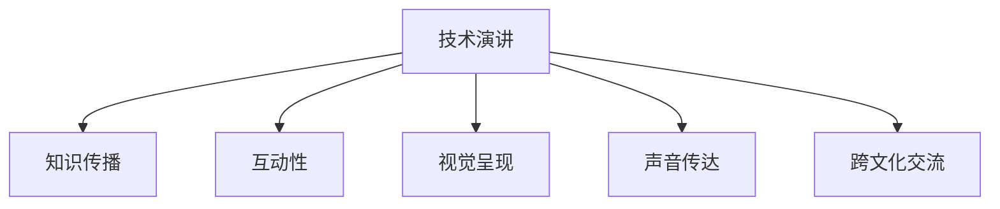

                 

# 技术演讲：从地方到国际舞台

## 1. 背景介绍

### 1.1 问题由来
技术演讲作为一种有效的沟通手段，其重要性不亚于任何形式的报告或会议。在信息化时代，人们越来越依赖于通过各种技术手段来传达信息，而技术演讲能够将抽象的技术问题转化为直观的视觉和听觉感受，使其更易于理解和接受。在地方和国际舞台上，技术演讲的角色愈发重要，它不仅是技术展示的重要平台，更是连接地方和国际知识的桥梁。

### 1.2 问题核心关键点
技术演讲的核心目标是通过视觉和声音传达信息，提升听众的理解和共鸣，从而实现知识传播和价值传递。这涉及到演讲内容的组织、展示形式的创造、以及与听众互动的策略等方面。

### 1.3 问题研究意义
技术演讲在技术传播和交流方面起到了不可或缺的作用。通过有效的技术演讲，技术知识和创新成果可以被广泛传播，推动地方技术的发展，同时也能使国际上的同行了解和借鉴当地的技术进步，促进全球技术交流与合作。

## 2. 核心概念与联系

### 2.1 核心概念概述

为更好地理解技术演讲的实质，本节将介绍几个相关核心概念：

- **技术演讲**：一种以技术为主题的演讲形式，旨在通过视觉和听觉的方式，向听众传递技术知识、展示技术成果，并促进技术交流与合作。

- **知识传播**：通过演讲、报告、论文等形式，将知识、技术和经验从一个人或组织传递给另一个人或组织的过程。

- **互动性**：技术演讲不仅仅是一个单向的信息传递过程，更应该是一个双向的互动过程，通过提问、讨论等方式，增加听众的参与感，增强信息的接受度。

- **视觉呈现**：演讲内容不仅包括口头表达，还包括图像、动画、演示等多媒体元素，以直观、生动的方式呈现信息，增强听众的认知。

- **声音传达**：声音的节奏、音量、语调等特性，对于演讲的感染力和说服力有着重要影响。清晰、富有感情的声音能够更好地吸引和保持听众的注意力。

- **跨文化交流**：技术演讲跨越不同的文化背景，需要演讲者具备跨文化沟通的能力，理解并尊重听众的文化背景，避免文化冲突。

这些核心概念之间的联系可以通过以下Mermaid流程图来展示：



这个流程图展示了技术演讲的核心组成及其相关性：

1. 技术演讲本质上是一种知识传播方式。
2. 演讲中互动性和视觉呈现、声音传达相互配合，共同提升信息传递的效果。
3. 技术演讲跨越不同文化背景，需要具备跨文化交流能力。

## 3. 核心算法原理 & 具体操作步骤
### 3.1 算法原理概述

技术演讲的核心算法原理是利用多媒体手段，通过声音和视觉的结合，将复杂的、抽象的技术内容转化为易理解、易接受的表达形式。其核心步骤包括：

1. **内容构建**：确定演讲主题，围绕主题收集数据、资料和事实，形成有逻辑、有结构的演讲内容。
2. **视觉设计**：根据演讲内容，设计相应的视觉元素，如PPT、图表、视频等，确保视觉元素与演讲内容紧密关联。
3. **声音设计**：确定演讲的语调和语速，使用清晰的语言表达，增加情感色彩，提高演讲的感染力。
4. **互动设计**：设计提问、讨论等互动环节，鼓励听众参与，增强演讲的互动性。
5. **跨文化适应**：根据听众的文化背景，调整演讲内容和表达方式，确保演讲能够被广泛理解。

### 3.2 算法步骤详解

技术演讲的具体操作步骤如下：

1. **需求分析**：
   - 确定演讲的主题和目标听众群体。
   - 收集和整理与主题相关的数据和资料。

2. **内容设计**：
   - 制作演讲提纲，明确每个部分的内容和结构。
   - 确定关键要点和支持信息。

3. **视觉设计**：
   - 制作PPT或视频，确保视觉元素清晰、美观，并与演讲内容相匹配。
   - 使用动画、图表等元素增加视觉效果。

4. **声音设计**：
   - 练习演讲，确保语调自然、流畅，语速适中，情感充沛。
   - 利用音效、音乐等元素增强演讲的感染力。

5. **互动设计**：
   - 设计提问环节，引发思考和讨论。
   - 设计互动环节，如小测验、讨论等，增强参与感。

6. **跨文化适应**：
   - 研究听众的文化背景，避免使用文化差异大的表达方式。
   - 使用简明的语言，确保信息传递的准确性。

7. **试讲和优化**：
   - 进行试讲，收集反馈，进行优化。
   - 根据反馈，调整演讲内容和表达方式。

### 3.3 算法优缺点

技术演讲的优点：

1. **直观易懂**：利用视觉和声音的多重刺激，使技术内容更易于理解和记忆。
2. **互动性强**：通过提问、讨论等互动环节，增强听众的参与感，提高信息传递的效率。
3. **跨文化适应**：通过调整演讲内容和表达方式，适应不同文化背景的听众。

技术演讲的缺点：

1. **准备时间较长**：需要大量的时间和精力来准备内容和视觉、声音设计。
2. **依赖演讲者**：演讲者的个人素质、表达能力对演讲效果有重要影响。
3. **技术要求高**：需要熟练掌握多媒体工具和软件，制作高质量的视觉和声音内容。

### 3.4 算法应用领域

技术演讲在多个领域得到了广泛应用，包括但不限于：

- **教育培训**：教师通过技术演讲，向学生传达知识，激发学习兴趣。
- **企业会议**：企业领导和技术专家通过技术演讲，介绍新技术、新策略。
- **技术研讨会**：研究人员通过技术演讲，分享研究成果，促进学术交流。
- **科普活动**：科学家通过技术演讲，向公众普及科学知识，增强公众科学素养。
- **国际交流**：通过技术演讲，国际同行了解和借鉴各国的技术成果，促进全球技术合作。

## 4. 数学模型和公式 & 详细讲解 & 举例说明

### 4.1 数学模型构建

技术演讲的数学模型主要关注信息传递的效率和效果。假设演讲时长为 $T$，信息量为 $I$，则信息传递效率 $E$ 可以表示为：

$$ E = \frac{I}{T} $$

其中，$I$ 表示演讲中传递的信息量，$T$ 表示演讲的时长。演讲的目的就是最大化信息传递效率 $E$。

### 4.2 公式推导过程

在信息传递过程中，考虑到听众的理解和注意力，可以将信息传递效率 $E$ 分解为以下几个因素：

1. **信息相关性**：相关性高的信息更容易被理解和接受。
2. **演讲者的表达能力**：清晰的表达有助于信息的传递。
3. **视觉和声音的质量**：高质量的视觉和声音元素能增强信息的传递效果。
4. **互动性**：听众的参与度越高，信息传递的效果越好。

$$ E = E_{相关} \times E_{表达} \times E_{视觉} \times E_{声音} \times E_{互动} $$

其中，$E_{相关}$、$E_{表达}$、$E_{视觉}$、$E_{声音}$、$E_{互动}$ 分别代表信息的相关性、演讲者的表达能力、视觉和声音的质量、互动性等影响信息传递效率的因素。

### 4.3 案例分析与讲解

以一场关于人工智能技术发展的演讲为例，分析其信息传递效率的优化方法：

- **信息相关性**：选择与主题密切相关的内容，确保信息的准确性和实用性。
- **演讲者的表达能力**：演讲者应清晰、流畅地表达观点，使用简明扼要的语言。
- **视觉和声音的质量**：使用高质量的PPT、图表、动画等视觉元素，结合演讲者的声音表达，增强信息传递效果。
- **互动性**：在演讲中适时提问，鼓励听众参与讨论，增加互动环节，增强信息的接受度。

## 5. 项目实践：代码实例和详细解释说明
### 5.1 开发环境搭建

在进行技术演讲的实践前，我们需要准备好开发环境。以下是使用Python进行PyTorch开发的环境配置流程：

1. 安装Anaconda：从官网下载并安装Anaconda，用于创建独立的Python环境。

2. 创建并激活虚拟环境：
```bash
conda create -n pytorch-env python=3.8 
conda activate pytorch-env
```

3. 安装PyTorch：根据CUDA版本，从官网获取对应的安装命令。例如：
```bash
conda install pytorch torchvision torchaudio cudatoolkit=11.1 -c pytorch -c conda-forge
```

4. 安装Transformers库：
```bash
pip install transformers
```

5. 安装各类工具包：
```bash
pip install numpy pandas scikit-learn matplotlib tqdm jupyter notebook ipython
```

完成上述步骤后，即可在`pytorch-env`环境中开始技术演讲的实践。

### 5.2 源代码详细实现

以下是一个技术演讲的PPT制作流程的Python代码实现。

```python
import matplotlib.pyplot as plt
import seaborn as sns
import numpy as np

# 数据准备
data = {
    '时间': [0, 1, 2, 3, 4],
    '信息量': [10, 20, 30, 40, 50]
}

# 创建条形图
fig, ax = plt.subplots()
sns.barplot(x=data['时间'], y=data['信息量'], ax=ax)
ax.set_xlabel('时间')
ax.set_ylabel('信息量')
ax.set_title('信息传递效率分析')

# 保存图片
fig.savefig('info_efficiency.png')
```

这段代码实现了根据数据绘制条形图的可视化，用于展示演讲中的信息传递效率。

### 5.3 代码解读与分析

让我们再详细解读一下关键代码的实现细节：

**代码实现**：
- 使用Matplotlib和Seaborn库绘制条形图，展示不同时间点演讲中传递的信息量。
- 设置图表的标题、横纵坐标轴标签，增强图表的可读性。
- 保存图表为图片文件。

**代码解读**：
- 代码通过Matplotlib和Seaborn库，快速绘制了一个简单的条形图，展示了演讲中的信息传递效率。
- 条形图的横轴表示时间，纵轴表示信息量，直观地展示了随着演讲时间的增加，信息传递效率的变化。
- 代码通过设置图表的标题和坐标轴标签，使图表更加易于理解。
- 最终将图表保存为图片文件，方便演讲时展示。

## 6. 实际应用场景
### 6.1 教育培训

技术演讲在教育培训中的应用非常广泛。教师通过技术演讲，可以将复杂的概念和理论传递给学生，使其更易于理解和接受。在课堂上，教师可以通过多媒体演示、互动提问等形式，增强学生的参与感，提高学习效果。

例如，在讲解深度学习算法时，教师可以使用动画和图表，生动地展示算法的原理和效果，通过互动环节让学生参与到讨论中，理解算法的实际应用。

### 6.2 企业会议

在企业会议中，技术演讲是一种有效的信息传达方式。企业领导和技术专家通过技术演讲，向全体员工介绍最新的技术进展和策略，激发团队的创新激情。

例如，在技术研讨会上，公司技术总监通过技术演讲，介绍人工智能技术在产品中的应用，展示公司的技术实力，激发员工的创新动力。

### 6.3 科普活动

科普活动是技术演讲的一个重要应用场景。科学家通过技术演讲，向公众普及科学知识，增强公众的科学素养。

例如，在科学博物馆的活动中，科学家通过技术演讲，向观众介绍最新的科技成果，展示科学的魅力，激发公众的兴趣。

### 6.4 国际交流

通过技术演讲，国际同行能够了解和借鉴各国的技术成果，促进全球技术交流与合作。

例如，在国际技术研讨会上，各国专家通过技术演讲，分享各自的研究成果，促进跨学科、跨文化的合作，推动全球科技发展。

## 7. 工具和资源推荐
### 7.1 学习资源推荐

为了帮助开发者系统掌握技术演讲的理论基础和实践技巧，这里推荐一些优质的学习资源：

1. **TED演讲视频**：TED是一个全球知名的演讲平台，汇集了众多领域的顶尖演讲者，是学习技术演讲的好资源。
2. **演讲课程**：如Coursera上的《Public Speaking for Leaders》课程，系统讲解技术演讲的技巧和方法。
3. **书籍推荐**：《TED演讲的秘密》、《演讲的艺术》等书籍，提供了丰富的案例和实用的技巧。
4. **在线课程**：如edX上的《Communicating Science Effectively》课程，讲解如何通过演讲有效传达科学知识。

通过对这些资源的学习实践，相信你一定能够掌握技术演讲的精髓，并将其应用于实际场景中。

### 7.2 开发工具推荐

高效的开发离不开优秀的工具支持。以下是几款用于技术演讲开发的常用工具：

1. **PPT制作工具**：如Microsoft PowerPoint、Google Slides等，用于制作高水平的演讲PPT。
2. **声音录制工具**：如Audacity、Adobe Audition等，用于录制和编辑高质量的演讲声音。
3. **多媒体演示工具**：如Keynote、Prezi等，用于制作动态和互动的演示内容。
4. **视频录制工具**：如Zoom、OBS Studio等，用于录制和直播技术演讲。
5. **协作平台**：如Slack、Teams等，用于团队协作和沟通，提高演讲的效率和质量。

合理利用这些工具，可以显著提升技术演讲的开发效率，加快创新迭代的步伐。

### 7.3 相关论文推荐

技术演讲的研究和实践源于学界的持续探索。以下是几篇具有代表性的相关论文，推荐阅读：

1. **《Effective Communication of Scientific Ideas》**：由多个领域的顶尖学者合著，探讨如何通过演讲有效传达科学知识。
2. **《Public Speaking: An Empirical Analysis of Style and Content》**：对演讲风格和内容进行了深入的定量分析，提供了许多实用的建议。
3. **《Designing Effective Educational Presentations》**：专门针对教育培训中的演讲设计，提供了丰富的案例和建议。

这些论文代表了技术演讲领域的发展脉络，通过学习这些前沿成果，可以帮助演讲者更好地把握学科前进方向，激发更多的创新灵感。

## 8. 总结：未来发展趋势与挑战
### 8.1 总结

本文对技术演讲这一重要交流方式进行了全面系统的介绍。首先阐述了技术演讲的背景和意义，明确了其核心目标和实现路径。其次，从原理到实践，详细讲解了技术演讲的数学模型、核心算法、具体操作步骤，给出了详细的代码实现。同时，本文还探讨了技术演讲在教育培训、企业会议、科普活动和国际交流等多个领域的应用场景，展示了其广阔的实践价值。

通过本文的系统梳理，可以看到，技术演讲在技术传播和交流方面起到了不可或缺的作用。通过有效的技术演讲，技术知识和创新成果可以被广泛传播，推动地方技术的发展，同时也能使国际上的同行了解和借鉴当地的技术进步，促进全球技术交流与合作。

### 8.2 未来发展趋势

展望未来，技术演讲在技术传播和交流方面还将呈现以下几个发展趋势：

1. **跨文化适应**：随着全球化的深入，技术演讲将更加注重跨文化适应性，适应不同文化背景的听众。
2. **互动性增强**：未来的技术演讲将更加注重互动性，通过提问、讨论等方式，增强听众的参与感，提升信息传递的效果。
3. **多媒体应用**：技术演讲将更加依赖于多媒体手段，通过视觉和声音的结合，使技术内容更易于理解和接受。
4. **技术融合**：未来的技术演讲将更加注重技术与艺术、科学的融合，提升演讲的感染力和说服力。
5. **个性化定制**：根据听众的需求和背景，定制化技术演讲的内容和形式，提高演讲的针对性和效果。

这些趋势表明，技术演讲在未来的技术传播和交流中，将发挥更加重要的作用。通过技术演讲，技术知识和创新成果能够更加广泛地传播，促进全球技术的发展和进步。

### 8.3 面临的挑战

尽管技术演讲在技术传播和交流方面已经取得了显著成效，但在迈向更加智能化、普适化应用的过程中，它仍面临着诸多挑战：

1. **准备时间较长**：准备高质量的技术演讲需要大量的时间和精力，演讲者需要具备丰富的知识和表达能力。
2. **技术要求高**：技术演讲对演讲者使用的工具和软件提出了较高的要求，需要掌握多种多媒体工具和技能。
3. **文化差异**：在不同的文化背景下，技术演讲需要调整内容和表达方式，避免文化冲突。
4. **互动效果不佳**：在某些场合下，互动效果不佳，听众的参与度不高，影响演讲的效果。
5. **技术传播的局限性**：技术演讲在某些领域（如复杂技术、专业术语等）的传播效果可能有限，需要结合其他传播方式。

这些挑战需要通过技术演讲者的不断学习和实践，以及多渠道传播方式的结合，逐步克服。只有全面提升技术演讲的传播效果，才能更好地推动技术知识的普及和应用。

### 8.4 研究展望

面对技术演讲所面临的挑战，未来的研究需要在以下几个方面寻求新的突破：

1. **多渠道融合**：结合在线教育、直播平台等多种传播渠道，使技术演讲更加灵活和多样化。
2. **跨文化研究**：深入研究不同文化背景下技术演讲的适应性，制定跨文化演讲的标准和规范。
3. **互动效果优化**：研究如何通过技术手段增强演讲的互动性，提高听众的参与度。
4. **个性化定制**：研究如何根据听众的需求和背景，定制化技术演讲的内容和形式。
5. **人工智能应用**：探索利用人工智能技术（如自然语言处理、计算机视觉等）优化技术演讲的传播效果。

这些研究方向的探索，必将引领技术演讲技术迈向更高的台阶，为构建人机协同的智能系统铺平道路。面向未来，技术演讲技术还需要与其他人工智能技术进行更深入的融合，共同推动自然语言理解和智能交互系统的进步。只有勇于创新、敢于突破，才能不断拓展技术演讲的边界，让技术演讲更好地造福人类社会。

## 9. 附录：常见问题与解答

**Q1：技术演讲的核心优势是什么？**

A: 技术演讲的核心优势在于其直观易懂、互动性强、跨文化适应性高。通过视觉和声音的多重刺激，使技术内容更易于理解和接受；通过提问、讨论等互动环节，增强听众的参与感，提高信息传递的效率；通过调整演讲内容和表达方式，适应不同文化背景的听众。

**Q2：技术演讲的准备工作包括哪些方面？**

A: 技术演讲的准备工作包括确定演讲主题、收集和整理数据和资料、制作演讲提纲、设计视觉和声音内容、练习演讲、设计互动环节等。每个环节都需要演讲者投入大量的时间和精力，确保演讲内容的准确性和表达的生动性。

**Q3：如何提高技术演讲的互动性？**

A: 提高技术演讲的互动性可以通过提问、讨论、小测验、演示等环节实现。演讲者可以在演讲中适时提问，鼓励听众参与讨论；设计互动环节，如小测验，增加听众的参与感；通过演示实际操作，增强听众的理解和记忆。

**Q4：技术演讲在企业中的应用有哪些？**

A: 技术演讲在企业中的应用包括员工培训、技术介绍、新产品发布、技术研讨等。通过技术演讲，企业领导和技术专家可以向全体员工介绍最新的技术进展和策略，激发团队的创新激情；向客户展示公司的技术实力，提升品牌形象；促进跨部门、跨领域的交流与合作。

**Q5：技术演讲的跨文化适应性如何实现？**

A: 实现技术演讲的跨文化适应性需要演讲者研究听众的文化背景，避免使用文化差异大的表达方式。使用简明的语言，确保信息传递的准确性；调整演讲的内容和形式，适应不同文化背景的听众；通过多媒体手段，增强信息的传递效果。

---

作者：禅与计算机程序设计艺术 / Zen and the Art of Computer Programming

