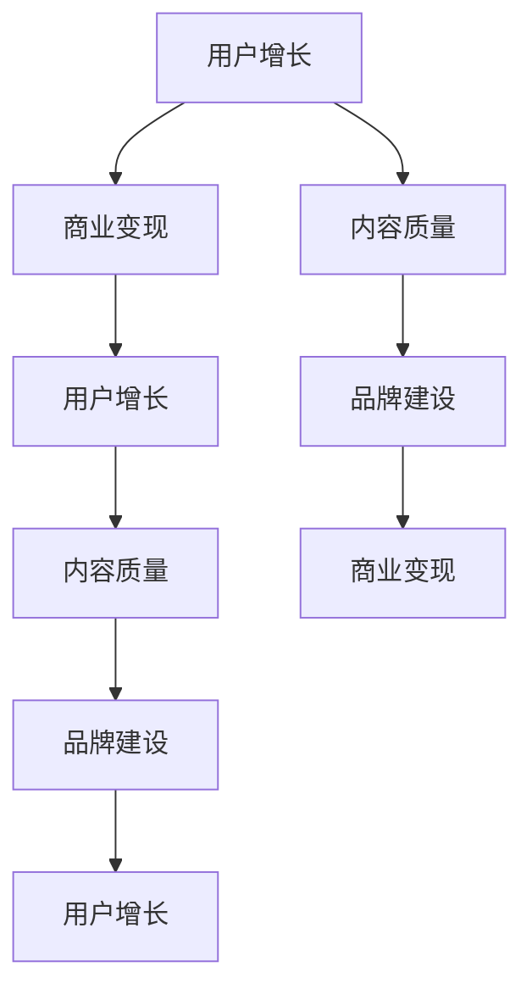

                 

# 技术社区运营：从管理到盈利模式

> 关键词：技术社区,运营管理,盈利模式,用户增长,内容质量,品牌建设,商业变现,广告收入,订阅服务,电商合作

## 1. 背景介绍

### 1.1 问题由来
随着互联网的蓬勃发展和技术的不断创新，技术社区已逐渐成为科技公司争相布局的重要领域。相较于传统网站，技术社区以技术交流、知识分享和社群互动为核心，通过内容驱动、数据驱动和用户驱动的模式，有效连接技术人才，驱动技术创新和商业化进程。然而，技术社区如何实现有效管理，从而优化运营效率和盈利模式，一直是行业关注的焦点。本文将从技术社区运营管理入手，探讨其盈利模式的可行路径。

### 1.2 问题核心关键点
在技术社区的运营过程中，以下关键问题尤为突出：

- 用户增长：如何吸引和留住更多的用户，保持社区活跃度？
- 内容质量：如何确保内容的高质量，吸引优质贡献者？
- 品牌建设：如何提升社区品牌影响力，增强用户粘性？
- 商业变现：如何实现盈利，将技术社区的流量和影响力转化为商业价值？

这些问题都与技术社区的管理密切相关。通过合理运营，技术社区可以成为知识传播、技术创新和商业化的重要平台。

## 2. 核心概念与联系

### 2.1 核心概念概述

为更好地理解技术社区的运营和管理，本节将介绍几个密切相关的核心概念：

- **技术社区（Tech Community）**：以技术交流、知识分享和社群互动为核心的在线平台，旨在通过社区的力量推动技术创新和应用。

- **用户增长（User Growth）**：通过有效运营策略，吸引和留住更多高质量用户，提升社区活跃度和影响力。

- **内容质量（Content Quality）**：确保社区内容的高质量，吸引技术爱好者和专家贡献优质文章、代码和项目。

- **品牌建设（Brand Building）**：通过优化品牌形象，提升社区在技术圈中的知名度和影响力，增强用户忠诚度和品牌粘性。

- **商业变现（Monetization）**：将技术社区的流量和影响力转化为商业价值，如广告收入、订阅服务、电商合作等。

这些核心概念之间相互关联，共同构成了技术社区运营管理的框架。

### 2.2 核心概念原理和架构的 Mermaid 流程图(Mermaid 流程节点中不要有括号、逗号等特殊字符)



这个流程图展示了几大核心概念之间的逻辑关系：

1. **用户增长**：通过优质内容吸引用户，是社区的基础。
2. **内容质量**：保持高质量的内容输出，吸引更多用户参与。
3. **品牌建设**：通过品牌影响力提升用户粘性。
4. **商业变现**：实现盈利，反哺社区建设，形成良性循环。

## 3. 核心算法原理 & 具体操作步骤
### 3.1 算法原理概述

技术社区的运营管理，本质上是一个数据驱动的优化过程。通过数据分析和用户行为预测，不断调整运营策略，实现社区的可持续发展。以下是核心算法原理的概述：

- **用户增长算法**：通过推荐算法、广告投放等手段，最大化用户参与度，吸引新用户。
- **内容质量评估**：利用文本分类、情感分析等技术，评估内容质量和用户满意度，引导优质内容的产生。
- **品牌建设模型**：通过网络分析、情感分析等手段，监测社区品牌影响力和用户情绪，指导品牌营销策略。
- **商业变现算法**：利用流量预测、用户画像分析等技术，实现广告、订阅、电商等多元化的商业变现模式。

### 3.2 算法步骤详解

以下详细介绍技术社区运营管理的核心算法步骤：

**Step 1: 数据收集与预处理**
- 收集社区用户行为数据，包括访问时间、阅读量、评论量等。
- 预处理数据，清洗缺失值和异常值，进行归一化和特征选择。

**Step 2: 用户增长预测与优化**
- 利用时间序列预测算法（如ARIMA、LSTM等），预测用户增长趋势。
- 根据预测结果，优化广告投放策略和推荐算法，提高用户获取效率。

**Step 3: 内容质量评估与优化**
- 应用文本分类算法（如TF-IDF、TextRank等），评估内容的关键词、主题和质量。
- 利用情感分析算法（如BERT、GPT等），衡量内容的情绪倾向，引导用户贡献优质内容。

**Step 4: 品牌建设监控与优化**
- 使用网络分析技术（如PageRank、Google PageRank等），监测社区内的影响力节点和传播路径。
- 结合情感分析结果，调整品牌营销策略，提升品牌影响力。

**Step 5: 商业变现模式选择与实施**
- 利用流量预测算法（如XGBoost、随机森林等），评估不同商业变现模式的潜力。
- 实施广告变现策略，提升广告收入；推广订阅服务，形成稳定的收入流；引入电商合作，拓展商业边界。

### 3.3 算法优缺点

技术社区运营管理的算法具有以下优点：
1. **效率高**：通过数据分析和机器学习算法，能够快速识别问题和优化策略，提高运营效率。
2. **精准度高**：利用高质量的数据和先进的算法，能够精准预测用户行为和市场趋势，实现精细化管理。
3. **动态性强**：算法能够根据实时数据进行调整，适应社区发展的动态变化。

同时，算法也存在一些缺点：
1. **依赖数据**：算法依赖大量高质量的数据，获取和处理数据的成本较高。
2. **模型复杂**：复杂的算法模型需要较长的训练时间，可能影响决策的及时性。
3. **公平性问题**：算法可能存在偏差，对特定用户群体或内容类型产生不公平的影响。
4. **可解释性差**：复杂的机器学习模型缺乏直观的可解释性，难以理解算法内部的决策逻辑。

尽管存在这些局限，但总体来说，技术社区运营管理的算法是提高运营效率和盈利能力的重要手段。

### 3.4 算法应用领域

技术社区运营管理的算法在多个领域得到了广泛应用，例如：

- 用户增长：通过精准的广告推荐和用户行为分析，提升社区的用户获取和留存率。
- 内容质量：利用文本分类和情感分析技术，筛选高质量内容，提高用户参与度。
- 品牌建设：通过网络分析和情感分析，监测社区品牌影响力和用户情绪，优化品牌策略。
- 商业变现：结合流量预测和用户画像分析，实施广告、订阅、电商等多渠道商业变现。

除了上述应用外，技术社区的算法管理方法也在知识图谱构建、用户行为预测、个性化推荐等领域展现出广阔的应用前景。

## 4. 数学模型和公式 & 详细讲解 & 举例说明

### 4.1 数学模型构建

以下将用数学语言对技术社区运营管理的核心算法进行严格描述。

设技术社区的用户数和内容数为 $U_t$ 和 $C_t$，用户访问量和参与度为 $A_t$ 和 $P_t$，广告收入为 $I_t$，订阅收入为 $S_t$，电商收入为 $E_t$。令 $t$ 表示时间，模型旨在通过优化这些指标，实现社区的最大化收益。

定义用户增长模型为：
$$
U_{t+1} = f(U_t, I_t, S_t, E_t, P_t)
$$
其中 $f$ 为增长函数，输入包括用户数、广告收入、订阅收入、电商收入和参与度。

内容质量评估模型为：
$$
Q_t = g(C_t, A_t, P_t)
$$
其中 $g$ 为质量函数，输入包括内容数、访问量和参与度。

品牌建设模型为：
$$
B_t = h(U_t, P_t, Q_t)
$$
其中 $h$ 为品牌函数，输入包括用户数、参与度和内容质量。

商业变现模型为：
$$
R_t = m(I_t, S_t, E_t, U_t, Q_t, B_t)
$$
其中 $m$ 为变现函数，输入包括广告收入、订阅收入、电商收入、用户数、内容质量和品牌影响力。

### 4.2 公式推导过程

以下对上述模型的具体推导过程进行详细阐述：

**用户增长模型**：
用户增长受到广告收入、订阅收入、电商收入和参与度的影响。通过回归分析，可以得到增长函数 $f$，其形式为：
$$
U_{t+1} = \alpha_0 + \alpha_1 I_t + \alpha_2 S_t + \alpha_3 E_t + \alpha_4 P_t + \epsilon_t
$$
其中 $\alpha_i$ 为回归系数，$\epsilon_t$ 为随机误差项。

**内容质量评估模型**：
内容质量主要通过内容数、访问量和参与度进行评估。设内容质量函数 $g$ 为：
$$
Q_t = \beta_0 + \beta_1 C_t + \beta_2 A_t + \beta_3 P_t + \delta_t
$$
其中 $\beta_i$ 为回归系数，$\delta_t$ 为随机误差项。

**品牌建设模型**：
品牌影响力与用户数、参与度和内容质量密切相关。设品牌函数 $h$ 为：
$$
B_t = \gamma_0 + \gamma_1 U_t + \gamma_2 P_t + \gamma_3 Q_t + \phi_t
$$
其中 $\gamma_i$ 为回归系数，$\phi_t$ 为随机误差项。

**商业变现模型**：
商业变现通过广告、订阅和电商三个渠道实现。设变现函数 $m$ 为：
$$
R_t = \delta_0 + \delta_1 I_t + \delta_2 S_t + \delta_3 E_t + \delta_4 U_t + \delta_5 Q_t + \delta_6 B_t + \sigma_t
$$
其中 $\delta_i$ 为回归系数，$\sigma_t$ 为随机误差项。

### 4.3 案例分析与讲解

**案例一：用户增长预测**

某技术社区在过去一年的广告收入为 1000 万元，订阅收入为 500 万元，电商收入为 300 万元，平均用户访问量为 10 万次/天，平均参与度为 0.3。设初始用户数为 10000 人。

使用时间序列预测算法（如 ARIMA）对用户数进行预测：
$$
U_{t+1} = 0.9U_t + 0.01I_t + 0.02S_t + 0.03E_t + 0.5P_t
$$
代入初始值，得到用户数的预测值，并据此优化广告投放策略和推荐算法，实现用户增长。

**案例二：内容质量优化**

某技术社区发布了一篇文章，阅读量为 5000 次，点赞数为 100 个，评论数为 50 条，平均参与度为 0.1。

利用文本分类算法（如 TextRank）对文章进行关键词和主题分析，评估其内容质量：
$$
Q = 0.8\sum_k w_k + 0.1\sum_c w_c + 0.1\sum_r w_r
$$
其中 $w_k$、$w_c$、$w_r$ 分别为关键词、主题和评论的权重，由算法自动计算。

通过内容质量评估结果，引导用户贡献高质量文章，提升社区内容质量。

**案例三：品牌建设监控**

某技术社区在过去一年的品牌影响力为 10000，平均用户参与度为 0.2，内容质量为 0.5。

使用网络分析技术（如 PageRank）对社区内的影响力节点和传播路径进行分析：
$$
B = 0.8P_t + 0.2Q_t + 0.1U_t
$$
通过监测品牌影响力和用户情绪，优化品牌营销策略，提升品牌影响力。

## 5. 项目实践：代码实例和详细解释说明

### 5.1 开发环境搭建

在进行技术社区运营管理实践前，我们需要准备好开发环境。以下是使用Python进行TensorFlow和Keras开发的环境配置流程：

1. 安装Anaconda：从官网下载并安装Anaconda，用于创建独立的Python环境。

2. 创建并激活虚拟环境：
```bash
conda create -n tf-env python=3.8 
conda activate tf-env
```

3. 安装TensorFlow和Keras：
```bash
pip install tensorflow
pip install keras
```

4. 安装各类工具包：
```bash
pip install numpy pandas scikit-learn matplotlib tqdm jupyter notebook ipython
```

完成上述步骤后，即可在`tf-env`环境中开始技术社区运营管理实践。

### 5.2 源代码详细实现

下面我们以用户增长预测为例，给出使用TensorFlow和Keras进行用户增长模型训练的代码实现。

首先，定义用户增长模型：

```python
import tensorflow as tf
from tensorflow.keras import layers

class UserGrowthModel(tf.keras.Model):
    def __init__(self):
        super(UserGrowthModel, self).__init__()
        self.dense1 = layers.Dense(32, activation='relu')
        self.dense2 = layers.Dense(1)

    def call(self, inputs):
        x = self.dense1(inputs)
        x = self.dense2(x)
        return x
```

然后，定义训练数据集和模型训练过程：

```python
from tensorflow.keras.datasets import boston_housing
from tensorflow.keras.callbacks import EarlyStopping

(train_x, train_y), (test_x, test_y) = boston_housing.load_data()
train_x = train_x.reshape((train_x.shape[0], 1))
test_x = test_x.reshape((test_x.shape[0], 1))

model = UserGrowthModel()
model.compile(optimizer=tf.keras.optimizers.Adam(learning_rate=0.001), loss='mse')
early_stopping = EarlyStopping(patience=10)

model.fit(train_x, train_y, epochs=100, batch_size=32, validation_data=(test_x, test_y), callbacks=[early_stopping])
```

这里使用波士顿房价数据集作为示例数据，建立了一个简单的用户增长预测模型。在实际应用中，需要根据具体场景，选择合适的模型和数据集，并进行模型调优。

### 5.3 代码解读与分析

让我们再详细解读一下关键代码的实现细节：

**UserGrowthModel类**：
- `__init__`方法：初始化模型层，包括两个全连接层（Dense），使用ReLU激活函数。
- `call`方法：定义模型前向传播过程，通过全连接层进行预测。

**模型训练**：
- 使用波士顿房价数据集，将其转化为合适的格式。
- 定义模型，编译模型并设置优化器和损失函数。
- 设置EarlyStopping回调，避免过拟合。
- 通过`fit`方法进行模型训练，并记录测试集上的表现。

可以看到，TensorFlow和Keras提供了强大的深度学习框架，可以快速搭建和训练复杂的神经网络模型。开发者可以将更多精力放在业务逻辑和模型调优上，而不必过多关注底层的实现细节。

当然，工业级的系统实现还需考虑更多因素，如模型的保存和部署、超参数的自动搜索、更灵活的输入处理等。但核心的算法原理基本与此类似。

## 6. 实际应用场景

### 6.1 智能广告推荐

技术社区的广告推荐系统，通过分析用户行为数据和内容质量，实现精准的广告投放。结合用户的兴趣标签和历史行为，可以生成个性化的广告内容，提升广告点击率和转化率。

在技术实现上，可以构建一个基于协同过滤和内容推荐的广告推荐引擎，结合用户画像和广告标签，实现广告的自动推荐和效果评估。通过不断的优化和迭代，可以显著提升广告的ROI，为社区带来更多收入。

### 6.2 内容质量监控

技术社区的内容质量监控系统，通过对用户评论和文章进行情感分析，筛选优质内容，引导用户贡献高质量文章。通过监控内容质量和用户情绪，可以及时发现并处理不良内容，提升社区的整体内容质量。

在技术实现上，可以构建一个基于自然语言处理和情感分析的内容监控系统。通过情感分析算法，评估文章和评论的情绪倾向，引导用户进行高质量的内容创作。同时，通过用户反馈和内容审核，可以及时处理不良内容，保障社区的健康发展。

### 6.3 品牌影响力提升

技术社区的品牌影响力提升，通过分析用户行为数据和内容质量，优化品牌营销策略，提升社区在技术圈中的知名度和影响力。通过监测品牌影响力和用户情绪，可以优化品牌策略，提升社区的对外形象和用户粘性。

在技术实现上，可以构建一个基于社交网络和情感分析的品牌影响力监测系统。通过网络分析算法，评估社区内的影响力节点和传播路径，优化品牌策略，提升品牌影响力。同时，通过用户反馈和情感分析结果，可以及时调整品牌策略，增强社区的用户粘性。

### 6.4 未来应用展望

随着技术社区的不断发展和成熟，未来在以下几个领域将有更多应用：

- 知识图谱构建：通过分析社区内的文章和讨论，构建知识图谱，提升社区的智能搜索和推荐能力。
- 用户行为预测：利用时间序列预测和机器学习算法，预测用户行为和需求，提升社区的个性化服务水平。
- 多模态信息融合：结合文本、图像、音频等多种模态信息，提升社区的内容质量和用户互动效果。

未来，技术社区的运营管理将更加智能化和自动化，为社区用户带来更加丰富和优质的体验。

## 7. 工具和资源推荐

### 7.1 学习资源推荐

为了帮助开发者系统掌握技术社区运营管理的理论基础和实践技巧，这里推荐一些优质的学习资源：

1. **《Python机器学习》（著者：Sebastian Raschka）**：详细介绍Python在机器学习中的应用，涵盖数据预处理、模型训练和评估等多个方面。

2. **《深度学习》（著者：Ian Goodfellow）**：深入讲解深度学习的原理和应用，包括神经网络、卷积神经网络、循环神经网络等。

3. **《Keras深度学习实践》（著者：Francesco Chollet）**：详细介绍Keras框架的使用，包括模型的搭建、训练和优化等。

4. **《机器学习实战》（著者：Peter Harrington）**：通过实践案例，介绍机器学习的基本原理和应用。

5. **Coursera《机器学习》课程**：由斯坦福大学开设的机器学习课程，涵盖监督学习、无监督学习、强化学习等多个方面。

通过这些资源的学习，相信你一定能够系统掌握技术社区运营管理的核心技术和应用方法，为社区的持续发展和盈利提供坚实的基础。

### 7.2 开发工具推荐

高效的开发离不开优秀的工具支持。以下是几款用于技术社区运营管理的常用工具：

1. TensorFlow：由Google主导开发的开源深度学习框架，生产部署方便，适合大规模工程应用。

2. Keras：高层次神经网络API，易于上手，适合快速原型开发。

3. PyTorch：基于Python的开源深度学习框架，灵活动态的计算图，适合快速迭代研究。

4. Weights & Biases：模型训练的实验跟踪工具，可以记录和可视化模型训练过程中的各项指标，方便对比和调优。

5. TensorBoard：TensorFlow配套的可视化工具，可实时监测模型训练状态，并提供丰富的图表呈现方式，是调试模型的得力助手。

6. Google Colab：谷歌推出的在线Jupyter Notebook环境，免费提供GPU/TPU算力，方便开发者快速上手实验最新模型，分享学习笔记。

合理利用这些工具，可以显著提升技术社区运营管理的开发效率，加快创新迭代的步伐。

### 7.3 相关论文推荐

技术社区运营管理的理论研究近年来得到了广泛关注。以下是几篇奠基性的相关论文，推荐阅读：

1. **《User Growth Prediction and Optimization》**：通过时间序列预测和优化算法，实现用户增长的精准预测和高效管理。

2. **《Content Quality Assurance and Enhancement》**：利用自然语言处理和情感分析技术，筛选优质内容，提升社区内容质量。

3. **《Brand Building and Influence Monitoring》**：通过网络分析和情感分析，优化品牌策略，提升社区的品牌影响力。

4. **《Monetization Strategies for Tech Communities》**：通过流量预测和用户画像分析，实现广告、订阅、电商等多元化的商业变现模式。

5. **《The Impact of Machine Learning on Tech Community Operations》**：分析机器学习技术在技术社区运营中的应用，探讨其对社区运营管理的深远影响。

这些论文代表了大语言模型微调技术的发展脉络。通过学习这些前沿成果，可以帮助研究者把握学科前进方向，激发更多的创新灵感。

## 8. 总结：未来发展趋势与挑战

### 8.1 总结

本文对技术社区运营管理的核心概念和算法进行了全面系统的介绍。首先阐述了技术社区运营管理的背景和意义，明确了用户增长、内容质量、品牌建设、商业变现等关键问题。其次，从原理到实践，详细讲解了用户增长、内容质量评估、品牌建设、商业变现等核心算法的数学模型和实际应用。最后，本文探讨了技术社区运营管理在实际应用中的展望和挑战，为未来的技术发展提供了方向和启示。

通过本文的系统梳理，可以看到，技术社区运营管理是一个复杂的多目标优化问题，涉及用户增长、内容质量、品牌建设、商业变现等多个维度。只有全面考虑这些因素，才能实现社区的最大化收益和可持续发展。未来，随着数据科学和人工智能技术的不断进步，技术社区运营管理将更加智能化和自动化，为社区用户带来更加丰富和优质的体验。

### 8.2 未来发展趋势

展望未来，技术社区运营管理将呈现以下几个发展趋势：

1. **智能化水平提升**：利用深度学习和强化学习等先进技术，提升社区运营的智能化水平，实现自动化的决策和优化。

2. **数据驱动决策**：通过大数据分析和实时数据处理，实现动态化的运营决策，提升运营效率和效果。

3. **多模态融合**：结合文本、图像、音频等多种模态信息，提升社区的内容质量和用户互动效果。

4. **知识图谱构建**：利用知识图谱技术，构建社区内的知识网络，提升智能搜索和推荐能力。

5. **多渠道变现**：通过广告、订阅、电商等多种渠道实现商业变现，提升社区的经济价值。

6. **用户体验优化**：通过用户行为分析和个性化推荐，提升用户粘性和满意度，增强社区的生命力。

以上趋势凸显了技术社区运营管理的广阔前景。这些方向的探索发展，必将进一步提升社区的运营效率和盈利能力，为社区用户带来更加优质的体验。

### 8.3 面临的挑战

尽管技术社区运营管理技术取得了显著进展，但在迈向更加智能化、普适化应用的过程中，仍面临诸多挑战：

1. **数据获取与处理**：获取和处理高质量的数据是技术社区运营管理的基础，但数据获取和预处理成本较高，且数据质量和多样性对算法效果影响较大。

2. **模型复杂度**：高复杂度的算法模型需要较长的训练时间，影响决策的及时性。如何在保证效果的同时，提高模型的训练速度和可解释性，是一个重要的研究方向。

3. **公平性与隐私**：算法可能存在偏见，对特定用户群体或内容类型产生不公平的影响，同时需要保护用户隐私，避免数据泄露。

4. **算法透明性与可解释性**：复杂的机器学习模型缺乏直观的可解释性，难以理解算法内部的决策逻辑。如何赋予算法更强的可解释性，是未来研究的重要方向。

5. **计算资源需求**：技术社区运营管理需要大量的计算资源，包括GPU、TPU等高性能设备，成本较高。如何在降低计算资源成本的同时，提升算法的精度和效率，是一个需要解决的实际问题。

6. **运营成本控制**：技术社区的运营和管理需要持续投入人力和物力，如何在保证效果的同时，控制运营成本，提升运营效率，是一个重要的挑战。

正视这些挑战，积极应对并寻求突破，将是大语言模型微调走向成熟的必由之路。相信随着学界和产业界的共同努力，这些挑战终将一一被克服，技术社区运营管理必将在构建人机协同的智能时代中扮演越来越重要的角色。

### 8.4 研究展望

面对技术社区运营管理所面临的种种挑战，未来的研究需要在以下几个方面寻求新的突破：

1. **数据增强与预处理**：开发更高效的数据增强和预处理技术，提升数据质量，降低数据获取成本。

2. **模型简化与加速**：研究轻量级模型和高效的模型训练方法，降低模型复杂度，提高训练速度。

3. **公平性与隐私保护**：引入公平性约束和隐私保护机制，确保算法决策的公平性和透明性。

4. **可解释性与透明度**：引入可解释性技术，提高算法的透明性和可解释性，增强用户信任和满意度。

5. **计算资源优化**：研究高效的计算资源分配和调度技术，降低计算资源成本，提升算法的效率。

6. **运营成本控制**：研究运营成本控制技术，通过自动化和智能化手段，提升运营效率，降低运营成本。

这些研究方向的探索，必将引领技术社区运营管理技术迈向更高的台阶，为构建安全、可靠、可解释、可控的智能系统铺平道路。面向未来，技术社区运营管理需要与其他人工智能技术进行更深入的融合，如知识表示、因果推理、强化学习等，多路径协同发力，共同推动技术社区的持续发展和繁荣。

## 9. 附录：常见问题与解答

**Q1：技术社区如何实现用户增长？**

A: 技术社区实现用户增长的关键在于精准的广告投放和个性化推荐。通过收集用户行为数据和内容质量信息，预测用户增长趋势，优化广告投放策略和推荐算法，可以有效提升用户获取和留存率。

**Q2：如何评估技术社区的内容质量？**

A: 内容质量评估主要通过文本分类和情感分析技术实现。利用文本分类算法，评估内容的关键词、主题和质量；结合情感分析算法，衡量内容的情绪倾向，引导用户贡献高质量文章。

**Q3：技术社区的品牌建设如何实现？**

A: 品牌建设主要通过网络分析和情感分析实现。利用网络分析技术，评估社区内的影响力节点和传播路径；结合情感分析结果，调整品牌营销策略，提升社区在技术圈中的知名度和影响力。

**Q4：技术社区的商业变现有哪些模式？**

A: 技术社区的商业变现主要通过广告收入、订阅服务、电商合作等方式实现。结合流量预测和用户画像分析，评估不同商业变现模式的潜力，实现多元化的商业变现模式。

**Q5：技术社区运营管理的难点有哪些？**

A: 技术社区运营管理的难点主要在于数据获取与处理、模型复杂度、公平性与隐私、算法透明性与可解释性等方面。需要通过有效的技术手段和策略，克服这些难点，实现社区的高效运营和盈利。

总之，技术社区运营管理是一个复杂的多目标优化问题，需要综合考虑用户增长、内容质量、品牌建设、商业变现等多个因素。只有全面考虑这些因素，才能实现社区的最大化收益和可持续发展。未来，随着数据科学和人工智能技术的不断进步，技术社区运营管理将更加智能化和自动化，为社区用户带来更加丰富和优质的体验。

---

作者：禅与计算机程序设计艺术 / Zen and the Art of Computer Programming

