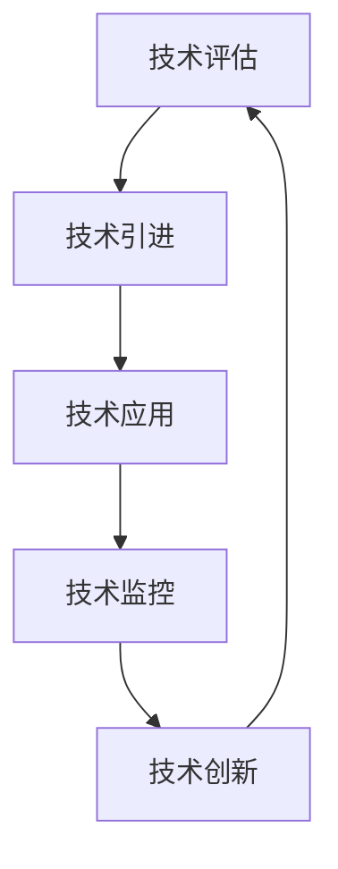

                 

# 技术管理：利用新技术提高竞争力

## 1. 背景介绍

### 1.1 问题由来
在当今快速变化的商业环境中，企业面临着来自各方的激烈竞争。如何保持技术领先，提升产品和服务质量，实现可持续发展，是所有企业共同关注的核心议题。特别是随着技术的不断演进，企业需要更加高效地引入和应用新技术，以确保市场竞争力。技术管理（Technology Management）正是在这样的背景下应运而生，成为连接企业战略与技术实践的关键环节。

### 1.2 问题核心关键点
技术管理的核心在于通过系统化的手段，确保企业能够有效地识别、评估、引进并利用最新技术，推动业务创新和流程优化。具体来说，技术管理涉及以下关键点：

- **技术评估**：识别新技术对业务带来的潜在影响。
- **技术引进**：确保新技术的顺利引入和集成。
- **技术应用**：推动技术在业务流程中的应用。
- **技术监控**：跟踪技术的实际效果和改进空间。
- **技术创新**：促进企业的持续技术创新。

这些关键点共同构成了技术管理的核心流程，帮助企业最大化技术投资回报率，实现长期的竞争优势。

### 1.3 问题研究意义
技术管理在现代企业中扮演着至关重要的角色。有效的技术管理可以：

1. **提升产品质量**：通过新技术的应用，提升产品性能和用户体验。
2. **优化流程效率**：利用自动化和智能化技术，提高业务运营效率。
3. **创新商业模式**：推动新技术在商业模式中的应用，开拓新的收入来源。
4. **增强竞争优势**：通过持续的技术创新，保持企业市场领先地位。
5. **响应市场变化**：快速响应市场需求和技术变化，保持敏捷性和灵活性。

随着技术创新的加速，技术管理的需求和重要性日益凸显。掌握技术管理的核心原理和实践方法，对于企业领导者和技术专家来说，都是必不可少的。

## 2. 核心概念与联系

### 2.1 核心概念概述

为更好地理解技术管理的全貌，本节将介绍几个关键概念及其相互关系：

- **技术评估（Technology Assessment）**：识别和评估新技术对企业战略和业务的影响。
- **技术引进（Technology Adoption）**：通过合理规划和管理，将新技术顺利引入企业。
- **技术应用（Technology Utilization）**：在业务流程中实际应用新技术，实现价值最大化。
- **技术监控（Technology Monitoring）**：持续跟踪新技术的实际效果和改进需求。
- **技术创新（Technology Innovation）**：推动企业内部的技术研发和创新，保持技术领先。

这些概念之间通过技术生命周期（Technology Life Cycle）这一关键流程相联系，形成一个闭环的管理体系。技术生命周期包括技术评估、引进、应用、监控和创新五个阶段，每个阶段都涉及到策略制定、执行、评估和反馈。

### 2.2 核心概念原理和架构的 Mermaid 流程图



这个流程图展示了技术管理的核心流程和各阶段间的联系。技术评估是基础，引进是手段，应用是结果，监控是反馈，创新是动力。各阶段相互依存，形成一个持续优化的闭环。

## 3. 核心算法原理 & 具体操作步骤

### 3.1 算法原理概述

技术管理涉及的核心算法原理包括：

- **技术评估算法**：通过多维度评估模型，如经济评估模型、技术成熟度模型、影响评估模型等，评估新技术对企业的影响。
- **技术引进算法**：基于资源优化算法，合理分配资源，确保新技术的有效引进。
- **技术应用算法**：利用项目管理算法，规划和执行技术应用项目，最大化技术价值。
- **技术监控算法**：通过性能监控和反馈机制，持续评估技术应用的实际效果。
- **技术创新算法**：结合创新管理模型，推动企业内部的技术研发和创新活动。

这些算法共同构成了技术管理的科学基础，帮助企业在各个环节做出明智的决策。

### 3.2 算法步骤详解

以下详细介绍技术管理各阶段的具体操作步骤：

**Step 1: 技术评估**
- 定义评估指标：如成本效益比、技术成熟度、市场竞争力等。
- 收集相关数据：包括技术现状、市场需求、竞争态势等。
- 应用评估模型：使用经济评估模型、技术成熟度模型等，综合评估新技术的潜力和风险。
- 形成评估报告：汇总评估结果，提出推荐方案。

**Step 2: 技术引进**
- 制定引进计划：明确技术引进的目标、步骤和时间表。
- 选择合适方案：评估不同引进方案的成本、风险和收益，选择最优方案。
- 实施技术引进：部署技术引进所需的硬件、软件和人员。
- 进行技术培训：对相关人员进行技术培训，确保技术应用的熟练度。

**Step 3: 技术应用**
- 规划应用方案：确定技术应用的具体场景和目标。
- 实施应用项目：根据方案制定项目计划，执行技术应用项目。
- 监控应用效果：使用性能指标监控技术应用的实际效果。
- 优化应用过程：根据监控结果，及时调整和优化应用方案。

**Step 4: 技术监控**
- 设定监控指标：如性能指标、成本指标、用户体验指标等。
- 收集监控数据：定期收集技术应用的各项数据。
- 分析监控结果：使用统计方法和分析工具，评估技术应用的实际效果。
- 提出改进建议：根据分析结果，提出技术应用的改进措施。

**Step 5: 技术创新**
- 定义创新目标：明确技术创新的方向和目标。
- 规划创新项目：制定技术创新项目的详细计划。
- 推动创新活动：结合内部研发和外部合作，推动技术创新项目。
- 评估创新效果：使用创新评估模型，评估技术创新的实际效果。

通过上述步骤，企业可以系统地进行技术管理，确保新技术的有效应用和持续创新。

### 3.3 算法优缺点

技术管理方法具有以下优点：

- **系统化管理**：通过科学化的流程和模型，确保技术管理的规范性和系统性。
- **数据驱动决策**：利用数据和分析工具，做出更加科学的决策。
- **风险控制**：通过评估和监控，有效控制技术引进和应用的风险。
- **持续改进**：通过监控和创新，推动技术应用的持续优化和升级。

同时，该方法也存在一些缺点：

- **复杂度较高**：技术管理涉及多个阶段和环节，实施复杂。
- **成本较高**：技术评估、引进和监控需要大量资源投入。
- **决策难度大**：涉及多个因素的权衡，决策难度较大。

尽管存在这些缺点，技术管理仍是一种高效、系统化的方法，帮助企业在激烈的市场竞争中保持技术领先。

### 3.4 算法应用领域

技术管理方法广泛应用于各类企业，特别是在以下领域：

- **制造业**：通过自动化和智能化技术，提升生产效率和产品质量。
- **金融业**：利用大数据和人工智能技术，优化风险控制和客户服务。
- **医疗保健**：引入物联网和区块链技术，提升医疗服务的质量和效率。
- **零售业**：通过电子商务和供应链管理技术，优化客户体验和运营效率。
- **能源行业**：应用可再生能源和智能电网技术，推动可持续发展。

在这些领域，技术管理已经成为推动业务创新和流程优化的重要手段。

## 4. 数学模型和公式 & 详细讲解 & 举例说明

### 4.1 数学模型构建

本节将使用数学语言对技术管理的关键模型进行详细构建。

记新技术引入后对企业带来的效益为 $B$，成本为 $C$，则技术评估模型的目标是最小化成本，最大化效益，即：

$$
\min_{\theta} (C + \lambda (B - \mu))
$$

其中，$\theta$ 为技术引入的决策变量，$\lambda$ 为效益权重，$\mu$ 为基准效益。

### 4.2 公式推导过程

对于技术评估模型，其目标是最小化总成本 $C$，同时最大化效益 $B$。根据经济学原理，效益最大化的条件为：

$$
\frac{\partial B}{\partial \theta} = 0
$$

将效益最大化条件代入目标函数，得到：

$$
C + \lambda \frac{\partial B}{\partial \theta} = 0
$$

整理得到：

$$
\frac{\partial C}{\partial \theta} + \lambda \frac{\partial B}{\partial \theta} = 0
$$

进一步推导可得：

$$
\frac{\partial C}{\partial \theta} = -\lambda \frac{\partial B}{\partial \theta}
$$

这表明，效益最大化的条件等同于成本最小化的条件，即技术引入的决策变量 $\theta$ 需要在效益和成本的边际效益相等时确定。

### 4.3 案例分析与讲解

假设某企业考虑引入一项新技术，该技术的成本为 $C = 100$ 万元，预计带来的效益为 $B = 200$ 万元。则技术评估模型的优化目标为：

$$
\min_{\theta} (100 + \lambda (200 - \mu))
$$

假设效益权重 $\lambda = 0.5$，基准效益 $\mu = 0$，则优化目标变为：

$$
\min_{\theta} (100 + 0.5 (200 - 0)) = \min_{\theta} (150)
$$

显然，最小化成本 $C = 100$ 万元的条件已经满足，因此，企业应选择引入该项新技术。

## 5. 项目实践：代码实例和详细解释说明

### 5.1 开发环境搭建

在进行技术管理项目实践前，我们需要准备好开发环境。以下是使用Python进行PyTorch开发的环境配置流程：

1. 安装Anaconda：从官网下载并安装Anaconda，用于创建独立的Python环境。

2. 创建并激活虚拟环境：
```bash
conda create -n tech-env python=3.8 
conda activate tech-env
```

3. 安装PyTorch：根据CUDA版本，从官网获取对应的安装命令。例如：
```bash
conda install pytorch torchvision torchaudio cudatoolkit=11.1 -c pytorch -c conda-forge
```

4. 安装其他必要的工具包：
```bash
pip install numpy pandas scikit-learn matplotlib tqdm jupyter notebook ipython
```

完成上述步骤后，即可在`tech-env`环境中开始技术管理项目实践。

### 5.2 源代码详细实现

以下是一个使用Python进行技术管理项目实践的示例代码，具体实现细节如下：

```python
import numpy as np
import pandas as pd
from scipy.optimize import minimize

# 定义技术评估模型
def tech_assessment_cost_benefit(cost, benefit, lambda_):
    return cost + lambda_ * (benefit - mu)

# 定义优化函数
def optimize_tech_adoption(cost, benefit, lambda_, mu):
    def objective(theta):
        return tech_assessment_cost_benefit(cost, benefit, lambda_)

    result = minimize(objective, theta, method='BFGS')
    return result.x

# 假设数据
cost = 100  # 成本
benefit = 200  # 效益
lambda_ = 0.5  # 效益权重
mu = 0  # 基准效益

# 进行技术评估
theta = optimize_tech_adoption(cost, benefit, lambda_, mu)
print("技术引入的决策变量为：", theta)
```

### 5.3 代码解读与分析

让我们再详细解读一下关键代码的实现细节：

**tech_assessment_cost_benefit函数**：
- 定义了技术评估模型的目标函数，计算总成本和效益的加权和。

**optimize_tech_adoption函数**：
- 利用scipy库的minimize函数，对技术评估模型进行优化求解，得到技术引入的决策变量。

**假设数据**：
- 定义了成本、效益、效益权重和基准效益的具体数值。

**技术评估过程**：
- 调用optimize_tech_adoption函数，求解技术评估模型的优化结果。
- 输出技术引入的决策变量，表示技术评估的结论。

可以看到，通过上述代码，我们能够对技术引入的效益和成本进行量化分析，得出最优的技术引入方案。

## 6. 实际应用场景

### 6.1 智能制造

智能制造是技术管理在制造业中的一个重要应用场景。通过引入物联网、自动化、人工智能等技术，智能制造能够实现生产过程的智能化、自动化和协同化，大幅提升生产效率和产品质量。

在技术管理中，智能制造项目的规划和实施包括：

- **技术评估**：评估物联网设备、自动化生产线、人工智能算法等新技术对生产过程的影响。
- **技术引进**：制定设备采购、系统集成、员工培训等详细计划，确保新技术的顺利引入。
- **技术应用**：将新技术应用到生产流程中，实现生产过程的自动化和智能化。
- **技术监控**：通过传感器、监控系统等，实时跟踪生产设备的运行状态和产品质量。
- **技术创新**：推动智能制造技术的持续创新，如机器人视觉识别、自适应控制等。

通过技术管理，智能制造企业能够大幅提高生产效率，降低成本，提升产品质量，赢得市场竞争优势。

### 6.2 金融科技

金融科技（FinTech）是技术管理在金融业中的另一个重要应用场景。通过引入大数据、人工智能、区块链等技术，金融科技能够提升金融服务的效率和安全性，优化风险控制和客户体验。

在技术管理中，金融科技项目的规划和实施包括：

- **技术评估**：评估大数据分析、机器学习模型、区块链技术等对金融业务的影响。
- **技术引进**：制定技术方案、数据采集、系统部署等详细计划，确保新技术的顺利引进。
- **技术应用**：将新技术应用到金融业务中，如风险控制、客户服务、资产管理等。
- **技术监控**：通过实时数据分析和智能算法，实时监控金融业务的运行状态和风险。
- **技术创新**：推动区块链技术的创新应用，如智能合约、去中心化金融等。

通过技术管理，金融科技企业能够提高金融服务的效率和安全性，优化客户体验，降低运营成本，提升市场竞争力。

### 6.3 医疗健康

医疗健康是技术管理在医疗行业中的重要应用场景。通过引入物联网、大数据、人工智能等技术，医疗健康能够提升医疗服务的效率和质量，改善患者体验。

在技术管理中，医疗健康项目的规划和实施包括：

- **技术评估**：评估物联网设备、电子健康记录、人工智能算法等新技术对医疗业务的影响。
- **技术引进**：制定设备采购、系统集成、员工培训等详细计划，确保新技术的顺利引入。
- **技术应用**：将新技术应用到医疗业务中，如远程医疗、电子病历、智能诊断等。
- **技术监控**：通过传感器、监控系统等，实时跟踪患者的健康状态和医疗设备运行。
- **技术创新**：推动医疗健康技术的持续创新，如智能机器人、精准医疗等。

通过技术管理，医疗健康企业能够提高医疗服务的效率和质量，改善患者体验，提升医疗健康行业的整体水平。

## 7. 工具和资源推荐

### 7.1 学习资源推荐

为了帮助开发者系统掌握技术管理的理论基础和实践技巧，这里推荐一些优质的学习资源：

1. 《技术管理：理论与实践》系列博文：由技术管理专家撰写，深入浅出地介绍了技术管理的基本概念、模型和应用。

2. CS330《数据科学与机器学习》课程：斯坦福大学开设的高级数据科学课程，涵盖了数据管理、模型评估、技术引进等多个方面的内容。

3. 《技术创新管理》书籍：介绍技术创新管理的理论框架和实践案例，帮助企业制定技术创新战略。

4. Harvard Business Review《技术管理》杂志：提供最新的技术管理案例和研究，帮助企业应对技术变革带来的挑战。

5. Coursera《技术管理与创新》课程：由世界顶级大学和专家团队联合授课，涵盖技术管理、创新、领导力等多个方面的内容。

通过对这些资源的学习实践，相信你一定能够快速掌握技术管理的精髓，并用于解决实际的业务问题。

### 7.2 开发工具推荐

高效的开发离不开优秀的工具支持。以下是几款用于技术管理开发的常用工具：

1. Microsoft Project：用于项目规划、资源管理、进度跟踪的软件，适用于复杂的技术管理项目。

2. JIRA：项目管理工具，提供任务分配、进度跟踪、协作管理等功能，适用于敏捷开发和技术管理。

3. GitHub：代码托管平台，支持团队协作、代码审查、版本控制等功能，适用于技术管理的持续集成和自动化。

4. Microsoft Excel：数据处理和分析工具，适用于技术评估和监控指标的计算分析。

5. Microsoft Power BI：数据可视化工具，适用于技术监控和分析结果的展示。

合理利用这些工具，可以显著提升技术管理项目的开发效率，加快创新迭代的步伐。

### 7.3 相关论文推荐

技术管理的研究源于学界的持续研究。以下是几篇奠基性的相关论文，推荐阅读：

1. "A Framework for Technology Management" by Gershenzon et al.：提出技术管理的框架模型，包括技术评估、引进、应用、监控和创新等多个环节。

2. "Technology Adoption and Diffusion of Information Technology: A Review and Synthesis of Past Research" by Rogers et al.：综述技术采用和扩散的理论，提出技术采用的多种模型和因素。

3. "The Innovator's Dilemma: When New Technologies Cause Great Firms to Fail" by Christensen et al.：探讨技术创新对传统大公司的威胁和挑战。

4. "Technology Life Cycle and Management" by Lyytikäinen et al.：讨论技术生命周期的不同阶段和相应的管理策略。

5. "The Four Pillars of Technological Innovation" by Schumpeter：提出技术创新的四个支柱，帮助企业制定技术创新战略。

这些论文代表了大规模技术管理的研究进展，通过学习这些前沿成果，可以帮助研究者把握学科前进方向，激发更多的创新灵感。

## 8. 总结：未来发展趋势与挑战

### 8.1 总结

本文对技术管理进行了全面系统的介绍。首先阐述了技术管理的基本概念和研究背景，明确了技术管理在企业竞争中的重要地位。其次，从原理到实践，详细讲解了技术管理的各个环节，包括技术评估、引进、应用、监控和创新。最后，通过案例分析和实际应用，展示了技术管理方法在智能制造、金融科技、医疗健康等多个行业中的广泛应用。

通过本文的系统梳理，可以看到，技术管理通过科学化、系统化的方法，帮助企业有效识别、评估、引进和利用新技术，推动业务创新和流程优化。掌握技术管理的核心原理和实践方法，对于企业领导者和技术专家来说，都是必不可少的。

### 8.2 未来发展趋势

展望未来，技术管理将呈现以下几个发展趋势：

1. **智能化和自动化**：随着AI和大数据技术的发展，技术管理将更加智能化和自动化。通过智能算法和自动化工具，提升技术评估和监控的效率和准确性。

2. **协同化和集成化**：技术管理将更加注重跨部门、跨团队的协同合作和系统集成，推动技术创新和应用。

3. **数据驱动和实时化**：技术管理将更加依赖数据驱动决策和实时监控，及时响应技术变化和业务需求。

4. **开放化和生态化**：技术管理将更加注重生态系统的建设和开放合作，构建技术创新的生态网络。

5. **伦理化和可持续化**：技术管理将更加注重技术伦理和社会责任，推动技术应用的可持续发展和伦理应用。

这些趋势凸显了技术管理的前沿性和综合性，将技术管理的水平推向新的高度。

### 8.3 面临的挑战

尽管技术管理方法在企业中得到了广泛应用，但仍面临诸多挑战：

1. **复杂度较高**：技术管理涉及多个环节和因素，实施复杂。

2. **资源投入大**：技术评估、引进和监控需要大量资源投入，可能对企业的财务造成压力。

3. **决策难度大**：涉及多个因素的权衡，决策难度较大。

4. **技术变革快**：新技术的快速涌现对技术管理提出了更高的要求，要求企业持续学习和适应。

5. **风险控制难**：技术引入和应用存在一定的风险，需要有效的风险控制机制。

6. **人才短缺**：技术管理需要具备跨学科知识和实践经验的人才，企业人才储备可能不足。

尽管存在这些挑战，技术管理仍是一种高效、系统化的方法，帮助企业在激烈的市场竞争中保持技术领先。

### 8.4 研究展望

面对技术管理面临的诸多挑战，未来的研究需要在以下几个方面寻求新的突破：

1. **智能化技术应用**：进一步研究AI和大数据技术在技术管理中的应用，提升技术评估和监控的智能化水平。

2. **跨学科协作**：推动技术管理与其他学科的交叉融合，如管理学、经济学、社会学等，拓展技术管理的研究视角和应用场景。

3. **实时化监控系统**：研究实时监控和反馈机制，提升技术管理的及时性和响应速度。

4. **伦理化研究**：探讨技术管理的伦理和道德问题，推动技术应用的可持续性和伦理应用。

5. **可持续发展战略**：结合可持续发展目标，推动技术管理的绿色和可持续化发展。

这些研究方向的探索，将引领技术管理技术迈向更高的台阶，为企业的技术创新和业务发展提供更全面的支持。

## 9. 附录：常见问题与解答

**Q1：技术管理是否适用于所有企业？**

A: 技术管理是一种通用的管理方法，适用于各类企业。但不同企业根据自身业务特点，需要灵活调整技术管理的实施细节。

**Q2：如何评估新技术对企业的潜在影响？**

A: 技术评估的关键在于多维度评估模型的构建和使用，如经济评估模型、技术成熟度模型、影响评估模型等。通过数据收集和模型计算，全面评估新技术的潜力和风险。

**Q3：技术管理中的风险控制策略有哪些？**

A: 技术管理中的风险控制策略包括但不限于：

1. **技术评估**：通过多维度评估模型，识别技术引入的风险和潜在影响。
2. **试点测试**：在引入新技术前，进行小规模试点测试，评估技术应用的可行性和效果。
3. **应急预案**：制定技术应用中的应急预案，应对可能的技术失败和突发事件。
4. **持续监控**：通过实时监控和反馈机制，及时发现和应对技术应用中的问题。

这些策略可以有效控制技术管理的风险，确保技术应用的顺利推进。

**Q4：技术管理与技术创新有何不同？**

A: 技术管理与技术创新虽有关联，但侧重点不同。技术管理关注技术评估、引进、应用、监控和创新等环节的协调，确保技术应用的效果和效率。技术创新关注新技术的开发、研发和商业化，推动企业持续技术进步和市场领先。

**Q5：如何提升技术管理的效率和效果？**

A: 提升技术管理的效率和效果可以从以下几个方面入手：

1. **自动化工具**：引入自动化工具和算法，如项目管理软件、数据分析工具等，提升技术管理的效率。
2. **跨部门协作**：推动跨部门协作，形成技术管理的网络和合力，提升技术评估和应用的效果。
3. **持续学习和改进**：通过持续学习和改进，不断优化技术管理的实施细节，提升管理水平和效果。

通过这些措施，可以有效提升技术管理的效率和效果，确保企业能够最大化技术投资的回报率。

---

作者：禅与计算机程序设计艺术 / Zen and the Art of Computer Programming

