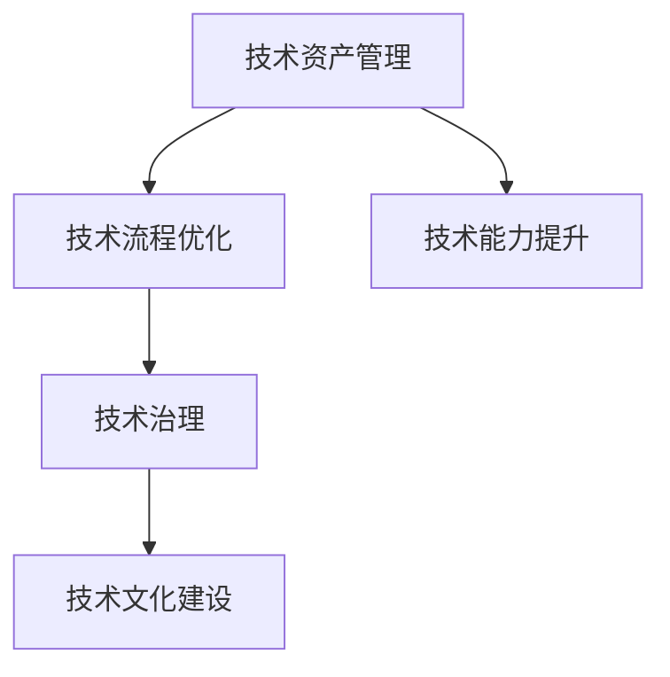

                 

# 技术管理：在数字化时代保持竞争力

在快速发展的数字化时代，技术管理已成为企业在竞争中获胜的关键因素。本文将深入探讨技术管理的核心概念、实践技巧以及未来趋势，帮助读者构建一个高效、灵活的技术管理框架，以在激烈的市场竞争中保持领先地位。

## 1. 背景介绍

### 1.1 问题由来

随着科技的不断进步，企业面临的技术环境越来越复杂，如何有效地管理技术资产、优化技术流程、提升技术能力，成为了企业需要解决的重要问题。技术管理的核心在于通过系统化的方法和工具，确保技术创新能够顺利落地，实现业务价值的最大化。

### 1.2 问题核心关键点

技术管理的关键在于以下三个方面：
1. **技术资产管理**：确保技术资源的有效利用，避免重复投资和技术债务。
2. **技术流程优化**：通过引入先进的开发方法和工具，提升开发效率和质量。
3. **技术能力提升**：通过持续学习和培训，提升团队的技术水平和创新能力。

## 2. 核心概念与联系

### 2.1 核心概念概述

技术管理涉及多个核心概念，这些概念之间相互关联，共同构成了技术管理的框架。

- **技术资产管理**：指对技术资源（如代码库、文档、架构设计等）进行管理和维护，确保技术资产的可用性和可追溯性。
- **技术流程优化**：通过敏捷开发、持续集成、持续交付等方法，提升开发和交付效率。
- **技术能力提升**：通过技术培训、技术分享、技术社区建设等手段，提升团队的技术水平和创新能力。
- **技术治理**：通过制定技术规范、评估技术风险、管理技术债务等措施，确保技术管理的规范性和可持续性。
- **技术文化建设**：通过营造开放、协作、创新的技术文化，促进技术的持续发展和应用。

这些概念之间的逻辑关系可以通过以下Mermaid流程图来展示：



这个流程图展示技术管理的主要流程：通过管理技术资产，优化技术流程，提升技术能力，建立技术治理，构建技术文化，形成一个闭环的、持续改进的技术管理框架。

## 3. 核心算法原理 & 具体操作步骤

### 3.1 算法原理概述

技术管理的核心算法原理主要包括技术资产管理、流程优化、能力提升、治理和技术文化建设。这些原理和方法相互交织，共同构成了技术管理的核心框架。

### 3.2 算法步骤详解

技术管理的步骤大致如下：

1. **技术资产管理**：
   - 构建技术资产清单：列出所有技术资源，如代码库、文档、架构设计等。
   - 资产分类和标记：对技术资产进行分类和标记，如开发环境、测试环境、生产环境等。
   - 资产维护和更新：定期检查和更新技术资产，确保其有效性和安全性。

2. **技术流程优化**：
   - 引入敏捷开发：采用Scrum、Kanban等敏捷方法，提高开发效率和响应速度。
   - 持续集成与交付：使用CI/CD工具，自动化构建、测试和部署流程。
   - 代码审查和自动化测试：实施代码审查和自动化测试，确保代码质量。

3. **技术能力提升**：
   - 技术培训和认证：为团队成员提供技术培训和认证，提升技术水平。
   - 技术分享和知识库：通过技术分享会和知识库，促进知识传递和积累。
   - 技术社区建设：建立技术社区，鼓励技术交流和创新。

4. **技术治理**：
   - 制定技术规范和标准：制定技术规范和标准，确保技术的一致性和可扩展性。
   - 评估技术风险和债务：定期评估技术风险和债务，制定应对策略。
   - 管理技术债务：通过重构、优化等方式，管理技术债务，提升系统性能和可维护性。

5. **技术文化建设**：
   - 营造开放和协作的文化：鼓励团队成员分享知识和经验，促进协作。
   - 建立创新机制：设立创新激励机制，鼓励技术创新和应用。
   - 技术领导力培养：培养技术领导力，推动技术发展和管理。

### 3.3 算法优缺点

技术管理的优点包括：
1. **提高开发效率**：通过优化技术流程，提升开发和交付速度。
2. **提升代码质量**：通过持续集成和自动化测试，确保代码质量。
3. **降低技术债务**：通过技术债务管理，减少系统维护成本。
4. **促进团队协作**：通过技术分享和技术社区，提升团队协作效率。
5. **培养技术领导力**：通过技术领导力培养，推动技术发展。

技术管理也存在一些缺点：
1. **初始投入大**：技术管理需要初始投入大量的资源和精力，如建立知识库、制定规范等。
2. **管理复杂**：技术管理涉及多个方面，管理复杂度较高。
3. **文化变革难**：改变团队文化和习惯需要时间和耐心。

## 4. 数学模型和公式 & 详细讲解

### 4.1 数学模型构建

技术管理的数学模型可以简化为以下公式：

$$
\text{技术管理} = \text{技术资产管理} + \text{技术流程优化} + \text{技术能力提升} + \text{技术治理} + \text{技术文化建设}
$$

其中，技术资产管理、技术流程优化、技术能力提升、技术治理和技术文化建设是五个主要组成部分，各自有其数学模型和公式。

### 4.2 公式推导过程

以技术流程优化为例，其公式可以表示为：

$$
\text{技术流程优化} = \frac{\text{敏捷开发} \times \text{持续集成} \times \text{自动化测试}}{\text{技术债务}}
$$

其中，敏捷开发、持续集成和自动化测试是提升开发效率和质量的关键因素，技术债务是降低开发效率和质量的负面因素。

### 4.3 案例分析与讲解

以Google为例，Google通过技术管理和优化，实现了高效的项目管理和快速迭代。Google引入了敏捷开发、持续集成和自动化测试，通过CI/CD工具，实现了快速部署和反馈。同时，Google建立了技术社区，通过技术分享和知识库，促进了技术知识的积累和传播。

## 5. 项目实践：代码实例和详细解释说明

### 5.1 开发环境搭建

开发环境搭建是技术管理的第一步，主要包括以下步骤：

1. **选择合适的开发工具**：选择如JIRA、Confluence、GitLab等开发工具，搭建技术管理和开发平台。
2. **配置开发环境**：配置开发环境，如安装Python、Docker等。
3. **搭建版本控制系统**：搭建版本控制系统，如Git，进行代码管理。

### 5.2 源代码详细实现

以下是技术资产管理的代码实现：

```python
from typing import List

class TechAsset:
    def __init__(self, name: str, version: str, owner: str):
        self.name = name
        self.version = version
        self.owner = owner

class TechAssetManager:
    def __init__(self):
        self.assets = []

    def add_asset(self, asset: TechAsset):
        self.assets.append(asset)

    def list_assets(self) -> List[TechAsset]:
        return self.assets
```

### 5.3 代码解读与分析

通过上述代码，可以清晰地看到技术资产管理的基本实现逻辑。技术资产管理模块定义了`TechAsset`类和`TechAssetManager`类，分别表示技术资产和资产管理。`TechAsset`类包含资产的名称、版本和所有者信息，`TechAssetManager`类负责添加和管理技术资产。

### 5.4 运行结果展示

通过上述代码，可以管理多个技术资产，并随时查看和更新资产列表，实现对技术资产的有效管理。

## 6. 实际应用场景

### 6.1 智能制造

技术管理在智能制造中的应用，通过优化生产流程，提升生产效率和质量。通过引入敏捷开发、持续集成和自动化测试，实现快速响应市场需求。同时，通过技术社区和知识库，促进技术知识传播和创新。

### 6.2 医疗健康

技术管理在医疗健康中的应用，通过优化医疗流程，提升医疗服务质量。通过引入电子健康记录系统，实现数据共享和协同医疗。同时，通过技术培训和社区建设，提升医疗团队的技术水平和创新能力。

### 6.3 金融科技

技术管理在金融科技中的应用，通过优化金融流程，提升金融服务效率和安全性。通过引入区块链、智能合约等新技术，实现金融服务创新。同时，通过技术培训和知识库，提升金融团队的技术水平和创新能力。

## 7. 工具和资源推荐

### 7.1 学习资源推荐

1. **《精益软件开发：消除浪费，提升效率》**：本书介绍了敏捷开发、持续集成、持续交付等方法，帮助企业提升开发效率和质量。
2. **《代码大全》**：本书介绍了代码审查、自动化测试等最佳实践，提升代码质量和可维护性。
3. **《技术领导力》**：本书介绍了技术领导力的培养和管理方法，帮助企业建立强大的技术团队。
4. **《Google工程文化》**：本书介绍了Google的技术管理和文化建设，提供了一流的实践经验。

### 7.2 开发工具推荐

1. **JIRA**：项目管理工具，帮助企业高效管理项目和任务。
2. **Confluence**：知识管理工具，帮助企业积累和分享技术知识。
3. **GitLab**：代码管理和版本控制系统，帮助企业管理代码库和构建CI/CD流程。
4. **CI/CD工具**：如Jenkins、Travis CI等，帮助企业自动化构建、测试和部署。

### 7.3 相关论文推荐

1. **《敏捷开发的实践》**：介绍了敏捷开发的最佳实践，帮助企业提升开发效率和质量。
2. **《持续集成和持续交付：构建高质量软件》**：介绍了持续集成和持续交付的实践方法，提升软件开发质量。
3. **《技术债务管理》**：介绍了技术债务的识别和管理方法，帮助企业降低技术债务。

## 8. 总结：未来发展趋势与挑战

### 8.1 研究成果总结

技术管理在数字化时代已取得重要进展，主要体现在以下几个方面：
1. **敏捷开发的普及**：敏捷开发方法已广泛应用于软件开发，提升了开发效率和质量。
2. **持续集成和持续交付的推广**：持续集成和持续交付已成为了企业标准流程，提升了软件交付速度和稳定性。
3. **技术社区的建设**：技术社区已成为企业技术知识共享的重要平台，促进了技术创新和传播。

### 8.2 未来发展趋势

未来技术管理的趋势包括：
1. **自动化和智能化**：通过引入AI和大数据技术，自动化技术管理流程，提升管理效率和决策水平。
2. **多部门协同**：技术管理将覆盖更多部门，实现跨部门协作和知识共享。
3. **持续学习与改进**：通过持续学习和改进，提升技术管理水平和效果。

### 8.3 面临的挑战

技术管理面临的主要挑战包括：
1. **技术复杂性**：技术管理的复杂度越来越高，需要更多专业知识和技能。
2. **文化变革**：改变团队文化和习惯需要时间和耐心，需要持续推动。
3. **技术债务**：技术债务管理需要持续投入资源，需要建立长效机制。

### 8.4 研究展望

未来技术管理的研究方向包括：
1. **自动化和智能化**：通过引入AI和大数据技术，自动化技术管理流程，提升管理效率和决策水平。
2. **多部门协同**：技术管理将覆盖更多部门，实现跨部门协作和知识共享。
3. **持续学习与改进**：通过持续学习和改进，提升技术管理水平和效果。

## 9. 附录：常见问题与解答

**Q1：什么是技术资产管理？**

A: 技术资产管理是对企业的技术资源（如代码库、文档、架构设计等）进行管理和维护，确保技术资产的可用性和可追溯性。

**Q2：如何进行敏捷开发？**

A: 敏捷开发是一种快速响应需求变化的软件开发方法，主要通过Scrum、Kanban等框架实现，提升开发效率和质量。

**Q3：如何实现持续集成和持续交付？**

A: 持续集成和持续交付是通过CI/CD工具，自动化构建、测试和部署流程，提升软件交付速度和稳定性。

**Q4：如何降低技术债务？**

A: 技术债务管理是通过重构、优化等方式，减少系统维护成本，提升系统性能和可维护性。

**Q5：如何建立技术文化？**

A: 建立技术文化需要营造开放和协作的文化，鼓励团队成员分享知识和经验，建立创新机制，培养技术领导力。

---

作者：禅与计算机程序设计艺术 / Zen and the Art of Computer Programming

