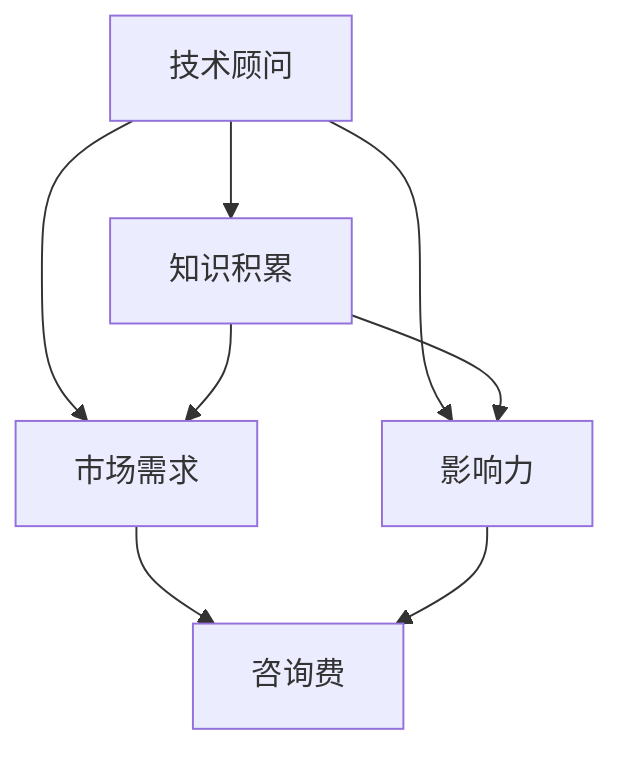

                 

# 技术顾问：打造每小时四位数的咨询费

> 关键词：技术顾问, 咨询费, 知识积累, 市场需求, 影响力, 职业发展

## 1. 背景介绍

### 1.1 问题由来

在数字化时代，技术创新和知识迭代速度迅猛，企业和组织对技术顾问的需求日益增加。无论是初创公司还是大型企业，无论是中小企业还是政府机构，他们都在寻求专业的技术解决方案，以保持竞争力和提升效率。然而，高质量技术顾问的稀缺性及其高昂的咨询费，使得许多组织难以负担。

### 1.2 问题核心关键点

在当今竞争激烈的商业环境中，技术顾问的价值不仅仅体现在技术专长，更在于其深入理解行业需求、高效解决问题和持续创新能力。一个优秀的技术顾问，其咨询费往往能达到每小时四位数，甚至更高。本文将探讨如何通过建立权威性、提高市场需求和扩大影响力，成为一名能收取高额咨询费的技术顾问。

### 1.3 问题研究意义

本文旨在为有志成为技术顾问的从业者提供系统性的指导。通过理解市场需求、知识积累、职业发展等方面的策略，帮助读者在职业生涯中达到高峰，实现每小时四位数的咨询费目标。这不仅对个人职业发展具有指导意义，也能推动整个技术咨询行业的发展，提高技术顾问的社会地位和影响力。

## 2. 核心概念与联系

### 2.1 核心概念概述

为了更深入地理解技术顾问的咨询费构成，本文将介绍几个关键概念及其联系：

- **技术顾问**：提供技术咨询和解决方案的专业人员，需具备深厚的技术背景和行业经验。
- **咨询费**：技术顾问基于其专业知识、经验和解决复杂问题的能力收取的费用。
- **知识积累**：技术顾问不断学习和积累技术知识和行业经验的过程。
- **市场需求**：市场对技术顾问的需求，受经济状况、行业发展、技术变革等多方面因素影响。
- **影响力**：技术顾问在行业内的知名度、声誉和影响力。

这些概念之间存在着密切的联系：通过不断积累知识，提升自身技术水平和行业影响力，满足市场需求，技术顾问可以显著提高其咨询费收入。

### 2.2 核心概念原理和架构的 Mermaid 流程图



## 3. 核心算法原理 & 具体操作步骤

### 3.1 算法原理概述

技术顾问的咨询费定价模型可以概括为以下公式：

$$
\text{咨询费} = \text{专业知识} \times \text{解决复杂问题能力} \times \text{市场需求} \times \text{行业影响力}
$$

其中，专业知识和技术能力是基础，市场需求和行业影响力则决定了咨询费的高低。

### 3.2 算法步骤详解

#### 3.2.1 确定咨询费定价策略

1. **基础定价**：根据自身技术水平和专业背景，设定一个基准咨询费率。
2. **市场需求调整**：分析目标客户群体，根据其规模、行业、技术需求等因素，调整咨询费率。
3. **影响力定价**：利用个人品牌和行业声誉，提升咨询费率。

#### 3.2.2 市场分析与定位

1. **目标客户分析**：了解目标客户的规模、业务类型、技术需求和预算限制。
2. **竞争对手分析**：分析同领域内的其他技术顾问，了解其服务内容和咨询费率，找到差异化优势。
3. **市场趋势分析**：关注技术发展趋势和行业动态，预判未来市场需求。

#### 3.2.3 建立品牌和声誉

1. **专业积累**：持续学习和提升技术能力，掌握前沿技术和行业动态。
2. **项目经验**：参与和主导重大项目，积累成功案例和经验。
3. **社区参与**：在技术社区和行业论坛中活跃，分享知识和经验，建立良好口碑。

#### 3.2.4 提供高质量服务

1. **需求分析**：深入了解客户需求，制定详细的解决方案。
2. **问题解决**：高效解决客户技术问题，提供量身定制的解决方案。
3. **后续支持**：提供持续的技术支持和维护，确保项目长期成功。

### 3.3 算法优缺点

#### 3.3.1 优点

1. **高收益潜力**：技术顾问的咨询费定价模型中，市场需求和行业影响力有显著提升空间。
2. **专业化和品牌化**：通过提升个人品牌和行业影响力，能显著提高咨询费率。
3. **可持续发展**：持续的知识积累和专业成长，能支撑长期高收益。

#### 3.3.2 缺点

1. **时间成本高**：建立品牌和声誉需要时间，短期内可能难以看到效果。
2. **竞争激烈**：技术顾问市场竞争激烈，需要不断提升个人能力和服务质量。
3. **市场需求波动**：市场需求受经济状况和行业发展影响，存在不确定性。

### 3.4 算法应用领域

技术顾问的咨询费定价模型可以广泛应用于各类技术咨询服务中，如软件开发、数据分析、网络安全、人工智能等。技术顾问需要根据不同领域的特点，制定相应的定价策略和市场分析方法。

## 4. 数学模型和公式 & 详细讲解 & 举例说明

### 4.1 数学模型构建

技术顾问的咨询费定价模型可以表达为：

$$
\text{咨询费} = f(\text{专业知识}, \text{技术能力}, \text{市场需求}, \text{行业影响力})
$$

其中，$f$ 为映射函数，代表知识、能力、需求和影响力对咨询费的影响。

### 4.2 公式推导过程

假设技术顾问在某个特定领域拥有 $k$ 项关键技术，其市场需求系数为 $d$，行业影响力系数为 $i$，则咨询费 $C$ 可以表示为：

$$
C = k \times d \times i
$$

其中 $k$、$d$ 和 $i$ 均为变量，需要通过市场分析和专业积累来确定。

### 4.3 案例分析与讲解

假设某技术顾问在人工智能领域拥有 5 项关键技术，市场需求系数为 1.2，行业影响力系数为 1.5，则其咨询费定价模型为：

$$
C = 5 \times 1.2 \times 1.5 = 9
$$

即该技术顾问的咨询费率可以定为每小时 9 美元。然而，实际定价应考虑更多因素，如项目复杂度、时间成本等。

## 5. 项目实践：代码实例和详细解释说明

### 5.1 开发环境搭建

开发环境搭建主要涉及安装必要的工具和软件，以支持技术顾问的日常工作和学习。

1. **编程语言**：选择 Python、Java 或 JavaScript 等主流编程语言，根据需求安装相应的 IDE。
2. **开发框架**：选择 Django、Spring 或 React 等框架，用于构建咨询项目。
3. **数据库**：安装 MySQL、PostgreSQL 或 MongoDB 等数据库，存储和管理咨询数据。
4. **云服务**：使用 AWS、Azure 或 Google Cloud 等云服务，支持远程协作和数据存储。
5. **工具集**：安装 JIRA、Slack 或 Trello 等项目管理工具，提高工作效率。

### 5.2 源代码详细实现

下面以一个简单的项目管理工具为例，展示如何使用 Python 和 Django 框架实现技术顾问的咨询服务。

```python
# Django 项目初始化
from django import forms
from django.views.generic import TemplateView

class ProjectForm(forms.Form):
    project_name = forms.CharField(label='项目名称', max_length=100)
    description = forms.CharField(label='项目描述', max_length=500)
    status = forms.ChoiceField(label='项目状态', choices=[('待处理', '待处理'), ('进行中', '进行中'), ('已完成', '已完成')])

class ProjectView(TemplateView):
    template_name = 'project.html'

    def get_context_data(self, **kwargs):
        context = super().get_context_data(**kwargs)
        form = ProjectForm()
        context['form'] = form
        return context
```

### 5.3 代码解读与分析

上述代码展示了 Django 框架中表单和视图的实现。技术顾问可以通过输入项目名称、描述和状态，来创建和管理项目。这只是一个简单的例子，实际应用中还需要考虑更多的细节和功能，如项目进度追踪、成员协作、报告生成等。

### 5.4 运行结果展示

通过上述代码实现的项目管理工具，技术顾问可以方便地创建和管理多个咨询项目，提高工作效率。运行结果展示了项目列表和详细视图，技术顾问可以通过直观的界面进行操作和监控。

## 6. 实际应用场景

### 6.1 智能制造

智能制造领域的技术顾问，通过深入了解制造业的数字化转型需求，提供定制化的技术解决方案。市场需求和技术能力都是其咨询费定价的关键因素。

### 6.2 金融科技

金融科技领域的技术顾问，专注于金融行业的数字化创新，帮助金融机构提升效率和安全性。市场对新技术的需求高涨，行业影响力也日益提升，为技术顾问创造了高咨询费的市场空间。

### 6.3 医疗健康

医疗健康领域的技术顾问，需掌握医疗数据的分析和处理技术，帮助医院和医疗机构实现信息化管理。市场需求和技术复杂性是影响咨询费的主要因素。

### 6.4 未来应用展望

未来，技术顾问的市场需求将持续增长，尤其是在新兴领域和前沿技术中。市场需求、技术能力和行业影响力将进一步融合，推动技术顾问咨询费定价的提升。

## 7. 工具和资源推荐

### 7.1 学习资源推荐

1. **《技术顾问入门指南》**：一本介绍技术顾问基础知识和实际案例的书籍，帮助读者快速了解技术顾问的职业要求。
2. **《项目管理之道》**：深入解析项目管理工具和方法，提升技术顾问的项目管理能力。
3. **《Python 编程艺术》**：掌握 Python 编程语言的基础和高级技术，提高技术顾问的开发能力。
4. **Coursera 和 Udemy**：在线学习平台，提供大量的技术顾问相关的课程和认证。
5. **技术博客和论坛**：如 Medium、Stack Overflow 和 GitHub，获取行业动态和技术交流。

### 7.2 开发工具推荐

1. **JIRA 和 Trello**：项目管理工具，帮助技术顾问跟踪项目进度和任务分配。
2. **Slack**：即时通讯工具，提升团队协作效率。
3. **Zoom 和 Microsoft Teams**：视频会议工具，支持远程协作和客户沟通。
4. **Git 和 GitHub**：版本控制工具，支持代码管理和版本跟踪。
5. **Google Drive 和 Dropbox**：云存储服务，方便数据共享和协作。

### 7.3 相关论文推荐

1. **《技术顾问市场研究》**：探讨技术顾问市场的现状和未来发展趋势，为读者提供市场分析的参考。
2. **《技术顾问咨询费定价模型》**：详细分析技术顾问咨询费定价的影响因素，为读者提供定价策略的指导。
3. **《技术顾问职业发展路径》**：提供技术顾问职业发展的建议和案例，帮助读者规划职业路径。

## 8. 总结：未来发展趋势与挑战

### 8.1 研究成果总结

本文通过分析技术顾问的咨询费定价模型，探讨了市场需求、知识积累、行业影响力和咨询费之间的关系。技术顾问需要通过不断学习和积累，提升自身技术能力和行业影响力，才能实现高咨询费收入。

### 8.2 未来发展趋势

未来，技术顾问的市场需求将持续增长，尤其是在新兴领域和前沿技术中。市场需求、技术能力和行业影响力将进一步融合，推动技术顾问咨询费定价的提升。

### 8.3 面临的挑战

技术顾问市场竞争激烈，需要不断提升个人能力和服务质量。市场需求受经济状况和行业发展影响，存在不确定性。

### 8.4 研究展望

未来的研究应关注技术顾问的持续学习和适应性，以及如何在不同领域和应用场景中实现最佳咨询效果。技术顾问需要不断探索新技术、新方法和新策略，以保持竞争力和市场地位。

## 9. 附录：常见问题与解答

**Q1：如何提升技术顾问的咨询费？**

A: 提升咨询费的关键在于提升专业知识、市场需求和行业影响力。技术顾问需要通过持续学习和积累，提升自身技术能力和行业声誉，才能显著提高咨询费率。

**Q2：技术顾问应该如何选择客户？**

A: 技术顾问应选择与其技术能力和行业经验匹配的客户，以确保项目成功和自身收益最大化。市场需求和技术复杂度是选择客户的关键因素。

**Q3：技术顾问应该如何提高市场影响力？**

A: 技术顾问应积极参与行业活动，如技术会议、论坛和社区，分享知识和经验。利用社交媒体和博客等平台，提升个人品牌和行业声誉。

**Q4：技术顾问应该如何应对市场波动？**

A: 技术顾问应保持持续学习和知识更新，及时了解行业动态和技术变革。建立多个客户关系，降低单一市场波动的风险。

**Q5：技术顾问应该如何管理项目？**

A: 技术顾问应使用项目管理工具，如 JIRA 和 Trello，跟踪项目进度和任务分配。定期与客户沟通，确保项目符合预期目标。

---

作者：禅与计算机程序设计艺术 / Zen and the Art of Computer Programming

