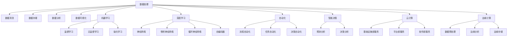

                 

# 技能提升：适应人类计算时代的新需求

> 关键词：技能提升, 人工智能, 计算能力, 人类计算, 自动化, 机器学习, 数据处理, 深度学习, 自然语言处理

## 1. 背景介绍

### 1.1 问题由来

随着信息技术的发展，人类社会的计算需求发生了深刻变化。过去，计算资源昂贵且稀缺，人们需要掌握复杂的编程知识和算法理论，才能解决实际问题。然而，今天，计算能力已经广泛普及，人工智能(AI)、大数据、云计算等技术日益成熟，极大地降低了计算门槛，使得普通人也能轻松地获取和处理海量信息。

这种计算能力的飞跃，对个人和组织的技能要求也提出了新的挑战。传统的计算技能，如编程、算法设计、数据分析，已经不再足以满足现代社会的需求。人类计算能力的提升，需要依靠新一轮的技术普及和知识更新，以应对日益复杂的信息处理任务。

### 1.2 问题核心关键点

当前，提升人类计算能力的主要关键点包括：
1. **数据处理能力**：现代计算任务大多依赖于大规模数据集，因此提升个人和组织的数据处理能力至关重要。
2. **机器学习与深度学习**：掌握机器学习和深度学习算法，能够自动化处理和分析复杂数据。
3. **自然语言处理(NLP)**：NLP技术使得人类与计算机之间的交互更加自然，提高信息获取和处理效率。
4. **自动化与智能决策**：利用自动化工具和智能系统，减少人工操作，提高决策效率和准确性。
5. **云计算与边缘计算**：了解云计算与边缘计算技术，合理利用分布式计算资源，应对数据处理需求。

### 1.3 问题研究意义

提升人类计算能力，对于推动技术创新、优化资源配置、增强决策效率具有重要意义：

1. **推动技术创新**：掌握最新计算技术，使得个人和企业能够更灵活地应用新技术，促进创新。
2. **优化资源配置**：通过数据分析和智能决策，提高资源利用效率，减少浪费。
3. **增强决策效率**：利用计算工具和算法，快速准确地做出决策，提高决策质量。
4. **赋能产业升级**：计算能力的提升，可以推动各行各业数字化转型，提升竞争力。
5. **促进教育公平**：计算能力的普及，可以打破知识壁垒，促进教育资源的均衡分配。

## 2. 核心概念与联系

### 2.1 核心概念概述

为了更好地理解如何提升人类计算能力，本节将介绍几个密切相关的核心概念：

- **数据处理**：从数据的采集、存储、清洗、分析到可视化的全过程。
- **机器学习(ML)**：一种通过数据学习模型，从而自动进行预测或分类的技术。
- **深度学习(DL)**：一种基于神经网络的机器学习方法，通过多层网络结构提取复杂特征。
- **自然语言处理(NLP)**：使计算机能够理解、处理和生成自然语言的技术。
- **自动化(Automation)**：利用软件和算法自动执行重复性任务，提高工作效率。
- **智能决策(Intelligent Decision-Making)**：结合机器学习、数据挖掘等技术，自动化决策过程。
- **云计算(Cloud Computing)**：利用互联网提供按需计算资源，实现资源共享。
- **边缘计算(Edge Computing)**：在数据源附近处理数据，减少延迟和带宽消耗。

这些核心概念之间的逻辑关系可以通过以下Mermaid流程图来展示：



这个流程图展示了数据处理的核心过程和相关技术，以及它们在机器学习、深度学习、自动化、智能决策和云计算中的应用。通过理解这些核心概念，我们可以更好地把握提升人类计算能力的策略和方法。

## 3. 核心算法原理 & 具体操作步骤

### 3.1 算法原理概述

提升人类计算能力，本质上是通过学习和应用现代计算技术，使得个人和企业能够更高效地处理和分析信息。这通常包括数据处理、机器学习、深度学习和自然语言处理等关键技术。

以下以机器学习和深度学习为例，介绍其基本原理和操作步骤：

1. **机器学习**：通过训练模型，使得模型能够根据输入数据进行预测或分类。常用的机器学习算法包括线性回归、逻辑回归、决策树、随机森林等。
2. **深度学习**：利用多层神经网络结构，自动提取数据特征，进行复杂任务处理。深度学习广泛应用于图像识别、语音识别、自然语言处理等领域。

### 3.2 算法步骤详解

以深度学习在图像识别任务中的应用为例，以下是一个典型的算法步骤详解：

1. **数据准备**：收集和标注图像数据集，分为训练集和测试集。
2. **模型构建**：选择合适的深度学习模型，如卷积神经网络(CNN)，设计模型的架构。
3. **参数初始化**：随机初始化模型参数。
4. **前向传播**：将训练数据输入模型，计算模型输出。
5. **损失函数计算**：计算模型输出与真实标签之间的差距，得到损失函数。
6. **反向传播**：根据损失函数，计算模型参数的梯度。
7. **参数更新**：使用梯度下降等优化算法，更新模型参数。
8. **模型评估**：在测试集上评估模型性能，进行超参数调整。
9. **模型部署**：将训练好的模型部署到实际应用中。

### 3.3 算法优缺点

深度学习在图像识别任务中表现出色，但也存在一些限制：
1. **计算资源需求高**：深度学习模型参数量大，需要高性能计算资源。
2. **过拟合风险**：模型复杂度高，容易过拟合。
3. **数据需求大**：需要大量标注数据进行训练。
4. **解释性差**：深度学习模型通常是黑箱，难以解释其决策过程。
5. **训练时间长**：深度学习模型训练时间长，需要大量时间成本。

尽管存在这些局限性，但深度学习在图像识别、语音识别、自然语言处理等领域仍表现出色，是提升人类计算能力的重要工具。

### 3.4 算法应用领域

深度学习已经在诸多领域得到了广泛应用，包括：

1. **计算机视觉**：图像分类、目标检测、人脸识别等。
2. **语音识别**：自动语音识别(ASR)、语音合成(TTS)等。
3. **自然语言处理**：机器翻译、文本生成、问答系统等。
4. **推荐系统**：个性化推荐、广告投放优化等。
5. **医疗影像**：医学影像分析、疾病诊断等。
6. **智能交通**：自动驾驶、交通流量预测等。

## 4. 数学模型和公式 & 详细讲解 & 举例说明

### 4.1 数学模型构建

以一个简单的线性回归模型为例，介绍其数学模型构建过程：

设有一个数据集 $(x_i, y_i)$，其中 $x_i$ 为输入特征，$y_i$ 为输出标签。线性回归模型定义为：

$$
y = wx + b
$$

其中 $w$ 为模型参数，$b$ 为截距。模型的目标是最小化损失函数 $L$：

$$
L = \frac{1}{2N} \sum_{i=1}^N (y_i - wx_i - b)^2
$$

使用梯度下降算法更新参数 $w$ 和 $b$：

$$
w \leftarrow w - \eta \frac{\partial L}{\partial w}
$$

$$
b \leftarrow b - \eta \frac{\partial L}{\partial b}
$$

其中 $\eta$ 为学习率。

### 4.2 公式推导过程

对线性回归模型进行详细推导：

1. **损失函数推导**：将模型输出与真实标签进行比较，得到均方误差损失函数：

$$
L = \frac{1}{2N} \sum_{i=1}^N (y_i - wx_i - b)^2
$$

2. **梯度推导**：对损失函数求偏导数，得到模型参数的梯度：

$$
\frac{\partial L}{\partial w} = -\frac{1}{N} \sum_{i=1}^N (y_i - wx_i - b)x_i
$$

$$
\frac{\partial L}{\partial b} = -\frac{1}{N} \sum_{i=1}^N (y_i - wx_i - b)
$$

3. **参数更新**：使用梯度下降算法，更新模型参数：

$$
w \leftarrow w - \eta \frac{\partial L}{\partial w}
$$

$$
b \leftarrow b - \eta \frac{\partial L}{\partial b}
$$

其中 $\eta$ 为学习率。

### 4.3 案例分析与讲解

以房价预测为例，分析线性回归模型的应用：

假设有一个包含房屋面积、房间数量、位置等特征的数据集，以及对应的房价标签。通过线性回归模型，可以从历史数据中学习到房屋面积、房间数量与房价之间的关系，并预测新房屋的房价。

在实际应用中，还需要对模型进行验证和调参，以确保其在未知数据上的泛化能力。通过逐步迭代和优化，线性回归模型可以在房价预测等任务上取得不错的效果。

## 5. 项目实践：代码实例和详细解释说明

### 5.1 开发环境搭建

在进行项目实践前，我们需要准备好开发环境。以下是使用Python进行TensorFlow开发的环境配置流程：

1. 安装Anaconda：从官网下载并安装Anaconda，用于创建独立的Python环境。

2. 创建并激活虚拟环境：
```bash
conda create -n tf-env python=3.8 
conda activate tf-env
```

3. 安装TensorFlow：根据CUDA版本，从官网获取对应的安装命令。例如：
```bash
conda install tensorflow=2.8 -c conda-forge
```

4. 安装各类工具包：
```bash
pip install numpy pandas scikit-learn matplotlib tqdm jupyter notebook ipython
```

完成上述步骤后，即可在`tf-env`环境中开始项目实践。

### 5.2 源代码详细实现

下面我们以房价预测任务为例，给出使用TensorFlow进行线性回归的PyTorch代码实现。

首先，定义线性回归模型的数据处理函数：

```python
import numpy as np
import pandas as pd
from sklearn.model_selection import train_test_split
from sklearn.preprocessing import StandardScaler
import tensorflow as tf

# 读取数据集
data = pd.read_csv('house_prices.csv')

# 提取特征和标签
X = data[['area', 'num_rooms', 'location']]
y = data['price']

# 划分训练集和测试集
X_train, X_test, y_train, y_test = train_test_split(X, y, test_size=0.2, random_state=42)

# 数据标准化
scaler = StandardScaler()
X_train = scaler.fit_transform(X_train)
X_test = scaler.transform(X_test)

# 构建模型
model = tf.keras.Sequential([
    tf.keras.layers.Dense(1, input_shape=(X_train.shape[1],))
])

# 定义损失函数和优化器
loss_fn = tf.keras.losses.MeanSquaredError()
optimizer = tf.keras.optimizers.SGD(learning_rate=0.01)

# 训练模型
model.compile(optimizer=optimizer, loss=loss_fn)
model.fit(X_train, y_train, epochs=100, batch_size=32)
```

然后，定义模型的评估函数：

```python
# 评估模型
def evaluate(model, X_test, y_test):
    y_pred = model.predict(X_test)
    mse = np.mean(np.square(y_pred - y_test))
    print(f"Mean Squared Error: {mse:.2f}")
```

最后，启动训练流程并在测试集上评估：

```python
# 在测试集上评估模型
evaluate(model, X_test, y_test)
```

以上就是使用TensorFlow进行线性回归的完整代码实现。可以看到，通过TensorFlow的高级API，可以非常简洁地实现线性回归模型的训练和评估。

### 5.3 代码解读与分析

让我们再详细解读一下关键代码的实现细节：

**数据处理函数**：
- `pd.read_csv`：从文件中读取数据集，转换为Pandas DataFrame。
- `train_test_split`：将数据集划分为训练集和测试集，保持数据分布一致。
- `StandardScaler`：对特征进行标准化处理，使其均值为0，标准差为1。

**模型构建**：
- `tf.keras.Sequential`：定义一个顺序的神经网络模型。
- `tf.keras.layers.Dense`：添加一个全连接层，输出为房价标签。
- `compile`：配置模型，指定损失函数和优化器。
- `fit`：训练模型，指定训练数据和参数。

**评估函数**：
- `predict`：对测试集进行预测，返回预测结果。
- `np.mean`：计算预测值与真实值之间的均方误差。
- `print`：输出评估结果。

**训练流程**：
- `evaluate`：对训练好的模型进行评估，使用均方误差作为评价指标。
- `X_test`和`y_test`：分别表示测试集特征和标签。

可以看到，通过TensorFlow和Pandas等工具，线性回归模型的开发和评估变得非常简便。

## 6. 实际应用场景

### 6.1 智能推荐系统

智能推荐系统已经成为电商、新闻、视频等平台的重要功能，极大地提升了用户体验和平台收益。通过机器学习技术，推荐系统可以根据用户的历史行为和偏好，推荐个性化内容。

在技术实现上，可以使用协同过滤、内容推荐、深度学习等方法，对用户和物品进行建模，计算相似度，生成推荐结果。通过不断迭代和优化，推荐系统能够更加精准地匹配用户需求，提高用户满意度。

### 6.2 金融风险评估

金融行业面临着复杂多变的环境和巨大的风险。通过机器学习技术，金融风控系统可以对客户的信用评分、贷款申请、投资策略等进行评估，预测风险，防范欺诈行为。

在技术实现上，可以收集客户的各类数据，如信用记录、交易历史、社交网络等，使用分类、回归等机器学习模型进行风险预测。通过实时监测和反馈，金融风控系统能够及时识别异常行为，保障金融安全。

### 6.3 医疗影像诊断

医疗影像分析是现代医疗中的重要应用，通过深度学习技术，可以实现对医学影像的自动诊断。

在技术实现上，可以收集大量的医学影像数据，包括X光片、CT、MRI等，使用卷积神经网络(CNN)进行图像分类、分割等任务。通过不断优化模型和数据，医疗影像分析系统能够快速准确地进行疾病诊断，辅助医生决策。

## 7. 工具和资源推荐

### 7.1 学习资源推荐

为了帮助开发者系统掌握机器学习和深度学习的理论基础和实践技巧，这里推荐一些优质的学习资源：

1. 《深度学习》系列博文：由大模型技术专家撰写，深入浅出地介绍了深度学习原理和应用。

2. CS231n《卷积神经网络》课程：斯坦福大学开设的计算机视觉经典课程，有Lecture视频和配套作业，系统介绍了CNN的基本概念和算法。

3. 《TensorFlow实战深度学习》书籍：TensorFlow官方团队编写的实践指南，提供了大量代码示例和应用案例。

4. PyTorch官方文档：PyTorch官方文档，提供了丰富的教程和API文档，是学习PyTorch的好资源。

5. Coursera机器学习课程：由斯坦福大学Andrew Ng教授主讲，涵盖机器学习的基本概念和算法。

通过对这些资源的学习实践，相信你一定能够快速掌握机器学习和深度学习的精髓，并用于解决实际的计算问题。

### 7.2 开发工具推荐

高效的开发离不开优秀的工具支持。以下是几款用于机器学习和深度学习开发的常用工具：

1. PyTorch：基于Python的开源深度学习框架，灵活动态的计算图，适合快速迭代研究。

2. TensorFlow：由Google主导开发的开源深度学习框架，生产部署方便，适合大规模工程应用。

3. Keras：基于TensorFlow和Theano的高层API，易于上手，适合快速原型开发。

4. Jupyter Notebook：用于编写、执行和共享Python代码的互动环境，支持Markdown和LaTeX格式。

5. Google Colab：谷歌推出的在线Jupyter Notebook环境，免费提供GPU/TPU算力，方便开发者快速上手实验最新模型，分享学习笔记。

合理利用这些工具，可以显著提升机器学习和深度学习的开发效率，加快创新迭代的步伐。

### 7.3 相关论文推荐

机器学习和深度学习的发展源于学界的持续研究。以下是几篇奠基性的相关论文，推荐阅读：

1. Deep Blue: Machine Learning for the Machine Learning Practitioner：提供了机器学习和深度学习的实战指南，涵盖数据处理、模型构建、评估等环节。

2. ImageNet Classification with Deep Convolutional Neural Networks：提出了AlexNet模型，引入了卷积神经网络在图像分类任务中的应用。

3. Google's Neural Machine Translation System：展示了深度学习在机器翻译任务中的应用，取得了当时的SOTA效果。

4. Attention is All You Need：提出了Transformer模型，开启了深度学习中的自注意力机制。

5. Wide & Deep Learning for Recommender Systems：结合了宽模型和深度模型，提高了推荐系统的精度。

这些论文代表了大数据、机器学习和深度学习的最新进展，通过学习这些前沿成果，可以帮助研究者把握学科前进方向，激发更多的创新灵感。

## 8. 总结：未来发展趋势与挑战

### 8.1 总结

本文对提升人类计算能力的机器学习和深度学习技术进行了全面系统的介绍。首先阐述了当前计算需求的变迁，明确了提升计算能力的重要性和紧迫性。其次，从原理到实践，详细讲解了机器学习和深度学习的数学原理和操作步骤，给出了机器学习任务开发的完整代码实例。同时，本文还广泛探讨了机器学习和深度学习在推荐系统、金融风控、医疗影像等多个领域的应用前景，展示了其巨大的应用潜力。此外，本文精选了机器学习和深度学习的各类学习资源，力求为读者提供全方位的技术指引。

通过本文的系统梳理，可以看到，机器学习和深度学习技术正在成为现代计算的核心，极大地拓展了人类的计算能力，提高了决策效率和准确性。未来，伴随算法和技术的不断进步，机器学习和深度学习必将在更多领域大放异彩，为人类社会的发展注入新的动力。

### 8.2 未来发展趋势

展望未来，机器学习和深度学习技术将呈现以下几个发展趋势：

1. **模型规模持续增大**：随着计算能力的提升和数据量的增加，深度学习模型规模将进一步扩大，能够处理更复杂的任务。

2. **自动化和智能化程度提升**：自动化和智能化技术将不断引入机器学习和深度学习流程，使得模型训练、数据处理等环节更加高效、智能。

3. **多模态融合**：未来机器学习模型将更加注重多模态数据融合，结合文本、图像、声音等多源信息，提升决策准确性。

4. **联邦学习兴起**：联邦学习将使得数据分布式存储、联合训练成为可能，保护数据隐私的同时，提升模型性能。

5. **无监督学习进展**：无监督学习将进一步发展，使得机器学习在缺乏标注数据的情况下也能取得良好效果。

6. **解释性增强**：解释性技术将不断推进，使得机器学习模型的决策过程更加透明、可解释。

以上趋势凸显了机器学习和深度学习的广阔前景。这些方向的探索发展，必将进一步提升机器学习和深度学习系统的性能和应用范围，为人类社会的发展带来新的变革。

### 8.3 面临的挑战

尽管机器学习和深度学习技术已经取得了瞩目成就，但在迈向更加智能化、普适化应用的过程中，仍面临诸多挑战：

1. **计算资源需求高**：深度学习模型通常需要大量的计算资源，限制了其在资源受限环境中的应用。

2. **数据隐私和安全性**：机器学习模型在训练和推理过程中，可能会涉及敏感数据，数据隐私和安全性问题亟需解决。

3. **模型鲁棒性和泛化性**：深度学习模型往往对输入数据的变化敏感，鲁棒性和泛化性需要进一步提升。

4. **模型可解释性不足**：深度学习模型通常是黑箱，难以解释其决策过程，限制了其在高风险应用中的应用。

5. **对抗攻击脆弱**：深度学习模型容易受到对抗样本的攻击，安全性问题亟需解决。

6. **公平性和偏见**：机器学习模型可能存在偏见，需要引入公平性约束，确保模型输出的公平性。

正视机器学习和深度学习面临的这些挑战，积极应对并寻求突破，将是大数据、机器学习和深度学习技术走向成熟的必由之路。相信随着学界和产业界的共同努力，这些挑战终将一一被克服，机器学习和深度学习必将在构建安全、可靠、可解释、可控的智能系统铺平道路。

### 8.4 研究展望

面向未来，机器学习和深度学习技术的研究将在以下几个方面寻求新的突破：

1. **分布式计算**：结合分布式计算技术，提升机器学习和深度学习模型的训练和推理效率。

2. **多模态学习**：融合多源信息，提升模型的决策准确性和鲁棒性。

3. **自监督学习**：通过无监督学习和自我监督机制，提升模型的泛化能力和数据利用效率。

4. **可解释性**：引入可解释性技术，增强机器学习模型的透明性和可理解性。

5. **公平性**：引入公平性约束，确保机器学习模型的输出公平、公正。

6. **隐私保护**：结合隐私保护技术，确保数据隐私和安全。

这些研究方向和课题将引领机器学习和深度学习技术迈向更高的台阶，为构建安全、可靠、可解释、可控的智能系统铺平道路。面向未来，机器学习和深度学习技术的研究还需要与其他人工智能技术进行更深入的融合，如知识表示、因果推理、强化学习等，多路径协同发力，共同推动人工智能技术的发展。

## 9. 附录：常见问题与解答

**Q1：机器学习和深度学习是否适用于所有计算任务？**

A: 机器学习和深度学习在处理结构化、非结构化数据方面表现出色，但面对需要大量计算的科学计算、工程仿真等任务，可能效率不如传统计算方法。需要根据具体任务的特点，选择合适的技术手段。

**Q2：如何选择合适的机器学习算法？**

A: 选择合适的机器学习算法，需要考虑数据类型、任务需求、计算资源等因素。对于分类任务，常用的算法包括决策树、随机森林、逻辑回归等。对于回归任务，常用的算法包括线性回归、岭回归、支持向量机等。对于聚类任务，常用的算法包括K-Means、DBSCAN等。选择合适的算法需要综合考虑模型的性能、可解释性、计算复杂度等。

**Q3：如何处理数据预处理过程？**

A: 数据预处理是机器学习流程中重要的一环，包括数据清洗、特征工程、数据标准化等。常用的预处理工具包括Pandas、Scikit-learn等。在预处理过程中，需要注意数据缺失、异常值、数据平衡等问题，确保数据的质量和一致性。

**Q4：如何进行模型评估和调参？**

A: 模型评估和调参是提升模型性能的关键步骤。常用的评估指标包括准确率、召回率、F1值、均方误差等。常用的调参方法包括网格搜索、随机搜索、贝叶斯优化等。通过不断迭代和优化，提升模型在训练集和测试集上的性能。

**Q5：机器学习和深度学习在实际应用中需要注意哪些问题？**

A: 在实际应用中，机器学习和深度学习需要注意以下问题：
1. 数据质量：确保数据的完整性、准确性和一致性。
2. 模型复杂度：避免过拟合，确保模型的泛化能力。
3. 计算资源：合理分配计算资源，确保模型训练和推理的效率。
4. 模型解释性：确保模型的决策过程透明、可解释。
5. 数据隐私：保护数据隐私，确保数据的安全性和合法性。

通过合理处理这些问题，可以在实际应用中充分发挥机器学习和深度学习技术的优势，提升系统的性能和可靠性。

---

作者：禅与计算机程序设计艺术 / Zen and the Art of Computer Programming

