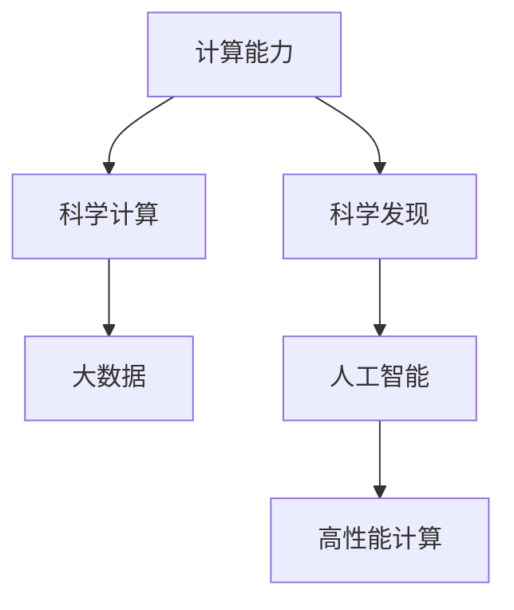

                 

# 拓展认知边界：人类计算的科学探索

> 关键词：人类计算,科学探索,认知扩展,计算机科学,数学模型,算法设计

## 1. 背景介绍

### 1.1 问题由来
在计算机科学领域，计算能力一直是推动技术进步和人类认知能力拓展的重要驱动力。随着硬件和软件技术的不断革新，人类计算能力实现了跨越式的提升。特别是近年来，深度学习和人工智能的兴起，为科学探索开辟了新的道路。

计算机科学不仅在技术层面提供了强大的计算能力，还在理论层面拓展了人类对问题的认知边界。计算科学从根本上改变了人类认识世界的方式，揭示了隐藏在数据背后的深层规律。无论是基因组学、天气预报、金融市场分析，还是天体物理学，计算机科学都在其中扮演着不可或缺的角色。

### 1.2 问题核心关键点
本文聚焦于人类计算能力的科学探索，探讨如何利用计算机技术拓展人类认知边界，探索计算科学在科学探索中的应用，以期为科学研究和工程实践提供理论指导和实践方案。

### 1.3 问题研究意义
在现代科学研究中，计算能力成为了不可或缺的一部分。通过计算，科学家能够高效地处理和分析海量数据，揭示复杂系统的行为规律，预测未来趋势，推动科学发现和技术进步。计算科学在生物信息学、材料科学、天文学、社会科学等领域的应用，已经极大地推动了人类对自然和社会现象的理解，提升了科学研究的效率和深度。

本文旨在系统梳理计算科学在科学探索中的方法论和实践应用，揭示其背后的科学原理和技术实现，为研究者提供全面的理论指导和技术方案，激发更多创新灵感。

## 2. 核心概念与联系

### 2.1 核心概念概述

为更好地理解人类计算的科学探索，本节将介绍几个密切相关的核心概念：

- 计算能力(Computational Capability)：指计算机在特定任务上处理数据的能力，包括算力、存储、网络等硬件资源，以及算法、模型等软件资源。
- 科学计算(Scientific Computing)：利用计算机对科学问题进行数值模拟、数据分析和模式识别，揭示科学现象的内在规律。
- 科学发现(Scientific Discovery)：通过计算和数据处理，提出新的科学假设，验证现有理论，发现新的科学现象。
- 大数据(Big Data)：指那些数据规模巨大、复杂度高、处理难度大的数据集，往往涉及多模态数据、海量数据。
- 高性能计算(High Performance Computing, HPC)：通过并行计算、分布式计算等技术手段，提升计算效率，处理大规模科学计算任务。
- 人工智能(Artificial Intelligence, AI)：通过算法和模型模拟人类智能行为，解决复杂的科学问题。

这些核心概念之间的逻辑关系可以通过以下Mermaid流程图来展示：



这个流程图展示了一系列核心概念的相互关系：

1. 计算能力是科学计算、科学发现和人工智能的基础，通过高效计算，科学家可以处理大规模数据。
2. 科学计算和大数据处理是科学发现的重要手段，通过计算揭示科学现象的内在规律。
3. 人工智能和科学计算相结合，可以提升计算的智能化水平，解决复杂的科学问题。
4. 高性能计算是支持大规模科学计算的关键技术，通过并行分布式计算提升效率。

这些核心概念共同构成了人类计算的科学探索框架，推动了计算科学在科学研究中的应用。

## 3. 核心算法原理 & 具体操作步骤

### 3.1 算法原理概述

人类计算的科学探索，本质上是通过计算模型和算法处理科学问题，揭示科学现象的内在规律，实现科学发现。这一过程可以分为以下几个关键步骤：

1. **数据获取与预处理**：收集和整理科学数据，进行清洗和预处理，以便于后续的计算和分析。
2. **模型构建与训练**：选择合适的计算模型和算法，利用科学数据进行训练和优化，学习数据中的规律。
3. **数据模拟与分析**：将模型应用于新数据集，进行数据模拟和分析，预测科学现象。
4. **结果验证与优化**：对预测结果进行验证，通过反馈机制优化模型，提升科学发现的质量。

### 3.2 算法步骤详解

基于计算能力的科学探索，一般包括以下几个关键步骤：

**Step 1: 数据获取与预处理**
- 选择合适的数据源，收集科学数据。
- 对数据进行清洗和预处理，包括缺失值处理、异常值检测、数据标准化等。

**Step 2: 模型构建与训练**
- 选择合适的计算模型，如线性回归、神经网络、支持向量机等。
- 利用科学数据对模型进行训练，通过交叉验证等技术手段优化模型参数。

**Step 3: 数据模拟与分析**
- 使用训练好的模型对新数据集进行模拟和分析，预测科学现象。
- 可视化分析结果，通过图表展示科学现象的内在规律。

**Step 4: 结果验证与优化**
- 对预测结果进行验证，评估模型的预测精度和泛化能力。
- 根据验证结果，调整模型参数或选择更合适的模型，进一步优化模型性能。

### 3.3 算法优缺点

科学计算和人工智能在科学探索中展现了强大的能力，但也存在一些局限性：

优点：
1. 高效处理大规模数据：通过并行计算和分布式计算，科学计算可以高效处理海量数据，揭示复杂系统的行为规律。
2. 提供数据驱动的科学发现：通过机器学习和深度学习等技术，科学计算可以从数据中学习规律，发现新的科学现象。
3. 支持跨学科融合：科学计算不仅在自然科学领域应用广泛，还在社会科学、人文科学等领域得到了广泛应用。

缺点：
1. 依赖高质量数据：科学计算和人工智能的效果很大程度上取决于数据的质量和数量，数据质量差或标注样本不足会影响模型性能。
2. 模型复杂度高：复杂的计算模型和算法往往需要较高的计算资源和专业知识，对于非专业研究人员而言，难以入手。
3. 结果解释性不足：科学计算和人工智能模型的决策过程缺乏可解释性，难以对其推理逻辑进行分析和调试。
4. 伦理与安全问题：科学计算和人工智能模型可能引入伦理和安全问题，如算法偏见、隐私泄露等，需要在应用中加以注意。

尽管存在这些局限性，但就目前而言，科学计算和人工智能在科学探索中的应用已经取得了显著的进展，为科学研究和工程实践提供了强大的工具。未来相关研究的重点在于如何进一步降低科学计算和人工智能对数据的质量和数量依赖，提高模型的少样本学习和跨领域迁移能力，同时兼顾可解释性和伦理安全性等因素。

### 3.4 算法应用领域

科学计算和人工智能在科学探索中的应用已经覆盖了多个领域，以下是几个典型的应用场景：

1. **生物信息学**：利用计算模型对生物数据进行处理和分析，揭示基因表达、蛋白质结构等生物学现象的内在规律。
2. **天文学**：通过高性能计算和机器学习，对天文数据进行模拟和分析，揭示星体运动、黑洞性质等天文学现象。
3. **气象学**：利用科学计算模型对气象数据进行处理和分析，预测天气变化，支持气象灾害预警。
4. **金融学**：通过人工智能算法对金融数据进行分析和预测，揭示市场行为和趋势，支持金融决策。
5. **社会科学**：利用计算模型对社会科学数据进行处理和分析，揭示人类行为和社会现象的内在规律。

除了上述这些经典领域外，科学计算和人工智能还在智能制造、智慧城市、医疗健康等多个领域得到了广泛应用，为科学研究和工程实践带来了新的突破。随着科学计算和人工智能技术的不断发展，相信其在科学探索中的应用将更加深入和广泛。

## 4. 数学模型和公式 & 详细讲解 & 举例说明

### 4.1 数学模型构建

本文将通过几个典型的科学计算案例，展示如何构建数学模型进行科学探索。

**案例1: 线性回归模型**
线性回归是一种常见的统计模型，用于建立自变量和因变量之间的线性关系。假设有一组数据集 $(x_i,y_i)$，其中 $x_i$ 为自变量，$y_i$ 为因变量。假设 $y$ 与 $x$ 之间存在线性关系 $y=ax+b$，其中 $a$ 和 $b$ 为模型参数。线性回归的目标是找到最优参数 $(a,b)$，使得模型预测结果与真实结果的误差最小。

用最小二乘法求解，得到模型参数为：

$$
\hat{a}=\frac{\sum_{i=1}^n (x_i-\overline{x})(y_i-\overline{y})}{\sum_{i=1}^n (x_i-\overline{x})^2}, \quad \hat{b}=\overline{y}-\hat{a}\overline{x}
$$

其中 $\overline{x}$ 和 $\overline{y}$ 分别为 $x$ 和 $y$ 的均值。

**案例2: 神经网络模型**
神经网络是一种模拟人类神经系统的计算模型，由多个神经元组成。假设有一组训练数据集 $(\mathbf{x}_i,y_i)$，其中 $\mathbf{x}_i$ 为输入向量，$y_i$ 为输出标签。神经网络由多个隐层和输出层组成，每个神经元接收前一层的输出作为输入，并计算加权和、激活函数等操作。

以一个简单的三层神经网络为例，输入层有 $n$ 个神经元，每个神经元连接一个隐层神经元，隐层有 $m$ 个神经元，每个隐层神经元再连接一个输出层神经元，输出层有 $k$ 个神经元。

假设隐层和输出层的激活函数为 sigmoid 函数，则神经网络的计算过程如下：

1. 输入层到隐层的计算：
   $$
   z_j^{(1)}=\sum_{i=1}^n w_{ij}x_i+b_j, \quad a_j^{(1)}=\sigma(z_j^{(1)})
   $$
   其中 $w_{ij}$ 为权重，$b_j$ 为偏置，$\sigma(z)$ 为 sigmoid 函数。

2. 隐层到输出层的计算：
   $$
   z_k^{(2)}=\sum_{j=1}^m w_{kj}a_j^{(1)}+b_k, \quad a_k^{(2)}=\sigma(z_k^{(2)})
   $$

3. 输出层的预测：
   $$
   \hat{y}=a_k^{(2)}
   $$

### 4.2 公式推导过程

这里对线性回归模型和神经网络模型的公式推导过程进行详细讲解。

**线性回归模型**
线性回归模型的最小二乘法求解过程如下：

1. 假设数据集 $(x_i,y_i)$，其中 $x_i$ 为自变量，$y_i$ 为因变量。
2. 假设 $y$ 与 $x$ 之间存在线性关系 $y=ax+b$，其中 $a$ 和 $b$ 为模型参数。
3. 根据最小二乘法，求解最优参数 $(a,b)$，使得模型预测结果与真实结果的误差最小。

根据最小二乘法，可以得到参数 $(a,b)$ 的求解公式为：

$$
\hat{a}=\frac{\sum_{i=1}^n (x_i-\overline{x})(y_i-\overline{y})}{\sum_{i=1}^n (x_i-\overline{x})^2}, \quad \hat{b}=\overline{y}-\hat{a}\overline{x}
$$

其中 $\overline{x}$ 和 $\overline{y}$ 分别为 $x$ 和 $y$ 的均值。

**神经网络模型**
神经网络模型的参数更新过程如下：

1. 假设数据集 $(\mathbf{x}_i,y_i)$，其中 $\mathbf{x}_i$ 为输入向量，$y_i$ 为输出标签。
2. 假设神经网络由 $l$ 个隐层和 $k$ 个输出层组成，每个隐层有 $m$ 个神经元。
3. 假设隐层和输出层的激活函数为 sigmoid 函数。
4. 假设训练过程中采用随机梯度下降法，求解最优参数 $(w_{ij},b_j)$，使得模型预测结果与真实结果的误差最小。

根据随机梯度下降法，可以得到神经网络模型参数的更新公式为：

$$
w_{ij}^{(t+1)}=w_{ij}^{(t)}-\eta \frac{\partial L}{\partial w_{ij}} \quad \text{and} \quad b_j^{(t+1)}=b_j^{(t)}-\eta \frac{\partial L}{\partial b_j}
$$

其中 $\eta$ 为学习率，$L$ 为损失函数，通常采用均方误差损失。

### 4.3 案例分析与讲解

以一个简单的金融市场预测案例，展示如何使用科学计算和人工智能进行科学探索。

假设有一组历史股票价格数据，我们希望利用机器学习模型预测未来股价走势。首先，对数据进行预处理，将股价数据标准化，将历史日期转换为特征向量。然后，利用线性回归模型和神经网络模型对数据进行训练和预测，评估模型的预测精度和泛化能力。最后，通过可视化工具展示预测结果，揭示股票价格走势的内在规律。

## 5. 项目实践：代码实例和详细解释说明

### 5.1 开发环境搭建

在进行科学探索和计算模型构建时，需要搭建合适的开发环境。以下是使用Python进行科学计算和机器学习的开发环境配置流程：

1. 安装Anaconda：从官网下载并安装Anaconda，用于创建独立的Python环境。

2. 创建并激活虚拟环境：
```bash
conda create -n myenv python=3.8 
conda activate myenv
```

3. 安装必要的科学计算和机器学习库：
```bash
conda install numpy pandas scikit-learn matplotlib seaborn statsmodels joblib jupyter notebook
```

4. 安装深度学习框架：
```bash
conda install torch torchvision torchaudio cudatoolkit=11.1 -c pytorch -c conda-forge
```

5. 安装数据处理和可视化工具：
```bash
conda install beautifulsoup4 lxml pyreadstat
```

完成上述步骤后，即可在虚拟环境中进行科学探索和模型构建。

### 5.2 源代码详细实现

以下是一个使用PyTorch和TensorFlow构建神经网络模型并进行金融市场预测的示例代码：

```python
import numpy as np
import pandas as pd
import torch
from sklearn.preprocessing import StandardScaler
from sklearn.model_selection import train_test_split
from torch import nn, optim
from torch.autograd import Variable
import matplotlib.pyplot as plt
import seaborn as sns

# 加载历史股票价格数据
data = pd.read_csv('stock_prices.csv')

# 数据预处理
features = ['open', 'high', 'low', 'close', 'volume']
X = data[features].values
y = data['close'].values
scaler = StandardScaler()
X_scaled = scaler.fit_transform(X)

# 数据分割
X_train, X_test, y_train, y_test = train_test_split(X_scaled, y, test_size=0.2, random_state=42)

# 定义神经网络模型
class NeuralNetwork(nn.Module):
    def __init__(self, input_dim, hidden_dim, output_dim):
        super(NeuralNetwork, self).__init__()
        self.fc1 = nn.Linear(input_dim, hidden_dim)
        self.fc2 = nn.Linear(hidden_dim, hidden_dim)
        self.fc3 = nn.Linear(hidden_dim, output_dim)
        self.sigmoid = nn.Sigmoid()
    
    def forward(self, x):
        x = self.sigmoid(self.fc1(x))
        x = self.sigmoid(self.fc2(x))
        x = self.sigmoid(self.fc3(x))
        return x

# 构建模型实例
input_dim = 4
hidden_dim = 16
output_dim = 1
model = NeuralNetwork(input_dim, hidden_dim, output_dim)

# 定义损失函数和优化器
criterion = nn.MSELoss()
optimizer = optim.SGD(model.parameters(), lr=0.01)

# 训练模型
epochs = 500
for epoch in range(epochs):
    inputs = Variable(torch.from_numpy(X_train), requires_grad=True)
    targets = Variable(torch.from_numpy(y_train))
    optimizer.zero_grad()
    outputs = model(inputs)
    loss = criterion(outputs, targets)
    loss.backward()
    optimizer.step()
    if (epoch+1) % 100 == 0:
        print(f'Epoch {epoch+1}, loss: {loss.item()}')

# 预测并可视化结果
X_new = np.linspace(0, 1, 100).reshape(-1, 4)
X_new_scaled = scaler.transform(X_new)
inputs = Variable(torch.from_numpy(X_new_scaled), requires_grad=False)
outputs = model(inputs)
plt.plot(X_new, outputs.data.numpy(), label='Prediction')
plt.plot(X_new, y_test, 'r.', label='Actual')
plt.legend()
plt.show()
```

### 5.3 代码解读与分析

让我们再详细解读一下关键代码的实现细节：

**数据加载与预处理**
- 使用 Pandas 库加载历史股票价格数据。
- 选择重要的特征（开盘价、最高价、最低价、收盘价和成交量），并将数据标准化处理。

**模型构建与训练**
- 定义神经网络模型，包含一个输入层、两个隐藏层和一个输出层，使用 sigmoid 函数作为激活函数。
- 利用随机梯度下降法对模型进行训练，定义均方误差损失函数。

**预测与可视化**
- 对新的输入数据进行预测，并使用 Matplotlib 和 Seaborn 库可视化预测结果和实际数据。

该代码实现展示了使用 Python 进行科学计算和机器学习模型的全流程，包括数据预处理、模型构建、训练和预测等环节。

## 6. 实际应用场景

### 6.1 金融市场预测

利用科学计算和人工智能进行金融市场预测，已经成为金融机构和投资者决策的重要手段。通过机器学习模型对历史数据进行分析和学习，可以预测股票、商品、外汇等金融产品的价格走势，帮助投资者进行买卖决策。

在实际应用中，可以收集历史金融数据，利用神经网络等模型进行训练和预测，结合市场信息和专家知识，进行多维度分析和决策。对于不同的金融产品和市场条件，需要设计不同的预测模型，如时间序列模型、卷积神经网络等，以适应不同的预测需求。

### 6.2 天文学观测数据分析

天文学观测数据通常涉及大量复杂的天文图像和光谱数据，科学家需要通过科学计算和人工智能技术，提取和分析数据中的重要信息。利用深度学习模型，如卷积神经网络和生成对抗网络，可以对天文图像进行分类、分割和分析，揭示星系运动、黑洞性质等天文学现象。

例如，通过训练卷积神经网络模型，可以对星系图像进行分类和特征提取，支持星系演化和星系类型的研究。利用生成对抗网络，可以对天文图像进行去噪和增强，提升观测数据的质量。

### 6.3 气象灾害预警

气象灾害预警是防灾减灾的重要环节，利用科学计算和人工智能技术，可以实时监测气象数据，预测天气变化，提前发布预警信息，保护人民生命财产安全。

通过机器学习模型对历史气象数据进行分析和学习，可以预测天气变化，支持气象灾害预警。例如，利用神经网络模型对天气数据进行分类和回归分析，预测台风、暴雨、干旱等气象灾害的发生概率和强度。结合卫星和雷达数据，进行多源信息融合，提升预警的准确性和及时性。

### 6.4 未来应用展望

随着科学计算和人工智能技术的不断发展，其在科学探索中的应用将更加广泛和深入。以下是对未来应用的几点展望：

1. **跨领域融合**：科学计算和人工智能技术可以与其他学科领域进行融合，如地理信息科学、生物信息学等，提供更加全面和深入的科学探索手段。
2. **大数据处理**：利用分布式计算和大数据处理技术，处理海量数据，揭示复杂系统的行为规律。
3. **模型可解释性**：通过可解释性机器学习和因果推理等技术，提升模型的可解释性，增强科学发现的说服力。
4. **多模态数据融合**：利用多模态数据融合技术，将不同类型的数据进行整合，提升科学发现的深度和广度。

## 7. 工具和资源推荐

### 7.1 学习资源推荐

为了帮助开发者系统掌握科学计算和人工智能技术，这里推荐一些优质的学习资源：

1. 《Python科学计算入门》：全面介绍 Python 在科学计算中的应用，涵盖数据处理、机器学习、深度学习等技术。
2. 《Deep Learning》课程：由斯坦福大学开设的深度学习课程，讲解深度学习的基本原理和技术实现。
3. 《Scientific Python》书籍：介绍 Python 在科学计算中的高级应用，涵盖科学数据处理、高性能计算等技术。
4. Coursera 上的机器学习课程：提供大量科学计算和人工智能相关的课程，涵盖从入门到高级的内容。
5. Google Colab：谷歌推出的在线 Jupyter Notebook 环境，免费提供 GPU 和 TPU 算力，适合实验最新模型，分享学习笔记。

通过对这些资源的学习实践，相信你一定能够快速掌握科学计算和人工智能技术的精髓，并用于解决实际的科学问题。

### 7.2 开发工具推荐

高效的开发离不开优秀的工具支持。以下是几款用于科学计算和人工智能开发的常用工具：

1. Jupyter Notebook：一款强大的数据科学和机器学习开发环境，支持代码编辑、执行和可视化。
2. JupyterLab：Jupyter Notebook 的下一代界面，提供更加灵活和易用的开发体验。
3. Google Colab：谷歌推出的在线 Jupyter Notebook 环境，免费提供 GPU 和 TPU 算力，适合实验最新模型，分享学习笔记。
4. PyTorch：基于 Python 的深度学习框架，提供高效的张量运算和模型定义功能。
5. TensorFlow：由 Google 主导开发的深度学习框架，支持分布式计算和模型部署。
6. Scikit-learn：一个开源的机器学习库，提供简单易用的机器学习算法和工具。

合理利用这些工具，可以显著提升科学计算和人工智能任务的开发效率，加快创新迭代的步伐。

### 7.3 相关论文推荐

科学计算和人工智能技术的发展源于学界的持续研究。以下是几篇奠基性的相关论文，推荐阅读：

1. "Deep Learning" by Ian Goodfellow et al.：介绍了深度学习的原理和应用，是深度学习领域的经典教材。
2. "A Tutorial on Support Vector Regression" by Alex J. Smola and Bernhard Schölkopf：讲解支持向量回归的原理和实现，是机器学习领域的重要理论基础。
3. "Neural Networks and Deep Learning" by Michael Nielsen：全面介绍了神经网络和深度学习的原理和技术实现。
4. "Data Science from Scratch" by Joel Grus：介绍了数据科学和机器学习的基础知识和实践技能。
5. "Python Data Science Handbook" by Jake VanderPlas：讲解 Python 在数据科学中的应用，涵盖数据处理、可视化和机器学习等技术。

这些论文代表了大规模数据处理和人工智能技术的发展脉络。通过学习这些前沿成果，可以帮助研究者把握学科前进方向，激发更多的创新灵感。

## 8. 总结：未来发展趋势与挑战

### 8.1 总结

本文对人类计算的科学探索进行了全面系统的介绍。首先阐述了科学计算和人工智能在科学探索中的重要地位和作用，明确了计算科学在科学研究和工程实践中的关键作用。其次，从原理到实践，详细讲解了科学计算和人工智能的数学模型和算法实现，提供了完整的代码实例和详细解释说明。同时，本文还广泛探讨了科学计算和人工智能在多个领域的应用前景，展示了其广阔的应用空间。

通过本文的系统梳理，可以看到，科学计算和人工智能技术已经成为科学探索的重要工具，极大地推动了科学研究的进步和工程应用的拓展。未来，随着计算能力的不断提升和算法技术的不断进步，科学计算和人工智能在科学探索中的应用将更加深入和广泛。

### 8.2 未来发展趋势

展望未来，科学计算和人工智能技术将在多个领域继续发挥重要作用，以下是一些发展趋势：

1. **量子计算的崛起**：量子计算技术的发展将极大地提升计算能力，支持大规模科学计算任务。量子计算在化学、物理、材料科学等领域的应用前景广阔。
2. **人工智能的泛化**：人工智能技术在科学探索中的应用将更加广泛，支持多学科、多模态数据的融合。通过多模态数据融合，提升科学发现的深度和广度。
3. **自动化科学发现**：利用机器学习和深度学习技术，自动化科学发现将成为可能。机器学习可以从海量数据中学习科学规律，支持自动化的科学研究和实验设计。
4. **数据驱动的科学决策**：通过科学计算和人工智能技术，数据驱动的科学决策将成为主流。利用数据分析和模拟，优化科学决策，支持创新和发现。

### 8.3 面临的挑战

尽管科学计算和人工智能技术已经取得了显著的进展，但在应用过程中仍然面临诸多挑战：

1. **数据质量和数量**：科学计算和人工智能的效果很大程度上取决于数据的质量和数量，获取高质量标注数据的成本较高。如何进一步降低对标注样本的依赖，将是一大难题。
2. **模型复杂性和计算成本**：科学计算和人工智能模型往往比较复杂，需要较高的计算资源和专业知识。如何在降低计算成本的同时，提升模型的效果，是一个重要的研究方向。
3. **可解释性和可控性**：科学计算和人工智能模型的决策过程缺乏可解释性，难以对其推理逻辑进行分析和调试。如何增强模型的可解释性和可控性，是一个重要的研究课题。
4. **伦理和隐私问题**：科学计算和人工智能技术可能引入伦理和隐私问题，如算法偏见、隐私泄露等。如何在应用中避免这些问题，是一个重要的研究方向。

尽管存在这些挑战，但随着计算能力的不断提升和算法技术的不断进步，科学计算和人工智能技术必将在科学探索中发挥更加重要的作用。

### 8.4 研究展望

未来，科学计算和人工智能技术的研究方向将更加多元化和深入化。以下是一些可能的研究方向：

1. **可解释性机器学习**：通过可解释性机器学习和因果推理等技术，提升科学计算和人工智能模型的可解释性，增强科学发现的可靠性。
2. **自适应学习算法**：开发自适应学习算法，提升模型对不同数据分布的适应能力，支持多模态数据的融合。
3. **跨学科融合**：利用科学计算和人工智能技术，支持跨学科的研究和合作，推动科学探索的边界不断拓展。
4. **多源数据融合**：利用多源数据融合技术，将不同类型的数据进行整合，提升科学发现的深度和广度。
5. **联邦学习**：利用联邦学习技术，在保护数据隐私的前提下，实现多源数据的协同学习，提升科学计算和人工智能模型的泛化能力。

通过这些研究方向的探索，相信科学计算和人工智能技术将在科学探索中发挥更加重要的作用，推动人类认知的不断进步。面向未来，科学计算和人工智能技术需要与其他技术进行更深入的融合，共同推动自然语言理解和智能交互系统的进步。只有勇于创新、敢于突破，才能不断拓展语言模型的边界，让智能技术更好地造福人类社会。

## 9. 附录：常见问题与解答

**Q1：科学计算和人工智能在科学探索中有哪些应用？**

A: 科学计算和人工智能在科学探索中的应用非常广泛，以下是一些典型的应用场景：

1. **生物信息学**：利用计算模型对生物数据进行处理和分析，揭示基因表达、蛋白质结构等生物学现象的内在规律。
2. **天文学**：通过高性能计算和机器学习，对天文数据进行模拟和分析，揭示星体运动、黑洞性质等天文学现象。
3. **气象学**：利用科学计算模型对气象数据进行处理和分析，预测天气变化，支持气象灾害预警。
4. **金融学**：通过人工智能算法对金融数据进行分析和预测，揭示市场行为和趋势，支持金融决策。
5. **社会科学**：利用计算模型对社会科学数据进行处理和分析，揭示人类行为和社会现象的内在规律。

**Q2：科学计算和人工智能在实际应用中需要注意哪些问题？**

A: 科学计算和人工智能在实际应用中需要注意以下问题：

1. **数据质量和数量**：科学计算和人工智能的效果很大程度上取决于数据的质量和数量，数据质量差或标注样本不足会影响模型性能。
2. **模型复杂性和计算成本**：科学计算和人工智能模型往往比较复杂，需要较高的计算资源和专业知识。
3. **可解释性和可控性**：科学计算和人工智能模型的决策过程缺乏可解释性，难以对其推理逻辑进行分析和调试。
4. **伦理和隐私问题**：科学计算和人工智能技术可能引入伦理和隐私问题，如算法偏见、隐私泄露等。

**Q3：科学计算和人工智能在科学探索中有哪些优点和缺点？**

A: 科学计算和人工智能在科学探索中有以下优点和缺点：

优点：

1. **高效处理大规模数据**：通过并行计算和分布式计算，科学计算可以高效处理海量数据，揭示复杂系统的行为规律。
2. **提供数据驱动的科学发现**：通过机器学习和深度学习等技术，科学计算可以从数据中学习规律，发现新的科学现象。
3. **支持跨学科融合**：科学计算和人工智能技术可以与其他学科领域进行融合，推动科学探索的边界不断拓展。

缺点：

1. **依赖高质量数据**：科学计算和人工智能的效果很大程度上取决于数据的质量和数量，获取高质量标注数据的成本较高。
2. **模型复杂度高**：科学计算和人工智能模型往往比较复杂，需要较高的计算资源和专业知识。
3. **结果解释性不足**：科学计算和人工智能模型的决策过程缺乏可解释性，难以对其推理逻辑进行分析和调试。

**Q4：科学计算和人工智能在科学探索中的应用未来有哪些发展趋势？**

A: 科学计算和人工智能在科学探索中的应用未来有以下发展趋势：

1. **量子计算的崛起**：量子计算技术的发展将极大地提升计算能力，支持大规模科学计算任务。
2. **人工智能的泛化**：人工智能技术在科学探索中的应用将更加广泛，支持多学科、多模态数据的融合。
3. **自动化科学发现**：利用机器学习和深度学习技术，自动化科学发现将成为可能。
4. **数据驱动的科学决策**：通过科学计算和人工智能技术，数据驱动的科学决策将成为主流。
5. **跨学科融合**：利用科学计算和人工智能技术，支持跨学科的研究和合作，推动科学探索的边界不断拓展。

**Q5：科学计算和人工智能在科学探索中面临哪些挑战？**

A: 科学计算和人工智能在科学探索中面临以下挑战：

1. **数据质量和数量**：科学计算和人工智能的效果很大程度上取决于数据的质量和数量，获取高质量标注数据的成本较高。
2. **模型复杂性和计算成本**：科学计算和人工智能模型往往比较复杂，需要较高的计算资源和专业知识。
3. **可解释性和可控性**：科学计算和人工智能模型的决策过程缺乏可解释性，难以对其推理逻辑进行分析和调试。
4. **伦理和隐私问题**：科学计算和人工智能技术可能引入伦理和隐私问题，如算法偏见、隐私泄露等。

---

作者：禅与计算机程序设计艺术 / Zen and the Art of Computer Programming

