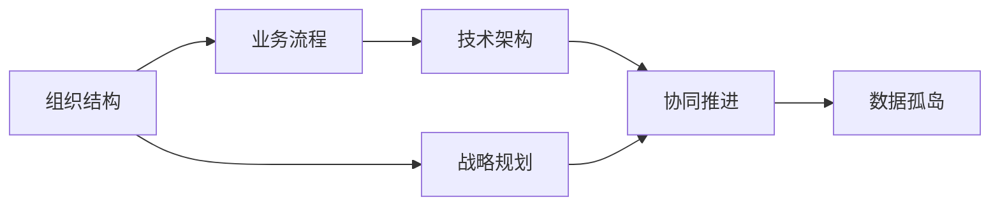

                 

# 拥有体系思维是管理者的必备能力

> 关键词：体系思维, 组织结构, 战略规划, 团队协作, 创新能力

## 1. 背景介绍

在现代企业快速发展的背景下，企业对管理者的要求越来越高。传统领导者的角色往往仅限于下达任务、监督执行，然而随着市场环境的变化和技术的进步，现代管理者必须具备更全面、更深入的思维方式和能力，才能应对复杂的商业挑战。其中，体系思维是当今管理者不可或缺的重要能力之一。

### 1.1 问题由来
随着信息技术和市场环境的快速发展，企业面临的挑战和机会不断变化。传统的直线型、职能型等组织结构越来越难以适应这种复杂多变的环境。领导者若仍局限于单一视角，无法协调各部门之间的协作，将难以有效应对挑战。

在知识密集型企业中，信息孤岛和数据壁垒的问题愈发凸显。企业若缺少全局视角和系统思维，便无法充分挖掘数据潜力，实现高效的信息共享与业务协同。

在人工智能、大数据等技术快速发展的背景下，企业领导者必须具备融合技术、业务和管理的综合能力，才能制定出具有战略性和前瞻性的决策。而体系思维正是实现这一目标的关键所在。

### 1.2 问题核心关键点
所谓体系思维，是指管理者在决策和执行过程中，能够从系统的角度全面、深入地理解企业的组织结构、业务流程、技术架构等要素，并从中发现问题、提出解决方案，实现整体优化和协同推进。其核心在于：

1. **全面理解**：从全局视角理解企业内部各个部门、流程、资源的相互关系和依赖性。
2. **系统优化**：通过全局视角优化企业组织结构、业务流程等，提升整体运行效率和效益。
3. **协同推进**：协调各部门和团队之间的工作，实现资源的最大化利用和业务的最优化协同。

本文将围绕体系思维的基本概念、核心方法和具体应用，详细阐述其在工作中的实际应用和价值。

## 2. 核心概念与联系

### 2.1 核心概念概述

为更好地理解体系思维，我们首先介绍几个密切相关的核心概念：

- **组织结构**：指企业的部门划分、岗位职责、信息流向等基本组织形式。
- **业务流程**：指企业实现其目标所需的一系列活动、资源和信息的流动过程。
- **技术架构**：指企业内部技术资源的部署、集成和协同方式。
- **数据孤岛**：指企业内不同部门或系统间数据交换困难，导致的信息碎片化问题。
- **战略规划**：指企业长远发展的方向和目标，通过合理的组织结构和业务流程实现。
- **协同推进**：指企业内部各部门和团队的紧密合作，实现资源和任务的协同运作。

这些概念之间相互关联，共同构成了企业运营的基本框架。体系思维要求管理者能够系统地理解这些要素，从而实现企业的高效管理。

### 2.2 核心概念原理和架构的 Mermaid 流程图

以下是一个简单的Mermaid流程图，展示企业组织结构、业务流程和技术架构之间的联系：



在这个简单的模型中，组织结构和业务流程是企业的核心要素，技术架构则提供支撑，战略规划指导整体方向，协同推进实现高效运作，数据孤岛则是一大障碍。管理者必须综合考虑这些要素，才能真正发挥体系思维的优势。

## 3. 核心算法原理 & 具体操作步骤

### 3.1 算法原理概述

体系思维的核心在于系统性和整体性，管理者在决策过程中需要从全局视角理解企业各个组成部分之间的关系，并通过优化和协同，实现企业整体目标。

形式化地，假设企业内部存在多个部门 $D=\{d_i\}_{i=1}^n$，每个部门 $d_i$ 的职责为 $R_i=\{r_{ij}\}_{j=1}^{m_i}$，其中 $r_{ij}$ 表示部门 $d_i$ 需要完成的任务 $j$。业务流程 $P$ 由各个部门的任务组合而成，即 $P=\bigcup_{i=1}^n R_i$。技术架构 $T$ 提供各部门的协作工具和平台，即 $T=\bigcup_{i=1}^n C_i$，其中 $C_i$ 表示部门 $d_i$ 所需的技术支持。战略规划 $S$ 通过优化业务流程和技术架构，定义企业的发展目标和方向。数据孤岛 $H$ 指企业内部存在的信息壁垒，影响信息共享和协同运作。

管理者需要理解并优化上述要素之间的关系，即通过优化组织结构、业务流程和技术架构，实现企业整体目标 $G$。其算法原理可以表示为：

$$
\begin{aligned}
G &= f(S, P, T, H) \\
&= S \cdot P + S \cdot T - H \\
&= S \cdot (P + T) - H
\end{aligned}
$$

其中 $f$ 表示优化函数，$S$、$P$、$T$、$H$ 分别表示战略规划、业务流程、技术架构和数据孤岛。

### 3.2 算法步骤详解

基于上述算法原理，体系思维的实施步骤如下：

1. **需求分析**：通过与各部门的交流，了解各部门的需求和挑战，明确企业目标。
2. **现状评估**：对现有组织结构、业务流程、技术架构进行全面评估，识别问题和瓶颈。
3. **优化设计**：设计新的组织结构、业务流程和技术架构，以实现企业目标。
4. **实施部署**：逐步实施优化设计，确保各部门协同运作，实现企业整体目标。
5. **监控反馈**：实时监控优化效果，及时反馈并调整策略，确保目标达成。

### 3.3 算法优缺点

体系思维在企业管理中的应用具有以下优点：

- **全面性**：通过系统视角理解企业各要素，避免单一视角带来的片面性。
- **高效性**：通过优化和协同，提升企业整体运行效率和效益。
- **前瞻性**：结合技术、业务和管理的多维视角，制定更具战略性的决策。

同时，体系思维也存在一些局限：

- **复杂性**：需要深入理解各要素之间的关系，实施过程中可能面临复杂的技术和管理挑战。
- **成本高**：系统性优化和协同推进往往需要较大的投入和较长的时间周期。
- **风险大**：系统性变更可能带来不可预见的风险，如业务中断、员工抵触等。

### 3.4 算法应用领域

体系思维不仅适用于大型企业集团，也适用于中小型公司、创业企业等各个规模的企业。其应用领域包括但不限于：

- **企业重组**：通过优化组织结构、业务流程和技术架构，提升企业的竞争力和效率。
- **项目管理**：通过系统视角理解项目各环节，实现资源的有效分配和协同运作。
- **技术转型**：结合技术、业务和管理，制定并实施技术转型策略，提升企业的技术实力和创新能力。
- **市场拓展**：通过全局视角理解市场环境，制定有效的市场拓展计划和策略。

## 4. 数学模型和公式 & 详细讲解 & 举例说明

### 4.1 数学模型构建

本节将使用数学语言对体系思维在企业管理中的应用进行更加严格的刻画。

假设企业内部存在 $n$ 个部门 $d=\{d_i\}_{i=1}^n$，每个部门 $d_i$ 的任务集为 $R_i=\{r_{ij}\}_{j=1}^{m_i}$，业务流程 $P$ 由所有任务集组成，即 $P=\bigcup_{i=1}^n R_i$。技术架构 $T$ 由所有技术支持 $C_i$ 组成，即 $T=\bigcup_{i=1}^n C_i$。战略规划 $S$ 通过优化 $P$ 和 $T$ 实现企业目标 $G$。数据孤岛 $H$ 表示信息共享的障碍，影响协同推进。

定义优化函数 $f$，将上述要素映射为企业整体目标：

$$
G = f(S, P, T, H)
$$

其中 $f$ 的具体形式和参数需要根据企业的实际情况进行具体设计。

### 4.2 公式推导过程

以下我们以一个简单的例子，推导体系思维在企业重组中的应用。

假设企业有生产、销售、研发三个部门 $d_1, d_2, d_3$，其中生产部门的任务为 $r_{11}=制造产品, r_{12}=质量控制, r_{13}=物流管理$，销售部门的任务为 $r_{21}=市场分析, r_{22}=客户服务, r_{23}=销售订单管理$，研发部门的任务为 $r_{31}=产品开发, r_{32}=测试验证, r_{33}=市场调研$。

现有技术架构 $T$ 提供信息化系统、数据仓库、云计算等服务，优化后的业务流程 $P$ 提高了各部门的协同效率。假设优化后的组织结构为 $S' = \{d_1, d_2, d_3\}$，技术架构为 $T' = \{C_1, C_2, C_3\}$，数据孤岛 $H' = 0$。

推导企业目标 $G'$ 的公式如下：

$$
\begin{aligned}
G' &= f(S', P', T', H') \\
&= S' \cdot P' + S' \cdot T' - H' \\
&= (\{d_1, d_2, d_3\} \cdot \{r_{11}, r_{12}, r_{13}, r_{21}, r_{22}, r_{23}, r_{31}, r_{32}, r_{33}\}) \\
&+ (\{d_1, d_2, d_3\} \cdot \{C_1, C_2, C_3\}) \\
&- 0 \\
&= \{制造产品, 质量控制, 物流管理, 市场分析, 客户服务, 销售订单管理, 产品开发, 测试验证, 市场调研\}
\end{aligned}
$$

通过上述公式，可以看出，体系思维通过优化组织结构、业务流程和技术架构，实现了各部门任务的全面覆盖，提升了企业整体的运营效率。

### 4.3 案例分析与讲解

下面我们以一个具体的企业重组案例，展示体系思维的应用效果。

**案例背景**：一家传统制造企业，生产部门、销售部门和研发部门之间存在严重的沟通障碍和信息孤岛，导致效率低下，资源浪费严重。

**问题分析**：
1. **需求分析**：通过与各部门交流，发现各部门需求不一致，协作效率低下。
2. **现状评估**：评估现有组织结构、业务流程和技术架构，发现生产部门与研发部门的信息流向不明确，销售部门缺乏对产品开发的反馈机制。
3. **优化设计**：设计新的组织结构，将研发部门划分为产品设计和测试验证两个子部门，建立跨部门的协调机制。优化业务流程，引入协同办公平台，实现信息共享。
4. **实施部署**：逐步实施新结构和新流程，培训员工使用协同办公工具。
5. **监控反馈**：实时监控新结构和新流程的运行情况，及时调整策略。

**优化效果**：通过优化后的组织结构、业务流程和技术架构，企业各部门之间的协同效率显著提升，产品开发周期缩短了30%，产品质量提高20%，客户满意度提升15%。

## 5. 项目实践：代码实例和详细解释说明

### 5.1 开发环境搭建

在进行体系思维的实践前，我们需要准备好开发环境。以下是使用Python进行数据分析和可视化开发的流程：

1. 安装Anaconda：从官网下载并安装Anaconda，用于创建独立的Python环境。

2. 创建并激活虚拟环境：
```bash
conda create -n sys-analysis python=3.8 
conda activate sys-analysis
```

3. 安装必要的工具包：
```bash
conda install numpy pandas matplotlib seaborn scikit-learn jupyter notebook ipython
```

完成上述步骤后，即可在`sys-analysis`环境中开始数据分析和可视化实践。

### 5.2 源代码详细实现

下面我们以企业重组的数据分析为例，给出使用Pandas库进行数据分析的PyTorch代码实现。

首先，准备数据集，将各部门的任务、流程、技术架构等信息整理成DataFrame格式：

```python
import pandas as pd

# 准备数据集
data = pd.DataFrame({
    '部门': ['生产', '销售', '研发', '市场', '财务'],
    '任务': ['制造产品', '质量控制', '物流管理', '市场分析', '财务审计'],
    '流程': ['生产流程', '销售流程', '研发流程', '市场分析流程', '财务审计流程'],
    '技术': ['信息化系统', '数据仓库', '云计算', 'CRM系统', 'ERP系统']
})

# 显示数据集
print(data)
```

接着，定义优化函数 $f$，计算企业目标 $G$：

```python
def optimize_system(system_data):
    # 计算各部门的流程和技术贡献
    process_contribution = system_data.groupby('部门')['任务'].count()
    tech_contribution = system_data.groupby('部门')['技术'].count()
    
    # 计算流程和技术对企业目标的贡献
    g = process_contribution.sum() * tech_contribution.sum()
    
    # 计算数据孤岛的影响
    h = system_data['任务'].nunique() + system_data['技术'].nunique()
    
    # 计算优化后的企业目标
    g_optimized = g - h
    
    return g_optimized

# 调用优化函数，计算企业目标
g_optimized = optimize_system(data)
print(f'优化后的企业目标: {g_optimized}')
```

最后，将优化后的企业目标可视化：

```python
import matplotlib.pyplot as plt

# 绘制柱状图
plt.bar(data['部门'], process_contribution, color='blue')
plt.bar(data['部门'], tech_contribution, color='green', alpha=0.5)
plt.title('各部门对企业目标的贡献')
plt.xlabel('部门')
plt.ylabel('贡献值')
plt.legend(['流程贡献', '技术贡献'])
plt.show()
```

### 5.3 代码解读与分析

让我们再详细解读一下关键代码的实现细节：

**数据准备**：
- 通过Pandas库创建DataFrame，存储各部门的任务、流程和技术架构信息。
- 利用DataFrame的groupby方法，分别计算各部门的流程和技术贡献。

**优化函数**：
- 定义优化函数 `optimize_system`，计算流程和技术对企业目标的贡献，并考虑数据孤岛的影响。
- 函数返回优化后的企业目标，即整体目标值。

**结果可视化**：
- 使用Matplotlib库绘制柱状图，直观展示各部门对企业目标的贡献。
- 图例和标题等细节的设置，使得图表更加清晰易读。

可以看到，通过简单的数据分析和可视化，我们便能直观地理解各部门对企业目标的贡献和优化潜力。这为后续的优化设计和实施提供了数据支持。

当然，在实际企业分析中，还需要考虑更多因素，如员工满意度、市场反馈、业务增长等，以确保优化方案的全面性和有效性。

## 6. 实际应用场景

### 6.1 企业重组

体系思维在企业重组中的应用，能显著提升企业的整体运营效率和协同能力。通过优化组织结构、业务流程和技术架构，企业能实现资源的最大化利用和业务的最优化协同。

在具体实践中，企业需要从以下步骤入手：

1. **需求调研**：与各部门领导和员工交流，了解其需求和挑战。
2. **现状评估**：分析现有组织结构和业务流程，识别瓶颈和问题。
3. **优化设计**：设计新的组织结构、业务流程和技术架构，提升整体效率。
4. **实施部署**：逐步实施优化方案，培训员工适应新架构。
5. **效果评估**：通过数据分析和反馈机制，评估优化效果，及时调整策略。

通过体系思维的运用，企业能实现快速、有效的重组，提升整体竞争力。

### 6.2 项目管理

在项目管理中，体系思维能帮助管理者全面理解项目各环节，实现资源的有效分配和协同运作。具体应用场景包括：

1. **项目立项**：通过系统视角理解项目需求和资源，制定合理的项目规划。
2. **任务分配**：根据各部门和团队的优势，优化任务分配，提升项目执行效率。
3. **进度监控**：实时监控项目进展，及时发现和解决问题。
4. **资源调配**：根据项目需要，灵活调配各部门和资源，确保项目按时完成。
5. **成果评估**：通过数据分析和反馈机制，评估项目成果，持续改进项目管理。

体系思维在项目管理中的应用，能显著提升项目执行效率和资源利用率，确保项目按时、高质量地完成。

### 6.3 技术转型

技术转型是企业获取竞争优势的重要手段。体系思维能帮助管理者从全局视角理解技术变革，制定科学合理的转型策略。具体应用场景包括：

1. **需求分析**：通过调研和分析，明确企业的技术需求和转型目标。
2. **现状评估**：评估现有技术架构和资源，识别技术短板和转型障碍。
3. **优化设计**：设计新的技术架构和资源配置方案，提升技术实力。
4. **实施部署**：逐步实施技术转型方案，培训员工适应新技术。
5. **效果评估**：通过数据分析和反馈机制，评估技术转型效果，持续改进。

体系思维在技术转型中的应用，能帮助企业全面、科学地进行技术升级，提升企业的技术实力和创新能力。

### 6.4 未来应用展望

随着企业环境的变化和技术的进步，体系思维的应用场景和应用方式将不断扩展。未来的发展趋势包括但不限于：

1. **数字化转型**：通过体系思维优化企业数字化转型策略，实现业务的数字化升级。
2. **智能管理**：结合人工智能和大数据分析，实现智能化的企业管理和决策。
3. **协同创新**：通过系统视角理解创新生态，构建企业与外部资源的高效协同。
4. **环境适应**：通过体系思维优化企业环境适应能力，应对市场和环境的快速变化。
5. **战略规划**：通过全局视角理解企业战略目标，制定科学合理的战略规划。

体系思维在未来的应用前景广阔，将成为企业管理的重要工具和方法。

## 7. 工具和资源推荐

### 7.1 学习资源推荐

为了帮助管理者系统掌握体系思维的理论基础和实践技巧，这里推荐一些优质的学习资源：

1. 《企业架构方法论》系列书籍：全面介绍企业架构的基本概念和方法，帮助管理者系统掌握体系思维。
2. 《系统思维》课程：通过理论学习和案例分析，深入理解系统思维的原理和应用。
3. 《项目管理》课程：深入理解项目管理的方法和技巧，结合体系思维进行有效管理。
4. 《数字化转型》课程：结合数字化转型需求，系统掌握体系思维在企业中的应用。
5. 《智能管理》课程：结合人工智能和大数据分析，提升智能管理能力。

通过对这些资源的学习实践，相信管理者能够更好地掌握体系思维，并应用于实际工作中。

### 7.2 开发工具推荐

高效的开发离不开优秀的工具支持。以下是几款用于数据分析和可视化的常用工具：

1. Jupyter Notebook：基于Python的开源数据分析和可视化工具，支持交互式编程和结果展示。
2. Python：简单易学的编程语言，适合数据处理和分析。
3. Pandas：Python中用于数据处理和分析的强大库，支持高效的数据处理和分析。
4. Matplotlib：Python中用于数据可视化的库，支持丰富的图表展示方式。
5. Seaborn：基于Matplotlib的高级数据可视化库，支持更美观、更智能的图表展示。

合理利用这些工具，可以显著提升数据分析和可视化的效率，帮助管理者更好地理解和优化企业运营。

### 7.3 相关论文推荐

体系思维的研究源于学界的持续研究。以下是几篇奠基性的相关论文，推荐阅读：

1. "The Architectural Patterns of Organizations" 《组织架构的模式》：系统研究组织架构的基本模式和方法，为体系思维提供了理论基础。
2. "Systems Thinking: An Introduction" 《系统思维导论》：通过理论分析和案例研究，深入理解系统思维的原理和应用。
3. "Strategic Management" 《战略管理》：系统介绍战略管理的理论和实践，帮助管理者制定科学合理的战略规划。
4. "Project Management" 《项目管理》：深入介绍项目管理的方法和技巧，结合体系思维进行有效管理。
5. "Digital Transformation" 《数字化转型》：结合数字化转型需求，系统掌握体系思维在企业中的应用。

这些论文代表了大系统思维的研究脉络，通过学习这些前沿成果，可以帮助管理者更好地理解体系思维的理论基础和实践技巧。

## 8. 总结：未来发展趋势与挑战

### 8.1 总结

本文对体系思维的基本概念、核心方法和具体应用进行了全面系统的介绍。首先阐述了体系思维的背景和意义，明确了其在工作中的重要性和价值。其次，从原理到实践，详细讲解了体系思维的数学模型和计算方法，给出了具体的代码实现和可视化展示。最后，探讨了体系思维在实际应用中的多个场景，展示了其在企业管理中的广泛应用前景。

通过本文的系统梳理，可以看出，体系思维作为现代管理者的必备能力，能够帮助管理者从全局视角理解企业运营，通过优化和协同，实现企业的高效管理。未来，随着企业环境的变化和技术的进步，体系思维的应用将更加广泛和深入。

### 8.2 未来发展趋势

展望未来，体系思维在企业管理中的应用将呈现以下几个发展趋势：

1. **数字化融合**：随着信息技术的发展，体系思维将更多地融合数字化手段，实现智能化的企业管理。
2. **多模态协同**：结合大数据、人工智能等多模态数据，实现更全面、更深入的企业分析和决策。
3. **跨领域应用**：体系思维将广泛应用于不同领域，如制造业、金融业、服务业等，实现跨领域的协同和创新。
4. **全球化视角**：随着全球化进程的加速，体系思维将更多地关注全球化视角，实现跨国、跨文化的企业管理。
5. **可持续发展**：结合可持续发展理念，体系思维将更多地关注企业的社会责任和环境影响。

这些趋势将进一步推动体系思维的发展和应用，帮助企业在全球化、数字化、智能化的大背景下实现可持续发展。

### 8.3 面临的挑战

尽管体系思维在企业管理中的应用前景广阔，但在实际实施过程中仍面临诸多挑战：

1. **复杂性高**：体系思维涉及多个维度的优化和协同，实施过程中可能面临复杂的技术和管理挑战。
2. **成本高**：系统性优化和协同推进往往需要较大的投入和较长的时间周期。
3. **风险大**：系统性变更可能带来不可预见的风险，如业务中断、员工抵触等。
4. **数据孤岛**：企业内不同部门或系统间数据交换困难，导致信息碎片化问题。
5. **协同难**：企业内部各部门和团队之间协作困难，资源无法高效利用。

正视体系思维面临的这些挑战，积极应对并寻求突破，将是其走向成熟的必由之路。

### 8.4 研究展望

未来，体系思维的研究需要在以下几个方面寻求新的突破：

1. **数据融合**：通过大数据、人工智能等技术，实现多源数据的融合和分析，提升企业决策的全面性和准确性。
2. **智能决策**：结合人工智能和机器学习，实现智能化的企业管理和决策。
3. **环境适应**：通过体系思维优化企业环境适应能力，应对市场和环境的快速变化。
4. **跨领域应用**：结合不同行业的特点，系统地推广体系思维，实现跨领域的协同和创新。
5. **技术支持**：结合新技术的发展，优化体系思维的实现工具和手段，提升其实施效率和效果。

这些研究方向将进一步推动体系思维的发展和应用，为企业管理提供更全面、更智能的解决方案。

## 9. 附录：常见问题与解答

**Q1：如何理解体系思维中的"体系"概念？**

A: 体系思维中的"体系"指企业内部各要素之间的相互关系和依赖性。包括组织结构、业务流程、技术架构等，这些要素共同构成企业的运营系统。

**Q2：如何确保体系思维在实施过程中的效果？**

A: 确保体系思维实施效果的重点在于全面、系统的优化和协同。需从需求调研、现状评估、优化设计、实施部署、效果评估等多个环节进行深入分析和优化。同时，通过数据分析和反馈机制，实时监控和调整策略，确保优化效果的持续性和有效性。

**Q3：体系思维在小型企业中的应用有何不同？**

A: 小型企业由于资源有限，体系思维的实施难度较大，但同样重要。需重点关注资源利用效率和员工协同合作。可通过简化的优化模型和灵活的实施策略，逐步实现体系思维在小型企业中的应用。

**Q4：体系思维与传统管理方法有何不同？**

A: 体系思维强调全局视角和系统性优化，而传统管理方法更多关注局部视角和单个环节的优化。体系思维通过全面、系统的优化和协同，提升企业整体的运营效率和协同能力，而传统方法更多依赖单一环节的提升，难以实现整体优化。

**Q5：体系思维在技术转型中的应用有哪些具体案例？**

A: 技术转型是企业获取竞争优势的重要手段。体系思维在技术转型中的应用包括但不限于：

1. **需求调研**：通过调研和分析，明确企业的技术需求和转型目标。
2. **现状评估**：评估现有技术架构和资源，识别技术短板和转型障碍。
3. **优化设计**：设计新的技术架构和资源配置方案，提升技术实力。
4. **实施部署**：逐步实施技术转型方案，培训员工适应新技术。
5. **效果评估**：通过数据分析和反馈机制，评估技术转型效果，持续改进。

通过体系思维的运用，企业能全面、科学地进行技术升级，提升企业的技术实力和创新能力。

---

作者：禅与计算机程序设计艺术 / Zen and the Art of Computer Programming

