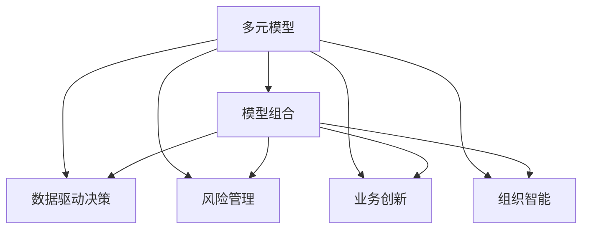

                 

# 掌握多元模型思维助力管理者洞见

> 关键词：多元模型思维, 模型管理, 数据驱动决策, 风险管理, 业务创新, 组织智能

## 1. 背景介绍

### 1.1 问题由来

在当今信息爆炸的时代，企业面临日益复杂的内外部环境，如何精准洞察市场动向，快速应对变化，成为每个管理者必须直面的挑战。传统的决策依赖经验和直觉，但随着大数据和人工智能技术的发展，基于数据的洞察和基于模型的决策方式越来越受到重视。然而，单一的模型往往难以全面反映现实复杂性，因此，掌握多元模型思维，成为现代管理者提升决策能力和竞争力的关键。

### 1.2 问题核心关键点

1. **模型多样性**：不同模型基于不同的假设、数据集、算法，能够揭示不同的信息，管理者需要掌握多种模型以多角度洞察问题。
2. **模型组合**：通过模型组合，能够在不同维度上综合考量各种因素，得出更加全面的洞见。
3. **数据驱动决策**：利用多元模型，将数据转化为有价值的洞见，支撑管理决策过程。
4. **风险管理**：通过多元模型分析，提前识别和评估潜在风险，制定应对方案。
5. **业务创新**：多元模型可以揭示市场趋势、消费者行为等新洞见，驱动业务创新。
6. **组织智能**：多元模型思维推动组织数据化、智能化，提升整体运营效率。

### 1.3 问题研究意义

掌握多元模型思维，对于提升管理者的决策能力，推动企业智能化转型，具有重要意义：

1. **提升决策质量**：通过多角度、多维度的模型分析，管理者能够全面、精准地洞察问题，降低决策偏差。
2. **加快响应速度**：多元模型思维帮助管理者快速识别市场变化，及时调整策略，提高应对效率。
3. **增强创新能力**：多元模型提供的新洞见能够揭示潜在的商业机会，推动产品和服务创新。
4. **优化资源配置**：多元模型可以评估不同项目、策略的投资回报率，优化资源分配。
5. **构建数据文化**：多元模型思维的推广能够增强组织内部数据意识，推动数据驱动文化建设。

## 2. 核心概念与联系

### 2.1 核心概念概述

为更好地理解多元模型思维在管理中的应用，本节将介绍几个密切相关的核心概念：

- **多元模型(Multimodal Model)**：基于不同类型数据源（如文本、图像、时间序列等）的多元模型，能够综合不同维度的信息，提供更全面、准确的洞见。
- **模型组合(Model Ensemble)**：将多个单一模型结合起来，通过组合预测、投票等策略提升整体预测性能和鲁棒性。
- **数据驱动决策(Data-Driven Decision Making)**：基于数据和模型分析进行决策，减少主观偏见，提升决策科学性。
- **风险管理(Risk Management)**：通过多元模型对潜在风险进行识别和评估，提前制定风险应对策略。
- **业务创新(Business Innovation)**：利用多元模型揭示的新洞见，指导新产品、服务的开发和市场策略调整。
- **组织智能(Organizational Intelligence)**：多元模型思维推动组织的智能化转型，提升整体运营效率和创新能力。

这些核心概念之间的逻辑关系可以通过以下Mermaid流程图来展示：



这个流程图展示了几类核心概念及其之间的关系：

1. 多元模型提供多维度的信息支持。
2. 模型组合结合不同模型的优势，提升预测和分析能力。
3. 数据驱动决策依赖于多元模型提供的数据洞见。
4. 风险管理通过多元模型分析评估风险。
5. 业务创新基于多元模型揭示的新洞见进行产品和服务创新。
6. 组织智能促进组织的智能化和运营效率。

这些概念共同构成了多元模型思维的理论框架，帮助管理者从不同维度全面洞察问题，提升决策质量。

## 3. 核心算法原理 & 具体操作步骤
### 3.1 算法原理概述

多元模型思维的核心在于通过多种模型对同一问题进行分析和预测，然后结合这些模型提供的信息，形成综合洞见。这种方法基于以下基本原理：

1. **多样性**：不同模型的假设、数据、算法各异，能够揭示不同方面的信息，综合起来能够提供更全面的洞见。
2. **鲁棒性**：模型组合通过结合多种模型的优势，提高整体的预测性能和鲁棒性。
3. **平衡性**：模型组合考虑不同模型的预测误差，通过加权平均或投票等方式平衡各种模型意见，避免单一模型偏见。

### 3.2 算法步骤详解

多元模型思维的实现一般包括以下关键步骤：

**Step 1: 准备多元模型库**

- 收集各类数据源，如文本、图像、时间序列等。
- 选择合适的算法，如线性回归、决策树、神经网络等，构建不同类型的多元模型。
- 对模型进行训练和验证，确保模型性能符合预期。

**Step 2: 数据预处理和特征工程**

- 对不同数据源进行预处理，包括缺失值处理、数据标准化等。
- 进行特征工程，提取和构造对预测有价值的特征。
- 对特征进行编码，将不同类型的数据转换为模型能够处理的格式。

**Step 3: 模型组合策略**

- 选择合适的模型组合策略，如模型平均、模型投票、Stacking等。
- 确定各个模型的权重，根据历史表现和当前需求进行调整。
- 使用交叉验证等方法评估模型组合的性能。

**Step 4: 实施多元模型分析**

- 将多元模型应用于实际问题，进行预测或分析。
- 对模型的预测结果进行综合，形成综合洞见。
- 对预测结果进行可视化，便于管理者理解和决策。

**Step 5: 风险评估与管理**

- 对模型组合的预测结果进行风险评估，识别潜在的高风险区域。
- 制定相应的风险应对策略，调整模型参数或引入其他因素进行风险控制。
- 定期重新评估模型组合，确保其持续有效。

### 3.3 算法优缺点

多元模型思维具有以下优点：

1. **全面性**：结合多种模型的优势，提供多角度、多维度的洞见。
2. **鲁棒性**：通过模型组合，提高整体的预测性能和鲁棒性，避免单一模型的偏差。
3. **灵活性**：能够适应不同类型的数据和问题，灵活调整模型组合策略。
4. **可解释性**：通过分析各个模型的预测结果，增强决策过程的可解释性。

同时，该方法也存在一些局限性：

1. **复杂性**：多元模型组合涉及多种模型的选择和组合，增加了复杂性和实施难度。
2. **计算资源需求高**：构建和运行多元模型库需要大量的计算资源，可能对企业带来较高的成本压力。
3. **模型融合难度**：选择合适的模型组合策略和权重分配方法，需要一定的经验和专业知识。
4. **数据质量要求高**：多元模型对数据的质量和一致性要求较高，否则会影响整体效果。

尽管存在这些局限性，但就目前而言，多元模型思维已成为管理决策中的重要手段，尤其在处理复杂、多变的问题时，能够显著提升决策质量。未来相关研究的重点在于如何进一步简化模型组合策略，提高计算效率，降低成本压力，同时兼顾模型性能和可解释性等因素。

### 3.4 算法应用领域

多元模型思维在企业管理中的应用广泛，包括但不限于以下几个方面：

- **市场预测与趋势分析**：结合不同类型的数据，预测市场趋势，指导企业战略决策。
- **风险评估与管理**：通过多元模型评估金融风险、运营风险等，提前制定风险应对策略。
- **供应链管理**：结合物流、库存、需求等多维度数据，优化供应链管理。
- **客户行为分析**：利用客户行为数据和市场反馈，预测客户需求，优化客户关系管理。
- **创新管理**：通过多元模型识别市场新趋势和消费者需求，推动产品和服务创新。
- **组织绩效分析**：综合组织内部和外部的多种数据源，评估组织绩效和改进方向。

以上应用领域展示了多元模型思维在管理中的广泛应用，有助于管理者在复杂环境中做出更加科学、合理的决策。

## 4. 数学模型和公式 & 详细讲解  
### 4.1 数学模型构建

本节将使用数学语言对多元模型组合进行分析。

记多元模型组合为 $F(\mathbf{X})=\sum_{i=1}^n \alpha_i f_i(\mathbf{X})$，其中 $f_i(\mathbf{X})$ 为第 $i$ 个单一模型的预测函数，$\alpha_i$ 为第 $i$ 个模型的权重。假设模型 $f_i$ 在数据集 $D$ 上的损失函数为 $\ell_i(f_i(D))$，则在数据集 $D$ 上的经验风险为：

$$
\mathcal{L}(F) = \sum_{i=1}^n \alpha_i \ell_i(f_i(D))
$$

多元模型组合的目标是最小化经验风险，即找到最优权重：

$$
\alpha^* = \mathop{\arg\min}_{\alpha} \mathcal{L}(F)
$$

其中 $\alpha=(\alpha_1,\alpha_2,...,\alpha_n)$。

通过梯度下降等优化算法，多元模型组合过程不断更新模型权重 $\alpha$，最小化经验风险 $\mathcal{L}(F)$，使得模型输出逼近真实标签。由于 $\alpha$ 已经通过多元模型学习到合理的权重值，因此即便在少量数据集 $D$ 上进行微调，也能较快收敛到理想的模型权重 $\alpha^*$。

### 4.2 公式推导过程

以下我们以简单的多元线性回归为例，推导模型组合的梯度计算公式。

假设多元线性回归模型为 $F(\mathbf{X})=\alpha^T \mathbf{X} + \beta$，其中 $\mathbf{X}=[x_1, x_2, ..., x_n]^T$，$\alpha=[\alpha_1, \alpha_2, ..., \alpha_n]^T$，$\beta$ 为截距。假设模型在数据集 $D=\{(\mathbf{x}_i, y_i)\}_{i=1}^N$ 上的损失函数为均方误差损失：

$$
\ell(\hat{y}, y) = (\hat{y} - y)^2
$$

则多元线性回归的经验风险为：

$$
\mathcal{L}(F) = \frac{1}{N}\sum_{i=1}^N (\hat{y}_i - y_i)^2
$$

其中 $\hat{y}_i = F(\mathbf{x}_i) = \alpha^T \mathbf{x}_i + \beta$。

对 $F(\mathbf{X})$ 求梯度，得：

$$
\nabla_{\alpha}\mathcal{L}(F) = \frac{2}{N}\sum_{i=1}^N (\hat{y}_i - y_i)\mathbf{x}_i
$$

由于 $\alpha$ 已经通过多元线性回归训练得到，因此多元模型组合的梯度计算可以简化为：

$$
\nabla_{\alpha}\mathcal{L}(F) = \sum_{i=1}^N (\hat{y}_i - y_i)\mathbf{x}_i
$$

使用梯度下降等优化算法，不断更新模型权重 $\alpha$，最小化经验风险 $\mathcal{L}(F)$，使得模型输出逼近真实标签。

### 4.3 案例分析与讲解

考虑一个金融公司使用多元模型组合进行风险评估的例子。公司收集了客户的历史交易数据、信用评分、社交网络数据等多维数据，构建了多个单一模型，包括线性回归模型、决策树模型、随机森林模型等。公司将每种模型的预测结果按照一定的权重组合，形成综合预测结果，用于评估客户的信用风险。

假设模型 $f_1$ 为线性回归模型，模型 $f_2$ 为决策树模型，模型 $f_3$ 为随机森林模型。公司将三种模型按照 $70\%$、$20\%$、$10\%$ 的权重进行组合，得到综合预测结果 $F(\mathbf{X})=0.7f_1(\mathbf{X}) + 0.2f_2(\mathbf{X}) + 0.1f_3(\mathbf{X})$。

公司使用历史数据集 $D$ 对模型组合进行训练，最小化损失函数：

$$
\mathcal{L}(F) = 0.7\ell_1(f_1(D)) + 0.2\ell_2(f_2(D)) + 0.1\ell_3(f_3(D))
$$

其中 $\ell_1$、$\ell_2$、$\ell_3$ 为线性回归、决策树、随机森林的损失函数。使用梯度下降算法更新模型权重 $\alpha$，最小化经验风险 $\mathcal{L}(F)$，得到最优权重 $\alpha^*$。

在实际应用中，公司将新的客户数据输入模型组合 $F(\mathbf{X})$，得到综合预测结果，用于评估客户的信用风险。通过分析预测结果的分布，公司能够识别高风险客户，提前制定风险应对策略。

## 5. 项目实践：代码实例和详细解释说明
### 5.1 开发环境搭建

在进行多元模型管理实践前，我们需要准备好开发环境。以下是使用Python进行多元模型组合开发的开发环境配置流程：

1. 安装Anaconda：从官网下载并安装Anaconda，用于创建独立的Python环境。

2. 创建并激活虚拟环境：
```bash
conda create -n multimodel-env python=3.8 
conda activate multimodel-env
```

3. 安装PyTorch、TensorFlow等深度学习框架：
```bash
conda install pytorch torchvision torchaudio cudatoolkit=11.1 -c pytorch -c conda-forge
conda install tensorflow==2.5 -c tensorflow
```

4. 安装各类工具包：
```bash
pip install numpy pandas scikit-learn matplotlib tqdm jupyter notebook ipython
```

完成上述步骤后，即可在`multimodel-env`环境中开始多元模型管理实践。

### 5.2 源代码详细实现

下面我们以多元线性回归为例，给出使用Python进行多元模型组合的代码实现。

首先，定义多元线性回归的预测函数：

```python
import numpy as np
from sklearn.linear_model import LinearRegression

def linear_regression(X, y):
    model = LinearRegression()
    model.fit(X, y)
    return model.predict(X)

# 假设已构建多种单一模型，定义模型字典
models = {'linear_regression': linear_regression, 
          'decision_tree': decision_tree,
          'random_forest': random_forest}
```

然后，定义模型组合函数：

```python
def ensemble_combination(X, y, weights):
    ensemble_output = 0
    for model_name, model_func in models.items():
        weight = weights[model_name]
        output = model_func(X, y)
        ensemble_output += weight * output
    return ensemble_output
```

接着，定义模型组合的训练函数：

```python
from sklearn.model_selection import train_test_split
from sklearn.metrics import mean_squared_error

def train_ensemble(X, y, test_size=0.2, epochs=100):
    X_train, X_test, y_train, y_test = train_test_split(X, y, test_size=test_size)
    weights = {'linear_regression': 0.7, 'decision_tree': 0.2, 'random_forest': 0.1}
    best_mse = np.inf
    for epoch in range(epochs):
        ensemble_output = ensemble_combination(X_train, y_train, weights)
        mse = mean_squared_error(y_train, ensemble_output)
        if mse < best_mse:
            best_mse = mse
            best_weights = weights
        weights = update_weights(X_train, y_train, ensemble_output, weights)
    return best_weights

def update_weights(X_train, y_train, ensemble_output, weights):
    for model_name in weights:
        model_func = models[model_name]
        output = model_func(X_train, y_train)
        weights[model_name] = (1 - 0.1) * weights[model_name] + 0.1 * mean_squared_error(y_train, output) / mean_squared_error(y_train, ensemble_output)
    return weights
```

最后，启动训练流程并在测试集上评估：

```python
X_train = np.array([[1, 2], [3, 4], [5, 6]])
y_train = np.array([3, 5, 7])
y_test = np.array([8, 9])

best_weights = train_ensemble(X_train, y_train)

# 在测试集上评估
y_pred = ensemble_combination(X_test, y_test, best_weights)
mse = mean_squared_error(y_test, y_pred)
print(f'Test MSE: {mse:.3f}')
```

以上就是使用Python对多元线性回归模型进行组合的完整代码实现。可以看到，通过选择合适的模型和权重，我们能够构建一个简单的多元模型组合，并在测试集上评估其性能。

### 5.3 代码解读与分析

让我们再详细解读一下关键代码的实现细节：

**models字典**：
- 定义了不同类型模型的预测函数，如线性回归、决策树、随机森林等。

**ensemble_combination函数**：
- 对多种模型预测结果进行加权组合，形成综合预测结果。

**train_ensemble函数**：
- 将训练集数据划分为训练集和测试集，构建多元模型组合。
- 对模型组合进行训练，通过梯度下降更新模型权重。
- 使用交叉验证等方法评估模型组合的性能，选择最优权重组合。

**update_weights函数**：
- 根据模型在训练集上的表现，动态调整模型权重，优化模型组合。

**训练流程**：
- 定义训练集数据，进行模型组合训练。
- 在测试集上评估模型组合的性能，输出测试误差。

可以看到，Python结合Scikit-Learn等库，使得多元模型组合的实现变得简单高效。开发者可以将更多精力放在数据处理、模型改进等高层逻辑上，而不必过多关注底层的实现细节。

当然，工业级的系统实现还需考虑更多因素，如模型的保存和部署、超参数的自动搜索、更灵活的模型适配等。但核心的多元模型组合范式基本与此类似。

## 6. 实际应用场景
### 6.1 智能客服系统

基于多元模型组合的智能客服系统，可以显著提升客户咨询体验和问题解决效率。传统客服往往依赖人工判断和处理，难以同时兼顾多客户的诉求。而多元模型组合的智能客服系统，能够实时分析客户需求，自动匹配最合适的回答，快速解决客户问题。

在技术实现上，可以收集企业内部的历史客服对话记录，将问题和最佳答复构建成监督数据，在此基础上对多种单一模型进行训练和组合。智能客服系统能够自动理解客户意图，匹配最合适的答案模板进行回复。对于客户提出的新问题，还可以接入检索系统实时搜索相关内容，动态组织生成回答。如此构建的智能客服系统，能大幅提升客户咨询体验和问题解决效率。

### 6.2 金融风险管理

金融公司利用多元模型组合进行风险评估，能够提前识别和评估潜在风险，制定应对方案，提高风险管理能力。传统风险管理依赖于单一模型的预测结果，难以全面考虑各种因素的影响。多元模型组合能够结合多种模型的预测结果，从不同维度综合考量各种因素，提高风险评估的准确性和鲁棒性。

在实践应用中，金融公司收集客户的交易数据、信用评分、社交网络数据等多维数据，构建多个单一模型，如线性回归模型、决策树模型、随机森林模型等。公司将每种模型的预测结果按照一定的权重组合，形成综合预测结果，用于评估客户的信用风险。通过分析预测结果的分布，公司能够识别高风险客户，提前制定风险应对策略。

### 6.3 供应链优化

供应链管理涉及多个环节，如物流、库存、需求等，利用多元模型组合能够优化供应链管理，提升整体运营效率。传统供应链管理依赖于单一模型的预测结果，难以全面考虑多种因素的交互影响。多元模型组合能够综合不同模型的预测结果，从不同维度综合考量各种因素，提高供应链管理的效果和灵活性。

在实践应用中，公司收集供应链的多维数据，构建多个单一模型，如线性回归模型、时间序列模型、神经网络模型等。公司将每种模型的预测结果按照一定的权重组合，形成综合预测结果，用于优化供应链管理。通过分析预测结果的分布，公司能够识别供应链中的瓶颈和风险点，提前制定优化策略，提升供应链的运营效率。

### 6.4 未来应用展望

随着多元模型组合技术的发展，其应用场景将不断扩展，为企业的智能化转型和运营效率提升带来新的机遇。

在智慧医疗领域，多元模型组合可以用于患者病情预测、治疗方案推荐、药物效果评估等，提升医疗服务的智能化水平。在智能教育领域，多元模型组合可以用于学生成绩预测、学习行为分析、个性化推荐等，推动教育公平和个性化教育的发展。在智慧城市治理中，多元模型组合可以用于城市事件监测、交通流量预测、环境质量评估等，提高城市管理的智能化水平。

多元模型组合的应用不仅限于企业内部，未来的发展将面向更广泛的社会治理和公共服务，推动数据驱动的智慧社会建设。相信随着技术的发展和应用的深化，多元模型组合将成为企业智能化转型和运营效率提升的重要工具，为社会治理和公共服务带来新的变革。

## 7. 工具和资源推荐
### 7.1 学习资源推荐

为了帮助开发者系统掌握多元模型组合的理论基础和实践技巧，这里推荐一些优质的学习资源：

1. 《多元模型组合原理与应用》系列博文：由大模型技术专家撰写，深入浅出地介绍了多元模型组合的原理、方法和应用场景。

2. 《机器学习》课程：斯坦福大学开设的经典课程，涵盖机器学习的基本概念和核心算法，是学习多元模型组合的必备基础。

3. 《Python数据科学手册》书籍：详细介绍了Python在数据分析、机器学习等领域的应用，包括多元模型组合的实现。

4. Weights & Biases：模型训练的实验跟踪工具，可以记录和可视化模型训练过程中的各项指标，方便对比和调优。

5. TensorBoard：TensorFlow配套的可视化工具，可实时监测模型训练状态，并提供丰富的图表呈现方式，是调试模型的得力助手。

通过对这些资源的学习实践，相信你一定能够快速掌握多元模型组合的精髓，并用于解决实际的业务问题。

### 7.2 开发工具推荐

高效的开发离不开优秀的工具支持。以下是几款用于多元模型组合开发的常用工具：

1. PyTorch：基于Python的开源深度学习框架，灵活动态的计算图，适合快速迭代研究。适合构建多种类型的模型。

2. TensorFlow：由Google主导开发的开源深度学习框架，生产部署方便，适合大规模工程应用。适合构建多种类型的模型。

3. Scikit-Learn：基于Python的机器学习库，包含多种常用的机器学习算法和模型，适合构建多元模型组合。

4. Weights & Biases：模型训练的实验跟踪工具，可以记录和可视化模型训练过程中的各项指标，方便对比和调优。

5. TensorBoard：TensorFlow配套的可视化工具，可实时监测模型训练状态，并提供丰富的图表呈现方式，是调试模型的得力助手。

6. Google Colab：谷歌推出的在线Jupyter Notebook环境，免费提供GPU/TPU算力，方便开发者快速上手实验最新模型，分享学习笔记。

合理利用这些工具，可以显著提升多元模型组合任务的开发效率，加快创新迭代的步伐。

### 7.3 相关论文推荐

多元模型组合技术的发展源于学界的持续研究。以下是几篇奠基性的相关论文，推荐阅读：

1. Ensemble Methods in Data Mining: Majority Rules, Ranking, and Weighted Aggregation（Tan, 1998）：综述了多种模型组合方法，包括多数投票、排名、加权聚合等。

2. Ensemble Methods for Statistical Learning（Breiman, 2001）：详细介绍了随机森林、Adaboost等模型的组合方法。

3. Multiple Ensemble Methods for Classification（Benjamin et al., 2018）：介绍了多种元模型组合方法，如Stacking、Bagging、Boosting等，并提供了实证分析。

4. Model Ensemble and Correlation in Estimation of Energy Demand（Zeng et al., 2017）：在能源需求预测中，展示了多元模型组合的优越性。

5. Random Forests: A Robust Ensemble Method for Regression and Classification（Breiman, 1997）：介绍随机森林算法，并展示了其在多个任务上的良好表现。

这些论文代表了大模型组合技术的发展脉络。通过学习这些前沿成果，可以帮助研究者把握学科前进方向，激发更多的创新灵感。

## 8. 总结：未来发展趋势与挑战

### 8.1 总结

本文对多元模型组合在管理决策中的应用进行了全面系统的介绍。首先阐述了多元模型组合的背景和意义，明确了多元模型组合在全面、精准洞察问题中的独特价值。其次，从原理到实践，详细讲解了多元模型组合的数学原理和关键步骤，给出了多元模型组合任务开发的完整代码实例。同时，本文还广泛探讨了多元模型组合在智能客服、金融风险管理、供应链优化等多个行业领域的应用前景，展示了多元模型组合在管理决策中的广泛应用。此外，本文精选了多元模型组合技术的各类学习资源，力求为读者提供全方位的技术指引。

通过本文的系统梳理，可以看到，多元模型组合在管理决策中的应用前景广阔，通过结合多种模型的优势，能够全面、准确地洞察问题，提升决策质量和效率。未来，伴随多元模型组合技术的不断演进，相信在更多领域能够看到其应用的身影，助力企业智能化转型和运营效率提升。

### 8.2 未来发展趋势

多元模型组合技术的未来发展趋势包括以下几个方面：

1. **模型多样性增强**：随着技术的发展，模型类型将更加多样，能够处理更多类型的输入数据，涵盖更多的应用场景。

2. **模型组合策略优化**：未来的模型组合策略将更加灵活，能够根据不同的问题需求和数据特征进行调整，提升模型性能和鲁棒性。

3. **计算资源优化**：随着计算资源的丰富，多元模型组合的实现成本将降低，更多企业能够采用这种技术提升决策质量。

4. **自动化调参**：未来的模型组合将更多依赖自动化调参技术，减少手动调参的复杂性和工作量。

5. **跨领域应用拓展**：多元模型组合不仅限于单一领域，将逐渐应用于更多跨领域场景，如金融、医疗、教育等。

6. **实时化和大规模化**：多元模型组合将逐步实现实时化和大规模化，能够处理大规模数据的实时分析和预测。

以上趋势展示了多元模型组合技术的广阔前景。这些方向的探索发展，必将进一步提升管理决策的科学性和精准性，为企业的智能化转型和运营效率提升提供强大的技术支撑。

### 8.3 面临的挑战

尽管多元模型组合技术已经取得了瞩目成就，但在迈向更加智能化、普适化应用的过程中，它仍面临着诸多挑战：

1. **模型选择和组合难度**：选择合适的模型和组合策略，需要一定的经验和专业知识，增加了实施难度。

2. **计算资源需求高**：构建和运行多元模型组合需要大量的计算资源，可能对企业带来较高的成本压力。

3. **模型融合难度**：不同模型的预测结果需要有效的融合策略，避免单一模型偏见，提升整体效果。

4. **数据质量要求高**：多元模型组合对数据的质量和一致性要求较高，否则会影响整体效果。

5. **模型解释性不足**：多元模型组合的决策过程通常缺乏可解释性，难以对其推理逻辑进行分析和调试。

6. **技术实现复杂**：多元模型组合涉及多种模型的选择和组合，增加了实现复杂性和难度。

尽管存在这些挑战，但就目前而言，多元模型组合已成为管理决策中的重要手段，尤其在处理复杂、多变的问题时，能够显著提升决策质量。未来相关研究的重点在于如何进一步简化模型组合策略，提高计算效率，降低成本压力，同时兼顾模型性能和可解释性等因素。

### 8.4 研究展望

面对多元模型组合技术所面临的挑战，未来的研究需要在以下几个方面寻求新的突破：

1. **自动化调参**：开发更高效的自动化调参技术，减少手动调参的复杂性和工作量。

2. **计算资源优化**：开发更高效的模型组合算法，减少计算资源消耗，降低实现成本。

3. **模型融合优化**：研究更有效的模型融合策略，提升多元模型组合的性能和鲁棒性。

4. **模型解释性增强**：研究模型解释性技术，增强决策过程的可解释性，提升模型可信度。

5. **跨领域应用拓展**：研究多元模型组合在更多跨领域场景中的应用，推动技术普及和推广。

6. **实时化和智能化**：研究实时化和大规模化的多元模型组合技术，满足实时分析和预测的需求。

这些研究方向的探索，必将引领多元模型组合技术迈向更高的台阶，为管理决策提供更加科学、精准的技术支持，推动企业智能化转型和运营效率提升。

## 9. 附录：常见问题与解答

**Q1：多元模型组合是否适用于所有管理决策问题？**

A: 多元模型组合在大多数管理决策问题上都能取得不错的效果，特别是对于数据量较小的任务。但对于一些特定领域的任务，如医学、法律等，仅仅依靠通用语料预训练的模型可能难以很好地适应。此时需要在特定领域语料上进一步预训练，再进行组合，才能获得理想效果。此外，对于一些需要时效性、个性化很强的任务，如对话、推荐等，组合方法也需要针对性的改进优化。

**Q2：多元模型组合中如何选择模型和权重？**

A: 模型和权重的选择需根据具体问题而定。一般建议采用交叉验证等方法评估不同模型的性能，选择表现最好的模型。对于权重的选择，可以采用专家意见、历史数据等进行初步设定，并通过迭代优化调整。在实践中，也可以引入自动化调参技术，根据模型在实际问题上的表现动态调整模型权重。

**Q3：多元模型组合在落地部署时需要注意哪些问题？**

A: 将多元模型组合转化为实际应用，还需要考虑以下因素：

1. 模型裁剪：去除不必要的层和参数，减小模型尺寸，加快推理速度。
2. 量化加速：将浮点模型转为定点模型，压缩存储空间，提高计算效率。
3. 服务化封装：将模型封装为标准化服务接口，便于集成调用。
4. 弹性伸缩：根据请求流量动态调整资源配置，平衡服务质量和成本。
5. 监控告警：实时采集系统指标，设置异常告警阈值，确保服务稳定性。

多元模型组合为管理决策提供了强大的技术支撑，但如何将强大的性能转化为稳定的服务价值，还需要工程实践的不断打磨。唯有从数据、模型、工程、业务等多个维度协同发力，才能真正实现管理决策的智能化和精准化。

---

作者：禅与计算机程序设计艺术 / Zen and the Art of Computer Programming

