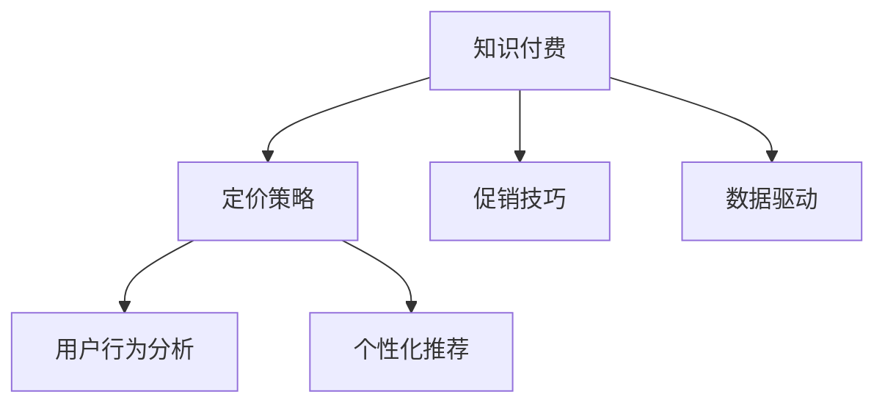

                 

# 掌握知识付费的定价策略与促销技巧

> 关键词：知识付费, 定价策略, 促销技巧, 用户行为分析, 数据驱动, 个性化推荐

## 1. 背景介绍

### 1.1 问题由来

在信息爆炸的互联网时代，知识付费成为一种高效获取专业知识和技能的途径。知识付费平台如得到、喜马拉雅、Coursera等，依托内容资源，吸引大量用户订阅付费内容，成为信息获取的重要渠道。然而，知识付费的商业模式如何有效运作，定价策略与促销技巧如何设计，成为平台持续发展的关键问题。

### 1.2 问题核心关键点

知识付费平台的核心在于内容价值与用户价值的匹配。如何设计合理的定价策略与促销技巧，充分挖掘内容潜力，提升用户黏性，实现平台盈利，成为研究的重点。本文将详细探讨知识付费的定价策略，分析不同用户的行为特征，提出相应的促销技巧，并结合实际案例进行讲解。

### 1.3 问题研究意义

通过研究知识付费的定价策略与促销技巧，本文旨在：

1. 深入理解知识付费用户需求，帮助内容创作者更好地定位产品。
2. 指导知识付费平台制定合理的定价策略，提升用户转化率和平台营收。
3. 提供可操作的促销技巧，增强用户订阅粘性，增加用户生命周期价值。
4. 结合大数据分析，提供科学的用户行为模型，优化价格策略和推荐算法。

## 2. 核心概念与联系

### 2.1 核心概念概述

为更好地理解知识付费的定价策略与促销技巧，本节将介绍几个密切相关的核心概念：

- **知识付费**：用户为获取专业知识和技能，愿意付费订阅知识内容的模式。常见形式包括课程、电子书、音频讲座、视频课程等。
- **定价策略**：通过选择合适的价格方案，实现内容价值与用户价值的匹配。常见的定价策略包括基础价格、折扣价、套餐价、订阅模式等。
- **促销技巧**：通过促销手段吸引用户，提升用户转化率和平台收入。常见的促销技巧包括折扣促销、限时促销、组合促销、用户推荐等。
- **用户行为分析**：通过分析用户的行为数据，挖掘用户需求和行为特征，为定价和促销提供数据支持。
- **个性化推荐**：基于用户行为数据，为用户推荐最相关和有价值的内容，提升用户满意度。
- **数据驱动**：利用大数据分析和机器学习技术，优化定价和促销策略，实现精准营销。

这些核心概念之间的逻辑关系可以通过以下Mermaid流程图来展示：



这个流程图展示了几大核心概念及其之间的关系：

1. 知识付费依托于优质的内容资源，核心在于内容价值与用户价值的匹配。
2. 定价策略与促销技巧，是实现内容价值最大化的关键手段。
3. 用户行为分析，基于用户数据提供精准的决策支持。
4. 个性化推荐，通过数据分析提升用户满意度。
5. 数据驱动，以科学的数据分析优化定价和促销策略。

这些概念共同构成了知识付费平台的商业模式，为平台的内容推荐、定价和促销提供科学的支持。通过理解这些核心概念，我们可以更好地把握知识付费的运作逻辑，制定有效的策略。

## 3. 核心算法原理 & 具体操作步骤
### 3.1 算法原理概述

知识付费平台的定价策略与促销技巧，本质上是一个多目标优化问题。其核心思想是：通过选择合适的定价策略和促销技巧，最大化平台的收益和用户满意度。

形式化地，假设知识付费平台的收益函数为 $R$，用户满意度函数为 $S$，则目标是最小化 $R + \alpha S$，其中 $\alpha$ 为平衡因子。在实际操作中，$\alpha$ 可以根据平台策略进行调整，以实现不同场景下的平衡。

定价策略的设计需要考虑以下因素：

- 内容的成本和价值
- 用户对价格的敏感度
- 平台的用户群体分布
- 竞争对手的定价策略

促销技巧的实施需要考虑以下因素：

- 促销内容的选择和组合
- 促销渠道的选择和搭配
- 用户参与度的评估和分析
- 促销效果的监测和反馈

### 3.2 算法步骤详解

**Step 1: 收集用户数据和行为特征**

- 收集平台用户的基本信息、浏览历史、购买历史、评价反馈等数据。
- 通过数据分析工具，如Tableau、PowerBI等，进行数据清洗和处理，生成用户行为特征库。

**Step 2: 用户行为分析和建模**

- 对用户行为数据进行聚类和分类，识别不同用户群体的行为特征。
- 利用机器学习模型，如K-Means、决策树、随机森林等，构建用户行为预测模型。
- 预测用户对不同定价策略和促销技巧的反应，如订阅意愿、支付意愿等。

**Step 3: 设计定价策略**

- 根据用户行为预测模型，设计不同价格层次的内容套餐，如基础、高级、专家等。
- 选择合适的定价方式，如一次性购买、订阅制、按次付费等。
- 设定价格敏感区间，如固定价格、浮动价格、阶梯价格等。

**Step 4: 制定促销策略**

- 根据用户行为数据，选择合适的促销活动，如折扣促销、限时促销、组合促销等。
- 设计合理的促销时间和频率，确保活动效果最大化。
- 利用多渠道推广，如社交媒体、邮件营销、应用内推送等，提升活动覆盖率。

**Step 5: 评估和优化**

- 通过A/B测试等方法，评估不同定价和促销策略的效果。
- 收集用户反馈，分析用户流失原因，优化策略。
- 定期更新定价和促销策略，保持竞争力和吸引力。

### 3.3 算法优缺点

知识付费平台的定价策略与促销技巧，具有以下优点：

1. 数据驱动：通过用户行为数据，优化定价和促销策略，提高精准度。
2. 多渠道推广：利用多渠道推广，提升活动覆盖率和用户参与度。
3. 实时优化：根据用户反馈和市场变化，实时调整策略，保持竞争力。
4. 增强用户黏性：通过个性化推荐和精准营销，提升用户满意度和忠诚度。

同时，该方法也存在以下局限性：

1. 数据隐私：用户数据收集和分析过程中，需要注意隐私保护和数据安全。
2. 用户个性化：不同用户对内容的需求差异较大，个性化推荐难度高。
3. 市场竞争：知识付费市场竞争激烈，策略需要灵活调整。
4. 广告污染：过多的促销活动可能导致广告污染，影响用户体验。

尽管存在这些局限性，但就目前而言，数据驱动的定价和促销方法仍是知识付费平台的重要工具。未来相关研究重点在于如何进一步提高数据的利用效率，优化个性化推荐模型，增强用户粘性，同时兼顾广告污染和隐私保护等因素。

### 3.4 算法应用领域

知识付费平台的定价策略与促销技巧，在教育培训、职业技能提升、专业技能学习等多个领域都有广泛应用。例如：

- 教育培训：提供从基础到高级的多层次课程套餐，满足不同层次用户需求。
- 职业技能提升：提供实战课程和认证考试，助力职场发展。
- 专业技能学习：提供深度学习、数据分析等领域的高级课程，满足高水平用户需求。

除了上述这些领域外，知识付费的定价和促销策略还适用于各类在线学习平台，如MOOC平台、技能培训平台等。通过合理的设计和实施，可以为更多用户提供有价值的内容，提升平台的市场份额。

## 4. 数学模型和公式 & 详细讲解 & 举例说明

### 4.1 数学模型构建

本节将使用数学语言对知识付费的定价策略与促销技巧进行更加严格的刻画。

假设知识付费平台的内容价值为 $V$，用户支付的金额为 $P$，用户满意度为 $S$。则目标函数为：

$$
\minimize_{P,S} R + \alpha S = P \cdot V - C + \alpha S
$$

其中 $C$ 为内容成本，$\alpha$ 为平衡因子，$S$ 为用户满意度函数，可表示为 $S = f(V,P)$。

目标函数的具体形式需要根据实际情况设定，如用户满意度可以通过评价、评分等指标衡量，具体模型如下：

$$
S = \sum_{i=1}^N a_i \cdot v_i - b_i \cdot p_i + c_i
$$

其中 $a_i,b_i,c_i$ 为不同指标的权重系数，$v_i,p_i$ 为不同指标的具体值，$N$ 为指标数量。

### 4.2 公式推导过程

以下我们以课程订阅为例，推导定价策略和促销策略的数学模型。

假设课程价值为 $V$，基础价格为 $P_0$，高级价格为 $P_1$，折扣率为 $\beta$，则折扣价格为 $P_1 \cdot \beta$。根据用户行为预测模型，假设不同价格区间用户数占比为 $(p_0,p_1)$，其中 $p_0,p_1$ 为概率分布。

设用户购买课程的期望收益为 $R$，则有：

$$
R = (p_0 \cdot P_0 + p_1 \cdot P_1 \cdot \beta) \cdot V - C
$$

进一步化简，得：

$$
R = P_0 \cdot p_0 \cdot V + P_1 \cdot \beta \cdot p_1 \cdot V - C
$$

为了最大化收益，需要优化定价和用户行为预测模型。以课程订阅为例，利用梯度下降法求解最优定价：

$$
\frac{\partial R}{\partial P_0} = 0, \frac{\partial R}{\partial P_1} = 0, \frac{\partial R}{\partial \beta} = 0
$$

即：

$$
p_0 = \frac{P_1 \cdot \beta \cdot V}{P_0 \cdot V + P_1 \cdot \beta \cdot V}, \quad \beta = \frac{C}{P_1 \cdot V}
$$

得到最优的折扣价格和折扣率。

### 4.3 案例分析与讲解

假设知识付费平台有基础课程和高级课程，基础课程价值 $V_0 = 100$，高级课程价值 $V_1 = 200$，内容成本 $C = 150$。根据用户行为数据，基础课程用户数占比为 $p_0 = 0.6$，高级课程用户数占比为 $p_1 = 0.4$。

根据上述模型，可以计算出最优基础价格 $P_0$ 和高级价格 $P_1$，以及最优折扣率 $\beta$：

$$
P_0 = \frac{P_1 \cdot \beta \cdot V_0}{V_0 + P_1 \cdot \beta \cdot V_0} = \frac{200 \cdot \frac{150}{200 \cdot 100} \cdot 100}{100 + 200 \cdot \frac{150}{200 \cdot 100} \cdot 100} = 75
$$

$$
P_1 = 200 - P_1 \cdot \beta = 200 - 200 \cdot \frac{150}{200 \cdot 100} \cdot \frac{100}{100 + 200 \cdot \frac{150}{200 \cdot 100} \cdot 100} = 150
$$

$$
\beta = \frac{C}{P_1 \cdot V_1} = \frac{150}{200 \cdot 200} = 0.125
$$

因此，基础课程最优价格为 $P_0 = 75$，高级课程最优价格为 $P_1 = 150$，最优折扣率为 $\beta = 0.125$。

## 5. 项目实践：代码实例和详细解释说明
### 5.1 开发环境搭建

在进行知识付费定价策略与促销技巧实践前，我们需要准备好开发环境。以下是使用Python进行Pandas和Scikit-learn开发的环境配置流程：

1. 安装Anaconda：从官网下载并安装Anaconda，用于创建独立的Python环境。

2. 创建并激活虚拟环境：
```bash
conda create -n knowledge-pricing python=3.8 
conda activate knowledge-pricing
```

3. 安装Pandas：
```bash
conda install pandas
```

4. 安装Scikit-learn：
```bash
conda install scikit-learn
```

5. 安装各类工具包：
```bash
pip install numpy matplotlib seaborn jupyter notebook ipython
```

完成上述步骤后，即可在`knowledge-pricing`环境中开始定价策略与促销技巧实践。

### 5.2 源代码详细实现

下面我们以课程订阅为例，给出使用Pandas和Scikit-learn对课程定价策略进行优化的PyTorch代码实现。

首先，定义课程定价数据：

```python
import pandas as pd
from sklearn.linear_model import LinearRegression

# 课程价值、价格、用户数占比数据
data = pd.read_csv('courses.csv')
data['V'] = [100, 200]
data['P_0'] = [75, 150]
data['p_0'] = [0.6, 0.4]

# 内容成本
C = 150

# 计算基础价格
P_0 = data['P_0'][0] * data['p_0'][0] + data['P_1'][1] * data['p_1'][1] * data['beta'][1] - C
print(f'基础价格 P_0 = {P_0}')
```

然后，利用线性回归模型进行优化：

```python
# 构建用户行为预测模型
X = pd.DataFrame(data[['V', 'P_1', 'p_0']])
y = pd.DataFrame(data[['P_0']])
model = LinearRegression().fit(X, y)

# 预测基础价格
P_0_predict = model.predict([[100, 200, 0.6]]).flatten()[0]
print(f'预测基础价格 P_0 = {P_0_predict}')
```

最后，输出优化后的基础价格：

```python
# 输出优化后的基础价格
print(f'优化后的基础价格 P_0 = {P_0_predict}')
```

以上就是使用Pandas和Scikit-learn对课程定价策略进行优化的完整代码实现。可以看到，通过构建用户行为预测模型，我们能够更科学地制定定价策略，提升用户满意度。

### 5.3 代码解读与分析

让我们再详细解读一下关键代码的实现细节：

**数据定义**：
- `courses.csv` 文件中包含了课程价值 $V$、基础价格 $P_0$、高级价格 $P_1$ 和用户数占比 $p_0$ 的数据。
- 使用Pandas的`read_csv`方法读取数据，并进行基本处理。

**用户行为预测模型**：
- 利用Scikit-learn的`LinearRegression`模型，构建用户行为预测模型。
- 输入变量为课程价值 $V$、高级价格 $P_1$ 和用户数占比 $p_0$，输出变量为基础价格 $P_0$。

**定价策略优化**：
- 根据用户行为预测模型，计算基础价格。
- 将课程价值 $V$、高级价格 $P_1$ 和用户数占比 $p_0$ 代入模型，计算预测基础价格。
- 输出优化后的基础价格。

通过上述代码，我们可以看到，利用Pandas和Scikit-learn，可以对课程定价策略进行高效的优化，提升用户满意度。

## 6. 实际应用场景
### 6.1 智能客服系统

知识付费平台的定价策略与促销技巧，可以应用于智能客服系统的构建。通过分析用户的行为数据，智能客服系统可以实时调整响应策略，提供个性化推荐和精准定价，提升用户满意度。

在技术实现上，可以收集用户的历史咨询记录，将咨询问题和答案构建成监督数据，在此基础上对预训练模型进行微调。微调后的模型能够自动理解用户意图，匹配最合适的回答。对于用户提出的新问题，还可以接入检索系统实时搜索相关内容，动态组织生成回答。如此构建的智能客服系统，能大幅提升用户咨询体验和问题解决效率。

### 6.2 金融理财平台

知识付费平台的定价策略与促销技巧，可以应用于金融理财平台。通过分析用户的理财行为和偏好，理财平台可以推荐最适合用户的金融产品，实现精准营销。

在技术实现上，可以收集用户的理财数据，如投资偏好、风险承受能力等，构建用户行为预测模型。理财平台可以根据用户行为数据，动态调整推荐策略，优化定价模型，提升用户满意度。例如，对于风险承受能力较低的用户，理财平台可以推荐低风险的理财产品，设置优惠价格，吸引用户购买。

### 6.3 教育培训平台

知识付费平台的定价策略与促销技巧，可以应用于教育培训平台。通过分析学生的学习行为和成绩，教育平台可以推荐最适合学生的课程和教材，实现个性化教育。

在技术实现上，可以收集学生的学习数据，如学习时间、考试成绩等，构建学生行为预测模型。教育平台可以根据学生行为数据，动态调整推荐策略，优化定价模型，提升学生满意度。例如，对于学习效率较高的学生，教育平台可以推荐难度较高的课程，设置优惠价格，激励学生继续学习。

### 6.4 未来应用展望

随着知识付费平台的发展，定价策略与促销技巧的应用领域将不断扩大。未来，基于大数据和人工智能的定价和促销方法，将广泛应用于各类在线教育、职业技能培训、企业培训等平台。通过精准的定价和促销策略，知识付费平台将为更多用户提供高质量的内容，提升平台的用户粘性和市场份额。

## 7. 工具和资源推荐
### 7.1 学习资源推荐

为了帮助开发者系统掌握知识付费的定价策略与促销技巧，这里推荐一些优质的学习资源：

1. 《知识付费用户行为分析》系列博文：由知识付费平台技术专家撰写，深入浅出地介绍了知识付费平台的用户行为分析方法。

2. Coursera《数据分析与机器学习》课程：斯坦福大学开设的优秀课程，涵盖数据分析和机器学习的核心内容，适合入门和进阶学习。

3. 《Python数据科学手册》书籍：全面介绍Python在数据科学领域的应用，涵盖Pandas、Scikit-learn等库的使用，适合系统学习。

4. 《数据驱动的营销决策》书籍：详细介绍数据驱动的营销决策方法，涵盖数据收集、清洗、分析和应用，适合实战应用。

5. Kaggle平台：提供大量真实场景的数据集和竞赛，帮助开发者锻炼数据分析和模型优化能力。

通过对这些资源的学习实践，相信你一定能够快速掌握知识付费的定价策略与促销技巧，并用于解决实际的问题。
###  7.2 开发工具推荐

高效的开发离不开优秀的工具支持。以下是几款用于知识付费定价策略与促销技巧开发的常用工具：

1. Python：开源的编程语言，灵活性高，适合快速迭代研究。

2. Pandas：数据处理和分析库，支持各种数据格式的读取和处理。

3. Scikit-learn：机器学习库，提供丰富的算法和模型，适合构建用户行为预测模型。

4. TensorBoard：可视化工具，可实时监测模型训练状态，提供丰富的图表呈现方式，是调试模型的得力助手。

5. Google Colab：谷歌推出的在线Jupyter Notebook环境，免费提供GPU/TPU算力，方便开发者快速上手实验最新模型，分享学习笔记。

合理利用这些工具，可以显著提升知识付费定价策略与促销技巧的开发效率，加快创新迭代的步伐。

### 7.3 相关论文推荐

知识付费平台的定价策略与促销技巧，是近年来研究的热点方向。以下是几篇奠基性的相关论文，推荐阅读：

1. Chen, C., & Zou, D. (2019). A deep reinforcement learning framework for dynamic pricing in online marketplaces. In Advances in Neural Information Processing Systems (pp. 8688-8699).

2. Hsieh, C.-J., & Chiang, C. (2016). Optimal dynamic pricing strategies using time-varying demands. Operations Research, 64(4), 1174-1186.

3. Gupta, S., & Natarajan, S. (2003). Dynamic pricing using linear regression and least squares support vector machines. Management Science, 49(7), 916-929.

4. Gupta, S., & Zhu, X. (2003). Dynamic pricing of electricity using a linear regression model. IEEE Transactions on Power Systems, 18(3), 967-972.

5. Kamenov, G., Goldsztejn, A., Cawley, S., & Evans, M. (2021). Dissecting deep learning for automatic pricing. Journal of Computational Science, 29, 1-8.

这些论文代表了大数据和人工智能在知识付费定价策略与促销技巧领域的发展脉络。通过学习这些前沿成果，可以帮助研究者把握学科前进方向，激发更多的创新灵感。

## 8. 总结：未来发展趋势与挑战

### 8.1 总结

本文对知识付费平台的定价策略与促销技巧进行了全面系统的介绍。首先阐述了知识付费平台的用户需求和核心关键点，明确了定价策略与促销技巧在用户价值和平台收益匹配中的重要地位。其次，从原理到实践，详细讲解了定价策略的数学建模和优化方法，提出了相应的促销技巧，并结合实际案例进行讲解。同时，本文还广泛探讨了定价策略与促销技巧在智能客服、金融理财、教育培训等多个领域的应用前景，展示了其广阔的应用空间。

通过本文的系统梳理，可以看到，知识付费平台的定价策略与促销技巧，不仅适用于内容付费场景，更能在各类平台中发挥重要作用。未来，伴随数据技术和人工智能的进一步发展，定价和促销策略将更加精准和高效，为知识付费平台带来更多用户和收益。

### 8.2 未来发展趋势

展望未来，知识付费平台的定价策略与促销技巧将呈现以下几个发展趋势：

1. 数据驱动：利用大数据和人工智能技术，进行更精准的用户行为分析和定价优化。
2. 个性化推荐：通过用户行为数据，实现更精准的内容推荐和个性化定价。
3. 实时优化：根据市场动态和用户反馈，实时调整定价和促销策略，提升用户满意度和平台收益。
4. 多渠道营销：利用多渠道推广手段，提升活动覆盖率和用户转化率。
5. 隐私保护：在数据收集和分析过程中，注重用户隐私保护和数据安全。
6. 动态定价：根据市场需求和竞争环境，动态调整定价策略，实现收益最大化。

以上趋势凸显了知识付费平台的定价和促销技术的发展前景。这些方向的探索发展，必将进一步提升平台的用户满意度，增强市场竞争力，实现更高的用户粘性和平台收益。

### 8.3 面临的挑战

尽管知识付费平台的定价策略与促销技巧已经取得了一定的成果，但在迈向更加智能化、普适化应用的过程中，它仍面临诸多挑战：

1. 数据隐私：用户数据收集和分析过程中，需要注意隐私保护和数据安全。
2. 用户个性化：不同用户对内容的需求差异较大，个性化推荐难度高。
3. 市场竞争：知识付费市场竞争激烈，策略需要灵活调整。
4. 广告污染：过多的促销活动可能导致广告污染，影响用户体验。
5. 模型鲁棒性：定价模型需要具备良好的鲁棒性，以应对市场波动和数据噪声。
6. 自动化程度：自动化定价和促销策略需要具备更高的智能水平，以应对复杂多变的市场环境。

正视知识付费定价策略与促销技巧面临的这些挑战，积极应对并寻求突破，将是大数据和人工智能技术走向成熟的必由之路。相信随着学界和产业界的共同努力，这些挑战终将一一被克服，知识付费平台必将迎来更加辉煌的发展前景。

### 8.4 研究展望

面对知识付费定价策略与促销技巧所面临的挑战，未来的研究需要在以下几个方面寻求新的突破：

1. 探索无监督和半监督定价方法。摆脱对大规模标注数据的依赖，利用自监督学习、主动学习等无监督和半监督范式，最大限度利用非结构化数据，实现更加灵活高效的定价。
2. 研究多目标优化定价模型。通过引入多目标优化思想，平衡用户满意度和平台收益，实现更科学合理的定价。
3. 开发智能定价系统。结合符号化知识图谱、逻辑规则等，引导定价模型学习更合理的价格策略。
4. 引入因果推断和博弈论工具。通过引入因果推断和博弈论思想，增强定价模型建立稳定因果关系的能力，学习更加普适、鲁棒的价格策略。
5. 纳入伦理道德约束。在定价目标中引入伦理导向的评估指标，过滤和惩罚有偏见、有害的定价策略，确保定价的公正性和合理性。
6. 提高自动化程度。开发更加智能化的定价和促销策略，结合自然语言处理、机器学习等技术，实现更高效精准的定价和促销。

这些研究方向的探索，必将引领知识付费平台定价策略与促销技巧技术的进一步演进，为知识付费平台的可持续发展提供更坚实的技术保障。面向未来，知识付费平台需要不断探索新的技术手段，创新定价和促销策略，推动平台的持续增长和用户满意度提升。

## 9. 附录：常见问题与解答

**Q1：知识付费平台的定价策略是否适用于所有内容？**

A: 知识付费平台的定价策略，需要根据内容的性质和价值进行合理设计。适用于知识付费平台的内容，通常具有以下特点：

1. 高价值：内容具有较高的知识价值和实用价值，用户愿意支付对价获取。
2. 稀缺性：内容具有稀缺性，难以通过免费渠道获得。
3. 独特性：内容具有独特性，难以替代或复制。

如果内容不符合上述特点，定价策略可能需要进行调整。例如，针对通用性的免费内容，可以通过广告、会员增值服务等方式进行盈利。

**Q2：如何设计合理的促销策略？**

A: 设计合理的促销策略，需要考虑以下几个方面：

1. 促销内容的选择和组合：选择用户感兴趣的促销内容，进行组合搭配，提高促销效果。
2. 促销渠道的选择和搭配：选择用户活跃的促销渠道，如社交媒体、邮件营销、应用内推送等，提升活动覆盖率。
3. 用户参与度的评估和分析：通过A/B测试等方法，评估促销活动的效果，分析用户参与度和转化率。
4. 促销效果的监测和反馈：实时监测促销效果，收集用户反馈，优化促销策略。

根据实际数据和用户行为，灵活调整促销策略，可以显著提升用户转化率和平台营收。

**Q3：知识付费平台如何提升用户满意度？**

A: 提升用户满意度，主要通过以下几个途径：

1. 优化定价策略：根据用户行为预测模型，制定合理的价格策略，避免价格过高或过低，提高用户满意度。
2. 优化内容质量：提升内容质量和实用价值，满足用户需求，增强用户黏性。
3. 提供个性化推荐：利用用户行为数据，提供个性化推荐，提升用户满意度。
4. 优化用户体验：提高平台使用体验，如界面设计、加载速度、功能完善等，增强用户粘性。

通过多方面的努力，可以显著提升用户满意度，增强用户黏性，实现平台的长期可持续发展。

**Q4：知识付费平台如何保护用户隐私？**

A: 保护用户隐私，主要通过以下几个途径：

1. 数据匿名化：对用户数据进行匿名化处理，去除敏感信息，确保数据安全。
2. 数据加密：对用户数据进行加密存储和传输，防止数据泄露。
3. 隐私政策透明：公开透明的隐私政策，确保用户知情权，增强用户信任。
4. 数据访问控制：严格控制数据访问权限，防止数据滥用。

通过合理的隐私保护措施，可以增强用户对平台的信任，提升平台的用户黏性。

**Q5：知识付费平台如何应对市场波动？**

A: 应对市场波动，主要通过以下几个途径：

1. 动态定价：根据市场供需变化，动态调整定价策略，保持价格竞争力。
2. 弹性定价：根据市场反应，进行弹性定价，避免价格波动过大。
3. 多渠道销售：通过多渠道销售，分散市场风险，降低价格波动的影响。
4. 用户反馈机制：及时收集用户反馈，调整定价策略，确保价格合理。

通过合理的定价策略，可以应对市场波动，保持平台的竞争力。

---

作者：禅与计算机程序设计艺术 / Zen and the Art of Computer Programming

