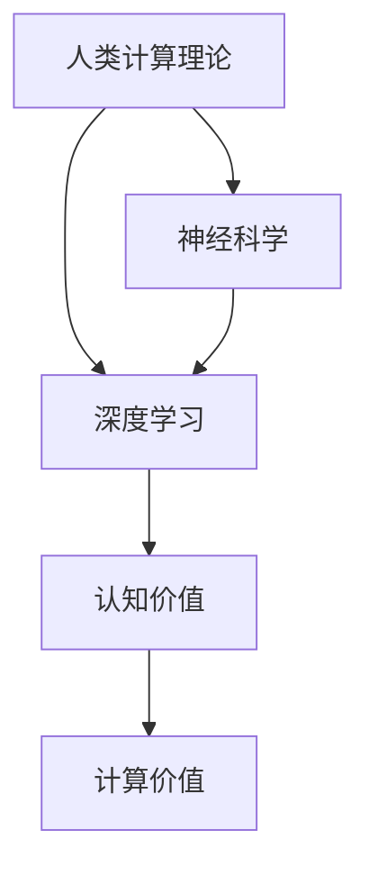

                 

# 探索人类思维的奥秘：人类计算的认知价值

> 关键词：人类计算,认知价值,人工智能,深度学习,认知科学,神经科学

## 1. 背景介绍

### 1.1 问题由来

在数字化浪潮席卷全球的今天，人工智能（AI）正逐渐成为科技发展的新引擎。人工智能不仅仅是机器学习算法的堆砌，更是对人类认知机制的深刻理解和模拟。认知科学和神经科学的最新进展，为人工智能研究提供了新的视角和方法。其中，人类计算理论（Human Computation Theory）通过借鉴人类认知能力，设计高效且可靠的人工智能算法，逐渐成为跨学科研究的热点。

人工智能的发展历程，也是一个逐步理解人类智能、模仿人类思维的过程。从早期的符号逻辑到后来的连接主义，再到当前的深度学习，每一次技术的飞跃都源于对人类思维方式的进一步探索。然而，尽管人工智能在性能上已达到甚至超过了人类的某些特定能力，其“智能”本质仍需进一步验证。尤其是在面对复杂的认知任务时，如何实现真正意义上的人类智能，仍是AI研究的重要课题。

### 1.2 问题核心关键点

1. **认知价值**：人工智能系统的设计应不仅关注算法的性能，更应关注其在人类认知过程中的价值。如何通过计算手段，辅助或模拟人类思维，是人类计算理论的重要目标。
2. **深度学习**：深度学习已成为当前人工智能的核心技术，通过多层非线性变换，模拟人脑的神经元连接方式，实现复杂数据的高级特征提取。
3. **神经科学**：认知科学和神经科学的研究，为深度学习的算法设计提供了理论基础，特别是人脑中的“神经元”与深度学习的“神经网络”之间的相似性，为人脑计算提供了新的思路。
4. **计算价值**：人类计算理论关注的是如何在计算资源有限的前提下，实现高效且可靠的认知功能。如何将人类计算能力与计算资源相结合，是未来AI研究的重要方向。

## 2. 核心概念与联系

### 2.1 核心概念概述

为更好地理解人类计算的认知价值，本节将介绍几个关键概念：

- **人类计算理论**：借鉴人类认知过程的设计原则，结合计算机科学、认知科学、神经科学等多学科知识，研究如何通过计算手段模拟人类智能。
- **深度学习**：一种基于神经网络的学习算法，通过多层非线性变换，从数据中学习到高级特征。
- **神经科学**：研究人脑神经元如何处理信息，为深度学习的设计提供了理论基础。
- **认知价值**：计算模型在人类认知过程中的实际应用价值，包括推理、决策、情感处理等方面。

### 2.2 核心概念联系

这些核心概念之间的逻辑关系可以通过以下Mermaid流程图来展示：



这个流程图展示出人类计算理论的各个组成部分及其相互关系：

1. **人类计算理论**：结合认知科学和神经科学，为深度学习算法的设计提供理论指导。
2. **深度学习**：借鉴神经科学的研究成果，实现对复杂数据的高级特征提取。
3. **认知价值**：深度学习模型在模拟人类认知过程中的应用价值。
4. **计算价值**：在计算资源有限的情况下，如何实现高效且可靠的认知功能。

这些概念共同构成了人类计算理论的研究框架，旨在通过计算手段模拟人类智能，解决复杂的认知任务。通过理解这些概念之间的关系，可以更好地把握人类计算理论的研究方向。

## 3. 核心算法原理 & 具体操作步骤

### 3.1 算法原理概述

人类计算理论的核心思想是通过计算模型模拟人类认知过程。在深度学习中，这一思想主要体现在以下几个方面：

1. **多层非线性变换**：深度学习通过多层非线性变换，模拟人脑中的神经元连接方式，学习到数据的高级特征。
2. **反向传播**：深度学习通过反向传播算法，实现对参数的自动优化，使得模型能够适应不同的数据分布。
3. **神经网络结构**：深度学习的神经网络结构，参考了人脑中的神经元连接模式，具有高度的并行计算能力。

这些原理使得深度学习模型在处理复杂任务时表现出色，但也带来了模型复杂度高、计算资源消耗大等问题。人类计算理论正是在这些挑战中寻找平衡点，通过模拟人脑计算机制，设计更高效、更可靠的人工智能算法。

### 3.2 算法步骤详解

基于人类计算理论的深度学习算法，主要包括以下几个关键步骤：

**Step 1: 数据准备与预处理**
- 收集标注数据，划分为训练集、验证集和测试集。
- 对数据进行归一化、降噪等预处理，提高数据质量。

**Step 2: 模型构建**
- 选择深度学习模型架构，如卷积神经网络（CNN）、递归神经网络（RNN）、变换器（Transformer）等。
- 定义模型的损失函数和优化器，如交叉熵损失、Adam优化器等。

**Step 3: 训练与优化**
- 使用反向传播算法，对模型参数进行迭代优化。
- 在验证集上监控模型性能，避免过拟合。
- 使用正则化技术，如L2正则、Dropout等，增强模型泛化能力。

**Step 4: 评估与测试**
- 在测试集上评估模型性能，对比训练前后的精度提升。
- 使用量化指标，如准确率、召回率、F1值等，评估模型效果。

**Step 5: 部署与应用**
- 将训练好的模型部署到实际应用场景中，如自动驾驶、智能客服、医疗诊断等。
- 通过持续优化和迭代，不断提升模型性能。

### 3.3 算法优缺点

基于人类计算理论的深度学习算法，具有以下优点：

1. **高效性**：通过多层非线性变换，深度学习模型能够自动学习到复杂数据的高级特征，适用于处理高维、非线性的认知任务。
2. **可解释性**：深度学习模型的层级结构清晰，可以通过可视化工具对其内部计算过程进行解释。
3. **泛化能力**：通过正则化技术，深度学习模型能够避免过拟合，具有较强的泛化能力。

同时，该算法也存在一定的局限性：

1. **计算资源消耗大**：深度学习模型通常需要大量的计算资源进行训练和推理，对硬件配置要求较高。
2. **黑盒特性**：深度学习模型作为“黑盒”，难以解释其内部决策逻辑，缺乏可解释性。
3. **模型结构复杂**：深度学习模型的结构复杂，难以调整和优化，容易陷入局部最优。

尽管存在这些局限性，但深度学习算法在处理复杂认知任务时，已经展示了其强大的能力，是当前实现人类计算理论的重要工具。未来相关研究将更多地关注如何简化模型结构、提高计算效率、增强模型可解释性等问题，以更好地模拟人类智能。

### 3.4 算法应用领域

基于深度学习的认知价值，已经在多个领域得到了广泛应用，例如：

1. **自动驾驶**：深度学习模型能够处理复杂的视觉信息，辅助汽车进行路径规划和决策。
2. **智能客服**：通过深度学习模型进行语音和文本分析，实现自然语言理解与生成。
3. **医疗诊断**：深度学习模型能够从医学影像中提取特征，辅助医生进行疾病诊断。
4. **金融分析**：深度学习模型能够处理海量金融数据，进行风险评估和市场预测。
5. **娱乐内容推荐**：深度学习模型能够从用户行为中学习，推荐个性化的娱乐内容。

除了上述这些经典应用外，深度学习模型还被创新性地应用于更多场景中，如城市交通管理、智能家居、工业自动化等，为各行各业带来了新的智能化解决方案。随着深度学习技术的不断进步，相信其在更多领域的应用将进一步拓展，为人类生产生活带来深刻变革。

## 4. 数学模型和公式 & 详细讲解 & 举例说明

### 4.1 数学模型构建

在深度学习中，常用的数学模型包括神经网络、损失函数、优化器等。这里以卷积神经网络（CNN）为例，构建一个基本的图像分类模型。

**神经网络模型**：
- 输入：输入图像 $x \in \mathbb{R}^n$，其中 $n$ 表示图像的像素数。
- 卷积层：通过滑动窗口对输入图像进行卷积操作，得到特征图 $f(x) \in \mathbb{R}^m$，其中 $m$ 表示特征图的维度。
- 激活函数：对卷积结果进行非线性变换，如ReLU函数。
- 池化层：对特征图进行降维操作，如最大池化或平均池化。
- 全连接层：将池化层的输出映射到类别 $y$，进行分类。

**损失函数**：
- 常用的损失函数包括交叉熵损失（Cross-Entropy Loss）、均方误差损失（Mean Squared Error Loss）等。以交叉熵损失为例：

$$
\mathcal{L}(y, \hat{y}) = -\frac{1}{N}\sum_{i=1}^N \sum_{j=1}^C y_j\log \hat{y}_j
$$

其中 $y$ 为真实标签，$\hat{y}$ 为模型预测结果，$C$ 为类别数。

**优化器**：
- 常用的优化器包括随机梯度下降（SGD）、Adam优化器等。以Adam优化器为例：

$$
\theta \leftarrow \theta - \eta \frac{\partial \mathcal{L}}{\partial \theta}
$$

其中 $\eta$ 为学习率，$\frac{\partial \mathcal{L}}{\partial \theta}$ 为损失函数对模型参数的梯度。

### 4.2 公式推导过程

以下以交叉熵损失函数为例，推导其梯度计算公式。

假设输入图像 $x$ 的卷积特征图为 $f(x)$，类别数为 $C$，真实标签为 $y$，模型预测结果为 $\hat{y}$。则交叉熵损失函数的梯度计算公式为：

$$
\frac{\partial \mathcal{L}(y, \hat{y})}{\partial \theta} = -\frac{1}{N}\sum_{i=1}^N \frac{1}{C} \sum_{j=1}^C \left(\frac{\partial \mathcal{L}(y, \hat{y})}{\partial y_j} \frac{\partial y_j}{\partial \hat{y}_j} \frac{\partial \hat{y}_j}{\partial \theta}\right)
$$

其中 $\frac{\partial y_j}{\partial \hat{y}_j} = \frac{y_j}{\hat{y}_j}(1 - \hat{y}_j)$，$\frac{\partial \hat{y}_j}{\partial \theta}$ 为神经网络中每一层对参数 $\theta$ 的梯度。

通过链式法则，将梯度传播回每一层，并更新模型参数。

### 4.3 案例分析与讲解

以手写数字识别为例，分析深度学习模型在图像分类任务中的应用。

假设有一组手写数字图像 $x_i$，每个图像大小为 $28 \times 28$ 像素，类别数为 $10$。训练集中包含6000个图像，验证集和测试集各包含1000个图像。模型使用卷积神经网络进行训练和测试，定义交叉熵损失和Adam优化器。

**Step 1: 数据准备与预处理**
- 将图像数据归一化到 $[0, 1]$ 范围内。
- 将图像数据转化为 $28 \times 28 \times 1$ 的张量形式。
- 将标签数据转化为独热编码形式，如 $[0, 0, 1, 0, 0, 0, 0, 0, 0, 0]$ 表示类别为3。

**Step 2: 模型构建**
- 定义卷积层、激活函数、池化层、全连接层等组件。
- 定义交叉熵损失和Adam优化器。

**Step 3: 训练与优化**
- 将训练数据输入模型，进行前向传播和反向传播。
- 在验证集上监控模型性能，调整超参数。
- 使用L2正则和Dropout等技术，增强模型泛化能力。

**Step 4: 评估与测试**
- 在测试集上评估模型性能，计算准确率、召回率等指标。
- 使用混淆矩阵可视化分类结果，分析模型的优劣。

**Step 5: 部署与应用**
- 将训练好的模型部署到实际应用场景中，如手写数字识别系统。
- 通过持续优化和迭代，不断提升模型性能。

通过这一案例，可以清晰地看到深度学习模型在图像分类任务中的应用，以及如何通过数学模型和优化算法，实现高效的模型训练和推理。

## 5. 项目实践：代码实例和详细解释说明

### 5.1 开发环境搭建

在进行深度学习实践前，我们需要准备好开发环境。以下是使用Python进行PyTorch开发的环境配置流程：

1. 安装Anaconda：从官网下载并安装Anaconda，用于创建独立的Python环境。

2. 创建并激活虚拟环境：
```bash
conda create -n pytorch-env python=3.8 
conda activate pytorch-env
```

3. 安装PyTorch：根据CUDA版本，从官网获取对应的安装命令。例如：
```bash
conda install pytorch torchvision torchaudio cudatoolkit=11.1 -c pytorch -c conda-forge
```

4. 安装各类工具包：
```bash
pip install numpy pandas scikit-learn matplotlib tqdm jupyter notebook ipython
```

完成上述步骤后，即可在`pytorch-env`环境中开始深度学习实践。

### 5.2 源代码详细实现

这里我们以手写数字识别（MNIST）为例，给出使用PyTorch进行卷积神经网络训练的PyTorch代码实现。

首先，定义卷积神经网络模型：

```python
import torch.nn as nn
import torch.nn.functional as F

class ConvNet(nn.Module):
    def __init__(self):
        super(ConvNet, self).__init__()
        self.conv1 = nn.Conv2d(1, 32, 3, 1)
        self.pool = nn.MaxPool2d(2, 2)
        self.conv2 = nn.Conv2d(32, 64, 3, 1)
        self.fc1 = nn.Linear(64 * 5 * 5, 120)
        self.fc2 = nn.Linear(120, 84)
        self.fc3 = nn.Linear(84, 10)

    def forward(self, x):
        x = self.pool(F.relu(self.conv1(x)))
        x = self.pool(F.relu(self.conv2(x)))
        x = x.view(-1, 64 * 5 * 5)
        x = F.relu(self.fc1(x))
        x = F.relu(self.fc2(x))
        x = self.fc3(x)
        return x
```

然后，定义损失函数和优化器：

```python
import torch.optim as optim

model = ConvNet()
criterion = nn.CrossEntropyLoss()
optimizer = optim.Adam(model.parameters(), lr=0.001)
```

接着，定义训练和评估函数：

```python
import torch.utils.data
import torchvision.transforms as transforms
from torchvision.datasets import MNIST

def train_epoch(model, train_loader, criterion, optimizer):
    model.train()
    total_loss = 0
    for batch_idx, (data, target) in enumerate(train_loader):
        optimizer.zero_grad()
        output = model(data)
        loss = criterion(output, target)
        loss.backward()
        optimizer.step()
        total_loss += loss.item()
    return total_loss / len(train_loader)

def evaluate(model, test_loader, criterion):
    model.eval()
    total_loss = 0
    correct = 0
    with torch.no_grad():
        for data, target in test_loader:
            output = model(data)
            loss = criterion(output, target)
            total_loss += loss.item()
            _, predicted = torch.max(output.data, 1)
            total_correct = (predicted == target).sum().item()
    return total_loss / len(test_loader), total_correct / len(test_loader.dataset)
```

最后，启动训练流程并在测试集上评估：

```python
import torchvision.datasets as datasets
import torchvision.transforms as transforms
from torch.utils.data import DataLoader

transform = transforms.Compose([
    transforms.ToTensor(),
    transforms.Normalize((0.5,), (0.5,))
])

train_dataset = datasets.MNIST(root='./data', train=True, transform=transform, download=True)
test_dataset = datasets.MNIST(root='./data', train=False, transform=transform, download=True)

train_loader = DataLoader(train_dataset, batch_size=64, shuffle=True)
test_loader = DataLoader(test_dataset, batch_size=64, shuffle=False)

for epoch in range(10):
    loss = train_epoch(model, train_loader, criterion, optimizer)
    print(f'Epoch {epoch+1}, train loss: {loss:.4f}')
    
    test_loss, acc = evaluate(model, test_loader, criterion)
    print(f'Epoch {epoch+1}, test loss: {test_loss:.4f}, test accuracy: {acc:.4f}')
```

以上就是使用PyTorch进行手写数字识别任务的卷积神经网络微调代码实现。可以看到，通过PyTorch的强大封装，我们可以用相对简洁的代码完成卷积神经网络的加载和微调。

### 5.3 代码解读与分析

让我们再详细解读一下关键代码的实现细节：

**ConvNet类**：
- `__init__`方法：初始化卷积层、池化层、全连接层等组件。
- `forward`方法：定义前向传播过程，通过多个卷积、池化、全连接层进行特征提取和分类。

**损失函数和优化器**：
- 定义交叉熵损失和Adam优化器，用于训练和优化模型。

**train_epoch和evaluate函数**：
- `train_epoch`函数：对数据进行批次化加载，在每个批次上进行前向传播和反向传播，更新模型参数。
- `evaluate`函数：在测试集上评估模型性能，计算损失和准确率。

**训练流程**：
- 定义总的epoch数和批大小，开始循环迭代。
- 每个epoch内，先在训练集上训练，输出平均loss。
- 在验证集上评估，输出准确率。
- 所有epoch结束后，在测试集上评估，给出最终测试结果。

可以看到，PyTorch配合TensorFlow等深度学习框架使得神经网络微调的代码实现变得简洁高效。开发者可以将更多精力放在模型改进、数据预处理等高层逻辑上，而不必过多关注底层的实现细节。

当然，工业级的系统实现还需考虑更多因素，如模型的保存和部署、超参数的自动搜索、更灵活的神经网络结构等。但核心的微调范式基本与此类似。

## 6. 实际应用场景

### 6.1 自动驾驶

深度学习模型在自动驾驶中得到广泛应用，通过图像识别、语义分割、路径规划等技术，实现了无人驾驶的初步商用。其中，卷积神经网络（CNN）在图像识别中表现尤为突出，能够处理复杂的视觉信息，辅助汽车进行安全驾驶。

具体而言，自动驾驶系统通过摄像头获取道路图像，并使用CNN模型进行目标检测、车道线识别、交通标志识别等任务。通过将这些视觉信息转化为计算机能够理解的语义信息，自动驾驶系统能够实时进行决策和路径规划，确保行驶安全。

### 6.2 智能客服

智能客服系统通过深度学习模型进行自然语言理解与生成，实现自动问答和情感分析等功能。其中，卷积神经网络（CNN）和循环神经网络（RNN）等模型，能够处理文本数据，实现对用户意图的理解和回应。

具体而言，智能客服系统将用户输入的自然语言转化为文本向量，并使用RNN等模型进行序列建模。通过模型训练，系统能够自动理解用户问题，并匹配最合适的答案模板进行回复。对于用户提出的新问题，还可以通过检索系统实时搜索相关内容，动态组织生成回答。如此构建的智能客服系统，能大幅提升客户咨询体验和问题解决效率。

### 6.3 医疗诊断

深度学习模型在医疗诊断中得到广泛应用，通过图像识别、文本分析等技术，辅助医生进行疾病诊断和病情预测。其中，卷积神经网络（CNN）在医学影像识别中表现尤为突出，能够从X光片、CT片等医学影像中提取特征，辅助医生进行疾病诊断。

具体而言，深度学习模型能够从医学影像中提取关键特征，如肿瘤的大小、形状、位置等，并使用分类算法进行疾病诊断。通过模型训练，系统能够自动分析医学影像，输出疾病诊断结果，帮助医生进行辅助诊断。此外，深度学习模型还能对医学文本进行情感分析，判断患者病情变化，提供个性化的诊疗建议。

### 6.4 未来应用展望

随着深度学习技术的不断进步，基于人类计算理论的认知价值将在更多领域得到应用，为人类生产生活带来深刻变革。

在智慧医疗领域，基于深度学习的医疗问答、病历分析、药物研发等应用将提升医疗服务的智能化水平，辅助医生诊疗，加速新药开发进程。

在智能教育领域，深度学习模型可应用于作业批改、学情分析、知识推荐等方面，因材施教，促进教育公平，提高教学质量。

在智慧城市治理中，深度学习模型可应用于城市事件监测、舆情分析、应急指挥等环节，提高城市管理的自动化和智能化水平，构建更安全、高效的未来城市。

此外，在企业生产、社会治理、文娱传媒等众多领域，基于深度学习的认知价值也将不断涌现，为经济社会发展注入新的动力。相信随着技术的日益成熟，深度学习模型必将在更广阔的应用领域大放异彩。

## 7. 工具和资源推荐
### 7.1 学习资源推荐

为了帮助开发者系统掌握深度学习理论基础和实践技巧，这里推荐一些优质的学习资源：

1. 《深度学习》系列书籍：由深度学习领域权威专家撰写，系统讲解深度学习的理论基础、算法设计、实践技巧等。
2. Coursera《深度学习专项课程》：由斯坦福大学等名校开设的深度学习课程，涵盖从入门到高级的内容，适合初学者和进阶者。
3. arXiv预印本网站：最新的深度学习研究论文，关注前沿动态，获取最新知识。
4. Kaggle竞赛平台：参与深度学习竞赛，实践项目开发，提升实战能力。

通过对这些资源的学习实践，相信你一定能够快速掌握深度学习的精髓，并用于解决实际的认知任务。

### 7.2 开发工具推荐

高效的开发离不开优秀的工具支持。以下是几款用于深度学习开发的常用工具：

1. PyTorch：基于Python的开源深度学习框架，灵活动态的计算图，适合快速迭代研究。
2. TensorFlow：由Google主导开发的开源深度学习框架，生产部署方便，适合大规模工程应用。
3. Weights & Biases：模型训练的实验跟踪工具，可以记录和可视化模型训练过程中的各项指标，方便对比和调优。
4. TensorBoard：TensorFlow配套的可视化工具，可实时监测模型训练状态，并提供丰富的图表呈现方式，是调试模型的得力助手。
5. Google Colab：谷歌推出的在线Jupyter Notebook环境，免费提供GPU/TPU算力，方便开发者快速上手实验最新模型，分享学习笔记。

合理利用这些工具，可以显著提升深度学习开发效率，加快创新迭代的步伐。

### 7.3 相关论文推荐

深度学习的发展源于学界的持续研究。以下是几篇奠基性的相关论文，推荐阅读：

1. LeCun等人的《Backpropagation: Application to Feedforward Networks and Error-Backpropagation Learning Algorithms》：深度学习算法的起源，提出了反向传播算法，为深度学习的发展奠定了基础。
2. Hinton等人的《A Neural Probabilistic Language Model》：引入自编码器，提出了多层神经网络模型，为深度学习的应用提供了新的方向。
3. Krizhevsky等人的《ImageNet Classification with Deep Convolutional Neural Networks》：提出卷积神经网络（CNN），在图像识别任务上取得了突破性进展。
4. Goodfellow等人的《Generative Adversarial Nets》：提出生成对抗网络（GAN），为深度学习在图像生成、数据增强等领域提供了新的思路。
5. Vaswani等人的《Attention Is All You Need》：提出Transformer模型，实现了语言建模和机器翻译等任务的重大突破。

这些论文代表了大深度学习的发展脉络。通过学习这些前沿成果，可以帮助研究者把握学科前进方向，激发更多的创新灵感。

## 8. 总结：未来发展趋势与挑战

### 8.1 总结

本文对基于深度学习的认知价值进行了全面系统的介绍。首先阐述了深度学习在模拟人类认知过程中的重要价值，明确了深度学习在处理复杂认知任务中的独特作用。其次，从原理到实践，详细讲解了深度学习的数学模型和算法步骤，给出了深度学习任务开发的完整代码实例。同时，本文还广泛探讨了深度学习在自动驾驶、智能客服、医疗诊断等多个领域的应用前景，展示了深度学习模型在实现人类计算认知价值方面的强大能力。

通过本文的系统梳理，可以看到，基于深度学习的认知价值在处理复杂认知任务时，已经展示了其强大的能力，是当前实现人类计算理论的重要工具。未来相关研究将更多地关注如何简化模型结构、提高计算效率、增强模型可解释性等问题，以更好地模拟人类智能。

### 8.2 未来发展趋势

展望未来，深度学习在认知价值领域将呈现以下几个发展趋势：

1. **多模态学习**：深度学习模型能够处理视觉、语音、文本等多种模态数据，实现跨模态的认知功能。例如，将视觉信息和文本信息结合起来，进行图像描述生成。
2. **自监督学习**：深度学习模型通过自监督学习任务，如掩码语言模型（Masked Language Model, MLM），从非标注数据中学习到丰富的语义信息。例如，使用预训练语言模型进行文本生成、信息抽取等任务。
3. **对抗样本**：深度学习模型能够通过对抗样本训练，增强其鲁棒性和泛化能力。例如，使用对抗样本生成器，训练模型在图像分类任务中对噪声具有更强的抵抗力。
4. **强化学习**：深度学习模型通过强化学习，能够在复杂环境中进行智能决策。例如，在自动驾驶、机器人控制等领域，通过强化学习模型进行路径规划和行为优化。
5. **元学习**：深度学习模型通过元学习，能够快速适应新任务，减少训练时间和数据需求。例如，使用少样本学习算法，在有限标注数据的情况下进行模型微调。
6. **迁移学习**：深度学习模型通过迁移学习，能够在不同任务之间进行知识迁移，减少新任务的学习成本。例如，将医疗影像分类模型应用于其他医学影像分类任务。

这些趋势凸显了深度学习在认知价值领域的应用潜力。通过这些方向的研究，深度学习模型将能够更好地模拟人类认知过程，解决更复杂的认知任务。

### 8.3 面临的挑战

尽管深度学习在认知价值领域已取得显著进展，但在迈向更加智能化、普适化应用的过程中，仍面临诸多挑战：

1. **计算资源消耗大**：深度学习模型通常需要大量的计算资源进行训练和推理，对硬件配置要求较高。如何降低计算资源消耗，提高模型训练和推理效率，是未来研究的重要方向。
2. **模型可解释性不足**：深度学习模型作为“黑盒”，难以解释其内部决策逻辑，缺乏可解释性。如何增强模型的可解释性，提高其透明度和可信度，是未来研究的重要课题。
3. **数据隐私和安全**：深度学习模型需要大量的数据进行训练，如何保护用户隐私数据，避免数据泄露和安全风险，是未来研究的重要挑战。
4. **跨领域知识整合**：深度学习模型通常局限于单一领域，难以灵活吸收和运用跨领域知识。如何将不同领域的知识进行整合，增强模型的通用性，是未来研究的重要方向。
5. **认知模型一致性**：深度学习模型在不同任务、不同数据集上的表现存在差异，如何提高模型的泛化能力和一致性，是未来研究的重要课题。

这些挑战需要通过跨学科合作、技术创新和政策支持等多方面的努力，才能逐步克服。

### 8.4 研究展望

面向未来，深度学习在认知价值领域的研究将从以下几个方向展开：

1. **融合认知科学与神经科学**：通过融合认知科学和神经科学的研究成果，设计更加高效、可靠的人工智能算法。例如，将认知模型中的推理、决策等机制引入深度学习模型。
2. **发展更加灵活的神经网络结构**：通过研究神经元连接模式，设计更加灵活的神经网络结构，提高模型的适应性和可解释性。例如，引入自适应学习机制，调整神经元之间的连接强度。
3. **探索更加通用的智能模型**：通过研究跨领域知识的整合和融合，设计更加通用的智能模型，实现更广泛的应用场景。例如，将视觉、语言、时间等多种信息进行整合，设计多模态智能模型。
4. **开发更加透明和可信的智能系统**：通过研究智能系统的透明性和可信度，设计更加透明和可信的智能系统，提高用户的信任感和接受度。例如，通过解释模型决策过程，增强模型的可解释性和用户信任度。
5. **推动智能化技术的社会应用**：通过研究智能化技术在社会中的应用，推动智能化技术的普及和应用，促进社会的智能化进程。例如，通过智能化技术优化城市管理，提升公共服务水平。

这些研究方向的探索，将引领深度学习在认知价值领域迈向更高的台阶，为构建安全、可靠、可解释、可控的智能系统铺平道路。通过跨学科合作、技术创新和政策支持，深度学习必将在实现人类计算认知价值方面发挥更大的作用。

## 9. 附录：常见问题与解答

**Q1：深度学习在处理复杂认知任务时有哪些优势？**

A: 深度学习在处理复杂认知任务时，具有以下优势：

1. **高效性**：深度学习通过多层非线性变换，能够自动学习到复杂数据的高级特征，适用于处理高维、非线性的认知任务。
2. **可解释性**：深度学习模型的层级结构清晰，可以通过可视化工具对其内部计算过程进行解释。
3. **泛化能力**：深度学习模型能够避免过拟合，具有较强的泛化能力，能够在不同数据集上保持一致的性能。

**Q2：如何提高深度学习模型的可解释性？**

A: 提高深度学习模型的可解释性，可以从以下几个方面入手：

1. **可视化技术**：通过可视化技术，如梯度热图、特征重要性图等，帮助理解模型的内部计算过程和特征学习。
2. **模型简化**：通过简化模型结构，减少层数和参数，提高模型的透明性和可解释性。例如，使用自适应学习机制，调整神经元之间的连接强度。
3. **规则驱动**：通过引入规则驱动的决策过程，增强模型的透明性和可解释性。例如，将认知模型中的推理、决策等机制引入深度学习模型。

**Q3：深度学习模型在处理文本数据时有哪些挑战？**

A: 深度学习模型在处理文本数据时，面临以下挑战：

1. **数据稀疏性**：文本数据通常具有较高的稀疏性，难以直接进行深度学习建模。
2. **长文本处理**：深度学习模型通常难以处理长文本数据，容易出现梯度消失或爆炸等问题。
3. **领域差异性**：不同领域的文本数据具有不同的语言特征和结构，通用模型难以适应特定领域的文本处理任务。

**Q4：如何提高深度学习模型的泛化能力？**

A: 提高深度学习模型的泛化能力，可以从以下几个方面入手：

1. **数据增强**：通过数据增强技术，如数据扩充、噪声注入等，提高模型的泛化能力。例如，在图像识别任务中使用数据扩充技术，增加训练数据的数量和多样性。
2. **正则化技术**：通过正则化技术，如L2正则、Dropout等，避免模型过拟合，提高模型的泛化能力。例如，在分类任务中使用Dropout技术，防止模型对某些特征过度依赖。
3. **迁移学习**：通过迁移学习，将预训练模型的知识迁移到新任务上，提高模型的泛化能力。例如，在文本分类任务中，使用预训练的词向量作为初始化参数，进行微调。
4. **多任务学习**：通过多任务学习，同时训练多个相关任务，提高模型的泛化能力。例如，在自然语言处理任务中，同时训练语言建模和分类任务。

通过这些方法，可以有效提高深度学习模型的泛化能力，使其在处理不同任务和数据时表现更加稳定和可靠。

**Q5：深度学习模型在自动驾驶中的应用前景如何？**

A: 深度学习模型在自动驾驶中的应用前景广阔，主要体现在以下几个方面：

1. **感知能力**：深度学习模型能够处理复杂的视觉信息，进行目标检测、车道线识别、交通标志识别等任务。
2. **决策能力**：深度学习模型能够进行路径规划和行为优化，辅助汽车进行安全驾驶。
3. **实时性**：深度学习模型能够实时处理视觉数据，进行实时决策和控制，确保自动驾驶的安全性和可靠性。

未来，随着深度学习技术的不断进步，自动驾驶系统将具备更高的感知和决策能力，实现更加智能化的驾驶体验。同时，深度学习模型在自动驾驶中的应用也将进一步推动智能交通的发展，提升交通系统的效率和安全性。

**Q6：深度学习模型在智能客服中的应用前景如何？**

A: 深度学习模型在智能客服中的应用前景广阔，主要体现在以下几个方面：

1. **自然语言理解**：深度学习模型能够处理自然语言，进行意图识别和实体抽取，理解用户的咨询意图。
2. **自动回复**：深度学习模型能够生成自动回复，根据用户意图提供个性化的解决方案。
3. **情感分析**：深度学习模型能够进行情感分析，判断用户的情感状态，提供更加人性化的服务。

未来，随着深度学习技术的不断进步，智能客服系统将具备更高的自然语言理解和生成能力，实现更加智能化的客服体验。同时，深度学习模型在智能客服中的应用也将进一步推动客户服务升级，提高企业的服务质量和客户满意度。

**Q7：深度学习模型在医疗诊断中的应用前景如何？**

A: 深度学习模型在医疗诊断中的应用前景广阔，主要体现在以下几个方面：

1. **图像识别**：深度学习模型能够从医学影像中提取特征，进行疾病诊断和分类。
2. **文本分析**：深度学习模型能够处理医学文本，进行情感分析、知识抽取等任务。
3. **个性化推荐**：深度学习模型能够根据患者的历史数据和当前状态，进行个性化诊疗建议。

未来，随着深度学习技术的不断进步，医疗诊断系统将具备更高的准确性和可靠性，辅助医生进行疾病诊断和治疗。同时，深度学习模型在医疗诊断中的应用也将进一步推动智慧医疗的发展，提高医疗服务的智能化水平。

---

作者：禅与计算机程序设计艺术 / Zen and the Art of Computer Programming

