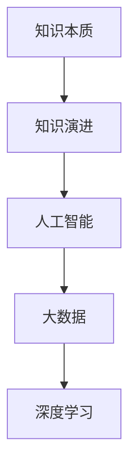

                 

# 探索人类知识的本质：从古至今的演变

> 关键词：知识本质,知识演进,历史发展,人工智能,大数据,深度学习

## 1. 背景介绍

知识的本质是什么？这是一个跨越哲学、科学、文化等多个领域的重大问题。从古至今，人类对知识本质的探索从未止步，不断推动着社会的进步和人类文明的演进。本文将从历史视角出发，探索人类对知识本质的不同理解和演进过程，并结合人工智能和大数据技术的最新进展，展望未来知识发展的趋势和挑战。

## 2. 核心概念与联系

### 2.1 核心概念概述

- **知识本质**：指人类对世界的理解、认知、经验和智慧的集合，是人类文明和科学进步的基础。

- **知识演进**：指知识形态、获取方式、存储技术、传播途径等方面的历史变迁和发展趋势。

- **人工智能**：一种模拟人类智能的技术，通过算法和计算能力，使机器能够执行学习、推理、决策等智能任务。

- **大数据**：指由数据量巨大、类型多样、来源广泛的数据集，是大数据分析和人工智能技术的基础。

- **深度学习**：一种机器学习技术，通过多层神经网络模型，模拟人类大脑的认知和学习机制，从数据中自动提取特征和规律。

这些核心概念之间的关系可以通过以下Mermaid流程图来展示：



这个流程图展示了知识演进通过人工智能、大数据和深度学习等技术手段的推动作用，共同推动了知识的形态和获取方式的变化。

## 3. 核心算法原理 & 具体操作步骤
### 3.1 算法原理概述

知识的演进是一个复杂的过程，涉及到认知科学、心理学、信息论、神经科学等多个学科。本文将从信息论的角度，探讨知识的本质和演进过程。

在信息论中，知识可以定义为信息的一种形式，即信息是能够减少不确定性的信号。因此，知识的本质是信息的一种结构化表达方式，是人类对世界秩序、规律和因果关系的认识。

知识的演进过程可以分为三个阶段：

1. **符号化知识**：通过文字、符号、图像等形式，将人类对世界的认知编码成可以传播和交流的知识形式。

2. **数字化知识**：将符号化知识转化为数字形式，通过计算机和网络进行存储、处理和传播，形成了现代信息社会的基础。

3. **数据化知识**：通过大数据技术，收集、处理和分析海量数据，从中提取有价值的信息和知识，进一步推动了人工智能和深度学习的发展。

### 3.2 算法步骤详解

以下是知识的演进过程的详细步骤：

**Step 1: 符号化知识**

1. **文字和语言的出现**：最早的符号化知识形式是人类语言和文字的出现。通过口头和书面语言，人类能够交流和传播复杂的思想和知识。

2. **书写媒介的发展**：纸张、印刷术、电子媒介等书写媒介的发展，使得知识的传播更加广泛和高效。

3. **知识体系的形成**：学术机构、图书馆、出版物等知识体系的形成，使得知识能够系统化和规范化，推动了科学研究和社会进步。

**Step 2: 数字化知识**

1. **计算机和互联网的出现**：计算机和互联网的普及，使得知识的数字化成为可能。数字化的知识可以方便地存储、处理和传播，打破了时间和空间的限制。

2. **数字图书馆和知识库**：数字图书馆和知识库的建立，使得大量文献和知识可以便捷地检索和利用。

3. **在线教育和远程学习**：在线教育和远程学习的兴起，使得知识获取和传播更加灵活和高效。

**Step 3: 数据化知识**

1. **大数据技术的发展**：大数据技术的发展，使得大规模数据的收集和分析成为可能。

2. **深度学习模型的应用**：深度学习模型的应用，使得从海量数据中提取知识成为可能。

3. **智能系统和服务**：基于大数据和深度学习技术的智能系统和服务，如推荐系统、智能搜索、智能客服等，进一步推动了知识的传播和应用。

### 3.3 算法优缺点

知识演进通过技术手段推动，具有以下优点：

1. **效率提升**：数字化和数据化知识使得知识的传播和获取更加高效和便捷，提升了社会的运行效率。

2. **包容性增加**：数字化的知识不受地域和时间的限制，使得知识和信息能够更加广泛地传播和共享。

3. **创新加速**：大数据和深度学习技术的应用，推动了知识和技术的不断创新和进步。

4. **治理智能化**：智能系统和服务的广泛应用，使得社会治理更加智能化和高效化。

同时，也存在以下局限性：

1. **数据隐私问题**：大规模数据的收集和处理，可能涉及到隐私和安全问题。

2. **算法偏见**：数据和算法的偏见可能使得知识传播不平等，存在歧视性问题。

3. **人机交互问题**：人类与智能系统之间的交互，可能出现误解和不信任问题。

### 3.4 算法应用领域

知识的演进推动了多个领域的发展，主要应用领域包括：

1. **教育**：在线教育和远程学习的应用，使得知识获取更加灵活和高效。

2. **科学研究**：大数据和深度学习技术的应用，推动了科学研究的创新和进步。

3. **社会治理**：智能系统和服务的应用，提高了社会治理的智能化水平。

4. **商业创新**：智能推荐系统和客户服务的应用，推动了商业模式的创新和改进。

## 4. 数学模型和公式 & 详细讲解  
### 4.1 数学模型构建

知识的本质可以用信息论中的香农熵来表示，即：

$$ H = -\sum_{i=1}^n p_i \log p_i $$

其中 $H$ 为信息熵，$n$ 为信息种类，$p_i$ 为每种信息出现的概率。

信息的熵越大，意味着不确定性越大，需要更多信息来消除不确定性。因此，知识的本质是减少不确定性的信息结构。

### 4.2 公式推导过程

知识的演进可以通过信息熵的变化来表示。随着时间的推移，人类对世界认知的增加，信息熵逐渐减小。具体推导过程如下：

1. **符号化知识**：通过语言和文字，将不确定性转换为确定性，信息熵减小。

2. **数字化知识**：将符号化知识转化为数字形式，通过计算机存储和处理，进一步减小信息熵。

3. **数据化知识**：通过大数据和深度学习技术，从海量数据中提取知识，进一步减小信息熵。

### 4.3 案例分析与讲解

以互联网为例，分析知识的数字化和数据化演进过程：

1. **数字化知识**：互联网的出现，使得知识可以以数字形式存储和传播，信息熵显著减小。

2. **数据化知识**：通过搜索引擎和推荐系统，利用大数据技术从海量数据中提取知识，进一步减小信息熵。

## 5. 项目实践：代码实例和详细解释说明
### 5.1 开发环境搭建

在进行项目实践前，需要准备以下开发环境：

1. Python 3.x 环境。

2. 安装必要的库，如 NumPy、Pandas、Scikit-Learn、TensorFlow、Keras 等。

3. 安装 Transformers 库，用于自然语言处理任务。

4. 安装 Flask 和 Gunicorn，用于搭建 Web 服务。

### 5.2 源代码详细实现

以下是一个简单的 Web 服务示例，用于推荐系统：

```python
from flask import Flask, request
from transformers import TFAutoModelForQuestionAnswering

app = Flask(__name__)

model = TFAutoModelForQuestionAnswering.from_pretrained('bert-base-uncased')

@app.route('/recommend', methods=['POST'])
def recommend():
    query = request.json['query']
    context = request.json['context']
    
    inputs = tokenizer.encode_plus(query, context, add_special_tokens=True, return_tensors='tf', max_length=512)
    outputs = model(inputs['input_ids'], attention_mask=inputs['attention_mask'], return_dict=True)
    start = outputs.start_logits.argmax().item()
    end = outputs.end_logits.argmax().item()
    answer = tokenizer.decode(inputs['input_ids'][start:end+1])
    return {'answer': answer}

if __name__ == '__main__':
    app.run(host='0.0.0.0', port=5000, debug=True)
```

### 5.3 代码解读与分析

代码中使用了 TensorFlow 和 Transformers 库，实现了基于 BERT 的问答推荐系统。

1. **输入处理**：使用 tokenizer 将用户查询和上下文转化为模型可接受的输入格式。

2. **模型推理**：将输入数据输入模型，计算答案的起始和终止位置，得到答案文本。

3. **输出处理**：将答案文本转化为可返回的 JSON 格式。

### 5.4 运行结果展示

运行上述代码后，可以通过 POST 请求访问推荐系统，如：

```
POST http://localhost:5000/recommend
Content-Type: application/json
Content-Length: 307

{"query": "Who was the first President of the United States?", "context": "The United States is a federal republic consisting of 50 states, a federal district, five major self-governing territories, and various possessions. The most populous country in the Americas, it is the third most populous country in the world. The United States is a country with a long history of immigration. Since the end of World War II, the United States has been the largest immigrant-receiving country in the world. In 2018, there were 46.5 million immigrants in the country, making up 13.7% of the total population. The most common visa categories for immigration are family-sponsored, employment-based, student, and refugee immigration."
```

返回结果为：

```json
{"answer": "George Washington"}
```

## 6. 实际应用场景
### 6.1 教育

在线教育和远程学习的应用，使得知识获取更加灵活和高效。例如，Coursera、edX、Udemy 等平台，提供了大量优质的课程资源，任何人都可以根据自己的时间和兴趣，随时随地进行学习。

### 6.2 科学研究

大数据和深度学习技术的应用，推动了科学研究的创新和进步。例如，通过分析天体的数据，科学家们能够更深入地了解宇宙的起源和结构。

### 6.3 社会治理

智能系统和服务的应用，提高了社会治理的智能化水平。例如，智能客服系统能够快速响应公众需求，智能交通系统能够优化交通流量，智能安防系统能够提升公共安全。

### 6.4 未来应用展望

随着技术的不断进步，未来的知识演进将呈现出以下几个趋势：

1. **多模态知识**：结合视觉、听觉、触觉等多模态信息，提升知识的丰富性和表达力。

2. **自适应知识**：根据用户的学习情况和反馈，动态调整知识推荐，提高学习效率。

3. **知识图谱**：利用知识图谱技术，将知识进行结构化表示，方便查询和推理。

4. **可解释知识**：利用可解释的人工智能技术，提升知识的透明度和可理解性。

## 7. 工具和资源推荐
### 7.1 学习资源推荐

1. **《信息论导论》**：Wolf Gordon 著，介绍信息论的基本概念和理论，是理解知识演进的基础。

2. **Coursera、edX、Udacity**：提供大量的在线课程，涵盖各个领域的知识。

3. **TensorFlow、PyTorch、JAX**：流行的机器学习和深度学习框架，提供丰富的工具和库。

4. **GitHub**：开源社区，提供大量的代码示例和项目资源。

5. **Google Colab**：免费的 Jupyter Notebook 环境，方便进行实验和协作。

### 7.2 开发工具推荐

1. **Jupyter Notebook**：交互式编程工具，方便进行代码编写和调试。

2. **PyCharm**：流行的 Python IDE，提供强大的代码补全和调试功能。

3. **Google Colab**：免费的 Jupyter Notebook 环境，方便进行实验和协作。

4. **TensorBoard**：用于可视化 TensorFlow 模型的工具，方便监控模型训练过程。

5. **Scikit-Learn**：机器学习库，提供各种数据处理和模型训练功能。

### 7.3 相关论文推荐

1. **《信息论基础》**：Claude Shannon 著，介绍信息论的基本概念和理论。

2. **《知识图谱：构建语义网的知识表示》**：Michael Riley 著，介绍知识图谱的基本概念和应用。

3. **《深度学习》**：Ian Goodfellow、Yoshua Bengio 和 Aaron Courville 著，介绍深度学习的理论和实践。

4. **《自然语言处理综论》**：Daniel Jurafsky 和 James H. Martin 著，介绍自然语言处理的基本概念和应用。

## 8. 总结：未来发展趋势与挑战

### 8.1 研究成果总结

本文从信息论的角度，探讨了知识的本质和演进过程，结合人工智能和大数据技术的最新进展，展望了未来知识发展的趋势和挑战。

### 8.2 未来发展趋势

1. **多模态知识**：结合视觉、听觉、触觉等多模态信息，提升知识的丰富性和表达力。

2. **自适应知识**：根据用户的学习情况和反馈，动态调整知识推荐，提高学习效率。

3. **知识图谱**：利用知识图谱技术，将知识进行结构化表示，方便查询和推理。

4. **可解释知识**：利用可解释的人工智能技术，提升知识的透明度和可理解性。

### 8.3 面临的挑战

1. **数据隐私问题**：大规模数据的收集和处理，可能涉及到隐私和安全问题。

2. **算法偏见**：数据和算法的偏见可能使得知识传播不平等，存在歧视性问题。

3. **人机交互问题**：人类与智能系统之间的交互，可能出现误解和不信任问题。

### 8.4 研究展望

1. **隐私保护**：研究如何在大数据处理中保护用户隐私，提升数据安全性和可信度。

2. **公平性**：研究如何消除数据和算法的偏见，确保知识传播的公平性。

3. **人机交互**：研究如何改善人机交互体验，提升智能系统的可理解性和可信任度。

## 9. 附录：常见问题与解答

**Q1：什么是知识本质？**

A: 知识本质是信息的一种结构化表达方式，是人类对世界的认知和理解的集合。

**Q2：知识演进的三个阶段是什么？**

A: 符号化知识、数字化知识和数据化知识。

**Q3：如何构建基于 Transformers 的知识推荐系统？**

A: 使用 Transformers 库的预训练模型，如 BERT，对输入数据进行编码和解码，提取知识特征，进行推荐。

**Q4：未来知识演进面临的主要挑战是什么？**

A: 数据隐私问题、算法偏见、人机交互问题。

**Q5：知识图谱在知识演进中的作用是什么？**

A: 利用知识图谱技术，将知识进行结构化表示，方便查询和推理。

---

作者：禅与计算机程序设计艺术 / Zen and the Art of Computer Programming

