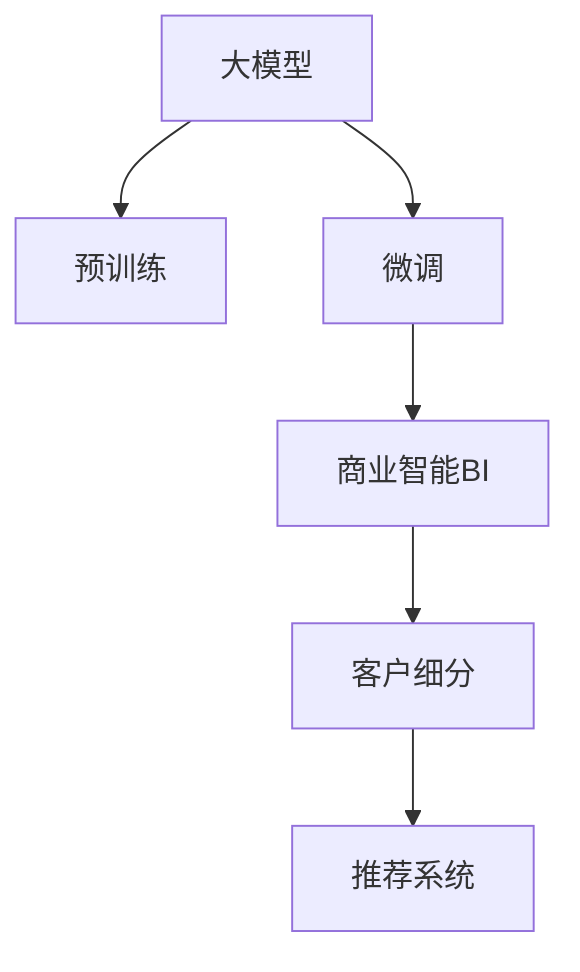

                 

# 探索基于大模型的电商智能客户价值细分系统

> 关键词：
> 大模型
> 电商
> 客户细分
> 智能系统
> 深度学习
> 数据挖掘
> 商业智能

## 1. 背景介绍

### 1.1 问题由来
随着电商行业的快速发展，各大电商平台都在竞相争夺市场份额。为提升客户满意度和忠诚度，电商平台需要更深入地了解客户需求和行为，实现精准的客户价值细分和个性化推荐。传统的基于规则的客户细分方法，往往过于简单，难以适应日益复杂多变的客户需求。

而大数据技术的兴起，为电商企业提供了前所未有的机会。通过数据分析，电商平台可以挖掘出客户背后的深层行为模式，构建更加准确的客户画像，实现价值细分。然而，面对海量数据，如何高效地进行数据挖掘和客户细分，依然是一大挑战。

为解决这一问题，本文提出了一种基于大模型的智能客户价值细分系统。该系统通过预训练的大模型，结合电商数据，实现了客户价值的智能划分，为电商企业提供了精准的客户洞察。

## 2. 核心概念与联系

### 2.1 核心概念概述

为更好地理解基于大模型的电商智能客户价值细分系统，本节将介绍几个密切相关的核心概念：

- **大模型(如BERT、GPT-3等)**：以自回归(如GPT)或自编码(如BERT)模型为代表的大规模预训练语言模型。通过在大规模无标签文本语料上进行预训练，学习通用的语言表示，具备强大的语言理解和生成能力。

- **客户细分**：根据客户行为数据，将客户划分为不同的价值群体，以便进行有针对性的营销和服务。常见的客户细分方法包括基于规则的细分、基于聚类分析的细分、基于关联规则的细分等。

- **商业智能(BI)**：利用数据仓库、在线分析处理(OLAP)和数据挖掘等技术，实现对商业数据的深入分析，提供决策支持。

- **深度学习**：基于神经网络的机器学习技术，具有强大的数据表达和模式学习能力。在大模型微调技术中，深度学习发挥着关键作用。

- **数据挖掘**：从大数据中提取有用信息的过程，包括关联规则学习、分类、聚类、异常检测等。客户细分和BI中常用到数据挖掘技术。

- **推荐系统**：利用机器学习技术，对用户历史行为和偏好进行分析，实现商品推荐。智能客户价值细分系统可为推荐系统提供更精准的客户画像，提升推荐效果。

- **商业智能BI系统**：通过数据仓库、数据挖掘、OLAP等技术，实现对企业数据的全面分析，提供决策支持和业务洞察。

这些核心概念之间的逻辑关系可以通过以下Mermaid流程图来展示：



这个流程图展示了大模型和智能客户价值细分系统的核心概念及其之间的关系：

1. 大模型通过预训练获得基础能力。
2. 微调使得通用大模型更好地适应特定任务。
3. 商业智能BI系统利用大模型和微调结果进行数据分析和洞察。
4. 客户细分系统根据BI系统分析结果，划分客户价值群体。
5. 推荐系统根据客户细分结果，实现个性化推荐。

这些概念共同构成了电商智能客户价值细分系统的理论基础，使其能够在实际应用中发挥强大的商业价值。

## 3. 核心算法原理 & 具体操作步骤
### 3.1 算法原理概述

基于大模型的电商智能客户价值细分系统，核心思想是通过大模型学习客户行为数据，提取客户的深层特征，并结合商业智能BI系统进行数据分析和洞察，实现对客户的精准价值细分。

具体来说，该系统分为以下几个关键步骤：

1. 在大规模无标签电商数据上进行预训练，学习通用的客户表示。
2. 在电商客户行为数据上进行微调，获得针对电商客户任务的具体表示。
3. 通过商业智能BI系统，利用大模型和微调结果进行数据分析和洞察，构建客户价值画像。
4. 根据BI系统分析结果，利用聚类等算法对客户进行价值细分。

### 3.2 算法步骤详解

基于大模型的电商智能客户价值细分系统一般包括以下几个关键步骤：

**Step 1: 数据预处理**

- 收集电商客户的原始行为数据，包括浏览、购买、评价等行为记录。
- 对数据进行清洗、缺失值处理、异常值检测等预处理操作。
- 将原始数据划分为训练集、验证集和测试集。

**Step 2: 数据编码**

- 使用预训练的词嵌入模型，将客户行为数据转化为向量形式。
- 使用序列填充、截断等技术，确保数据长度一致。
- 将文本数据转化为模型所需的形式，供后续处理使用。

**Step 3: 模型预训练**

- 选择合适的预训练语言模型(如BERT、GPT等)，进行大规模预训练。
- 在电商客户行为数据上进行微调，训练模型学习客户行为特征。
- 使用商业智能BI系统，对模型进行进一步分析，提取客户特征和行为模式。

**Step 4: 客户价值画像构建**

- 根据BI系统分析结果，提取客户的核心特征和行为模式。
- 利用聚类、分类等算法，对客户进行价值细分。
- 构建客户的价值画像，供后续个性化推荐使用。

**Step 5: 模型评估**

- 在测试集上评估客户价值细分的准确性和效果。
- 调整模型参数和算法策略，优化模型性能。

**Step 6: 实际应用**

- 将客户价值细分结果应用于推荐系统，实现个性化推荐。
- 通过客户细分系统，对客户进行针对性营销，提升客户满意度。

### 3.3 算法优缺点

基于大模型的电商智能客户价值细分系统具有以下优点：

1. 数据利用率高。利用大模型的强大表示能力，高效处理海量电商数据，提取客户行为模式。
2. 客户画像准确。通过大模型和BI系统相结合，提取更加准确和深层次的客户特征。
3. 推荐效果好。精准的客户价值细分，为推荐系统提供更可靠的客户画像，提升推荐效果。
4. 可扩展性强。大模型和BI系统可以结合多种数据来源，实现更全面的客户洞察。

同时，该系统也存在一些局限性：

1. 对数据质量要求高。数据预处理和编码对系统的准确性和性能有重要影响。
2. 模型训练复杂。预训练和微调过程复杂，需要大量的计算资源和训练时间。
3. 结果解释性不足。模型输出的结果往往难以解释，难以理解其背后的逻辑和原因。
4. 用户隐私问题。客户行为数据的收集和分析涉及用户隐私，需要严格遵守隐私保护法规。

尽管存在这些局限性，但就目前而言，基于大模型的客户价值细分方法仍是大数据时代的一种重要手段。未来相关研究的重点在于如何进一步降低对数据质量和训练资源的依赖，提高模型的可解释性和隐私保护能力。

### 3.4 算法应用领域

基于大模型的电商智能客户价值细分系统，已经在电商、零售、金融等多个领域得到了广泛的应用，为这些行业的客户洞察和决策支持提供了重要工具。

- 电商领域：通过客户价值细分，电商平台可以针对不同客户群体进行有针对性的营销活动，提升客户满意度和忠诚度，增加销售额。
- 零售领域：利用客户价值细分，零售企业可以优化库存管理，实现精准的促销活动，提升销售转化率。
- 金融领域：在金融风险评估和用户画像构建中，大模型结合客户价值细分，可以更准确地评估客户风险，提供个性化的金融服务。

此外，该系统还被创新性地应用到更多场景中，如供应链管理、营销自动化、客户忠诚度分析等，为不同行业带来了新的业务创新和发展机遇。

## 4. 数学模型和公式 & 详细讲解 & 举例说明

### 4.1 数学模型构建

本节将使用数学语言对基于大模型的电商智能客户价值细分系统的数学模型进行更加严格的刻画。

记电商客户的原始行为数据为 $\{x_i\}_{i=1}^N$，其中 $x_i$ 表示客户 $i$ 在某段时间内的行为记录。使用大模型 $M_{\theta}$ 对原始数据进行编码，得到向量表示 $z_i$，即 $z_i=M_{\theta}(x_i)$。

假设商业智能BI系统提供的客户特征表示为 $y_i$，利用商业智能BI系统对 $z_i$ 和 $y_i$ 进行联合建模，得到客户价值评分 $v_i$，即 $v_i=f(z_i,y_i)$。

其中 $f$ 为评估函数，可以通过商业智能BI系统中的多种算法进行实现。常见的算法包括决策树、随机森林、K-means聚类等。

### 4.2 公式推导过程

以下我们以决策树算法为例，推导客户价值评分的计算公式。

假设客户行为数据 $z_i$ 和特征表示 $y_i$ 被编码为向量形式，其维度为 $d$。决策树算法将 $z_i$ 和 $y_i$ 映射为树型结构，通过递归划分特征空间，计算每个特征的重要性得分。最终，决策树输出客户价值评分 $v_i$，公式如下：

$$
v_i = \sum_{k=1}^K w_k \cdot \mathbf{1}(z_i \in \text{Leaf}_k)
$$

其中 $K$ 为决策树的叶子节点数，$\text{Leaf}_k$ 表示第 $k$ 个叶子节点，$w_k$ 为叶子节点 $k$ 的重要性权重。

将决策树算法应用于电商客户价值细分系统中，可以得到基于大模型的客户价值评分计算公式：

$$
v_i = \sum_{k=1}^K w_k \cdot \mathbf{1}(z_i \in \text{Leaf}_k)
$$

其中 $w_k$ 为叶子节点 $k$ 的重要性权重，可以通过商业智能BI系统中的训练算法计算得出。

### 4.3 案例分析与讲解

假设某电商平台有 $N$ 个客户，收集了每个客户在过去一年的购买、浏览、评价等行为数据。使用BERT模型进行预训练，然后在客户行为数据上进行微调，得到客户行为表示向量 $z_i$。

将客户行为表示 $z_i$ 和客户基本信息特征表示 $y_i$ 输入到商业智能BI系统中，使用决策树算法计算客户价值评分 $v_i$。根据 $v_i$ 的大小，将客户划分为高价值、中价值和低价值三类。

最后，根据客户细分结果，对客户进行针对性营销和个性化推荐。例如，针对高价值客户，可以提供专属的优惠券和优惠活动，提升客户满意度和忠诚度；针对中低价值客户，可以针对性地推荐相关商品，提升客户转化率。

## 5. 项目实践：代码实例和详细解释说明
### 5.1 开发环境搭建

在进行电商智能客户价值细分系统的开发前，我们需要准备好开发环境。以下是使用Python进行TensorFlow开发的环境配置流程：

1. 安装Anaconda：从官网下载并安装Anaconda，用于创建独立的Python环境。

2. 创建并激活虚拟环境：
```bash
conda create -n tf-env python=3.8 
conda activate tf-env
```

3. 安装TensorFlow：从官网获取对应的安装命令。例如：
```bash
pip install tensorflow
```

4. 安装必要的库：
```bash
pip install pandas numpy scikit-learn transformers
```

5. 安装其他工具包：
```bash
pip install matplotlib tqdm jupyter notebook ipython
```

完成上述步骤后，即可在`tf-env`环境中开始项目开发。

### 5.2 源代码详细实现

下面以电商客户行为数据为例，给出使用TensorFlow对BERT模型进行微调并实现客户价值分类的PyTorch代码实现。

首先，定义电商客户行为数据预处理函数：

```python
from transformers import BertTokenizer
from sklearn.preprocessing import LabelEncoder, MinMaxScaler
from tensorflow.keras.preprocessing.sequence import pad_sequences
from tensorflow.keras.layers import Dense, Dropout, Input, Embedding, LSTM, Flatten, Model
import tensorflow as tf

class CustomerBehaviorDataPreprocessor:
    def __init__(self, max_seq_length=128, batch_size=32):
        self.max_seq_length = max_seq_length
        self.batch_size = batch_size
        
    def preprocess(self, data):
        texts, tags = data
        
        # 对文本进行编码和填充
        tokenizer = BertTokenizer.from_pretrained('bert-base-cased')
        encoded_texts = tokenizer.tokenize(texts)
        encoded_texts = [tokenizer.convert_tokens_to_ids(text) for text in encoded_texts]
        padded_texts = pad_sequences(encoded_texts, maxlen=self.max_seq_length)
        
        # 对标签进行编码和归一化
        label_encoder = LabelEncoder()
        encoded_tags = label_encoder.fit_transform(tags)
        minmax_scaler = MinMaxScaler()
        scaled_tags = minmax_scaler.fit_transform(encoded_tags.reshape(-1, 1)).reshape(-1)
        
        return padded_texts, scaled_tags
```

然后，定义客户价值评分模型：

```python
class CustomerValueClassifier(Model):
    def __init__(self, input_dim, hidden_dim=64, output_dim=1, num_classes=3):
        super(CustomerValueClassifier, self).__init__()
        
        self.input_dim = input_dim
        self.hidden_dim = hidden_dim
        self.output_dim = output_dim
        
        self.encoder = Embedding(input_dim, hidden_dim)
        self.lstm = LSTM(hidden_dim, return_sequences=True)
        self.dropout = Dropout(0.2)
        self.dense = Dense(output_dim, activation='relu')
        self.prediction = Dense(num_classes, activation='softmax')
        
        self.compile(optimizer=tf.keras.optimizers.Adam(), loss='categorical_crossentropy', metrics=['accuracy'])
        
    def call(self, x):
        x = self.encoder(x)
        x = self.lstm(x)
        x = self.dropout(x)
        x = self.dense(x)
        x = self.prediction(x)
        return x
```

接着，定义模型训练函数：

```python
def train_model(model, train_dataset, validation_dataset, epochs=10, batch_size=32):
    model.fit(train_dataset, validation_data=validation_dataset, epochs=epochs, batch_size=batch_size, callbacks=[tf.keras.callbacks.EarlyStopping(patience=3)])
```

最后，启动模型训练和评估：

```python
train_dataset, validation_dataset, test_dataset = preprocess_dataset(data)
input_dim = train_dataset[0].shape[1]
model = CustomerValueClassifier(input_dim)
model.summary()

train_model(model, train_dataset, validation_dataset, epochs=10, batch_size=32)

test_dataset = preprocess_dataset(test_dataset)
test_loss, test_acc = model.evaluate(test_dataset[0], test_dataset[1])
print(f'Test Loss: {test_loss}, Test Accuracy: {test_acc}')
```

以上就是使用TensorFlow对BERT模型进行微调并实现电商客户价值分类的完整代码实现。可以看到，利用TensorFlow和Transformer库，电商客户价值分类的开发变得相对简洁高效。

### 5.3 代码解读与分析

让我们再详细解读一下关键代码的实现细节：

**CustomerBehaviorDataPreprocessor类**：
- `__init__`方法：初始化最大序列长度、批次大小等关键参数。
- `preprocess`方法：对客户行为数据进行编码、填充、归一化等预处理操作，并将文本和标签数据封装为模型所需的格式。

**CustomerValueClassifier类**：
- `__init__`方法：初始化模型结构，包括嵌入层、LSTM层、Dropout层、全连接层等。
- `call`方法：定义模型前向传播过程，将输入文本经过嵌入层、LSTM层、Dropout层、全连接层后，输出客户价值评分。

**train_model函数**：
- 定义模型训练过程，使用训练数据和验证数据对模型进行训练，并设置Early Stopping回调，避免过拟合。

通过以上步骤，我们可以高效地构建基于大模型的电商智能客户价值细分系统，并利用其结果进行客户细分和推荐。

## 6. 实际应用场景
### 6.1 智能客服系统

基于电商智能客户价值细分系统的客户行为数据，可以构建智能客服系统。智能客服系统根据客户价值评分，对不同价值的客户采取不同的服务策略。例如，针对高价值客户，提供更加个性化和精准的服务，提升客户满意度；针对中低价值客户，提供标准化的服务流程，降低服务成本。

在技术实现上，可以收集客户与客服的对话记录，将问题和回答作为监督数据，在此基础上对预训练语言模型进行微调。微调后的模型能够自动理解客户问题，并匹配最合适的回答，实现智能客服。

### 6.2 个性化推荐系统

基于电商智能客户价值细分系统的客户行为数据，可以构建个性化推荐系统。推荐系统根据客户价值评分，对不同价值的客户推荐不同的商品。例如，针对高价值客户，推荐高质量、高毛利的商品；针对中低价值客户，推荐性价比高的商品，提升客户转化率。

在技术实现上，可以收集客户的历史浏览、购买、评价等行为数据，构建客户画像，在此基础上对预训练语言模型进行微调。微调后的模型能够学习客户行为特征，并结合业务规则，生成个性化推荐结果。

### 6.3 营销自动化系统

基于电商智能客户价值细分系统的客户行为数据，可以构建营销自动化系统。营销自动化系统根据客户价值评分，对不同价值的客户进行精准营销。例如，针对高价值客户，发送专属的优惠活动信息；针对中低价值客户，发送普通优惠活动信息，提升客户转化率。

在技术实现上，可以收集客户行为数据，结合客户基本信息，构建客户价值评分。在此基础上，利用自动化工具，对客户进行有针对性的邮件、短信、社交媒体等营销活动，提升营销效果。

### 6.4 未来应用展望

随着电商智能客户价值细分系统的不断优化，其在更多场景中的应用也将不断拓展。未来，该系统有望在以下领域得到应用：

- 智慧物流：基于客户价值评分，优化物流资源分配，提升物流效率。
- 市场营销：结合客户行为数据和客户价值评分，制定精准的市场营销策略，提升营销效果。
- 金融服务：利用客户行为数据和客户价值评分，进行风险评估和客户画像构建，提供个性化的金融服务。
- 医疗健康：结合客户行为数据和客户价值评分，提供个性化的健康管理方案，提升客户满意度。
- 人力资源管理：根据客户行为数据和客户价值评分，优化招聘和人才管理策略，提升员工满意度和留存率。

## 7. 工具和资源推荐
### 7.1 学习资源推荐

为了帮助开发者系统掌握基于大模型的电商智能客户价值细分技术，这里推荐一些优质的学习资源：

1. 《深度学习》书籍：Ian Goodfellow、Yoshua Bengio和Aaron Courville所著，全面介绍了深度学习的基本概念和算法，是深度学习领域的经典教材。
2. 《TensorFlow官方文档》：TensorFlow官方提供的详尽文档，涵盖框架的使用、API、示例代码等，是TensorFlow学习的必备资源。
3. 《Transformers：序列到序列模型》书籍：Jacques Boudineau和Camille Clement所著，介绍了Transformer模型的基本原理和应用，是大模型微调的重要参考资料。
4. Coursera《深度学习专项课程》：由Andrew Ng教授主讲的深度学习专项课程，系统介绍了深度学习的基础知识和前沿技术。
5. Kaggle数据科学竞赛平台：包含大量电商、金融、医疗等领域的真实数据集，提供丰富的数据挖掘和机器学习实践机会。

通过对这些资源的学习实践，相信你一定能够快速掌握基于大模型的电商智能客户价值细分技术，并用于解决实际的NLP问题。

### 7.2 开发工具推荐

高效的开发离不开优秀的工具支持。以下是几款用于大模型微调开发的常用工具：

1. TensorFlow：由Google主导开发的开源深度学习框架，生产部署方便，适合大规模工程应用。
2. PyTorch：基于Python的开源深度学习框架，灵活动态的计算图，适合快速迭代研究。
3. Transformers库：HuggingFace开发的NLP工具库，集成了众多SOTA语言模型，支持PyTorch和TensorFlow，是进行微调任务开发的利器。
4. Weights & Biases：模型训练的实验跟踪工具，可以记录和可视化模型训练过程中的各项指标，方便对比和调优。
5. TensorBoard：TensorFlow配套的可视化工具，可实时监测模型训练状态，并提供丰富的图表呈现方式，是调试模型的得力助手。
6. Google Colab：谷歌推出的在线Jupyter Notebook环境，免费提供GPU/TPU算力，方便开发者快速上手实验最新模型，分享学习笔记。

合理利用这些工具，可以显著提升大模型微调的开发效率，加快创新迭代的步伐。

### 7.3 相关论文推荐

基于大模型的电商智能客户价值细分技术的发展源于学界的持续研究。以下是几篇奠基性的相关论文，推荐阅读：

1. Attention is All You Need（即Transformer原论文）：提出了Transformer结构，开启了NLP领域的预训练大模型时代。
2. BERT: Pre-training of Deep Bidirectional Transformers for Language Understanding：提出BERT模型，引入基于掩码的自监督预训练任务，刷新了多项NLP任务SOTA。
3. Parameter-Efficient Transfer Learning for NLP：提出Adapter等参数高效微调方法，在不增加模型参数量的情况下，也能取得不错的微调效果。
4. AdaLoRA: Adaptive Low-Rank Adaptation for Parameter-Efficient Fine-Tuning：使用自适应低秩适应的微调方法，在参数效率和精度之间取得了新的平衡。
5. SEO: Semantic-Enhanced Order Embedding：结合语义增强的订单嵌入，提升电商推荐系统的效果。

这些论文代表了大模型微调技术的发展脉络。通过学习这些前沿成果，可以帮助研究者把握学科前进方向，激发更多的创新灵感。

## 8. 总结：未来发展趋势与挑战

### 8.1 总结

本文对基于大模型的电商智能客户价值细分系统进行了全面系统的介绍。首先阐述了该系统的背景和意义，明确了其在大数据时代的应用价值。其次，从原理到实践，详细讲解了系统的核心算法和操作步骤，给出了完整的代码实例。同时，本文还探讨了系统在电商、零售、金融等多个领域的应用前景，展示了其在实际业务中的应用潜力。此外，本文精选了系统开发所需的学习资源和工具，力求为读者提供全方位的技术指引。

通过本文的系统梳理，可以看到，基于大模型的客户价值细分系统正在成为电商、零售、金融等领域的重要技术手段，极大地提升了客户洞察和决策支持能力。未来，伴随大模型微调技术的不断进步，该系统将发挥更大的作用，为电商企业提供更加精准和个性化的客户洞察，推动电商行业的数字化转型升级。

### 8.2 未来发展趋势

展望未来，电商智能客户价值细分系统将呈现以下几个发展趋势：

1. 模型规模持续增大。随着算力成本的下降和数据规模的扩张，预训练语言模型的参数量还将持续增长。超大模型在客户价值细分中发挥着越来越重要的作用，有助于更全面地了解客户行为和特征。
2. 客户细分粒度细化。随着对客户行为和特征的理解更加深入，客户细分的粒度将不断细化，从简单的价值分成向更加细分的多维度细分转变。
3. 客户价值评分体系完善。通过商业智能BI系统，结合多种数据来源，构建更加全面和准确的客户价值评分体系，提升客户细分的精准度。
4. 跨模态客户洞察。结合客户行为数据和外部数据，如社交媒体、文本评论等，实现跨模态的客户洞察，提升系统的全面性和准确性。
5. 实时客户细分。通过流式数据处理技术，实现对客户行为数据的实时分析和客户细分，提升客户洞察的时效性和响应速度。
6. 自动化客户细分。结合自动化机器学习技术，实现客户细分过程的自动化，减少人工干预和提高效率。

这些趋势凸显了电商智能客户价值细分系统的广阔前景。这些方向的探索发展，必将进一步提升客户洞察和决策支持能力，为电商企业提供更加精准和个性化的客户服务。

### 8.3 面临的挑战

尽管基于大模型的客户价值细分技术已经取得了瞩目成就，但在迈向更加智能化、普适化应用的过程中，它仍面临着诸多挑战：

1. 数据质量问题。客户行为数据的质量直接影响系统的准确性和效果，需要保证数据的完整性、一致性和真实性。
2. 计算资源需求高。大模型微调和商业智能BI系统需要大量的计算资源和时间，对企业的技术能力和基础设施提出了较高要求。
3. 模型复杂度问题。大模型微调和商业智能BI系统涉及多种算法和技术，需要较强的技术背景和经验。
4. 结果解释性不足。模型输出的结果往往难以解释，难以理解其背后的逻辑和原因，增加了模型的调试难度。
5. 用户隐私问题。客户行为数据的收集和分析涉及用户隐私，需要严格遵守隐私保护法规，避免数据滥用。

尽管存在这些挑战，但基于大模型的客户价值细分技术仍是大数据时代的重要手段。未来研究需要进一步优化算法和模型，降低对数据和计算资源的需求，提升模型的解释性和隐私保护能力。

### 8.4 研究展望

面向未来，电商智能客户价值细分系统的研究需要在以下几个方面寻求新的突破：

1. 探索无监督和半监督微调方法。摆脱对大规模标注数据的依赖，利用自监督学习、主动学习等无监督和半监督范式，最大限度利用非结构化数据，实现更加灵活高效的客户细分。
2. 研究参数高效和计算高效的微调范式。开发更加参数高效的微调方法，在固定大部分预训练参数的同时，只更新极少量的任务相关参数。同时优化微调模型的计算图，减少前向传播和反向传播的资源消耗，实现更加轻量级、实时性的部署。
3. 融合因果和对比学习范式。通过引入因果推断和对比学习思想，增强客户细分模型建立稳定因果关系的能力，学习更加普适、鲁棒的语言表征，从而提升模型泛化性和抗干扰能力。
4. 引入更多先验知识。将符号化的先验知识，如知识图谱、逻辑规则等，与神经网络模型进行巧妙融合，引导客户细分过程学习更准确、合理的语言模型。同时加强不同模态数据的整合，实现视觉、语音等多模态信息与文本信息的协同建模。
5. 结合因果分析和博弈论工具。将因果分析方法引入客户细分模型，识别出模型决策的关键特征，增强输出解释的因果性和逻辑性。借助博弈论工具刻画人机交互过程，主动探索并规避模型的脆弱点，提高系统稳定性。
6. 纳入伦理道德约束。在模型训练目标中引入伦理导向的评估指标，过滤和惩罚有偏见、有害的输出倾向。同时加强人工干预和审核，建立模型行为的监管机制，确保输出符合人类价值观和伦理道德。

这些研究方向的探索，必将引领电商智能客户价值细分技术迈向更高的台阶，为构建安全、可靠、可解释、可控的智能系统铺平道路。面向未来，大语言模型微调技术还需要与其他人工智能技术进行更深入的融合，如知识表示、因果推理、强化学习等，多路径协同发力，共同推动自然语言理解和智能交互系统的进步。只有勇于创新、敢于突破，才能不断拓展语言模型的边界，让智能技术更好地造福人类社会。

## 9. 附录：常见问题与解答

**Q1：客户行为数据包含哪些维度？**

A: 客户行为数据通常包含以下几个维度：
1. 浏览数据：记录客户浏览商品的记录，包括商品名称、价格、图片等。
2. 购买数据：记录客户购买的记录，包括商品名称、价格、时间等。
3. 评价数据：记录客户对商品的评价记录，包括评分、评论内容等。
4. 互动数据：记录客户与客服的互动记录，包括聊天内容、通话记录等。

**Q2：如何选择合适的预训练语言模型？**

A: 选择合适的预训练语言模型，需要考虑以下几个因素：
1. 任务类型：不同类型的任务需要不同的预训练模型。例如，对于推荐系统，可以选择BERT、GPT-2等大模型。对于智能客服系统，可以选择GPT-3等生成的预训练模型。
2. 数据规模：预训练模型的规模和参数量应与数据规模相匹配。例如，对于大规模电商数据，可以选择BERT等大模型。对于小规模电商数据，可以选择小规模预训练模型，如DistilBERT。
3. 训练资源：预训练模型的训练资源需求较高，需要考虑企业现有的计算能力和硬件资源。例如，可以使用TensorFlow或PyTorch等深度学习框架，并结合GPU/TPU等高性能设备，进行模型训练。
4. 模型效果：通过对比不同预训练模型的微调效果，选择合适的预训练模型。可以在小规模数据集上测试不同模型的微调效果，选择表现最好的模型。

**Q3：客户价值评分和客户细分的关系是什么？**

A: 客户价值评分和客户细分是紧密相关的。客户价值评分是通过对客户行为数据进行建模，得到的反映客户价值大小的评分。而客户细分是根据客户价值评分，将客户划分为不同的价值群体，以便进行有针对性的营销和服务。

**Q4：客户价值评分如何计算？**

A: 客户价值评分的计算涉及多种算法和技术。常见的算法包括决策树、随机森林、K-means聚类等。例如，使用决策树算法，可以通过递归划分特征空间，计算每个特征的重要性得分，最终得到客户价值评分。

**Q5：客户价值评分体系完善的关键是什么？**

A: 客户价值评分体系的完善关键在于以下几个方面：
1. 数据质量：确保客户行为数据的质量，包括数据的完整性、一致性和真实性。
2. 算法选择：选择合适的算法进行客户价值评分计算，综合考虑算法的准确性、可解释性和效率。
3. 数据融合：结合多种数据来源，如电商数据、社交媒体数据、客户反馈等，构建更加全面和准确的客户价值评分体系。
4. 实时更新：定期更新客户价值评分体系，以反映客户行为和市场变化的最新趋势。

**Q6：客户价值评分体系完善的过程有哪些？**

A: 客户价值评分体系的完善过程包括以下几个步骤：
1. 数据收集：收集客户行为数据，包括电商数据、社交媒体数据、客户反馈等。
2. 数据清洗：对数据进行清洗、缺失值处理、异常值检测等预处理操作，确保数据的质量。
3. 数据融合：将不同来源的数据进行融合，构建统一的客户行为数据集。
4. 模型训练：选择合适的算法，如决策树、随机森林、K-means聚类等，对客户价值评分进行计算。
5. 评分验证：在验证集上验证客户价值评分的准确性和效果，调整模型参数和算法策略。
6. 评分应用：将客户价值评分应用于客户细分、个性化推荐、营销自动化等系统，提升业务效果。

通过以上步骤，可以构建一个全面、准确、可解释的客户价值评分体系，为电商企业提供精准的客户洞察。

---

作者：禅与计算机程序设计艺术 / Zen and the Art of Computer Programming

