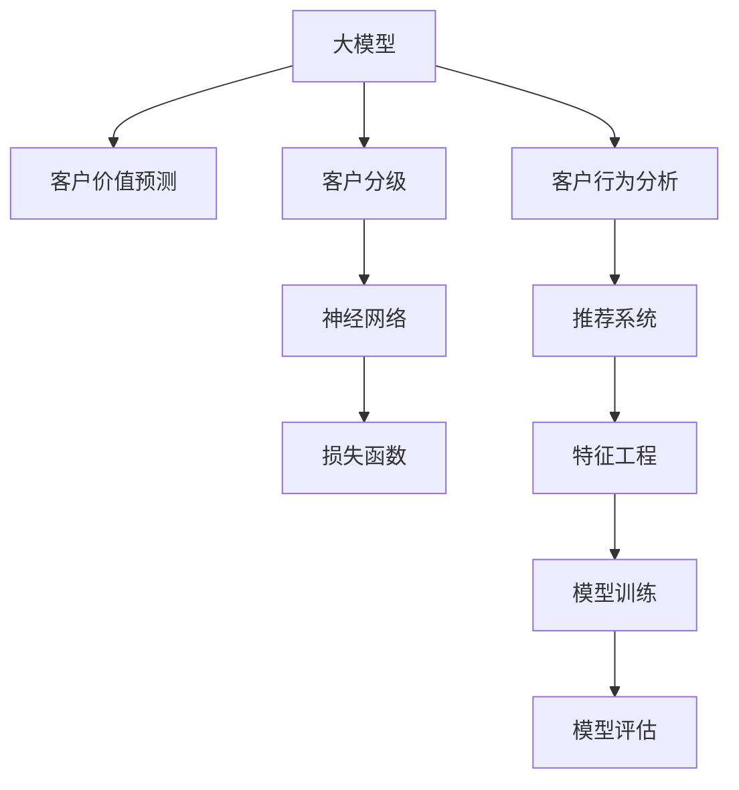

                 

# 探索基于大模型的电商智能客户价值预测与分级系统

> 关键词：客户价值预测, 电商智能, 大模型, 客户分级, 神经网络, 损失函数, 客户行为分析, 推荐系统, 特征工程, 模型训练, 模型评估

## 1. 背景介绍

### 1.1 问题由来

在当今数字化时代，电商企业面临着一个越来越复杂和动态的商业环境。如何精准地识别并细分客户群体，从而制定有效的营销策略和个性化推荐，以最大化客户价值和销售额，成为了电商企业关注的焦点。传统的数据驱动方式往往需要耗费大量人力物力，难以满足实时性和个性化要求。因此，基于大模型的电商智能客户价值预测与分级系统应运而生。

### 1.2 问题核心关键点

该系统旨在通过预训练的大模型，结合电商领域的数据特征，自动学习并预测客户的长期价值，并据此对客户进行细分和分级。系统的关键点包括：

- **数据驱动**：系统通过分析客户历史行为数据，预测未来价值。
- **自动学习**：利用大模型进行自主特征学习，无需手动设计和选择特征。
- **实时预测**：支持实时计算和更新，适应电商市场的快速变化。
- **个性化推荐**：根据客户分级结果，提供个性化产品推荐。
- **算法透明**：采用可解释性强的大模型，如XGBoost，以增加透明度和可信度。

### 1.3 问题研究意义

构建电商智能客户价值预测与分级系统，对于提升电商企业的客户忠诚度、销售额和市场竞争力具有重要意义：

1. **提升客户体验**：通过个性化的产品推荐和服务，满足客户需求，提高满意度。
2. **优化库存管理**：精准预测客户需求，减少库存积压，提高库存周转率。
3. **精准营销**：基于客户分级结果，制定针对性营销策略，提升广告和推广效果。
4. **数据驱动决策**：基于数据驱动的预测结果，支持企业制定更科学的业务决策。
5. **成本优化**：减少对人工数据分析的依赖，降低成本。

## 2. 核心概念与联系

### 2.1 核心概念概述

为更好地理解基于大模型的电商智能客户价值预测与分级系统的原理和应用，本节将介绍几个核心概念：

- **大模型**：指经过大规模数据预训练的深度学习模型，如BERT、GPT等。具备强大的语义理解能力，可以自动提取和表示复杂特征。
- **客户价值预测**：预测客户未来的购买行为和消费金额，评估客户的长期价值。
- **客户分级**：根据客户的购买行为和属性，将客户分为不同的级别或分类，以便进行针对性营销。
- **神经网络**：一种能够自动学习复杂特征的深度学习模型，适合处理电商领域的高维数据。
- **损失函数**：衡量模型预测值与真实值之间差异的函数，用于训练模型。
- **客户行为分析**：分析客户的历史行为数据，如浏览、购买、点击等，提取有价值的信息。
- **推荐系统**：基于用户行为和偏好，推荐相关产品，提升用户满意度。
- **特征工程**：从原始数据中提取和构建有意义的特征，提高模型的预测能力。
- **模型训练**：通过不断调整模型参数，使模型在训练数据上表现最优。
- **模型评估**：通过测试集评估模型预测的准确性和稳定性，判断模型性能。

这些核心概念通过以下Mermaid流程图进行展示，形成了系统的逻辑框架：



这个流程图展示了系统的主要组成部分及其相互关系：

1. **大模型**：提供底层特征提取能力。
2. **客户价值预测**：利用大模型预测客户未来价值。
3. **客户分级**：基于预测结果对客户进行分类。
4. **神经网络**：作为预测和分级的核心模型。
5. **损失函数**：用于模型训练，优化预测结果。
6. **客户行为分析**：提取客户历史行为数据特征。
7. **推荐系统**：根据分级结果推荐产品。
8. **特征工程**：构建模型所需特征。
9. **模型训练**：通过数据驱动训练模型。
10. **模型评估**：评估模型性能，调整模型参数。

## 3. 核心算法原理 & 具体操作步骤
### 3.1 算法原理概述

基于大模型的电商智能客户价值预测与分级系统，其核心算法原理是利用预训练的深度神经网络模型，对客户行为数据进行特征提取和预测。具体而言，系统采用以下步骤：

1. **数据预处理**：清洗、标准化和归一化原始数据。
2. **特征提取**：利用大模型提取客户行为特征。
3. **模型训练**：在大模型基础上进行微调，构建客户价值预测模型。
4. **客户分级**：根据模型预测结果，对客户进行分级。
5. **推荐系统优化**：根据分级结果，优化推荐系统。

### 3.2 算法步骤详解

**Step 1: 数据预处理**
- 清洗原始数据，去除噪声和异常值。
- 标准化和归一化数据，使模型能够更好地处理。
- 分批次读取数据，避免内存溢出。

**Step 2: 特征提取**
- 使用大模型（如BERT）对客户历史行为数据进行编码，得到向量表示。
- 提取重要特征，如购买金额、浏览时间、点击次数等。
- 构建特征向量，作为模型的输入。

**Step 3: 模型训练**
- 选择合适的神经网络架构（如XGBoost、深度神经网络）。
- 定义损失函数，如均方误差（MSE）、交叉熵（CE）等。
- 使用梯度下降等优化算法，训练模型。
- 定期评估模型性能，调整超参数。

**Step 4: 客户分级**
- 根据模型预测的客户价值，设置阈值进行分级。
- 根据分级结果，提供个性化推荐。

**Step 5: 推荐系统优化**
- 根据分级结果，优化推荐系统，提升推荐效果。
- 实时更新模型，适应新数据。

### 3.3 算法优缺点

基于大模型的电商智能客户价值预测与分级系统具有以下优点：

1. **自动化程度高**：自动学习特征，无需手动设计和选择特征，节省时间和成本。
2. **预测准确度高**：利用大模型的语义理解能力，提高预测准确度。
3. **实时性高**：支持实时预测和更新，快速响应市场变化。
4. **个性化推荐**：根据分级结果，提供个性化推荐，提升客户体验。
5. **可解释性强**：采用可解释性强的大模型，增加透明度和可信度。

然而，该系统也存在一些缺点：

1. **数据质量依赖高**：依赖于高质量、高量级的数据，数据缺失或不完整时可能影响预测结果。
2. **计算资源需求高**：大模型的训练和推理需要较高的计算资源，包括高性能GPU/TPU。
3. **模型复杂度高**：神经网络的复杂度较高，需要一定的专业知识进行调参和优化。
4. **对抗攻击风险**：模型可能受到对抗样本的攻击，影响预测结果。

### 3.4 算法应用领域

基于大模型的电商智能客户价值预测与分级系统，在电商行业有广泛的应用前景，主要包括以下几个领域：

- **客户忠诚度提升**：通过个性化推荐和针对性营销，提高客户满意度和忠诚度。
- **营销策略优化**：基于客户分级，制定更有针对性的营销策略，提高广告投放效果。
- **库存管理优化**：精准预测客户需求，减少库存积压，提高库存周转率。
- **推荐系统优化**：根据客户分级，优化推荐算法，提升推荐效果。
- **客户行为分析**：分析客户历史行为数据，发现潜在的购买意向和偏好。

## 4. 数学模型和公式 & 详细讲解  
### 4.1 数学模型构建

系统采用神经网络模型进行客户价值预测与分级。假设模型输入为 $X \in \mathbb{R}^n$，输出为 $Y \in \mathbb{R}$ 或 $Y \in \{1, 2, 3, \ldots, K\}$，其中 $K$ 表示客户分级的数量。模型的数学模型为：

$$
\hat{Y} = f(X; \theta)
$$

其中，$f$ 表示模型函数，$\theta$ 为模型参数。模型的预测值 $\hat{Y}$ 与真实值 $Y$ 之间的误差通过损失函数 $\mathcal{L}$ 衡量：

$$
\mathcal{L} = \frac{1}{N} \sum_{i=1}^N \ell(Y_i, \hat{Y}_i)
$$

其中，$\ell$ 表示损失函数，$\{Y_i, \hat{Y}_i\}_{i=1}^N$ 为训练集中的样本和模型预测值。常用的损失函数包括均方误差（MSE）、交叉熵（CE）等。

### 4.2 公式推导过程

以均方误差（MSE）损失函数为例，推导其公式。均方误差损失函数定义为：

$$
\ell(Y, \hat{Y}) = \frac{1}{2}(Y - \hat{Y})^2
$$

对于单个样本，损失函数为：

$$
\ell(Y_i, \hat{Y}_i) = \frac{1}{2}(Y_i - \hat{Y}_i)^2
$$

总体损失函数为：

$$
\mathcal{L} = \frac{1}{N} \sum_{i=1}^N \frac{1}{2}(Y_i - \hat{Y}_i)^2
$$

通过反向传播算法，求导计算模型参数的梯度：

$$
\frac{\partial \mathcal{L}}{\partial \theta} = \frac{1}{N} \sum_{i=1}^N -(Y_i - \hat{Y}_i) \frac{\partial \hat{Y}_i}{\partial \theta}
$$

其中，$\frac{\partial \hat{Y}_i}{\partial \theta}$ 为模型对输入数据的导数，可以通过链式法则和自动微分技术求得。

### 4.3 案例分析与讲解

以一个简单的二分类问题为例，分析均方误差损失函数的推导过程。假设模型预测值为 $\hat{Y}$，真实值为 $Y$，则均方误差损失函数为：

$$
\ell(Y, \hat{Y}) = \frac{1}{2}(Y - \hat{Y})^2
$$

对于单个样本 $i$，损失函数为：

$$
\ell(Y_i, \hat{Y}_i) = \frac{1}{2}(Y_i - \hat{Y}_i)^2
$$

总体损失函数为：

$$
\mathcal{L} = \frac{1}{N} \sum_{i=1}^N \frac{1}{2}(Y_i - \hat{Y}_i)^2
$$

在实际应用中，可以通过均方误差损失函数的推导，更好地理解模型预测与真实值之间的差异，并利用梯度下降等优化算法，最小化损失函数，优化模型参数。

## 5. 项目实践：代码实例和详细解释说明
### 5.1 开发环境搭建

在进行项目实践前，需要准备好开发环境。以下是使用Python进行TensorFlow开发的环境配置流程：

1. 安装Anaconda：从官网下载并安装Anaconda，用于创建独立的Python环境。

2. 创建并激活虚拟环境：
```bash
conda create -n tf-env python=3.8 
conda activate tf-env
```

3. 安装TensorFlow：根据CUDA版本，从官网获取对应的安装命令。例如：
```bash
conda install tensorflow -c pytorch -c conda-forge
```

4. 安装PyTorch：
```bash
pip install torch
```

5. 安装各类工具包：
```bash
pip install numpy pandas scikit-learn matplotlib tqdm jupyter notebook ipython
```

完成上述步骤后，即可在`tf-env`环境中开始项目实践。

### 5.2 源代码详细实现

我们以一个简单的二分类问题为例，给出使用TensorFlow进行模型开发的PyTorch代码实现。

首先，定义模型架构：

```python
import tensorflow as tf

class Model(tf.keras.Model):
    def __init__(self):
        super(Model, self).__init__()
        self.dense1 = tf.keras.layers.Dense(64, activation='relu')
        self.dense2 = tf.keras.layers.Dense(1, activation='sigmoid')
    
    def call(self, x):
        x = self.dense1(x)
        x = self.dense2(x)
        return x
```

然后，定义损失函数和优化器：

```python
from sklearn.metrics import accuracy_score

def loss_fn(y_true, y_pred):
    return tf.reduce_mean(tf.square(y_true - y_pred))
    
optimizer = tf.keras.optimizers.Adam(learning_rate=0.001)
```

接着，定义训练和评估函数：

```python
def train_epoch(model, train_dataset, batch_size):
    model.train()
    for batch in train_dataset:
        x_train, y_train = batch
        with tf.GradientTape() as tape:
            y_pred = model(x_train)
            loss = loss_fn(y_train, y_pred)
        grads = tape.gradient(loss, model.trainable_variables)
        optimizer.apply_gradients(zip(grads, model.trainable_variables))
    
def evaluate(model, test_dataset, batch_size):
    model.eval()
    preds = []
    labels = []
    for batch in test_dataset:
        x_test, y_test = batch
        y_pred = model(x_test)
        preds.append(y_pred.numpy())
        labels.append(y_test.numpy())
    return accuracy_score(labels, preds)
```

最后，启动训练流程并在测试集上评估：

```python
epochs = 10
batch_size = 32

for epoch in range(epochs):
    train_epoch(model, train_dataset, batch_size)
    acc = evaluate(model, test_dataset, batch_size)
    print(f"Epoch {epoch+1}, accuracy: {acc:.3f}")
```

以上就是使用TensorFlow进行二分类问题微调的完整代码实现。可以看到，TensorFlow提供了丰富的API和工具，使得模型构建和训练过程变得简单易行。

### 5.3 代码解读与分析

让我们再详细解读一下关键代码的实现细节：

**Model类**：
- `__init__`方法：初始化模型结构，定义两个全连接层。
- `call`方法：前向传播计算输出，通过两个全连接层进行非线性变换。

**loss_fn函数**：
- 定义均方误差损失函数。

**train_epoch函数**：
- 在每个epoch内，对训练集数据进行迭代训练。
- 使用梯度下降算法更新模型参数。

**evaluate函数**：
- 对测试集数据进行评估，计算模型预测结果与真实标签的准确率。

**训练流程**：
- 定义总的epoch数和batch size，开始循环迭代
- 每个epoch内，在训练集上训练，输出模型预测准确率
- 重复上述过程直至收敛

可以看到，TensorFlow通过其API设计，大大简化了模型的构建和训练过程。开发者可以将更多精力放在特征工程、超参数调优等高层逻辑上，而不必过多关注底层的实现细节。

当然，工业级的系统实现还需考虑更多因素，如模型的保存和部署、超参数的自动搜索、更灵活的任务适配层等。但核心的微调范式基本与此类似。

## 6. 实际应用场景
### 6.1 客户价值预测

在电商智能系统中，客户价值预测是一个核心功能。通过预测客户的未来价值，商家可以更精准地进行营销和推荐，提升客户满意度和销售额。

具体而言，可以收集客户的历史购买记录、浏览行为、评分反馈等数据，使用大模型进行特征提取，构建客户价值预测模型。模型可以预测客户在未来一段时间内的消费金额，帮助商家制定更加精准的营销策略。

### 6.2 客户分级

客户分级是电商智能系统的另一个重要功能。通过将客户按照其价值和行为进行分类，商家可以实施更加个性化和高效的营销手段，提升客户转化率和忠诚度。

具体实现上，可以根据客户价值预测结果，设置不同的分级阈值，将客户分为高、中、低三个级别。根据分级结果，商家可以针对不同级别的客户，实施不同的营销策略，如折扣优惠、个性化推荐等。

### 6.3 推荐系统优化

推荐系统是电商智能系统的关键组成部分。通过客户分级，商家可以优化推荐算法，提升推荐效果，增加客户转化率。

具体而言，可以根据客户分级结果，调整推荐算法中的权重和特征，推荐客户更感兴趣和价值更高的商品。同时，利用客户的历史行为数据，实时更新推荐模型，确保推荐的准确性和个性化。

### 6.4 未来应用展望

随着大模型和电商智能技术的发展，基于大模型的电商智能客户价值预测与分级系统将展现出更大的潜力和应用前景：

- **自动化程度更高**：系统将能够自动学习和优化特征，进一步提升预测和分级的准确性。
- **实时性更强**：利用流式数据处理技术，系统可以实时分析和更新客户数据，适应电商市场的快速变化。
- **智能化更高**：结合机器学习和自然语言处理技术，系统能够更好地理解客户需求，提供更加个性化的服务。
- **应用范围更广**：系统不仅适用于电商领域，还可以扩展到金融、教育、医疗等多个行业，提升各行业的服务质量。
- **技术可解释性更强**：利用可解释性强的模型，系统将能够更好地解释预测和分级的结果，增加用户和商家的信任度。

总之，基于大模型的电商智能客户价值预测与分级系统，将通过更加智能和高效的方式，提升各行业的服务质量和客户体验，成为未来数字化转型的重要工具。

## 7. 工具和资源推荐
### 7.1 学习资源推荐

为了帮助开发者系统掌握大模型和电商智能技术，这里推荐一些优质的学习资源：

1. **《深度学习理论与实践》**：全面介绍深度学习的基本概念和实现方法，适合初学者入门。

2. **《TensorFlow官方文档》**：提供丰富的API和工具，帮助开发者快速上手TensorFlow。

3. **《TensorFlow实战》**：通过实际项目和代码，详细讲解TensorFlow的使用和最佳实践。

4. **《机器学习实战》**：结合实际案例，讲解机器学习模型的构建和优化。

5. **Kaggle平台**：提供丰富的数据集和竞赛，帮助开发者提升实战能力。

通过这些资源的学习实践，相信你一定能够快速掌握大模型和电商智能技术，并用于解决实际的商业问题。

### 7.2 开发工具推荐

高效的开发离不开优秀的工具支持。以下是几款用于大模型和电商智能开发的常用工具：

1. **Jupyter Notebook**：免费的交互式编程环境，支持Python和各种库，方便代码调试和分享。

2. **TensorBoard**：TensorFlow配套的可视化工具，实时监测模型训练状态，提供丰富的图表和指标。

3. **PyTorch**：灵活的深度学习框架，提供自动微分和动态计算图，适合快速迭代研究。

4. **Keras**：高层次API，简化模型的构建和训练过程，适合快速原型开发。

5. **Scikit-learn**：经典的数据处理和机器学习库，提供丰富的算法和工具，适合数据预处理和特征工程。

6. **Pandas**：数据处理和分析库，支持大规模数据操作和分析，适合电商智能数据处理。

合理利用这些工具，可以显著提升大模型和电商智能项目的开发效率，加快创新迭代的步伐。

### 7.3 相关论文推荐

大模型和电商智能技术的发展源于学界的持续研究。以下是几篇奠基性的相关论文，推荐阅读：

1. **Attention is All You Need**：提出Transformer结构，开启了NLP领域的预训练大模型时代。

2. **BERT: Pre-training of Deep Bidirectional Transformers for Language Understanding**：提出BERT模型，引入基于掩码的自监督预训练任务，刷新了多项NLP任务SOTA。

3. **XGBoost: A Scalable Tree Boosting System**：提出XGBoost算法，适合处理大规模数据和高维特征。

4. **A Survey on Deep Learning for Recommendation Systems**：全面综述了深度学习在推荐系统中的应用，适合了解当前推荐算法的研究进展。

5. **A Deep Learning Framework for Recommendation Systems**：提出深度神经网络推荐系统框架，适合理解深度学习在推荐系统中的具体应用。

这些论文代表了大模型和电商智能技术的发展脉络。通过学习这些前沿成果，可以帮助研究者把握学科前进方向，激发更多的创新灵感。

## 8. 总结：未来发展趋势与挑战
### 8.1 总结

本文对基于大模型的电商智能客户价值预测与分级系统进行了全面系统的介绍。首先阐述了大模型和电商智能的研究背景和意义，明确了系统在电商领域的应用价值。其次，从原理到实践，详细讲解了系统的主要组成部分和关键算法，给出了电商智能系统的完整代码实例。同时，本文还广泛探讨了系统在客户价值预测、客户分级和推荐系统优化等领域的实际应用场景，展示了电商智能系统的广泛应用前景。

通过本文的系统梳理，可以看到，基于大模型的电商智能客户价值预测与分级系统在提升电商企业客户价值和销售额方面具有重要意义。利用大模型的强大语义理解和特征提取能力，系统可以自动学习并预测客户未来价值，同时对客户进行分级，并提供个性化推荐，从而实现电商智能的自动化、智能化和实时化。

### 8.2 未来发展趋势

展望未来，基于大模型的电商智能客户价值预测与分级系统将呈现以下几个发展趋势：

1. **自动化程度更高**：系统将能够自动学习和优化特征，进一步提升预测和分级的准确性。

2. **实时性更强**：利用流式数据处理技术，系统可以实时分析和更新客户数据，适应电商市场的快速变化。

3. **智能化更高**：结合机器学习和自然语言处理技术，系统能够更好地理解客户需求，提供更加个性化的服务。

4. **应用范围更广**：系统不仅适用于电商领域，还可以扩展到金融、教育、医疗等多个行业，提升各行业的服务质量。

5. **技术可解释性更强**：利用可解释性强的模型，系统将能够更好地解释预测和分级的结果，增加用户和商家的信任度。

6. **个性化推荐优化**：结合用户行为数据和预测结果，优化推荐算法，提升推荐效果。

以上趋势凸显了大模型和电商智能技术的发展潜力和应用前景。这些方向的探索发展，必将进一步提升系统的预测和分级精度，提升各行业的客户满意度和市场竞争力。

### 8.3 面临的挑战

尽管基于大模型的电商智能客户价值预测与分级系统已经取得了显著成果，但在实际应用中也面临诸多挑战：

1. **数据质量问题**：电商数据具有多维度、高维度、高噪声的特点，数据质量直接影响到系统的预测和分级结果。

2. **计算资源需求高**：大模型和深度学习算法需要高性能计算资源，包括GPU/TPU等。

3. **模型复杂度高**：深度学习模型参数较多，需要大量的调参和优化工作。

4. **对抗攻击风险**：模型可能受到对抗样本的攻击，影响预测和分级的准确性。

5. **用户隐私保护**：电商系统需要保护用户隐私，确保数据使用的合规性和安全性。

6. **跨领域适用性**：电商智能系统在其他领域的适用性需要进一步验证和优化。

正视系统面临的这些挑战，积极应对并寻求突破，将是大模型和电商智能技术走向成熟的必由之路。相信随着学界和产业界的共同努力，这些挑战终将一一被克服，电商智能系统必将在构建人机协同的智能时代中扮演越来越重要的角色。

### 8.4 研究展望

面对电商智能系统所面临的挑战，未来的研究需要在以下几个方面寻求新的突破：

1. **数据清洗和预处理**：开发高效的数据清洗和预处理算法，提升数据质量。

2. **模型压缩和加速**：利用模型压缩和加速技术，降低计算资源需求，提高实时性。

3. **对抗样本防御**：研究对抗样本防御技术，增强模型鲁棒性。

4. **用户隐私保护**：引入隐私保护技术，确保数据使用的合规性和安全性。

5. **跨领域适应性**：结合不同领域的特征和需求，优化模型架构和算法，提升系统的跨领域适用性。

6. **智能化增强**：结合自然语言处理和机器学习技术，提升系统的智能化水平。

这些研究方向的探索，必将引领电商智能技术迈向更高的台阶，为电商企业带来更智能、高效、安全的数字化转型。面向未来，电商智能系统还需要与其他人工智能技术进行更深入的融合，如知识表示、因果推理、强化学习等，多路径协同发力，共同推动电商智能系统的进步。只有勇于创新、敢于突破，才能不断拓展电商智能系统的边界，让智能技术更好地造福电商企业和消费者。

## 9. 附录：常见问题与解答

**Q1：电商智能系统如何处理海量数据？**

A: 电商智能系统通常采用流式数据处理技术，实时分析和处理数据。具体而言，可以使用Spark、Flink等大数据处理平台，实现数据流的实时处理和存储。同时，利用分布式计算和并行算法，提升数据处理效率。

**Q2：电商智能系统的预测精度如何保证？**

A: 电商智能系统的预测精度可以通过以下几个方面保证：
1. **数据质量**：对原始数据进行清洗和预处理，提升数据质量。
2. **模型优化**：通过超参数调优和模型压缩等技术，优化模型性能。
3. **特征工程**：结合电商领域的特点，设计合适的特征，提升模型预测能力。
4. **实时更新**：利用流式数据处理技术，实时更新模型，适应市场变化。

**Q3：电商智能系统如何保护用户隐私？**

A: 电商智能系统需要严格遵守用户隐私保护法规，如GDPR等。具体措施包括：
1. **数据匿名化**：对敏感数据进行匿名化处理，确保数据无法反识别。
2. **访问控制**：采用访问控制技术，确保数据使用的合法性。
3. **加密传输**：对数据进行加密传输，防止数据泄露。
4. **数据隔离**：对不同用户的数据进行隔离，防止数据交叉污染。

**Q4：电商智能系统如何适应电商市场的快速变化？**

A: 电商智能系统需要采用流式数据处理技术，实时分析和处理数据。具体而言，可以使用Spark、Flink等大数据处理平台，实现数据流的实时处理和存储。同时，利用分布式计算和并行算法，提升数据处理效率。

**Q5：电商智能系统如何优化推荐系统？**

A: 电商智能系统可以结合客户分级结果，优化推荐系统。具体而言，可以根据分级结果，调整推荐算法中的权重和特征，推荐客户更感兴趣和价值更高的商品。同时，利用客户的历史行为数据，实时更新推荐模型，确保推荐的准确性和个性化。

总之，电商智能系统在提升电商企业客户价值和销售额方面具有重要意义。利用大模型的强大语义理解和特征提取能力，系统可以自动学习并预测客户未来价值，同时对客户进行分级，并提供个性化推荐，从而实现电商智能的自动化、智能化和实时化。未来，伴随大模型和电商智能技术的持续演进，基于大模型的电商智能客户价值预测与分级系统必将迎来更大的发展机遇。

