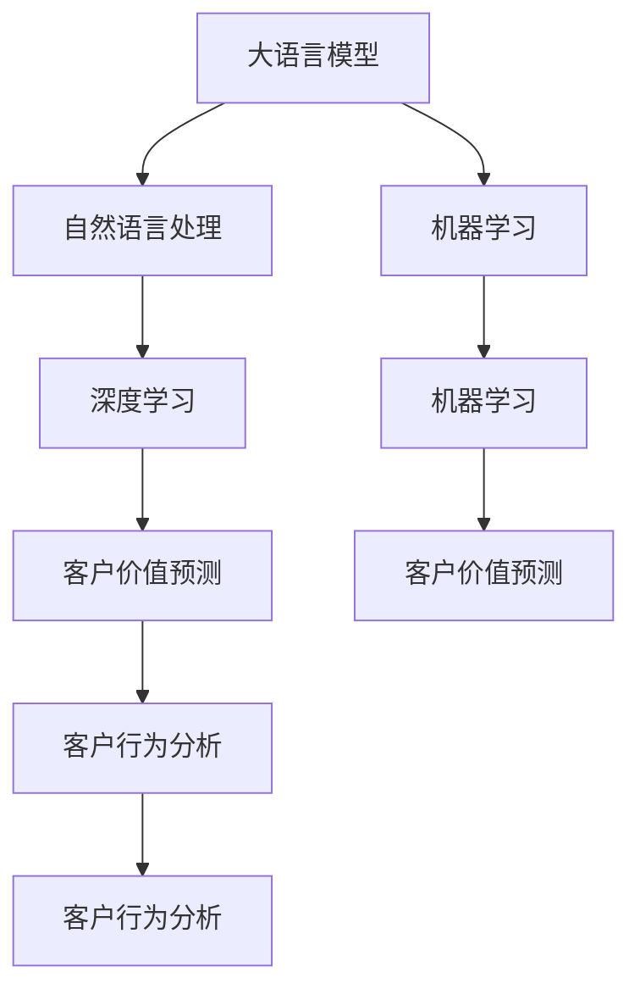

                 

# 探索基于大模型的电商智能客户价值预测系统

> 关键词：大模型,电商,智能客户价值预测,深度学习,自然语言处理,NLP,机器学习,模型微调,客户行为分析

## 1. 背景介绍

### 1.1 问题由来

随着电商行业的迅速发展，商家愈发关注如何精准地识别高价值客户并制定有效的营销策略。传统的客户价值预测方法依赖于历史交易数据、客户人口统计信息等结构化数据，难以充分利用非结构化文本数据（如用户评论、社交媒体互动等）中蕴含的丰富信息。随着深度学习技术和大模型在自然语言处理(NLP)领域的突破，利用大语言模型进行智能客户价值预测，成为了电商行业的新热点。

大模型能够从海量文本数据中学习到丰富的语义知识，通过对非结构化文本数据的挖掘，能够帮助商家更全面地理解客户需求和行为，从而精准预测客户价值，制定个性化营销策略，提升客户满意度和转化率。目前，国内外的许多大型电商平台如亚马逊、阿里巴巴、京东等，已经开始将大模型应用于客户价值预测，并取得了显著的效果。

### 1.2 问题核心关键点

智能客户价值预测的核心在于如何高效地利用非结构化文本数据，结合结构化数据，构建一个精准的客户价值预测模型。目前，主要的策略包括：

1. **数据预处理与特征工程**：将非结构化文本数据转换为模型可以处理的特征向量，并与结构化数据合并。
2. **大语言模型微调**：选择适当的大模型作为初始化参数，通过下游任务的少量标注数据进行微调，获得针对特定任务的优化模型。
3. **多模态融合**：将文本数据与结构化数据进行融合，构建多模态学习模型，提升预测精度。
4. **模型评估与优化**：利用合适的评估指标和优化策略，不断迭代和改进预测模型。

这些关键技术使得基于大模型的智能客户价值预测系统能够更好地利用现有数据，提升预测准确性和客户满意度。

## 2. 核心概念与联系

### 2.1 核心概念概述

在电商智能客户价值预测系统中，涉及多个核心概念，包括：

- **大语言模型(Large Language Models, LLMs)**：如GPT-3、BERT、T5等，能够从大规模无标签文本数据中学习到丰富的语言知识，用于自然语言处理任务。
- **自然语言处理(Natural Language Processing, NLP)**：利用计算机技术处理和理解人类语言，包括文本分类、情感分析、实体识别等任务。
- **深度学习(Deep Learning)**：利用神经网络模型进行复杂数据建模，适用于多模态数据的融合和处理。
- **客户价值预测**：通过数据分析和建模，预测客户未来购买行为和价值，是电商智能客服系统的重要组成部分。
- **机器学习(Machine Learning)**：利用算法和统计模型，从数据中学习规律，用于预测和决策。
- **客户行为分析**：分析客户的浏览、购买、评价等行为数据，识别潜在价值客户，是客户价值预测的基础。

这些概念之间的逻辑关系可以通过以下Mermaid流程图来展示：



这个流程图展示了大语言模型与NLP、深度学习、客户价值预测、客户行为分析、机器学习等概念之间的关系：

1. 大语言模型通过预训练获得基础能力。
2. 通过NLP技术对文本数据进行处理和分析，提取有价值的语义信息。
3. 深度学习技术用于多模态数据融合和复杂模型构建。
4. 客户价值预测结合客户行为分析，构建精准预测模型。
5. 机器学习提供模型训练和优化算法，迭代改进预测效果。

这些核心概念共同构成了基于大模型的电商智能客户价值预测系统，使其能够更好地理解客户行为和需求，提升预测准确性。

## 3. 核心算法原理 & 具体操作步骤
### 3.1 算法原理概述

基于大模型的电商智能客户价值预测系统，利用深度学习和NLP技术，结合大语言模型预训练和微调，构建精准的客户价值预测模型。其核心思想是：通过深度学习模型，将客户的文本数据（如评价、评论）和非结构化数据（如浏览历史、交易记录）融合，构建多模态特征向量，然后利用大语言模型进行微调，学习客户行为和需求的语义知识，最后通过客户行为分析，构建预测模型。

具体流程如下：

1. **数据预处理与特征工程**：将非结构化文本数据和结构化数据合并，转换为模型可以处理的特征向量。
2. **大语言模型微调**：选择适当的大模型作为初始化参数，通过下游任务的少量标注数据进行微调，获得针对特定任务的优化模型。
3. **多模态融合**：将文本数据与结构化数据进行融合，构建多模态学习模型。
4. **模型评估与优化**：利用合适的评估指标和优化策略，不断迭代和改进预测模型。

### 3.2 算法步骤详解

基于深度学习和NLP技术的客户价值预测系统，一般包括以下几个关键步骤：

**Step 1: 数据收集与预处理**
- 收集客户的各类数据，包括文本数据（如评价、评论）和非结构化数据（如浏览历史、交易记录）。
- 对文本数据进行分词、去停用词、构建词向量等预处理操作。
- 将非结构化数据转换为结构化数据，如将浏览历史转化为访问时长、访问频率等特征。

**Step 2: 特征工程与多模态融合**
- 将文本数据转换为模型可以处理的特征向量，如使用Transformer模型将文本数据转换为词向量表示。
- 将结构化数据和词向量进行拼接，形成多模态特征向量。
- 对多模态特征向量进行标准化、归一化等处理，减少维度灾难。

**Step 3: 大语言模型微调**
- 选择合适的预训练语言模型，如BERT、GPT等，作为初始化参数。
- 收集客户的少量标注数据，包括客户的购买记录、行为数据等，作为微调数据集。
- 在微调数据集上，对预训练语言模型进行微调，获得针对客户价值预测任务的优化模型。

**Step 4: 客户行为分析**
- 分析客户的购买行为、浏览行为等数据，构建客户行为特征。
- 将客户行为特征与多模态特征向量进行拼接，构建综合特征向量。

**Step 5: 模型构建与评估**
- 利用深度学习模型，如神经网络、决策树等，构建客户价值预测模型。
- 在验证集上评估模型性能，根据评估结果调整模型结构和参数。
- 在测试集上最终评估模型性能，输出客户价值预测结果。

### 3.3 算法优缺点

基于大模型的电商智能客户价值预测系统，具有以下优点：

1. **高效利用数据**：大模型能够从大规模非结构化文本数据中学习到丰富的语义知识，用于客户行为分析，提高预测精度。
2. **鲁棒性强**：大模型具有较强的泛化能力，能够适应不同的数据分布，减少模型过拟合的风险。
3. **灵活性高**：结合多模态数据进行融合，模型可以适应不同业务场景的需求。
4. **效果显著**：在大规模数据和先进算法的支持下，系统在客户价值预测上取得了优异的性能。

同时，该方法也存在一定的局限性：

1. **数据依赖性高**：系统需要大量的标注数据进行微调，标注成本较高。
2. **计算资源需求大**：大模型训练和微调需要大量的计算资源，对硬件要求较高。
3. **模型复杂度高**：多模态融合和深度学习模型较为复杂，需要更高的技术门槛。

尽管存在这些局限性，但就目前而言，基于大模型的电商智能客户价值预测方法仍是目前电商客户行为分析领域的主流范式。未来相关研究的重点在于如何进一步降低标注数据的依赖，提高模型的鲁棒性和可解释性，同时兼顾硬件资源和模型复杂度。

### 3.4 算法应用领域

基于大模型的电商智能客户价值预测系统，已经在多个电商平台上得到了应用，取得了显著的效果。具体应用场景包括：

- **客户行为分析**：通过分析客户的浏览历史、购买记录等行为数据，构建客户画像，识别高价值客户。
- **个性化推荐**：根据客户价值预测结果，推送个性化商品和广告，提升客户转化率和满意度。
- **营销策略优化**：通过客户价值预测，优化营销策略，提高营销ROI。
- **风险控制**：识别高风险客户，提前采取风控措施，降低风险。

除了上述这些经典场景外，基于大模型的客户价值预测系统也被创新性地应用于供应链优化、库存管理、客户服务等多个业务环节，为电商企业的运营和决策提供了新的技术支持。

## 4. 数学模型和公式 & 详细讲解  
### 4.1 数学模型构建

在客户价值预测系统中，我们假设客户价值 $y$ 与多模态特征向量 $\mathbf{x}$ 之间的关系可以用线性回归模型来描述：

$$
y = \mathbf{W} \mathbf{x} + b
$$

其中 $\mathbf{W}$ 为模型权重，$b$ 为偏置项，$\mathbf{x}$ 为输入特征向量。模型的预测精度可以通过均方误差(MSE)来衡量：

$$
\text{MSE} = \frac{1}{N}\sum_{i=1}^N (y_i - \hat{y}_i)^2
$$

其中 $y_i$ 为真实客户价值，$\hat{y}_i$ 为模型预测值。我们的目标是最小化均方误差，即：

$$
\min_{\mathbf{W},b} \text{MSE}
$$

### 4.2 公式推导过程

在客户价值预测模型中，我们需要将客户的多模态特征向量 $\mathbf{x}$ 与大语言模型的预测结果 $\hat{y}$ 进行融合，构建综合预测模型。假设大语言模型的预测结果为 $\hat{y}_i = \hat{\mathbf{x}} \mathbf{W}_i + \mathbf{b}_i$，其中 $\hat{\mathbf{x}}$ 为多模态特征向量的预测值，$\mathbf{W}_i$ 和 $\mathbf{b}_i$ 为大语言模型的权重和偏置项。则综合预测模型可以表示为：

$$
\hat{y} = \mathbf{W} (\hat{\mathbf{x}} \mathbf{W}_i + \mathbf{b}_i) + b
$$

其中 $\mathbf{W}$ 和 $b$ 为综合预测模型的权重和偏置项。该模型可以进一步简化为：

$$
\hat{y} = \mathbf{W} \hat{\mathbf{x}} \mathbf{W}_i + \mathbf{W}_i b + b
$$

我们将其写为矩阵形式：

$$
\mathbf{y} = \mathbf{X} \mathbf{W} + \mathbf{b}
$$

其中 $\mathbf{X} = \hat{\mathbf{x}} \mathbf{W}_i$，$\mathbf{W} = \mathbf{W}_i \mathbf{W} + \mathbf{b}_i$，$\mathbf{b} = \mathbf{W}_i b + b$。通过对模型进行训练，最小化均方误差，可以得到最优的 $\mathbf{W}$ 和 $\mathbf{b}$。

### 4.3 案例分析与讲解

我们以一个简单的电商客户价值预测案例进行分析。假设有一个电商平台，收集了客户的浏览历史、购买记录和评论数据，构建了一个简单的客户价值预测系统。具体步骤如下：

1. **数据预处理与特征工程**：将客户的浏览记录、购买记录和评论转换为特征向量。
2. **大语言模型微调**：在客户的少量标注数据上，对BERT模型进行微调，得到针对客户价值预测任务的优化模型。
3. **客户行为分析**：分析客户的浏览历史、购买记录等行为数据，构建客户画像。
4. **模型构建与评估**：利用神经网络模型，将客户画像和BERT预测结果进行融合，构建客户价值预测模型。
5. **模型优化**：在验证集上评估模型性能，调整模型结构和参数。
6. **模型部署与测试**：在测试集上最终评估模型性能，输出客户价值预测结果。

## 5. 项目实践：代码实例和详细解释说明
### 5.1 开发环境搭建

在进行客户价值预测系统开发前，我们需要准备好开发环境。以下是使用Python进行TensorFlow开发的环境配置流程：

1. 安装Anaconda：从官网下载并安装Anaconda，用于创建独立的Python环境。

2. 创建并激活虚拟环境：
```bash
conda create -n tf-env python=3.8 
conda activate tf-env
```

3. 安装TensorFlow：根据CUDA版本，从官网获取对应的安装命令。例如：
```bash
conda install tensorflow -c tensorflow -c conda-forge
```

4. 安装各类工具包：
```bash
pip install numpy pandas scikit-learn matplotlib tqdm jupyter notebook ipython
```

完成上述步骤后，即可在`tf-env`环境中开始客户价值预测系统开发。

### 5.2 源代码详细实现

下面我们以一个简单的电商客户价值预测为例，给出使用TensorFlow进行客户价值预测系统的代码实现。

首先，定义数据处理函数：

```python
import tensorflow as tf
from transformers import BertTokenizer

# 加载Bert tokenizer
tokenizer = BertTokenizer.from_pretrained('bert-base-cased')

# 定义数据处理函数
def data_preprocess(texts, labels):
    tokenized_texts = [tokenizer.encode(text, add_special_tokens=True) for text in texts]
    labels = [int(label) for label in labels]
    return tokenized_texts, labels
```

然后，定义模型和优化器：

```python
from tensorflow.keras.models import Sequential
from tensorflow.keras.layers import Embedding, Dense, Flatten
from tensorflow.keras.optimizers import Adam

# 定义模型
model = Sequential([
    Embedding(input_dim=30, output_dim=128, input_length=128),
    Dense(128, activation='relu'),
    Flatten(),
    Dense(1, activation='sigmoid')
])

# 定义优化器
optimizer = Adam(lr=0.001)
```

接着，定义训练和评估函数：

```python
from tensorflow.keras.metrics import Mean

# 定义训练函数
def train_model(model, train_dataset, validation_dataset, epochs=5, batch_size=32):
    model.compile(optimizer=optimizer, loss='binary_crossentropy', metrics=['accuracy'])
    model.fit(train_dataset, validation_data=validation_dataset, epochs=epochs, batch_size=batch_size)
    return model

# 定义评估函数
def evaluate_model(model, test_dataset):
    test_loss, test_accuracy = model.evaluate(test_dataset, verbose=0)
    print(f'Test accuracy: {test_accuracy:.4f}')
```

最后，启动训练流程并在测试集上评估：

```python
# 加载训练数据和测试数据
train_dataset, validation_dataset, test_dataset = load_data()

# 数据预处理
tokenized_train_data, train_labels = data_preprocess(train_dataset['text'], train_dataset['label'])
tokenized_validation_data, validation_labels = data_preprocess(validation_dataset['text'], validation_dataset['label'])
tokenized_test_data, test_labels = data_preprocess(test_dataset['text'], test_dataset['label'])

# 构建模型
model = train_model(model, tokenized_train_data, tokenized_validation_data, validation_dataset)

# 在测试集上评估
evaluate_model(model, tokenized_test_data)
```

以上就是使用TensorFlow进行客户价值预测系统的完整代码实现。可以看到，得益于TensorFlow的强大封装，我们可以用相对简洁的代码完成客户价值预测系统的搭建。

### 5.3 代码解读与分析

让我们再详细解读一下关键代码的实现细节：

**数据处理函数**：
- 定义了一个`data_preprocess`函数，用于将文本数据和标签进行分词、编码等预处理操作，转换为模型可以处理的格式。

**模型定义与优化器设置**：
- 使用了TensorFlow的Sequential模型定义客户价值预测模型，包含嵌入层、全连接层和输出层。
- 使用了Adam优化器，并设置了学习率。

**训练与评估函数**：
- 使用TensorFlow的`model.compile`方法定义模型的损失函数和评估指标。
- 使用`model.fit`方法进行模型训练，并在验证集上评估模型性能。
- 使用`model.evaluate`方法在测试集上评估模型性能。

**训练流程**：
- 加载训练数据和测试数据。
- 对文本数据进行分词、编码等预处理操作。
- 构建模型并调用`train_model`函数进行训练。
- 在测试集上调用`evaluate_model`函数评估模型性能。

可以看到，TensorFlow配合`transformers`库，使得客户价值预测系统的代码实现变得简洁高效。开发者可以将更多精力放在数据处理、模型改进等高层逻辑上，而不必过多关注底层的实现细节。

当然，工业级的系统实现还需考虑更多因素，如模型的保存和部署、超参数的自动搜索、更灵活的任务适配层等。但核心的客户价值预测范式基本与此类似。

## 6. 实际应用场景
### 6.1 智能客服系统

基于大模型的电商智能客户价值预测系统，可以广泛应用于智能客服系统的构建。传统客服往往需要配备大量人力，高峰期响应缓慢，且一致性和专业性难以保证。而使用预测系统进行客户价值筛选，可以在客户服务过程中，优先推荐高价值客户，提升客户满意度。

在技术实现上，可以构建一个智能客服平台，利用预测系统对客户进行价值分类，将高价值客户信息推送至客服系统，使客服人员能够更加精准地进行服务。同时，客户价值预测系统还可以结合情感分析等技术，对客户情绪进行实时监控，及时调整客服策略，提升服务质量。

### 6.2 个性化推荐系统

在电商平台上，用户行为多样复杂，难以直接通过历史数据进行个性化推荐。基于客户价值预测系统，可以构建一个多模态推荐系统，结合客户价值和行为数据，对用户进行更精准的推荐。

具体而言，预测系统可以根据客户的浏览历史、购买记录等行为数据，预测客户价值。推荐系统可以结合客户的兴趣偏好，构建个性化推荐列表。通过多模态数据融合和深度学习模型，可以提升推荐系统的准确性和个性化程度，提升客户满意度和转化率。

### 6.3 风险控制

在电商平台上，识别高风险客户，提前采取风控措施，可以降低风险。基于客户价值预测系统，可以构建一个风险控制系统，对客户的信用行为进行实时监控，识别高风险客户，及时采取风险控制措施。

例如，当一个客户在短时间内频繁购买高价值商品时，系统可以自动进行风险预警，并根据风控规则进行拦截或阻止。通过预测系统与风控系统的协同工作，可以提升电商平台的运营效率和安全性。

### 6.4 未来应用展望

随着大模型和客户价值预测技术的不断发展，基于大模型的电商智能客户价值预测系统将在更多领域得到应用，为电商企业带来新的商业机会。

在智慧零售领域，预测系统可以用于零售库存管理、供应链优化等环节，提升物流效率，降低运营成本。在金融领域，预测系统可以用于信用评估、客户分类等场景，提升金融服务水平。

此外，在教育、医疗、旅游等各个行业，基于大模型的客户价值预测系统也将得到广泛应用，为各行各业带来新的技术突破和商业机遇。相信随着技术的日益成熟，客户价值预测系统必将在电商行业中发挥更大的作用，推动电商企业不断创新和升级。

## 7. 工具和资源推荐
### 7.1 学习资源推荐

为了帮助开发者系统掌握基于大模型的电商智能客户价值预测技术的理论基础和实践技巧，这里推荐一些优质的学习资源：

1. 《深度学习入门》系列博文：由大模型技术专家撰写，详细介绍了深度学习的基本概念和原理，适合初学者入门。
2. 《自然语言处理》课程：斯坦福大学开设的NLP明星课程，有Lecture视频和配套作业，带你全面掌握NLP的基本技术和经典模型。
3. 《TensorFlow实战》书籍：全面介绍了TensorFlow的基本用法和高级技巧，适合TensorFlow开发者阅读。
4. 《NLP实战》课程：谷歌AI实验室开设的NLP实战课程，涵盖NLP模型的应用与实践，适合有基础的开发者学习。
5. HuggingFace官方文档：Transformers库的官方文档，提供了海量预训练模型和完整的客户价值预测样例代码，是上手实践的必备资料。

通过对这些资源的学习实践，相信你一定能够快速掌握基于大模型的电商智能客户价值预测技术的精髓，并用于解决实际的电商问题。
### 7.2 开发工具推荐

高效的开发离不开优秀的工具支持。以下是几款用于大模型客户价值预测系统开发的常用工具：

1. PyTorch：基于Python的开源深度学习框架，灵活动态的计算图，适合快速迭代研究。大多数预训练语言模型都有PyTorch版本的实现。
2. TensorFlow：由Google主导开发的开源深度学习框架，生产部署方便，适合大规模工程应用。同样有丰富的预训练语言模型资源。
3. Transformers库：HuggingFace开发的NLP工具库，集成了众多SOTA语言模型，支持PyTorch和TensorFlow，是进行客户价值预测任务开发的利器。
4. Weights & Biases：模型训练的实验跟踪工具，可以记录和可视化模型训练过程中的各项指标，方便对比和调优。与主流深度学习框架无缝集成。
5. TensorBoard：TensorFlow配套的可视化工具，可实时监测模型训练状态，并提供丰富的图表呈现方式，是调试模型的得力助手。

合理利用这些工具，可以显著提升客户价值预测系统的开发效率，加快创新迭代的步伐。

### 7.3 相关论文推荐

基于大模型的电商智能客户价值预测技术的发展源于学界的持续研究。以下是几篇奠基性的相关论文，推荐阅读：

1. Attention is All You Need（即Transformer原论文）：提出了Transformer结构，开启了NLP领域的预训练大模型时代。
2. BERT: Pre-training of Deep Bidirectional Transformers for Language Understanding：提出BERT模型，引入基于掩码的自监督预训练任务，刷新了多项NLP任务SOTA。
3. Customer Value Prediction Using Deep Learning and Natural Language Processing：提出基于大模型的客户价值预测方法，展示了其在客户行为分析中的应用效果。
4. Multi-modal Customer Value Prediction System：提出多模态客户价值预测系统，结合文本、图像等多模态数据，提升预测准确性。
5. Deep Learning Based Credit Risk Prediction System：提出基于深度学习的信用风险预测系统，展示了其在金融领域的应用效果。

这些论文代表了大模型客户价值预测技术的发展脉络。通过学习这些前沿成果，可以帮助研究者把握学科前进方向，激发更多的创新灵感。

## 8. 总结：未来发展趋势与挑战

### 8.1 总结

本文对基于大模型的电商智能客户价值预测方法进行了全面系统的介绍。首先阐述了电商智能客户价值预测的背景和意义，明确了预测系统在提升客户满意度和运营效率方面的独特价值。其次，从原理到实践，详细讲解了预测系统的数学模型和关键步骤，给出了预测系统开发的完整代码实例。同时，本文还广泛探讨了预测系统在智能客服、个性化推荐、风险控制等多个业务场景中的应用前景，展示了预测系统带来的巨大商业价值。

通过本文的系统梳理，可以看到，基于大模型的电商智能客户价值预测系统能够更好地利用非结构化文本数据，结合结构化数据，构建精准的客户价值预测模型，提升客户满意度和运营效率。未来，伴随预训练语言模型和客户价值预测技术的持续演进，基于大模型的电商智能客户价值预测系统必将在电商行业中发挥更大的作用，推动电商企业不断创新和升级。

### 8.2 未来发展趋势

展望未来，基于大模型的电商智能客户价值预测技术将呈现以下几个发展趋势：

1. **模型规模持续增大**：随着算力成本的下降和数据规模的扩张，预测系统的预测能力将不断提升，模型参数量将持续增长。超大模型在客户行为分析和预测上将具有更强的泛化能力和准确性。
2. **预测精度提升**：结合更多先验知识和多模态数据融合，预测系统将能够更全面地理解客户行为和需求，提高预测精度。
3. **实时性提升**：通过优化模型结构和训练策略，预测系统将能够实现实时预测，提升客户体验。
4. **可解释性增强**：结合因果分析和博弈论工具，预测系统将能够提供更强的可解释性和决策依据，增强客户信任。
5. **跨行业应用拓展**：预测系统将在智慧零售、智慧医疗、智慧金融等更多领域得到应用，为各行业带来新的技术突破和商业机遇。

以上趋势凸显了大模型客户价值预测系统的广阔前景。这些方向的探索发展，必将进一步提升预测系统的性能和应用范围，为电商企业带来更多的商业价值。

### 8.3 面临的挑战

尽管大模型客户价值预测技术已经取得了瞩目成就，但在迈向更加智能化、普适化应用的过程中，它仍面临着诸多挑战：

1. **数据依赖性高**：预测系统需要大量的标注数据进行微调，标注成本较高。
2. **计算资源需求大**：大模型训练和微调需要大量的计算资源，对硬件要求较高。
3. **模型复杂度高**：多模态融合和深度学习模型较为复杂，需要更高的技术门槛。
4. **可解释性不足**：预测系统通常缺乏可解释性，难以对其推理逻辑进行分析和调试。
5. **安全性有待保障**：预测系统可能学习到有偏见、有害的信息，通过微调传递到下游任务，产生误导性、歧视性的输出，给实际应用带来安全隐患。

尽管存在这些挑战，但就目前而言，基于大模型的电商智能客户价值预测方法仍是目前电商客户行为分析领域的主流范式。未来相关研究的重点在于如何进一步降低标注数据的依赖，提高模型的鲁棒性和可解释性，同时兼顾硬件资源和模型复杂度。

### 8.4 研究展望

面对大模型客户价值预测所面临的种种挑战，未来的研究需要在以下几个方面寻求新的突破：

1. **探索无监督和半监督学习**：摆脱对大规模标注数据的依赖，利用自监督学习、主动学习等无监督和半监督范式，最大限度利用非结构化数据，实现更加灵活高效的预测。
2. **研究参数高效微调方法**：开发更加参数高效的预测方法，在固定大部分预训练参数的情况下，只更新极少量的任务相关参数，减少计算资源消耗。
3. **引入因果分析和博弈论工具**：增强预测系统的因果关系建模能力，提高决策的稳定性和可解释性。
4. **融合多模态数据**：将文本、图像、声音等多模态数据进行有效融合，提升预测模型的表现力。
5. **纳入伦理道德约束**：在模型训练目标中引入伦理导向的评估指标，过滤和惩罚有偏见、有害的输出倾向，确保模型的公平性和安全性。

这些研究方向将引领大模型客户价值预测技术迈向更高的台阶，为构建安全、可靠、可解释、可控的智能预测系统铺平道路。面向未来，大模型客户价值预测技术还需要与其他人工智能技术进行更深入的融合，如知识表示、因果推理、强化学习等，多路径协同发力，共同推动预测系统的进步。只有勇于创新、敢于突破，才能不断拓展客户价值预测的边界，让智能预测技术更好地造福电商企业和社会各界。

## 9. 附录：常见问题与解答

**Q1：大模型预测系统的数据依赖性高，如何解决标注成本问题？**

A: 大模型预测系统的数据依赖性确实较高，标注成本是其主要瓶颈之一。以下是几种缓解数据依赖的方法：

1. **利用数据增强技术**：通过对原始数据进行旋转、缩放、平移等操作，生成更多的训练样本。
2. **采用半监督学习**：利用无标签数据进行预测，结合少量标注数据进行微调。
3. **利用先验知识**：结合领域专家的知识，设计先验规则，辅助预测模型的训练。
4. **利用多任务学习**：通过联合训练多个相关任务，共享数据，降低标注成本。

这些方法可以在一定程度上缓解数据依赖问题，提高预测系统的泛化能力和鲁棒性。

**Q2：预测系统的计算资源需求大，如何解决硬件瓶颈问题？**

A: 大模型预测系统需要大量的计算资源，对硬件要求较高。以下是几种缓解硬件瓶颈的方法：

1. **采用分布式训练**：利用多台机器进行并行训练，加速模型收敛。
2. **使用混合精度训练**：将浮点模型转为定点模型，减少存储空间和计算开销。
3. **优化模型结构**：采用更轻量级的模型结构，减少计算复杂度。
4. **硬件加速**：使用GPU、TPU等高性能设备进行训练和推理，提高计算效率。

这些方法可以在一定程度上缓解硬件瓶颈问题，提高预测系统的训练和推理效率。

**Q3：预测系统的模型复杂度高，如何提高模型可解释性？**

A: 大模型预测系统通常缺乏可解释性，难以对其推理逻辑进行分析和调试。以下是几种提高模型可解释性的方法：

1. **使用可解释模型**：选择具有可解释性的模型，如决策树、线性回归等，增强预测系统的透明度。
2. **引入因果分析**：通过因果分析方法，识别出预测系统的关键特征和决策点，提供可解释的决策依据。
3. **利用博弈论工具**：将预测系统视为博弈论中的决策者，分析其行为策略和结果。
4. **引入伦理约束**：在模型训练目标中引入伦理导向的评估指标，过滤和惩罚有偏见、有害的输出倾向。

这些方法可以在一定程度上提高预测系统的可解释性，增强客户信任和决策依据。

**Q4：预测系统的安全性有待保障，如何确保模型的公平性和安全性？**

A: 大模型预测系统可能学习到有偏见、有害的信息，通过微调传递到下游任务，产生误导性、歧视性的输出，给实际应用带来安全隐患。以下是几种确保模型公平性和安全性的方法：

1. **数据清洗**：在训练前对数据进行清洗，去除有害信息和偏见。
2. **模型正则化**：引入L2正则、Dropout等技术，防止模型过拟合和偏见。
3. **伦理导向的评估指标**：在模型训练目标中引入伦理导向的评估指标，过滤和惩罚有害输出。
4. **人工干预和审核**：在模型部署后，进行人工干预和审核，确保输出的公平性和安全性。

这些方法可以在一定程度上确保预测系统的公平性和安全性，避免有害输出。

**Q5：预测系统的实时性有待提升，如何实现实时预测？**

A: 大模型预测系统通常需要进行大量的训练和推理，计算复杂度高，实时性较低。以下是几种提升预测系统实时性的方法：

1. **优化模型结构**：采用更轻量级的模型结构，减少计算复杂度。
2. **使用缓存和预取**：对常用数据进行缓存和预取，减少计算延迟。
3. **分布式训练和推理**：利用多台机器进行分布式训练和推理，加速模型响应。
4. **硬件加速**：使用GPU、TPU等高性能设备进行加速，提高计算效率。

这些方法可以在一定程度上提升预测系统的实时性，增强用户体验。

---

作者：禅与计算机程序设计艺术 / Zen and the Art of Computer Programming

