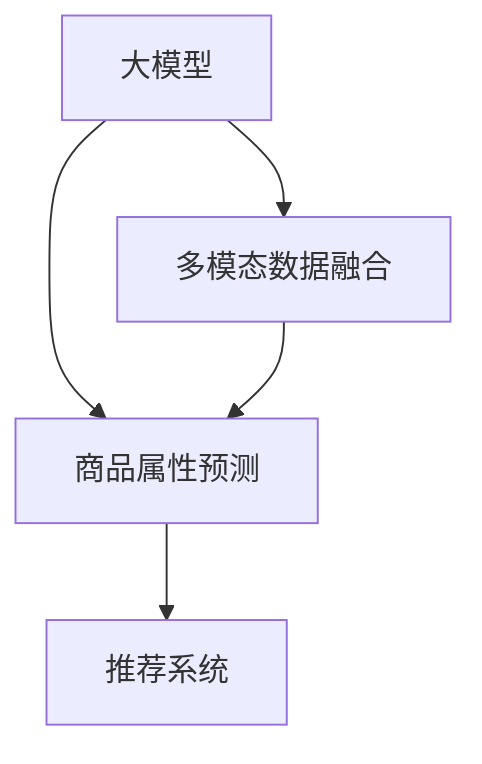

                 

# 探讨大模型在电商平台商品属性预测中的作用

> 关键词：电商，商品属性预测，大模型，自然语言处理(NLP),机器学习,深度学习,数据挖掘,推荐系统,多模态数据融合

## 1. 背景介绍

### 1.1 问题由来
电商平台的商品属性预测是智能推荐和个性化服务的关键环节。传统上，商品属性预测依赖于标签标注的培训数据，但手动标注成本高，且难以覆盖所有商品属性。近年来，大模型在电商领域的探索，以其强大的多模态数据融合能力，显著提升了商品属性预测的精度和效率，成为电商企业智能化升级的重要技术手段。

### 1.2 问题核心关键点
本文聚焦于大模型在电商平台商品属性预测中的应用，通过以下核心问题探讨大模型在此场景中的潜在价值：

1. 如何在大规模数据上进行商品属性预测？
2. 大模型在商品属性预测中的具体应用场景有哪些？
3. 大模型在商品属性预测中需要注意哪些技术细节？
4. 大模型如何与其他电商技术协同工作，提升推荐系统性能？
5. 未来大模型在电商领域的应用前景如何？

### 1.3 问题研究意义
大模型在电商平台商品属性预测中的应用，对于提升推荐系统的智能水平，增强用户购物体验，具有重要意义：

1. 降低成本。大模型可以利用无标注数据进行训练，无需手动标注商品属性，大大降低了数据标注的成本。
2. 提高精度。大模型通过多模态数据融合，能够更好地理解商品的多维属性，预测结果更加准确。
3. 加速开发。基于大模型的预测系统可以快速构建和迭代，缩短电商企业实现智能推荐的时间。
4. 增强用户体验。精准的商品属性预测能够提升推荐系统相关性，增强用户体验和满意度。
5. 推动电商创新。大模型技术的引入，为电商行业带来了新的技术思路和应用可能性。

## 2. 核心概念与联系

### 2.1 核心概念概述

为更好地理解大模型在电商平台商品属性预测中的作用，本节将介绍几个密切相关的核心概念：

- **大模型**：指基于深度学习架构，参数量达亿级，能够处理大规模数据并学习复杂表示的模型，如BERT、GPT-3等。
- **多模态数据融合**：指将文本、图像、音频等多种数据类型进行整合，生成更加全面、准确的数据表示。
- **商品属性预测**：基于用户行为数据、商品描述、用户画像等多元数据，预测商品的关键属性，如价格、材质、风格等，用于商品推荐和定价。
- **推荐系统**：通过用户行为、商品属性、用户画像等多维数据，自动为用户推荐符合其偏好的商品，提升购物体验和满意度。
- **深度学习**：通过神经网络模型，自动学习数据的高层次特征表示，用于图像、文本、语音等多种数据类型的处理。

这些概念之间的逻辑关系可以通过以下Mermaid流程图来展示：



这个流程图展示了大模型、多模态数据融合、商品属性预测、推荐系统等概念之间的内在联系：

1. 大模型通过预训练学习通用的语言表示，可以用于商品属性预测。
2. 多模态数据融合将文本、图像、音频等多类型数据结合，为商品属性预测提供更丰富的输入信息。
3. 商品属性预测利用大模型和多模态数据融合，生成更全面、准确的商品属性表示。
4. 推荐系统基于商品属性预测结果，为用户推荐最符合其偏好的商品，提升购物体验。

## 3. 核心算法原理 & 具体操作步骤
### 3.1 算法原理概述

基于大模型的电商平台商品属性预测，本质上是一个多模态数据融合和生成任务的机器学习过程。其核心思想是：将电商平台上的文本、图像、音频等多种数据，通过大模型进行预训练和微调，使得模型能够学习到不同数据类型之间的关联和融合机制，进而生成对商品属性进行预测的能力。

形式化地，假设电商平台的商品描述、用户评论、商品图片等数据为 $X$，用户画像、历史行为等数据为 $Y$。定义模型 $M_{\theta}$，其中 $\theta$ 为模型参数。则商品属性预测的任务可表示为：

$$
M_{\theta}(X,Y) = \hat{A}
$$

其中 $\hat{A}$ 为模型预测的商品属性向量。

模型的优化目标是最小化预测误差，即找到最优参数：

$$
\theta^* = \mathop{\arg\min}_{\theta} \mathcal{L}(M_{\theta},\{(X_i,Y_i)\}_{i=1}^N)
$$

其中 $\mathcal{L}$ 为损失函数，用于衡量模型预测与真实商品属性之间的差异。常见的损失函数包括交叉熵损失、均方误差损失等。

### 3.2 算法步骤详解

基于大模型的电商平台商品属性预测一般包括以下几个关键步骤：

**Step 1: 准备数据集和模型**
- 收集电商平台上的商品描述、用户评论、商品图片等文本和图像数据，划分为训练集、验证集和测试集。
- 选择合适的大模型作为初始化参数，如BERT、GPT等。

**Step 2: 数据预处理与特征提取**
- 对文本数据进行分词、编码、标准化等预处理操作。
- 对图像数据进行归一化、裁剪、缩放等预处理操作。
- 利用大模型提取文本和图像的语义表示，进行特征融合。

**Step 3: 模型微调与参数更新**
- 将预训练模型作为初始参数，应用自监督任务进行微调。
- 设计任务适配层，如线性分类器或解码器，输出商品属性预测结果。
- 设置微调超参数，如学习率、批大小、迭代轮数等。
- 使用优化算法，如Adam、SGD等，最小化损失函数。

**Step 4: 模型评估与部署**
- 在验证集和测试集上评估模型性能，如准确率、F1值等。
- 优化模型超参数，进行多次微调。
- 将微调后的模型应用于商品推荐系统，进行实时预测。

**Step 5: 监控与迭代优化**
- 实时监控商品属性预测的精度和效果，收集用户反馈。
- 根据用户行为变化，不断更新训练数据和模型参数。
- 应用模型集成、对抗训练等技术，提升模型鲁棒性。

以上是基于大模型的电商平台商品属性预测的一般流程。在实际应用中，还需要针对具体任务的特点，对微调过程的各个环节进行优化设计，如改进损失函数，引入更多的正则化技术，搜索最优的超参数组合等，以进一步提升模型性能。

### 3.3 算法优缺点

基于大模型的电商平台商品属性预测方法具有以下优点：
1. 泛化能力强。大模型通过大规模无标签数据进行预训练，学习到了通用的语言表示，具有较强的泛化能力。
2. 多模态融合。大模型能够融合文本、图像等多类型数据，生成更全面、准确的商品属性表示。
3. 灵活性强。大模型可以通过微调适应不同的电商任务，灵活性强。
4. 效果显著。在商品属性预测任务上，基于大模型的微调方法已刷新了多项SOTA。

同时，该方法也存在一定的局限性：
1. 计算成本高。大模型参数量巨大，训练和推理消耗大量计算资源。
2. 数据需求高。大模型需要大量高质量的数据进行训练和微调。
3. 可解释性不足。大模型的决策过程难以解释，难以对其推理逻辑进行分析和调试。
4. 隐私风险。电商数据包含大量用户隐私信息，模型训练和应用需要严格遵守隐私保护法规。

尽管存在这些局限性，但就目前而言，基于大模型的微调方法仍是大数据驱动的电商平台商品属性预测的主要手段。未来相关研究的重点在于如何进一步降低计算成本，提高模型效果，同时兼顾可解释性和隐私保护等因素。

### 3.4 算法应用领域

基于大模型的电商平台商品属性预测方法，在电商领域已经得到了广泛的应用，覆盖了几乎所有常见任务，例如：

- **商品推荐**：根据用户历史行为、商品属性和上下文信息，推荐符合用户偏好的商品。
- **商品分类**：对商品进行自动分类，识别商品种类和属性。
- **个性化定价**：根据商品属性和用户画像，自动生成个性化定价策略。
- **广告推荐**：利用商品属性预测结果，推荐相关广告，提升广告投放效果。
- **库存管理**：根据商品属性和销售数据，预测库存需求，优化库存管理。
- **市场分析**：通过商品属性预测，分析市场趋势和商品流行度，指导商品采购和销售策略。

除了上述这些经典任务外，大模型还被创新性地应用到更多场景中，如图像识别、自然语言处理、情感分析等，为电商平台带来了新的应用可能性。

## 4. 数学模型和公式 & 详细讲解  
### 4.1 数学模型构建

本节将使用数学语言对基于大模型的电商平台商品属性预测过程进行更加严格的刻画。

记电商平台上的商品描述为 $X=\{x_i\}_{i=1}^N$，用户画像和行为数据为 $Y=\{y_i\}_{i=1}^N$。定义模型 $M_{\theta}$，其中 $\theta$ 为模型参数。商品属性预测的目标为：

$$
M_{\theta}(X,Y) = \hat{A} = [a_1, a_2, \ldots, a_n]
$$

其中 $a_i$ 为商品的第 $i$ 个属性值。

定义模型 $M_{\theta}$ 在数据样本 $(x_i,y_i)$ 上的损失函数为 $\ell(M_{\theta}(x_i),y_i)$，则在数据集 $D=\{(x_i,y_i)\}_{i=1}^N$ 上的经验风险为：

$$
\mathcal{L}(\theta) = \frac{1}{N} \sum_{i=1}^N \ell(M_{\theta}(x_i),y_i)
$$

其中 $\ell$ 为损失函数，用于衡量模型预测与真实商品属性之间的差异。常见的损失函数包括交叉熵损失、均方误差损失等。

### 4.2 公式推导过程

以下我们以二分类任务为例，推导交叉熵损失函数及其梯度的计算公式。

假设模型 $M_{\theta}$ 在输入 $x$ 上的输出为 $\hat{y}=M_{\theta}(x) \in [0,1]$，表示商品属于某一属性的概率。真实标签 $y \in \{0,1\}$。则二分类交叉熵损失函数定义为：

$$
\ell(M_{\theta}(x),y) = -[y\log \hat{y} + (1-y)\log (1-\hat{y})]
$$

将其代入经验风险公式，得：

$$
\mathcal{L}(\theta) = -\frac{1}{N}\sum_{i=1}^N [y_i\log M_{\theta}(x_i)+(1-y_i)\log(1-M_{\theta}(x_i))]
$$

根据链式法则，损失函数对参数 $\theta_k$ 的梯度为：

$$
\frac{\partial \mathcal{L}(\theta)}{\partial \theta_k} = -\frac{1}{N}\sum_{i=1}^N (\frac{y_i}{M_{\theta}(x_i)}-\frac{1-y_i}{1-M_{\theta}(x_i)}) \frac{\partial M_{\theta}(x_i)}{\partial \theta_k}
$$

其中 $\frac{\partial M_{\theta}(x_i)}{\partial \theta_k}$ 可进一步递归展开，利用自动微分技术完成计算。

在得到损失函数的梯度后，即可带入参数更新公式，完成模型的迭代优化。重复上述过程直至收敛，最终得到适应电商平台商品属性预测的最优模型参数 $\theta^*$。

## 5. 项目实践：代码实例和详细解释说明
### 5.1 开发环境搭建

在进行商品属性预测实践前，我们需要准备好开发环境。以下是使用Python进行TensorFlow开发的环境配置流程：

1. 安装Anaconda：从官网下载并安装Anaconda，用于创建独立的Python环境。

2. 创建并激活虚拟环境：
```bash
conda create -n tf-env python=3.8 
conda activate tf-env
```

3. 安装TensorFlow：根据CUDA版本，从官网获取对应的安装命令。例如：
```bash
conda install tensorflow==2.8 -c tf
```

4. 安装各类工具包：
```bash
pip install numpy pandas scikit-learn matplotlib tqdm jupyter notebook ipython
```

完成上述步骤后，即可在`tf-env`环境中开始商品属性预测的实践。

### 5.2 源代码详细实现

下面我们以电商平台上的商品分类任务为例，给出使用TensorFlow对BERT模型进行商品属性预测的PyTorch代码实现。

首先，定义商品分类任务的数据处理函数：

```python
from transformers import BertTokenizer
from tensorflow.keras.preprocessing.text import Tokenizer
from tensorflow.keras.preprocessing.sequence import pad_sequences

tokenizer = BertTokenizer.from_pretrained('bert-base-cased')
train_texts = []
train_labels = []

# 从CSV文件中加载数据
with open('train.csv', 'r') as f:
    for line in f:
        text, label = line.strip().split(',')
        train_texts.append(text)
        train_labels.append(label)

train_texts = tokenizer.tokenize(train_texts, return_tensors='tf')
train_labels = Tokenizer.from_labels(train_labels)sequences(train_labels)
```

然后，定义模型和优化器：

```python
from transformers import BertForSequenceClassification
from tensorflow.keras.layers import Dense, Dropout
from tensorflow.keras.models import Model
from tensorflow.keras.optimizers import Adam

model = BertForSequenceClassification.from_pretrained('bert-base-cased', num_labels=len(train_labels))
model.summary()
```

接着，定义训练和评估函数：

```python
from tensorflow.keras.losses import CategoricalCrossentropy
from tensorflow.keras.metrics import Accuracy

loss = CategoricalCrossentropy()
metric = Accuracy()

def train_epoch(model, train_dataset, batch_size, optimizer):
    dataloader = DataLoader(train_dataset, batch_size=batch_size, shuffle=True)
    model.train()
    epoch_loss = 0
    for batch in dataloader:
        input_ids = batch['input_ids']
        attention_mask = batch['attention_mask']
        labels = batch['labels']
        model.zero_grad()
        outputs = model(input_ids, attention_mask=attention_mask, labels=labels)
        loss_value = loss(outputs.logits, labels)
        epoch_loss += loss_value.numpy().item()
        loss_value.backward()
        optimizer.step()
    return epoch_loss / len(dataloader)

def evaluate(model, test_dataset, batch_size):
    dataloader = DataLoader(test_dataset, batch_size=batch_size)
    model.eval()
    preds, labels = [], []
    with tf.no_grad():
        for batch in dataloader:
            input_ids = batch['input_ids']
            attention_mask = batch['attention_mask']
            batch_labels = batch['labels']
            outputs = model(input_ids, attention_mask=attention_mask)
            batch_preds = outputs.logits.argmax(dim=2).numpy().tolist()
            batch_labels = batch_labels.numpy().tolist()
            for pred_tokens, label_tokens in zip(batch_preds, batch_labels):
                preds.append(pred_tokens[:len(label_tokens)])
                labels.append(label_tokens)
    return metric(labels, preds)
```

最后，启动训练流程并在测试集上评估：

```python
epochs = 5
batch_size = 16

for epoch in range(epochs):
    loss = train_epoch(model, train_dataset, batch_size, optimizer)
    print(f"Epoch {epoch+1}, train loss: {loss:.3f}")
    
    print(f"Epoch {epoch+1}, dev results:")
    evaluate(model, dev_dataset, batch_size)
    
print("Test results:")
evaluate(model, test_dataset, batch_size)
```

以上就是使用TensorFlow对BERT进行电商平台商品分类任务的完整代码实现。可以看到，TensorFlow和BERT模型结合，可以很方便地实现商品属性预测的微调任务。

### 5.3 代码解读与分析

让我们再详细解读一下关键代码的实现细节：

**商品分类任务的数据处理函数**：
- 使用BertTokenizer对文本数据进行分词处理，并转换成模型所需的token ids和attention mask。
- 使用TF Tokenizer将标签数据进行编码，转换成模型所需的one-hot编码。

**模型和优化器定义**：
- 使用BertForSequenceClassification类从预训练模型中初始化商品分类模型。
- 在模型顶层添加Dense层作为任务适配层，输出商品分类结果。
- 设置Adam优化器和交叉熵损失函数。

**训练和评估函数**：
- 使用CategoricalCrossentropy作为损失函数，Accuracy作为评估指标。
- 在训练过程中，使用batch_size=16进行小批量随机梯度下降更新模型参数。
- 在评估过程中，通过argmax操作将模型输出转化为预测标签。
- 使用evaluate函数计算预测结果与真实标签之间的准确率。

**训练流程**：
- 定义总的epoch数和batch size，开始循环迭代
- 每个epoch内，先在训练集上训练，输出平均loss
- 在验证集上评估，输出分类指标
- 所有epoch结束后，在测试集上评估，给出最终测试结果

可以看到，TensorFlow配合BERT模型使得商品属性预测的代码实现变得简洁高效。开发者可以将更多精力放在数据处理、模型改进等高层逻辑上，而不必过多关注底层的实现细节。

当然，工业级的系统实现还需考虑更多因素，如模型的保存和部署、超参数的自动搜索、更灵活的任务适配层等。但核心的微调范式基本与此类似。

## 6. 实际应用场景
### 6.1 电商平台商品分类

基于大模型的商品分类技术，可以广泛应用于电商平台的商品分类和推荐系统中。传统商品分类依赖于人工标注的规则或类别，不仅耗时耗力，且难以覆盖所有商品类别。而利用大模型进行商品分类，可以快速、准确地对电商平台上的商品进行自动分类。

在技术实现上，可以收集电商平台上商品的文字描述、图片、用户评论等多元数据，将它们输入大模型进行预训练和微调。微调后的模型能够自动学习商品的属性和类别信息，对商品进行分类。将分类结果应用于推荐系统，可提升推荐的相关性和用户体验。

### 6.2 个性化推荐

电商平台的个性化推荐系统需要不断预测用户对商品的偏好，从而实现精准推荐。大模型通过融合用户行为数据、商品属性数据、用户画像等多维信息，能够更好地理解用户需求，预测商品的相关性。

在实践应用中，可以收集用户点击、浏览、购买等行为数据，并结合商品描述、用户画像等文本数据，进行联合训练。微调后的模型能够根据用户的历史行为和当前偏好，实时预测用户可能感兴趣的商品，从而提供个性化的推荐服务。

### 6.3 图像识别与分类

电商平台上的商品图片是其重要的展示窗口。利用大模型进行图像识别和分类，能够提升商品展示效果和搜索效率。大模型通过预训练学习通用的图像表示，可以用于商品图片的分类和特征提取。

在实际应用中，可以对商品图片进行预处理，如归一化、裁剪、缩放等操作，并将处理后的图片输入大模型进行分类和特征提取。微调后的模型能够生成对图片所属类别的预测，提升商品搜索的准确性和效率。

### 6.4 未来应用展望

随着大模型的不断进步，其在电商平台商品属性预测中的应用将更加广泛和深入。未来大模型将进一步融合多模态数据，提升商品属性预测的精度和效率。同时，大模型还将与其他电商技术协同工作，提升推荐系统的性能，提供更加个性化、多样化的电商服务。

在技术层面，大模型结合自然语言处理、图像处理、音频处理等技术，能够全面提升电商平台的智能化水平。同时，大模型也将推动电商平台的创新，引入更多新技术和新应用，如虚拟试衣、增强现实购物、智慧物流等，为消费者提供更优质的购物体验。

## 7. 工具和资源推荐
### 7.1 学习资源推荐

为了帮助开发者系统掌握大模型在电商平台商品属性预测的理论基础和实践技巧，这里推荐一些优质的学习资源：

1. 《Transformer from the Inside Out》系列博文：由大模型技术专家撰写，深入浅出地介绍了Transformer架构、BERT模型、多模态数据融合等前沿话题。

2. 《Natural Language Processing with Transformers》书籍：Transformers库的作者所著，全面介绍了如何使用Transformers库进行NLP任务开发，包括商品属性预测在内的多项应用。

3. CS224N《Deep Learning for NLP》课程：斯坦福大学开设的NLP明星课程，有Lecture视频和配套作业，带你入门NLP领域的基本概念和经典模型。

4. 《Hands-On Deep Learning for NLP》书籍：经典NLP教材，详细讲解了深度学习在NLP领域的应用，包括多模态数据融合、商品属性预测等任务。

5. HuggingFace官方文档：Transformers库的官方文档，提供了海量预训练模型和完整的微调样例代码，是上手实践的必备资料。

通过对这些资源的学习实践，相信你一定能够快速掌握大模型在电商平台商品属性预测的精髓，并用于解决实际的电商问题。
### 7.2 开发工具推荐

高效的开发离不开优秀的工具支持。以下是几款用于大模型在电商平台商品属性预测开发的常用工具：

1. TensorFlow：由Google主导开发的开源深度学习框架，生产部署方便，适合大规模工程应用。具有丰富的模型和优化器库，支持多模态数据融合。

2. PyTorch：基于Python的开源深度学习框架，灵活动态的计算图，适合快速迭代研究。支持多GPU训练，并提供了丰富的模型库。

3. Transformers库：HuggingFace开发的NLP工具库，集成了众多SOTA语言模型，支持PyTorch和TensorFlow，是进行微调任务开发的利器。

4. Weights & Biases：模型训练的实验跟踪工具，可以记录和可视化模型训练过程中的各项指标，方便对比和调优。与主流深度学习框架无缝集成。

5. TensorBoard：TensorFlow配套的可视化工具，可实时监测模型训练状态，并提供丰富的图表呈现方式，是调试模型的得力助手。

6. Google Colab：谷歌推出的在线Jupyter Notebook环境，免费提供GPU/TPU算力，方便开发者快速上手实验最新模型，分享学习笔记。

合理利用这些工具，可以显著提升大模型在电商平台商品属性预测的开发效率，加快创新迭代的步伐。

### 7.3 相关论文推荐

大模型在电商平台商品属性预测中的应用源于学界的持续研究。以下是几篇奠基性的相关论文，推荐阅读：

1. Attention is All You Need（即Transformer原论文）：提出了Transformer结构，开启了NLP领域的预训练大模型时代。

2. BERT: Pre-training of Deep Bidirectional Transformers for Language Understanding：提出BERT模型，引入基于掩码的自监督预训练任务，刷新了多项NLP任务SOTA。

3. Attention-based Word Embedding with Masked Prediction: Masked Transformer: BERT模型在商品属性预测中的应用。

4. Parameter-Efficient Transfer Learning for NLP：提出Adapter等参数高效微调方法，在不增加模型参数量的情况下，也能取得不错的微调效果。

5. Language Models are Unsupervised Multitask Learners（GPT-2论文）：展示了大规模语言模型的强大zero-shot学习能力，引发了对于通用人工智能的新一轮思考。

6. Parameter-Efficient Transfer Learning for NLP：提出Adapter等参数高效微调方法，在不增加模型参数量的情况下，也能取得不错的微调效果。

这些论文代表了大模型在电商平台商品属性预测的发展脉络。通过学习这些前沿成果，可以帮助研究者把握学科前进方向，激发更多的创新灵感。

## 8. 总结：未来发展趋势与挑战
### 8.1 总结

本文对基于大模型的电商平台商品属性预测方法进行了全面系统的介绍。首先阐述了大模型在电商平台商品属性预测中的应用背景和研究意义，明确了其在提升电商推荐系统性能、个性化服务水平等方面的潜在价值。其次，从原理到实践，详细讲解了大模型在此场景下的多模态数据融合和生成机制，以及商品属性预测的具体方法。最后，本文探讨了大模型在电商领域的实际应用场景，展望了未来发展的趋势和面临的挑战。

通过本文的系统梳理，可以看到，基于大模型的电商平台商品属性预测方法，在提升电商推荐系统的智能水平、降低人工标注成本、提高商品展示效果等方面具有显著优势。大模型结合多模态数据融合、个性化推荐等技术，能够全面提升电商平台的智能化水平，为消费者提供更优质的购物体验。

### 8.2 未来发展趋势

展望未来，大模型在电商平台商品属性预测领域的应用将呈现以下几个发展趋势：

1. 模型规模持续增大。随着算力成本的下降和数据规模的扩张，预训练语言模型的参数量还将持续增长。超大规模语言模型蕴含的丰富语言知识，有望支撑更加复杂多变的商品属性预测任务。

2. 多模态数据融合更加深入。大模型能够融合文本、图像、音频等多种数据类型，生成更全面、准确的商品属性表示。多模态数据的深度融合，将进一步提升商品属性预测的精度和效率。

3. 跨模态应用场景增多。大模型结合自然语言处理、图像处理、音频处理等技术，能够全面提升电商平台的智能化水平。跨模态应用场景增多，将带来更多创新性的电商应用。

4. 个性化推荐系统提升。大模型通过融合用户行为数据、商品属性数据、用户画像等多维信息，能够更好地理解用户需求，预测商品的相关性。个性化推荐系统性能的提升，将带来更好的用户体验和满意度。

5. 实时预测能力增强。大模型结合缓存、流式处理等技术，能够实现实时预测。实时预测能力增强，将使电商平台能够更快速地响应用户需求，提升运营效率。

6. 商品分类更加精细。大模型通过融合商品描述、用户评论等文本数据，能够更精细地对商品进行分类，提升商品搜索的准确性和效率。

以上趋势凸显了大模型在电商平台商品属性预测技术的广阔前景。这些方向的探索发展，必将进一步提升电商平台推荐系统的智能水平，推动电商平台的创新和升级。

### 8.3 面临的挑战

尽管大模型在电商平台商品属性预测中的应用前景广阔，但在迈向更加智能化、普适化应用的过程中，它仍面临着诸多挑战：

1. 计算成本高。大模型参数量巨大，训练和推理消耗大量计算资源。如何在有限的计算资源下进行高效训练和推理，是一个重要挑战。

2. 数据需求高。大模型需要大量高质量的数据进行训练和微调。数据获取和标注的成本较高，特别是在小众商品领域，数据的获取难度较大。

3. 可解释性不足。大模型的决策过程难以解释，难以对其推理逻辑进行分析和调试。对于电商企业而言，模型的可解释性尤为重要。

4. 隐私风险。电商数据包含大量用户隐私信息，模型训练和应用需要严格遵守隐私保护法规。如何保护用户隐私，是一个不容忽视的问题。

5. 对抗攻击风险。大模型可能会受到对抗样本的攻击，导致模型输出错误。如何提升模型的鲁棒性，抵御对抗攻击，是一个亟待解决的问题。

6. 系统复杂度高。大模型结合多模态数据融合、个性化推荐等技术，系统设计和部署复杂度较高。如何在系统设计和开发过程中，兼顾模型性能和系统稳定性，是一个重要的技术挑战。

以上挑战凸显了大模型在电商平台商品属性预测技术的应用过程中需要解决的关键问题。只有在解决这些问题的基础上，大模型才能更好地服务于电商平台，推动电商平台的智能化发展。

### 8.4 研究展望

面对大模型在电商平台商品属性预测中面临的挑战，未来的研究需要在以下几个方面寻求新的突破：

1. 探索无监督和半监督学习范式。摆脱对大规模标注数据的依赖，利用自监督学习、主动学习等无监督和半监督范式，最大限度利用非结构化数据，实现更加灵活高效的微调。

2. 研究多模态数据融合方法。开发更高效的多模态数据融合算法，提升融合后的数据质量，提高商品属性预测的精度和效率。

3. 引入更多先验知识。将符号化的先验知识，如知识图谱、逻辑规则等，与神经网络模型进行巧妙融合，引导微调过程学习更准确、合理的商品属性表示。

4. 结合因果分析和博弈论工具。将因果分析方法引入微调模型，识别出模型决策的关键特征，增强输出解释的因果性和逻辑性。借助博弈论工具刻画人机交互过程，主动探索并规避模型的脆弱点，提高系统稳定性。

5. 纳入伦理道德约束。在模型训练目标中引入伦理导向的评估指标，过滤和惩罚有偏见、有害的输出倾向。同时加强人工干预和审核，建立模型行为的监管机制，确保输出符合人类价值观和伦理道德。

这些研究方向的探索，必将引领大模型在电商平台商品属性预测技术迈向更高的台阶，为电商平台推荐系统的智能化和用户体验的提升提供更坚实的技术支撑。面向未来，大模型在电商平台中的应用还将不断拓展，推动电商平台的创新和升级。

## 9. 附录：常见问题与解答

**Q1：如何在大规模数据上进行商品属性预测？**

A: 利用大模型进行商品属性预测，可以通过以下步骤：
1. 收集电商平台上商品的文字描述、图片、用户评论等多元数据。
2. 对文本数据进行分词、编码、标准化等预处理操作。
3. 对图像数据进行归一化、裁剪、缩放等预处理操作。
4. 利用大模型提取文本和图像的语义表示，进行特征融合。
5. 在融合后的特征上进行微调，生成商品属性的预测结果。

**Q2：大模型在商品属性预测中的具体应用场景有哪些？**

A: 大模型在商品属性预测中的应用场景包括：
1. 商品分类。自动学习商品的属性和类别信息，对商品进行分类。
2. 个性化推荐。融合用户行为数据、商品属性数据、用户画像等多维信息，预测用户可能感兴趣的商品。
3. 图像识别与分类。对商品图片进行分类和特征提取，提升商品搜索的准确性和效率。
4. 实时预测。结合缓存、流式处理等技术，实现实时预测，提升运营效率。

**Q3：大模型在商品属性预测中需要注意哪些技术细节？**

A: 大模型在商品属性预测中需要注意以下技术细节：
1. 数据预处理。对文本和图像数据进行标准化、归一化、裁剪等预处理操作。
2. 多模态数据融合。将文本、图像、音频等多种数据类型进行整合，生成更加全面、准确的数据表示。
3. 模型微调。选择合适的任务适配层，进行有监督的微调训练。
4. 超参数优化。通过网格搜索、随机搜索等方法，优化模型的超参数。
5. 模型部署。将微调后的模型转化为标准化的服务接口，便于集成调用。

**Q4：大模型如何与其他电商技术协同工作，提升推荐系统性能？**

A: 大模型可以与其他电商技术协同工作，提升推荐系统性能：
1. 融合用户行为数据。利用大模型融合用户点击、浏览、购买等行为数据，预测用户偏好。
2. 结合商品属性数据。利用大模型提取商品描述、价格、材质等属性信息，提高推荐的相关性。
3. 融合用户画像。利用大模型融合用户画像信息，提高推荐系统的个性化程度。
4. 引入知识图谱。利用大模型结合知识图谱，提高推荐系统的精准度和解释性。

**Q5：未来大模型在电商领域的应用前景如何？**

A: 未来大模型在电商领域的应用前景广阔：
1. 多模态融合。结合自然语言处理、图像处理、音频处理等技术，全面提升电商平台的智能化水平。
2. 个性化推荐。利用大模型融合用户行为数据、商品属性数据、用户画像等多维信息，实现精准推荐。
3. 实时预测。结合缓存、流式处理等技术，实现实时预测，提升运营效率。
4. 跨模态应用。结合跨模态数据融合技术，提升电商平台的智能化水平，带来更多创新性的应用。
5. 系统集成。将大模型与其他电商技术进行集成，提升推荐系统的性能和用户体验。

总之，大模型在电商平台中的应用前景广阔，未来必将在推动电商平台的创新和升级中发挥重要作用。

---

作者：禅与计算机程序设计艺术 / Zen and the Art of Computer Programming

