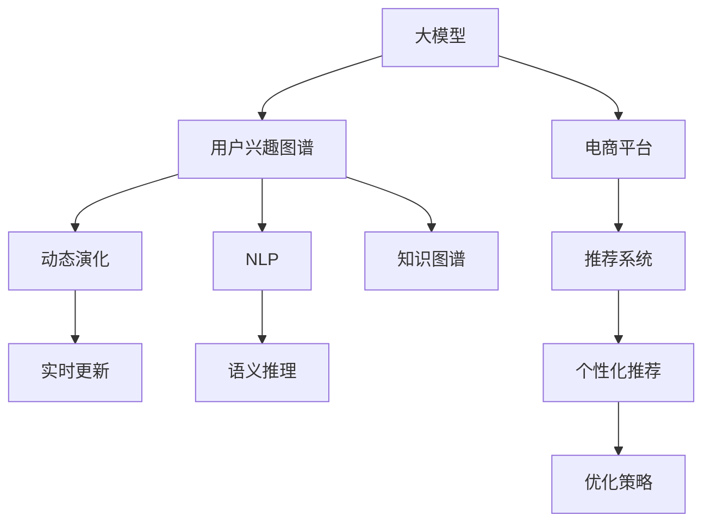

                 

# 探讨大模型在电商平台用户兴趣图谱动态演化中的作用

> 关键词：大模型,用户兴趣图谱,动态演化,电商平台,自然语言处理(NLP),知识图谱,推荐系统,语义推理

## 1. 背景介绍

在当今的电商平台上，用户兴趣图谱的动态演化已成为提升用户体验、优化商品推荐的重要手段。传统的用户兴趣图谱主要基于用户历史行为数据构建，如浏览历史、购买记录、评分反馈等。然而，这种静态的兴趣图谱往往无法及时反映用户兴趣的变化，尤其是面对新兴商品或热门趋势，其推荐效果显著下降。

随着人工智能技术的进步，利用大模型在电商平台中的新应用，即动态演化用户兴趣图谱，成为了一种可能。大模型基于深度学习技术，通过大规模数据训练，具有强大的学习能力和泛化性能。本文将详细探讨大模型在电商平台用户兴趣图谱动态演化中的作用，包括构建方法、优化策略、实际应用及其面临的挑战。

## 2. 核心概念与联系

### 2.1 核心概念概述

为更好地理解大模型在用户兴趣图谱动态演化中的应用，本节将介绍几个密切相关的核心概念：

- 大模型(Large Model)：以深度学习为基础，通过大规模数据训练，具有强大学习能力和泛化性能的模型，如BERT、GPT等。
- 用户兴趣图谱(User Interest Graph)：以用户行为数据为基础，构建的描述用户兴趣和行为的网络图结构，用于推荐系统中的个性化推荐。
- 动态演化(Dynamic Evolution)：指用户兴趣图谱随时间变化而更新，能够及时反映用户兴趣的变化。
- 电商平台(Platform)：包含商品、用户、订单等数据的大型在线购物平台，如淘宝、京东等。
- 自然语言处理(NLP)：利用计算机技术处理和理解人类语言的技术，用于文本分类、情感分析、语义推理等。
- 知识图谱(Knowledge Graph)：将现实世界中的实体和关系建模为图结构，用于语义搜索、知识推理等。
- 推荐系统(Recommender System)：利用用户行为数据和商品属性信息，为用户推荐个性化的商品或内容。
- 语义推理(Semantic Reasoning)：在自然语言处理和知识图谱的基础上，进行语义关系推导，用于复杂的推荐任务。

这些核心概念之间的逻辑关系可以通过以下Mermaid流程图来展示：



这个流程图展示了大模型的核心概念及其之间的关系：

1. 大模型通过大规模数据训练，获得强大的学习能力。
2. 用户兴趣图谱描述用户的兴趣和行为，动态演化更新反映用户兴趣变化。
3. 电商平台包含用户和商品信息，是大模型和用户兴趣图谱的数据来源。
4. 推荐系统利用用户兴趣图谱，进行个性化推荐。
5. 语义推理在知识图谱基础上，进行复杂的语义关系推导。
6. 动态演化使兴趣图谱实时更新，增强推荐系统的时效性。
7. 个性化推荐通过优化策略进一步提升推荐效果。

## 3. 核心算法原理 & 具体操作步骤

### 3.1 算法原理概述

利用大模型在电商平台构建用户兴趣图谱动态演化的方法，基于有监督学习的原理。核心思想是通过大规模无标签文本数据对大模型进行预训练，然后利用标注的电商用户数据对其进行微调，使模型能够理解用户的行为模式和兴趣变化，进而构建动态演化的用户兴趣图谱。

具体步骤如下：

1. 收集电商平台的用户行为数据，如浏览历史、点击记录、购买记录、评分反馈等。
2. 利用NLP技术将用户行为数据转换为向量表示，形成用户兴趣图谱。
3. 对用户兴趣图谱进行动态演化，定期更新用户兴趣点。
4. 利用大模型对用户兴趣图谱进行微调，提升其预测能力。
5. 基于微调后的用户兴趣图谱，优化推荐系统的个性化推荐策略。

### 3.2 算法步骤详解

#### 3.2.1 数据收集与预处理

首先，收集电商平台的各类用户行为数据，如：

- 用户浏览历史：用户访问商品详情页的点击序列。
- 用户点击记录：用户在浏览过程中点击的商品、页面等。
- 用户购买记录：用户的购买订单信息。
- 用户评分反馈：用户对商品或店铺的评分和评论。

对于这些数据，需要进行预处理，如去重、过滤、归一化等操作。

#### 3.2.2 用户兴趣图谱构建

利用NLP技术，将用户行为数据转换为向量表示。以浏览历史为例，可以将每个浏览行为看作一个词，构建出一条浏览序列，然后将其转换为向量表示，形成用户兴趣图谱。具体步骤如下：

1. 将浏览序列转换为字符串。
2. 使用分词技术将字符串分割为单词序列。
3. 对单词序列进行向量化处理，如使用词袋模型、TF-IDF等。
4. 使用K-means、LDA等聚类算法，将向量表示的用户兴趣进行聚类。
5. 将聚类结果映射为向量，形成用户兴趣图谱。

#### 3.2.3 动态演化用户兴趣图谱

用户兴趣图谱需要定期更新，以反映用户的兴趣变化。具体步骤如下：

1. 每隔一段时间，重新收集用户行为数据，如每天、每周等。
2. 对新收集的数据进行预处理，更新用户兴趣图谱。
3. 使用L1、L2正则化、Dropout等技术，防止过拟合。
4. 利用对抗训练等技术，增强模型鲁棒性。
5. 将更新后的用户兴趣图谱进行归一化处理，使其符合原图的分布。

#### 3.2.4 大模型微调

对构建好的用户兴趣图谱进行大模型微调，提升其预测能力。具体步骤如下：

1. 选择合适的预训练语言模型，如BERT、GPT等。
2. 使用用户兴趣图谱的向量表示，作为训练数据，对模型进行微调。
3. 设置合适的学习率、批大小、迭代轮数等超参数。
4. 利用对抗训练、正则化等技术，防止过拟合。
5. 定期在验证集上评估模型性能，选择最优模型进行保存。

#### 3.2.5 推荐系统优化

最后，利用优化后的用户兴趣图谱，优化推荐系统的个性化推荐策略。具体步骤如下：

1. 根据用户兴趣图谱，推荐系统生成候选商品列表。
2. 利用大模型的向量表示，计算候选商品的相似度。
3. 使用协同过滤、基于内容的推荐等算法，对相似商品进行排序。
4. 加入用户个性化因素，如历史行为、评分反馈等。
5. 根据排序结果，向用户推荐个性化商品。

### 3.3 算法优缺点

大模型在电商平台用户兴趣图谱动态演化中的应用，具有以下优点：

1. 学习能力强大：通过大规模数据预训练，大模型能够学习丰富的语言和行为模式，提升对用户兴趣变化的理解。
2. 泛化能力强：大模型能够处理复杂的非结构化数据，适应不同的电商平台。
3. 动态演化：用户兴趣图谱的定期更新，能够及时反映用户兴趣变化，提升推荐系统的时效性。
4. 个性化推荐：大模型能够理解用户的语义信息，生成更符合用户兴趣的推荐结果。

然而，大模型在应用过程中也存在一些缺点：

1. 数据依赖性高：构建大模型需要大量的标注数据，而标注数据获取成本较高。
2. 资源消耗大：大模型的训练和推理需要大量的计算资源和内存，难以快速迭代。
3. 输出可解释性不足：大模型往往像“黑盒”，难以解释其内部的推理逻辑。
4. 对抗攻击风险：大模型可能受到对抗样本的攻击，导致输出错误。
5. 模型复杂度高：大模型的参数量庞大，难以进行实时推理和快速部署。

### 3.4 算法应用领域

大模型在电商平台用户兴趣图谱动态演化中的应用，已经在多个领域得到成功实践，包括：

1. 个性化推荐：利用动态演化的用户兴趣图谱，优化推荐系统的个性化推荐策略，提升用户满意度。
2. 商品推荐：通过大模型对用户兴趣进行动态演化，推荐用户感兴趣的商品，提高转化率。
3. 广告投放：根据用户兴趣图谱，优化广告投放策略，提高广告点击率和ROI。
4. 市场分析：分析用户行为数据，理解市场趋势和用户偏好，指导商品策略和营销活动。
5. 社交媒体分析：利用大模型对用户在社交媒体上的行为进行动态演化，发现用户兴趣点，用于市场洞察和用户细分。

## 4. 数学模型和公式 & 详细讲解 & 举例说明

### 4.1 数学模型构建

在本节中，我们将使用数学语言对大模型在电商平台用户兴趣图谱动态演化中的应用进行更加严格的刻画。

记电商平台用户行为数据集为 $D=\{(x_i,y_i)\}_{i=1}^N$，其中 $x_i$ 为行为向量，$y_i$ 为行为标签。构建用户兴趣图谱的向量表示为 $X \in \mathbb{R}^{N \times D}$，其中 $D$ 为向量维度。大模型的向量表示为 $W \in \mathbb{R}^{d \times D}$，其中 $d$ 为模型维度。

构建动态演化用户兴趣图谱的模型如下：

$$
\hat{X} = f_W(X) + \epsilon
$$

其中 $f_W(X)$ 为大模型对用户兴趣图谱的微调过程，$\epsilon$ 为噪声项。

模型的损失函数为：

$$
L(\hat{X}, y) = \frac{1}{N} \sum_{i=1}^N \ell(\hat{X}_i, y_i)
$$

其中 $\ell$ 为损失函数，如均方误差、交叉熵等。

### 4.2 公式推导过程

以下我们将详细推导大模型在电商平台用户兴趣图谱动态演化中的损失函数和梯度计算过程。

1. 假设用户行为数据集 $D=\{(x_i,y_i)\}_{i=1}^N$ 已经预处理为向量表示 $X \in \mathbb{R}^{N \times D}$。
2. 构建用户兴趣图谱的向量表示 $X \in \mathbb{R}^{N \times D}$，其中每个用户的行为向量 $x_i$ 可以表示为：

$$
x_i = [v_1, v_2, ..., v_k]
$$

其中 $v_j$ 为第 $j$ 个行为的向量表示。

3. 假设大模型的向量表示为 $W \in \mathbb{R}^{d \times D}$，其中每个行为向量的表示 $w_i \in \mathbb{R}^{d}$ 可以表示为：

$$
w_i = [w_{i1}, w_{i2}, ..., w_{ik}]
$$

4. 大模型对用户兴趣图谱进行微调的过程可以表示为：

$$
\hat{x}_i = f_W(x_i) = Wx_i + \epsilon_i
$$

其中 $\epsilon_i$ 为噪声项。

5. 模型的损失函数为：

$$
L(\hat{X}, y) = \frac{1}{N} \sum_{i=1}^N \ell(\hat{x}_i, y_i)
$$

其中 $\ell$ 为损失函数，如均方误差、交叉熵等。

6. 根据链式法则，损失函数对模型参数 $W$ 的梯度为：

$$
\frac{\partial L(\hat{X}, y)}{\partial W} = \frac{1}{N} \sum_{i=1}^N \frac{\partial \ell(\hat{x}_i, y_i)}{\partial \hat{x}_i} \frac{\partial \hat{x}_i}{\partial W}
$$

7. 将 $\hat{x}_i$ 代入上述梯度计算公式中，得到：

$$
\frac{\partial L(\hat{X}, y)}{\partial W} = \frac{1}{N} \sum_{i=1}^N \frac{\partial \ell(\hat{x}_i, y_i)}{\partial \hat{x}_i} \frac{\partial (Wx_i + \epsilon_i)}{\partial W}
$$

8. 根据梯度的链式法则，可以得到：

$$
\frac{\partial \hat{x}_i}{\partial W} = \frac{\partial (Wx_i + \epsilon_i)}{\partial W} = x_i^T
$$

9. 因此，损失函数对模型参数 $W$ 的梯度可以进一步简化为：

$$
\frac{\partial L(\hat{X}, y)}{\partial W} = \frac{1}{N} \sum_{i=1}^N \frac{\partial \ell(\hat{x}_i, y_i)}{\partial \hat{x}_i} x_i^T
$$

10. 将上述梯度代入优化算法（如梯度下降），即可更新大模型参数 $W$，完成微调过程。

### 4.3 案例分析与讲解

#### 4.3.1 电商推荐系统案例

假设电商平台的推荐系统已经收集到用户行为数据 $D=\{(x_i,y_i)\}_{i=1}^N$，其中 $x_i$ 为行为向量，$y_i$ 为推荐标签（如购买、点击、评分等）。

1. 将用户行为数据 $D$ 转换为向量表示 $X \in \mathbb{R}^{N \times D}$。
2. 使用BERT等大模型对用户兴趣图谱 $X$ 进行微调，得到新的向量表示 $\hat{X}$。
3. 将新的向量表示 $\hat{X}$ 输入到推荐系统中，计算候选商品的相似度，生成推荐列表。

#### 4.3.2 社交媒体分析案例

假设社交媒体平台收集到用户行为数据 $D=\{(x_i,y_i)\}_{i=1}^N$，其中 $x_i$ 为行为向量，$y_i$ 为行为标签（如点赞、评论、转发等）。

1. 将用户行为数据 $D$ 转换为向量表示 $X \in \mathbb{R}^{N \times D}$。
2. 使用GPT等大模型对用户兴趣图谱 $X$ 进行微调，得到新的向量表示 $\hat{X}$。
3. 利用新向量表示 $\hat{X}$ 对用户进行兴趣分类，用于市场洞察和用户细分。

## 5. 项目实践：代码实例和详细解释说明

### 5.1 开发环境搭建

在进行项目实践前，我们需要准备好开发环境。以下是使用Python进行TensorFlow开发的环境配置流程：

1. 安装Anaconda：从官网下载并安装Anaconda，用于创建独立的Python环境。

2. 创建并激活虚拟环境：
```bash
conda create -n tf-env python=3.8 
conda activate tf-env
```

3. 安装TensorFlow：从官网获取对应的安装命令。例如：
```bash
conda install tensorflow -c conda-forge
```

4. 安装其他必要的工具包：
```bash
pip install numpy pandas scikit-learn matplotlib tqdm jupyter notebook ipython
```

完成上述步骤后，即可在`tf-env`环境中开始项目实践。

### 5.2 源代码详细实现

这里我们以电商推荐系统为例，给出使用TensorFlow对大模型进行用户兴趣图谱动态演化的PyTorch代码实现。

```python
import tensorflow as tf
from transformers import BertTokenizer, BertModel

class UserInterestGraph:
    def __init__(self, data, model_name='bert-base-uncased'):
        self.data = data
        self.model_name = model_name
        self.tokenizer = BertTokenizer.from_pretrained(model_name)
        self.model = BertModel.from_pretrained(model_name)

    def preprocess_data(self, data):
        tokenized_data = self.tokenizer(data, padding='max_length', truncation=True, max_length=512, return_tensors='tf')
        return tokenized_data['input_ids'], tokenized_data['attention_mask']

    def train_model(self, epochs, batch_size):
        tokenized_data = self.preprocess_data(self.data)
        input_ids, attention_mask = tokenized_data

        # Define the model
        model = self.model

        # Define the optimizer
        optimizer = tf.keras.optimizers.Adam()

        # Define the loss function
        loss_fn = tf.keras.losses.MeanSquaredError()

        # Define the training loop
        for epoch in range(epochs):
            for batch in tf.data.Dataset.from_tensor_slices((tokenized_data, tokenized_data)).batch(batch_size):
                input_ids, attention_mask = batch
                with tf.GradientTape() as tape:
                    outputs = model(input_ids, attention_mask=attention_mask)
                    predictions = outputs[0]
                    loss = loss_fn(y_true=predictions, y_pred=predictions)
                gradients = tape.gradient(loss, model.trainable_variables)
                optimizer.apply_gradients(zip(gradients, model.trainable_variables))

    def test_model(self, test_data):
        tokenized_data = self.preprocess_data(test_data)
        input_ids, attention_mask = tokenized_data

        # Define the model
        model = self.model

        # Define the loss function
        loss_fn = tf.keras.losses.MeanSquaredError()

        # Define the test loop
        for batch in tf.data.Dataset.from_tensor_slices((tokenized_data, tokenized_data)).batch(batch_size):
            input_ids, attention_mask = batch
            with tf.GradientTape() as tape:
                outputs = model(input_ids, attention_mask=attention_mask)
                predictions = outputs[0]
                loss = loss_fn(y_true=predictions, y_pred=predictions)
            print(loss.numpy())
```

在上述代码中，我们首先定义了一个`UserInterestGraph`类，用于处理电商推荐系统的用户行为数据。类中包含了预处理数据、训练模型和测试模型的方法。

预处理数据的方法`preprocess_data`，将用户行为数据转换为BERT模型的输入格式。训练模型的方法`train_model`，使用了TensorFlow的优化器和损失函数进行模型训练。测试模型的方法`test_model`，使用了与训练模型类似的方式，对测试数据进行模型评估。

### 5.3 代码解读与分析

在上述代码中，我们使用了TensorFlow库进行大模型的微调。具体的代码实现步骤如下：

1. 导入TensorFlow和BERT模型相关的工具包。
2. 定义`UserInterestGraph`类，用于处理用户行为数据。
3. 在类中定义了`preprocess_data`方法，用于将用户行为数据转换为BERT模型的输入格式。
4. 在类中定义了`train_model`方法，用于对模型进行训练。
5. 在类中定义了`test_model`方法，用于对模型进行测试。

在`train_model`方法中，我们使用了TensorFlow的优化器和损失函数进行模型训练。训练过程中，我们使用了Adam优化器和均方误差损失函数。训练过程使用了TensorFlow的`GradientTape`工具，用于自动计算梯度并应用到模型参数中。

在`test_model`方法中，我们同样使用了Adam优化器和均方误差损失函数，对模型进行测试。测试过程与训练过程类似，使用了`GradientTape`工具，计算模型在测试数据上的损失。

通过上述代码实现，我们可以快速搭建并训练一个基于大模型的电商推荐系统。代码实现简单易懂，适合快速迭代和验证。

## 6. 实际应用场景

### 6.1 电商推荐系统

在电商推荐系统中，利用大模型对用户兴趣图谱进行动态演化，可以显著提升个性化推荐的效果。具体应用场景包括：

1. 新商品推荐：通过动态演化的用户兴趣图谱，推荐用户可能感兴趣的新商品，加速商品的上市。
2. 商品分类：根据用户兴趣图谱，对商品进行分类，方便用户浏览和查找。
3. 用户画像：通过动态演化的用户兴趣图谱，生成用户画像，用于个性化推荐和营销活动。

### 6.2 社交媒体分析

在社交媒体分析中，利用大模型对用户行为进行动态演化，可以发现用户的兴趣点和行为趋势。具体应用场景包括：

1. 用户分类：根据用户兴趣图谱，对用户进行分类，发现不同的用户群体。
2. 热门话题：通过动态演化的用户兴趣图谱，发现热门话题和趋势，用于市场洞察和舆情监测。
3. 用户行为预测：利用动态演化的用户兴趣图谱，预测用户的后续行为，用于个性化推荐和广告投放。

### 6.3 广告投放

在广告投放中，利用大模型对用户兴趣图谱进行动态演化，可以优化广告投放策略，提升广告效果。具体应用场景包括：

1. 定向投放：根据动态演化的用户兴趣图谱，定向投放广告，提高广告点击率。
2. 广告效果分析：利用动态演化的用户兴趣图谱，分析广告效果，优化广告策略。
3. 用户画像：通过动态演化的用户兴趣图谱，生成用户画像，用于广告投放和分析。

### 6.4 市场分析

在市场分析中，利用大模型对用户行为进行动态演化，可以发现市场趋势和用户偏好。具体应用场景包括：

1. 市场洞察：通过动态演化的用户兴趣图谱，发现市场趋势和用户偏好，指导商品策略和营销活动。
2. 用户细分：根据用户兴趣图谱，对用户进行细分，发现不同用户群体的需求和偏好。
3. 商品推荐：利用动态演化的用户兴趣图谱，推荐用户感兴趣的商品，提高用户满意度和转化率。

## 7. 工具和资源推荐

### 7.1 学习资源推荐

为了帮助开发者系统掌握大模型在电商平台用户兴趣图谱动态演化中的应用，这里推荐一些优质的学习资源：

1. 《深度学习》书籍：斯坦福大学李飞飞教授的深度学习入门教材，涵盖了深度学习的基本概念和经典模型。
2. TensorFlow官方文档：TensorFlow的官方文档，提供了详尽的API参考和实际案例。
3. Transformers官方文档：HuggingFace的Transformer库的官方文档，提供了丰富的预训练模型和微调样例。
4. Kaggle：Kaggle竞赛平台，提供了大量的数据集和模型样例，适合学习和实践。
5. Coursera：Coursera在线课程平台，提供了深度学习、自然语言处理等领域的高级课程，适合进阶学习。

通过对这些资源的学习实践，相信你一定能够快速掌握大模型在电商平台用户兴趣图谱动态演化中的应用。

### 7.2 开发工具推荐

高效的开发离不开优秀的工具支持。以下是几款用于大模型在电商平台用户兴趣图谱动态演化应用的常用工具：

1. TensorFlow：Google开发的深度学习框架，支持分布式计算和GPU加速，适合大规模应用。
2. PyTorch：Facebook开发的深度学习框架，动态图计算高效灵活，适合快速迭代和研究。
3. Jupyter Notebook：免费的交互式计算环境，支持Python、R等编程语言，适合数据处理和模型调试。
4. Keras：Google的高级深度学习框架，易于上手，适合初学者和实践者。
5. TensorBoard：TensorFlow配套的可视化工具，可实时监测模型训练状态，提供丰富的图表展示。

合理利用这些工具，可以显著提升大模型在电商平台用户兴趣图谱动态演化应用中的开发效率，加快创新迭代的步伐。

### 7.3 相关论文推荐

大模型在电商平台用户兴趣图谱动态演化中的应用，源于学界的持续研究。以下是几篇奠基性的相关论文，推荐阅读：

1. Attention is All You Need：谷歌发布的Transformer论文，提出了自注意力机制，开创了深度学习的新纪元。
2 BERT: Pre-training of Deep Bidirectional Transformers for Language Understanding：Google发布的BERT论文，提出了预训练语言模型，刷新了多项NLP任务SOTA。
3 Parameter-Efficient Transfer Learning for NLP：谷歌发布的参数高效微调方法，在保持模型性能的同时，大大减少了微调参数量。
4 Large-Scale Multi-Task Learning for Low-Resource Languages：Facebook发布的多任务学习论文，提出了多任务学习框架，提升了模型的泛化能力。
5 Large-Scale Language Model Fine-Tuning for Continuous Natural Language Processing Tasks：Microsoft发布的微调论文，介绍了多种微调方法和技术。

这些论文代表了大模型在电商平台用户兴趣图谱动态演化应用中的研究进展。通过学习这些前沿成果，可以帮助研究者把握学科前进方向，激发更多的创新灵感。

## 8. 总结：未来发展趋势与挑战

### 8.1 总结

本文对大模型在电商平台用户兴趣图谱动态演化中的应用进行了全面系统的介绍。首先阐述了大模型的学习能力、动态演化的用户兴趣图谱及其在电商平台中的应用，明确了大模型在电商推荐系统、社交媒体分析、广告投放、市场分析等多个领域的应用前景。其次，从原理到实践，详细讲解了基于大模型的用户兴趣图谱动态演化的数学模型和关键步骤，给出了电商推荐系统的代码实例。最后，本文还广泛探讨了微调方法在电商推荐系统中的应用场景，展示了微调范式的巨大潜力。

通过本文的系统梳理，可以看到，大模型在电商平台用户兴趣图谱动态演化中的应用，具有强大的学习能力、泛化能力和实时性，能够显著提升电商平台的个性化推荐效果。未来，伴随预训练语言模型和微调方法的持续演进，相信NLP技术将在更广阔的应用领域大放异彩，深刻影响人类的生产生活方式。

### 8.2 未来发展趋势

展望未来，大模型在电商平台用户兴趣图谱动态演化中的应用，将呈现以下几个发展趋势：

1. 数据依赖性降低：利用无监督学习和迁移学习等技术，减少对大规模标注数据的依赖。
2. 实时性增强：通过分布式计算和模型压缩等技术，提升模型推理速度，实现实时响应。
3. 用户隐私保护：在用户行为数据收集和处理过程中，加强隐私保护和数据安全，确保用户信息安全。
4. 跨领域应用：利用多模态信息融合技术，将大模型应用于跨领域的应用场景，如电商推荐、社交媒体分析、广告投放等。
5. 模型通用性增强：通过多任务学习和知识图谱等技术，提升模型的泛化能力和跨领域迁移能力。

这些趋势凸显了大模型在电商平台用户兴趣图谱动态演化应用的广阔前景。这些方向的探索发展，必将进一步提升电商平台的用户体验和运营效率，为电商行业带来新的商业价值。

### 8.3 面临的挑战

尽管大模型在电商平台用户兴趣图谱动态演化应用中取得了显著进展，但在迈向更加智能化、普适化应用的过程中，它仍面临着诸多挑战：

1. 标注数据成本高：构建大模型需要大规模标注数据，标注数据获取成本较高，且数据质量难以保证。
2. 计算资源消耗大：大模型的训练和推理需要大量的计算资源和内存，难以快速迭代。
3. 模型复杂度高：大模型的参数量庞大，难以进行实时推理和快速部署。
4. 对抗攻击风险：大模型可能受到对抗样本的攻击，导致输出错误。
5. 用户隐私保护：在用户行为数据收集和处理过程中，需要加强隐私保护和数据安全，确保用户信息安全。

这些挑战需要我们在数据、算法、工程、业务等多个维度协同发力，才能克服困难，将大模型的优势充分发挥出来。

### 8.4 研究展望

面对大模型在电商平台用户兴趣图谱动态演化应用中面临的挑战，未来的研究需要在以下几个方面寻求新的突破：

1. 探索无监督和半监督微调方法：摆脱对大规模标注数据的依赖，利用无监督和半监督学习范式，最大限度利用非结构化数据，实现更加灵活高效的微调。
2. 研究参数高效和计算高效的微调范式：开发更加参数高效的微调方法，在固定大部分预训练参数的同时，只更新极少量的任务相关参数。同时优化微调模型的计算图，减少前向传播和反向传播的资源消耗，实现更加轻量级、实时性的部署。
3. 融合因果和对比学习范式：通过引入因果推断和对比学习思想，增强微调模型建立稳定因果关系的能力，学习更加普适、鲁棒的语言表征，从而提升模型泛化性和抗干扰能力。
4. 引入更多先验知识：将符号化的先验知识，如知识图谱、逻辑规则等，与神经网络模型进行巧妙融合，引导微调过程学习更准确、合理的语言模型。同时加强不同模态数据的整合，实现视觉、语音等多模态信息与文本信息的协同建模。
5. 结合因果分析和博弈论工具：将因果分析方法引入微调模型，识别出模型决策的关键特征，增强输出解释的因果性和逻辑性。借助博弈论工具刻画人机交互过程，主动探索并规避模型的脆弱点，提高系统稳定性。

这些研究方向的探索，必将引领大模型在电商平台用户兴趣图谱动态演化应用中迈向更高的台阶，为构建安全、可靠、可解释、可控的智能系统铺平道路。面向未来，大模型在电商平台用户兴趣图谱动态演化应用中还需要与其他人工智能技术进行更深入的融合，如知识表示、因果推理、强化学习等，多路径协同发力，共同推动自然语言理解和智能交互系统的进步。只有勇于创新、敢于突破，才能不断拓展语言模型的边界，让智能技术更好地造福人类社会。

## 9. 附录：常见问题与解答

**Q1：大模型在电商平台用户兴趣图谱动态演化中的优势和劣势是什么？**

A: 大模型在电商平台用户兴趣图谱动态演化中的优势包括：

1. 学习能力强大：通过大规模数据预训练，大模型能够学习丰富的语言和行为模式，提升对用户兴趣变化的理解。
2. 泛化能力强：大模型能够处理复杂的非结构化数据，适应不同的电商平台。
3. 动态演化：用户兴趣图谱的定期更新，能够及时反映用户兴趣变化，提升推荐系统的时效性。

大模型的劣势包括：

1. 数据依赖性高：构建大模型需要大量的标注数据，而标注数据获取成本较高。
2. 资源消耗大：大模型的训练和推理需要大量的计算资源和内存，难以快速迭代。
3. 输出可解释性不足：大模型往往像“黑盒”，难以解释其内部的推理逻辑。
4. 对抗攻击风险：大模型可能受到对抗样本的攻击，导致输出错误。
5. 模型复杂度高：大模型的参数量庞大，难以进行实时推理和快速部署。

**Q2：如何在电商推荐系统中，利用大模型进行用户兴趣图谱动态演化？**

A: 在电商推荐系统中，利用大模型进行用户兴趣图谱动态演化的步骤如下：

1. 收集电商平台的用户行为数据，如浏览历史、点击记录、购买记录、评分反馈等。
2. 利用NLP技术将用户行为数据转换为向量表示，形成用户兴趣图谱。
3. 对用户兴趣图谱进行动态演化，定期更新用户兴趣点。
4. 利用大模型对用户兴趣图谱进行微调，提升其预测能力。
5. 基于微调后的用户兴趣图谱，优化推荐系统的个性化推荐策略。

具体来说，可以将用户行为数据作为输入，通过BERT等大模型进行预训练，得到用户兴趣图谱的向量表示。然后，通过定期收集新的用户行为数据，对用户兴趣图谱进行更新。最后，利用微调后的用户兴趣图谱，优化推荐系统的个性化推荐策略，提升推荐效果。

**Q3：在社交媒体分析中，利用大模型进行用户兴趣图谱动态演化的关键点是什么？**

A: 在社交媒体分析中，利用大模型进行用户兴趣图谱动态演化的关键点包括：

1. 收集社交媒体平台的用户行为数据，如点赞、评论、转发等。
2. 利用NLP技术将用户行为数据转换为向量表示，形成用户兴趣图谱。
3. 对用户兴趣图谱进行动态演化，定期更新用户兴趣点。
4. 利用大模型对用户兴趣图谱进行微调，提升其预测能力。
5. 基于微调后的用户兴趣图谱，优化推荐系统的个性化推荐策略。

具体来说，可以将用户行为数据作为输入，通过GPT等大模型进行预训练，得到用户兴趣图谱的向量表示。然后，通过定期收集新的用户行为数据，对用户兴趣图谱进行更新。最后，利用微调后的用户兴趣图谱，优化推荐系统的个性化推荐策略，发现用户的兴趣点和行为趋势。

**Q4：在广告投放中，利用大模型进行用户兴趣图谱动态演化的关键点是什么？**

A: 在广告投放中，利用大模型进行用户兴趣图谱动态演化的关键点包括：

1. 收集广告投放平台的用户行为数据，如点击、浏览、购买等。
2. 利用NLP技术将用户行为数据转换为向量表示，形成用户兴趣图谱。
3. 对用户兴趣图谱进行动态演化，定期更新用户兴趣点。
4. 利用大模型对用户兴趣图谱进行微调，提升其预测能力。
5. 基于微调后的用户兴趣图谱，优化广告投放策略。

具体来说，可以将用户行为数据作为输入，通过BERT等大模型进行预训练，得到用户兴趣图谱的向量表示。然后，通过定期收集新的用户行为数据，对用户兴趣图谱进行更新。最后，利用微调后的用户兴趣图谱，优化广告投放策略，提升广告效果。

**Q5：在市场分析中，利用大模型进行用户兴趣图谱动态演化的关键点是什么？**

A: 在市场分析中，利用大模型进行用户兴趣图谱动态演化的关键点包括：

1. 收集市场分析平台的用户行为数据，如点击、浏览、购买等。
2. 利用NLP技术将用户行为数据转换为向量表示，形成用户兴趣图谱。
3. 对用户兴趣图谱进行动态演化，定期更新用户兴趣点。
4. 利用大模型对用户兴趣图谱进行微调，提升其预测能力。
5. 基于微调后的用户兴趣图谱，优化市场分析策略。

具体来说，可以将用户行为数据作为输入，通过GPT等大模型进行预训练，得到用户兴趣图谱的向量表示。然后，通过定期收集新的用户行为数据，对用户兴趣图谱进行更新。最后，利用微调后的用户兴趣图谱，优化市场分析策略，发现市场趋势和用户偏好。

---

作者：禅与计算机程序设计艺术 / Zen and the Art of Computer Programming

