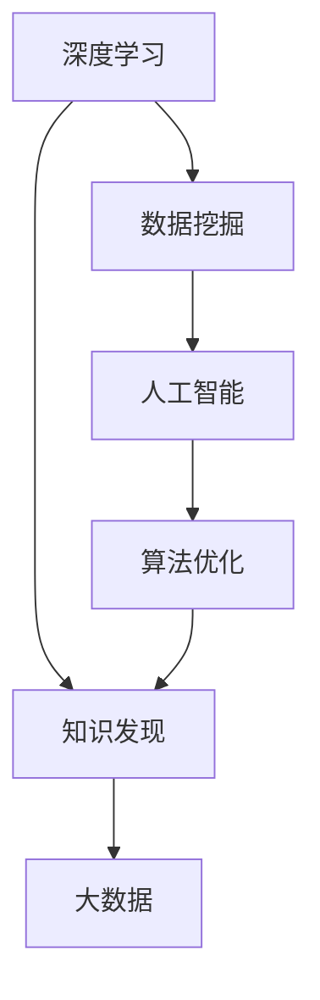

                 

# 推动知识发现与创新：人类计算的智力贡献

> 关键词：知识发现, 人类计算, 智能算法, 数据挖掘, 大数据, 人工智能, 机器学习, 深度学习, 深度学习算法, 人类智能与人工智能

## 1. 背景介绍

### 1.1 问题由来
随着信息化时代的飞速发展，人类面临的数据量呈指数级增长，从过去的手工数据处理方式逐步过渡到自动化、智能化手段。在这一过程中，“人类计算”逐渐成为了知识发现与创新的关键力量。

人类计算不仅包括传统的数学计算、物理实验等，还包括计算机科学的算法设计和编程实现。特别是近年来，随着人工智能（AI）和大数据技术的不断突破，人类计算在知识发现与创新方面展现出了前所未有的潜力。

### 1.2 问题核心关键点
本文聚焦于基于人工智能的算法设计和优化，尤其是深度学习算法在知识发现与创新中的作用。将从算法原理、操作步骤、应用领域等方面系统地介绍这一领域的关键技术，并通过实际案例分析展示其应用效果。

## 2. 核心概念与联系

### 2.1 核心概念概述

为更好地理解人类计算在知识发现与创新中的作用，本节将介绍几个密切相关的核心概念：

- **深度学习**：一种基于人工神经网络的机器学习技术，通过多层非线性变换，实现对数据复杂模式的抽取与表达。
- **数据挖掘**：从大量数据中提取有价值信息和知识的过程，常用于商业智能、推荐系统、社交网络分析等领域。
- **人工智能**：使计算机系统模拟人类智能行为的技术，包括感知、学习、推理、决策等方面。
- **算法优化**：通过特定的策略和技巧，提升算法在特定任务上的表现，包括速度、精度、泛化能力等方面。
- **知识发现**：从原始数据中挖掘出新的知识，提高对现实世界的理解和预测能力。
- **大数据**：规模大、速度快、种类多的数据集合，通常包含结构化、半结构化和非结构化数据。

这些核心概念之间存在着紧密的联系：

- 深度学习是人工智能的核心技术之一，通过算法优化可以实现更好的知识发现与创新效果。
- 数据挖掘是知识发现的重要手段，能够从大数据中提取出有用的信息和知识。
- 人工智能依赖于算法和数据，通过优化算法和提升数据处理能力，实现更高效的知识发现与创新。

这些概念共同构成了人类计算的核心框架，使得计算机系统能够模仿和超越人类智能行为，实现对复杂问题的自动分析和解决。

### 2.2 核心概念原理和架构的 Mermaid 流程图



这个流程图展示了大语言模型微调的核心概念及其之间的关系：

- 深度学习是数据挖掘和知识发现的基础。
- 人工智能依赖于深度学习和数据挖掘，是知识发现的重要工具。
- 算法优化贯穿于深度学习和人工智能的全过程，是提升知识发现和创新效果的关键。
- 大数据是深度学习、数据挖掘和人工智能的基础数据来源。

## 3. 核心算法原理 & 具体操作步骤

### 3.1 算法原理概述

基于深度学习的知识发现与创新，本质上是通过对大规模数据进行多层次的特征提取和模式学习，从而挖掘出有价值的信息和知识。深度学习算法通过构建多层的神经网络模型，自动学习数据的高级抽象特征，实现了对复杂数据的自动分析和理解。

形式化地，假设数据集为 $D=\{(x_i,y_i)\}_{i=1}^N$，其中 $x_i \in \mathbb{R}^d$ 为输入，$y_i \in \mathbb{R}^k$ 为输出。则深度学习模型的目标是通过优化参数 $\theta$，最小化预测输出与真实标签之间的差距，即：

$$
\theta^* = \mathop{\arg\min}_{\theta} \frac{1}{N}\sum_{i=1}^N \|M_{\theta}(x_i)-y_i\|^2
$$

其中 $M_{\theta}$ 为深度学习模型，$\| \cdot \|$ 为欧几里得范数，用于衡量模型预测输出与真实标签之间的距离。

### 3.2 算法步骤详解

深度学习算法在知识发现与创新中的应用，一般包括以下几个关键步骤：

**Step 1: 数据预处理与特征工程**
- 收集和准备大规模数据集，进行清洗、去重、归一化等预处理工作。
- 设计合适的特征工程方法，将原始数据转换为更适合模型处理的特征形式。

**Step 2: 构建深度学习模型**
- 选择合适的深度学习架构，如卷积神经网络（CNN）、循环神经网络（RNN）、变分自编码器（VAE）等。
- 定义模型的损失函数、优化器、超参数等关键组件。

**Step 3: 训练深度学习模型**
- 使用优化算法（如Adam、SGD等）更新模型参数，最小化预测输出与真实标签之间的差距。
- 通过交叉验证等技术，评估模型在不同数据子集上的表现，避免过拟合。

**Step 4: 模型验证与优化**
- 使用测试集验证模型的泛化能力，调整超参数和模型结构，进一步提升模型性能。
- 引入正则化技术，如L2正则、Dropout等，避免过拟合。

**Step 5: 知识发现与创新**
- 在训练好的深度学习模型上，对新数据进行预测和推理，发现新的知识模式。
- 结合领域知识，对发现的知识进行人工干预和解释，形成新的见解和创新。

### 3.3 算法优缺点

基于深度学习的知识发现与创新方法，具有以下优点：

1. **高效自动化**：深度学习算法能够自动处理大量数据，无需人工干预，显著提升知识发现与创新的效率。
2. **灵活性**：深度学习模型具有高度的适应性，能够处理多种类型的数据，适用于不同领域和任务。
3. **精度高**：深度学习算法通过多层非线性变换，提取数据的高级特征，实现高精度的预测和推理。
4. **可扩展性**：深度学习模型可以通过增加层数和神经元数量，适应更复杂的问题，实现模型的可扩展性。

同时，该方法也存在一些局限性：

1. **数据依赖性强**：深度学习算法需要大量高质量的数据进行训练，数据不足时效果难以保证。
2. **可解释性不足**：深度学习模型往往被视为“黑盒”系统，难以解释其内部工作机制和决策逻辑。
3. **计算资源消耗大**：深度学习模型通常具有大量的参数，训练和推理需要高性能计算资源。
4. **泛化能力差**：深度学习模型在未见过的数据上表现不佳，容易发生过拟合。

尽管存在这些局限性，但就目前而言，基于深度学习的知识发现与创新方法仍是大数据时代的主流技术。未来相关研究的重点在于如何进一步降低深度学习的计算资源需求，提高模型的可解释性和泛化能力，同时兼顾模型的灵活性和高效性。

### 3.4 算法应用领域

基于深度学习的知识发现与创新方法，已经在众多领域得到广泛应用，例如：

- **医学影像分析**：通过深度学习算法对医学影像进行自动分析和诊断，发现新的疾病模式和治疗方法。
- **金融风险评估**：利用深度学习模型分析金融市场数据，预测股票价格波动，进行风险评估和管理。
- **自然语言处理**：通过深度学习模型进行文本分类、情感分析、机器翻译等，提升智能客服、舆情监测等应用效果。
- **智能推荐系统**：结合用户行为数据，利用深度学习算法进行个性化推荐，提升用户体验和满意度。
- **工业自动化**：通过深度学习算法对工业数据进行分析和预测，优化生产流程，提高生产效率和产品质量。
- **自动驾驶**：利用深度学习模型对传感器数据进行分析和推理，实现自动驾驶和智能交通管理。

除了上述这些经典应用外，深度学习算法还在环境监测、安全监控、智能家居等多个领域展示了其强大的应用潜力。随着深度学习技术的不断演进，未来在更多领域的应用前景将更加广阔。

## 4. 数学模型和公式 & 详细讲解 & 举例说明

### 4.1 数学模型构建

本节将使用数学语言对基于深度学习的知识发现与创新过程进行更加严格的刻画。

假设数据集 $D=\{(x_i,y_i)\}_{i=1}^N, x_i \in \mathbb{R}^d, y_i \in \mathbb{R}^k$。

定义深度学习模型 $M_{\theta}:\mathbb{R}^d \rightarrow \mathbb{R}^k$，其中 $\theta$ 为模型参数。假设模型为多层感知机（MLP），其结构为 $[x_1,\dots,x_d] \rightarrow [h_1,\dots,h_m] \rightarrow [y_1,\dots,y_k]$。则模型的损失函数为：

$$
\mathcal{L}(\theta) = \frac{1}{N}\sum_{i=1}^N \|M_{\theta}(x_i)-y_i\|^2
$$

其中 $\| \cdot \|$ 为欧几里得范数，用于衡量模型预测输出与真实标签之间的距离。

### 4.2 公式推导过程

以下我们以二分类任务为例，推导逻辑回归模型的损失函数及其梯度的计算公式。

假设模型 $M_{\theta}$ 在输入 $x$ 上的输出为 $\hat{y}=M_{\theta}(x)$，表示样本属于正类的概率。真实标签 $y \in \{0,1\}$。则二分类逻辑回归损失函数定义为：

$$
\ell(M_{\theta}(x),y) = -[y\log \hat{y} + (1-y)\log (1-\hat{y})]
$$

将其代入经验风险公式，得：

$$
\mathcal{L}(\theta) = -\frac{1}{N}\sum_{i=1}^N [y_i\log M_{\theta}(x_i)+(1-y_i)\log(1-M_{\theta}(x_i))]
$$

根据链式法则，损失函数对参数 $\theta_k$ 的梯度为：

$$
\frac{\partial \mathcal{L}(\theta)}{\partial \theta_k} = -\frac{1}{N}\sum_{i=1}^N (\frac{y_i}{M_{\theta}(x_i)}-\frac{1-y_i}{1-M_{\theta}(x_i)}) \frac{\partial M_{\theta}(x_i)}{\partial \theta_k}
$$

其中 $\frac{\partial M_{\theta}(x_i)}{\partial \theta_k}$ 可进一步递归展开，利用自动微分技术完成计算。

在得到损失函数的梯度后，即可带入参数更新公式，完成模型的迭代优化。重复上述过程直至收敛，最终得到适应下游任务的最优模型参数 $\theta^*$。

### 4.3 案例分析与讲解

**案例1: 图像分类**

以图像分类任务为例，展示基于卷积神经网络（CNN）的深度学习模型如何在真实图像数据上进行知识发现与创新。

- **数据准备**：收集和准备大规模图像数据集，如ImageNet、CIFAR-10等。进行数据清洗、去重、归一化等预处理工作。
- **模型构建**：设计包含多个卷积层、池化层、全连接层的CNN模型。
- **模型训练**：使用交叉熵损失函数和Adam优化器，对模型进行训练。
- **模型验证**：使用验证集评估模型性能，调整超参数和模型结构。
- **知识发现**：在测试集上评估模型性能，发现新的图像特征和分类模式。

**案例2: 自然语言处理**

以自然语言处理（NLP）任务为例，展示基于循环神经网络（RNN）的深度学习模型如何在文本数据上进行知识发现与创新。

- **数据准备**：收集和准备大规模文本数据集，如Wikipedia、新闻语料库等。进行数据清洗、分词、构建词汇表等预处理工作。
- **模型构建**：设计包含多个LSTM层的RNN模型，进行文本分类或语言生成任务。
- **模型训练**：使用交叉熵损失函数和Adam优化器，对模型进行训练。
- **模型验证**：使用验证集评估模型性能，调整超参数和模型结构。
- **知识发现**：在测试集上评估模型性能，发现新的语言模式和生成规则。

## 5. 项目实践：代码实例和详细解释说明

### 5.1 开发环境搭建

在进行深度学习项目实践前，我们需要准备好开发环境。以下是使用Python进行TensorFlow开发的环境配置流程：

1. 安装Anaconda：从官网下载并安装Anaconda，用于创建独立的Python环境。

2. 创建并激活虚拟环境：
```bash
conda create -n tf-env python=3.8 
conda activate tf-env
```

3. 安装TensorFlow：根据CUDA版本，从官网获取对应的安装命令。例如：
```bash
conda install tensorflow tensorflow-gpu=cuda11.1 -c pytorch -c conda-forge
```

4. 安装各类工具包：
```bash
pip install numpy pandas scikit-learn matplotlib tqdm jupyter notebook ipython
```

完成上述步骤后，即可在`tf-env`环境中开始深度学习实践。

### 5.2 源代码详细实现

这里我们以图像分类任务为例，给出使用TensorFlow对卷积神经网络（CNN）进行训练的Python代码实现。

```python
import tensorflow as tf
from tensorflow.keras import datasets, layers, models

# 加载数据集
(train_images, train_labels), (test_images, test_labels) = datasets.cifar10.load_data()

# 数据预处理
train_images = train_images / 255.0
test_images = test_images / 255.0

# 构建模型
model = models.Sequential([
    layers.Conv2D(32, (3, 3), activation='relu', input_shape=(32, 32, 3)),
    layers.MaxPooling2D((2, 2)),
    layers.Conv2D(64, (3, 3), activation='relu'),
    layers.MaxPooling2D((2, 2)),
    layers.Conv2D(64, (3, 3), activation='relu'),
    layers.Flatten(),
    layers.Dense(64, activation='relu'),
    layers.Dense(10)
])

# 定义损失函数和优化器
model.compile(optimizer='adam',
              loss=tf.keras.losses.SparseCategoricalCrossentropy(from_logits=True),
              metrics=['accuracy'])

# 训练模型
history = model.fit(train_images, train_labels, epochs=10, 
                    validation_data=(test_images, test_labels))

# 评估模型
test_loss, test_acc = model.evaluate(test_images,  test_labels, verbose=2)
print('\nTest accuracy:', test_acc)
```

以上就是使用TensorFlow对CNN进行图像分类任务训练的完整代码实现。可以看到，得益于TensorFlow的强大封装，我们可以用相对简洁的代码完成CNN模型的加载和训练。

### 5.3 代码解读与分析

让我们再详细解读一下关键代码的实现细节：

**模型构建**：
- 使用`tf.keras.Sequential`模块定义了一个包含多个卷积层、池化层和全连接层的CNN模型。
- 卷积层使用`layers.Conv2D`定义，设置卷积核大小和数量，激活函数使用ReLU。
- 池化层使用`layers.MaxPooling2D`定义，设置池化窗口大小。
- 全连接层使用`layers.Dense`定义，设置神经元数量和激活函数。

**模型训练**：
- 使用`model.compile`方法定义模型优化器和损失函数，交叉熵损失适用于分类任务。
- 使用`model.fit`方法训练模型，设置训练轮数和验证集。

**模型评估**：
- 使用`model.evaluate`方法评估模型性能，输出测试集上的损失和准确率。

可以看到，TensorFlow提供了丰富的API和模块，使得深度学习模型的构建和训练变得非常简单。开发者可以将更多精力放在数据处理、模型改进等高层逻辑上，而不必过多关注底层的实现细节。

当然，工业级的系统实现还需考虑更多因素，如模型的保存和部署、超参数的自动搜索、更灵活的任务适配层等。但核心的深度学习模型构建和训练流程基本与此类似。

## 6. 实际应用场景

### 6.1 智能医疗

基于深度学习的知识发现与创新方法，在智能医疗领域具有广泛的应用前景。深度学习模型能够从医学影像、病历数据中提取有价值的信息，辅助医生诊断和治疗。

例如，利用深度学习模型对医学影像进行自动分析和诊断，可以显著提升医生的诊断效率和准确性。同时，利用深度学习模型进行疾病预测和个性化治疗，能够提供更精准的医疗方案。

### 6.2 金融风险管理

深度学习算法在金融风险管理中也有着重要的应用。通过分析金融市场数据，利用深度学习模型进行风险评估和预测，能够帮助金融机构制定更科学的投资策略，降低风险损失。

例如，利用深度学习模型对股票价格进行预测，可以识别市场的短期波动和长期趋势，提供投资建议和风险预警。

### 6.3 自动驾驶

自动驾驶技术是深度学习算法的典型应用之一。通过深度学习模型对传感器数据进行分析和推理，能够实现车辆的自动导航和避障，提高行车安全。

例如，利用深度学习模型对摄像头拍摄的图像进行分析和识别，可以实现车道线检测、行人检测等功能，辅助车辆进行自动驾驶。

### 6.4 未来应用展望

随着深度学习技术的不断演进，未来在更多领域的应用前景将更加广阔。例如：

- **环境监测**：利用深度学习模型对环境数据进行分析和预测，实现智能环境监测和预警。
- **安全监控**：通过深度学习模型对视频数据进行分析和识别，实现智能安防监控。
- **智能家居**：结合物联网设备和深度学习模型，实现智能家居控制和管理。
- **智能客服**：利用深度学习模型进行自然语言处理和情感分析，实现智能客服系统，提升客户服务体验。

此外，随着深度学习算法的不断优化和应用场景的拓展，未来在更多领域的应用前景将更加广阔，深度学习技术必将在各个行业实现规模化落地，带来巨大的经济效益和社会价值。

## 7. 工具和资源推荐

### 7.1 学习资源推荐

为了帮助开发者系统掌握深度学习技术，这里推荐一些优质的学习资源：

1. Deep Learning Specialization by Andrew Ng（斯坦福大学深度学习课程）：课程内容覆盖深度学习的基本概念和经典模型，适合初学者和进阶者。
2. CS231n: Convolutional Neural Networks for Visual Recognition（斯坦福大学视觉识别课程）：课程内容涵盖卷积神经网络的原理和应用，适合图像处理领域的开发者。
3. Natural Language Processing with Python by Steven Bird, Ewan Klein, and Edward Loper：介绍NLP技术的基本原理和应用，适合自然语言处理领域的开发者。
4. Deep Learning with PyTorch by Eli Stevens, Luca Antiga, and Carl Doersch：介绍如何使用PyTorch进行深度学习实践，适合动手实践的开发者。
5. TensorFlow官方文档：提供TensorFlow的详细文档和示例代码，适合使用TensorFlow进行深度学习实践的开发者。

通过对这些资源的学习实践，相信你一定能够快速掌握深度学习技术的精髓，并用于解决实际的NLP问题。

### 7.2 开发工具推荐

高效的开发离不开优秀的工具支持。以下是几款用于深度学习项目开发的常用工具：

1. PyTorch：基于Python的开源深度学习框架，灵活动态的计算图，适合快速迭代研究。
2. TensorFlow：由Google主导开发的开源深度学习框架，生产部署方便，适合大规模工程应用。
3. Keras：基于TensorFlow的高层API，提供了简单易用的接口，适合快速原型开发。
4. Jupyter Notebook：交互式的开发环境，支持代码块和数据分析可视化，适合研究型开发者。
5. Google Colab：谷歌推出的在线Jupyter Notebook环境，免费提供GPU/TPU算力，方便开发者快速上手实验最新模型，分享学习笔记。

合理利用这些工具，可以显著提升深度学习项目的开发效率，加快创新迭代的步伐。

### 7.3 相关论文推荐

深度学习算法的发展源于学界的持续研究。以下是几篇奠基性的相关论文，推荐阅读：

1. AlexNet: ImageNet Classification with Deep Convolutional Neural Networks（ImageNet分类挑战赛的获胜模型）：引入深度卷积神经网络，开创了深度学习在图像识别领域的先河。
2. RNN: Learning Phrase Representations using RNN Encoder-Decoder for Statistical Machine Translation（使用RNN进行机器翻译的研究）：提出RNN模型，用于序列数据的生成和处理。
3. Generative Adversarial Nets（GANs）：引入生成对抗网络，实现了高质量的图像生成和数据增强。
4. Convolutional Neural Networks for Sentence Classification（使用CNN进行文本分类的研究）：提出CNN模型，用于文本分类和情感分析。
5. Attention is All You Need（Transformer的原始论文）：提出Transformer结构，开启了NLP领域的预训练大模型时代。
6. Large-Scale Language Model Training with Multi-Tensor Cores（使用多张GPU训练大规模语言模型的研究）：提出多GPU训练方法，提升了深度学习模型的训练效率。

这些论文代表了大深度学习算法的发展脉络。通过学习这些前沿成果，可以帮助研究者把握学科前进方向，激发更多的创新灵感。

## 8. 总结：未来发展趋势与挑战

### 8.1 总结

本文对基于深度学习的知识发现与创新方法进行了全面系统的介绍。首先阐述了深度学习在知识发现与创新中的重要作用，明确了深度学习在实际应用中的广泛应用和巨大潜力。其次，从算法原理到操作步骤，详细讲解了深度学习模型在知识发现与创新中的实现流程，并通过实际案例分析展示了其应用效果。同时，本文还广泛探讨了深度学习在智能医疗、金融风险管理、自动驾驶等领域的潜在应用，展示了深度学习算法的广阔前景。

通过本文的系统梳理，可以看到，基于深度学习的知识发现与创新技术正在成为各个行业智能化转型的重要推动力，极大地提升了数据处理和分析的效率，实现了更加智能化的决策和创新。

### 8.2 未来发展趋势

展望未来，深度学习技术将在更多领域得到应用，为各行各业带来变革性影响：

1. **多模态学习**：未来深度学习模型将不再局限于单模态数据，而是融合视觉、语音、文本等多种模态信息，提升模型的理解和推理能力。
2. **迁移学习**：深度学习模型能够从源任务学习到的知识迁移到新任务，实现更高效、更灵活的模型训练。
3. **自动化学习**：深度学习模型能够自动学习数据的高级特征，减少人工干预，提升模型的泛化能力和鲁棒性。
4. **自监督学习**：利用自监督学习技术，从大量无标签数据中挖掘出有价值的信息，减少对标注数据的依赖。
5. **联邦学习**：通过分布式数据处理技术，在多个设备之间协作学习，实现数据隐私保护和高效学习。

以上趋势凸显了深度学习技术的广阔前景。这些方向的探索发展，必将进一步提升深度学习系统的性能和应用范围，为各行各业带来更高效的智能化解决方案。

### 8.3 面临的挑战

尽管深度学习技术已经取得了显著进展，但在迈向更加智能化、普适化应用的过程中，它仍面临着诸多挑战：

1. **数据质量问题**：深度学习模型对数据质量要求高，数据噪声、缺失和偏差可能影响模型性能。
2. **计算资源需求高**：深度学习模型需要大量的计算资源进行训练和推理，对硬件设备和网络带宽提出较高要求。
3. **模型复杂度高**：深度学习模型通常具有大量的参数，模型复杂度高，难以理解和调试。
4. **可解释性不足**：深度学习模型往往是“黑盒”系统，难以解释其内部工作机制和决策逻辑。
5. **模型泛化能力差**：深度学习模型在未见过的数据上表现不佳，容易发生过拟合。

尽管存在这些挑战，但通过学界和产业界的共同努力，未来的深度学习技术必将克服这些困难，实现更加高效、可解释、可靠的智能化应用。

### 8.4 研究展望

未来的深度学习研究需要在以下几个方面寻求新的突破：

1. **模型压缩与优化**：通过模型压缩和优化技术，提升深度学习模型的计算效率和推理速度，降低硬件资源消耗。
2. **自动化学习与迁移学习**：探索自动化学习方法和迁移学习技术，提升深度学习模型的泛化能力和迁移能力。
3. **多模态数据融合**：研究多模态数据融合技术，实现视觉、语音、文本等多种模态信息的协同处理和理解。
4. **知识图谱与领域知识结合**：将知识图谱和领域知识与深度学习模型结合，提升模型的解释能力和决策质量。
5. **可解释性与透明性**：研究深度学习模型的可解释性方法和透明性技术，提升模型的可信度和可靠性。

这些研究方向将推动深度学习技术向更加智能化、普适化、可解释化方向发展，为各行各业带来更深远的影响。

## 9. 附录：常见问题与解答

**Q1: 深度学习算法在知识发现与创新中的应用场景有哪些？**

A: 深度学习算法在知识发现与创新中的应用场景非常广泛，包括但不限于：

- 图像分类与识别
- 自然语言处理
- 语音识别与生成
- 智能推荐系统
- 金融风险管理
- 智能医疗诊断
- 智能交通管理
- 自动驾驶与智能导航
- 智能安防监控
- 环境监测与预测

**Q2: 深度学习算法在实际应用中需要注意哪些问题？**

A: 深度学习算法在实际应用中需要注意以下问题：

- 数据质量问题：深度学习模型对数据质量要求高，数据噪声、缺失和偏差可能影响模型性能。
- 计算资源需求高：深度学习模型需要大量的计算资源进行训练和推理，对硬件设备和网络带宽提出较高要求。
- 模型复杂度高：深度学习模型通常具有大量的参数，模型复杂度高，难以理解和调试。
- 可解释性不足：深度学习模型往往是“黑盒”系统，难以解释其内部工作机制和决策逻辑。
- 模型泛化能力差：深度学习模型在未见过的数据上表现不佳，容易发生过拟合。

**Q3: 如何提高深度学习模型的泛化能力？**

A: 提高深度学习模型的泛化能力可以从以下几个方面入手：

- 数据增强：通过数据增强技术，增加训练数据的多样性，提高模型的泛化能力。
- 正则化：使用L2正则、Dropout等正则化技术，避免过拟合。
- 迁移学习：利用预训练模型或迁移学习技术，提升模型的泛化能力和迁移能力。
- 模型压缩与优化：通过模型压缩和优化技术，降低模型的复杂度，提高泛化能力。

这些方法可以帮助深度学习模型更好地泛化到未见过的数据上，提升模型的性能和稳定性。

**Q4: 深度学习算法在实际应用中如何提升可解释性？**

A: 提升深度学习算法的可解释性可以从以下几个方面入手：

- 模型可视化：使用可视化技术，如t-SNE、热力图等，展示模型的内部结构和特征分布。
- 特征提取：通过特征提取技术，将模型的输入特征映射到可解释的符号空间中。
- 模型解释工具：使用模型解释工具，如LIME、SHAP等，分析模型的决策过程和影响因素。
- 多模态融合：将深度学习模型与领域知识、规则等结合，提升模型的解释能力。

这些方法可以帮助开发者更好地理解和解释深度学习模型的决策过程，提升模型的透明性和可信度。

---

作者：禅与计算机程序设计艺术 / Zen and the Art of Computer Programming

