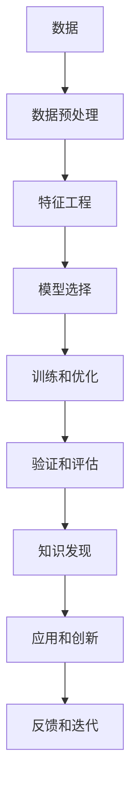

                 

# 推动知识发现与创新：人类计算的智力贡献

> 关键词：知识发现，计算模型，AI驱动，大数据分析，深度学习，优化算法，数学建模

## 1. 背景介绍

在信息爆炸和数据增长的时代，人类社会对知识的需求和渴求比以往任何时候都要强烈。如何将海量数据转化为有价值的知识，为人类决策提供支持，是当前人工智能和计算科学的重大挑战之一。本文旨在探讨人类计算在推动知识发现和创新方面的智力贡献，通过深入分析知识发现的过程、计算模型、优化算法和大数据分析方法，阐述其在提升人类智能、促进技术创新和应对全球挑战中的关键作用。

## 2. 核心概念与联系

### 2.1 核心概念概述

为更好地理解人类计算在知识发现中的作用，本节将介绍几个核心概念：

- 知识发现(Knowledge Discovery, KD)：通过数据挖掘、统计分析、机器学习等技术，从数据中提取和识别出有价值的知识、规律和模式的过程。
- 计算模型(Computational Model)：用数学和算法语言描述的、用于解决特定问题或模拟现象的计算框架。
- AI驱动(AI-Driven)：利用人工智能技术，如深度学习、自然语言处理、知识图谱等，自动推导知识、优化模型、提升性能。
- 大数据分析(Big Data Analysis)：对大规模数据集进行收集、处理、分析和可视化，从中挖掘出有意义的洞见和知识。
- 深度学习(Deep Learning)：一种基于多层神经网络的机器学习方法，通过层次化的特征提取和模式识别，实现对复杂数据的深度理解。
- 优化算法(Optimization Algorithm)：用于最小化或最大化特定函数，求解模型参数以优化性能的算法，如梯度下降、遗传算法等。
- 数学建模(Mathematical Modeling)：使用数学语言描述现实问题，并通过构建数学模型解决实际问题的方法。

这些概念共同构成了人类计算在知识发现和创新中的基本框架，通过科学计算、数据分析和人工智能技术，人类可以更高效、更系统地发现新知识，推动技术进步和社会发展。

### 2.2 核心概念原理和架构的 Mermaid 流程图



## 3. 核心算法原理 & 具体操作步骤
### 3.1 算法原理概述

知识发现的过程通常分为数据预处理、特征工程、模型选择、训练和优化、验证和评估、知识发现和应用等多个步骤。每个步骤都需要依赖相应的计算模型和优化算法，以确保模型能够高效、准确地发现知识。

- **数据预处理**：包括数据清洗、缺失值处理、异常值检测等，确保数据质量。
- **特征工程**：通过特征提取、特征选择、特征构造等手段，提升模型对数据的理解能力。
- **模型选择**：根据数据特征和任务需求，选择合适的机器学习模型，如决策树、随机森林、神经网络等。
- **训练和优化**：利用优化算法，如梯度下降、遗传算法等，最小化模型的损失函数，提高模型性能。
- **验证和评估**：通过交叉验证、ROC曲线等方法，评估模型的泛化能力和预测性能。
- **知识发现**：根据验证结果调整模型参数，提取数据中的知识和模式。
- **应用和创新**：将知识应用于实际问题中，推动技术创新和社会进步。
- **反馈和迭代**：通过反馈机制，不断改进算法和模型，提升知识发现的质量和效果。

### 3.2 算法步骤详解

#### 3.2.1 数据预处理

数据预处理是知识发现的第一步，其目标是通过清洗和转换数据，提高数据质量和适用性。具体步骤包括：

1. **数据清洗**：去除重复、错误、不一致的数据，处理缺失值和异常值。
2. **数据转换**：通过标准化、归一化、编码等技术，将数据转换为适用的格式。
3. **数据集成**：将来自不同源的数据进行整合，统一格式和标准。

#### 3.2.2 特征工程

特征工程是数据预处理的重要延伸，通过特征提取、特征选择和特征构造，提升模型的表现能力。具体步骤包括：

1. **特征提取**：从原始数据中提取有意义的特征，如文本中的词频、TF-IDF值、图像中的边缘特征等。
2. **特征选择**：根据特征的相关性和重要性，选择最具有代表性的特征，减少维度。
3. **特征构造**：通过数据变换、组合等方法，构造新的特征，如文本中的n-gram特征、图像中的尺度变换特征等。

#### 3.2.3 模型选择

根据数据类型和任务需求，选择合适的机器学习模型。常见的模型包括：

1. **决策树**：通过树形结构进行分类和回归，易于解释和理解。
2. **随机森林**：多个决策树的集成，减少过拟合和提高泛化能力。
3. **神经网络**：多层非线性模型，适用于复杂数据和高维空间。
4. **支持向量机**：通过超平面实现分类和回归，适用于小规模数据。
5. **集成学习**：通过组合多个模型，提升性能和鲁棒性，如AdaBoost、Bagging、Boosting等。

#### 3.2.4 训练和优化

利用优化算法，最小化模型的损失函数，提升模型性能。常见算法包括：

1. **梯度下降**：通过计算梯度更新模型参数，最小化损失函数。
2. **遗传算法**：模拟生物进化过程，通过交叉、变异、选择等操作优化模型参数。
3. **粒子群优化**：通过模拟粒子在搜索空间中的移动，寻找最优解。
4. **协同进化算法**：通过多个种群相互竞争和协作，优化模型参数。

#### 3.2.5 验证和评估

通过验证和评估，评估模型的泛化能力和预测性能。常见评估指标包括：

1. **准确率**：预测正确的样本占总样本的比例。
2. **精确率**：真正例占预测为正例的比例。
3. **召回率**：真正例占实际为正例的比例。
4. **F1分数**：精确率和召回率的调和平均。
5. **ROC曲线**：以假正例率为横轴，真正例率为纵轴，评估分类器性能。
6. **AUC值**：ROC曲线下的面积，用于评估分类器的总体性能。

#### 3.2.6 知识发现

根据验证结果，调整模型参数，提取数据中的知识和模式。常见步骤包括：

1. **参数调优**：通过网格搜索、随机搜索、贝叶斯优化等方法，优化模型参数。
2. **特征选择**：通过特征重要性评估，选择最优特征子集。
3. **模型融合**：通过集成多个模型，提升性能和鲁棒性。
4. **知识可视化**：通过热力图、散点图等方法，直观展示知识发现的结果。

#### 3.2.7 应用和创新

将知识应用于实际问题中，推动技术创新和社会进步。常见应用包括：

1. **预测分析**：通过模型预测未来趋势，如股票价格、天气变化等。
2. **聚类分析**：通过模型识别数据中的群组和模式，如市场细分、客户分类等。
3. **分类和识别**：通过模型对数据进行分类和识别，如垃圾邮件过滤、图像识别等。
4. **关联规则挖掘**：通过模型发现数据之间的关联规则，如购物篮分析、关联推荐等。

#### 3.2.8 反馈和迭代

通过反馈机制，不断改进算法和模型，提升知识发现的质量和效果。常见步骤包括：

1. **数据反馈**：通过用户反馈、日志分析等，获取模型应用的实际效果。
2. **算法改进**：根据反馈结果，优化算法和模型参数。
3. **模型更新**：根据最新数据和任务需求，更新和改进模型。

### 3.3 算法优缺点

#### 3.3.1 优点

- **高效性**：利用计算模型和优化算法，能够快速处理和分析大规模数据，发现知识。
- **鲁棒性**：通过多模型集成和特征选择，提高模型的泛化能力和鲁棒性。
- **可解释性**：许多计算模型具有可解释性，如决策树、逻辑回归等，有助于理解和解释模型结果。
- **适用性广**：适用于各种数据类型和任务需求，包括结构化、半结构化和非结构化数据。
- **自动化**：通过机器学习技术，实现自动化知识发现和优化，减少人工干预。

#### 3.3.2 缺点

- **数据质量要求高**：数据预处理和清洗工作量大，数据质量直接影响模型结果。
- **模型选择复杂**：不同模型适用于不同场景，选择不当可能影响模型效果。
- **参数调优困难**：模型参数调优需要大量实验和调整，工作量较大。
- **解释性不足**：深度学习等黑盒模型难以解释其内部决策机制。
- **过度拟合风险**：模型复杂度高，容易出现过拟合现象，泛化能力不足。

### 3.4 算法应用领域

基于计算模型和优化算法的知识发现技术，已经广泛应用于多个领域，包括但不限于：

- **金融分析**：利用历史交易数据，进行风险评估、信用评分、股票预测等。
- **医疗诊断**：通过患者数据，进行疾病诊断、治疗方案推荐、药物研发等。
- **市场营销**：分析消费者行为，进行市场细分、客户分类、营销策略优化等。
- **社交网络分析**：分析用户互动数据，进行关系挖掘、内容推荐、广告优化等。
- **图像和视频处理**：利用图像和视频数据，进行目标检测、物体识别、图像分割等。
- **自然语言处理**：分析文本数据，进行情感分析、语义理解、机器翻译等。
- **物联网和智能制造**：利用传感器数据，进行设备监测、故障诊断、生产优化等。

## 4. 数学模型和公式 & 详细讲解 & 举例说明

### 4.1 数学模型构建

知识发现的数学模型通常包括数据模型、统计模型和优化模型。具体构建如下：

1. **数据模型**：描述数据的特征和分布，如均值、方差、协方差等。
2. **统计模型**：通过假设检验、回归分析等方法，构建统计模型，如线性回归、逻辑回归、线性判别分析等。
3. **优化模型**：通过最小化损失函数，优化模型参数，如梯度下降、遗传算法等。

### 4.2 公式推导过程

#### 4.2.1 线性回归模型

线性回归模型通过最小化均方误差，建立输入特征与输出变量之间的线性关系。公式如下：

$$
y_i = \beta_0 + \sum_{j=1}^n \beta_j x_{ij} + \epsilon_i
$$

其中，$y_i$ 为第 $i$ 个样本的输出变量，$\beta_0$ 为截距，$\beta_j$ 为第 $j$ 个特征的系数，$\epsilon_i$ 为随机误差项。

模型参数 $\beta$ 的最小化目标为：

$$
\min_{\beta} \sum_{i=1}^n (y_i - \hat{y}_i)^2
$$

其中，$\hat{y}_i$ 为模型预测值，$y_i$ 为真实值。

通过梯度下降等优化算法，求解上述目标函数，得到模型参数 $\beta$ 的估计值。

#### 4.2.2 支持向量机

支持向量机通过构建超平面，实现分类和回归。公式如下：

$$
\min_{\alpha, \sigma} \frac{1}{2} \sum_{i=1}^n \alpha_i - \frac{C}{n} \sum_{i=1}^n \alpha_i y_i
$$

其中，$\alpha_i$ 为第 $i$ 个样本的拉格朗日乘子，$\sigma_i$ 为误差，$C$ 为正则化参数。

通过拉格朗日对偶方法，求解上述目标函数，得到模型参数 $\alpha$ 和 $\sigma$ 的估计值。

#### 4.2.3 决策树

决策树通过构建树形结构，实现分类和回归。公式如下：

$$
y_i = f(x_i; T)
$$

其中，$y_i$ 为第 $i$ 个样本的输出变量，$x_i$ 为输入特征，$T$ 为决策树模型。

通过信息增益或基尼指数等标准，选择最优特征和阈值，构建决策树。

### 4.3 案例分析与讲解

#### 4.3.1 金融风险预测

通过历史交易数据，构建线性回归模型，预测股票价格变化和信用评分。具体步骤包括：

1. **数据预处理**：清洗和标准化数据，去除异常值和缺失值。
2. **特征工程**：提取历史价格、交易量、公司财务指标等特征，构造新特征。
3. **模型选择**：选择线性回归模型，最小化均方误差。
4. **训练和优化**：利用梯度下降算法，优化模型参数。
5. **验证和评估**：通过交叉验证和ROC曲线评估模型性能。
6. **知识发现**：提取重要的预测因子，构建风险评估模型。
7. **应用和创新**：应用于股票价格预测、信用评分等场景。

#### 4.3.2 医疗诊断

通过患者数据，构建支持向量机模型，进行疾病诊断和治疗方案推荐。具体步骤包括：

1. **数据预处理**：清洗和标准化数据，去除异常值和缺失值。
2. **特征工程**：提取患者症状、历史病史、体检结果等特征，构造新特征。
3. **模型选择**：选择支持向量机模型，最小化分类误差。
4. **训练和优化**：利用拉格朗日对偶算法，优化模型参数。
5. **验证和评估**：通过交叉验证和ROC曲线评估模型性能。
6. **知识发现**：提取重要的预测因子，构建诊断和治疗方案推荐模型。
7. **应用和创新**：应用于疾病诊断、治疗方案推荐等场景。

## 5. 项目实践：代码实例和详细解释说明

### 5.1 开发环境搭建

在开始项目实践前，我们需要准备好开发环境。以下是使用Python进行Scikit-learn开发的Python环境配置流程：

1. 安装Anaconda：从官网下载并安装Anaconda，用于创建独立的Python环境。

2. 创建并激活虚拟环境：
```bash
conda create -n sk-learn-env python=3.8 
conda activate sk-learn-env
```

3. 安装Scikit-learn：
```bash
pip install scikit-learn
```

4. 安装numpy、pandas、matplotlib等工具包：
```bash
pip install numpy pandas matplotlib seaborn jupyter notebook ipython
```

完成上述步骤后，即可在`sk-learn-env`环境中开始项目实践。

### 5.2 源代码详细实现

下面我们以回归任务为例，给出使用Scikit-learn对线性回归模型进行训练的Python代码实现。

首先，定义线性回归模型：

```python
from sklearn.linear_model import LinearRegression
from sklearn.datasets import load_boston
from sklearn.model_selection import train_test_split
from sklearn.metrics import mean_squared_error

# 加载波士顿房价数据
data = load_boston()
X = data.data
y = data.target

# 划分训练集和测试集
X_train, X_test, y_train, y_test = train_test_split(X, y, test_size=0.3, random_state=42)

# 构建线性回归模型
model = LinearRegression()

# 训练模型
model.fit(X_train, y_train)

# 预测测试集
y_pred = model.predict(X_test)

# 评估模型
mse = mean_squared_error(y_test, y_pred)
print(f"Mean Squared Error: {mse}")
```

以上代码展示了从数据加载、模型构建、训练到预测和评估的全过程。可以看到，Scikit-learn库提供了丰富的机器学习算法和工具，使得模型的开发和评估变得简单高效。

### 5.3 代码解读与分析

让我们再详细解读一下关键代码的实现细节：

**load_boston方法**：
- 用于加载Boston房价数据集，包含506个样本，13个特征和目标变量。

**train_test_split方法**：
- 用于将数据集划分为训练集和测试集，方便模型训练和评估。

**LinearRegression类**：
- 用于构建线性回归模型，最小化均方误差。

**fit方法**：
- 用于训练模型，根据训练集数据计算模型参数。

**predict方法**：
- 用于预测测试集，生成模型输出。

**mean_squared_error函数**：
- 用于计算预测值和真实值之间的均方误差，评估模型性能。

以上步骤展示了线性回归模型的完整实现流程，通过Scikit-learn库，开发者可以快速搭建和优化模型，实现知识发现和分析。

## 6. 实际应用场景

### 6.1 金融风险预测

在金融领域，通过历史交易数据，构建线性回归模型，预测股票价格变化和信用评分，可以有效降低金融风险，提升资产管理水平。

具体应用场景包括：
- 股票价格预测：通过分析历史价格、交易量、公司财务指标等，预测未来股价变化趋势。
- 信用评分：根据客户历史还款记录、信用历史等信息，评估客户的信用风险和评分。

### 6.2 医疗诊断

在医疗领域，通过患者数据，构建支持向量机模型，进行疾病诊断和治疗方案推荐，可以有效提高医疗诊断的准确性和效率。

具体应用场景包括：
- 疾病诊断：根据患者症状、历史病史、体检结果等，诊断疾病类型和严重程度。
- 治疗方案推荐：根据患者疾病信息和临床试验数据，推荐最佳治疗方案和药物组合。

### 6.3 市场营销

在市场营销领域，通过分析消费者行为数据，构建分类和聚类模型，进行市场细分和客户分类，可以有效提升营销效果和客户满意度。

具体应用场景包括：
- 市场细分：根据消费者购买历史、行为数据等，划分不同市场细分群体，定制个性化营销策略。
- 客户分类：根据消费者行为数据，进行客户分类，提升客户维护和营销效果。

### 6.4 未来应用展望

随着计算技术和数据量的不断增长，知识发现和创新的应用场景将更加广泛和深入。未来，知识发现技术将在以下几个方面发挥重要作用：

1. **人工智能和大数据融合**：利用人工智能技术，如深度学习、自然语言处理等，从大数据中发现隐藏的知识和模式，推动技术创新和社会进步。
2. **多模态数据分析**：结合图像、视频、文本等多种数据类型，进行综合分析，提升知识发现的深度和广度。
3. **实时知识发现**：通过流计算和实时数据处理技术，实现动态知识发现，及时响应和处理现实问题。
4. **跨领域知识融合**：通过跨学科合作，将不同领域的知识和数据进行融合，发现更加综合和全面的知识。
5. **自适应知识发现**：通过自适应算法，动态调整模型和参数，适应数据分布和任务需求的变化。

这些应用方向将拓展知识发现技术的边界，推动人类智能和计算能力的进一步提升。

## 7. 工具和资源推荐

### 7.1 学习资源推荐

为了帮助开发者系统掌握知识发现的技术基础和实践技巧，这里推荐一些优质的学习资源：

1. 《机器学习实战》：由Peter Harrington编写，涵盖机器学习的基本概念和实践技巧，适合入门学习。
2. 《统计学习方法》：由李航编写，详细介绍了统计学习的基本理论和算法，适合深入学习。
3. 《Python数据科学手册》：由Jake VanderPlas编写，涵盖了Python数据科学和机器学习的基础知识和实践技巧。
4. 《数据科学导论》：由Coursera提供的在线课程，由Jeff Hammerbacher讲授，涵盖数据科学的基本理论和实践技巧。
5. Kaggle竞赛：通过参加Kaggle竞赛，实践数据科学和机器学习技术，提升实际应用能力。

通过对这些资源的学习实践，相信你一定能够系统掌握知识发现的基础理论和方法，并在实际项目中灵活应用。

### 7.2 开发工具推荐

高效的开发离不开优秀的工具支持。以下是几款用于知识发现开发的常用工具：

1. Jupyter Notebook：用于编写和运行Python代码，支持交互式编程和数据可视化。
2. Scikit-learn：用于构建和优化机器学习模型，支持多种算法和工具。
3. TensorFlow：用于构建和训练深度学习模型，支持分布式计算和高效推理。
4. PyTorch：用于构建和训练深度学习模型，支持动态计算图和高效优化。
5. R语言：用于数据科学和统计分析，支持丰富的数据分析和可视化工具。
6. MATLAB：用于数据科学和工程计算，支持多种数学和统计工具。

合理利用这些工具，可以显著提升知识发现任务的开发效率，加快创新迭代的步伐。

### 7.3 相关论文推荐

知识发现和创新的研究源于学界的持续研究。以下是几篇奠基性的相关论文，推荐阅读：

1. KDD Cup 2021 Machine Learning Challenge：介绍了KDD Cup 2021中的机器学习挑战赛，涵盖了数据预处理、特征工程、模型选择等多个环节，展示了最新的知识发现技术。
2. ICDAR 2019 Optical Character Recognition：介绍了ICDAR 2019中的光学字符识别竞赛，展示了利用深度学习技术进行文本识别和处理的最新进展。
3. CVPR 2018 Single Image Haze Removal：介绍了CVPR 2018中的单图像去雾竞赛，展示了利用深度学习技术进行图像处理的最新成果。
4. Kaggle Titanic Disaster Analysis：介绍了Kaggle泰坦尼克灾难分析竞赛，展示了利用机器学习技术进行数据分析和预测的最新应用。
5. JMLR 2018 Matrix Factorization Techniques for Recommender Systems：介绍了矩阵分解技术在推荐系统中的应用，展示了利用深度学习技术进行推荐算法的最新进展。

这些论文代表了知识发现和创新的最新趋势，通过学习这些前沿成果，可以帮助研究者把握学科前进方向，激发更多的创新灵感。

## 8. 总结：未来发展趋势与挑战

### 8.1 研究成果总结

本文对知识发现的过程、计算模型、优化算法和大数据分析方法进行了全面系统的介绍。通过深入分析知识发现的过程和应用，阐述了其在提升人类智能、促进技术创新和应对全球挑战中的关键作用。

### 8.2 未来发展趋势

展望未来，知识发现和创新的技术将在以下几个方面持续发展：

1. **数据量不断增长**：随着互联网和大数据技术的普及，数据量将持续增长，为知识发现提供更丰富的数据源。
2. **算法和模型不断优化**：新的算法和模型不断涌现，如深度学习、强化学习、自适应学习等，提升知识发现的精度和效率。
3. **跨领域知识融合**：通过跨学科合作，将不同领域的知识和数据进行融合，发现更加综合和全面的知识。
4. **实时知识发现**：通过流计算和实时数据处理技术，实现动态知识发现，及时响应和处理现实问题。
5. **人工智能和大数据融合**：利用人工智能技术，从大数据中发现隐藏的知识和模式，推动技术创新和社会进步。

### 8.3 面临的挑战

尽管知识发现和创新技术已经取得了显著成果，但在应用和发展过程中，仍面临诸多挑战：

1. **数据质量问题**：数据预处理和清洗工作量大，数据质量直接影响模型结果。
2. **模型选择复杂**：不同模型适用于不同场景，选择不当可能影响模型效果。
3. **参数调优困难**：模型参数调优需要大量实验和调整，工作量较大。
4. **解释性不足**：深度学习等黑盒模型难以解释其内部决策机制。
5. **过度拟合风险**：模型复杂度高，容易出现过拟合现象，泛化能力不足。

### 8.4 研究展望

面对知识发现和创新技术所面临的挑战，未来的研究需要在以下几个方面寻求新的突破：

1. **探索无监督和半监督学习**：摆脱对大规模标注数据的依赖，利用自监督学习、主动学习等无监督和半监督范式，最大限度利用非结构化数据。
2. **开发更加参数高效的模型**：开发更加参数高效的模型，在固定大部分预训练参数的同时，只更新极少量的任务相关参数。
3. **引入因果分析和博弈论工具**：通过引入因果分析方法，识别出模型决策的关键特征，增强输出解释的因果性和逻辑性。
4. **加强多模态数据融合**：将视觉、语音、文本等多模态数据进行融合，实现综合的知识发现和应用。
5. **引入伦理道德约束**：在模型训练目标中引入伦理导向的评估指标，过滤和惩罚有偏见、有害的输出倾向。

这些研究方向的探索，必将引领知识发现技术迈向更高的台阶，为构建安全、可靠、可解释、可控的智能系统铺平道路。面向未来，知识发现技术还需要与其他人工智能技术进行更深入的融合，如知识表示、因果推理、强化学习等，多路径协同发力，共同推动自然语言理解和智能交互系统的进步。只有勇于创新、敢于突破，才能不断拓展计算模型的边界，让智能技术更好地造福人类社会。

## 9. 附录：常见问题与解答

**Q1：知识发现和创新如何应用于实际问题？**

A: 知识发现和创新的应用通常包括以下步骤：
1. **数据收集**：收集相关的数据，包括结构化、半结构化和非结构化数据。
2. **数据清洗**：清洗和预处理数据，去除噪音和错误。
3. **特征提取**：从原始数据中提取有意义的特征，如文本中的词频、TF-IDF值、图像中的边缘特征等。
4. **模型选择**：根据数据类型和任务需求，选择合适的机器学习模型，如线性回归、决策树、支持向量机等。
5. **训练和优化**：利用优化算法，最小化模型的损失函数，提升模型性能。
6. **验证和评估**：通过验证和评估，评估模型的泛化能力和预测性能。
7. **知识发现**：根据验证结果调整模型参数，提取数据中的知识和模式。
8. **应用和创新**：将知识应用于实际问题中，推动技术创新和社会进步。

**Q2：如何在数据量不足的情况下进行知识发现？**

A: 数据量不足是知识发现中的常见问题，可以通过以下方法解决：
1. **数据增强**：通过数据扩充、数据生成等方法，增加训练数据量。
2. **半监督学习**：利用少量标注数据和大量未标注数据，进行半监督学习，提升模型性能。
3. **迁移学习**：利用其他领域的知识，通过迁移学习，提升模型在新领域的表现。
4. **自监督学习**：利用数据的隐含信息，进行自监督学习，发现知识。

**Q3：如何避免知识发现的过拟合现象？**

A: 过拟合是知识发现中的常见问题，可以通过以下方法解决：
1. **正则化**：通过L1正则、L2正则等方法，控制模型的复杂度，减少过拟合。
2. **早停法**：在训练过程中，通过验证集性能判断模型是否过拟合，提前停止训练。
3. **模型融合**：通过集成多个模型，提高模型的泛化能力。
4. **参数调优**：通过网格搜索、随机搜索等方法，优化模型参数，减少过拟合。

**Q4：如何评估知识发现的模型效果？**

A: 知识发现的模型效果评估通常包括以下指标：
1. **准确率**：预测正确的样本占总样本的比例。
2. **精确率**：真正例占预测为正例的比例。
3. **召回率**：真正例占实际为正例的比例。
4. **F1分数**：精确率和召回率的调和平均。
5. **ROC曲线**：以假正例率为横轴，真正例率为纵轴，评估分类器性能。
6. **AUC值**：ROC曲线下的面积，用于评估分类器的总体性能。

**Q5：知识发现和创新的未来发展方向是什么？**

A: 知识发现和创新的未来发展方向包括：
1. **自动化知识发现**：通过自动化算法和工具，实现知识发现的自动化，减少人工干预。
2. **实时知识发现**：通过流计算和实时数据处理技术，实现动态知识发现，及时响应和处理现实问题。
3. **跨领域知识融合**：通过跨学科合作，将不同领域的知识和数据进行融合，发现更加综合和全面的知识。
4. **多模态知识发现**：结合图像、视频、文本等多种数据类型，进行综合分析，提升知识发现的深度和广度。
5. **人工智能和大数据融合**：利用人工智能技术，从大数据中发现隐藏的知识和模式，推动技术创新和社会进步。

---

作者：禅与计算机程序设计艺术 / Zen and the Art of Computer Programming

