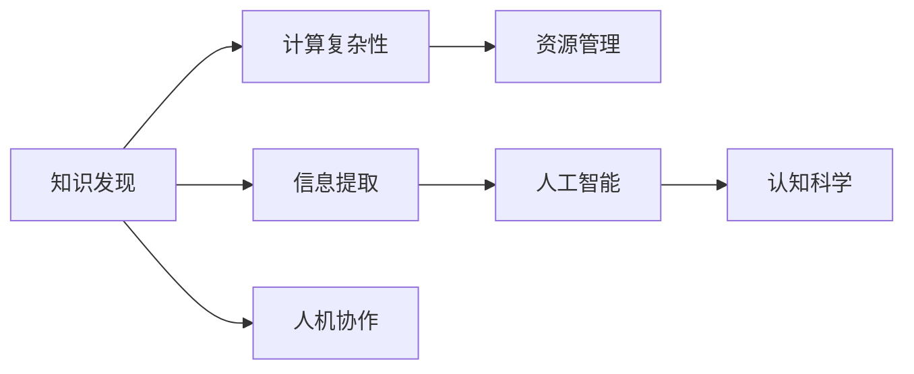

                 

# 推动知识发现和创新：人类计算的智力贡献

> 关键词：知识发现，智能计算，计算复杂性，人工智能，认知科学

## 1. 背景介绍

### 1.1 问题由来

在当前信息爆炸的时代，人类社会积累了海量的数据和信息。这些数据不仅包括传统的文献、图像、声音等，还涵盖了社交网络、传感器、互联网等现代信息技术带来的新形式。数据量的剧增极大地促进了知识发现和创新的过程，但同时也带来了计算复杂性的大幅增加。如何高效地从海量数据中提取有价值的信息，以及如何将计算与人类智力有效结合起来，成为一个重要的研究课题。

### 1.2 问题核心关键点

人类计算的智力贡献涉及以下几个核心关键点：
1. **知识发现与信息提取**：在数据驱动的世界中，如何从大规模数据集快速发现和提取有价值的信息，形成新知识。
2. **计算复杂性与资源管理**：随着数据规模的不断增大，如何高效地管理计算资源，避免资源浪费。
3. **人工智能与人类协作**：如何让计算机更好地理解和模拟人类的思维和推理能力，实现人机协同。
4. **认知科学与计算模型**：将认知科学的研究成果应用到计算模型中，提升模型的解释性和可理解性。

## 2. 核心概念与联系

### 2.1 核心概念概述

在讨论人类计算的智力贡献时，我们需要理解几个核心概念及其相互之间的联系：

- **知识发现 (Knowledge Discovery)**：从大规模数据集中提取有价值的信息，形成新的知识或洞察。
- **信息提取 (Information Extraction)**：识别并提取文本、图像、声音等数据中的结构化信息，如实体、关系等。
- **计算复杂性 (Computational Complexity)**：衡量计算问题的求解难度，如P、NP问题等。
- **资源管理 (Resource Management)**：在计算过程中合理分配和管理计算资源，包括CPU、内存、存储等。
- **人工智能 (Artificial Intelligence, AI)**：模拟人类智能行为，如学习、推理、决策等。
- **认知科学 (Cognitive Science)**：研究人类思维、感知和认知过程，包括语言、记忆、推理等。

这些概念之间的逻辑关系可以通过以下Mermaid流程图来展示：



这个流程图展示了一系列概念之间的联系：

1. 知识发现需要信息提取作为基础，提取的数据结构化后用于发现新知识。
2. 计算复杂性与资源管理密切相关，复杂的计算问题需要更高效的资源管理。
3. 人工智能与认知科学相互促进，认知科学的理论可以为AI提供灵感，而AI则可模拟和扩展人类认知能力。
4. 人机协作是知识发现和人工智能应用的重要环节，提升人机协同效率可以加速知识发现和创新。

## 3. 核心算法原理 & 具体操作步骤

### 3.1 算法原理概述

人类计算的智力贡献涉及多个领域的算法和原理。本节将重点介绍其中几个关键领域，包括知识发现、信息提取、人工智能和认知科学的算法原理。

### 3.2 算法步骤详解

#### 3.2.1 知识发现算法步骤

**Step 1: 数据预处理**
- 对原始数据进行清洗、归一化、去除噪声等处理，以便于后续分析。

**Step 2: 特征提取**
- 从清洗后的数据中提取有意义的特征，如文本中的关键词、情感极性、时间戳等。

**Step 3: 数据建模**
- 使用统计、机器学习或深度学习等方法对数据进行建模，以捕捉数据中的模式和关系。

**Step 4: 模型评估**
- 对模型进行验证和评估，选择最优模型以进行下一步分析。

**Step 5: 知识抽取**
- 利用选择好的模型从数据中抽取知识，形成新的知识表示或结构化数据。

#### 3.2.2 信息提取算法步骤

**Step 1: 数据准备**
- 收集并准备文本、图像、声音等数据，用于信息提取。

**Step 2: 预处理**
- 对数据进行格式转换、分词、降噪等预处理，以便于提取。

**Step 3: 实体识别**
- 使用命名实体识别技术，识别文本中的实体，如人名、地名、机构名等。

**Step 4: 关系抽取**
- 从文本中提取实体之间的关系，形成结构化的信息。

**Step 5: 知识图谱构建**
- 将提取的实体和关系构建为知识图谱，用于后续分析和应用。

#### 3.2.3 人工智能算法步骤

**Step 1: 问题定义**
- 明确人工智能要解决的问题，如分类、回归、生成等。

**Step 2: 模型选择**
- 选择适合的机器学习或深度学习模型，如SVM、随机森林、CNN、RNN等。

**Step 3: 数据准备**
- 准备训练数据，并将其分为训练集、验证集和测试集。

**Step 4: 模型训练**
- 使用训练集对模型进行训练，并根据验证集调整模型参数。

**Step 5: 模型评估**
- 在测试集上评估模型性能，并根据评估结果进行优化。

**Step 6: 模型部署**
- 将训练好的模型部署到实际应用中，并不断迭代优化。

#### 3.2.4 认知科学算法步骤

**Step 1: 理论基础**
- 基于认知科学的研究成果，构建认知模型。

**Step 2: 数据准备**
- 准备用于模型训练的认知数据，如脑成像数据、语言测试数据等。

**Step 3: 模型训练**
- 使用认知数据对模型进行训练，以捕捉人类认知过程。

**Step 4: 模型验证**
- 对模型进行验证，评估其与人类认知的拟合度。

**Step 5: 模型应用**
- 将训练好的认知模型应用于实际问题，如语言理解、情感分析等。

### 3.3 算法优缺点

人类计算的智力贡献涉及多个领域的算法，各有其优缺点：

**知识发现算法优点**：
- 可以处理大规模数据集，提取有价值的信息。
- 使用机器学习和深度学习技术，可以自动化处理复杂任务。

**知识发现算法缺点**：
- 数据预处理和特征提取需要人工干预，工作量大。
- 模型选择和调优过程复杂，需要大量计算资源。

**信息提取算法优点**：
- 可以快速识别和提取结构化信息，提升数据利用率。
- 应用广泛，如文本挖掘、图像识别、语音识别等。

**信息提取算法缺点**：
- 实体识别和关系抽取依赖于高质量的标注数据，标注成本高。
- 模型复杂度高，计算资源需求大。

**人工智能算法优点**：
- 可以模拟人类智能行为，解决复杂问题。
- 应用范围广，如自然语言处理、图像识别、智能推荐等。

**人工智能算法缺点**：
- 需要大量标注数据，标注成本高。
- 模型训练和优化过程复杂，对计算资源要求高。

**认知科学算法优点**：
- 可以模拟人类认知过程，提升模型的解释性和可理解性。
- 对数据要求不高，适用于小型数据集。

**认知科学算法缺点**：
- 模型复杂度高，训练时间长。
- 理论与实践之间的差距大，研究成果难以直接应用。

## 4. 数学模型和公式 & 详细讲解 & 举例说明

### 4.1 数学模型构建

人类计算的智力贡献涉及多个领域的数学模型，本节将重点介绍知识发现和信息提取中的数学模型构建。

#### 4.1.1 知识发现数学模型构建

在知识发现中，我们通常使用统计学和机器学习中的回归、分类和聚类等方法进行建模。以回归为例，假设我们有 $n$ 个样本 $(x_i, y_i)$，其中 $x_i \in \mathbb{R}^d$ 是特征向量，$y_i \in \mathbb{R}$ 是目标值，回归模型的目标是最小化预测值 $\hat{y}$ 与真实值 $y$ 之间的误差。常用的回归模型包括线性回归、多项式回归、神经网络回归等。

### 4.2 公式推导过程

以线性回归为例，回归模型的目标是最小化预测值 $\hat{y}$ 与真实值 $y$ 之间的平方误差：

$$
\min_{\theta} \sum_{i=1}^n (\hat{y_i} - y_i)^2
$$

其中 $\theta$ 为模型参数，$\hat{y_i} = \theta^T x_i$ 为预测值。使用梯度下降等优化算法对上述目标函数求导，可以求解出最优参数 $\theta$。

### 4.3 案例分析与讲解

以金融数据挖掘为例，我们可以使用线性回归模型对历史金融数据进行回归分析，预测股票价格变化。首先，我们将历史价格、交易量、市值等特征提取出来，然后使用线性回归模型进行训练。模型训练完成后，可以输入新的数据，预测未来的股票价格变化，为投资者提供参考。

## 5. 项目实践：代码实例和详细解释说明

### 5.1 开发环境搭建

为了进行知识发现和信息提取的实践，我们需要搭建一个Python开发环境。以下是搭建环境的详细步骤：

1. 安装Python：从官网下载并安装Python，选择3.x版本。
2. 安装Pandas：用于数据处理和分析，使用命令 `pip install pandas`。
3. 安装Scikit-learn：用于机器学习和统计分析，使用命令 `pip install scikit-learn`。
4. 安装TensorFlow或PyTorch：用于深度学习模型训练，使用命令 `pip install tensorflow` 或 `pip install torch`。
5. 安装Keras：用于深度学习模型的构建和训练，使用命令 `pip install keras`。

完成上述步骤后，即可在Python环境中进行知识发现和信息提取的实践。

### 5.2 源代码详细实现

以下是使用Pandas和Scikit-learn进行线性回归模型训练的Python代码：

```python
import pandas as pd
from sklearn.linear_model import LinearRegression
from sklearn.metrics import mean_squared_error

# 加载数据
data = pd.read_csv('financial_data.csv')

# 数据预处理
X = data[['price', 'volume', 'market_cap']]
y = data['sentiment']

# 训练模型
model = LinearRegression()
model.fit(X, y)

# 预测新数据
new_data = pd.DataFrame({'price': [1000, 2000, 3000], 'volume': [5000, 10000, 15000], 'market_cap': [100, 200, 300]})
predictions = model.predict(new_data)

# 评估模型
mse = mean_squared_error(y, predictions)
print(f'Mean Squared Error: {mse:.2f}')
```

### 5.3 代码解读与分析

这段代码实现了使用线性回归模型对金融数据进行回归分析。首先，我们使用Pandas加载数据，并进行特征提取和目标值提取。接着，我们使用Scikit-learn的LinearRegression模型进行训练，并用新数据进行预测。最后，我们使用均方误差 (MSE) 评估模型的预测准确性。

## 6. 实际应用场景

### 6.1 金融数据挖掘

金融数据挖掘可以应用于股票价格预测、市场情绪分析、风险评估等多个场景。通过收集历史金融数据，使用机器学习模型对数据进行建模，可以快速发现金融市场的规律和趋势，为投资者提供决策支持。

### 6.2 医疗数据挖掘

医疗数据挖掘可以应用于疾病预测、治疗方案推荐、药物研发等多个场景。通过收集和分析医疗数据，如电子病历、基因数据、影像数据等，可以发现疾病的潜在因素和风险，为医生和患者提供科学的决策支持。

### 6.3 社交媒体分析

社交媒体分析可以应用于舆情监测、市场趋势预测、用户行为分析等多个场景。通过收集和分析社交媒体数据，如微博、微信、Twitter等，可以发现公众情绪、市场热点、用户偏好等信息，为市场营销、舆情管理提供参考。

### 6.4 未来应用展望

未来，人类计算的智力贡献将更加广泛和深入。随着计算能力的不断提升，更多的复杂问题将可以通过计算来解决，如自动驾驶、智能制造、智慧城市等。同时，人工智能和认知科学的结合也将进一步深化，提升模型的解释性和可理解性，促进人机协同的发展。

## 7. 工具和资源推荐

### 7.1 学习资源推荐

为了系统掌握人类计算的智力贡献，推荐以下学习资源：

1. 《深度学习》书籍：由Ian Goodfellow等著，全面介绍了深度学习的原理和应用，是深度学习领域的经典教材。
2. 《机器学习实战》书籍：由Peter Harrington著，以Python为例，讲解了机器学习算法和实战案例，适合初学者入门。
3. 《数据挖掘导论》书籍：由Han Jifeng等著，介绍了数据挖掘的基本概念、方法和技术，是数据挖掘领域的经典教材。
4. Coursera机器学习课程：由Andrew Ng教授开设，讲解了机器学习的基本概念、算法和实现，是学习机器学习的绝佳资源。
5. Kaggle竞赛平台：提供大量的数据集和竞赛任务，可以实践数据挖掘、机器学习、深度学习等多种技术。

### 7.2 开发工具推荐

为了进行知识发现和信息提取的实践，推荐以下开发工具：

1. Python：强大的数据处理和分析语言，支持Pandas、NumPy等高效的数据处理库。
2. R：广泛用于统计分析和数据挖掘的语言，支持ggplot2等数据可视化库。
3. TensorFlow：强大的深度学习框架，支持分布式计算和模型优化。
4. PyTorch：灵活的深度学习框架，支持动态图和GPU加速。
5. Jupyter Notebook：强大的数据处理和模型调试工具，支持多种编程语言。

### 7.3 相关论文推荐

为了深入了解人类计算的智力贡献，推荐以下相关论文：

1. "Deep Learning"论文：由Goodfellow等著，介绍了深度学习的基本概念和应用，是深度学习领域的经典论文。
2. "A Survey on Data Mining and Statistical Learning"论文：由Wang Xindong等著，综述了数据挖掘和统计学习的基本方法和应用。
3. "Knowledge Discovery and Data Mining"论文：由Zaki等著，介绍了知识发现和数据挖掘的基本概念、方法和技术。
4. "Artificial Intelligence: A Modern Approach"书籍：由Russell等著，全面介绍了人工智能的基本概念、算法和应用。

## 8. 总结：未来发展趋势与挑战

### 8.1 总结

本文对人类计算的智力贡献进行了全面系统的介绍。首先阐述了知识发现、信息提取、计算复杂性、人工智能和认知科学的基本概念和相互联系。其次，从原理到实践，详细讲解了知识发现、信息提取、人工智能和认知科学的数学模型和算法步骤。最后，介绍了知识发现和信息提取的Python代码实现，并分析了实际应用场景。通过本文的系统梳理，可以看到，人类计算的智力贡献正在成为计算科学与人工智能融合的重要方向，极大地拓展了计算科学的应用边界。未来，伴随计算能力的不断提升和人工智能技术的不断成熟，人类计算的智力贡献必将在更多领域得到应用，为经济社会发展注入新的动力。

### 8.2 未来发展趋势

展望未来，人类计算的智力贡献将呈现以下几个发展趋势：

1. 计算能力持续增强：随着计算机硬件和软件技术的不断进步，计算能力将持续增强，更多复杂问题将可以通过计算来解决。
2. 人工智能与人类协作更加紧密：人工智能将更好地模拟人类智能行为，提升人机协同的效率和效果。
3. 认知科学和计算模型的结合更加深入：认知科学的研究成果将更多地应用于计算模型中，提升模型的解释性和可理解性。
4. 跨学科融合更加广泛：人工智能、认知科学、数据科学等领域的交叉融合，将带来更多创新性的应用场景。

### 8.3 面临的挑战

尽管人类计算的智力贡献取得了诸多成果，但在迈向更加智能化、普适化应用的过程中，它仍面临着诸多挑战：

1. 数据隐私和安全：随着数据量的不断增大，数据隐私和安全问题愈发突出，如何在保护隐私的前提下，高效利用数据，是一个重要的挑战。
2. 计算资源需求高：复杂问题往往需要大规模的计算资源，如何高效管理计算资源，避免资源浪费，是一个重要的研究方向。
3. 模型的可解释性：目前很多人工智能模型缺乏可解释性，难以理解其内部工作机制和决策逻辑，需要更多理论和实践的研究来提高模型的可解释性。
4. 认知科学理论的局限：尽管认知科学的研究成果丰富，但在将研究成果应用到计算模型中时，仍面临理论和实践之间的差距，如何弥合这一差距，是一个重要的挑战。

### 8.4 研究展望

面向未来，人类计算的智力贡献需要从以下几个方面进行进一步研究：

1. 数据隐私保护：研究和开发数据隐私保护技术，保护用户隐私，同时提升数据利用效率。
2. 计算资源优化：研究和开发高效的计算资源管理技术，提升计算效率，降低计算成本。
3. 模型可解释性提升：研究和开发模型可解释性技术，提升模型的透明度和可理解性。
4. 认知科学理论应用：将认知科学的研究成果更多地应用于计算模型中，提升模型的解释性和可理解性。

## 9. 附录：常见问题与解答

**Q1：人类计算的智力贡献是否适用于所有问题？**

A: 人类计算的智力贡献适用于数据驱动的复杂问题，可以处理大规模数据集，提取有价值的信息。但对于非数据驱动的问题，如创意、决策等，可能无法完全依靠计算来解决。

**Q2：计算复杂性如何衡量？**

A: 计算复杂性通常用时间复杂度和空间复杂度来衡量，时间复杂度表示算法执行时间与输入规模的关系，空间复杂度表示算法执行过程中所需内存大小。

**Q3：认知科学和人工智能的区别是什么？**

A: 认知科学主要研究人类思维、感知和认知过程，如语言、记忆、推理等。人工智能则主要研究如何让计算机模拟人类智能行为，如学习、推理、决策等。

**Q4：知识发现和信息提取的区别是什么？**

A: 知识发现主要关注从大规模数据集中提取有价值的信息，形成新的知识或洞察。信息提取则主要关注识别和提取文本、图像、声音等数据中的结构化信息，如实体、关系等。

**Q5：未来人类计算的智力贡献将如何发展？**

A: 未来，随着计算能力的不断提升和人工智能技术的不断成熟，人类计算的智力贡献将进一步深化和发展。人工智能将更好地模拟人类智能行为，认知科学的研究成果将更多地应用于计算模型中，提升模型的解释性和可理解性。

---

作者：禅与计算机程序设计艺术 / Zen and the Art of Computer Programming

