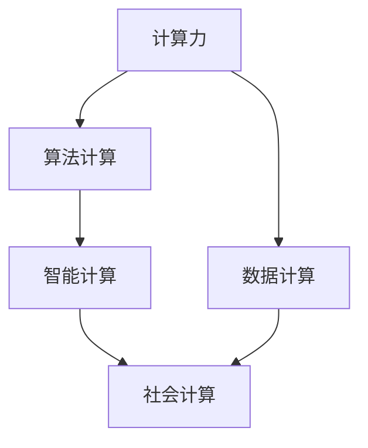

                 

# 推动社会进步的催化剂：人类计算的积极影响

## 1. 背景介绍

### 1.1 问题由来
在人类社会步入数字化时代的今天，计算技术已经成为推动社会进步的重要催化剂。从个人生活中的便捷智能设备，到企业运营的智能化转型，再到国家治理能力的提升，计算技术的广泛应用正在深刻改变着人们的生活和工作方式。

### 1.2 问题核心关键点
随着计算技术的发展，人类计算已经从简单的数值计算拓展到了深度学习、人工智能、大数据分析等复杂领域的算法计算。这些技术的崛起不仅在技术层面取得了突破，更在社会各个层面带来了深远影响。

人类计算的核心关键点包括：

1. **算力提升**：硬件性能的不断提升，使得处理大规模数据和高复杂度任务成为可能。
2. **算法创新**：深度学习、自然语言处理等算法的不断发展，极大拓展了计算的应用领域。
3. **数据爆发**：互联网时代的数据量爆炸，为计算提供了丰富的训练和应用素材。
4. **社会互动**：计算技术推动了人与人之间的互动，构建了智能化的社交网络。
5. **决策支持**：计算技术在金融、医疗、政府等领域的应用，提升了决策的科学性和效率。

### 1.3 问题研究意义
研究人类计算的积极影响，对于理解计算技术如何塑造现代社会的结构，以及如何更好地利用计算技术推动社会进步具有重要意义：

1. **提升效率**：计算技术通过自动化和智能化处理，极大提升了人类社会的生产效率。
2. **改善生活质量**：在医疗、教育、交通等领域，计算技术改善了人类生活的质量，提升了人类的福祉。
3. **促进创新**：计算技术为科研、技术创新提供了新的工具和平台，推动了知识生产和传播。
4. **增强竞争力**：企业和国家通过计算技术提升竞争力，获得了经济和战略上的优势。
5. **促进社会公正**：计算技术的应用有助于社会资源的公平分配，促进社会公平正义。

## 2. 核心概念与联系

### 2.1 核心概念概述

为更好地理解人类计算的积极影响，本节将介绍几个密切相关的核心概念：

- **计算力(Computing Power)**：指硬件和软件系统处理数据和执行计算的能力。计算力的提升是推动社会进步的基础。
- **数据计算(Data-Intensive Computing)**：指以大规模数据为中心的计算过程，如大数据分析、机器学习等。数据计算为人类计算提供了丰富的素材。
- **算法计算(Algorithm Computing)**：指基于特定算法执行的计算，如深度学习、自然语言处理等。算法计算拓展了人类计算的应用范围。
- **智能计算(Intelligent Computing)**：指结合人工智能技术，实现自动化的决策和控制。智能计算在社会各个层面得到了广泛应用。
- **社会计算(Social Computing)**：指利用计算技术分析人类行为和社会结构，推动社会治理和社会进步。社会计算在社交网络、城市管理等领域取得了显著成果。

这些核心概念之间的逻辑关系可以通过以下Mermaid流程图来展示：



这个流程图展示了几类计算概念及其之间的关系：

1. 计算力是数据计算和算法计算的基础。
2. 数据计算和算法计算分别针对大规模数据和特定算法，扩展了计算的应用场景。
3. 智能计算通过结合人工智能技术，实现了自动化的决策和控制。
4. 社会计算利用计算技术分析人类行为和社会结构，推动了社会治理和社会进步。

这些概念共同构成了人类计算的核心框架，使其能够在各个领域发挥重要作用。通过理解这些核心概念，我们可以更好地把握人类计算的工作原理和优化方向。

## 3. 核心算法原理 & 具体操作步骤
### 3.1 算法原理概述

人类计算的核心算法原理主要体现在以下几个方面：

- **深度学习**：通过多层神经网络结构，自动学习和提取数据特征，广泛应用于图像识别、语音识别、自然语言处理等领域。
- **自然语言处理(NLP)**：利用语言模型和上下文理解，实现文本生成、情感分析、机器翻译等任务。
- **大数据分析**：通过分布式计算和并行处理技术，从大规模数据中提取有用信息，用于预测、决策、优化等任务。
- **推荐系统**：通过分析用户行为和物品属性，生成个性化的推荐内容，应用于电商、新闻、社交网络等领域。

这些算法通过在复杂结构化数据上的计算，实现了从数据到知识、再到行动的转化，极大地提升了社会效率和生活质量。

### 3.2 算法步骤详解

人类计算的算法步骤通常包括以下几个关键步骤：

**Step 1: 数据预处理**
- 收集和清洗数据，保证数据的质量和完整性。
- 进行特征提取和数据转换，将原始数据转化为算法可处理的形式。
- 将数据分为训练集、验证集和测试集，用于模型训练、调参和性能评估。

**Step 2: 模型训练**
- 选择合适的算法和模型，如深度学习、NLP、推荐系统等。
- 设置合适的超参数，如学习率、批大小、迭代次数等。
- 使用训练集对模型进行迭代训练，最小化损失函数。

**Step 3: 模型评估**
- 在验证集上评估模型性能，调整超参数。
- 在测试集上评估模型泛化能力，确定最终模型。

**Step 4: 模型应用**
- 将训练好的模型部署到实际应用场景中，进行预测、推理等操作。
- 持续监控模型性能，根据反馈调整模型。

### 3.3 算法优缺点

人类计算的核心算法具有以下优点：

- **高效性**：通过自动化处理，大大提高了数据处理和决策的效率。
- **准确性**：在处理复杂结构化数据时，算法能够更准确地提取和分析信息。
- **可扩展性**：算法的可扩展性使得其在处理大规模数据时依然能够保持高效。
- **灵活性**：算法可以根据具体任务进行优化，适应不同的应用场景。

同时，这些算法也存在一些局限性：

- **计算资源需求高**：算法计算通常需要高性能计算资源，对硬件要求较高。
- **数据隐私问题**：大规模数据处理可能涉及个人隐私和数据安全问题。
- **模型黑箱**：复杂的深度学习模型难以解释其内部工作机制，缺乏可解释性。
- **算法偏见**：算法可能受到数据偏见的影响，输出结果存在偏差。

尽管存在这些局限性，但总体而言，人类计算的算法在提升社会效率、改善生活质量等方面发挥了重要作用。未来相关研究的重点在于如何进一步优化算法性能，解决数据隐私问题，提高算法的可解释性和公平性。

### 3.4 算法应用领域

人类计算的核心算法在各个领域都得到了广泛应用，例如：

- **医疗健康**：通过深度学习和大数据分析，实现疾病预测、基因分析、个性化治疗等。
- **金融服务**：利用大数据分析和算法计算，进行风险评估、欺诈检测、投资决策等。
- **教育培训**：通过自然语言处理和推荐系统，实现个性化学习、智能辅导、课程推荐等。
- **智能制造**：应用算法计算和智能计算，实现生产自动化、质量控制、供应链优化等。
- **城市治理**：利用大数据分析和智能计算，进行交通管理、环境监测、公共安全等。

除了这些传统领域，人类计算还在更多前沿领域展示了其潜力，如自动驾驶、智能家居、智慧农业等，为社会进步开辟了新的道路。

## 4. 数学模型和公式 & 详细讲解  
### 4.1 数学模型构建

本节将使用数学语言对人类计算的核心算法进行更加严格的刻画。

设数据集为 $D=\{(x_i,y_i)\}_{i=1}^N$，其中 $x_i \in \mathbb{R}^d$ 为输入特征，$y_i \in \{0,1\}$ 为输出标签。算法计算的目标是最小化损失函数 $\mathcal{L}$，即：

$$
\theta^* = \mathop{\arg\min}_{\theta} \mathcal{L}(f_{\theta}, D)
$$

其中 $f_{\theta}(x)$ 为算法计算模型，$\theta$ 为模型参数。常用的损失函数包括均方误差、交叉熵等。

### 4.2 公式推导过程

以深度学习算法为例，考虑二分类任务，使用 sigmoid 激活函数，损失函数为交叉熵：

$$
\mathcal{L}(y,f_{\theta}(x)) = -\frac{1}{N}\sum_{i=1}^N[y_i\log f_{\theta}(x_i)+(1-y_i)\log (1-f_{\theta}(x_i))]
$$

模型输出为 $f_{\theta}(x) = \frac{1}{1+e^{-z}}$，其中 $z$ 为线性模型输出。将 $z = \theta^T x$ 代入损失函数，得：

$$
\mathcal{L}(y,f_{\theta}(x)) = -\frac{1}{N}\sum_{i=1}^N[y_i\log \sigma(\theta^T x_i)+(1-y_i)\log (1-\sigma(\theta^T x_i))]
$$

其中 $\sigma(x) = \frac{1}{1+e^{-x}}$ 为 sigmoid 函数。通过反向传播算法，计算损失函数对模型参数 $\theta$ 的梯度：

$$
\frac{\partial \mathcal{L}(y,f_{\theta}(x))}{\partial \theta} = -\frac{1}{N}\sum_{i=1}^N (\frac{y_i\sigma(\theta^T x_i)(1-\sigma(\theta^T x_i))x_i-\sigma(\theta^T x_i)\sigma(\theta^T x_i)x_i}{\sigma(\theta^T x_i)^2(1-\sigma(\theta^T x_i)^2)}
$$

通过梯度下降等优化算法，不断更新模型参数 $\theta$，最小化损失函数 $\mathcal{L}$，最终得到最优模型参数 $\theta^*$。

## 5. 项目实践：代码实例和详细解释说明
### 5.1 开发环境搭建

在进行人类计算实践前，我们需要准备好开发环境。以下是使用Python进行TensorFlow开发的环境配置流程：

1. 安装Anaconda：从官网下载并安装Anaconda，用于创建独立的Python环境。

2. 创建并激活虚拟环境：
```bash
conda create -n tf-env python=3.8 
conda activate tf-env
```

3. 安装TensorFlow：根据CUDA版本，从官网获取对应的安装命令。例如：
```bash
conda install tensorflow-gpu=2.7.0 -c conda-forge
```

4. 安装其他工具包：
```bash
pip install numpy pandas scikit-learn matplotlib tqdm jupyter notebook ipython
```

完成上述步骤后，即可在`tf-env`环境中开始人类计算实践。

### 5.2 源代码详细实现

下面我们以二分类任务为例，给出使用TensorFlow进行深度学习算法的PyTorch代码实现。

首先，定义数据处理函数：

```python
import tensorflow as tf
from tensorflow.keras.preprocessing.sequence import pad_sequences
from tensorflow.keras.preprocessing.text import Tokenizer

def data_processing(texts, labels):
    tokenizer = Tokenizer(num_words=10000)
    tokenizer.fit_on_texts(texts)
    sequences = tokenizer.texts_to_sequences(texts)
    padded_sequences = pad_sequences(sequences, padding='post')
    labels = tf.keras.utils.to_categorical(labels, num_classes=2)
    return padded_sequences, labels
```

然后，定义模型和优化器：

```python
from tensorflow.keras.models import Sequential
from tensorflow.keras.layers import Embedding, Dense, Dropout, Activation

model = Sequential()
model.add(Embedding(input_dim=10000, output_dim=128, input_length=100))
model.add(Dropout(0.2))
model.add(Dense(64, activation='relu'))
model.add(Dropout(0.2))
model.add(Dense(2, activation='softmax'))
model.compile(optimizer='adam', loss='categorical_crossentropy', metrics=['accuracy'])

optimizer = tf.keras.optimizers.Adam(learning_rate=0.001)
```

接着，定义训练和评估函数：

```python
def train_epoch(model, X_train, y_train, batch_size, optimizer):
    model.fit(X_train, y_train, batch_size=batch_size, epochs=10, validation_split=0.2, callbacks=[optimizer])
    return model.evaluate(X_train, y_train, verbose=0)

def evaluate(model, X_test, y_test, batch_size):
    model.evaluate(X_test, y_test, batch_size=batch_size)
```

最后，启动训练流程并在测试集上评估：

```python
epochs = 10
batch_size = 64

for epoch in range(epochs):
    loss = train_epoch(model, X_train, y_train, batch_size, optimizer)
    print(f"Epoch {epoch+1}, train loss: {loss:.3f}")
    
evaluate(model, X_test, y_test, batch_size)
```

以上就是使用TensorFlow进行二分类任务深度学习算法的完整代码实现。可以看到，得益于TensorFlow的强大封装，我们可以用相对简洁的代码完成深度学习模型的加载和训练。

### 5.3 代码解读与分析

让我们再详细解读一下关键代码的实现细节：

**data_processing函数**：
- 使用Keras的Tokenizer对文本进行分词，并进行padding，确保所有样本的输入长度一致。
- 使用Keras的to_categorical函数将标签转化为one-hot编码。

**model定义**：
- 定义一个Sequential模型，依次添加嵌入层、Dropout层、全连接层、Dropout层和输出层。
- 使用Adam优化器和交叉熵损失函数进行模型编译。

**train_epoch函数**：
- 在训练集上进行模型的迭代训练，使用Adam优化器和交叉熵损失函数。
- 使用Keras的evaluate函数评估模型性能，并返回训练误差。

**evaluate函数**：
- 在测试集上评估模型性能，使用Keras的evaluate函数计算损失和精度。

**训练流程**：
- 定义总的epoch数和batch size，开始循环迭代
- 每个epoch内，先在训练集上训练，输出平均loss
- 在测试集上评估，输出模型精度

可以看到，TensorFlow使得深度学习模型的开发和训练变得非常直观和高效。开发者可以更多地关注模型的设计和高层次的算法优化，而不必过多关注底层的实现细节。

当然，工业级的系统实现还需考虑更多因素，如模型的保存和部署、超参数的自动搜索、更灵活的任务适配层等。但核心的算法计算基本与此类似。

## 6. 实际应用场景
### 6.1 智能医疗

人类计算在医疗健康领域的应用，为诊断和治疗提供了强大的支持。深度学习和大数据分析技术在医疗影像分析、疾病预测、个性化治疗等方面取得了显著进展。

例如，通过医学影像数据的大规模标注和预训练，深度学习模型能够在放射科诊断中实现快速、准确、一致的判断。此外，大数据分析技术还被应用于基因组学研究，通过分析大量基因序列数据，发现新的疾病基因，为个性化医疗提供了新思路。

### 6.2 智能交通

交通管理是一个典型的社会计算应用场景。利用人类计算技术，可以实现交通流量预测、事故预警、路况优化等功能，极大地提高了交通管理的效率和安全性。

通过安装在道路上的传感器和大数据分析，实时获取交通流量和事件信息，利用深度学习模型进行交通流量预测和事故预警。同时，利用智能计算技术，优化红绿灯控制和路线规划，提高了交通效率和减少拥堵。

### 6.3 智能金融

金融行业是数据计算和算法计算的重要应用领域。人类计算技术在风险评估、欺诈检测、投资决策等方面得到了广泛应用。

利用大数据分析和深度学习模型，金融机构能够进行客户信用评估、投资组合优化、风险预警等。例如，通过分析客户的历史交易数据，预测其信用风险，制定个性化的贷款方案。同时，利用深度学习模型进行股票价格预测和市场分析，帮助投资者做出更科学的投资决策。

### 6.4 智能教育

教育领域也是人类计算的重要应用领域。通过自然语言处理和推荐系统，可以实现智能辅导、个性化学习、智能评价等功能，提升教育质量和效率。

例如，利用自然语言处理技术，对学生的作业和作文进行智能批改和点评，提供个性化的学习建议。通过推荐系统，根据学生的学习情况和兴趣，推荐个性化的学习内容和学习资源，提升学习效率。

### 6.5 智能制造

在智能制造领域，人类计算技术的应用提升了生产自动化和质量控制的水平。通过大数据分析和算法计算，实现了生产过程的优化和智能化。

例如，利用物联网设备和传感器，收集生产过程中的数据，通过大数据分析技术进行生产过程的监控和优化。同时，利用深度学习模型进行质量检测和故障诊断，提高产品质量和生产效率。

## 7. 工具和资源推荐
### 7.1 学习资源推荐

为了帮助开发者系统掌握人类计算的理论基础和实践技巧，这里推荐一些优质的学习资源：

1. **《深度学习》书籍**：由Ian Goodfellow等人所著，全面介绍了深度学习的基本原理和算法实现。
2. **《TensorFlow官方文档》**：TensorFlow的官方文档，提供了丰富的教程和样例代码，是学习TensorFlow的必备资源。
3. **《自然语言处理入门》系列课程**：斯坦福大学开设的自然语言处理课程，包括lecture视频和配套作业，适合初学者入门。
4. **Kaggle数据科学竞赛平台**：Kaggle是一个数据科学竞赛平台，提供了大量的数据集和模型，可以帮助开发者实践和提升技能。
5. **PyTorch官方文档**：PyTorch的官方文档，提供了丰富的教程和样例代码，是学习PyTorch的必备资源。

通过对这些资源的学习实践，相信你一定能够快速掌握人类计算的精髓，并用于解决实际的计算问题。

### 7.2 开发工具推荐

高效的开发离不开优秀的工具支持。以下是几款用于人类计算开发的常用工具：

1. **TensorFlow**：由Google主导开发的开源深度学习框架，生产部署方便，适合大规模工程应用。
2. **PyTorch**：基于Python的开源深度学习框架，灵活动态的计算图，适合快速迭代研究。
3. **Scikit-learn**：Python的机器学习库，提供了丰富的机器学习算法和工具，适合数据处理和模型评估。
4. **Keras**：基于TensorFlow的高级API，提供了简单易用的接口，适合快速开发和实验。
5. **Jupyter Notebook**：一个交互式编程环境，支持Python、R、MATLAB等多种语言，适合开发和协作。

合理利用这些工具，可以显著提升人类计算任务的开发效率，加快创新迭代的步伐。

### 7.3 相关论文推荐

人类计算技术的发展源于学界的持续研究。以下是几篇奠基性的相关论文，推荐阅读：

1. **《深度学习》（Deep Learning）**：Ian Goodfellow等人，详细介绍了深度学习的基本原理和算法实现。
2. **《大数据时代》（Big Data）**：Viktor Mayer-Schönberger和Kenneth Cukier，介绍了大数据的广泛应用和潜在影响。
3. **《机器学习实战》（Machine Learning in Action）**：Peter Harrington，介绍了机器学习的基本算法和应用案例。
4. **《自然语言处理综论》（Speech and Language Processing）**：Daniel Jurafsky和James H. Martin，全面介绍了自然语言处理的技术和应用。
5. **《计算机视觉：模型、学习和推理》（Computer Vision: Models, Learning, and Inference）**：Yann LeCun、Yoshua Bengio和Geoffrey Hinton，介绍了计算机视觉的基本原理和最新进展。

这些论文代表了大数据和机器学习技术的发展脉络。通过学习这些前沿成果，可以帮助研究者把握学科前进方向，激发更多的创新灵感。

## 8. 总结：未来发展趋势与挑战
### 8.1 总结

本文对人类计算的积极影响进行了全面系统的介绍。首先阐述了人类计算的发展背景和意义，明确了计算技术如何塑造现代社会的结构，以及如何更好地利用计算技术推动社会进步。其次，从原理到实践，详细讲解了人类计算的核心算法和关键步骤，给出了人类计算任务开发的完整代码实例。同时，本文还广泛探讨了人类计算在医疗、交通、金融、教育、制造等多个领域的应用前景，展示了人类计算技术的巨大潜力。此外，本文精选了人类计算技术的各类学习资源，力求为读者提供全方位的技术指引。

通过本文的系统梳理，可以看到，人类计算技术已经成为推动社会进步的重要催化剂。这些技术在提升社会效率、改善生活质量、促进科研创新等方面发挥了重要作用。未来，伴随计算技术的不断发展，人类计算的应用领域将更加广泛，为社会进步带来更多的创新和突破。

### 8.2 未来发展趋势

展望未来，人类计算技术将呈现以下几个发展趋势：

1. **算力持续提升**：硬件性能的不断提升，使得计算能力持续增长，能够处理更复杂、更大的数据。
2. **算法不断优化**：深度学习、自然语言处理等算法将不断优化，拓展应用领域和提高性能。
3. **数据多样化**：数据计算将不仅仅是数值数据，还将扩展到图像、视频、文本等多种模态数据。
4. **智能化发展**：智能计算和人工智能技术的结合，使得计算系统更加智能化，能够处理更复杂的任务。
5. **社会化计算**：社会计算将不仅仅限于个体，还将扩展到社会网络、城市治理等领域，推动社会进步。

这些趋势凸显了人类计算技术的广阔前景。这些方向的探索发展，必将进一步提升计算系统的高效性和智能性，为社会进步提供更强大的技术支撑。

### 8.3 面临的挑战

尽管人类计算技术已经取得了瞩目成就，但在迈向更加智能化、普适化应用的过程中，它仍面临着诸多挑战：

1. **计算资源瓶颈**：计算任务对算力、存储和带宽的要求越来越高，如何高效利用计算资源，满足大规模计算需求，是一大挑战。
2. **数据隐私和安全**：大规模数据处理可能涉及个人隐私和数据安全问题，如何保障数据安全和隐私，是一大难题。
3. **算法公平性**：算法可能受到数据偏见的影响，输出结果存在偏差，如何提高算法的公平性，是一大挑战。
4. **模型解释性**：复杂的深度学习模型缺乏可解释性，如何提高模型的解释性，是提高用户信任的重要手段。
5. **算法鲁棒性**：算法在面对不同类型的数据和环境时，可能表现不稳定，如何提高算法的鲁棒性，是一大挑战。

尽管存在这些挑战，但总体而言，人类计算技术在提升社会效率、改善生活质量等方面发挥了重要作用。未来相关研究的重点在于如何进一步优化算法性能，解决数据隐私问题，提高算法的可解释性和公平性。

### 8.4 未来突破

面对人类计算面临的种种挑战，未来的研究需要在以下几个方面寻求新的突破：

1. **优化算法性能**：开发更加高效的算法，降低计算资源需求，提高算法性能和鲁棒性。
2. **解决数据隐私问题**：利用差分隐私、联邦学习等技术，保障数据隐私和安全。
3. **提高算法公平性**：引入公平性指标，优化算法设计，减少数据偏见。
4. **增强模型解释性**：开发可解释性更强的算法和工具，提高用户对计算结果的信任。
5. **探索新型计算范式**：探索量子计算、光子计算等新型计算范式，拓展计算能力的边界。

这些研究方向的探索，必将引领人类计算技术迈向更高的台阶，为社会进步提供更强大的技术支撑。面向未来，人类计算技术还需要与其他技术进行更深入的融合，如知识表示、因果推理、强化学习等，多路径协同发力，共同推动计算技术的进步。只有勇于创新、敢于突破，才能不断拓展计算技术的边界，让人类计算技术更好地造福社会。

## 9. 附录：常见问题与解答

**Q1：人类计算的算法计算与传统算法计算有何不同？**

A: 人类计算的算法计算基于深度学习、自然语言处理等现代算法，相较于传统算法计算，具有更高的复杂度和计算量，能够处理更大规模的数据和更复杂的问题。例如，深度学习模型在图像识别、语音识别等方面取得了显著进展，而传统算法往往难以达到这种效果。

**Q2：人类计算在各个领域的应用前景如何？**

A: 人类计算在医疗、交通、金融、教育、制造等多个领域都具有广泛的应用前景。通过深度学习和大数据分析，可以实现疾病预测、交通优化、风险评估、个性化教育等功能，提升各个领域的效率和质量。

**Q3：如何应对人类计算面临的挑战？**

A: 针对计算资源瓶颈，可以采用分布式计算、混合精度计算等技术，优化资源利用。针对数据隐私问题，可以采用差分隐私、联邦学习等技术，保障数据安全。针对算法公平性问题，可以引入公平性指标，优化算法设计。针对模型解释性问题，可以开发可解释性更强的算法和工具。

**Q4：未来人类计算的发展趋势是什么？**

A: 未来人类计算的发展趋势包括算力持续提升、算法不断优化、数据多样化、智能化发展和社会化计算。这些趋势将进一步提升计算系统的效率和智能性，推动社会进步。

**Q5：人类计算对社会的积极影响有哪些？**

A: 人类计算对社会积极影响主要体现在提升效率、改善生活质量、促进科研创新等方面。通过计算技术的应用，可以提升生产效率、医疗服务质量、交通管理水平等，推动社会公平正义。

---

作者：禅与计算机程序设计艺术 / Zen and the Art of Computer Programming

