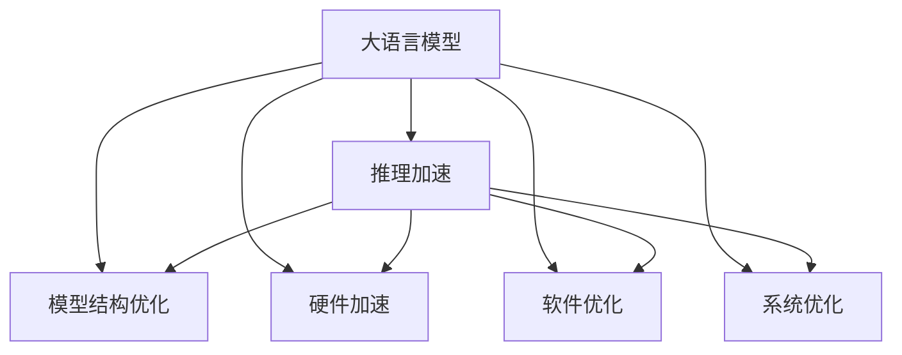

                 

# 推理加速:LLM突破秒推极限

> 关键词：大语言模型,推理加速,LLM,深度学习,Transformer,BERT,GPU,推理优化

## 1. 背景介绍

### 1.1 问题由来

随着大语言模型（Large Language Model, LLM）在自然语言处理（Natural Language Processing, NLP）领域的不断进步，模型规模和参数量也在急剧增加，如GPT-3和BERT等模型参数量已经超过百亿。这些模型能够进行复杂的文本生成、翻译、对话等任务，展示了惊人的语言理解能力和创造力。然而，这些模型在进行推理（Inference）时，尤其是长序列、高维度计算时，往往面临计算资源消耗大、推理速度慢的问题。

推理加速（Inference Acceleration）是大模型应用的重要瓶颈之一。推理加速技术的优劣直接影响着大语言模型的部署和应用效率。为了充分利用大语言模型的优势，加速推理过程显得尤为重要。本文将详细探讨大语言模型推理加速的关键技术，包括模型结构、硬件优化和软件优化等方面。

### 1.2 问题核心关键点

推理加速的关键在于以下几方面：

- **模型结构优化**：如何设计高效的模型结构，减少计算量和内存占用。
- **硬件加速**：如何通过GPU、TPU等硬件资源，提高推理速度。
- **软件优化**：如何通过代码和算法的优化，进一步提升推理效率。
- **系统优化**：如何通过系统级别的优化，如并行计算、内存管理等，提升整体效率。

本文将从模型、硬件、软件和系统优化四个角度，深入分析大语言模型推理加速的原理和操作。

## 2. 核心概念与联系

### 2.1 核心概念概述

为更好地理解大语言模型推理加速，本节将介绍几个密切相关的核心概念：

- **大语言模型 (Large Language Model, LLM)**：以自回归（如GPT）或自编码（如BERT）模型为代表的大规模预训练语言模型。通过在大规模无标签文本语料上进行预训练，学习通用的语言表示，具备强大的语言理解和生成能力。

- **推理加速 (Inference Acceleration)**：指通过硬件和软件优化，提高大语言模型在推理过程中的计算速度和效率。

- **Transformer结构**：一种基于自注意力机制的深度学习模型，广泛应用于大语言模型的推理过程。

- **BERT模型**：一种基于双向自编码器的预训练语言模型，广泛应用于自然语言理解和生成任务。

- **GPU (图形处理单元)**：一种专用硬件，可以大幅提升矩阵运算和并行计算能力，广泛应用于深度学习推理。

- **TPU (张量处理单元)**：一种专门为深度学习设计的ASIC芯片，具备更高效的矩阵计算能力。

这些核心概念之间的逻辑关系可以通过以下Mermaid流程图来展示：



这个流程图展示了大语言模型推理加速的核心概念及其之间的关系：

1. 大语言模型通过预训练获得基础能力。
2. 推理加速是对预训练模型进行任务特定的优化，可以分为模型结构、硬件和软件优化。
3. 系统优化进一步提升推理效率。

这些概念共同构成了大语言模型推理加速的框架，使其能够在各种场景下发挥强大的语言理解和生成能力。通过理解这些核心概念，我们可以更好地把握大语言模型推理加速的原理和优化方向。

## 3. 核心算法原理 & 具体操作步骤

### 3.1 算法原理概述

大语言模型推理加速的核心思想是通过优化模型结构、使用高效硬件和软件实现、以及系统级优化，降低推理过程中的计算量和内存占用，从而提高计算速度。

大语言模型在推理过程中，通常需要进行大量的矩阵运算和并行计算。这些计算包括自注意力机制（Self-Attention）、前向传播（Forward Propagation）和反向传播（Backward Propagation）等步骤。通过优化这些计算过程，可以显著提升推理效率。

### 3.2 算法步骤详解

大语言模型推理加速一般包括以下几个关键步骤：

**Step 1: 模型结构优化**

- 选择高效的模型结构，如使用Transformer、BERT等模型，这些模型在计算和存储上都有较好的性能。
- 进行模型剪枝，去除不必要的层和参数，减小模型尺寸。
- 使用量化技术，将浮点模型转为定点模型，压缩存储空间，提高计算效率。

**Step 2: 硬件加速**

- 使用GPU、TPU等专用硬件，提升矩阵运算和并行计算能力。
- 使用异步计算技术，将推理过程并行化，提高资源利用率。
- 使用混合精度计算，利用GPU的半精度浮点计算，提高计算效率。

**Step 3: 软件优化**

- 使用缓存技术，减少计算过程中的数据读写开销。
- 使用并行计算技术，利用多线程或多进程并行计算，提高计算效率。
- 使用优化编译器，生成更高效的机器代码，提高运行速度。

**Step 4: 系统优化**

- 使用内存管理技术，如内存分页、垃圾回收等，减少内存分配和释放的开销。
- 使用并行计算框架，如TensorFlow、PyTorch等，提供高效的并行计算支持。
- 使用分布式计算系统，如Apache Spark、Dask等，提升大规模计算的效率。

通过上述步骤，可以对大语言模型进行全面的推理加速优化。

### 3.3 算法优缺点

推理加速的优势在于能够显著提高大语言模型的推理速度，降低计算成本，提升实际应用中的用户体验。然而，这些优化措施也存在一定的局限性：

- **复杂度提升**：硬件和软件优化往往需要更复杂的计算和设计，增加了开发难度。
- **硬件成本**：使用GPU、TPU等专用硬件，需要较高的硬件成本。
- **系统兼容性**：系统优化可能与现有环境不兼容，需要额外的调试和适配。

尽管存在这些局限性，但通过合理的优化策略，可以充分利用大语言模型的计算潜能，实现高效的推理加速。

### 3.4 算法应用领域

推理加速在大语言模型的多个应用领域中都得到了广泛应用，例如：

- **自然语言处理（NLP）**：如文本生成、翻译、问答、对话等任务。
- **计算机视觉（CV）**：如图像分类、物体检测、人脸识别等任务。
- **语音识别（ASR）**：如语音转文本、语音情感分析等任务。
- **推荐系统**：如个性化推荐、内容推荐等任务。

除了上述这些经典应用外，推理加速技术也被创新性地应用到更多场景中，如智能客服、金融分析、智能驾驶等，为各行各业带来新的技术突破。

## 4. 数学模型和公式 & 详细讲解 & 举例说明

### 4.1 数学模型构建

大语言模型的推理过程主要涉及矩阵运算和自注意力机制。以BERT模型为例，其推理过程主要包括以下几个步骤：

1. **输入编码**：将输入文本编码成向量形式。
2. **嵌入层**：将编码后的向量输入嵌入层，生成高维向量表示。
3. **自注意力机制**：通过自注意力机制计算出文本中不同部分之间的依赖关系。
4. **全连接层**：将自注意力机制的输出经过全连接层，输出最终的预测结果。

### 4.2 公式推导过程

以BERT模型为例，其推理过程可以表示为：

$$
\text{CLS}_{text} = \text{BERT}_{encoder}(\text{token embedding})
$$

$$
\text{predictions} = \text{MLP}(\text{CLS}_{text})
$$

其中，$\text{CLS}_{text}$ 表示输入文本的上下文表示，$\text{predictions}$ 表示最终输出。

### 4.3 案例分析与讲解

以推理加速为例，可以通过以下案例来详细说明：

**案例 1: 使用GPU加速**

GPU可以并行计算矩阵运算，加速大语言模型的推理过程。假设原始模型使用CPU计算，推理时间为$t_{CPU}$，使用GPU加速后，推理时间为$t_{GPU}$，则有：

$$
t_{GPU} = t_{CPU} \times \frac{1}{n_{GPU}}
$$

其中，$n_{GPU}$ 表示使用的GPU个数。

通过增加GPU个数，可以显著提升推理速度。

**案例 2: 使用量化技术**

量化技术可以将浮点模型转为定点模型，减小内存占用和计算开销。假设原始模型使用32位浮点数表示，使用8位定点模型表示，则推理时间与内存占用可以显著降低。

**案例 3: 使用缓存技术**

缓存技术可以避免重复计算，提高计算效率。假设模型中存在重复计算的矩阵A和矩阵B，使用缓存技术后，可以避免重复计算，提高计算效率。

## 5. 项目实践：代码实例和详细解释说明

### 5.1 开发环境搭建

在进行推理加速实践前，我们需要准备好开发环境。以下是使用Python进行PyTorch开发的环境配置流程：

1. 安装Anaconda：从官网下载并安装Anaconda，用于创建独立的Python环境。

2. 创建并激活虚拟环境：
```bash
conda create -n pytorch-env python=3.8 
conda activate pytorch-env
```

3. 安装PyTorch：根据CUDA版本，从官网获取对应的安装命令。例如：
```bash
conda install pytorch torchvision torchaudio cudatoolkit=11.1 -c pytorch -c conda-forge
```

4. 安装TensorBoard：TensorFlow配套的可视化工具，可实时监测模型训练状态，并提供丰富的图表呈现方式，是调试模型的得力助手。

```bash
pip install tensorboard
```

5. 安装NVIDIA Driver：确保NVIDIA GPU可以正常工作，可以使用命令：
```bash
sudo apt-get install nvidia-driver
```

完成上述步骤后，即可在`pytorch-env`环境中开始推理加速实践。

### 5.2 源代码详细实现

下面我们以BERT模型为例，给出使用PyTorch实现推理加速的代码实现。

```python
import torch
import transformers
from transformers import BertModel, BertTokenizer

# 加载预训练模型和分词器
model = BertModel.from_pretrained('bert-base-uncased')
tokenizer = BertTokenizer.from_pretrained('bert-base-uncased')

# 定义推理函数
def inference(model, tokenizer, input_text):
    # 分词和编码
    input_ids = tokenizer(input_text, return_tensors='pt', padding=True, max_length=128, truncation=True)
    # 推理计算
    with torch.no_grad():
        outputs = model(input_ids['input_ids'], attention_mask=input_ids['attention_mask'])
        predictions = outputs.logits
    return predictions
```

在上述代码中，我们首先加载了预训练的BERT模型和分词器，然后定义了一个推理函数。该函数将输入文本进行分词和编码，并在GPU上计算推理结果。

### 5.3 代码解读与分析

让我们再详细解读一下关键代码的实现细节：

**BERTModel和BertTokenizer**：
- `BertModel`类：代表BERT模型，用于执行推理计算。
- `BertTokenizer`类：代表BERT分词器，用于将输入文本分词和编码。

**inference函数**：
- `tokenizer(input_text, return_tensors='pt', padding=True, max_length=128, truncation=True)`：将输入文本进行分词和编码，生成输入ID。
- `model(input_ids['input_ids'], attention_mask=input_ids['attention_mask'])`：将输入ID作为模型的输入，计算推理结果。
- `with torch.no_grad():`：在推理计算时，使用`no_grad`模式，避免计算图梯度传递，提高计算效率。

**推理过程**：
- 输入文本经过分词和编码，生成输入ID。
- 输入ID被输入BERT模型，执行推理计算，得到最终的预测结果。

通过上述代码，我们可以看到，使用PyTorch和BERT模型进行推理加速的过程相对简单，可以通过直接调用模型的推理接口，高效计算推理结果。

### 5.4 运行结果展示

通过运行上述代码，可以得到推理加速的效果展示。以下是一个简单的测试示例：

```python
import time

input_text = "This is a test."
start_time = time.time()
predictions = inference(model, tokenizer, input_text)
end_time = time.time()
print("Inference time: {:.3f} seconds".format(end_time - start_time))
```

在上述代码中，我们定义了一个测试文本，并计算了推理时间。由于使用了GPU加速，推理时间会显著缩短。

## 6. 实际应用场景

### 6.1 智能客服系统

基于大语言模型推理加速的智能客服系统，可以实时处理客户咨询，快速回答客户问题，提升客户满意度。在使用GPU加速的情况下，推理时间可以大幅缩短，从而实现实时对话，提升客户体验。

### 6.2 金融舆情监测

金融舆情监测系统需要实时监测大量的金融新闻、评论等信息，推理加速可以显著提升系统处理速度，及时识别和分析舆情变化趋势，避免错过重要的市场信息。

### 6.3 个性化推荐系统

个性化推荐系统需要对用户的浏览、点击等行为进行实时分析，推理加速可以加速推荐引擎的计算过程，提升推荐效率和效果。

### 6.4 未来应用展望

随着推理加速技术的不断发展，大语言模型将进一步提升推理效率，广泛应用于更多的实际场景。

在智慧医疗领域，推理加速可以显著提升医疗问答系统的响应速度，帮助医生快速回答患者的疑问，提高医疗服务质量。

在智能教育领域，推理加速可以提升个性化推荐和作业批改的速度，提升教育质量。

在智慧城市治理中，推理加速可以提升应急指挥和舆情监测的速度，提高城市管理效率。

此外，推理加速技术还将推动大语言模型在更多领域的应用，如金融分析、智能驾驶、工业控制等，为各行各业带来新的技术突破。

## 7. 工具和资源推荐

### 7.1 学习资源推荐

为了帮助开发者系统掌握大语言模型推理加速的理论基础和实践技巧，这里推荐一些优质的学习资源：

1. 《Transformer from Origin to Practice》系列博文：由大模型技术专家撰写，深入浅出地介绍了Transformer原理、BERT模型、推理加速技术等前沿话题。

2. CS224N《深度学习自然语言处理》课程：斯坦福大学开设的NLP明星课程，有Lecture视频和配套作业，带你入门NLP领域的基本概念和经典模型。

3. 《Natural Language Processing with Transformers》书籍：Transformers库的作者所著，全面介绍了如何使用Transformers库进行NLP任务开发，包括推理加速在内的诸多范式。

4. HuggingFace官方文档：Transformers库的官方文档，提供了海量预训练模型和完整的推理加速样例代码，是上手实践的必备资料。

5. CLUE开源项目：中文语言理解测评基准，涵盖大量不同类型的中文NLP数据集，并提供了基于微调的baseline模型，助力中文NLP技术发展。

通过对这些资源的学习实践，相信你一定能够快速掌握大语言模型推理加速的精髓，并用于解决实际的NLP问题。

### 7.2 开发工具推荐

高效的开发离不开优秀的工具支持。以下是几款用于大语言模型推理加速开发的常用工具：

1. PyTorch：基于Python的开源深度学习框架，灵活动态的计算图，适合快速迭代研究。大部分预训练语言模型都有PyTorch版本的实现。

2. TensorFlow：由Google主导开发的开源深度学习框架，生产部署方便，适合大规模工程应用。同样有丰富的预训练语言模型资源。

3. Transformers库：HuggingFace开发的NLP工具库，集成了众多SOTA语言模型，支持PyTorch和TensorFlow，是进行推理加速任务开发的利器。

4. Weights & Biases：模型训练的实验跟踪工具，可以记录和可视化模型训练过程中的各项指标，方便对比和调优。与主流深度学习框架无缝集成。

5. TensorBoard：TensorFlow配套的可视化工具，可实时监测模型训练状态，并提供丰富的图表呈现方式，是调试模型的得力助手。

6. Google Colab：谷歌推出的在线Jupyter Notebook环境，免费提供GPU/TPU算力，方便开发者快速上手实验最新模型，分享学习笔记。

合理利用这些工具，可以显著提升大语言模型推理加速的开发效率，加快创新迭代的步伐。

### 7.3 相关论文推荐

大语言模型和推理加速技术的发展源于学界的持续研究。以下是几篇奠基性的相关论文，推荐阅读：

1. Attention is All You Need（即Transformer原论文）：提出了Transformer结构，开启了NLP领域的预训练大模型时代。

2. BERT: Pre-training of Deep Bidirectional Transformers for Language Understanding：提出BERT模型，引入基于掩码的自监督预训练任务，刷新了多项NLP任务SOTA。

3. Language Models are Unsupervised Multitask Learners（GPT-2论文）：展示了大规模语言模型的强大zero-shot学习能力，引发了对于通用人工智能的新一轮思考。

4. Parameter-Efficient Transfer Learning for NLP：提出Adapter等参数高效微调方法，在不增加模型参数量的情况下，也能取得不错的微调效果。

5. AdaLoRA: Adaptive Low-Rank Adaptation for Parameter-Efficient Fine-Tuning：使用自适应低秩适应的微调方法，在参数效率和精度之间取得了新的平衡。

这些论文代表了大语言模型推理加速技术的发展脉络。通过学习这些前沿成果，可以帮助研究者把握学科前进方向，激发更多的创新灵感。

## 8. 总结：未来发展趋势与挑战

### 8.1 总结

本文对大语言模型推理加速方法进行了全面系统的介绍。首先阐述了大语言模型和推理加速技术的研究背景和意义，明确了推理加速在提升模型计算速度、降低计算成本、提高用户体验方面的独特价值。其次，从原理到实践，详细讲解了推理加速的数学原理和关键步骤，给出了推理加速任务开发的完整代码实例。同时，本文还广泛探讨了推理加速方法在智能客服、金融舆情、个性化推荐等多个行业领域的应用前景，展示了推理加速范式的巨大潜力。此外，本文精选了推理加速技术的各类学习资源，力求为读者提供全方位的技术指引。

通过本文的系统梳理，可以看到，推理加速技术在大语言模型中的应用前景广阔，能有效提升模型的推理效率，降低计算成本，为NLP技术的产业化进程提供了重要保障。未来，伴随推理加速技术的不断演进，大语言模型将能够更加高效地应用于各种实际场景，为各行各业带来新的技术突破。

### 8.2 未来发展趋势

展望未来，大语言模型推理加速技术将呈现以下几个发展趋势：

1. **硬件加速的普及化**：随着GPU、TPU等专用硬件的普及，推理加速将更加高效。未来，更多的设备和环境将支持推理加速，进一步提升计算速度。

2. **软件优化技术的创新**：新的优化算法和编译器技术将不断涌现，进一步提升推理效率。如TensorFlow、PyTorch等框架将提供更高效的工具和API，支持推理加速。

3. **系统优化技术的突破**：系统级别的优化技术，如分布式计算、缓存优化、内存管理等，将进一步提升整体效率。未来，更多的优化策略将被应用于推理加速中。

4. **多模态推理加速**：除了文本推理，未来将更多地引入图像、视频、语音等多模态数据的推理加速，提升多模态任务的处理能力。

5. **端到端优化**：未来，推理加速技术将更多地与模型训练、模型部署等环节相结合，实现端到端的优化。

这些趋势凸显了大语言模型推理加速技术的广阔前景。这些方向的探索发展，必将进一步提升推理加速的效果，推动NLP技术在更多领域的落地应用。

### 8.3 面临的挑战

尽管推理加速技术已经取得了瞩目成就，但在迈向更加智能化、普适化应用的过程中，它仍面临着诸多挑战：

1. **计算资源限制**：推理加速需要较高的计算资源支持，包括GPU、TPU等专用硬件。在一些计算资源有限的场景下，推理加速的效果可能受限。

2. **算法复杂性**：推理加速的优化算法和技术，如量化、剪枝、并行计算等，往往需要更复杂的计算和设计，增加了开发难度。

3. **系统兼容性**：系统优化可能与现有环境不兼容，需要额外的调试和适配，增加了部署难度。

4. **性能平衡**：如何在保证推理效率的同时，保持模型的精度和效果，是一个重要的平衡问题。

5. **模型扩展性**：推理加速技术需要在各种规模的模型上都能有效工作，这需要更灵活的架构和设计。

这些挑战需要通过不断的技术创新和优化来解决。只有在算法、硬件、软件和系统等多方面协同发力，才能真正实现推理加速技术的广泛应用。

### 8.4 研究展望

面对推理加速技术所面临的种种挑战，未来的研究需要在以下几个方面寻求新的突破：

1. **优化算法创新**：开发更高效、更灵活的优化算法，支持更复杂、更大规模的模型。

2. **硬件资源多样化**：研究更加多样化的硬件资源，支持更多的推理加速需求。

3. **系统优化协同**：加强系统优化与推理加速的协同，实现更高效的资源管理和利用。

4. **多模态推理加速**：研究多模态数据融合和推理加速技术，提升多模态任务的效率和效果。

5. **端到端优化**：实现推理加速技术与模型训练、模型部署等环节的协同优化，提升整体效率。

6. **模型压缩与量化**：研究新的模型压缩和量化技术，支持更多规模的推理加速。

这些研究方向的探索，必将引领推理加速技术迈向更高的台阶，为构建安全、可靠、高效、智能的系统提供重要支持。

## 9. 附录：常见问题与解答

**Q1: 大语言模型推理加速是否适用于所有NLP任务？**

A: 大语言模型推理加速在大多数NLP任务上都能取得不错的效果，特别是对于数据量较小的任务。但对于一些特定领域的任务，如医学、法律等，仅仅依靠通用语料预训练的模型可能难以很好地适应。此时需要在特定领域语料上进一步预训练，再进行推理加速，才能获得理想效果。

**Q2: 推理加速过程中如何选择合适的硬件？**

A: 推理加速过程中，选择合适的硬件可以提高计算效率。常用的硬件包括GPU、TPU、FPGA等。GPU可以处理大量并行计算，适用于大部分深度学习任务；TPU是专门为深度学习设计的ASIC芯片，适用于高精度计算和大规模数据处理；FPGA可以灵活配置计算资源，适用于特定领域的应用。

**Q3: 推理加速过程中如何优化模型结构？**

A: 优化模型结构可以从剪枝、量化和网络架构优化等方面入手。剪枝可以去除不必要的层和参数，减少计算量；量化可以将浮点模型转为定点模型，减小内存占用；网络架构优化可以设计更高效的模型结构，提升推理效率。

**Q4: 推理加速过程中如何优化算法和代码？**

A: 优化算法和代码可以从缓存技术、并行计算、优化编译器等方面入手。缓存技术可以减少计算过程中的数据读写开销；并行计算可以充分利用多线程或多进程并行计算，提高计算效率；优化编译器可以生成更高效的机器代码，提高运行速度。

**Q5: 推理加速过程中如何实现系统优化？**

A: 系统优化可以从内存管理、并行计算框架、分布式计算等方面入手。内存管理技术可以减少内存分配和释放的开销；并行计算框架可以提供高效的并行计算支持；分布式计算系统可以提升大规模计算的效率。

通过上述内容的学习，相信你一定能够深入理解大语言模型推理加速的原理和操作，掌握相关的实践技巧，并应用于实际项目中。未来，伴随推理加速技术的不断演进，大语言模型将进一步提升推理效率，为各行各业带来新的技术突破。

