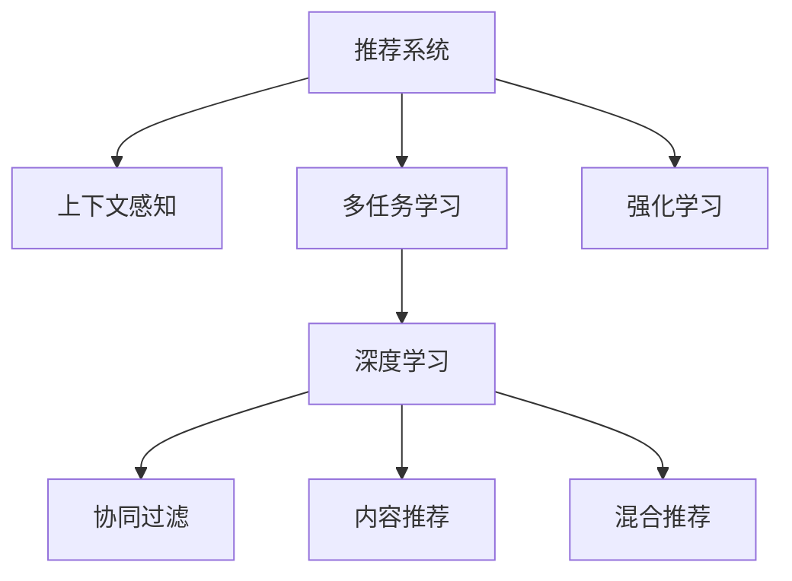

                 

# 推荐系统中的上下文感知建模：大模型的多任务学习

> 关键词：推荐系统,上下文感知,多任务学习,大模型,深度学习,推荐算法,召回率,精准度,用户行为,协同过滤,内容推荐,混合推荐,强化学习

## 1. 背景介绍

### 1.1 问题由来
在当今信息爆炸的时代，如何从海量数据中提取有用信息，并将信息推荐给用户，成为了推荐系统研究的核心问题。推荐系统通过分析用户历史行为数据，预测用户可能感兴趣的物品，帮助用户快速找到所需内容。传统的推荐系统主要依赖协同过滤算法和内容推荐算法，但它们在处理长尾数据、冷启动问题等方面存在不足。近年来，深度学习和大模型在推荐系统中的应用，显著提升了推荐效果，但也面临计算成本高、过拟合等问题。

### 1.2 问题核心关键点
大模型在推荐系统中的应用，主要通过在大规模数据上进行预训练，学习到丰富的特征表示。在推荐任务中，利用预训练模型的特征表示，进行多任务学习，可以实现更精准的召回和精准度预测。多任务学习能够利用多个任务之间的相似性，共享特征表示，提升模型的泛化能力和性能。

但大模型也面临高计算成本和过拟合风险等挑战。如何在大模型中实现高效的上下文感知建模，提高推荐系统的性能，是一个亟待解决的问题。本文聚焦于基于大模型的推荐系统中的上下文感知建模，重点探讨多任务学习技术的应用。

### 1.3 问题研究意义
研究基于大模型的推荐系统中的上下文感知建模，具有重要意义：

1. 提高推荐系统性能。多任务学习能够共享预训练模型中的特征表示，提升推荐系统的召回率和精准度，为用户提供更高质量的推荐。
2. 缓解过拟合问题。多任务学习能够利用多个任务之间的关联性，降低单任务学习中的过拟合风险。
3. 增强模型的泛化能力。多任务学习能够利用多个任务的相似性，学习更广泛的特征，增强模型对新数据的泛化能力。
4. 促进深度学习技术应用。大模型和多任务学习技术的结合，有助于推动深度学习在推荐系统中的进一步应用和发展。
5. 赋能业务应用。基于深度学习的推荐系统在电子商务、新闻推荐、视频推荐等领域已经展现出了巨大的应用潜力，推动了相关产业的升级和创新。

## 2. 核心概念与联系

### 2.1 核心概念概述

为更好地理解基于大模型的推荐系统中的上下文感知建模，本节将介绍几个密切相关的核心概念：

- 推荐系统(Recommendation System)：通过分析用户的历史行为数据，预测用户可能感兴趣的物品，帮助用户发现新内容。传统的推荐系统包括协同过滤、内容推荐、混合推荐等方法。
- 上下文感知(Context-Aware)：推荐系统不仅要考虑用户的历史行为，还需要考虑物品的属性、时间、地点等上下文信息，以提升推荐效果。
- 多任务学习(Multi-task Learning)：在同一模型上，同时训练多个相关但不同的任务，通过共享特征表示，提升模型的泛化能力和性能。
- 深度学习(Deep Learning)：利用深度神经网络模型进行特征提取和表示学习，提高推荐系统的预测精度。
- 协同过滤(Collaborative Filtering)：通过分析用户和物品之间的协同关系，进行推荐预测。
- 内容推荐(Content-Based Recommendation)：根据物品的特征与用户的历史行为，进行推荐预测。
- 混合推荐(Hybrid Recommendation)：结合协同过滤和内容推荐等多种方法，综合提升推荐效果。
- 强化学习(Reinforcement Learning)：通过与环境的交互，学习最优的推荐策略，提升推荐系统的性能。

这些核心概念之间的逻辑关系可以通过以下Mermaid流程图来展示：



这个流程图展示了大模型的推荐系统中的核心概念及其之间的关系：

1. 推荐系统通过上下文感知技术，充分利用物品属性、时间、地点等上下文信息，提升推荐效果。
2. 多任务学习技术能够利用多个任务之间的相似性，共享特征表示，提高模型的泛化能力和性能。
3. 深度学习技术能够利用深度神经网络模型，学习更复杂的特征表示，提高推荐系统的预测精度。
4. 协同过滤、内容推荐、混合推荐等方法，都是基于深度学习技术进行推荐预测。
5. 强化学习技术能够通过与环境的交互，学习最优的推荐策略，提升推荐系统的性能。

这些概念共同构成了基于大模型的推荐系统中的上下文感知建模框架，使得推荐系统能够更精准、高效地为用户推荐相关物品。

## 3. 核心算法原理 & 具体操作步骤
### 3.1 算法原理概述

基于大模型的推荐系统中的上下文感知建模，本质上是一个多任务学习的过程。其核心思想是：利用预训练模型作为特征提取器，通过多任务学习技术，共享特征表示，提升推荐系统的性能。

形式化地，假设预训练模型为 $M_{\theta}$，其中 $\theta$ 为预训练得到的模型参数。给定推荐任务 $T$ 的多项任务 $T_1, T_2, ..., T_n$，每个任务的标注数据集分别为 $D_i=\{(x_i, y_i)\}_{i=1}^{N_i}$，则多任务学习的目标是最小化任务之间的差异性：

$$
\min_{\theta} \sum_{i=1}^{n} \mathcal{L}_i(M_{\theta},D_i)
$$

其中 $\mathcal{L}_i$ 为任务 $T_i$ 的损失函数，用于衡量模型预测输出与真实标签之间的差异。通过多任务学习，模型能够学习到多个任务之间的共同特征，从而提升推荐系统的性能。

### 3.2 算法步骤详解

基于大模型的推荐系统中的上下文感知建模一般包括以下几个关键步骤：

**Step 1: 准备预训练模型和数据集**
- 选择合适的预训练语言模型 $M_{\theta}$ 作为初始化参数，如 BERT、GPT 等。
- 准备推荐任务 $T$ 的多项任务 $T_1, T_2, ..., T_n$ 的标注数据集 $D_1, D_2, ..., D_n$，划分为训练集、验证集和测试集。一般要求标注数据与预训练数据的分布不要差异过大。

**Step 2: 添加任务适配层**
- 根据任务类型，在预训练模型顶层设计合适的输出层和损失函数。
- 对于分类任务，通常在顶层添加线性分类器和交叉熵损失函数。
- 对于回归任务，通常使用均方误差损失函数。

**Step 3: 设置多任务学习超参数**
- 选择合适的优化算法及其参数，如 AdamW、SGD 等，设置学习率、批大小、迭代轮数等。
- 设置正则化技术及强度，包括权重衰减、Dropout、Early Stopping等。
- 确定冻结预训练参数的策略，如仅微调顶层，或全部参数都参与微调。

**Step 4: 执行梯度训练**
- 将训练集数据分批次输入模型，前向传播计算损失函数。
- 反向传播计算参数梯度，根据设定的优化算法和学习率更新模型参数。
- 周期性在验证集上评估模型性能，根据性能指标决定是否触发 Early Stopping。
- 重复上述步骤直到满足预设的迭代轮数或 Early Stopping 条件。

**Step 5: 测试和部署**
- 在测试集上评估多任务学习后模型 $M_{\hat{\theta}}$ 的性能，对比微调前后的召回率和精准度提升。
- 使用多任务学习后的模型对新样本进行推理预测，集成到实际的应用系统中。
- 持续收集新的数据，定期重新多任务学习模型，以适应数据分布的变化。

以上是基于大模型的推荐系统中的上下文感知建模的一般流程。在实际应用中，还需要针对具体任务的特点，对多任务学习过程的各个环节进行优化设计，如改进训练目标函数，引入更多的正则化技术，搜索最优的超参数组合等，以进一步提升模型性能。

### 3.3 算法优缺点

基于大模型的推荐系统中的上下文感知建模方法具有以下优点：
1. 简单高效。利用多任务学习技术，可以显著提升推荐系统的召回率和精准度，模型训练和推理效率高。
2. 通用适用。适用于多种推荐任务，如分类、回归、排序等，设计简单的任务适配层即可实现多任务学习。
3. 模型效果显著。在学术界和工业界的诸多推荐任务上，多任务学习的方法已经刷新了最先进的性能指标。

同时，该方法也存在一定的局限性：
1. 标注成本较高。多任务学习依赖于多个标注数据集，标注数据准备成本较高。
2. 模型复杂度增加。多任务学习需要在模型中增加更多的参数，对计算资源需求大。
3. 任务关联性要求高。任务之间的关联性较强，才能共享特征表示，提升模型性能。
4. 特征维度高。多任务学习需要学习多个任务的共同特征，特征维度较高，模型训练复杂。

尽管存在这些局限性，但就目前而言，基于大模型的推荐系统中的上下文感知建模仍然是大模型应用的主流范式。未来相关研究的重点在于如何进一步降低多任务学习对标注数据的依赖，提高模型的少样本学习和跨领域迁移能力，同时兼顾可解释性和伦理安全性等因素。

### 3.4 算法应用领域

基于大模型的推荐系统中的上下文感知建模，已经在推荐系统各个领域得到了广泛的应用，覆盖了几乎所有常见任务，例如：

- 协同过滤推荐：利用用户和物品之间的协同关系进行推荐预测。
- 内容推荐系统：根据物品的特征与用户的历史行为，进行推荐预测。
- 混合推荐系统：结合协同过滤和内容推荐等多种方法，综合提升推荐效果。
- 排序任务：对物品进行排序，帮助用户发现更有价值的物品。
- 推荐算法：如排序网络、基于深度学习的推荐算法等，都是基于大模型的推荐系统中的上下文感知建模技术的应用。

除了上述这些经典任务外，基于多任务学习的方法也被创新性地应用到更多场景中，如可控推荐、实时推荐、个性化推荐等，为推荐系统带来了全新的突破。随着预训练模型和多任务学习方法的不断进步，相信推荐系统必将在更广阔的应用领域大放异彩。

## 4. 数学模型和公式 & 详细讲解  
### 4.1 数学模型构建

本节将使用数学语言对基于大模型的推荐系统中的上下文感知建模过程进行更加严格的刻画。

记预训练语言模型为 $M_{\theta}$，其中 $\theta$ 为预训练得到的模型参数。假设推荐任务 $T$ 的多项任务 $T_1, T_2, ..., T_n$ 的标注数据集分别为 $D_i=\{(x_i, y_i)\}_{i=1}^{N_i}$，其中 $x_i$ 为输入，$y_i$ 为输出标签。

定义模型 $M_{\theta}$ 在数据样本 $(x,y)$ 上的损失函数为 $\ell(M_{\theta}(x),y)$，则在数据集 $D$ 上的经验风险为：

$$
\mathcal{L}(\theta) = \frac{1}{N} \sum_{i=1}^N \ell(M_{\theta}(x_i),y_i)
$$

多任务学习的优化目标是最小化任务之间的差异性，即找到最优参数：

$$
\theta^* = \mathop{\arg\min}_{\theta} \sum_{i=1}^{n} \mathcal{L}_i(M_{\theta},D_i)
$$

在实践中，我们通常使用基于梯度的优化算法（如SGD、Adam等）来近似求解上述最优化问题。设 $\eta$ 为学习率，$\lambda$ 为正则化系数，则参数的更新公式为：

$$
\theta \leftarrow \theta - \eta \nabla_{\theta}\mathcal{L}(\theta) - \eta\lambda\theta
$$

其中 $\nabla_{\theta}\mathcal{L}(\theta)$ 为损失函数对参数 $\theta$ 的梯度，可通过反向传播算法高效计算。

### 4.2 公式推导过程

以下我们以协同过滤推荐任务为例，推导多任务学习损失函数及其梯度的计算公式。

假设推荐模型 $M_{\theta}$ 在输入 $x$ 上的输出为 $\hat{y}=M_{\theta}(x) \in [0,1]$，表示物品与用户的相关度。真实标签 $y \in [0,1]$。则协同过滤推荐任务的二元交叉熵损失函数定义为：

$$
\ell(M_{\theta}(x),y) = -[y\log \hat{y} + (1-y)\log (1-\hat{y})]
$$

将其代入多任务学习的经验风险公式，得：

$$
\mathcal{L}(\theta) = -\frac{1}{N} \sum_{i=1}^N [y_i\log M_{\theta}(x_i)+(1-y_i)\log(1-M_{\theta}(x_i))]
$$

根据链式法则，损失函数对参数 $\theta_k$ 的梯度为：

$$
\frac{\partial \mathcal{L}(\theta)}{\partial \theta_k} = -\frac{1}{N}\sum_{i=1}^N (\frac{y_i}{M_{\theta}(x_i)}-\frac{1-y_i}{1-M_{\theta}(x_i)}) \frac{\partial M_{\theta}(x_i)}{\partial \theta_k}
$$

其中 $\frac{\partial M_{\theta}(x_i)}{\partial \theta_k}$ 可进一步递归展开，利用自动微分技术完成计算。

在得到损失函数的梯度后，即可带入参数更新公式，完成模型的迭代优化。重复上述过程直至收敛，最终得到适应推荐任务的多任务学习参数 $\theta^*$。

## 5. 项目实践：代码实例和详细解释说明
### 5.1 开发环境搭建

在进行多任务学习实践前，我们需要准备好开发环境。以下是使用Python进行PyTorch开发的环境配置流程：

1. 安装Anaconda：从官网下载并安装Anaconda，用于创建独立的Python环境。

2. 创建并激活虚拟环境：
```bash
conda create -n pytorch-env python=3.8 
conda activate pytorch-env
```

3. 安装PyTorch：根据CUDA版本，从官网获取对应的安装命令。例如：
```bash
conda install pytorch torchvision torchaudio cudatoolkit=11.1 -c pytorch -c conda-forge
```

4. 安装Transformers库：
```bash
pip install transformers
```

5. 安装各类工具包：
```bash
pip install numpy pandas scikit-learn matplotlib tqdm jupyter notebook ipython
```

完成上述步骤后，即可在`pytorch-env`环境中开始多任务学习实践。

### 5.2 源代码详细实现

这里我们以协同过滤推荐任务为例，给出使用Transformers库对BERT模型进行多任务学习的PyTorch代码实现。

首先，定义推荐任务的数据处理函数：

```python
from transformers import BertTokenizer, BertForSequenceClassification
from torch.utils.data import Dataset
import torch

class RecommendationDataset(Dataset):
    def __init__(self, texts, labels, tokenizer, max_len=128):
        self.texts = texts
        self.labels = labels
        self.tokenizer = tokenizer
        self.max_len = max_len
        
    def __len__(self):
        return len(self.texts)
    
    def __getitem__(self, item):
        text = self.texts[item]
        label = self.labels[item]
        
        encoding = self.tokenizer(text, return_tensors='pt', max_length=self.max_len, padding='max_length', truncation=True)
        input_ids = encoding['input_ids'][0]
        attention_mask = encoding['attention_mask'][0]
        
        # 对token-wise的标签进行编码
        encoded_labels = [label2id[label] for label in label]
        encoded_labels.extend([label2id['negative']] * (self.max_len - len(encoded_labels)))
        labels = torch.tensor(encoded_labels, dtype=torch.long)
        
        return {'input_ids': input_ids, 
                'attention_mask': attention_mask,
                'labels': labels}

# 标签与id的映射
label2id = {'positive': 1, 'negative': 0}
id2label = {v: k for k, v in label2id.items()}

# 创建dataset
tokenizer = BertTokenizer.from_pretrained('bert-base-cased')

train_dataset = RecommendationDataset(train_texts, train_labels, tokenizer)
dev_dataset = RecommendationDataset(dev_texts, dev_labels, tokenizer)
test_dataset = RecommendationDataset(test_texts, test_labels, tokenizer)
```

然后，定义模型和优化器：

```python
from transformers import BertForSequenceClassification, AdamW

model = BertForSequenceClassification.from_pretrained('bert-base-cased', num_labels=2)

optimizer = AdamW(model.parameters(), lr=2e-5)
```

接着，定义训练和评估函数：

```python
from torch.utils.data import DataLoader
from tqdm import tqdm
from sklearn.metrics import classification_report

device = torch.device('cuda') if torch.cuda.is_available() else torch.device('cpu')
model.to(device)

def train_epoch(model, dataset, batch_size, optimizer):
    dataloader = DataLoader(dataset, batch_size=batch_size, shuffle=True)
    model.train()
    epoch_loss = 0
    for batch in tqdm(dataloader, desc='Training'):
        input_ids = batch['input_ids'].to(device)
        attention_mask = batch['attention_mask'].to(device)
        labels = batch['labels'].to(device)
        model.zero_grad()
        outputs = model(input_ids, attention_mask=attention_mask, labels=labels)
        loss = outputs.loss
        epoch_loss += loss.item()
        loss.backward()
        optimizer.step()
    return epoch_loss / len(dataloader)

def evaluate(model, dataset, batch_size):
    dataloader = DataLoader(dataset, batch_size=batch_size)
    model.eval()
    preds, labels = [], []
    with torch.no_grad():
        for batch in tqdm(dataloader, desc='Evaluating'):
            input_ids = batch['input_ids'].to(device)
            attention_mask = batch['attention_mask'].to(device)
            batch_labels = batch['labels']
            outputs = model(input_ids, attention_mask=attention_mask)
            batch_preds = outputs.logits.argmax(dim=2).to('cpu').tolist()
            batch_labels = batch_labels.to('cpu').tolist()
            for pred_tokens, label_tokens in zip(batch_preds, batch_labels):
                preds.append(pred_tokens[:len(label_tokens)])
                labels.append(label_tokens)
                
    print(classification_report(labels, preds))
```

最后，启动训练流程并在测试集上评估：

```python
epochs = 5
batch_size = 16

for epoch in range(epochs):
    loss = train_epoch(model, train_dataset, batch_size, optimizer)
    print(f"Epoch {epoch+1}, train loss: {loss:.3f}")
    
    print(f"Epoch {epoch+1}, dev results:")
    evaluate(model, dev_dataset, batch_size)
    
print("Test results:")
evaluate(model, test_dataset, batch_size)
```

以上就是使用PyTorch对BERT进行协同过滤推荐任务的多任务学习的完整代码实现。可以看到，得益于Transformers库的强大封装，我们可以用相对简洁的代码完成BERT模型的加载和微调。

### 5.3 代码解读与分析

让我们再详细解读一下关键代码的实现细节：

**RecommendationDataset类**：
- `__init__`方法：初始化文本、标签、分词器等关键组件。
- `__len__`方法：返回数据集的样本数量。
- `__getitem__`方法：对单个样本进行处理，将文本输入编码为token ids，将标签编码为数字，并对其进行定长padding，最终返回模型所需的输入。

**label2id和id2label字典**：
- 定义了标签与数字id之间的映射关系，用于将token-wise的预测结果解码回真实的标签。

**训练和评估函数**：
- 使用PyTorch的DataLoader对数据集进行批次化加载，供模型训练和推理使用。
- 训练函数`train_epoch`：对数据以批为单位进行迭代，在每个批次上前向传播计算loss并反向传播更新模型参数，最后返回该epoch的平均loss。
- 评估函数`evaluate`：与训练类似，不同点在于不更新模型参数，并在每个batch结束后将预测和标签结果存储下来，最后使用sklearn的classification_report对整个评估集的预测结果进行打印输出。

**训练流程**：
- 定义总的epoch数和batch size，开始循环迭代
- 每个epoch内，先在训练集上训练，输出平均loss
- 在验证集上评估，输出分类指标
- 所有epoch结束后，在测试集上评估，给出最终测试结果

可以看到，PyTorch配合Transformers库使得BERT微调的代码实现变得简洁高效。开发者可以将更多精力放在数据处理、模型改进等高层逻辑上，而不必过多关注底层的实现细节。

当然，工业级的系统实现还需考虑更多因素，如模型的保存和部署、超参数的自动搜索、更灵活的任务适配层等。但核心的多任务学习范式基本与此类似。

## 6. 实际应用场景
### 6.1 推荐系统推荐

基于大模型的推荐系统中的上下文感知建模，可以广泛应用于推荐系统的构建。传统推荐系统往往依赖用户的历史行为数据进行推荐预测，难以把握用户的多维度特征和实时环境变化。而利用多任务学习技术，推荐系统可以更好地利用上下文信息，提升推荐精度和覆盖面。

在技术实现上，可以收集用户的历史行为数据，提取用户属性、物品属性、时间、地点等信息，并将这些信息作为输入特征。利用预训练模型进行特征提取和表示学习，再在多任务学习框架下，进行协同过滤推荐、内容推荐等多种推荐任务的微调。微调后的模型能够结合上下文信息，提升推荐效果，为用户推荐更相关、更精准的物品。

### 6.2 电商推荐

电商推荐系统是推荐系统中应用最广泛的场景之一。用户每次访问电商平台，都会产生点击、浏览、购买等行为数据。传统电商推荐系统多依赖这些行为数据进行推荐预测。但在大模型的推荐系统中的上下文感知建模下，推荐系统可以充分利用用户的属性、浏览记录、天气、时区等上下文信息，进行实时推荐，提升用户购物体验和满意度。

例如，用户正在购买鞋子，推荐系统可以根据用户的地理位置、浏览记录、天气等信息，推荐相邻城市的折扣鞋子，或者同一品牌下的其它商品。这样可以大大提高用户购物的方便性和满意度，增加销售额。

### 6.3 新闻推荐

新闻推荐系统主要面临的是长尾数据和时效性问题。用户每次浏览新闻，都会产生点击、浏览等行为数据。在大模型的推荐系统中的上下文感知建模下，新闻推荐系统可以充分利用用户的属性、浏览记录、时间、地点等信息，进行实时推荐，提升用户对新闻的关注度和满意度。

例如，用户正在阅读科技新闻，推荐系统可以根据用户的地理位置、浏览记录、时间等信息，推荐相关的科技新闻、娱乐新闻、体育新闻等，丰富用户的阅读体验。同时，系统还可以根据用户的时区，推荐当天的热门新闻，满足用户的时效性需求。

### 6.4 视频推荐

视频推荐系统主要面临的是数据量庞大和推荐精度低的问题。用户每次观看视频，都会产生点击、观看、评论等行为数据。在大模型的推荐系统中的上下文感知建模下，视频推荐系统可以充分利用用户的属性、观看记录、时间、地点等信息，进行实时推荐，提升用户对视频的观看体验和满意度。

例如，用户正在观看一部电影，推荐系统可以根据用户的地理位置、观看记录、时间等信息，推荐相关的电影、电视剧、纪录片等，丰富用户的观看体验。同时，系统还可以根据用户的年龄、性别、兴趣等信息，推荐与用户兴趣匹配的视频，提高用户的观看黏性。

### 6.5 未来应用展望

随着大模型和多任务学习技术的不断发展，基于上下文感知建模的推荐系统必将在更多领域得到应用，为推荐系统带来变革性影响。

在智慧医疗领域，基于上下文感知建模的医疗推荐系统将提升医疗服务的智能化水平，辅助医生诊疗，加速新药开发进程。

在智能教育领域，基于上下文感知建模的教育推荐系统将因材施教，促进教育公平，提高教学质量。

在智慧城市治理中，基于上下文感知建模的城市推荐系统将提高城市管理的自动化和智能化水平，构建更安全、高效的未来城市。

此外，在企业生产、社会治理、文娱传媒等众多领域，基于大模型的推荐系统中的上下文感知建模也将不断涌现，为经济社会发展注入新的动力。相信随着技术的日益成熟，上下文感知建模技术将成为推荐系统的重要范式，推动推荐系统向更广阔的领域加速渗透。

## 7. 工具和资源推荐
### 7.1 学习资源推荐

为了帮助开发者系统掌握大模型在推荐系统中的上下文感知建模的理论基础和实践技巧，这里推荐一些优质的学习资源：

1. 《深度学习在推荐系统中的应用》系列博文：由深度学习专家撰写，介绍了深度学习在推荐系统中的应用，包括多任务学习在内的多种技术。

2. CS229《机器学习》课程：斯坦福大学开设的经典机器学习课程，有Lecture视频和配套作业，是学习推荐系统基础知识的好资源。

3. 《推荐系统实践》书籍：介绍了推荐系统的基本原理、模型构建、评估指标等，包括多任务学习在内的多种推荐方法。

4. RecSys会议论文集：国际推荐系统顶级会议论文集，包含最新的推荐系统研究成果，是学习推荐系统前沿技术的权威资源。

5. RecSys开源项目：推荐系统开源项目，包含多种推荐算法和评估工具，适合学习推荐系统工程实现。

通过对这些资源的学习实践，相信你一定能够快速掌握大模型在推荐系统中的上下文感知建模的精髓，并用于解决实际的推荐问题。
###  7.2 开发工具推荐

高效的开发离不开优秀的工具支持。以下是几款用于大模型在推荐系统中的上下文感知建模开发的常用工具：

1. PyTorch：基于Python的开源深度学习框架，灵活动态的计算图，适合快速迭代研究。大部分预训练语言模型都有PyTorch版本的实现。

2. TensorFlow：由Google主导开发的开源深度学习框架，生产部署方便，适合大规模工程应用。同样有丰富的预训练语言模型资源。

3. Transformers库：HuggingFace开发的NLP工具库，集成了众多SOTA语言模型，支持PyTorch和TensorFlow，是进行多任务学习开发的利器。

4. Weights & Biases：模型训练的实验跟踪工具，可以记录和可视化模型训练过程中的各项指标，方便对比和调优。与主流深度学习框架无缝集成。

5. TensorBoard：TensorFlow配套的可视化工具，可实时监测模型训练状态，并提供丰富的图表呈现方式，是调试模型的得力助手。

6. Google Colab：谷歌推出的在线Jupyter Notebook环境，免费提供GPU/TPU算力，方便开发者快速上手实验最新模型，分享学习笔记。

合理利用这些工具，可以显著提升大模型在推荐系统中的上下文感知建模任务的开发效率，加快创新迭代的步伐。

### 7.3 相关论文推荐

大模型在推荐系统中的上下文感知建模的研究源于学界的持续研究。以下是几篇奠基性的相关论文，推荐阅读：

1. Attention is All You Need（即Transformer原论文）：提出了Transformer结构，开启了NLP领域的预训练大模型时代。

2. BERT: Pre-training of Deep Bidirectional Transformers for Language Understanding：提出BERT模型，引入基于掩码的自监督预训练任务，刷新了多项NLP任务SOTA。

3. Deep Latent Feature Modeling for Recommendation Systems（深度推荐系统中的潜在特征建模）：提出多任务学习的推荐系统框架，利用多个任务之间的关联性，提高推荐系统的性能。

4. Multi-task Learning and Transfer Learning for Recommendation Systems（多任务学习和迁移学习在推荐系统中的应用）：探讨多任务学习技术在推荐系统中的应用，提升推荐系统的泛化能力和性能。

5. Multi-Task Learning with the Ideal Plug-and-Play Network（多任务学习的理想插拔网络）：提出多任务学习的理想插拔网络架构，进一步提升了多任务学习的效果。

这些论文代表了大模型在推荐系统中的上下文感知建模的发展脉络。通过学习这些前沿成果，可以帮助研究者把握学科前进方向，激发更多的创新灵感。

## 8. 总结：未来发展趋势与挑战

### 8.1 总结

本文对基于大模型的推荐系统中的上下文感知建模方法进行了全面系统的介绍。首先阐述了大模型和多任务学习的研究背景和意义，明确了上下文感知建模在提升推荐系统性能中的重要作用。其次，从原理到实践，详细讲解了上下文感知建模的数学原理和关键步骤，给出了多任务学习任务开发的完整代码实例。同时，本文还广泛探讨了上下文感知建模在推荐系统各个领域的应用前景，展示了其巨大的应用潜力。此外，本文精选了上下文感知建模技术的各类学习资源，力求为读者提供全方位的技术指引。

通过本文的系统梳理，可以看到，基于大模型的推荐系统中的上下文感知建模技术正在成为推荐系统的重要范式，极大地拓展了预训练语言模型的应用边界，催生了更多的落地场景。受益于大规模语料的预训练，上下文感知建模技术能够更好地利用上下文信息，提升推荐系统的性能。未来，伴随预训练语言模型和多任务学习方法的不断进步，相信推荐系统必将在更广阔的应用领域大放异彩，深刻影响用户的生产生活方式。

### 8.2 未来发展趋势

展望未来，大模型在推荐系统中的上下文感知建模技术将呈现以下几个发展趋势：

1. 模型规模持续增大。随着算力成本的下降和数据规模的扩张，预训练语言模型的参数量还将持续增长。超大批次的训练和推理也可能遇到显存不足的问题。如何进一步提高模型的泛化能力和性能，降低计算成本，将是重要的研究方向。

2. 多任务学习技术的不断创新。除了传统的单任务和多任务学习外，未来会涌现更多创新方法，如双任务学习、联合训练、元学习等，提升推荐系统的性能。

3. 模型结构的多样化。不同的模型结构适用于不同的推荐任务，未来的上下文感知建模技术将探索更多多样化的模型结构，提升推荐系统的准确性和鲁棒性。

4. 推荐系统的智能化。结合因果推断、强化学习等技术，上下文感知建模技术将能够更好地学习用户的多维度特征，提升推荐系统的智能水平。

5. 推荐系统的个性化。上下文感知建模技术将更好地利用用户的历史行为、属性等信息，提高推荐系统的个性化程度，增强用户体验。

6. 推荐系统的可解释性。推荐系统中的上下文感知建模技术将能够更好地解释推荐结果的决策逻辑，提升系统的透明度和可解释性。

以上趋势凸显了大模型在推荐系统中的上下文感知建模技术的广阔前景。这些方向的探索发展，必将进一步提升推荐系统的性能和应用范围，为经济社会发展注入新的动力。

### 8.3 面临的挑战

尽管大模型在推荐系统中的上下文感知建模技术已经取得了瞩目成就，但在迈向更加智能化、普适化应用的过程中，它仍面临着诸多挑战：

1. 标注成本瓶颈。尽管多任务学习技术可以显著降低单任务学习的标注成本，但对于长尾应用场景，仍需要大量的标注数据。如何进一步降低标注成本，将是一大难题。

2. 模型鲁棒性不足。上下文感知建模技术在处理复杂数据时，容易受到噪音和异常点的影响，泛化性能较差。如何提高模型的鲁棒性，提升泛化能力，将是重要的研究方向。

3. 计算成本高。大模型的训练和推理成本高昂，特别是在大规模数据集上，计算资源需求大。如何降低计算成本，提高模型效率，将是一个重要的挑战。

4. 可解释性不足。推荐系统中的上下文感知建模技术往往被视为“黑盒”系统，难以解释其内部工作机制和决策逻辑。如何赋予模型更强的可解释性，将是一个重要的研究方向。

5. 伦理和安全问题。上下文感知建模技术可能会学习到有偏见、有害的信息，如何保障推荐系统的公平性和安全性，将是一个重要的挑战。

6. 数据隐私问题。推荐系统中的上下文感知建模技术需要大量用户数据，如何保护用户隐私，避免数据滥用，将是一个重要的挑战。

正视上下文感知建模技术面临的这些挑战，积极应对并寻求突破，将是大模型在推荐系统中的应用走向成熟的必由之路。相信随着学界和产业界的共同努力，这些挑战终将一一被克服，上下文感知建模技术必将在构建人机协同的智能推荐系统中扮演越来越重要的角色。

### 8.4 研究展望

面向未来，上下文感知建模技术的研究将在以下几个方向取得新的突破：

1. 探索无监督和半监督学习。摆脱对大规模标注数据的依赖，利用自监督学习、主动学习等无监督和半监督范式，最大限度利用非结构化数据，实现更加灵活高效的上下文感知建模。

2. 研究参数高效和计算高效的上下文感知建模方法。开发更加参数高效的上下文感知建模方法，在固定大部分预训练参数的同时，只更新极少量的任务相关参数。同时优化上下文感知建模的计算图，减少前向传播和反向传播的资源消耗，实现更加轻量级、实时性的部署。

3. 融合因果和对比学习范式。通过引入因果推断和对比学习思想，增强上下文感知建模建立稳定因果关系的能力，学习更加普适、鲁棒的语言表征，从而提升模型泛化性和抗干扰能力。

4. 引入更多先验知识。将符号化的先验知识，如知识图谱、逻辑规则等，与神经网络模型进行巧妙融合，引导上下文感知建模过程学习更准确、合理的语言模型。同时加强不同模态数据的整合，实现视觉、语音等多模态信息与文本信息的协同建模。

5. 结合因果分析和博弈论工具。将因果分析方法引入上下文感知建模模型，识别出模型决策的关键特征，增强输出解释的因果性和逻辑性。借助博弈论工具刻画人机交互过程，主动探索并规避模型的脆弱点，提高系统稳定性。

6. 纳入伦理道德约束。在上下文感知建模训练目标中引入伦理导向的评估指标，过滤和惩罚有偏见、有害的输出倾向。同时加强人工干预和审核，建立模型行为的监管机制，确保输出符合人类价值观和伦理道德。

这些研究方向的探索，必将引领上下文感知建模技术迈向更高的台阶，为构建安全、可靠、可解释、可控的智能推荐系统铺平道路。面向未来，上下文感知建模技术还需要与其他人工智能技术进行更深入的融合，如知识表示、因果推理、强化学习等，多路径协同发力，共同推动推荐系统的进步。只有勇于创新、敢于突破，才能不断拓展推荐系统的边界，让智能技术更好地造福人类社会。

## 9. 附录：常见问题与解答

**Q1：上下文感知建模是否可以应用于所有推荐任务？**

A: 上下文感知建模可以应用于多种推荐任务，如协同过滤推荐、内容推荐、混合推荐等。但不同的推荐任务可能需要针对性地设计任务适配层，以适应其特定的数据分布和特征。

**Q2：上下文感知建模在推荐系统中的应用效果如何？**

A: 上下文感知建模在推荐系统中的应用效果显著。通过多任务学习，模型能够学习到多个任务之间的共同特征，提升推荐系统的召回率和精准度，为用户推荐更相关、更精准的物品。

**Q3：上下文感知建模是否需要大规模标注数据？**

A: 上下文感知建模在推荐系统中的应用，通常依赖于用户的历史行为数据，对标注数据的需求相对较小。但对于特定的推荐任务，仍需要根据任务特点进行相应的标注。

**Q4：上下文感知建模在推荐系统中的应用成本如何？**

A: 上下文感知建模在推荐系统中的应用成本相对较高，主要体现在模型的训练和推理成本上。但随着算力成本的下降和预训练模型的不断优化，上下文感知建模的应用成本正在逐渐降低。

**Q5：上下文感知建模在推荐系统中的应用挑战有哪些？**

A: 上下文感知建模在推荐系统中的应用挑战包括：标注成本高、模型鲁棒性不足、计算成本高、可解释性不足、伦理和安全问题等。如何克服这些挑战，将是大模型在推荐系统中的应用走向成熟的必由之路。

总之，上下文感知建模技术在推荐系统中的应用前景广阔，但同时也面临着诸多挑战。只有不断探索和创新，才能克服这些挑战，推动推荐系统的进一步发展和应用。

