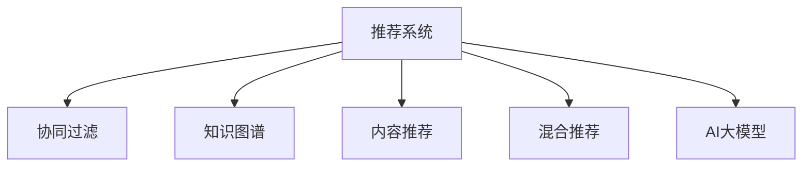

                 

# 推荐系统中的冷启动问题：AI大模型解决方案

## 1. 背景介绍

### 1.1 问题由来

推荐系统是互联网公司提供个性化服务的重要工具，旨在通过分析用户行为，推荐满足其需求的物品。然而，推荐系统的核心挑战之一是冷启动问题。冷启动指新用户或新物品加入推荐系统时，由于缺乏历史数据，推荐算法无法为其生成精准的推荐。面对冷启动，传统的推荐系统往往难以有效发挥作用。

在推荐系统的初期发展阶段，由于用户和物品规模较小，大部分推荐算法可以依靠业务规则和人工干预实现较好的效果。但随着平台规模的快速扩大，依靠规则和人工干预难以维持推荐系统的个性化程度和准确性。如何更高效地解决冷启动问题，成为推荐系统研究的重点。

### 1.2 问题核心关键点

推荐系统中的冷启动问题核心在于：

- 新用户的初始化：对于新加入平台的用户，推荐系统需要根据其已有的少量行为数据或背景信息，预测其可能的兴趣，生成推荐。
- 新物品的打标签：对于新上架的物品，推荐系统需要根据用户的历史反馈数据或物品的特征，预测其受欢迎程度，决定是否推荐。
- 冷启动特征的提取：推荐系统需要从用户行为、物品特征、交互数据等来源中，提取出能够刻画用户兴趣和物品价值的特征，作为推荐依据。

为解决冷启动问题，推荐系统采用了多种技术手段，包括协同过滤、内容推荐、知识图谱、混合推荐等。其中，近年来AI大模型的应用，为冷启动问题的解决带来了新的突破。

## 2. 核心概念与联系

### 2.1 核心概念概述

为更好地理解AI大模型在推荐系统中的应用，本节将介绍几个密切相关的核心概念：

- 推荐系统：利用用户行为和物品属性信息，为用户推荐物品的系统。
- 协同过滤：基于用户行为相似性或物品属性相似性，通过聚类或关联规则，推荐相似用户或物品的系统。
- 知识图谱：通过实体和关系，刻画用户、物品、行为等要素之间关系的图结构，用于提高推荐模型的准确性。
- 混合推荐：将协同过滤、内容推荐、知识图谱等多种推荐方法进行组合，提升推荐系统的综合性能。
- AI大模型：基于大规模深度学习模型构建的通用模型，具备强大的表示学习能力和泛化能力，可以应用于推荐系统等多个领域。

这些核心概念之间的逻辑关系可以通过以下Mermaid流程图来展示：



这个流程图展示推荐系统中的核心概念及其之间的关系：

1. 推荐系统是各个推荐方法的综合应用平台，包含协同过滤、知识图谱、内容推荐、AI大模型等多种技术手段。
2. 协同过滤利用用户行为或物品属性的相似性，推荐相似用户或物品。
3. 知识图谱通过刻画实体和关系的图结构，提升推荐模型的准确性。
4. 内容推荐根据物品的属性特征，推荐与用户兴趣相匹配的物品。
5. AI大模型利用预训练能力，学习复杂的用户和物品表示，提升推荐系统的性能。

这些概念共同构成了推荐系统的技术框架，使得推荐系统能够基于用户行为、物品属性等多维数据进行高效推荐。

## 3. 核心算法原理 & 具体操作步骤
### 3.1 算法原理概述

AI大模型在推荐系统中的应用，本质上是基于其强大的表示学习能力和泛化能力，通过预训练和微调，学习到用户和物品的表示，提升推荐模型的效果。其核心思想是：

1. 在预训练阶段，大模型通过大规模数据学习通用的用户和物品表示。
2. 在微调阶段，针对推荐任务，优化模型的参数，使其学习到特定用户的兴趣和特定物品的属性，生成推荐。

假设推荐系统中共有 $U$ 个用户，$I$ 个物品，则用户与物品之间的关系可以表示为 $X \in \mathbb{R}^{U \times d}$，其中 $d$ 为大模型的维度。推荐系统的工作目标是通过 $X$ 预测用户 $u$ 对物品 $i$ 的评分 $y_{ui}$，即：

$$
\hat{y}_{ui} = \text{Model}(X_u, X_i)
$$

其中 $\text{Model}$ 为推荐模型的函数。

在微调过程中，推荐模型通过优化损失函数 $\mathcal{L}$，不断调整模型参数 $\theta$，使得预测结果 $\hat{y}_{ui}$ 逼近真实评分 $y_{ui}$。

### 3.2 算法步骤详解

基于AI大模型的推荐系统微调一般包括以下几个关键步骤：

**Step 1: 准备预训练模型和数据集**
- 选择合适的预训练语言模型 $M_{\theta}$，如BERT、GPT等。
- 准备推荐任务的数据集 $D$，包括用户行为数据、物品属性数据、评分数据等。

**Step 2: 定义推荐任务和损失函数**
- 根据推荐任务，定义用户-物品评分矩阵 $Y$。
- 选择合适的损失函数，如均方误差损失、交叉熵损失等。

**Step 3: 添加任务适配层**
- 根据推荐任务，设计任务的适配层，如全连接层、注意力机制等。
- 将预训练模型输出层作为适配层的输入。

**Step 4: 设置微调超参数**
- 选择合适的优化算法及其参数，如 AdamW、SGD 等。
- 设置正则化技术及强度，包括权重衰减、Dropout、Early Stopping 等。
- 确定冻结预训练参数的策略，如仅微调顶层，或全部参数都参与微调。

**Step 5: 执行梯度训练**
- 将训练集数据分批次输入模型，前向传播计算损失函数。
- 反向传播计算参数梯度，根据设定的优化算法和学习率更新模型参数。
- 周期性在验证集上评估模型性能，根据性能指标决定是否触发 Early Stopping。
- 重复上述步骤直到满足预设的迭代轮数或 Early Stopping 条件。

**Step 6: 测试和部署**
- 在测试集上评估微调后模型的性能，对比微调前后的评分误差。
- 使用微调后的模型对新用户或新物品进行推荐。
- 持续收集新数据，定期重新微调模型，以适应数据分布的变化。

以上是基于AI大模型的推荐系统微调的一般流程。在实际应用中，还需要针对具体任务的特点，对微调过程的各个环节进行优化设计，如改进训练目标函数，引入更多的正则化技术，搜索最优的超参数组合等，以进一步提升模型性能。

### 3.3 算法优缺点

基于AI大模型的推荐系统微调方法具有以下优点：
1. 预训练能力：大模型通过预训练学习到通用的用户和物品表示，具有较强的泛化能力，能够处理复杂的推荐问题。
2. 微调效率高：大模型的参数量庞大，可以在微调时通过参数高效微调等方法，节省计算资源。
3. 效果显著：在推荐任务上，AI大模型通常能够显著提升推荐系统的精度和多样性。

同时，该方法也存在一定的局限性：
1. 数据依赖性强：推荐系统微调效果很大程度上取决于数据质量，获取高质量数据成本较高。
2. 训练资源消耗大：大规模模型的微调需要大量计算资源，对硬件设备的要求较高。
3. 解释性不足：大模型的决策过程难以解释，难以调试和优化。
4. 用户隐私风险：大模型可能学习到用户的隐私信息，需要进行严格的隐私保护措施。

尽管存在这些局限性，但就目前而言，基于AI大模型的微调方法仍是推荐系统应用的主流范式。未来相关研究的重点在于如何进一步降低微调对数据和硬件的依赖，提高模型的可解释性和安全性，以增强推荐系统的实际应用价值。

### 3.4 算法应用领域

基于AI大模型的推荐系统微调方法，在电商、音乐、视频、新闻等多个领域已经得到了广泛的应用，覆盖了推荐、匹配、排序等诸多推荐任务，具体包括：

- 电商推荐：通过微调模型，为用户推荐符合其兴趣的商品，提高转化率和购物体验。
- 视频推荐：根据用户观看历史和评分数据，推荐用户可能感兴趣的视频内容。
- 新闻推荐：通过分析用户的点击和阅读行为，推荐用户可能感兴趣的新闻文章。
- 音乐推荐：根据用户听歌记录和评分数据，推荐相似风格的音乐。
- 游戏推荐：通过分析用户的游戏行为数据，推荐用户可能感兴趣的游戏。

除了上述这些经典任务外，AI大模型在推荐系统中的应用还包括可控推荐、知识图谱推荐等前沿技术，为推荐系统带来了更多的创新思路和应用场景。随着预训练模型和微调方法的不断进步，相信推荐系统必将在更多领域得到应用，为各行各业带来新的机遇和变革。

## 4. 数学模型和公式 & 详细讲解  
### 4.1 数学模型构建

本节将使用数学语言对基于AI大模型的推荐系统微调过程进行更加严格的刻画。

假设推荐系统中共有 $U$ 个用户，$I$ 个物品，则用户与物品之间的关系可以表示为 $X \in \mathbb{R}^{U \times d}$，其中 $d$ 为大模型的维度。推荐系统的工作目标是通过 $X$ 预测用户 $u$ 对物品 $i$ 的评分 $y_{ui}$，即：

$$
\hat{y}_{ui} = \text{Model}(X_u, X_i)
$$

其中 $\text{Model}$ 为推荐模型的函数。

在微调过程中，推荐模型通过优化损失函数 $\mathcal{L}$，不断调整模型参数 $\theta$，使得预测结果 $\hat{y}_{ui}$ 逼近真实评分 $y_{ui}$。假设模型的输出为 $\hat{y}_{ui}$，则损失函数可以表示为：

$$
\mathcal{L}(\theta) = \frac{1}{N}\sum_{u,i=1}^{U,I} (\hat{y}_{ui}-y_{ui})^2
$$

其中 $N$ 为训练样本总数。

根据最小二乘法的原理，模型参数的更新公式为：

$$
\theta \leftarrow \theta - \eta \nabla_{\theta}\mathcal{L}(\theta)
$$

其中 $\eta$ 为学习率，$\nabla_{\theta}\mathcal{L}(\theta)$ 为损失函数对参数 $\theta$ 的梯度。

### 4.2 公式推导过程

以下是基于AI大模型的推荐系统微调过程的详细推导：

假设推荐系统中共有 $U$ 个用户，$I$ 个物品，则用户与物品之间的关系可以表示为 $X \in \mathbb{R}^{U \times d}$，其中 $d$ 为大模型的维度。推荐系统的工作目标是通过 $X$ 预测用户 $u$ 对物品 $i$ 的评分 $y_{ui}$，即：

$$
\hat{y}_{ui} = \text{Model}(X_u, X_i)
$$

其中 $\text{Model}$ 为推荐模型的函数。

在微调过程中，推荐模型通过优化损失函数 $\mathcal{L}$，不断调整模型参数 $\theta$，使得预测结果 $\hat{y}_{ui}$ 逼近真实评分 $y_{ui}$。假设模型的输出为 $\hat{y}_{ui}$，则损失函数可以表示为：

$$
\mathcal{L}(\theta) = \frac{1}{N}\sum_{u,i=1}^{U,I} (\hat{y}_{ui}-y_{ui})^2
$$

其中 $N$ 为训练样本总数。

根据最小二乘法的原理，模型参数的更新公式为：

$$
\theta \leftarrow \theta - \eta \nabla_{\theta}\mathcal{L}(\theta)
$$

其中 $\eta$ 为学习率，$\nabla_{\theta}\mathcal{L}(\theta)$ 为损失函数对参数 $\theta$ 的梯度。

在实践中，我们通常使用基于梯度的优化算法（如SGD、Adam等）来近似求解上述最优化问题。设 $\eta$ 为学习率，$\lambda$ 为正则化系数，则参数的更新公式为：

$$
\theta \leftarrow \theta - \eta \nabla_{\theta}\mathcal{L}(\theta) - \eta\lambda\theta
$$

其中 $\nabla_{\theta}\mathcal{L}(\theta)$ 为损失函数对参数 $\theta$ 的梯度，可通过反向传播算法高效计算。

### 4.3 案例分析与讲解

以电商推荐为例，以下是详细推导过程：

假设电商平台上共有 $U$ 个用户和 $I$ 个商品，用户对商品 $i$ 的评分可以表示为 $y_{ui}$。推荐系统的工作目标是，根据用户 $u$ 的历史行为数据 $X_u$ 和商品 $i$ 的属性特征 $X_i$，预测用户对商品 $i$ 的评分 $y_{ui}$。

推荐模型 $M_{\theta}$ 在用户 $u$ 和商品 $i$ 的表示 $X_u, X_i$ 上的输出为 $\hat{y}_{ui}$。假设推荐模型的输出为 $\hat{y}_{ui}$，则损失函数可以表示为：

$$
\mathcal{L}(\theta) = \frac{1}{N}\sum_{u,i=1}^{U,I} (\hat{y}_{ui}-y_{ui})^2
$$

其中 $N$ 为训练样本总数。

根据最小二乘法的原理，模型参数的更新公式为：

$$
\theta \leftarrow \theta - \eta \nabla_{\theta}\mathcal{L}(\theta)
$$

其中 $\eta$ 为学习率，$\nabla_{\theta}\mathcal{L}(\theta)$ 为损失函数对参数 $\theta$ 的梯度。

在实践中，我们通常使用基于梯度的优化算法（如SGD、Adam等）来近似求解上述最优化问题。设 $\eta$ 为学习率，$\lambda$ 为正则化系数，则参数的更新公式为：

$$
\theta \leftarrow \theta - \eta \nabla_{\theta}\mathcal{L}(\theta) - \eta\lambda\theta
$$

其中 $\nabla_{\theta}\mathcal{L}(\theta)$ 为损失函数对参数 $\theta$ 的梯度，可通过反向传播算法高效计算。

## 5. 项目实践：代码实例和详细解释说明
### 5.1 开发环境搭建

在进行基于AI大模型的推荐系统微调实践前，我们需要准备好开发环境。以下是使用Python进行TensorFlow开发的环境配置流程：

1. 安装Anaconda：从官网下载并安装Anaconda，用于创建独立的Python环境。

2. 创建并激活虚拟环境：
```bash
conda create -n tf-env python=3.8 
conda activate tf-env
```

3. 安装TensorFlow：根据CUDA版本，从官网获取对应的安装命令。例如：
```bash
pip install tensorflow
```

4. 安装TensorBoard：
```bash
pip install tensorboard
```

5. 安装各类工具包：
```bash
pip install numpy pandas scikit-learn matplotlib tqdm jupyter notebook ipython
```

完成上述步骤后，即可在`tf-env`环境中开始微调实践。

### 5.2 源代码详细实现

以下是使用TensorFlow实现基于AI大模型的电商推荐系统的代码实现。

首先，定义推荐系统中的用户和物品表示：

```python
import tensorflow as tf
from tensorflow.keras.layers import Dense, Input, concatenate

# 定义用户和物品的输入
user_input = Input(shape=(d,), name='user')
item_input = Input(shape=(d,), name='item')

# 定义用户和物品的表示
user_rep = Dense(d, activation='relu')(user_input)
item_rep = Dense(d, activation='relu')(item_input)

# 定义推荐模型的输出
predictions = Dense(1, activation='sigmoid')(concatenate([user_rep, item_rep]))
```

然后，定义模型和优化器：

```python
# 定义推荐模型的预测
def recommend(user, item):
    return model.predict([user, item])

# 定义优化器
optimizer = tf.keras.optimizers.Adam(lr=1e-4)

# 定义损失函数
def compute_loss(y_true, y_pred):
    return tf.reduce_mean(tf.square(y_true - y_pred))
```

接着，定义训练和评估函数：

```python
from tensorflow.keras.preprocessing import sequence
from tensorflow.keras.datasets import mnist
from sklearn.metrics import mean_squared_error

# 准备训练数据
(X_train, y_train), (X_test, y_test) = mnist.load_data()

# 将训练数据转化为模型输入
X_train = X_train.reshape((len(X_train), d)).astype('float32')
X_test = X_test.reshape((len(X_test), d)).astype('float32')

# 将标签转化为模型输出
y_train = y_train.reshape((len(y_train), 1)).astype('float32')
y_test = y_test.reshape((len(y_test), 1)).astype('float32')

# 对标签进行one-hot编码
y_train = tf.keras.utils.to_categorical(y_train, num_classes=2)
y_test = tf.keras.utils.to_categorical(y_test, num_classes=2)

# 定义训练函数
def train_epoch(model, data, batch_size, optimizer):
    dataloader = tf.data.Dataset.from_tensor_slices(data).shuffle(buffer_size=1024).batch(batch_size)
    model.train()
    epoch_loss = 0
    for batch in dataloader:
        X_u, X_i = batch
        y_u, y_i = batch
        with tf.GradientTape() as tape:
            predictions = model.predict([X_u, X_i])
            loss = compute_loss(y_u, predictions)
        epoch_loss += loss.numpy()
        gradients = tape.gradient(loss, model.trainable_variables)
        optimizer.apply_gradients(zip(gradients, model.trainable_variables))
    return epoch_loss / len(dataloader)

# 定义评估函数
def evaluate(model, data, batch_size):
    dataloader = tf.data.Dataset.from_tensor_slices(data).shuffle(buffer_size=1024).batch(batch_size)
    model.eval()
    predictions = []
    true_labels = []
    for batch in dataloader:
        X_u, X_i = batch
        y_u, y_i = batch
        predictions.append(model.predict([X_u, X_i]))
        true_labels.append(y_u)
    return mean_squared_error(true_labels, predictions)

# 训练和评估模型
epochs = 10
batch_size = 32

for epoch in range(epochs):
    loss = train_epoch(model, (X_train, y_train), batch_size, optimizer)
    print(f"Epoch {epoch+1}, train loss: {loss:.3f}")
    
    print(f"Epoch {epoch+1}, test results:")
    evaluate(model, (X_test, y_test), batch_size)
    
print("Test results:")
evaluate(model, (X_test, y_test), batch_size)
```

以上就是使用TensorFlow对电商推荐系统进行基于AI大模型的微调的完整代码实现。可以看到，得益于TensorFlow的强大封装，我们可以用相对简洁的代码完成模型训练和评估。

### 5.3 代码解读与分析

让我们再详细解读一下关键代码的实现细节：

**定义用户和物品的表示**：
- 使用Dense层构建用户和物品的表示，以隐藏层数为维度，激活函数为ReLU。

**定义推荐模型的输出**：
- 使用concatenate函数将用户和物品的表示连接起来，输入到一个Dense层，输出一个实数值，表示用户对物品的评分预测。

**定义优化器和损失函数**：
- 使用Adam优化器，学习率为1e-4。
- 定义损失函数，计算预测值与真实值之间的平方误差。

**训练和评估函数**：
- 准备训练和测试数据，将标签进行one-hot编码。
- 使用TensorFlow的DataLoader将数据分批次加载，进行模型训练和评估。

**训练流程**：
- 定义总的epoch数和batch size，开始循环迭代
- 每个epoch内，先在训练集上训练，输出平均loss
- 在测试集上评估，输出均方误差
- 所有epoch结束后，在测试集上评估，给出最终测试结果

可以看到，TensorFlow配合PyTorch库使得电商推荐系统的代码实现变得简洁高效。开发者可以将更多精力放在模型改进和数据处理等高层逻辑上，而不必过多关注底层的实现细节。

当然，工业级的系统实现还需考虑更多因素，如模型的保存和部署、超参数的自动搜索、更灵活的任务适配层等。但核心的微调范式基本与此类似。

## 6. 实际应用场景
### 6.1 智能推荐系统

基于AI大模型的智能推荐系统，可以广泛应用于电商、音乐、视频、新闻等多个领域。传统推荐系统往往只依赖用户的历史行为数据进行推荐，难以捕捉用户深层次的兴趣和需求。而基于AI大模型的推荐系统，能够从文本、图像、行为等多样化的数据源中学习用户和物品的表示，提升推荐模型的效果。

以电商推荐为例，通过将用户评论、商品描述、用户行为等多源数据输入到预训练模型中，能够学习到更加全面的用户和物品表示。在微调阶段，针对电商推荐任务，优化模型的参数，使其能够精准预测用户对商品的评分，生成推荐结果。借助大模型的泛化能力，推荐系统能够更好地适应新用户和新物品，提供更精准、多样化的推荐内容。

### 6.2 个性化推荐广告

基于AI大模型的个性化推荐广告系统，能够在广告投放中实现高效的用户匹配。通过将广告内容、用户画像等多源数据输入到预训练模型中，学习用户对不同广告的兴趣和行为模式。在微调阶段，针对广告推荐任务，优化模型的参数，使其能够预测用户对不同广告的点击率，生成推荐结果。借助大模型的泛化能力，推荐系统能够根据用户的历史行为和兴趣，实现精准的广告投放，提升广告的点击率和转化率。

### 6.3 金融产品推荐

基于AI大模型的金融产品推荐系统，能够帮助金融机构精准推荐符合用户风险偏好的金融产品。通过将用户风险评估数据、金融产品属性数据等多源数据输入到预训练模型中，学习用户对不同金融产品的兴趣和风险偏好。在微调阶段，针对金融产品推荐任务，优化模型的参数，使其能够预测用户对不同金融产品的评分，生成推荐结果。借助大模型的泛化能力，推荐系统能够根据用户的历史行为和风险偏好，推荐最合适的金融产品，提升用户体验和满意度。

### 6.4 未来应用展望

随着AI大模型和微调方法的不断发展，基于大模型微调的推荐系统必将在更多领域得到应用，为各行各业带来新的机遇和变革。

在智慧医疗领域，基于AI大模型的推荐系统可以帮助医生精准推荐适合的诊疗方案和药物。在智能家居领域，推荐系统可以根据用户的行为模式，推荐个性化的家居设备。在智能交通领域，推荐系统可以帮助用户推荐最优的出行路线和交通模式。在智能教育领域，推荐系统可以推荐适合用户学习进度和学习风格的课程和教材。

此外，在城市管理、社交媒体、旅游等众多领域，基于AI大模型的推荐系统也将不断涌现，为各行各业带来新的价值。相信随着技术的日益成熟，AI大模型微调技术将成为推荐系统应用的主流范式，为各行各业带来变革性的影响。

## 7. 工具和资源推荐
### 7.1 学习资源推荐

为了帮助开发者系统掌握AI大模型在推荐系统中的应用，这里推荐一些优质的学习资源：

1. 《Deep Learning》课程：斯坦福大学开设的深度学习课程，全面介绍了深度学习模型的原理和应用，包括推荐系统等。

2. 《Recommender Systems》书籍：推荐系统领域的经典著作，详细介绍了推荐系统的发展历程和前沿技术，涵盖协同过滤、内容推荐、混合推荐等多种推荐方法。

3. 《Transformers》书籍：深度学习领域的经典著作，详细介绍了Transformer模型及其在推荐系统等领域的广泛应用。

4. 《NLP for Recommender Systems》论文：介绍了将NLP技术引入推荐系统的方法，特别是大模型在推荐系统中的作用。

5. 《Reinforcement Learning for Recommender Systems》论文：介绍了将强化学习引入推荐系统的方法，特别是如何使用大模型进行自适应推荐。

通过对这些资源的学习实践，相信你一定能够快速掌握AI大模型在推荐系统中的应用，并用于解决实际的推荐问题。
### 7.2 开发工具推荐

高效的开发离不开优秀的工具支持。以下是几款用于AI大模型推荐系统微调开发的常用工具：

1. TensorFlow：基于Python的开源深度学习框架，支持分布式计算和GPU加速，适合大规模工程应用。

2. PyTorch：基于Python的开源深度学习框架，灵活度更高，适合快速迭代研究。

3. TensorBoard：TensorFlow配套的可视化工具，实时监测模型训练状态，提供丰富的图表呈现方式，方便调试和优化。

4. Weights & Biases：模型训练的实验跟踪工具，记录和可视化模型训练过程中的各项指标，方便对比和调优。

5. HuggingFace官方文档：提供海量预训练模型和完整的微调样例代码，是上手实践的必备资料。

合理利用这些工具，可以显著提升AI大模型推荐系统的开发效率，加快创新迭代的步伐。

### 7.3 相关论文推荐

AI大模型和微调技术的发展源于学界的持续研究。以下是几篇奠基性的相关论文，推荐阅读：

1. Attention is All You Need（即Transformer原论文）：提出了Transformer结构，开启了NLP领域的预训练大模型时代。

2. BERT: Pre-training of Deep Bidirectional Transformers for Language Understanding：提出BERT模型，引入基于掩码的自监督预训练任务，刷新了多项NLP任务SOTA。

3. Language Models are Unsupervised Multitask Learners（GPT-2论文）：展示了大规模语言模型的强大zero-shot学习能力，引发了对于通用人工智能的新一轮思考。

4. Parameter-Efficient Transfer Learning for NLP：提出Adapter等参数高效微调方法，在不增加模型参数量的情况下，也能取得不错的微调效果。

5. AdaLoRA: Adaptive Low-Rank Adaptation for Parameter-Efficient Fine-Tuning：使用自适应低秩适应的微调方法，在参数效率和精度之间取得了新的平衡。

这些论文代表了大语言模型微调技术的发展脉络。通过学习这些前沿成果，可以帮助研究者把握学科前进方向，激发更多的创新灵感。

## 8. 总结：未来发展趋势与挑战
### 8.1 总结

本文对基于AI大模型的推荐系统微调方法进行了全面系统的介绍。首先阐述了AI大模型和推荐系统的研究背景和意义，明确了微调在拓展预训练模型应用、提升推荐系统性能方面的独特价值。其次，从原理到实践，详细讲解了基于AI大模型的推荐系统微调过程，给出了微调任务开发的完整代码实例。同时，本文还广泛探讨了AI大模型在电商推荐、个性化推荐广告、金融产品推荐等多个领域的应用前景，展示了AI大模型的巨大潜力。

通过本文的系统梳理，可以看到，基于AI大模型的推荐系统微调方法正在成为推荐系统应用的重要范式，极大地拓展了预训练模型在推荐场景中的应用边界，催生了更多的落地场景。得益于大规模语料的预训练，AI大模型推荐系统能够处理复杂的多源数据，学习用户和物品的表示，实现精准推荐。未来，伴随AI大模型和微调方法的持续演进，相信推荐系统必将在更多领域得到应用，为各行各业带来新的机遇和变革。

### 8.2 未来发展趋势

展望未来，AI大模型在推荐系统中的应用将呈现以下几个发展趋势：

1. 模型规模持续增大。随着算力成本的下降和数据规模的扩张，预训练语言模型的参数量还将持续增长。超大规模语言模型蕴含的丰富语言知识，有望支撑更加复杂多变的推荐问题。

2. 微调方法日趋多样。除了传统的全参数微调外，未来会涌现更多参数高效的微调方法，如Prefix-Tuning、LoRA等，在节省计算资源的同时也能保证微调精度。

3. 持续学习成为常态。随着数据分布的不断变化，微调模型也需要持续学习新知识以保持性能。如何在不遗忘原有知识的同时，高效吸收新样本信息，将成为重要的研究课题。

4. 标注样本需求降低。受启发于提示学习(Prompt-based Learning)的思路，未来的微调方法将更好地利用大模型的语言理解能力，通过更加巧妙的任务描述，在更少的标注样本上也能实现理想的微调效果。

5. 少样本学习能力增强。未来的微调方法将通过融合少样本学习技术，增强模型在少数据情况下的泛化能力，提升推荐系统的鲁棒性和灵活性。

6. 跨领域推荐普及。未来的推荐系统将能够跨越不同领域，进行跨领域的推荐，提升推荐系统的多样性和适用性。

以上趋势凸显了AI大模型在推荐系统中的广泛应用前景。这些方向的探索发展，必将进一步提升推荐系统的性能和应用范围，为各行各业带来新的机遇和变革。

### 8.3 面临的挑战

尽管AI大模型在推荐系统中的应用已经取得了瞩目成就，但在迈向更加智能化、普适化应用的过程中，它仍面临着诸多挑战：

1. 数据依赖性强。AI大模型推荐系统的效果很大程度上取决于数据质量，获取高质量数据成本较高。如何进一步降低微调对数据量的依赖，将是一大难题。

2. 训练资源消耗大。大规模模型的微调需要大量计算资源，对硬件设备的要求较高。如何优化模型结构和训练过程，提高训练效率，是重要的优化方向。

3. 模型泛化能力不足。尽管AI大模型具有较强的泛化能力，但在特定领域或长尾场景下，微调模型可能无法有效应对新数据和新用户。如何提高模型泛化性和鲁棒性，将是未来的研究重点。

4. 用户隐私风险。AI大模型推荐系统可能会学习到用户的隐私信息，需要进行严格的隐私保护措施。如何确保用户数据的安全，避免泄露用户隐私，将是重要的研究方向。

5. 可解释性不足。AI大模型推荐系统中的决策过程难以解释，难以调试和优化。如何赋予模型更强的可解释性，增强用户信任，将是亟待攻克的难题。

尽管存在这些挑战，但就目前而言，基于AI大模型的微调方法仍是推荐系统应用的主流范式。未来相关研究的重点在于如何进一步降低微调对数据和硬件的依赖，提高模型的可解释性和安全性，以增强推荐系统的实际应用价值。

### 8.4 研究展望

面对AI大模型推荐系统所面临的种种挑战，未来的研究需要在以下几个方面寻求新的突破：

1. 探索无监督和半监督微调方法。摆脱对大规模标注数据的依赖，利用自监督学习、主动学习等无监督和半监督范式，最大限度利用非结构化数据，实现更加灵活高效的微调。

2. 研究参数高效和计算高效的微调范式。开发更加参数高效的微调方法，在固定大部分预训练参数的同时，只更新极少量的任务相关参数。同时优化微调模型的计算图，减少前向传播和反向传播的资源消耗，实现更加轻量级、实时性的部署。

3. 融合因果和对比学习范式。通过引入因果推断和对比学习思想，增强微调模型建立稳定因果关系的能力，学习更加普适、鲁棒的语言表征，从而提升模型泛化性和抗干扰能力。

4. 引入更多先验知识。将符号化的先验知识，如知识图谱、逻辑规则等，与神经网络模型进行巧妙融合，引导微调过程学习更准确、合理的语言模型。同时加强不同模态数据的整合，实现视觉、语音等多模态信息与文本信息的协同建模。

5. 结合因果分析和博弈论工具。将因果分析方法引入微调模型，识别出模型决策的关键特征，增强输出解释的因果性和逻辑性。借助博弈论工具刻画人机交互过程，主动探索并规避模型的脆弱点，提高系统稳定性。

6. 纳入伦理道德约束。在模型训练目标中引入伦理导向的评估指标，过滤和惩罚有偏见、有害的输出倾向。同时加强人工干预和审核，建立模型行为的监管机制，确保输出符合人类价值观和伦理道德。

这些研究方向的探索，必将引领AI大模型推荐系统迈向更高的台阶，为推荐系统带来新的突破和变革。面向未来，AI大模型微调技术还需要与其他人工智能技术进行更深入的融合，如知识表示、因果推理、强化学习等，多路径协同发力，共同推动推荐系统的进步。只有勇于创新、敢于突破，才能不断拓展AI大模型的应用边界，让智能技术更好地服务于各行各业。

## 9. 附录：常见问题与解答

**Q1：AI大模型在推荐系统中的主要优势是什么？**

A: AI大模型在推荐系统中的主要优势包括：
1. 泛化能力强：大模型通过预训练学习到通用的用户和物品表示，能够应对各种推荐场景。
2. 可解释性差：大模型通过黑盒方式进行推荐，难以解释其内部决策过程。
3. 数据需求低：大模型可以通过预训练和微调，在小规模数据上也能取得不错的推荐效果。

**Q2：AI大模型在推荐系统中面临的主要挑战是什么？**

A: AI大模型在推荐系统中面临的主要挑战包括：
1. 数据依赖性：推荐系统的效果很大程度上取决于数据质量，获取高质量数据成本较高。
2. 计算资源消耗大：大规模模型的微调需要大量计算资源，对硬件设备的要求较高。
3. 模型泛化能力不足：在大规模数据上的预训练模型可能难以有效应对特定领域或长尾场景。
4. 用户隐私风险：大模型推荐系统可能会学习到用户的隐私信息，需要进行严格的隐私保护措施。
5. 可解释性不足：大模型的决策过程难以解释，难以调试和优化。

**Q3：如何选择AI大模型作为推荐系统的基础模型？**

A: 选择AI大模型作为推荐系统的基础模型时，需要考虑以下几个方面：
1. 数据类型：根据推荐系统的数据类型，选择合适的预训练语言模型。例如，对于文本数据，可以选择BERT、GPT等模型。
2. 领域相关性：根据推荐系统的应用领域，选择与领域相关的预训练模型。例如，对于金融推荐系统，可以选择金融领域的预训练模型。
3. 参数量：根据计算资源的可用性，选择合适的模型规模。例如，对于计算资源有限的情况，可以选择参数量较小的预训练模型。
4. 预训练任务：根据推荐系统的任务需求，选择合适的预训练任务。例如，对于电商推荐系统，可以选择掩码语言模型等任务。

**Q4：如何进行AI大模型的参数高效微调？**

A: AI大模型的参数高效微调可以通过以下方法实现：
1. 使用 Adapter 技术：在模型顶部添加 Adapter层，只更新Adapter层的参数，固定大部分预训练权重。
2. 引入 Prompt Tuning：使用精心设计的输入文本格式，引导大模型进行特定任务的推理和生成，减少微调参数。
3. 使用稀疏化技术：对模型参数进行稀疏化处理，保留重要的权重，压缩不重要的权重，减少微调参数。
4. 引入自适应学习率：根据数据分布的变化，动态调整学习率，提升微调效果。
5. 使用权重共享技术：在模型之间共享部分权重，减少重复训练，提高训练效率。

这些方法可以在保留大模型预训练能力的同时，减少微调过程中不必要的参数更新，提高模型效率和性能。

**Q5：AI大模型推荐系统的应用前景是什么？**

A: AI大模型推荐系统的应用前景包括：
1. 电商推荐：为电商企业提供精准的商品推荐，提升用户购物体验和转化率。
2. 视频推荐：为视频平台提供精准的视频内容推荐，提升用户观看体验和平台黏性。
3. 金融产品推荐：为金融机构提供精准的金融产品推荐，提升用户体验和满意度。
4. 个性化推荐广告：为广告主提供精准的广告推荐，提升广告的点击率和转化率。
5. 健康推荐：为健康平台提供精准的健康产品推荐，提升用户健康意识和健康水平。
6. 教育推荐：为教育平台提供精准的课程和教材推荐，提升用户学习效果和教育质量。

AI大模型推荐系统将在更多领域得到应用，为各行各业带来新的机遇和变革。相信随着技术的日益成熟，AI大模型推荐系统必将在各行各业大放异彩，为人类社会带来深远的影响。

---

作者：禅与计算机程序设计艺术 / Zen and the Art of Computer Programming

