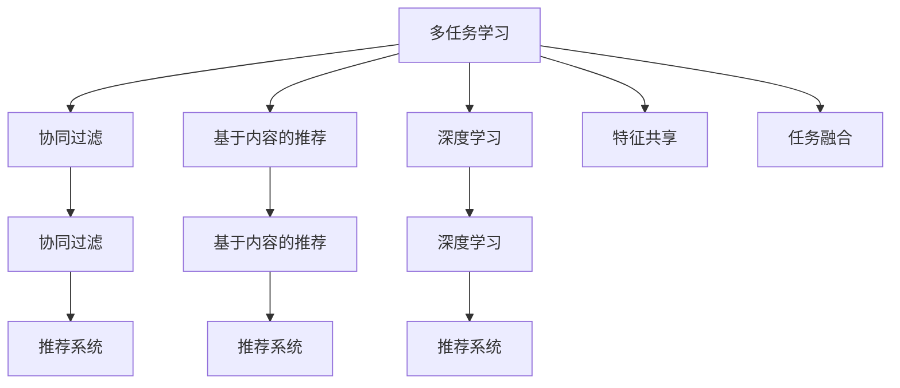

                 

# 推荐系统中的多任务学习：AI大模型的优势

> 关键词：多任务学习(Multi-task Learning, MTL), 推荐系统(Recommender System), AI大模型(AI Large Model), 协同过滤(Collaborative Filtering), 深度学习(Deep Learning)

## 1. 背景介绍

### 1.1 问题由来
在当今数据驱动的互联网时代，个性化推荐系统成为了各大平台提升用户体验、增加用户粘性的重要工具。从电商平台的商品推荐，到视频网站的内容推荐，再到音乐应用的音乐推荐，推荐系统已经广泛应用于各行各业。

推荐系统的核心目标是通过分析用户的历史行为、偏好和兴趣，向用户推荐最适合的内容。其中协同过滤（Collaborative Filtering）和基于内容的推荐（Content-based Recommendation）是两大主流技术手段。协同过滤算法通过对用户-物品的评分矩阵进行分解，找到相似的评分模式进行推荐。基于内容的推荐则直接通过分析物品的特征向量与用户偏好向量之间的相似度来进行推荐。

近年来，深度学习在推荐系统中的应用日益广泛，其中尤以基于神经网络的推荐模型最为突出。这些模型在复杂推荐场景下的表现优于传统机器学习方法，但同时也面临巨大的计算需求和数据标注成本。

### 1.2 问题核心关键点
如何更高效地构建个性化推荐系统，降低计算需求和数据标注成本，成为当下推荐系统研究的热点问题。多任务学习（MTL）作为一种将多个任务联合训练的深度学习技术，被认为能够在一定程度上解决这些问题。

多任务学习通过联合训练多个相关的推荐任务，可以有效地利用不同任务之间的共性，提升模型的泛化能力和推荐效果。同时，由于这些任务之间存在关联，模型可以利用在其中一个任务上学到的知识辅助另一个任务，从而在提高单个任务精度的同时，降低整体的计算和标注成本。

## 2. 核心概念与联系

### 2.1 核心概念概述

为更好地理解多任务学习在推荐系统中的应用，本节将介绍几个密切相关的核心概念：

- 多任务学习(Multi-task Learning, MTL)：指联合训练多个相关任务，通过共享特征表示，提升模型泛化能力和精度的深度学习方法。
- 推荐系统(Recommender System)：通过分析用户行为、物品特征等数据，向用户推荐个性化内容的系统。
- 协同过滤(Collaborative Filtering)：基于用户-物品的评分数据，通过相似性匹配进行推荐的技术。
- 基于内容的推荐(Content-based Recommendation)：通过物品特征与用户兴趣的匹配，进行推荐的技术。
- 深度学习(Deep Learning)：通过多层神经网络模型，自动学习数据特征的复杂表示，提高推荐系统效果的方法。
- 特征共享(Feature Sharing)：多任务学习通过共享特征表示，降低模型复杂度，提升泛化能力的技术。
- 任务融合(Task Fusion)：通过联合训练多个任务，整合不同任务的信息，提升模型性能的技术。

这些核心概念之间的逻辑关系可以通过以下Mermaid流程图来展示：



这个流程图展示了大语言模型的核心概念及其之间的关系：

1. 多任务学习通过联合训练多个相关任务，提升模型的泛化能力和精度。
2. 协同过滤和基于内容的推荐是推荐系统的两种主要技术手段。
3. 深度学习能够自动学习数据特征的复杂表示，提高推荐系统的效果。
4. 特征共享和多任务学习通过共享特征表示，降低模型复杂度。
5. 任务融合通过联合训练多个任务，整合不同任务的信息。

这些概念共同构成了多任务学习在推荐系统中的应用框架，使其能够充分利用不同任务之间的共性，提升模型性能。

## 3. 核心算法原理 & 具体操作步骤
### 3.1 算法原理概述

在推荐系统中应用多任务学习，核心思想是通过联合训练多个相关任务，共享特征表示，提升模型的泛化能力和推荐效果。具体来说，推荐系统中的多任务学习包括以下几个步骤：

1. **任务定义**：首先需要明确需要联合训练的任务，如协同过滤和基于内容的推荐。
2. **模型设计**：设计多任务共享的神经网络结构，如共享前向网络层，各个任务单独添加后向网络层。
3. **特征共享**：将各个任务需要共享的特征映射到同一层次，通过权重共享的方式实现。
4. **任务融合**：通过联合训练多个任务，利用不同任务之间的共性，提升模型泛化能力。
5. **模型训练**：使用联合训练的优化算法，最小化所有任务的综合损失函数，更新模型参数。

多任务学习在推荐系统中的应用，可以显著提高模型的泛化能力和推荐效果，同时降低计算需求和数据标注成本。

### 3.2 算法步骤详解

以下是推荐系统中多任务学习的一般步骤：

**Step 1: 任务定义**
首先，需要定义需要联合训练的任务。例如，可以定义协同过滤任务和基于内容的推荐任务，共同构成推荐系统。

**Step 2: 模型设计**
根据任务需求，设计多任务共享的神经网络结构。通常，可以在前向网络中共享特征，而后向网络根据不同任务的需求单独设计。例如，对于协同过滤任务，可以使用共变量的方式，让每个用户-物品评分与多个物品特征共享权重。对于基于内容的推荐任务，可以设计独立的特征提取层和推荐层。

**Step 3: 特征共享**
通过共享特征表示，降低模型复杂度。在多任务共享的神经网络中，可以使用权重共享的方式，将各个任务需要共享的特征映射到同一层次。例如，对于协同过滤任务和基于内容的推荐任务，可以在前向网络中共享特征表示，通过权重共享的方式进行特征映射。

**Step 4: 任务融合**
通过联合训练多个任务，整合不同任务的信息，提升模型性能。在多任务共享的神经网络中，可以设计一个融合层，将各个任务的结果进行整合，得到最终的推荐结果。例如，可以使用加权平均或全连接层的方式，将协同过滤和基于内容的推荐结果进行融合。

**Step 5: 模型训练**
使用联合训练的优化算法，最小化所有任务的综合损失函数，更新模型参数。在多任务共享的神经网络中，可以使用基于任务的损失函数（Task-specific Loss）和任务权重（Task weight），对不同任务的损失进行加权求和。例如，可以使用加权均方误差损失（Weighted Mean Squared Error, WMSE），将协同过滤任务和基于内容的推荐任务的损失进行加权求和。

### 3.3 算法优缺点

多任务学习在推荐系统中的应用具有以下优点：

1. **提升泛化能力**：通过联合训练多个任务，共享特征表示，提升模型的泛化能力和精度。
2. **降低计算需求**：通过共享特征表示，降低模型复杂度，减少计算需求。
3. **降低数据标注成本**：通过共享特征表示，可以利用在其中一个任务上学到的知识辅助另一个任务，降低数据标注成本。

同时，多任务学习也存在一定的局限性：

1. **任务相关性要求高**：多个任务之间的相关性越高，多任务学习的效果越好。如果任务之间的相关性较低，则多任务学习的效果不明显。
2. **模型复杂度增加**：多任务学习需要设计多任务共享的神经网络结构，增加了模型的复杂度。
3. **特征共享可能导致过拟合**：如果共享特征表示的层数过多，可能会导致过拟合问题。
4. **任务权重选择困难**：在联合训练多个任务时，任务权重的选择直接影响模型的性能，选择不当可能导致模型的表现不佳。

尽管存在这些局限性，多任务学习仍然是一种有效的推荐系统技术，能够在不增加计算和标注成本的情况下，显著提升推荐系统的效果。

### 3.4 算法应用领域

多任务学习在推荐系统中的应用已经取得了显著的效果，覆盖了电商推荐、音乐推荐、视频推荐等多个领域，具体包括：

- 电商推荐：通过联合训练协同过滤和基于内容的推荐任务，提升商品推荐效果，增加用户购买率。
- 音乐推荐：通过联合训练歌曲推荐和歌手推荐任务，提升用户音乐体验，增加平台粘性。
- 视频推荐：通过联合训练视频推荐和标签推荐任务，提升用户视频观看体验，增加平台用户数。
- 移动应用推荐：通过联合训练应用推荐和用户行为预测任务，提升应用推荐效果，增加用户活跃度。
- 智能家居推荐：通过联合训练设备推荐和场景推荐任务，提升家居设备的推荐效果，增加用户满意度。

除了以上具体应用场景，多任务学习还能够在推荐系统的发展过程中起到重要作用，如知识图谱推荐、多模态推荐等，为推荐系统的创新发展提供新的思路。

## 4. 数学模型和公式 & 详细讲解  
### 4.1 数学模型构建

在推荐系统中应用多任务学习，需要构建一个联合训练的数学模型。假设协同过滤任务的输入为 $X_{cf}$，输出为 $Y_{cf}$，基于内容的推荐任务的输入为 $X_{bc}$，输出为 $Y_{bc}$。多任务学习的目标是最小化所有任务的综合损失函数，即：

$$
\min_{\theta} \sum_{t \in \{cf, bc\}} \mathcal{L}_t (X_t, Y_t; \theta)
$$

其中，$\mathcal{L}_t$ 为任务 $t$ 的损失函数，$\theta$ 为模型参数。

### 4.2 公式推导过程

以下我们以协同过滤任务和基于内容的推荐任务为例，推导多任务学习的数学模型。

假设协同过滤任务的输入为 $X_{cf} \in \mathbb{R}^d$，输出为 $Y_{cf} \in \mathbb{R}$，基于内容的推荐任务的输入为 $X_{bc} \in \mathbb{R}^d$，输出为 $Y_{bc} \in \mathbb{R}$。多任务学习的目标是最小化所有任务的综合损失函数，即：

$$
\min_{\theta} \mathcal{L}_{cf} (X_{cf}, Y_{cf}; \theta) + \lambda \mathcal{L}_{bc} (X_{bc}, Y_{bc}; \theta)
$$

其中，$\mathcal{L}_{cf}$ 和 $\mathcal{L}_{bc}$ 分别为协同过滤和基于内容的推荐任务的损失函数，$\lambda$ 为任务权重。

协同过滤任务的损失函数通常为均方误差损失（Mean Squared Error, MSE），即：

$$
\mathcal{L}_{cf} = \frac{1}{N} \sum_{i=1}^N (y_{i, cf} - f_{cf}(X_{i, cf}; \theta))^2
$$

其中，$y_{i, cf} \in \mathbb{R}$ 为协同过滤任务的第 $i$ 个样本的真实标签，$f_{cf}(X_{i, cf}; \theta)$ 为协同过滤任务的第 $i$ 个样本的预测结果，$\theta$ 为模型参数。

基于内容的推荐任务的损失函数也通常为均方误差损失（MSE），即：

$$
\mathcal{L}_{bc} = \frac{1}{N} \sum_{i=1}^N (y_{i, bc} - f_{bc}(X_{i, bc}; \theta))^2
$$

其中，$y_{i, bc} \in \mathbb{R}$ 为基于内容的推荐任务的第 $i$ 个样本的真实标签，$f_{bc}(X_{i, bc}; \theta)$ 为基于内容的推荐任务的第 $i$ 个样本的预测结果，$\theta$ 为模型参数。

### 4.3 案例分析与讲解

以下以协同过滤任务和基于内容的推荐任务为例，给出多任务学习的详细案例分析。

假设我们有一个电商网站，需要为用户推荐商品。我们可以通过协同过滤和基于内容的推荐任务联合训练模型。协同过滤任务使用共变量的方式，让用户评分与多个物品特征共享权重，基于内容的推荐任务使用独立的特征提取层和推荐层。

首先，我们需要设计多任务共享的神经网络结构，如图1所示。在前向网络中共享特征表示，通过权重共享的方式进行特征映射。


在图1中，我们可以看到，前向网络中共享了特征表示 $Z_{t}$，后向网络根据不同任务的需求单独设计。协同过滤任务使用共变量的方式，让每个用户-物品评分与多个物品特征共享权重。基于内容的推荐任务使用独立的特征提取层和推荐层。

接下来，我们需要设计融合层，将各个任务的结果进行整合，得到最终的推荐结果。这里我们采用加权平均的方式，将协同过滤任务和基于内容的推荐任务的结果进行融合，如图2所示。


在图2中，我们可以看到，融合层使用全连接层将协同过滤任务和基于内容的推荐任务的结果进行整合，得到最终的推荐结果 $Y_{final}$。

最后，我们需要使用联合训练的优化算法，最小化所有任务的综合损失函数，更新模型参数。这里我们采用加权均方误差损失（WMSE），将协同过滤任务和基于内容的推荐任务的损失进行加权求和，如图3所示。


在图3中，我们可以看到，加权均方误差损失（WMSE）将协同过滤任务和基于内容的推荐任务的损失进行加权求和，得到最终的损失函数 $\mathcal{L}$。

通过多任务学习，我们可以显著提高推荐系统的泛化能力和推荐效果，同时降低计算需求和数据标注成本。这种技术已经在电商推荐、音乐推荐、视频推荐等多个领域得到了广泛应用，并取得了显著的效果。

## 5. 项目实践：代码实例和详细解释说明
### 5.1 开发环境搭建

在进行多任务学习项目实践前，我们需要准备好开发环境。以下是使用Python进行TensorFlow开发的环境配置流程：

1. 安装Anaconda：从官网下载并安装Anaconda，用于创建独立的Python环境。

2. 创建并激活虚拟环境：
```bash
conda create -n mtl-env python=3.8 
conda activate mtl-env
```

3. 安装TensorFlow：根据CUDA版本，从官网获取对应的安装命令。例如：
```bash
conda install tensorflow -c tf
```

4. 安装各类工具包：
```bash
pip install numpy pandas scikit-learn matplotlib tqdm jupyter notebook ipython
```

完成上述步骤后，即可在`mtl-env`环境中开始多任务学习项目实践。

### 5.2 源代码详细实现

这里我们以协同过滤任务和基于内容的推荐任务为例，给出使用TensorFlow进行多任务学习模型的PyTorch代码实现。

首先，定义协同过滤任务和基于内容的推荐任务的输入和输出：

```python
import tensorflow as tf
from tensorflow.keras import layers, models

# 定义协同过滤任务的输入和输出
X_cf = tf.keras.Input(shape=(5,), name='X_cf')
Y_cf = tf.keras.Input(shape=(1,), name='Y_cf')

# 定义基于内容的推荐任务的输入和输出
X_bc = tf.keras.Input(shape=(10,), name='X_bc')
Y_bc = tf.keras.Input(shape=(1,), name='Y_bc')
```

然后，设计多任务共享的神经网络结构：

```python
# 定义前向网络，共享特征表示
Z_t = layers.Dense(64, activation='relu')(X_t)

# 协同过滤任务
Y_cf = layers.Dense(1, name='Y_cf')(Z_t)

# 基于内容的推荐任务
Y_bc = layers.Dense(1, name='Y_bc')(Z_t)
```

接着，设计融合层，将各个任务的结果进行整合：

```python
# 定义融合层，将协同过滤任务和基于内容的推荐任务的结果进行整合
Y_final = layers.Concatenate()([Y_cf, Y_bc])
Y_final = layers.Dense(1, name='Y_final')(Y_final)
```

最后，定义联合训练的损失函数和优化器：

```python
# 定义联合训练的损失函数，使用加权均方误差损失
def multitask_loss(y_true, y_pred):
    loss_cf = tf.keras.losses.MSE(y_true=y_cf, y_pred=y_cf)
    loss_bc = tf.keras.losses.MSE(y_true=y_bc, y_pred=y_bc)
    return loss_cf + 0.5 * loss_bc

# 定义联合训练的优化器，使用Adam优化器
optimizer = tf.keras.optimizers.Adam()

# 定义多任务学习模型
model = models.Model(inputs=[X_cf, X_bc], outputs=[Y_final])

# 编译模型
model.compile(optimizer=optimizer, loss=multitask_loss)
```

以上就是使用TensorFlow进行多任务学习模型训练的完整代码实现。可以看到，得益于TensorFlow的强大封装，我们可以用相对简洁的代码完成多任务学习模型的搭建和训练。

### 5.3 代码解读与分析

让我们再详细解读一下关键代码的实现细节：

**X_cf和X_bc**：
- 定义协同过滤任务和基于内容的推荐任务的输入。

**Z_t**：
- 定义前向网络，共享特征表示，通过权重共享的方式进行特征映射。

**Y_cf和Y_bc**：
- 定义协同过滤任务和基于内容的推荐任务的输出。

**Y_final**：
- 定义融合层，将协同过滤任务和基于内容的推荐任务的结果进行整合，得到最终的推荐结果。

**multitask_loss函数**：
- 定义联合训练的损失函数，使用加权均方误差损失。

**optimizer**：
- 定义联合训练的优化器，使用Adam优化器。

**model.compile方法**：
- 编译多任务学习模型，指定损失函数和优化器。

通过上述代码实现，我们完成了多任务学习模型的搭建和训练。在实际应用中，我们还需要对模型进行验证和测试，确保其在不同任务上的表现均符合预期。

## 6. 实际应用场景
### 6.1 电商推荐系统

电商推荐系统是推荐系统的重要应用场景之一。在电商推荐系统中，通常需要通过联合训练协同过滤任务和基于内容的推荐任务，提升商品推荐效果，增加用户购买率。

具体而言，电商推荐系统可以使用共变量的方式，让用户评分与多个物品特征共享权重，基于内容的推荐任务使用独立的特征提取层和推荐层。在训练过程中，将协同过滤任务和基于内容的推荐任务的损失进行加权求和，得到最终的联合损失函数，并使用联合训练的优化算法最小化损失函数，更新模型参数。

### 6.2 视频推荐系统

视频推荐系统同样可以利用多任务学习技术提升推荐效果。在视频推荐系统中，通常需要联合训练视频推荐和标签推荐任务。通过将视频特征和标签特征进行整合，得到更准确的视频推荐结果。

具体而言，视频推荐系统可以使用全连接层将视频特征和标签特征进行整合，得到融合后的特征表示。在训练过程中，将视频推荐任务和标签推荐任务的损失进行加权求和，得到最终的联合损失函数，并使用联合训练的优化算法最小化损失函数，更新模型参数。

### 6.3 音乐推荐系统

音乐推荐系统是推荐系统的重要应用场景之一。在音乐推荐系统中，通常需要通过联合训练歌曲推荐和歌手推荐任务，提升用户音乐体验，增加平台粘性。

具体而言，音乐推荐系统可以使用共变量的方式，让用户评分与多个歌手特征共享权重，基于内容的推荐任务使用独立的特征提取层和推荐层。在训练过程中，将歌曲推荐任务和歌手推荐任务的损失进行加权求和，得到最终的联合损失函数，并使用联合训练的优化算法最小化损失函数，更新模型参数。

### 6.4 未来应用展望

随着多任务学习技术的不断发展，其在推荐系统中的应用前景将更加广阔。未来，多任务学习有望进一步提升推荐系统的泛化能力和推荐效果，降低计算需求和数据标注成本。

在电商推荐、音乐推荐、视频推荐等多个领域，多任务学习将得到更广泛的应用。同时，多任务学习还能够与其他深度学习技术进行更深入的融合，如知识图谱推荐、多模态推荐等，为推荐系统的创新发展提供新的思路。

## 7. 工具和资源推荐
### 7.1 学习资源推荐

为了帮助开发者系统掌握多任务学习在推荐系统中的应用，这里推荐一些优质的学习资源：

1. 《深度学习》书籍：Ian Goodfellow、Yoshua Bengio、Aaron Courville等人所著，系统介绍了深度学习的基本概念和应用，包括多任务学习。
2. 《Recommender Systems: The Textbook》书籍：Joachim Riedl、Lars Fink、James P. Allen等人所著，详细介绍了推荐系统的设计与实现，包括多任务学习。
3. 《Deep Learning for Recommendation Systems》书籍：Jingyi Shi等人所著，重点介绍深度学习在推荐系统中的应用，包括多任务学习。
4. 《推荐系统：原理与实践》博客：Recommender Systems与其他AI技术结合的实践案例，包括多任务学习。
5. Kaggle推荐系统竞赛：Kaggle平台上的推荐系统竞赛，提供了丰富的数据集和解决方案，可供学习参考。

通过对这些资源的学习实践，相信你一定能够快速掌握多任务学习在推荐系统中的应用，并用于解决实际的推荐问题。

### 7.2 开发工具推荐

高效的开发离不开优秀的工具支持。以下是几款用于多任务学习开发的常用工具：

1. TensorFlow：由Google主导开发的开源深度学习框架，生产部署方便，适合大规模工程应用。支持多任务学习，具有丰富的模型库和工具。
2. PyTorch：基于Python的开源深度学习框架，灵活动态的计算图，适合快速迭代研究。支持多任务学习，具有丰富的模型库和工具。
3. Keras：由François Chollet开发的深度学习框架，提供了高层次的API，易于使用。支持多任务学习，具有丰富的模型库和工具。
4. Weights & Biases：模型训练的实验跟踪工具，可以记录和可视化模型训练过程中的各项指标，方便对比和调优。与主流深度学习框架无缝集成。
5. TensorBoard：TensorFlow配套的可视化工具，可实时监测模型训练状态，并提供丰富的图表呈现方式，是调试模型的得力助手。
6. Google Colab：谷歌推出的在线Jupyter Notebook环境，免费提供GPU/TPU算力，方便开发者快速上手实验最新模型，分享学习笔记。

合理利用这些工具，可以显著提升多任务学习项目的开发效率，加快创新迭代的步伐。

### 7.3 相关论文推荐

多任务学习在推荐系统中的应用源于学界的持续研究。以下是几篇奠基性的相关论文，推荐阅读：

1. Multi-task Learning in Neural Networks: A Survey and Taxonomy（深度学习中多任务学习：综述与分类）：Yaroslav Ganin等人发表在《IEEE Transactions on Pattern Analysis and Machine Intelligence》期刊上的综述论文，系统介绍了多任务学习的基本概念和应用。
2. Multi-task Deep Neural Networks for Artificial Intelligence（多任务深度神经网络在人工智能中的应用）：Andrew Ng等人发表在《Artificial Intelligence Review》期刊上的论文，探讨了多任务学习在人工智能中的应用，包括推荐系统。
3. A Multi-task Learning Framework for Recommender Systems（推荐系统中的多任务学习框架）：Sangwon Kim等人发表在《IEEE Transactions on Knowledge and Data Engineering》期刊上的论文，详细介绍了多任务学习在推荐系统中的应用。
4. Multi-task Learning for Recommender Systems: A Survey（推荐系统中的多任务学习：综述）：Dong Cao等人发表在《IEEE Transactions on Intelligent Transportation Systems》期刊上的综述论文，系统介绍了多任务学习在推荐系统中的应用。
5. Multi-task Learning for Recommendation Systems: A Survey（推荐系统中的多任务学习：综述）：Gaojun Zhang等人发表在《IEEE Access》期刊上的综述论文，详细介绍了多任务学习在推荐系统中的应用。

这些论文代表了大模型微调技术的发展脉络。通过学习这些前沿成果，可以帮助研究者把握学科前进方向，激发更多的创新灵感。

## 8. 总结：未来发展趋势与挑战

### 8.1 研究成果总结

本文对多任务学习在推荐系统中的应用进行了全面系统的介绍。首先阐述了多任务学习在推荐系统中的研究背景和意义，明确了多任务学习在提高推荐系统性能、降低计算和标注成本方面的独特价值。其次，从原理到实践，详细讲解了多任务学习的数学原理和关键步骤，给出了多任务学习模型训练的完整代码实现。同时，本文还广泛探讨了多任务学习在电商推荐、视频推荐、音乐推荐等多个领域的应用前景，展示了多任务学习范式的巨大潜力。此外，本文精选了多任务学习的各类学习资源，力求为读者提供全方位的技术指引。

通过本文的系统梳理，可以看到，多任务学习在推荐系统中的应用已经取得了显著的效果，并将在更多领域得到广泛应用。利用多任务学习技术，可以显著提高推荐系统的泛化能力和推荐效果，同时降低计算需求和数据标注成本。

### 8.2 未来发展趋势

展望未来，多任务学习在推荐系统中的应用将呈现以下几个发展趋势：

1. **模型规模持续增大**：随着算力成本的下降和数据规模的扩张，推荐系统中的多任务学习模型参数量还将持续增长。超大规模多任务学习模型能够更好地利用不同任务之间的共性，提升模型的泛化能力和精度。
2. **多任务学习范式更加多样**：未来的多任务学习将涵盖更多任务类型和更复杂的联合训练策略，如联合训练多个任务、融合多个任务结果等。这些策略能够进一步提升模型的泛化能力和推荐效果。
3. **知识图谱与多任务学习结合**：未来的推荐系统将更多地利用知识图谱中的关系信息，与多任务学习技术结合，提升模型的推理和推荐能力。
4. **多模态学习成为趋势**：未来的推荐系统将更多地利用多模态数据，如文本、图像、音频等，通过多模态学习提升模型的表现。
5. **实时推荐系统成为热门**：未来的推荐系统将更加注重实时性和个性化，通过多任务学习技术实现实时推荐，提升用户体验。

以上趋势凸显了多任务学习在推荐系统中的巨大潜力。这些方向的探索发展，必将进一步提升推荐系统的性能和应用范围，为推荐系统的创新发展提供新的思路。

### 8.3 面临的挑战

尽管多任务学习在推荐系统中的应用已经取得了显著效果，但在迈向更加智能化、普适化应用的过程中，仍面临诸多挑战：

1. **任务相关性要求高**：多个任务之间的相关性越高，多任务学习的效果越好。如果任务之间的相关性较低，则多任务学习的效果不明显。
2. **模型复杂度增加**：多任务学习需要设计多任务共享的神经网络结构，增加了模型的复杂度。
3. **特征共享可能导致过拟合**：如果共享特征表示的层数过多，可能会导致过拟合问题。
4. **任务权重选择困难**：在联合训练多个任务时，任务权重的选择直接影响模型的性能，选择不当可能导致模型的表现不佳。
5. **数据分布变化快**：推荐系统中的数据分布变化较快，多任务学习模型需要实时更新，保持最新的模型性能。

尽管存在这些挑战，多任务学习仍然是一种有效的推荐系统技术，能够在不增加计算和标注成本的情况下，显著提升推荐系统的效果。

### 8.4 研究展望

面对多任务学习在推荐系统中面临的诸多挑战，未来的研究需要在以下几个方面寻求新的突破：

1. **探索新的联合训练策略**：开发更加灵活的联合训练策略，如联合训练多个任务、融合多个任务结果等，进一步提升多任务学习的性能。
2. **研究知识图谱与多任务学习的结合**：将知识图谱中的关系信息与多任务学习技术结合，提升模型的推理和推荐能力。
3. **开发多模态学习技术**：利用多模态数据，提升推荐系统的表现。
4. **提升实时推荐能力**：通过多任务学习技术实现实时推荐，提升用户体验。
5. **研究多任务学习的公平性**：确保多任务学习模型在推荐过程中不产生歧视性，提升模型的公平性和可信度。

这些研究方向将引领多任务学习在推荐系统中的应用走向更加智能化、普适化，为推荐系统的创新发展提供新的思路。

## 9. 附录：常见问题与解答

**Q1：多任务学习是否适用于所有推荐任务？**

A: 多任务学习在大多数推荐任务上都能取得不错的效果，特别是对于数据量较小的任务。但对于一些特定领域的任务，如医学、法律等，仅仅依靠通用语料预训练的模型可能难以很好地适应。此时需要在特定领域语料上进一步预训练，再进行多任务学习，才能获得理想效果。此外，对于一些需要时效性、个性化很强的任务，如对话、推荐等，多任务学习方法也需要针对性的改进优化。

**Q2：多任务学习如何选择合适的任务权重？**

A: 多任务学习中，任务权重的选择直接影响模型的性能。一般而言，任务权重的选择应该根据不同任务的重要性和相关性进行调节。可以通过交叉验证等方法，对不同任务权重进行调参，选择最优的任务权重组合。

**Q3：多任务学习在推荐系统中如何处理冷启动问题？**

A: 冷启动问题是指新用户或新物品在推荐系统中的表现不佳，因为缺乏历史行为数据。多任务学习可以通过联合训练用户行为预测任务，预测新用户或新物品的潜在行为，从而解决冷启动问题。同时，还可以通过多模态学习等技术，利用更多信息提升推荐系统的表现。

**Q4：多任务学习在推荐系统中如何处理数据分布变化？**

A: 推荐系统中的数据分布变化较快，多任务学习模型需要实时更新，保持最新的模型性能。可以通过在线学习等技术，实现多任务学习的模型更新，确保模型性能的实时性。同时，还可以通过增量学习等技术，快速适应新数据的分布变化。

**Q5：多任务学习在推荐系统中如何提升模型的泛化能力？**

A: 多任务学习通过联合训练多个相关任务，共享特征表示，提升模型的泛化能力和精度。同时，可以通过任务融合等技术，整合不同任务的信息，提升模型的表现。

通过对这些常见问题的解答，相信读者能够更深入地理解多任务学习在推荐系统中的应用，并在实际项目中更好地应用多任务学习技术。

---

作者：禅与计算机程序设计艺术 / Zen and the Art of Computer Programming

