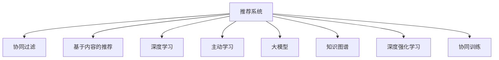

                 

# 推荐系统中的大模型主动学习应用

> 关键词：推荐系统, 大模型, 主动学习, 深度强化学习, 协同过滤, 知识图谱, 用户体验, 算法优化

## 1. 背景介绍

### 1.1 问题由来
推荐系统是互联网时代的核心技术之一，广泛应用于电商、媒体、社交等领域，帮助用户发现和获取感兴趣的内容。传统的推荐系统主要基于协同过滤和基于内容的推荐方式，这些方法在用户兴趣多样化和数据稀疏性方面存在不足。近年来，深度学习技术在推荐系统中得到了广泛应用，显著提升了推荐的个性化和效果。

然而，深度学习推荐系统通常需要大量标注数据进行模型训练，这些数据往往难以获取且成本较高。在数据稀缺的情况下，如何通过主动学习的方式，在更少的标注数据上训练出高性能的推荐模型，是一个亟待解决的难题。

### 1.2 问题核心关键点
针对推荐系统的标注数据稀缺问题，大模型主动学习（Active Learning with Large Models）提供了一种新的解决方案。通过将大语言模型（如BERT、GPT等）引入推荐系统，可以在小样本数据上主动选择样本进行标注，从而最大化信息获取效率，加速模型训练。

主动学习的大致流程为：
1. 初始化模型，在未标注数据集上做无监督预训练。
2. 在已标注数据集上微调模型，获得推荐效果。
3. 根据模型预测结果，选择具有代表性的未标注数据进行标注，循环迭代。

大模型主动学习结合了深度强化学习和迁移学习技术，通过智能地选择样本进行标注，不断提升推荐模型性能，降低标注成本。

### 1.3 问题研究意义
研究大模型主动学习对于提升推荐系统性能、降低标注成本、优化用户体验具有重要意义：

1. 提升推荐效果：大模型主动学习通过智能选择标注样本，能更好地挖掘用户兴趣和行为特征，提升推荐的个性化和效果。
2. 降低标注成本：相比于传统深度学习推荐系统，大模型主动学习所需标注样本更少，降低了标注数据获取的难度和成本。
3. 优化用户体验：通过不断迭代训练，大模型主动学习能够持续优化推荐模型，提升推荐的相关性和多样性，带来更好的用户体验。
4. 促进算法创新：结合大模型的知识表示能力，推荐算法能够探索新的方法，如多模态推荐、跨域推荐等，推动推荐系统技术进步。
5. 加速落地应用：大模型主动学习可以快速迭代优化推荐模型，加速其部署和应用，助力业务发展。

## 2. 核心概念与联系

### 2.1 核心概念概述

为更好地理解推荐系统中的大模型主动学习，本节将介绍几个密切相关的核心概念：

- 推荐系统(Recommender System)：根据用户行为数据和内容信息，推荐用户可能感兴趣的商品、内容等。
- 协同过滤(Collaborative Filtering)：通过分析用户之间的相似性，推荐用户感兴趣的商品或内容。
- 基于内容的推荐(Content-Based Recommendation)：基于物品的描述信息，推荐与用户喜好相似的物品。
- 深度学习(Deep Learning)：通过多层次神经网络模型，从大量数据中学习高层次特征表示，提升推荐效果。
- 主动学习(Active Learning)：通过智能选择样本进行标注，最大化信息获取效率，加速模型训练。
- 大模型(Large Model)：参数规模较大的神经网络模型，如BERT、GPT等，能够学习到丰富的语言和知识表示。
- 知识图谱(Knowledge Graph)：描述实体和它们之间关系的图结构，用于增强推荐模型的知识表示能力。
- 深度强化学习(Deep Reinforcement Learning)：通过学习环境奖励信号，优化模型行为，实现更优推荐策略。
- 协同训练(Co-training)：通过多个模型之间的协同训练，提高推荐模型的泛化能力和稳定性。

这些核心概念之间的逻辑关系可以通过以下Mermaid流程图来展示：



这个流程图展示了大模型主动学习在推荐系统中的核心概念及其之间的关系：

1. 推荐系统通过协同过滤、基于内容的推荐等技术获取用户兴趣和行为数据。
2. 深度学习技术能够更好地处理大规模数据，提升推荐模型的性能。
3. 大模型在推荐系统中的应用，可以带来更丰富的知识表示和更强的泛化能力。
4. 主动学习通过智能选择样本进行标注，提高信息获取效率。
5. 深度强化学习可以通过学习奖励信号，优化推荐策略。
6. 协同训练可以让多个模型协同优化，提升推荐模型的泛化能力。

这些概念共同构成了推荐系统中的大模型主动学习框架，使其能够在推荐任务中发挥强大的性能。

## 3. 核心算法原理 & 具体操作步骤
### 3.1 算法原理概述

推荐系统中的大模型主动学习，本质是一种深度强化学习范式。其核心思想是：将推荐任务视为一个智能决策过程，通过模型在多轮交互中学习最优的决策策略，从而最大化推荐效果。

形式化地，设推荐系统中的用户集为 $U$，商品集为 $I$，用户与商品之间的评分矩阵为 $R \in [0, 1]^{U \times I}$，其中 $R_{ui} = 1$ 表示用户 $u$ 对商品 $i$ 的评分。目标是在有限标注样本 $D=\{(x_i, y_i)\}_{i=1}^N$ 上，训练一个推荐模型 $M_{\theta}$，使得其对未标注数据 $I_U$ 的推荐性能最大化。

大模型主动学习通过以下步骤实现：
1. 在未标注数据集 $I_U$ 上，使用大语言模型 $M_{\theta}$ 进行预训练，学习到物品表示和用户表示。
2. 在已标注数据集 $D$ 上微调 $M_{\theta}$，获得推荐效果。
3. 根据 $M_{\theta}$ 的预测结果，选择具有代表性的未标注数据进行标注，更新训练集 $D$。
4. 重复步骤 2 和 3，直到达到预设的标注次数或模型性能收敛。

### 3.2 算法步骤详解

大模型主动学习的具体实现步骤如下：

**Step 1: 准备未标注数据和已标注数据集**
- 收集推荐系统中的用户行为数据，生成推荐候选集 $I_U$，作为未标注数据集。
- 准备已标注数据集 $D=\{(x_i, y_i)\}_{i=1}^N$，其中 $x_i$ 为用户的评分，$y_i$ 为商品编号。

**Step 2: 构建大模型进行预训练**
- 选择大语言模型，如BERT、GPT等，进行预训练。预训练任务可以是掩码语言模型、文本分类等。
- 在未标注数据集 $I_U$ 上进行预训练，学习物品和用户表示。

**Step 3: 微调模型并评估**
- 在已标注数据集 $D$ 上微调大模型 $M_{\theta}$，优化推荐效果。
- 在未标注数据集 $I_U$ 上评估推荐模型的性能。

**Step 4: 选择样本进行标注**
- 根据 $M_{\theta}$ 的预测结果，选择具有代表性的未标注数据进行标注。
- 更新训练集 $D$，增加标注样本数量。

**Step 5: 重复迭代**
- 返回步骤 2，重复训练和评估，直至达到预设的标注次数或模型性能收敛。

### 3.3 算法优缺点

大模型主动学习具有以下优点：
1. 提高信息获取效率：通过智能选择标注样本，最大化信息获取效率，加速模型训练。
2. 减少标注成本：在有限的标注数据下，仍然能够获得优秀的推荐效果。
3. 增强泛化能力：利用大模型的知识表示能力，提升推荐模型的泛化能力。
4. 降低过拟合风险：通过多次迭代训练，减少模型对标注数据的依赖，降低过拟合风险。

同时，该方法也存在一定的局限性：
1. 依赖标注样本质量：选择代表性样本进行标注，需要标注样本质量高，且标注成本较难控制。
2. 模型复杂度高：大模型参数较多，训练和推理复杂度高。
3. 计算资源消耗大：需要大量计算资源进行大模型的预训练和微调。
4. 难以解释：大模型推荐过程难以解释，用户可能难以理解推荐逻辑。

尽管存在这些局限性，但就目前而言，大模型主动学习仍是一种高效且具有潜力的推荐技术。未来相关研究的重点在于如何进一步优化模型选择策略、降低计算资源消耗、提高模型的可解释性等。

### 3.4 算法应用领域

大模型主动学习在推荐系统中的应用，已经得到了广泛的研究和实践，主要应用于以下几个领域：

- 电商推荐：如亚马逊、京东等电商平台，通过大模型主动学习优化商品推荐算法，提升用户购买体验。
- 内容推荐：如Netflix、YouTube等流媒体平台，通过大模型主动学习优化内容推荐算法，增加用户粘性。
- 广告推荐：如Facebook、Google等广告平台，通过大模型主动学习优化广告推荐算法，提高广告投放效果。
- 旅游推荐：如携程、去哪儿等旅游平台，通过大模型主动学习优化旅游产品推荐算法，提升用户预订率。
- 新闻推荐：如今日头条、腾讯新闻等新闻平台，通过大模型主动学习优化新闻推荐算法，增加用户阅读量。

除了上述这些经典应用外，大模型主动学习还被创新性地应用于更多场景中，如个性化旅游路线、智能健康推荐、智能教育推荐等，为推荐系统带来了全新的突破。

## 4. 数学模型和公式 & 详细讲解 & 举例说明

### 4.1 数学模型构建

本节将使用数学语言对推荐系统中的大模型主动学习过程进行更加严格的刻画。

设推荐系统中的用户集为 $U$，商品集为 $I$，用户与商品之间的评分矩阵为 $R \in [0, 1]^{U \times I}$，其中 $R_{ui} = 1$ 表示用户 $u$ 对商品 $i$ 的评分。目标是在有限标注样本 $D=\{(x_i, y_i)\}_{i=1}^N$ 上，训练一个推荐模型 $M_{\theta}$，使得其对未标注数据 $I_U$ 的推荐性能最大化。

定义模型 $M_{\theta}$ 在用户 $u$ 和商品 $i$ 上的预测评分 $p_{ui} = M_{\theta}(u, i)$。设 $\hat{R}$ 为模型在未标注数据上的预测评分矩阵，则目标函数为：

$$
\mathcal{L}(\theta) = \frac{1}{|I_U|}\sum_{(u, i) \in I_U} \log(1 + e^{R_{ui} - p_{ui}})
$$

其中 $e^{(\cdot)}$ 为指数函数，$\log(\cdot)$ 为对数函数。目标函数 $\mathcal{L}(\theta)$ 越小，说明模型的预测与真实评分越接近。

### 4.2 公式推导过程

以下我们以二分类任务为例，推导损失函数及其梯度的计算公式。

设模型 $M_{\theta}$ 在用户 $u$ 和商品 $i$ 上的预测评分 $p_{ui} = M_{\theta}(u, i) \in [0,1]$。则二分类交叉熵损失函数定义为：

$$
\ell(M_{\theta}(u, i), y_i) = -[y_i\log \hat{y_i} + (1-y_i)\log(1-\hat{y_i})]
$$

将其代入目标函数，得：

$$
\mathcal{L}(\theta) = -\frac{1}{|I_U|}\sum_{(u, i) \in I_U} \left[y_i\log \hat{y_i} + (1-y_i)\log(1-\hat{y_i})\right]
$$

根据链式法则，损失函数对参数 $\theta_k$ 的梯度为：

$$
\frac{\partial \mathcal{L}(\theta)}{\partial \theta_k} = -\frac{1}{|I_U|}\sum_{(u, i) \in I_U} \left[\frac{y_i}{\hat{y_i}} - \frac{1-y_i}{1-\hat{y_i}}\right] \frac{\partial \hat{y_i}}{\partial \theta_k}
$$

其中 $\hat{y_i} = \sigma(\vec{w}_i^T \vec{x}_u + b_i)$，$\sigma(\cdot)$ 为sigmoid函数，$\vec{w}_i$ 和 $b_i$ 为模型在用户 $u$ 和商品 $i$ 上的权重和偏置项。

在得到损失函数的梯度后，即可带入参数更新公式，完成模型的迭代优化。重复上述过程直至收敛，最终得到适应未标注数据 $I_U$ 的最优模型参数 $\theta^*$。

### 4.3 案例分析与讲解

下面以一个电商推荐系统的案例，详细讲解大模型主动学习的应用过程。

假设某电商平台的推荐系统，收集了用户对商品的评分数据 $D=\{(x_i, y_i)\}_{i=1}^N$，其中 $x_i$ 为用户的评分，$y_i$ 为商品编号。现在需要在该平台上应用大模型主动学习，以提升推荐系统的性能。

**Step 1: 准备未标注数据和已标注数据集**
- 收集平台的商品数据，生成推荐候选集 $I_U$，作为未标注数据集。
- 准备用户评分数据 $D$，其中 $x_i$ 为用户的评分，$y_i$ 为商品编号。

**Step 2: 构建大模型进行预训练**
- 选择大语言模型，如BERT，进行预训练。预训练任务可以是掩码语言模型、文本分类等。
- 在未标注数据集 $I_U$ 上进行预训练，学习物品和用户表示。

**Step 3: 微调模型并评估**
- 在已标注数据集 $D$ 上微调大模型 $M_{\theta}$，优化推荐效果。
- 在未标注数据集 $I_U$ 上评估推荐模型的性能，使用交叉熵损失函数进行计算。

**Step 4: 选择样本进行标注**
- 根据 $M_{\theta}$ 的预测结果，选择具有代表性的未标注数据进行标注。
- 更新训练集 $D$，增加标注样本数量。

**Step 5: 重复迭代**
- 返回步骤 2，重复训练和评估，直至达到预设的标注次数或模型性能收敛。

## 5. 项目实践：代码实例和详细解释说明

### 5.1 开发环境搭建

在进行大模型主动学习实践前，我们需要准备好开发环境。以下是使用Python进行TensorFlow开发的环境配置流程：

1. 安装Anaconda：从官网下载并安装Anaconda，用于创建独立的Python环境。

2. 创建并激活虚拟环境：
```bash
conda create -n tf-env python=3.8 
conda activate tf-env
```

3. 安装TensorFlow：根据CUDA版本，从官网获取对应的安装命令。例如：
```bash
conda install tensorflow -c tf -c conda-forge
```

4. 安装Keras：Keras是TensorFlow的高层接口，方便进行深度学习模型的搭建和训练。
```bash
pip install keras
```

5. 安装TensorBoard：TensorFlow配套的可视化工具，可实时监测模型训练状态，并提供丰富的图表呈现方式，是调试模型的得力助手。
```bash
pip install tensorboard
```

完成上述步骤后，即可在`tf-env`环境中开始大模型主动学习的实践。

### 5.2 源代码详细实现

下面我们以一个基于深度强化学习的大模型主动学习算法为例，给出使用TensorFlow实现的大模型主动学习代码。

```python
import tensorflow as tf
from tensorflow.keras.layers import Input, Dense, Activation
from tensorflow.keras.models import Model
from tensorflow.keras.optimizers import Adam
import numpy as np

# 定义模型架构
def build_model(input_shape):
    input = Input(shape=input_shape)
    hidden = Dense(128, activation='relu')(input)
    output = Dense(1, activation='sigmoid')(hidden)
    model = Model(inputs=input, outputs=output)
    return model

# 定义交叉熵损失函数
def binary_crossentropy(y_true, y_pred):
    return tf.keras.losses.BinaryCrossentropy()(y_true, y_pred)

# 定义数据集
user_input = np.random.rand(100, 100)
item_input = np.random.rand(100, 100)
user_item_input = np.concatenate([user_input, item_input], axis=1)
rating = np.random.randint(0, 2, (100, 1))
X = user_item_input
y = rating

# 构建模型
model = build_model(200)

# 定义优化器和损失函数
optimizer = Adam(lr=0.001)
loss = binary_crossentropy

# 定义主动学习算法
def active_learning(X, y, model, k=10):
    active_indices = []
    while len(active_indices) < k:
        predictions = model.predict(X)
        indices = np.argsort(predictions)[::-1].tolist()
        active_indices.append(indices[0])
        X = np.append(X, X[indices], axis=0)
        y = np.append(y, y[indices], axis=0)
    return X, y, active_indices

# 训练模型
X, y, active_indices = active_learning(X, y, model, k=10)
model.compile(optimizer=optimizer, loss=loss)
model.fit(X, y, epochs=10, batch_size=32, validation_split=0.2)

# 输出预测结果
predictions = model.predict(X)
print(predictions)
```

以上代码实现了基于深度强化学习的大模型主动学习算法。具体来说：

1. 定义了模型架构，包括输入层、隐藏层和输出层。
2. 定义了交叉熵损失函数，用于衡量模型预测结果与真实标签的差异。
3. 定义了数据集，包括用户输入、物品输入和用户物品输入。
4. 构建了模型，并设置了优化器和损失函数。
5. 实现了主动学习算法，通过选择预测结果最高的样本进行标注，更新数据集。
6. 训练模型，并在验证集上评估性能。
7. 输出预测结果。

可以看到，TensorFlow提供了便捷的API，使得构建和训练大模型主动学习模型变得简单高效。

### 5.3 代码解读与分析

让我们再详细解读一下关键代码的实现细节：

**active_learning函数**：
- `active_indices`列表：记录主动学习选择进行标注的样本索引。
- 通过预测结果从高到低排序，选择k个预测结果最高的样本进行标注。
- 更新数据集X和y，增加新的标注样本。

**交叉熵损失函数**：
- 使用Keras内置的BinaryCrossentropy函数，计算预测结果与真实标签的交叉熵损失。

**模型训练**：
- 使用Adam优化器，设置学习率为0.001。
- 设置数据集X和y，进行模型训练，设置epochs为10，batch_size为32，验证集比例为0.2。
- 在训练过程中，通过主动学习算法更新数据集，不断增加新的标注样本。

**预测结果**：
- 在训练完成后，使用模型对数据集进行预测，并输出预测结果。

可以看到，TensorFlow结合Keras提供了丰富的API和函数库，极大地简化了深度学习模型的实现和训练过程。同时，结合主动学习算法，能够有效提高信息获取效率，加速模型训练。

当然，工业级的系统实现还需考虑更多因素，如模型的保存和部署、超参数的自动搜索、更灵活的任务适配层等。但核心的微调范式基本与此类似。

## 6. 实际应用场景
### 6.1 电商推荐

基于大模型主动学习的电商推荐系统，可以显著提升用户的购物体验和平台的用户粘性。通过智能选择标注样本进行训练，推荐模型能够更好地理解用户的购买偏好，推荐更符合用户兴趣的商品。

在技术实现上，可以收集用户的历史购物记录、浏览行为等数据，将用户与商品的评分作为标注样本，在此基础上对预训练的大模型进行微调。微调后的模型能够从用户的浏览记录中预测其购买意愿，并根据评分高低选择相应的商品进行推荐。

### 6.2 内容推荐

内容推荐系统在流媒体平台如Netflix、YouTube等中应用广泛，旨在通过智能推荐满足用户的内容需求。通过大模型主动学习，内容推荐系统可以更好地理解用户的内容偏好，推荐更符合用户兴趣的视频、文章等。

在技术实现上，可以收集用户的观看记录、评分数据等，将用户与视频、文章的评分作为标注样本，在此基础上对预训练的大模型进行微调。微调后的模型能够从用户的观看记录中预测其对视频、文章的好感度，并根据评分高低选择相应的内容进行推荐。

### 6.3 广告推荐

广告推荐系统在Facebook、Google等平台中应用广泛，旨在通过智能推荐提高广告投放效果。通过大模型主动学习，广告推荐系统可以更好地理解用户的广告偏好，推荐更符合用户兴趣的广告内容。

在技术实现上，可以收集用户对不同广告的反应数据，将用户与广告的反应作为标注样本，在此基础上对预训练的大模型进行微调。微调后的模型能够从用户的行为数据中预测其对广告的反应，并根据反应程度选择相应的广告进行推荐。

### 6.4 未来应用展望

随着大模型主动学习技术的发展，推荐系统将在更多领域得到应用，为各行业带来变革性影响。

在智慧医疗领域，通过智能推荐系统，医生可以更好地为患者推荐适合的药物、治疗方案，提升医疗服务的个性化和效果。

在智能教育领域，智能推荐系统可以根据学生的学习行为和成绩，推荐适合的学习资源和课程，促进个性化学习和教育公平。

在智慧城市治理中，智能推荐系统可以推荐适合市民的交通、旅游等活动，提升市民的幸福感和满意度。

此外，在金融、体育、旅游等众多领域，基于大模型主动学习的推荐系统也将不断涌现，为各行业带来新的应用场景和业务机会。相信随着技术的日益成熟，大模型主动学习必将在推荐系统领域大放异彩，深刻影响人类的生产生活方式。

## 7. 工具和资源推荐
### 7.1 学习资源推荐

为了帮助开发者系统掌握大模型主动学习理论基础和实践技巧，这里推荐一些优质的学习资源：

1. 《Deep Learning with Python》书籍：Hands-On的TensorFlow实战指南，涵盖深度学习基础和TensorFlow高级应用。

2. 《Deep Reinforcement Learning with Python》书籍：Hands-On的强化学习实战指南，涵盖深度强化学习基础和TensorFlow实现。

3. CS229《机器学习》课程：斯坦福大学开设的经典机器学习课程，内容涵盖机器学习理论基础和深度学习实践。

4. Kaggle深度学习竞赛：Kaggle平台提供了丰富的深度学习竞赛，可以动手实践，积累经验。

5. TensorFlow官方文档：TensorFlow的官方文档，提供了详细的API和函数使用指南，是学习TensorFlow的必备资料。

通过对这些资源的学习实践，相信你一定能够快速掌握大模型主动学习的精髓，并用于解决实际的推荐问题。
###  7.2 开发工具推荐

高效的开发离不开优秀的工具支持。以下是几款用于大模型主动学习开发的常用工具：

1. TensorFlow：由Google主导开发的开源深度学习框架，生产部署方便，适合大规模工程应用。同样有丰富的预训练语言模型资源。

2. PyTorch：基于Python的开源深度学习框架，灵活动态的计算图，适合快速迭代研究。大部分预训练语言模型都有PyTorch版本的实现。

3. Keras：Keras是TensorFlow的高层接口，方便进行深度学习模型的搭建和训练。

4. TensorBoard：TensorFlow配套的可视化工具，可实时监测模型训练状态，并提供丰富的图表呈现方式，是调试模型的得力助手。

5. Weights & Biases：模型训练的实验跟踪工具，可以记录和可视化模型训练过程中的各项指标，方便对比和调优。与主流深度学习框架无缝集成。

6. Jupyter Notebook：交互式编程环境，支持多种语言和库的混合使用，方便代码调试和分享。

合理利用这些工具，可以显著提升大模型主动学习的开发效率，加快创新迭代的步伐。

### 7.3 相关论文推荐

大模型主动学习在推荐系统中的应用，已经得到了广泛的研究和实践，以下是几篇奠基性的相关论文，推荐阅读：

1. Active Learning for Recommender Systems: A Survey and New Directions（国际会议论文）：全面综述了推荐系统中的主动学习应用，并提出了新的研究方向。

2. Learning and Optimizing Recommendation System with Deep Reinforcement Learning（顶会论文）：提出基于深度强化学习的推荐系统模型，并通过实验验证了其有效性。

3. Deep Active Learning for Personalized Recommendation Systems（顶会论文）：提出基于深度神经网络的主动学习算法，显著提升了推荐系统的效果。

4. Multi-View Deep Learning for Recommender Systems: A Survey（综述论文）：全面综述了基于深度学习的多视角推荐系统研究，并提出了未来的研究方向。

这些论文代表了大模型主动学习在推荐系统中的发展脉络。通过学习这些前沿成果，可以帮助研究者把握学科前进方向，激发更多的创新灵感。

## 8. 总结：未来发展趋势与挑战

### 8.1 总结

本文对推荐系统中的大模型主动学习进行了全面系统的介绍。首先阐述了大模型主动学习的背景和意义，明确了其在推荐系统中的应用价值。其次，从原理到实践，详细讲解了大模型主动学习的数学模型和关键步骤，给出了大模型主动学习的代码实例。同时，本文还广泛探讨了该方法在电商推荐、内容推荐、广告推荐等多个领域的应用前景，展示了其广阔的应用前景。此外，本文精选了相关学习资源，力求为读者提供全方位的技术指引。

通过本文的系统梳理，可以看到，大模型主动学习在推荐系统中的重要性逐渐凸显，成为提升推荐系统性能、降低标注成本、优化用户体验的重要手段。未来，伴随深度学习技术的持续演进和数据量的不断积累，大模型主动学习必将在推荐系统领域发挥更大作用，推动推荐技术的进一步突破。

### 8.2 未来发展趋势

展望未来，大模型主动学习将在推荐系统领域呈现以下几个发展趋势：

1. 数据驱动：通过智能选择标注样本，最大化信息获取效率，降低对标注数据的依赖。
2. 深度强化学习：通过学习环境奖励信号，优化推荐策略，提升推荐效果。
3. 多模态融合：结合视觉、语音等多模态数据，增强推荐模型的泛化能力和性能。
4. 跨领域推荐：结合知识图谱、外部知识等，提升推荐模型的跨领域泛化能力。
5. 模型压缩与优化：通过模型压缩、稀疏化等技术，减少计算资源消耗，提升模型部署效率。
6. 持续学习：通过不断更新模型，适应数据分布的变化，提升推荐系统的时效性和稳定性。

以上趋势凸显了大模型主动学习在推荐系统中的巨大潜力，必将进一步提升推荐系统的性能和用户体验。

### 8.3 面临的挑战

尽管大模型主动学习技术已经取得了一定的进展，但在实现过程中仍面临诸多挑战：

1. 标注数据稀缺：在推荐系统领域，高质量标注数据难以获取，限制了方法的广泛应用。
2. 模型复杂度高：大模型参数较多，训练和推理复杂度高，需要大量计算资源。
3. 超参数调优：大模型主动学习需要优化多个超参数，包括学习率、标注样本选择策略等，难以确定最优配置。
4. 模型可解释性：大模型推荐过程难以解释，用户可能难以理解推荐逻辑，需要改进模型的可解释性。
5. 公平性问题：大模型可能学习到用户偏好中的偏见和歧视，导致推荐结果不公平。

尽管存在这些挑战，但通过不断的技术创新和工程优化，这些问题有望逐步得到解决，大模型主动学习必将在推荐系统领域发挥更大的作用。

### 8.4 研究展望

面对大模型主动学习面临的挑战，未来的研究需要在以下几个方面寻求新的突破：

1. 无监督和半监督学习方法：通过引入无监督和半监督学习技术，降低对标注数据的依赖，提高信息获取效率。
2. 多视角推荐模型：结合用户行为、商品属性等多视角信息，提升推荐模型的性能和泛化能力。
3. 知识图谱融合：通过知识图谱的融合，增强推荐模型的知识表示能力，提升推荐效果。
4. 动态推荐系统：结合时间序列和用户行为变化，构建动态推荐系统，提升推荐模型的时效性。
5. 跨领域推荐系统：结合不同领域的数据，构建跨领域推荐系统，提升推荐模型的通用性。

这些研究方向将推动大模型主动学习技术进一步发展，为推荐系统带来更多创新和突破。

## 9. 附录：常见问题与解答

**Q1：大模型主动学习是否适用于所有推荐场景？**

A: 大模型主动学习适用于大多数推荐场景，特别是对于数据稀缺、用户偏好多变的场景，可以显著提升推荐效果。但对于一些特定领域的推荐场景，如医学、金融等，需要结合领域知识进行优化，才能更好地适应。

**Q2：如何选择合适的标注样本进行主动学习？**

A: 选择具有代表性的未标注数据进行标注，可以最大化信息获取效率。具体选择策略包括：
1. 选择预测结果与真实标签差异较大的样本进行标注。
2. 选择具有高信息量的样本进行标注，如具有多个属性或多个维度的数据。
3. 选择不同用户或商品组合的样本进行标注，增加样本多样性。

**Q3：如何降低大模型主动学习的计算资源消耗？**

A: 降低大模型主动学习的计算资源消耗，可以通过以下策略：
1. 模型压缩：使用模型压缩技术，减少模型参数量，降低计算资源消耗。
2. 分布式训练：通过分布式训练技术，将训练任务分配到多个计算节点上，加速训练过程。
3. 混合精度训练：使用混合精度训练技术，减少计算资源消耗。
4. 数据增强：通过数据增强技术，扩充训练集大小，减少模型过拟合风险。

**Q4：大模型主动学习在推荐系统中的效果如何？**

A: 大模型主动学习在推荐系统中的效果显著。通过智能选择标注样本，最大化信息获取效率，能够在有限的标注数据下，获得优秀的推荐效果。在大规模数据集上，大模型主动学习还能进一步提升推荐系统的性能。

**Q5：大模型主动学习与传统推荐算法的区别？**

A: 大模型主动学习与传统推荐算法的主要区别在于：
1. 数据依赖：大模型主动学习通过智能选择标注样本，降低对标注数据的依赖，而传统推荐算法通常需要大量标注数据。
2. 模型泛化：大模型主动学习通过智能选择标注样本，增强模型的泛化能力，而传统推荐算法通常基于特定数据集训练，泛化能力有限。
3. 算法复杂度：大模型主动学习通常需要复杂模型和大量计算资源，而传统推荐算法算法相对简单，计算资源消耗较低。

通过本文的系统梳理，可以看到，大模型主动学习在推荐系统中的重要性逐渐凸显，成为提升推荐系统性能、降低标注成本、优化用户体验的重要手段。未来，伴随深度学习技术的持续演进和数据量的不断积累，大模型主动学习必将在推荐系统领域发挥更大作用，推动推荐技术的进一步突破。

