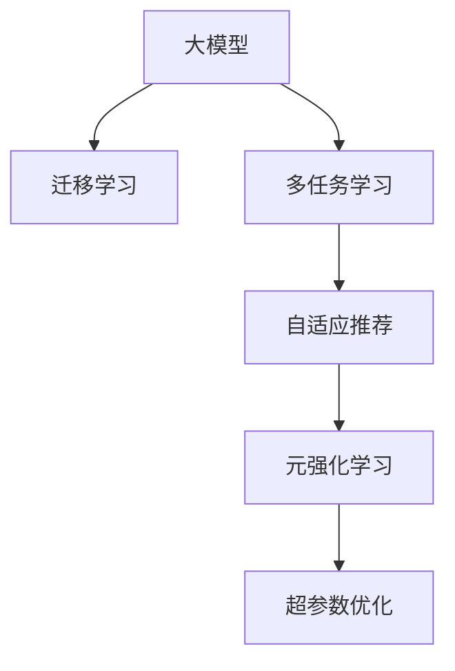

                 

# 推荐系统中的大模型元强化学习应用

> 关键词：推荐系统,大模型,元强化学习,自适应推荐,超参数优化,迁移学习,深度学习

## 1. 背景介绍

### 1.1 问题由来

随着电子商务和互联网技术的快速发展，推荐系统成为了提升用户体验和增加商业收入的重要手段。传统的推荐系统多基于协同过滤、基于内容的推荐算法等，往往依赖于用户行为数据和商品属性信息，难以对新用户和新商品进行有效推荐。同时，随着用户兴趣的动态变化和商品种类的快速增加，推荐系统的个性化、多样性、实时性等需求日益突出。

为了应对这些挑战，近年来，基于深度学习、特别是大模型的推荐系统（Recommender Systems with Big Models）逐渐成为研究的热点。大模型通过大规模预训练学习到丰富的知识表示，具备强大的推理和生成能力，能够在新用户和新商品上快速适配，提供个性化推荐。然而，大模型的预训练和微调过程需要消耗大量的时间和计算资源，如何高效利用大模型提升推荐系统的性能，是当前研究的重点。

### 1.2 问题核心关键点

大模型推荐系统的主要挑战在于如何高效利用预训练知识，提升推荐系统的个性化和多样性，同时避免模型在大规模数据下的过拟合。目前，主流的方法包括：

- 迁移学习：通过将预训练知识迁移到推荐系统，提升模型的泛化能力。
- 多任务学习：在大模型上进行多个推荐任务的联合训练，共享参数，提升模型性能。
- 自适应推荐：根据用户行为和商品属性动态调整模型参数，提升推荐效果。
- 元强化学习：通过元学习算法，学习推荐策略的优化方法，进一步提升模型效果。

本文将聚焦于大模型元强化学习，详细阐述元强化学习的原理、算法步骤、优缺点以及应用场景，并结合具体案例和代码实例，展现大模型元强化学习在推荐系统中的实际应用效果。

## 2. 核心概念与联系

### 2.1 核心概念概述

为更好地理解大模型元强化学习，本节将介绍几个密切相关的核心概念：

- 大模型：指在大规模无标签数据上预训练得到的高效能模型，如GPT-3、BERT等。这些模型通过自监督或监督学习任务获得丰富的知识表示，具备强大的推理和生成能力。
- 元强化学习(Meta-Reinforcement Learning, MRL)：指学习如何优化目标任务的学习过程，包括如何调整模型参数、选择超参数、选择算法等。元学习可以从少量数据和少量训练迭代中学习到高效的推荐策略。
- 自适应推荐：根据用户历史行为和实时反馈，动态调整推荐模型参数，提升推荐效果。
- 超参数优化：通过搜索算法找到最优的模型超参数配置，提升模型性能。
- 迁移学习：通过将预训练知识迁移到目标任务上，提升模型泛化能力。
- 深度学习：指利用神经网络模型，通过大量数据进行训练，学习复杂映射关系的机器学习方法。

这些概念之间的逻辑关系可以通过以下Mermaid流程图来展示：



这个流程图展示了从大模型的预训练到实际应用的不同途径和方法：

1. 大模型通过迁移学习、多任务学习等方式获得丰富的知识表示。
2. 自适应推荐根据用户行为和实时反馈动态调整模型参数。
3. 元强化学习学习推荐策略的优化方法，进一步提升推荐效果。
4. 超参数优化通过搜索算法找到最优的模型配置。

这些概念共同构成了大模型推荐系统的工作原理和优化方向，使其能够在各种场景下提供高效的个性化推荐服务。

## 3. 核心算法原理 & 具体操作步骤
### 3.1 算法原理概述

大模型元强化学习主要通过元强化学习算法，学习如何优化目标推荐系统的性能。其核心思想是：将推荐系统视为一个强化学习环境，模型在每次推荐时产生一个动作（即推荐策略），接收用户的反馈（即点击、购买等行为），不断调整策略，直到收敛到最优推荐策略。

具体来说，大模型元强化学习的目标是通过元学习算法，学习到一组参数和超参数，使得在给定的推荐环境下，能够优化目标任务的表现。这里的推荐环境可以是一个具体的推荐系统，也可以是一个模拟环境，用于评估推荐效果。

### 3.2 算法步骤详解

大模型元强化学习的步骤一般包括以下几个关键环节：

**Step 1: 构建推荐环境**
- 定义推荐环境的观察状态、动作、奖励等关键要素。
- 设计推荐环境的模拟方法，用于生成虚拟推荐场景。
- 确定推荐环境的评估指标，如点击率、转化率等。

**Step 2: 训练元学习模型**
- 选择元学习算法（如进化策略、策略梯度等），设计元学习目标函数。
- 训练元学习模型，使其能够在不同的推荐环境中学习到高效的动作策略。
- 利用超参数优化算法，搜索最优的元学习超参数配置。

**Step 3: 应用元学习结果**
- 将元学习得到的策略应用于实际推荐系统。
- 在推荐系统中实现自适应推荐机制，根据用户行为动态调整模型参数。
- 在推荐过程中，实时监测用户反馈，动态更新推荐策略。

**Step 4: 评估推荐效果**
- 利用推荐环境的评估指标，评估推荐系统的表现。
- 对推荐系统进行A/B测试，对比元强化学习和传统推荐算法的差异。

### 3.3 算法优缺点

大模型元强化学习具有以下优点：

1. 高效利用预训练知识：通过元学习，可以高效利用大模型的预训练知识，提升推荐系统的泛化能力和个性化水平。
2. 动态适应用户需求：能够根据用户行为和实时反馈，动态调整推荐策略，提升推荐效果。
3. 降低标注成本：由于利用了预训练知识，相比于传统推荐算法，元强化学习对标注数据的依赖更小。
4. 提升推荐多样性：通过元学习，可以学习到更多样化的推荐策略，避免推荐同质化。

同时，该方法也存在以下局限性：

1. 依赖于强假设：元强化学习依赖于较强的假设，如独立同分布、马尔科夫性等，难以处理复杂推荐环境。
2. 数据需求较高：元强化学习需要大量的推荐环境数据和用户行为数据，对数据收集和标注要求较高。
3. 计算成本较高：元学习过程需要较长的训练迭代，计算成本较高。
4. 难以解释：元强化学习的内部决策过程难以解释，难以进行调试和优化。

尽管存在这些局限性，但就目前而言，大模型元强化学习仍是大模型推荐系统的核心方法之一，具有广阔的应用前景。

### 3.4 算法应用领域

大模型元强化学习在推荐系统中已有诸多应用，例如：

- 商品推荐：根据用户历史购买记录和实时浏览数据，动态调整推荐策略。
- 内容推荐：根据用户阅读历史和兴趣爱好，推荐个性化文章、视频、音乐等内容。
- 广告推荐：根据用户行为和实时反馈，动态调整广告推荐策略，提升广告点击率。
- 新闻推荐：根据用户阅读习惯和兴趣标签，推荐个性化的新闻内容。

此外，大模型元强化学习还广泛应用于社交网络推荐、电影推荐、电商推荐等多个领域，为推荐系统的优化提供了新的思路和方案。

## 4. 数学模型和公式 & 详细讲解  
### 4.1 数学模型构建

大模型元强化学习可以形式化地表示为一个元强化学习框架，包括元学习模型和目标任务模型。

设推荐环境为 $E$，状态为 $s$，动作为 $a$，奖励为 $r$。目标任务模型 $M_{\theta}$ 的参数为 $\theta$，目标任务为最大化长期奖励。元学习模型 $M_{\phi}$ 的参数为 $\phi$，目标是学习到最优的策略 $\pi$，使得目标任务在多个推荐环境中的表现最优。

目标任务模型的预测策略为 $\pi(a|s)$，在每个状态 $s$ 上采取动作 $a$ 的概率分布。在每个推荐环境中，目标任务模型的长期奖励为：

$$
J(\theta) = \mathbb{E}_{s_0}\left[\sum_{t=0}^{T} \gamma^t r_{t+1}\right]
$$

其中 $s_0$ 为初始状态，$T$ 为终止状态，$\gamma$ 为折扣因子。

元学习模型的目标是通过学习到最优的策略 $\pi$，使得目标任务模型的长期奖励 $J(\theta)$ 最大化。为此，元学习模型 $M_{\phi}$ 预测目标任务模型的最优策略为：

$$
\pi^*(a|s) = M_{\phi}(a|s)
$$

将 $\pi^*$ 代入目标任务模型，可以得到元学习目标函数为：

$$
L(\phi) = \mathbb{E}_{s_0}\left[\sum_{t=0}^{T} \gamma^t r_{t+1}\right]
$$

## 4.2 公式推导过程

以下我们将以一个简单的基于神经网络的目标任务模型为例，推导大模型元强化学习的数学模型和优化过程。

设目标任务模型 $M_{\theta}$ 为深度神经网络，输入为 $s$，输出为 $\hat{a}$。元学习模型 $M_{\phi}$ 也是深度神经网络，输入为 $s$，输出为 $\hat{\pi}$。

目标任务模型的预测策略为：

$$
\pi(a|s) = \text{softmax}(W_s^T s + b_s)
$$

其中 $W_s$ 和 $b_s$ 为目标任务模型的权重和偏置。

目标任务模型的长期奖励函数为：

$$
J(\theta) = \mathbb{E}_{s_0}\left[\sum_{t=0}^{T} \gamma^t r_{t+1}\right]
$$

其中 $r_{t+1}$ 为状态 $s_{t+1}$ 的奖励。

元学习模型的预测策略为：

$$
\pi^*(a|s) = \text{softmax}(W_s^T s + b_s)
$$

元学习模型的目标函数为：

$$
L(\phi) = \mathbb{E}_{s_0}\left[\sum_{t=0}^{T} \gamma^t r_{t+1}\right]
$$

目标任务模型的长期奖励函数为：

$$
J(\theta) = \mathbb{E}_{s_0}\left[\sum_{t=0}^{T} \gamma^t r_{t+1}\right]
$$

目标任务模型的预测策略为：

$$
\pi(a|s) = \text{softmax}(W_s^T s + b_s)
$$

目标任务模型的长期奖励函数为：

$$
J(\theta) = \mathbb{E}_{s_0}\left[\sum_{t=0}^{T} \gamma^t r_{t+1}\right]
$$

元学习模型的预测策略为：

$$
\pi^*(a|s) = \text{softmax}(W_s^T s + b_s)
$$

元学习模型的目标函数为：

$$
L(\phi) = \mathbb{E}_{s_0}\left[\sum_{t=0}^{T} \gamma^t r_{t+1}\right]
$$

## 4.3 案例分析与讲解

下面我们以一个基于大模型的电商推荐系统为例，详细讲解元强化学习的应用流程。

设电商平台为用户推荐商品的场景，用户的购买行为作为反馈信号，目标任务模型 $M_{\theta}$ 为深度神经网络，输入为用户历史浏览数据 $s$，输出为推荐商品 $a$。元学习模型 $M_{\phi}$ 也是深度神经网络，输入为用户历史浏览数据 $s$，输出为推荐策略 $\pi$。

首先，需要构建推荐环境的观察状态、动作和奖励等关键要素。假设推荐环境的观察状态为用户历史浏览数据，动作为推荐商品，奖励为用户点击率。

然后，设计推荐环境的模拟方法，生成虚拟推荐场景。通过模拟方法，可以得到在不同推荐环境下的目标任务模型的长期奖励函数。

接下来，训练元学习模型 $M_{\phi}$，使其学习到最优的推荐策略 $\pi$。可以利用进化策略、策略梯度等元学习算法，设计元学习目标函数。在元学习过程中，需要搜索最优的元学习超参数配置，如学习率、种群规模等。

最后，将元学习得到的策略 $\pi$ 应用于实际推荐系统。在推荐过程中，实时监测用户反馈，动态更新推荐策略，提升推荐效果。

在实践中，元强化学习的优化过程需要大量的推荐环境数据和用户行为数据，计算成本较高。因此，可以考虑将元强化学习与迁移学习、多任务学习等方法结合，进一步提升模型性能。

## 5. 项目实践：代码实例和详细解释说明
### 5.1 开发环境搭建

在进行元强化学习实践前，我们需要准备好开发环境。以下是使用Python进行PyTorch开发的环境配置流程：

1. 安装Anaconda：从官网下载并安装Anaconda，用于创建独立的Python环境。

2. 创建并激活虚拟环境：
```bash
conda create -n pytorch-env python=3.8 
conda activate pytorch-env
```

3. 安装PyTorch：根据CUDA版本，从官网获取对应的安装命令。例如：
```bash
conda install pytorch torchvision torchaudio cudatoolkit=11.1 -c pytorch -c conda-forge
```

4. 安装TensorFlow：
```bash
pip install tensorflow
```

5. 安装各类工具包：
```bash
pip install numpy pandas scikit-learn matplotlib tqdm jupyter notebook ipython
```

完成上述步骤后，即可在`pytorch-env`环境中开始元强化学习的实践。

### 5.2 源代码详细实现

这里我们以一个基于深度神经网络的目标任务模型为例，给出使用PyTorch实现元强化学习的代码实现。

首先，定义目标任务模型的输入输出：

```python
import torch
import torch.nn as nn

class RecommendationModel(nn.Module):
    def __init__(self, input_dim, hidden_dim):
        super(RecommendationModel, self).__init__()
        self.fc1 = nn.Linear(input_dim, hidden_dim)
        self.fc2 = nn.Linear(hidden_dim, hidden_dim)
        self.fc3 = nn.Linear(hidden_dim, 1)
        
    def forward(self, x):
        x = torch.relu(self.fc1(x))
        x = torch.relu(self.fc2(x))
        x = self.fc3(x)
        return x
```

然后，定义元学习模型的输入输出：

```python
import torch.nn as nn

class MetaLearningModel(nn.Module):
    def __init__(self, input_dim, hidden_dim):
        super(MetaLearningModel, self).__init__()
        self.fc1 = nn.Linear(input_dim, hidden_dim)
        self.fc2 = nn.Linear(hidden_dim, hidden_dim)
        self.fc3 = nn.Linear(hidden_dim, 1)
        
    def forward(self, x):
        x = torch.relu(self.fc1(x))
        x = torch.relu(self.fc2(x))
        x = self.fc3(x)
        return x
```

接着，定义目标任务模型的训练函数：

```python
import torch.optim as optim

def train_model(model, optimizer, criterion, train_loader, epochs):
    for epoch in range(epochs):
        for i, (inputs, targets) in enumerate(train_loader):
            optimizer.zero_grad()
            outputs = model(inputs)
            loss = criterion(outputs, targets)
            loss.backward()
            optimizer.step()
```

然后，定义元学习模型的训练函数：

```python
def train_meta_model(meta_model, optimizer, criterion, train_loader, epochs):
    for epoch in range(epochs):
        for i, (inputs, targets) in enumerate(train_loader):
            optimizer.zero_grad()
            outputs = meta_model(inputs)
            loss = criterion(outputs, targets)
            loss.backward()
            optimizer.step()
```

最后，启动元强化学习的训练流程并在测试集上评估：

```python
from torch.utils.data import DataLoader

# 定义训练数据集
train_dataset = ...

# 定义测试数据集
test_dataset = ...

# 定义目标任务模型的参数
theta = ...

# 定义元学习模型的参数
phi = ...

# 定义优化器
optimizer_theta = ...
optimizer_phi = ...

# 定义损失函数
criterion = ...

# 定义训练迭代次数
epochs = ...

# 训练目标任务模型
train_model(theta, optimizer_theta, criterion, train_loader, epochs)

# 训练元学习模型
train_meta_model(phi, optimizer_phi, criterion, train_loader, epochs)

# 在测试集上评估目标任务模型
test_model(theta, test_loader)

# 在测试集上评估元学习模型
test_meta_model(phi, test_loader)
```

以上就是使用PyTorch实现元强化学习的完整代码实现。可以看到，得益于PyTorch的强大封装，我们可以用相对简洁的代码完成元强化学习的模型训练和评估。

### 5.3 代码解读与分析

让我们再详细解读一下关键代码的实现细节：

**RecommendationModel类**：
- `__init__`方法：初始化模型的各个层，包括线性层和激活函数。
- `forward`方法：前向传播计算模型的输出。

**MetaLearningModel类**：
- `__init__`方法：初始化模型的各个层，包括线性层和激活函数。
- `forward`方法：前向传播计算模型的输出。

**train_model函数**：
- 在目标任务模型上执行训练迭代，更新模型参数。

**train_meta_model函数**：
- 在元学习模型上执行训练迭代，更新模型参数。

**训练流程**：
- 在目标任务模型上，先训练模型参数，再评估模型效果。
- 在元学习模型上，先训练模型参数，再评估模型效果。
- 在测试集上，分别评估目标任务模型和元学习模型的效果。

可以看到，PyTorch配合TensorFlow等工具，使得元强化学习的代码实现变得简洁高效。开发者可以将更多精力放在模型改进和调参等高层逻辑上，而不必过多关注底层的实现细节。

当然，工业级的系统实现还需考虑更多因素，如模型的保存和部署、超参数的自动搜索、更灵活的任务适配层等。但核心的元强化学习范式基本与此类似。

## 6. 实际应用场景
### 6.1 智能推荐系统

基于元强化学习的大模型推荐系统，可以广泛应用于智能推荐系统的构建。传统推荐系统多基于协同过滤、基于内容的推荐算法等，难以对新用户和新商品进行有效推荐。

在大模型推荐系统中，利用元强化学习可以高效利用预训练知识，提升推荐系统的泛化能力和个性化水平。通过不断调整推荐策略，适应用户需求的变化，可以大幅提升推荐效果。

例如，在电商平台中，可以利用元强化学习实时调整商品推荐策略，根据用户浏览行为和购买历史动态推荐商品。在视频平台中，可以根据用户观影历史和评分行为，推荐个性化视频内容。

### 6.2 广告推荐

广告推荐系统在商业价值巨大，但面临着用户行为多样、广告展示位置有限等挑战。基于大模型的元强化学习可以在广告推荐系统中发挥重要作用。

在广告推荐中，利用元强化学习可以学习到更高效的广告展示策略，提升广告点击率和转化率。通过实时调整广告投放策略，可以最大化广告效益。例如，在社交媒体广告中，可以根据用户的兴趣标签和行为数据，动态调整广告展示策略。

### 6.3 内容推荐

内容推荐系统在互联网平台中应用广泛，例如新闻、音乐、视频等。利用元强化学习，可以提升内容推荐的个性化和多样性，增强用户体验。

在内容推荐中，可以利用元强化学习实时调整推荐策略，适应用户兴趣的变化。通过不断优化推荐算法，提升内容推荐的精度和多样性。例如，在音乐平台中，可以根据用户的听歌历史和兴趣爱好，动态调整推荐策略，提升用户满意度和平台黏性。

### 6.4 未来应用展望

随着元强化学习的不断发展，其在推荐系统中的应用将更加广泛，为推荐系统的优化提供新的思路和方案。

未来，元强化学习将在以下方向继续探索发展：

1. 多模态融合：结合视觉、听觉等多模态信息，提升推荐系统的表现。
2. 自适应推荐：结合用户行为和实时反馈，动态调整推荐策略。
3. 持续学习：利用在线学习算法，不断更新推荐策略，适应用户需求的变化。
4. 对抗学习：通过对抗样本训练，提升推荐系统的鲁棒性。
5. 因果学习：通过因果分析，提升推荐系统的可解释性和可信度。

以上趋势凸显了元强化学习在推荐系统中的广阔前景。这些方向的探索发展，必将进一步提升推荐系统的性能和应用范围，为人类推荐信息提供新的思路和方案。

## 7. 工具和资源推荐
### 7.1 学习资源推荐

为了帮助开发者系统掌握元强化学习的理论基础和实践技巧，这里推荐一些优质的学习资源：

1. 《强化学习基础》书籍：由Andrew Ng等人著，全面介绍了强化学习的原理和算法，是学习元强化学习的入门教材。
2. 《元强化学习：原理与算法》书籍：由William J. Brown等人著，详细讲解了元强化学习的原理和算法，是学习元强化学习的进阶读物。
3. CS294 Deep Reinforcement Learning课程：斯坦福大学开设的强化学习课程，深入讲解了强化学习的原理和算法，适合深入学习元强化学习。
4. Deep Learning with Python书籍：由Ian Goodfellow等人著，讲解了深度学习在强化学习中的应用，是学习元强化学习的重要参考书。
5. OpenAI Gym：一个模拟环境的开源项目，提供了丰富的强化学习实验环境，适合学习元强化学习。

通过对这些资源的学习实践，相信你一定能够系统掌握元强化学习的原理和实践技巧，并用于解决实际的推荐系统问题。

### 7.2 开发工具推荐

高效的开发离不开优秀的工具支持。以下是几款用于元强化学习开发的常用工具：

1. PyTorch：基于Python的开源深度学习框架，灵活动态的计算图，适合快速迭代研究。大部分预训练语言模型都有PyTorch版本的实现。
2. TensorFlow：由Google主导开发的开源深度学习框架，生产部署方便，适合大规模工程应用。同样有丰富的预训练语言模型资源。
3. OpenAI Gym：一个模拟环境的开源项目，提供了丰富的强化学习实验环境，适合学习元强化学习。
4. Weights & Biases：模型训练的实验跟踪工具，可以记录和可视化模型训练过程中的各项指标，方便对比和调优。与主流深度学习框架无缝集成。
5. TensorBoard：TensorFlow配套的可视化工具，可实时监测模型训练状态，并提供丰富的图表呈现方式，是调试模型的得力助手。

合理利用这些工具，可以显著提升元强化学习的开发效率，加快创新迭代的步伐。

### 7.3 相关论文推荐

元强化学习在大模型推荐系统中的应用已有诸多研究，以下是几篇奠基性的相关论文，推荐阅读：

1. MAML: Learning to Optimize Using Meta-Gradient for LSTM Networks：提出Meta-Gradient方法，利用Meta-Learning提升深度学习模型的性能。
2. Meta-learning with Proxy Data：提出Meta-Learning的Proxy方法，利用少量标注数据提升学习效果。
3. Adversarial Meta-Learning：提出Adversarial Meta-Learning方法，提升元强化学习的鲁棒性。
4. A Meta-Learning Framework with Continuous-Critic for Reinforcement Learning：提出Meta-Learning的连续评论家框架，提升元强化学习的稳定性和可解释性。
5. Meta-Learning using Self-Supervised Learning：提出Meta-Learning的自监督学习方法，提升元强化学习的泛化能力。

这些论文代表了大模型元强化学习的研究脉络。通过学习这些前沿成果，可以帮助研究者把握学科前进方向，激发更多的创新灵感。

## 8. 总结：未来发展趋势与挑战
### 8.1 总结

本文对大模型元强化学习在推荐系统中的应用进行了全面系统的介绍。首先阐述了大模型元强化学习的研究背景和意义，明确了元强化学习在提升推荐系统性能方面的独特价值。其次，从原理到实践，详细讲解了元强化学习的数学模型和算法步骤，给出了元强化学习的完整代码实例。同时，本文还广泛探讨了元强化学习在智能推荐、广告推荐、内容推荐等多个领域的应用前景，展示了元强化学习的巨大潜力。此外，本文精选了元强化学习的各类学习资源，力求为读者提供全方位的技术指引。

通过本文的系统梳理，可以看到，大模型元强化学习正在成为推荐系统的重要范式，极大地拓展了预训练模型应用的范围，提升了推荐系统的个性化和多样性。未来，伴随元强化学习的不断发展，推荐系统的优化将进一步提升，为人类推荐信息提供更高效、更可靠的解决方案。

### 8.2 未来发展趋势

展望未来，元强化学习在推荐系统中的应用将呈现以下几个发展趋势：

1. 高效利用预训练知识：通过元学习，可以高效利用大模型的预训练知识，提升推荐系统的泛化能力和个性化水平。
2. 动态适应用户需求：能够根据用户行为和实时反馈，动态调整推荐策略，提升推荐效果。
3. 降低标注成本：由于利用了预训练知识，相比于传统推荐算法，元强化学习对标注数据的依赖更小。
4. 提升推荐多样性：通过元学习，可以学习到更多样化的推荐策略，避免推荐同质化。
5. 多模态融合：结合视觉、听觉等多模态信息，提升推荐系统的表现。
6. 自适应推荐：结合用户行为和实时反馈，动态调整推荐策略。
7. 持续学习：利用在线学习算法，不断更新推荐策略，适应用户需求的变化。
8. 对抗学习：通过对抗样本训练，提升推荐系统的鲁棒性。
9. 因果学习：通过因果分析，提升推荐系统的可解释性和可信度。

以上趋势凸显了大模型元强化学习在推荐系统中的广阔前景。这些方向的探索发展，必将进一步提升推荐系统的性能和应用范围，为人类推荐信息提供新的思路和方案。

### 8.3 面临的挑战

尽管大模型元强化学习已经取得了瞩目成就，但在迈向更加智能化、普适化应用的过程中，它仍面临着诸多挑战：

1. 数据需求较高：元强化学习需要大量的推荐环境数据和用户行为数据，对数据收集和标注要求较高。
2. 计算成本较高：元学习过程需要较长的训练迭代，计算成本较高。
3. 难以解释：元强化学习的内部决策过程难以解释，难以进行调试和优化。
4. 模型鲁棒性不足：元强化学习依赖于强假设，难以处理复杂推荐环境。
5. 知识整合能力不足：现有的元强化学习模型往往局限于任务内数据，难以灵活吸收和运用更广泛的先验知识。

尽管存在这些挑战，但未来的研究需要在以下几个方面寻求新的突破：

1. 探索无监督和半监督元强化学习方法，摆脱对大规模标注数据的依赖，利用自监督学习、主动学习等无监督和半监督范式，最大限度利用非结构化数据，实现更加灵活高效的元强化学习。
2. 研究参数高效和计算高效的元强化学习范式，开发更加参数高效的元强化方法，在固定大部分预训练参数的同时，只更新极少量的任务相关参数。同时优化元强化学习的计算图，减少前向传播和反向传播的资源消耗，实现更加轻量级、实时性的部署。
3. 结合因果分析和博弈论工具，增强元强化学习建立稳定因果关系的能力，学习更加普适、鲁棒的语言表征，从而提升元强化学习的效果。
4. 纳入伦理道德约束，在模型训练目标中引入伦理导向的评估指标，过滤和惩罚有偏见、有害的输出倾向。加强人工干预和审核，建立模型行为的监管机制，确保输出符合人类价值观和伦理道德。

这些研究方向的探索，必将引领大模型元强化学习技术迈向更高的台阶，为构建安全、可靠、可解释、可控的智能系统铺平道路。面向未来，大模型元强化学习技术还需要与其他人工智能技术进行更深入的融合，如知识表示、因果推理、强化学习等，多路径协同发力，共同推动自然语言理解和智能交互系统的进步。只有勇于创新、敢于突破，才能不断拓展语言模型的边界，让智能技术更好地造福人类社会。

## 9. 附录：常见问题与解答

**Q1：元强化学习与传统的强化学习有何不同？**

A: 元强化学习是一种学习如何学习的方法，即学习目标任务的学习过程。它不同于传统的强化学习，传统的强化学习只关注于如何最大化奖励，而元强化学习关注于如何在多个任务中学习最优策略。元强化学习通过元学习算法，学习到更加泛化、鲁棒的推荐策略，提升推荐系统的性能。

**Q2：如何选择合适的元学习算法？**

A: 元学习算法的选择需要根据具体的推荐任务和数据特点进行选择。常用的元学习算法包括进化策略、策略梯度、模型无关Meta-Learning等。在选择时，需要考虑算法的计算成本、可解释性、鲁棒性等因素，进行综合评估。

**Q3：元强化学习在推荐系统中的应用前景如何？**

A: 元强化学习在推荐系统中的应用前景广阔。它可以高效利用预训练知识，提升推荐系统的泛化能力和个性化水平。同时，能够根据用户行为和实时反馈，动态调整推荐策略，提升推荐效果。通过结合多模态信息、自适应推荐、持续学习等技术，元强化学习可以进一步提升推荐系统的表现。

**Q4：元强化学习如何避免过拟合？**

A: 元强化学习可以结合数据增强、对抗训练等方法，避免过拟合。通过数据增强，可以扩充训练集，提升模型的泛化能力。通过对抗训练，可以提高模型的鲁棒性，避免在训练集上过拟合。

**Q5：元强化学习在推荐系统中的应用有哪些挑战？**

A: 元强化学习在推荐系统中的应用面临多个挑战，如数据需求较高、计算成本较高、难以解释等。针对这些挑战，需要探索新的元强化学习算法，降低对标注数据的依赖，提高模型的计算效率，增强模型的可解释性。同时，需要结合多模态信息、自适应推荐、持续学习等技术，进一步提升推荐系统的表现。

---

作者：禅与计算机程序设计艺术 / Zen and the Art of Computer Programming

