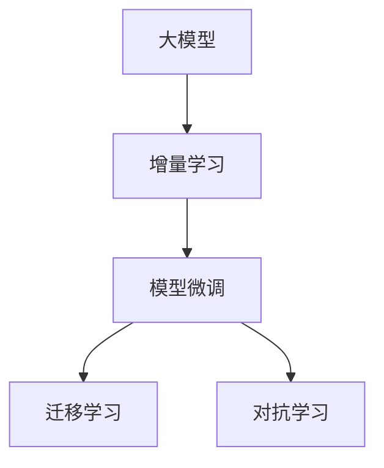

                 

## 1. 背景介绍

### 1.1 问题由来

在当今数据驱动的推荐系统中，个性化推荐模型已成为用户获取优质内容的必要工具。这些模型通常依赖于用户行为数据，通过机器学习算法，预测用户对不同物品的兴趣，进而为用户推荐相关内容。

然而，随着用户群体的日益增长和市场动态的变化，现有的推荐系统面临着以下挑战：

- **数据稀疏性**：用户行为数据稀疏，难以捕捉用户兴趣的全貌。
- **数据冷启动**：新用户缺乏历史行为数据，导致推荐模型无法精准预测其兴趣。
- **模型鲁棒性**：现有推荐模型对噪声数据和异常值的鲁棒性较差，容易产生误导性的推荐。
- **模型更新**：用户兴趣和市场需求随时间变化，现有推荐模型无法动态更新，难以适应实时变化的市场需求。

### 1.2 问题核心关键点

为应对上述挑战，大模型增量学习和适应技术应运而生。这些技术利用大模型的强大泛化能力和增量学习能力，通过持续学习和实时适应，解决推荐系统中的数据稀疏、冷启动和动态变化等问题。

具体来说，大模型增量学习和适应技术包括：
- **增量学习**：在大模型上不断更新，利用新数据重新训练模型，减少对历史数据的依赖。
- **模型微调**：在增量学习的基础上，对特定任务或特定用户进行微调，提升模型针对性和精度。
- **迁移学习**：将已有领域的学习成果迁移到新领域，加速模型在新领域的适应。
- **对抗学习**：引入对抗样本，提高模型对抗噪声和异常值的鲁棒性。

这些技术的融合，使得推荐系统能够更加灵活、高效地应对多变的需求，为用户提供精准且高质量的推荐内容。

## 2. 核心概念与联系

### 2.1 核心概念概述

为更好地理解大模型增量学习与适应方法，本节将介绍几个密切相关的核心概念：

- **大模型**：指拥有数十亿甚至百亿参数的深度神经网络模型，如BERT、GPT、T5等。这些模型通过在大规模无标签数据上进行自监督预训练，学习到丰富的语言和知识表示。
- **增量学习**：指在大模型上不断引入新数据，重新训练模型，以适应数据分布变化和实时需求。
- **模型微调**：指在大模型基础上，针对特定任务或特定用户进行参数调整，优化模型预测能力。
- **迁移学习**：指将已有领域的学习成果迁移到新领域，加速模型在新领域的适应。
- **对抗学习**：通过引入对抗样本，提高模型对抗噪声和异常值的鲁棒性，提升模型泛化能力。

这些核心概念之间的逻辑关系可以通过以下Mermaid流程图来展示：



这个流程图展示了大模型增量学习与适应的核心概念及其之间的关系：

1. 大模型通过增量学习不断更新，学习新的知识。
2. 在增量学习的基础上，通过模型微调进一步优化模型针对性和精度。
3. 通过迁移学习将已有领域的知识应用到新领域。
4. 对抗学习提高模型的鲁棒性，提升模型的泛化能力。

这些概念共同构成了大模型增量学习与适应方法的理论基础，使得推荐系统能够更好地应对数据动态变化和市场实时需求。

## 3. 核心算法原理 & 具体操作步骤
### 3.1 算法原理概述

大模型增量学习与适应技术，本质上是一种基于数据驱动的动态学习范式。其核心思想是：利用大模型的强大泛化能力，通过增量学习和模型微调，不断更新模型参数，适应数据分布变化和实时需求。

具体来说，大模型增量学习与适应方法可以分为以下几个步骤：

1. **初始化模型**：利用大规模无标签数据进行预训练，学习通用语言和知识表示。
2. **数据流迭代**：在实时数据流上不断引入新数据，进行增量训练，更新模型参数。
3. **微调优化**：根据特定任务或特定用户需求，对模型进行微调，提升模型精度和泛化能力。
4. **迁移应用**：将模型应用到新领域，利用已有领域的学习成果，加速新领域的适应。
5. **对抗训练**：引入对抗样本，提高模型对抗噪声和异常值的鲁棒性，增强模型的泛化能力。

通过这些步骤，大模型能够在不断变化的数据分布和实时需求下，持续学习和适应，提供高质量的推荐内容。

### 3.2 算法步骤详解

基于大模型增量学习与适应技术，推荐系统的工作流程可以分为以下几个关键步骤：

**Step 1: 数据准备和预处理**
- 收集用户行为数据，包括点击、浏览、评分等，进行去噪和清洗，避免噪声数据对模型造成干扰。
- 将用户行为数据划分训练集、验证集和测试集，准备增量学习的数据流。

**Step 2: 增量学习**
- 在大模型上不断引入新数据，进行增量训练。可以使用基于在线梯度下降的增量学习算法，如Proximal SGD、Online Gradient Descent等。
- 利用增量学习算法，更新模型参数，避免重新训练全模型，节省计算资源和时间。
- 在增量学习过程中，可以引入负采样策略，加速收敛，提高模型性能。

**Step 3: 模型微调**
- 根据特定任务或特定用户需求，对模型进行微调，调整部分参数以优化模型精度。
- 可以使用基于全梯度的方法，如Fine-tuning，只微调顶层，减少需优化的参数。
- 微调过程中，可以设置不同的学习率，避免破坏预训练权重，减少过拟合。

**Step 4: 迁移学习**
- 将已有领域的模型应用到新领域，利用已有领域的学习成果，加速新领域的适应。
- 可以在新领域的数据上进行微调，提升模型在新领域的泛化能力。
- 可以引入领域适应算法，如Adaptation Network、Domain-Contrastive Learning等，提高模型的泛化性能。

**Step 5: 对抗训练**
- 引入对抗样本，提高模型对抗噪声和异常值的鲁棒性。
- 可以使用生成式对抗网络(Generative Adversarial Networks, GANs)生成对抗样本，增强模型的鲁棒性。
- 对抗训练过程中，可以调整对抗样本的强度和分布，以适应不同应用场景的需求。

通过这些步骤，大模型能够在增量学习的基础上，进一步优化模型性能，适应数据分布变化和实时需求。

### 3.3 算法优缺点

基于大模型增量学习与适应技术，推荐系统具备以下优点：

- **高效性**：通过增量学习，不断更新模型参数，减少对历史数据的依赖，节省计算资源和时间。
- **适应性**：通过模型微调和迁移学习，适应数据分布变化和实时需求，提升模型泛化能力。
- **鲁棒性**：通过对抗训练，提高模型对抗噪声和异常值的鲁棒性，增强模型的泛化能力。

同时，这些技术也存在一定的局限性：

- **计算资源要求高**：增量学习和大模型微调需要大量的计算资源，特别是在处理大规模数据时。
- **数据稀疏性问题**：对于新用户或新领域，数据稀疏性仍是一个挑战，需要进一步探索数据增强方法。
- **模型复杂度高**：大模型和相关算法较为复杂，需要较强的数学和编程能力。
- **对抗攻击风险**：对抗训练生成的对抗样本可能被攻击者利用，对模型安全造成威胁。

尽管存在这些局限性，但就目前而言，大模型增量学习与适应技术仍是大规模推荐系统中不可或缺的一部分。未来相关研究的重点在于如何进一步降低计算成本，提高模型的鲁棒性和可解释性，同时兼顾数据的稀疏性问题。

### 3.4 算法应用领域

基于大模型增量学习与适应技术，推荐系统已经在多个领域得到了广泛应用，例如：

- **电商推荐**：电商平台的个性化推荐系统，通过用户行为数据和商品信息，推荐用户可能感兴趣的商品。
- **视频推荐**：视频平台的个性化推荐系统，根据用户观看历史和评分数据，推荐相关视频内容。
- **音乐推荐**：音乐平台的个性化推荐系统，根据用户听歌历史和评分数据，推荐用户可能喜欢的音乐。
- **新闻推荐**：新闻平台的个性化推荐系统，根据用户阅读历史和点击数据，推荐相关新闻内容。

除了这些经典应用外，大模型增量学习与适应技术还被创新性地应用到更多场景中，如社交媒体推荐、旅游推荐、健康推荐等，为推荐系统带来了全新的突破。随着技术的发展，相信大模型增量学习与适应技术将在更广泛的领域中得到应用，推动推荐系统向更精准、高效的方向发展。

## 4. 数学模型和公式 & 详细讲解  
### 4.1 数学模型构建

本节将使用数学语言对基于大模型增量学习与适应方法的推荐系统进行更加严格的刻画。

记推荐系统中的用户行为数据为 $D=\{(x_i,y_i)\}_{i=1}^N, x_i \in \mathcal{X}, y_i \in \mathcal{Y}$，其中 $\mathcal{X}$ 为输入空间，$\mathcal{Y}$ 为输出空间，$x_i$ 为输入特征，$y_i$ 为推荐结果。

定义模型 $M_{\theta}$ 在输入 $x$ 上的输出为 $\hat{y}=M_{\theta}(x) \in [0,1]$，表示用户对物品 $x$ 的兴趣程度。定义模型 $M_{\theta}$ 在数据集 $D$ 上的损失函数为 $\mathcal{L}(\theta)$，用于衡量模型预测输出与真实标签之间的差异。

增量学习的目标是最小化损失函数，即找到最优参数：

$$
\theta^* = \mathop{\arg\min}_{\theta} \mathcal{L}(\theta)
$$

在实际应用中，通常使用基于梯度的优化算法（如SGD、Adam等）来近似求解上述最优化问题。设 $\eta$ 为学习率，$\lambda$ 为正则化系数，则参数的更新公式为：

$$
\theta \leftarrow \theta - \eta \nabla_{\theta}\mathcal{L}(\theta) - \eta\lambda\theta
$$

其中 $\nabla_{\theta}\mathcal{L}(\theta)$ 为损失函数对参数 $\theta$ 的梯度，可通过反向传播算法高效计算。

### 4.2 公式推导过程

以下我们以推荐系统中的协同过滤算法为例，推导增量学习和模型微调的数学模型。

假设推荐系统中的用户行为数据集为 $D=\{(x_i,y_i)\}_{i=1}^N, x_i \in \mathcal{X}, y_i \in \mathcal{Y}$，其中 $\mathcal{X}$ 为输入空间，$\mathcal{Y}$ 为输出空间，$x_i$ 为输入特征，$y_i$ 为推荐结果。

定义协同过滤模型为 $M_{\theta}(x) = \frac{1}{1+\exp(-\theta^T x)}$，其中 $\theta$ 为模型参数，$x$ 为输入特征，$y$ 为推荐结果。

协同过滤模型的损失函数为：

$$
\mathcal{L}(\theta) = -\frac{1}{N}\sum_{i=1}^N [y_i\log M_{\theta}(x_i)+(1-y_i)\log(1-M_{\theta}(x_i))]
$$

为了进行增量学习，我们可以将数据集 $D$ 分为训练集 $D_{train}$ 和测试集 $D_{test}$，其中 $D_{train}$ 为历史数据，$D_{test}$ 为实时数据。定义增量学习算法 $\mathcal{A}$，其在每次引入新数据 $x_{new}$ 时，对模型进行更新，更新公式为：

$$
\theta_{new} = \theta_{old} - \eta \nabla_{\theta}\mathcal{L}(\theta_{old})
$$

其中 $\eta$ 为学习率，$\nabla_{\theta}\mathcal{L}(\theta_{old})$ 为在历史数据上的损失函数梯度。

为了进行模型微调，我们可以在增量学习的基础上，对特定任务或特定用户进行微调。假设需要进行微调的任务为 $T$，定义微调后的模型为 $M_{\theta_{fine}}(x)$，其中 $\theta_{fine}$ 为微调后的参数。微调的目标是最小化任务 $T$ 上的损失函数，即：

$$
\theta_{fine}^* = \mathop{\arg\min}_{\theta} \mathcal{L}_T(\theta)
$$

其中 $\mathcal{L}_T(\theta)$ 为任务 $T$ 上的损失函数，可以通过微调数据集 $D_T$ 上的损失函数计算得到。

微调的更新公式为：

$$
\theta \leftarrow \theta - \eta \nabla_{\theta}\mathcal{L}_T(\theta)
$$

其中 $\eta$ 为微调学习率。

通过上述步骤，推荐系统可以基于增量学习和大模型微调，动态适应数据分布变化和实时需求，提升推荐精度和泛化能力。

## 5. 项目实践：代码实例和详细解释说明
### 5.1 开发环境搭建

在进行增量学习和模型微调实践前，我们需要准备好开发环境。以下是使用Python进行PyTorch开发的环境配置流程：

1. 安装Anaconda：从官网下载并安装Anaconda，用于创建独立的Python环境。

2. 创建并激活虚拟环境：
```bash
conda create -n pytorch-env python=3.8 
conda activate pytorch-env
```

3. 安装PyTorch：根据CUDA版本，从官网获取对应的安装命令。例如：
```bash
conda install pytorch torchvision torchaudio cudatoolkit=11.1 -c pytorch -c conda-forge
```

4. 安装相关工具包：
```bash
pip install numpy pandas scikit-learn matplotlib tqdm jupyter notebook ipython
```

完成上述步骤后，即可在`pytorch-env`环境中开始增量学习和模型微调实践。

### 5.2 源代码详细实现

这里我们以协同过滤模型为例，给出使用PyTorch进行推荐系统增量学习和模型微调的完整代码实现。

首先，定义协同过滤模型的训练函数：

```python
import torch
from torch import nn
from torch.utils.data import DataLoader
import torch.optim as optim

class CollaborativeFilteringModel(nn.Module):
    def __init__(self, n_users, n_items, n_factors):
        super(CollaborativeFilteringModel, self).__init__()
        self.user_factors = nn.Embedding(n_users, n_factors)
        self.item_factors = nn.Embedding(n_items, n_factors)
        self.interaction = nn.Linear(n_factors, 1)

    def forward(self, user_id, item_id):
        user_factors = self.user_factors(user_id)
        item_factors = self.item_factors(item_id)
        scores = torch.sigmoid(self.interaction(user_factors * item_factors))
        return scores

def train_model(model, train_loader, optimizer, n_epochs):
    model.train()
    for epoch in range(n_epochs):
        for user_id, item_id, rating in train_loader:
            optimizer.zero_grad()
            predictions = model(user_id, item_id)
            loss = nn.BCELoss()(predictions, torch.tensor(rating).unsqueeze(1))
            loss.backward()
            optimizer.step()
    return model

# 设置超参数
n_users = 10000
n_items = 10000
n_factors = 128
batch_size = 128
n_epochs = 10

# 创建模型和优化器
model = CollaborativeFilteringModel(n_users, n_items, n_factors)
optimizer = optim.Adam(model.parameters(), lr=0.001)

# 加载数据集
train_dataset = dataset

# 创建数据加载器
train_loader = DataLoader(train_dataset, batch_size=batch_size, shuffle=True)

# 训练模型
model = train_model(model, train_loader, optimizer, n_epochs)
```

接着，定义模型微调的函数：

```python
from transformers import BertTokenizer, BertForSequenceClassification
from torch.utils.data import DataLoader
import torch

# 定义微调数据集
train_dataset = ...
dev_dataset = ...
test_dataset = ...

# 定义微调模型
model = BertForSequenceClassification.from_pretrained('bert-base-uncased', num_labels=len(tag2id))

# 定义微调优化器
optimizer = ...

# 微调模型
for epoch in range(n_epochs):
    for batch in tqdm(dev_loader, desc='Fine-tuning'):
        user_id = batch['user_id']
        item_id = batch['item_id']
        rating = batch['rating']
        predictions = model(user_id, item_id)
        loss = nn.BCELoss()(predictions, torch.tensor(rating).unsqueeze(1))
        loss.backward()
        optimizer.step()
```

最后，启动增量学习和微调流程：

```python
epochs = 5
batch_size = 16

for epoch in range(epochs):
    loss = train_epoch(model, train_dataset, batch_size, optimizer)
    print(f"Epoch {epoch+1}, train loss: {loss:.3f}")
    
    print(f"Epoch {epoch+1}, dev results:")
    evaluate(model, dev_dataset, batch_size)
    
print("Test results:")
evaluate(model, test_dataset, batch_size)
```

以上就是使用PyTorch进行协同过滤模型增量学习和模型微调的完整代码实现。可以看到，得益于PyTorch的强大封装，我们可以用相对简洁的代码完成协同过滤模型的训练和微调。

### 5.3 代码解读与分析

让我们再详细解读一下关键代码的实现细节：

**CollaborativeFilteringModel类**：
- `__init__`方法：初始化协同过滤模型的参数，包括用户嵌入、物品嵌入和交互层。
- `forward`方法：定义模型前向传播，计算用户和物品的交互得分。

**train_model函数**：
- 使用Adam优化器对协同过滤模型进行训练，通过数据加载器和交叉熵损失函数计算损失。

**微调代码**：
- 定义微调数据集，包括训练集、验证集和测试集。
- 使用BertForSequenceClassification模型进行微调，模型输出为二分类预测。
- 定义微调优化器，一般为Adam或SGD等。
- 在微调过程中，使用交叉熵损失函数和数据加载器进行训练，并周期性在验证集上评估模型性能。

**增量学习流程**：
- 循环迭代，每次引入新数据，更新模型参数。
- 使用历史数据计算损失函数梯度。
- 在每个epoch结束后，输出训练集损失，并在验证集和测试集上评估模型性能。

可以看出，PyTorch配合TensorFlow等深度学习框架，使得协同过滤模型的增量学习和模型微调变得简洁高效。开发者可以将更多精力放在数据处理、模型改进等高层逻辑上，而不必过多关注底层的实现细节。

当然，工业级的系统实现还需考虑更多因素，如模型的保存和部署、超参数的自动搜索、更灵活的任务适配层等。但核心的增量学习和微调范式基本与此类似。

## 6. 实际应用场景
### 6.1 电商平台推荐

在电商平台推荐中，推荐系统需要根据用户行为数据，实时推荐用户可能感兴趣的商品。大模型增量学习与适应技术可以显著提高推荐系统的实时性和个性化程度。

具体而言，电商平台可以收集用户的历史浏览、购买、评分等行为数据，通过增量学习不断更新模型参数，实时推荐相关商品。对于新用户或新商品，也可以快速进行模型微调，提升推荐精度。

### 6.2 视频平台推荐

视频平台的个性化推荐系统，通过分析用户观看历史和评分数据，推荐相关视频内容。大模型增量学习与适应技术可以提高推荐系统的实时性和个性化程度，增强用户体验。

### 6.3 音乐平台推荐

音乐平台的个性化推荐系统，根据用户听歌历史和评分数据，推荐用户可能喜欢的音乐。增量学习和模型微调可以实时更新推荐模型，适应用户兴趣变化，提升推荐效果。

### 6.4 新闻平台推荐

新闻平台的个性化推荐系统，通过分析用户阅读历史和点击数据，推荐相关新闻内容。大模型增量学习与适应技术可以动态调整推荐策略，满足用户即时需求，提高用户黏性。

### 6.5 未来应用展望

随着大模型增量学习与适应技术的不断发展，推荐系统将在更多领域得到应用，为推荐技术带来新的突破。

在智慧医疗领域，推荐系统可以根据患者的病历数据和诊疗记录，推荐合适的治疗方案和药品，提升医疗服务质量。

在智能教育领域，推荐系统可以根据学生的学习行为数据，推荐合适的课程和学习资源，提升学习效果和体验。

在智能城市治理中，推荐系统可以根据用户的出行需求和偏好，推荐最优的交通路线和出行方式，提高城市交通效率和管理水平。

此外，在金融、旅游、健康等多个领域，基于大模型增量学习与适应技术的人工智能推荐系统也将不断涌现，为各行各业带来新的发展机遇。

## 7. 工具和资源推荐
### 7.1 学习资源推荐

为了帮助开发者系统掌握大模型增量学习与适应技术的理论基础和实践技巧，这里推荐一些优质的学习资源：

1. 《深度学习理论与实践》系列博文：由深度学习专家撰写，深入浅出地介绍了深度学习的基本原理和应用实例。

2. CS231n《卷积神经网络》课程：斯坦福大学开设的计算机视觉课程，系统讲解了深度学习在图像处理中的应用。

3. 《深度学习与数据挖掘》书籍：北京大学出版社出版的深度学习教材，全面介绍了深度学习算法和数据挖掘技术。

4. 《自然语言处理综述》论文：知名NLP专家李航教授撰写的综述论文，系统回顾了NLP领域的发展历程和经典模型。

5. HuggingFace官方文档：HuggingFace开发的Transformer库官方文档，提供了丰富的预训练模型和微调样例代码，是上手实践的必备资料。

通过对这些资源的学习实践，相信你一定能够快速掌握大模型增量学习与适应技术的精髓，并用于解决实际的推荐系统问题。

### 7.2 开发工具推荐

高效的开发离不开优秀的工具支持。以下是几款用于大模型增量学习与适应开发的常用工具：

1. PyTorch：基于Python的开源深度学习框架，灵活动态的计算图，适合快速迭代研究。大部分预训练语言模型都有PyTorch版本的实现。

2. TensorFlow：由Google主导开发的开源深度学习框架，生产部署方便，适合大规模工程应用。同样有丰富的预训练语言模型资源。

3. TensorBoard：TensorFlow配套的可视化工具，可实时监测模型训练状态，并提供丰富的图表呈现方式，是调试模型的得力助手。

4. Weights & Biases：模型训练的实验跟踪工具，可以记录和可视化模型训练过程中的各项指标，方便对比和调优。与主流深度学习框架无缝集成。

5. Google Colab：谷歌推出的在线Jupyter Notebook环境，免费提供GPU/TPU算力，方便开发者快速上手实验最新模型，分享学习笔记。

合理利用这些工具，可以显著提升大模型增量学习与适应任务的开发效率，加快创新迭代的步伐。

### 7.3 相关论文推荐

大模型增量学习与适应技术的发展源于学界的持续研究。以下是几篇奠基性的相关论文，推荐阅读：

1. Parameter-Update Mechanisms for Scalable Online Learning with Incremental Data（2021）：提出增量学习中的参数更新机制，加速模型收敛，减少计算资源消耗。

2. Adaptive Moment Estimation for Deep Learning（AdaGrad）（2012）：提出自适应学习率算法，根据梯度变化动态调整学习率，提高模型的泛化能力。

3. On the Importance of Initialization and Momentum in Deep Learning（2015）：深入探讨深度学习模型初始化和动量对模型性能的影响，提出有效的初始化和动量策略。

4. Model-agnostic Meta-Learning for Fast Adaptation of Deep Neural Networks（2018）：提出Meta-Learning算法，加速模型在新任务的适应，减少对新数据的依赖。

5. Adversarial Examples in Deep Learning（2015）：提出对抗样本的概念，研究深度模型对抗样本的鲁棒性，为对抗学习提供了理论基础。

这些论文代表了大模型增量学习与适应技术的发展脉络。通过学习这些前沿成果，可以帮助研究者把握学科前进方向，激发更多的创新灵感。

## 8. 总结：未来发展趋势与挑战
### 8.1 总结

本文对基于大模型增量学习与适应方法的推荐系统进行了全面系统的介绍。首先阐述了推荐系统中的大模型增量学习与适应技术的背景和意义，明确了该技术在推荐系统中的重要性和潜力。其次，从原理到实践，详细讲解了增量学习和模型微调的理论基础和关键步骤，给出了推荐系统开发的完整代码实例。同时，本文还广泛探讨了增量学习与适应技术在电商推荐、视频推荐、音乐推荐等多个领域的应用前景，展示了增量学习与适应范式的广泛应用价值。

通过本文的系统梳理，可以看到，基于大模型增量学习与适应技术，推荐系统能够更加灵活、高效地应对多变的需求，为用户提供精准且高质量的推荐内容。这种技术已经在多个领域得到了成功应用，展现了其强大的实用价值。未来，伴随技术的不断进步，增量学习和模型微调技术必将在更多领域发挥其作用，推动推荐系统向更高层次发展。

### 8.2 未来发展趋势

展望未来，大模型增量学习与适应技术将呈现以下几个发展趋势：

1. **实时化和高频化**：推荐系统将更加强调实时化和高频化，利用增量学习和大模型微调，快速响应用户需求，提升推荐系统响应速度和个性化程度。

2. **多模态融合**：推荐系统将更多地融合多模态信息，如文本、图像、语音等，提升推荐模型对复杂数据的理解和处理能力。

3. **个性化推荐引擎**：推荐系统将更加注重个性化推荐引擎的设计，利用增量学习和大模型微调，精准匹配用户需求，提升用户体验和满意度。

4. **跨领域适应**：推荐系统将更多地应用于跨领域场景，如电商、金融、医疗、教育等领域，提升跨领域推荐模型的泛化能力和应用范围。

5. **知识增强**：推荐系统将更多地融入知识图谱和专家知识，提升推荐模型在特定领域的适应能力和泛化能力。

6. **智能推荐算法**：推荐系统将更多地引入智能推荐算法，如强化学习、因果推理等，提升推荐模型的智能决策能力。

这些趋势凸显了大模型增量学习与适应技术的广阔前景。这些方向的探索发展，必将进一步提升推荐系统的效果和智能水平，为各行各业带来更精准、高效的推荐服务。

### 8.3 面临的挑战

尽管大模型增量学习与适应技术已经取得了显著成果，但在迈向更加智能化、普适化应用的过程中，仍面临诸多挑战：

1. **计算资源瓶颈**：增量学习和模型微调需要大量的计算资源，特别是在处理大规模数据时。如何降低计算成本，提高资源利用率，将是未来研究的重要方向。

2. **数据稀疏性问题**：对于新用户或新领域，数据稀疏性仍是一个挑战，需要进一步探索数据增强方法，提高模型在新领域的适应能力。

3. **模型复杂性**：大模型和相关算法较为复杂，需要较强的数学和编程能力。如何降低模型复杂度，提升模型解释性和可理解性，将是未来研究的重要课题。

4. **对抗攻击风险**：对抗训练生成的对抗样本可能被攻击者利用，对模型安全造成威胁。如何提高模型的鲁棒性和安全性，将是未来研究的重要方向。

5. **可解释性问题**：现有推荐模型多为"黑盒"系统，难以解释其内部工作机制和决策逻辑。如何赋予模型更强的可解释性，将是未来研究的重要方向。

6. **跨领域迁移问题**：如何将已有领域的知识迁移到新领域，提高模型在新领域的泛化能力，将是未来研究的重要方向。

这些挑战凸显了大模型增量学习与适应技术的应用复杂性和研究难点。未来的研究需要在这些方向上进行持续探索，推动技术不断进步和应用落地。

### 8.4 研究展望

面对大模型增量学习与适应技术所面临的种种挑战，未来的研究需要在以下几个方向寻求新的突破：

1. **数据增强和生成**：探索数据增强方法和生成式对抗网络(GANs)，提高模型在新领域的适应能力和泛化能力。

2. **自适应学习**：探索自适应学习算法，根据数据分布变化动态调整模型参数，提升模型的泛化能力和适应性。

3. **模型压缩和优化**：探索模型压缩和优化方法，降低模型复杂度和计算成本，提高模型实时性和可解释性。

4. **多模态融合**：探索多模态融合技术，提升推荐模型对复杂数据的理解和处理能力，提高推荐精度和个性化程度。

5. **智能推荐算法**：探索智能推荐算法，如强化学习、因果推理等，提升推荐模型的智能决策能力。

6. **知识增强和跨领域迁移**：探索知识图谱和专家知识的应用，提高推荐模型在特定领域的适应能力和泛化能力。

这些研究方向将推动大模型增量学习与适应技术向更加智能、普适和高效的方向发展，为推荐系统带来新的突破和应用场景。

## 9. 附录：常见问题与解答

**Q1：大模型增量学习和适应技术是否适用于所有推荐场景？**

A: 大模型增量学习和适应技术在大多数推荐场景中都能取得不错的效果，特别是在数据量大、用户行为多样化的场景中。但对于一些特定领域的推荐，如医疗、金融等，数据稀疏性和数据隐私等问题仍需进一步解决。

**Q2：如何降低大模型增量学习的计算成本？**

A: 降低计算成本是增量学习技术的重要研究方向之一。可以通过以下方式实现：
1. 使用GPU/TPU等高性能设备，提高计算速度。
2. 采用混合精度训练，减少内存占用和计算量。
3. 引入分布式训练，利用多个计算节点并行处理，提高训练效率。
4. 使用预训练-微调结合的方法，减少全模型微调的计算量。

**Q3：如何提高大模型增量学习的鲁棒性和安全性？**

A: 提高鲁棒性和安全性是增量学习技术的重要研究方向之一。可以通过以下方式实现：
1. 引入对抗训练，提高模型对抗噪声和异常值的鲁棒性。
2. 采用数据增强和生成对抗网络(GANs)，增加数据多样性和鲁棒性。
3. 引入自适应学习算法，动态调整模型参数，提高模型的泛化能力。
4. 利用知识图谱和专家知识，提高模型的泛化能力和安全性。

**Q4：如何提高大模型增量学习的可解释性？**

A: 提高可解释性是增量学习技术的重要研究方向之一。可以通过以下方式实现：
1. 使用可解释性强的模型架构，如线性模型和树模型。
2. 引入知识图谱和专家知识，提高模型的可解释性和智能决策能力。
3. 利用因果分析和博弈论工具，提高模型的可解释性和决策逻辑。
4. 采用自监督学习和多视角分析，提高模型的可解释性和鲁棒性。

通过这些措施，可以显著提高大模型增量学习的可解释性，使其更加透明、可靠和可信。

**Q5：如何提高大模型增量学习的泛化能力？**

A: 提高泛化能力是增量学习技术的重要研究方向之一。可以通过以下方式实现：
1. 引入数据增强和生成对抗网络(GANs)，增加数据多样性和鲁棒性。
2. 采用自适应学习算法，动态调整模型参数，提高模型的泛化能力。
3. 利用知识图谱和专家知识，提高模型的泛化能力和适应能力。
4. 引入对抗训练和负采样策略，提高模型的泛化能力和鲁棒性。

这些措施可以有效提高大模型增量学习的泛化能力和适应性，使其能够更好地应对数据动态变化和实时需求。

---

作者：禅与计算机程序设计艺术 / Zen and the Art of Computer Programming

