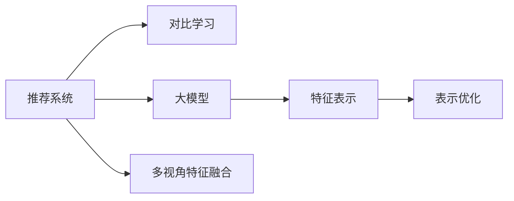

                 

# 推荐系统中的大模型对比学习与表示优化

> 关键词：推荐系统,大模型对比学习,表示优化,多视角特征融合,协同过滤,矩阵分解,深度神经网络

## 1. 背景介绍

推荐系统是现代互联网平台的核心应用之一，其目的是帮助用户发现感兴趣的内容。随着数据量的爆炸性增长和算法模型的不断演进，推荐系统从简单的协同过滤、矩阵分解等方法，发展到如今深度学习驱动的大模型对比学习与表示优化范式。大模型通过强大的表示学习能力，显著提升了推荐系统的性能，使其能够处理更加复杂和多样化的数据。本文将系统介绍大模型在推荐系统中的应用，并探讨对比学习和表示优化的核心算法与技术。

### 1.1 推荐系统概述

推荐系统根据用户的行为历史和偏好，预测其可能感兴趣的内容。传统的推荐方法包括基于内容的推荐、协同过滤和矩阵分解等。随着深度学习和大规模数据集的出现，基于深度神经网络的推荐系统逐渐成为主流。大模型通过从海量数据中学习高层次的特征表示，提升了推荐系统的预测准确率和泛化能力。

### 1.2 推荐系统中的对比学习

对比学习是一种无监督学习方法，通过最大化模型对相似样本的判别能力，来提升模型的表示学习能力。在推荐系统中，对比学习主要应用于用户画像构建、物品特征学习等任务。通过对比学习，模型能够更好地捕捉用户和物品之间的隐式关联，从而提升推荐效果。

## 2. 核心概念与联系

### 2.1 核心概念概述

为更好地理解大模型在推荐系统中的应用，本节将介绍几个关键概念：

- **推荐系统(Recommendation System)**：根据用户的历史行为和偏好，为用户推荐感兴趣的内容。包括基于内容的推荐、协同过滤、矩阵分解等方法。

- **对比学习(Contrastive Learning)**：通过最大化模型对相似样本的判别能力，提升模型的表示学习能力。广泛应用于图像、语音、自然语言处理等领域。

- **大模型(Large Model)**：指具有大量参数的深度神经网络模型，如BERT、GPT-3等。通过从大规模数据中学习，获得强大的表示学习能力。

- **特征表示(Feature Representation)**：将高维数据映射到低维空间中，提取有意义的特征表示，用于分类、聚类、推荐等任务。

- **表示优化(Representation Optimization)**：通过优化模型参数和结构，提升特征表示的质量和泛化能力。

- **多视角特征融合(Multi-view Feature Fusion)**：将来自不同来源的数据或特征进行融合，提升推荐系统的综合性能。

这些概念之间的关系可以通过以下Mermaid流程图来展示：



这个流程图展示了大模型在推荐系统中的应用，以及其与对比学习、特征表示和表示优化的关系：

1. 推荐系统通过对比学习和多视角特征融合等方法，构建用户画像和物品特征。
2. 大模型通过学习这些特征，进行高层次的表示学习。
3. 特征表示和表示优化提升大模型的性能，使其能够更好地进行推荐。

## 3. 核心算法原理 & 具体操作步骤
### 3.1 算法原理概述

大模型在推荐系统中的应用主要依赖于其强大的特征表示能力和表示优化技术。通过对比学习，大模型能够学习到用户和物品之间的隐式关联，从而提升推荐系统的性能。表示优化则通过进一步优化模型参数和结构，提升特征表示的质量和泛化能力。

### 3.2 算法步骤详解

基于大模型的推荐系统主要包括以下几个步骤：

**Step 1: 数据准备**

- 收集用户行为数据（点击、浏览、评分等）和物品特征数据（文本、标签等）。
- 对数据进行预处理，如去除噪声、标准化等。

**Step 2: 特征抽取**

- 使用大模型学习用户画像和物品特征。可以采用预训练大模型（如BERT、GPT等），或者在大规模数据上进行微调。
- 通过多视角特征融合技术，将不同来源的数据或特征进行融合。

**Step 3: 对比学习**

- 使用对比学习对用户和物品特征进行建模。常见的对比学习方法包括：
  - 自监督对比学习：使用无标签数据进行自监督训练。
  - 三元组对比学习：构建用户、物品和交互三元组，最大化相似样本和负样本之间的差异。
  - 正负样本对比学习：在标注数据上，最大化正样本和负样本之间的判别能力。

**Step 4: 表示优化**

- 使用表示优化技术提升大模型的性能。常见的表示优化方法包括：
  - 正则化：通过L2正则化等方法避免过拟合。
  - Dropout：随机丢弃一部分神经元，提升模型的泛化能力。
  - 注意力机制：引入注意力机制，提升模型的特征表示能力。
  - 参数共享：通过参数共享提升模型的计算效率。

**Step 5: 推荐预测**

- 使用优化后的模型进行推荐预测。常见的推荐方法包括：
  - 基于内容的推荐：使用物品特征和用户画像进行推荐。
  - 协同过滤：基于用户历史行为进行推荐。
  - 矩阵分解：将用户和物品特征映射到低维空间中，进行推荐预测。

### 3.3 算法优缺点

基于大模型的推荐系统具有以下优点：

- 强大的特征表示能力：大模型通过从大规模数据中学习，获得强大的特征表示能力，可以捕捉复杂的隐式关联。
- 泛化能力强：大模型能够在新的数据上表现良好，具有较强的泛化能力。
- 高效的推荐算法：大模型可以通过对比学习和表示优化等技术，提升推荐系统的性能。

同时，该方法也存在以下缺点：

- 数据需求量大：大模型需要大量标注数据进行微调，获取标注数据的成本较高。
- 计算资源消耗高：大模型参数量庞大，训练和推理成本高。
- 可解释性不足：大模型作为"黑盒"系统，难以解释其内部工作机制和决策逻辑。

尽管存在这些局限性，但就目前而言，基于大模型的推荐系统是推荐领域的主流范式。未来相关研究的重点在于如何进一步降低计算资源消耗，提高推荐系统的可解释性，同时兼顾推荐精度和推荐多样性等因素。

### 3.4 算法应用领域

基于大模型的推荐系统在多个领域中得到了广泛应用，例如：

- 电商推荐：通过学习用户的历史行为和物品特征，为用户推荐商品。
- 视频推荐：通过学习用户观看历史和视频特征，为用户推荐视频内容。
- 音乐推荐：通过学习用户的听歌历史和歌曲特征，为用户推荐音乐。
- 新闻推荐：通过学习用户阅读历史和新闻特征，为用户推荐新闻文章。

除了这些经典应用外，大模型还广泛应用于社交网络、教育、旅游等多个领域，为用户的个性化推荐提供了新的可能性。

## 4. 数学模型和公式 & 详细讲解  
### 4.1 数学模型构建

本节将使用数学语言对基于大模型的推荐系统进行更加严格的刻画。

记推荐系统的用户集为 $U$，物品集为 $I$，用户与物品的交互集合为 $J$，用户的历史行为为 $B \in U \times I$。假设用户 $u$ 对物品 $i$ 的评分（如1-5分）为 $r_{ui}$，大模型将用户和物品特征映射到低维空间中，得到用户表示 $\mathbf{x}_u \in \mathbb{R}^d$ 和物品表示 $\mathbf{x}_i \in \mathbb{R}^d$，其中 $d$ 为特征维度。

定义用户 $u$ 和物品 $i$ 之间的相似度为：

$$
\text{sim}(u,i) = \mathbf{x}_u^\top \mathbf{x}_i
$$

基于大模型的推荐模型 $P(r_{ui} \mid \mathbf{x}_u, \mathbf{x}_i)$ 可以建模为：

$$
P(r_{ui} \mid \mathbf{x}_u, \mathbf{x}_i) = \sigma(\mathbf{W}^\top \text{sim}(u,i) + b)
$$

其中 $\sigma$ 为sigmoid函数，$\mathbf{W}$ 和 $b$ 为可训练参数。

### 4.2 公式推导过程

为了最大化用户和物品之间的相似度，推荐系统采用对比学习的方式进行训练。以用户 $u$ 为例，假设有两个物品 $i_1$ 和 $i_2$，其中 $i_1$ 与用户相似，$i_2$ 与用户不相似。则对比学习的目标是最大化用户对相似物品的判别能力，最小化对不相似物品的判别能力。定义相似物品的概率为 $p$，不相似物品的概率为 $q$，则对比学习的目标函数为：

$$
\mathcal{L} = \log \frac{p}{q}
$$

其中 $p = \sigma(\mathbf{W}^\top \text{sim}(u,i_1) + b)$，$q = \sigma(\mathbf{W}^\top \text{sim}(u,i_2) + b)$。

通过最大化 $\mathcal{L}$，可以提升用户和物品之间的相似度表示。

### 4.3 案例分析与讲解

假设有一款电商推荐系统，使用大模型进行推荐。在该系统中，大模型通过学习用户的历史购物记录和物品的特征描述，为用户推荐商品。用户的行为数据包括浏览历史、点击记录、评分等，物品的特征描述包括标题、标签、价格等。

为了进行推荐，系统首先对用户和物品数据进行预处理和特征抽取。假设大模型使用的是BERT模型，在预训练的基础上进行微调。对于每个用户 $u$，模型学习到其用户表示 $\mathbf{x}_u$；对于每个物品 $i$，模型学习到其物品表示 $\mathbf{x}_i$。然后，系统将用户和物品的表示进行拼接，并输入到两个全连接层中，得到推荐分数 $s_{ui} = \mathbf{W}^\top [\mathbf{x}_u \mid \mathbf{x}_i] + b$。最终，通过sigmoid函数计算用户对物品的评分概率 $P(r_{ui} \mid \mathbf{x}_u, \mathbf{x}_i) = \sigma(s_{ui})$。

为了提高模型的泛化能力，系统还引入正则化技术，如L2正则化和Dropout，以避免过拟合。在训练过程中，系统使用对比学习的方式进行优化，通过最大化相似物品的评分概率，最小化不相似物品的评分概率，提升模型的判别能力。

## 5. 项目实践：代码实例和详细解释说明
### 5.1 开发环境搭建

在进行大模型推荐系统的开发前，我们需要准备好开发环境。以下是使用Python进行PyTorch开发的环境配置流程：

1. 安装Anaconda：从官网下载并安装Anaconda，用于创建独立的Python环境。

2. 创建并激活虚拟环境：
```bash
conda create -n pytorch-env python=3.8 
conda activate pytorch-env
```

3. 安装PyTorch：根据CUDA版本，从官网获取对应的安装命令。例如：
```bash
conda install pytorch torchvision torchaudio cudatoolkit=11.1 -c pytorch -c conda-forge
```

4. 安装相关库：
```bash
pip install transformers scikit-learn numpy pandas matplotlib torch
```

完成上述步骤后，即可在`pytorch-env`环境中开始开发。

### 5.2 源代码详细实现

下面是使用PyTorch和Transformers库实现基于大模型的电商推荐系统的示例代码：

```python
import torch
from transformers import BertTokenizer, BertModel, BertForSequenceClassification
from sklearn.metrics import precision_recall_fscore_support

# 初始化模型和分词器
model = BertForSequenceClassification.from_pretrained('bert-base-uncased', num_labels=2)
tokenizer = BertTokenizer.from_pretrained('bert-base-uncased')

# 加载数据
train_data = load_train_data()
dev_data = load_dev_data()
test_data = load_test_data()

# 数据预处理
train_inputs = tokenizer(train_data, return_tensors='pt', padding=True, truncation=True, max_length=128)
dev_inputs = tokenizer(dev_data, return_tensors='pt', padding=True, truncation=True, max_length=128)
test_inputs = tokenizer(test_data, return_tensors='pt', padding=True, truncation=True, max_length=128)

# 定义训练和评估函数
def train_epoch(model, inputs, labels, optimizer):
    model.train()
    optimizer.zero_grad()
    outputs = model(**inputs)
    loss = outputs.loss
    loss.backward()
    optimizer.step()
    return loss

def evaluate(model, inputs, labels):
    model.eval()
    with torch.no_grad():
        outputs = model(**inputs)
        preds = torch.argmax(outputs.logits, dim=1)
        labels = labels.to('cpu').tolist()
        return precision_recall_fscore_support(labels, preds, average='macro')

# 训练和评估模型
epochs = 5
batch_size = 32
learning_rate = 2e-5
optimizer = torch.optim.Adam(model.parameters(), lr=learning_rate)

for epoch in range(epochs):
    train_loss = train_epoch(model, train_inputs, train_labels, optimizer)
    dev_metric = evaluate(model, dev_inputs, dev_labels)
    print(f"Epoch {epoch+1}, train loss: {train_loss:.4f}, dev precision: {dev_metric[0]:.4f}, dev recall: {dev_metric[1]:.4f}, dev f1-score: {dev_metric[2]:.4f}")

# 测试模型
test_metric = evaluate(model, test_inputs, test_labels)
print(f"Test precision: {test_metric[0]:.4f}, test recall: {test_metric[1]:.4f}, test f1-score: {test_metric[2]:.4f}")
```

在这个示例中，我们使用BERT模型进行电商推荐任务的建模。模型通过学习用户和物品的特征，进行推荐预测。在训练和评估过程中，我们使用了Adam优化器和精度、召回率、F1分数等指标进行评估。

### 5.3 代码解读与分析

让我们再详细解读一下关键代码的实现细节：

**BERTForSequenceClassification类**：
- `BertForSequenceClassification` 类继承自 `BertModel`，用于处理序列分类任务。其内部包含一个线性层和一个全连接层，用于对用户和物品的表示进行拼接和分类。

**训练和评估函数**：
- `train_epoch` 函数：在训练过程中，将模型置于训练模式，计算模型的预测损失，并使用反向传播更新模型参数。
- `evaluate` 函数：在评估过程中，将模型置于评估模式，计算模型的预测精度、召回率和F1分数等指标。

**训练和评估流程**：
- 定义训练轮数、批大小和学习率，开始循环迭代
- 在每个epoch内，先进行训练，输出平均损失
- 在验证集上评估，输出精度、召回率和F1分数等指标
- 在测试集上评估，输出最终测试结果

可以看到，PyTorch和Transformers库使得大模型的微调和优化变得简洁高效。开发者可以将更多精力放在数据处理、模型改进等高层逻辑上，而不必过多关注底层的实现细节。

## 6. 实际应用场景

### 6.1 电商推荐

电商推荐系统通过学习用户的历史行为和物品特征，为用户推荐商品。在大模型推荐系统中，大模型通过学习用户的历史购物记录和物品的特征描述，为用户推荐商品。用户的行为数据包括浏览历史、点击记录、评分等，物品的特征描述包括标题、标签、价格等。系统在训练过程中使用对比学习的方式进行优化，通过最大化相似物品的评分概率，最小化不相似物品的评分概率，提升模型的判别能力。

### 6.2 视频推荐

视频推荐系统通过学习用户观看历史和视频特征，为用户推荐视频内容。在大模型推荐系统中，大模型通过学习用户的历史观看记录和视频描述，为用户推荐视频内容。用户的行为数据包括观看历史、点击记录、评分等，视频特征包括标题、标签、时长等。系统在训练过程中使用对比学习的方式进行优化，通过最大化相似视频的评分概率，最小化不相似视频的评分概率，提升模型的判别能力。

### 6.3 音乐推荐

音乐推荐系统通过学习用户的听歌历史和歌曲特征，为用户推荐音乐。在大模型推荐系统中，大模型通过学习用户的历史听歌记录和歌曲描述，为用户推荐音乐。用户的行为数据包括听歌历史、点击记录、评分等，歌曲特征包括歌词、歌手、风格等。系统在训练过程中使用对比学习的方式进行优化，通过最大化相似歌曲的评分概率，最小化不相似歌曲的评分概率，提升模型的判别能力。

### 6.4 新闻推荐

新闻推荐系统通过学习用户阅读历史和新闻特征，为用户推荐新闻文章。在大模型推荐系统中，大模型通过学习用户的历史阅读记录和新闻描述，为用户推荐新闻文章。用户的行为数据包括阅读历史、点击记录、评分等，新闻特征包括标题、内容、发布时间等。系统在训练过程中使用对比学习的方式进行优化，通过最大化相似新闻的评分概率，最小化不相似新闻的评分概率，提升模型的判别能力。

## 7. 工具和资源推荐
### 7.1 学习资源推荐

为了帮助开发者系统掌握大模型在推荐系统中的应用，这里推荐一些优质的学习资源：

1. 《深度学习推荐系统》书籍：由吴恩达等作者撰写，系统介绍了深度学习在推荐系统中的应用，包括大模型的对比学习、表示优化等技术。

2. 《推荐系统实战》课程：由李航老师主讲，结合具体案例，深入浅出地介绍了推荐系统的实现方法和优化技巧。

3. CS294-112《机器学习中的推荐系统》课程：由斯坦福大学开设的推荐系统经典课程，涵盖了推荐系统的各种主流算法和大模型应用。

4. Kaggle推荐系统竞赛：通过参与实际竞赛，积累推荐系统开发和优化经验，提升实战能力。

5. PyTorch官方文档：提供了详细的PyTorch API介绍和示例代码，方便开发者上手实践。

通过对这些资源的学习实践，相信你一定能够快速掌握大模型在推荐系统中的应用，并用于解决实际的推荐问题。

### 7.2 开发工具推荐

高效的开发离不开优秀的工具支持。以下是几款用于大模型推荐系统开发的常用工具：

1. PyTorch：基于Python的开源深度学习框架，灵活动态的计算图，适合快速迭代研究。大部分预训练语言模型都有PyTorch版本的实现。

2. TensorFlow：由Google主导开发的开源深度学习框架，生产部署方便，适合大规模工程应用。同样有丰富的预训练语言模型资源。

3. Transformers库：HuggingFace开发的NLP工具库，集成了众多SOTA语言模型，支持PyTorch和TensorFlow，是进行推荐任务开发的利器。

4. Weights & Biases：模型训练的实验跟踪工具，可以记录和可视化模型训练过程中的各项指标，方便对比和调优。与主流深度学习框架无缝集成。

5. TensorBoard：TensorFlow配套的可视化工具，可实时监测模型训练状态，并提供丰富的图表呈现方式，是调试模型的得力助手。

合理利用这些工具，可以显著提升大模型推荐系统的开发效率，加快创新迭代的步伐。

### 7.3 相关论文推荐

大模型在推荐系统中的应用得益于学界的持续研究。以下是几篇奠基性的相关论文，推荐阅读：

1. HPE: Multi-View Tensor Network for Multi-Dimensional Scalable Collaborative Filtering：提出使用Tensor Network进行多维度协同过滤，提升了推荐系统的性能。

2. DeepFM: A Factorization-Machine Approach for Multi-Field Ad Click Prediction：提出使用深度神经网络进行点击率预测，提升了推荐系统的精度。

3. Neural Factorization Machines for Recommender Systems：提出使用神经网络进行协同过滤，提升了推荐系统的泛化能力。

4. Matrix Factorization Techniques for Recommender Systems：介绍矩阵分解方法在推荐系统中的应用，提供了丰富的理论支撑。

5. Collaborative Filtering for Implicit Feedback Datasets：介绍协同过滤在推荐系统中的应用，提供了有效的实际案例。

这些论文代表了大模型在推荐系统中的应用发展脉络。通过学习这些前沿成果，可以帮助研究者把握学科前进方向，激发更多的创新灵感。

## 8. 总结：未来发展趋势与挑战

### 8.1 总结

本文对基于大模型的推荐系统进行了全面系统的介绍。首先阐述了大模型在推荐系统中的应用背景，明确了对比学习和表示优化在推荐系统中的重要作用。其次，从原理到实践，详细讲解了大模型的特征表示、对比学习和表示优化等核心算法，给出了推荐任务开发的完整代码实例。同时，本文还广泛探讨了大模型在电商、视频、音乐、新闻等多个领域的应用前景，展示了大模型推荐系统的巨大潜力。此外，本文精选了大模型推荐系统的各类学习资源，力求为读者提供全方位的技术指引。

通过本文的系统梳理，可以看到，基于大模型的推荐系统正在成为推荐领域的重要范式，极大地提升了推荐系统的预测准确率和泛化能力。尽管存在数据需求量大、计算资源消耗高、可解释性不足等局限性，但得益于大模型强大的表示学习能力，推荐系统正在从传统协同过滤、矩阵分解等方法中脱颖而出，成为推荐系统的新主流。未来，伴随大模型和微调方法的持续演进，相信推荐系统必将在更多的应用场景中大放异彩，深刻影响用户的消费和娱乐体验。

### 8.2 未来发展趋势

展望未来，大模型在推荐系统中的应用将呈现以下几个发展趋势：

1. 数据驱动范式兴起。随着数据量的不断增长和数据采集技术的进步，推荐系统将越来越多地依赖数据驱动的范式，通过学习用户和物品的隐式关联，提升推荐效果。

2. 多视角特征融合技术发展。多视角特征融合技术可以综合利用用户历史行为、物品特征、社交网络等多种数据来源，提升推荐系统的综合性能。

3. 深度学习模型的融合。深度学习模型与传统协同过滤、矩阵分解等方法的融合，将提升推荐系统的精度和泛化能力。

4. 个性化推荐算法多样化。推荐系统将结合用户画像、物品画像、场景画像等多种因素，提供更加个性化的推荐服务。

5. 实时推荐系统普及。通过引入流式数据处理技术，推荐系统可以实现实时推荐，提升用户体验。

6. 用户隐私保护加强。推荐系统需要在保护用户隐私的前提下，进行高效的数据处理和推荐预测。

以上趋势凸显了大模型在推荐系统中的广泛应用前景，这些方向的探索发展，必将进一步提升推荐系统的性能和用户体验，为用户带来更好的服务。

### 8.3 面临的挑战

尽管大模型在推荐系统中的应用已经取得了显著进展，但在迈向更加智能化、普适化应用的过程中，它仍面临着诸多挑战：

1. 数据需求量大。大模型需要大量标注数据进行微调，获取标注数据的成本较高。对于长尾应用场景，难以获得充足的高质量标注数据，成为制约推荐系统性能的瓶颈。

2. 计算资源消耗高。大模型参数量庞大，训练和推理成本高。如何在保证推荐精度的情况下，优化计算资源消耗，降低推荐系统的运行成本，仍然是一个重要问题。

3. 可解释性不足。大模型作为"黑盒"系统，难以解释其内部工作机制和决策逻辑。对于医疗、金融等高风险应用，算法的可解释性和可审计性尤为重要。

4. 系统复杂度增加。大模型的复杂性增加了推荐系统的维护和部署难度。如何在系统架构上进行合理设计，提升系统的稳定性和可扩展性，是一个重要的研究方向。

5. 推荐多样性不足。大模型往往在推荐准确性上表现优异，但在推荐多样性上存在不足。如何在保证推荐准确性的同时，增加推荐的多样性，是一个重要的研究方向。

6. 用户隐私保护。推荐系统需要在保护用户隐私的前提下，进行高效的数据处理和推荐预测。如何在保护隐私的前提下，提升推荐系统的性能，是一个重要的研究方向。

这些挑战凸显了大模型在推荐系统中的应用局限性，但通过合理的技术优化和系统设计，这些挑战有望逐步被克服。

### 8.4 研究展望

面对大模型在推荐系统中的应用所面临的挑战，未来的研究需要在以下几个方面寻求新的突破：

1. 探索无监督和半监督推荐方法。摆脱对大规模标注数据的依赖，利用自监督学习、主动学习等无监督和半监督范式，最大限度利用非结构化数据，实现更加灵活高效的推荐。

2. 研究参数高效和计算高效的推荐方法。开发更加参数高效的推荐方法，在固定大部分预训练参数的同时，只更新极少量的任务相关参数。同时优化推荐模型的计算图，减少前向传播和反向传播的资源消耗，实现更加轻量级、实时性的部署。

3. 引入因果推理和对比学习思想。通过引入因果推理和对比学习思想，增强推荐模型建立稳定因果关系的能力，学习更加普适、鲁棒的语言表征，从而提升推荐系统的泛化性和抗干扰能力。

4. 融合多种推荐算法。将协同过滤、矩阵分解等传统方法与深度学习模型进行融合，实现优势互补，提升推荐系统的综合性能。

5. 探索多模态推荐方法。将视觉、语音等多模态数据与文本数据进行融合，提升推荐系统的感知能力和泛化能力。

6. 引入知识图谱和规则库。将符号化的先验知识，如知识图谱、逻辑规则等，与神经网络模型进行巧妙融合，引导推荐过程学习更准确、合理的语言模型。

这些研究方向的探索，必将引领推荐系统迈向更高的台阶，为构建高效、精准、个性化的推荐系统提供新的思路。

## 9. 附录：常见问题与解答

**Q1：如何选择合适的推荐算法？**

A: 选择合适的推荐算法需要考虑推荐系统的数据特点、应用场景和技术需求。常见的推荐算法包括基于内容的推荐、协同过滤、矩阵分解等。对于数据稀疏的问题，可以使用矩阵分解等协同过滤方法；对于数据稠密的问题，可以使用基于内容的推荐算法。对于个性化推荐需求高的应用，可以结合用户画像和物品画像进行推荐。

**Q2：如何优化推荐系统的计算效率？**

A: 优化推荐系统的计算效率需要考虑多个因素，包括数据预处理、特征表示、模型架构和算法设计等。常见的优化方法包括：
1. 数据预处理：去除噪声和冗余数据，提升数据质量。
2. 特征表示：使用高效的特征表示方法，如哈希编码、低秩分解等。
3. 模型架构：使用轻量级模型架构，如深度神经网络的小模型结构，减小计算量。
4. 算法设计：使用高效算法，如梯度下降的优化方法，减少训练时间。

**Q3：如何平衡推荐精度和多样性？**

A: 平衡推荐精度和多样性需要综合考虑推荐算法的表现和用户需求。常见的平衡方法包括：
1. 多样性约束：在推荐算法中加入多样性约束，提升推荐结果的多样性。
2. 双向推荐：同时考虑用户的兴趣和物品的特性，进行双向推荐。
3. 推荐排序：通过排序算法提升推荐结果的顺序多样性。
4. 用户反馈：通过用户反馈机制，动态调整推荐策略，提升推荐多样性。

**Q4：推荐系统如何保护用户隐私？**

A: 推荐系统保护用户隐私需要考虑数据采集、存储和处理等多个环节。常见的保护方法包括：
1. 数据匿名化：对用户数据进行匿名化处理，保护用户隐私。
2. 数据加密：对用户数据进行加密处理，防止数据泄露。
3. 差分隐私：在数据处理过程中加入噪声，保护用户隐私。
4. 用户控制：提供用户控制界面，让用户自主选择是否分享数据。

通过合理设计推荐算法和技术方案，可以在保护用户隐私的前提下，提升推荐系统的性能。

**Q5：推荐系统如何应对数据分布变化？**

A: 推荐系统应对数据分布变化需要考虑数据采集和处理过程中的动态调整。常见的应对方法包括：
1. 在线学习：通过在线学习算法，实时更新推荐模型，适应数据分布变化。
2. 数据监控：实时监控推荐系统数据分布的变化，及时调整推荐策略。
3. 多模型融合：通过多模型融合技术，提升推荐系统的鲁棒性，应对数据分布变化。

这些方法可以帮助推荐系统更好地应对数据分布变化，提升系统的稳定性和灵活性。

---

作者：禅与计算机程序设计艺术 / Zen and the Art of Computer Programming

