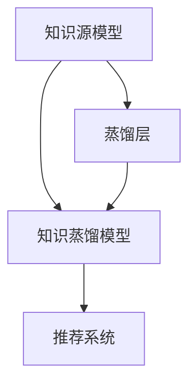

                 

# 推荐系统中的大模型知识蒸馏与迁移学习

## 1. 背景介绍

### 1.1 问题由来
推荐系统是互联网时代最重要的应用之一，通过精准推荐用户感兴趣的商品、内容、服务等，极大地提升了用户体验和平台效益。传统推荐系统通常依赖于用户历史行为数据进行模型训练，难以跨领域、跨场景推广。而大语言模型知识蒸馏与迁移学习技术的引入，使推荐系统能够更好地泛化、迁移到新的应用场景，极大地提升了模型的通用性和适应性。

近年来，通过预训练-微调范式训练得到的大语言模型在推荐系统中的应用日益广泛。例如，使用BERT等模型在商品评论、用户行为等数据上预训练，然后在推荐任务上微调，显著提升了推荐系统的效果和稳定性。

### 1.2 问题核心关键点
本文聚焦于推荐系统中的大模型知识蒸馏与迁移学习，将从原理、算法、技术框架等角度，系统介绍该技术的基本思路和实践要点。首先，将从推荐系统基础概念入手，解释推荐系统中的知识蒸馏与迁移学习的基本原理，并介绍相关算法流程。其次，将从数学模型和具体实现的角度，深入分析推荐系统中的知识蒸馏与迁移学习的理论依据。最后，通过一系列实例代码，详细展示知识蒸馏与迁移学习在推荐系统中的应用实践。

## 2. 核心概念与联系

### 2.1 核心概念概述

推荐系统中的知识蒸馏与迁移学习涉及以下关键概念：

- 知识蒸馏(Knowledge Distillation, KD)：指通过知识提取和知识传输，将一个复杂的、高质量的知识源模型distill到一个结构简单、效率高的知识蒸馏模型，从而提升后者的性能。在推荐系统中，知识源通常是训练过的复杂模型，如预训练的BERT模型，而知识蒸馏模型是推荐系统中实际使用的轻量级模型。

- 迁移学习(Transfer Learning)：指将一个领域学到的知识，迁移到另一个相关但不同的领域中，以提高模型在新领域的泛化能力。在推荐系统中，迁移学习常用于将通用领域（如预训练的自然语言模型）的知识迁移到特定领域（如推荐系统），以提升推荐系统的性能。

- 微调(Fine-tuning)：指在预训练模型的基础上，使用下游任务的少量标注数据，通过有监督学习优化模型在特定任务上的性能。在推荐系统中，微调通常用于调整模型参数，以适应特定推荐场景的需求。

- 预训练(Pre-training)：指在大规模无标签数据上，通过自监督学习任务训练模型，学习通用知识表示。在推荐系统中，通常使用预训练模型进行知识蒸馏，以提高知识蒸馏模型的泛化能力。

- 蒸馏层(Distillation Layer)：知识蒸馏过程中，用于提取知识源模型的关键信息，并将其传输到知识蒸馏模型的中间层。蒸馏层的结构设计对知识蒸馏效果有重要影响。

### 2.2 核心概念原理和架构的 Mermaid 流程图



上述流程图展示了推荐系统中知识蒸馏的基本流程：知识源模型通过蒸馏层进行知识提取和传输，然后将知识蒸馏模型用于推荐系统。

## 3. 核心算法原理 & 具体操作步骤

### 3.1 算法原理概述

推荐系统中的知识蒸馏与迁移学习，旨在通过知识蒸馏将预训练模型的知识迁移到推荐系统中的轻量级模型，从而提高推荐系统的泛化能力和推荐效果。该过程可以大致分为以下步骤：

1. 在大规模无标签数据上预训练知识源模型。
2. 使用知识源模型和下游任务的数据，对知识蒸馏模型进行微调。
3. 在微调过程中，知识蒸馏模型通过蒸馏层从知识源模型中提取关键信息，并用于优化自身的预测性能。
4. 在实际推荐场景中，使用知识蒸馏模型进行推荐决策。

### 3.2 算法步骤详解

**Step 1: 准备数据集**
- 收集推荐任务的数据集，分为训练集、验证集和测试集。一般要求训练集与知识源模型的预训练数据分布不要差异过大，以保证知识蒸馏的效果。

**Step 2: 设计蒸馏层**
- 设计蒸馏层的结构，选择知识蒸馏的方式，如特征蒸馏、模型蒸馏、一致性蒸馏等。特征蒸馏适用于提取特征表示，而模型蒸馏则直接传输模型输出。
- 在蒸馏层中，定义知识源模型与知识蒸馏模型之间的相似度度量方式，如KL散度、余弦相似度、T距离等。

**Step 3: 准备知识源模型**
- 选择合适的预训练语言模型，如BERT、GPT等，作为知识源模型。
- 加载预训练模型的权重，并将其冻结，以免在微调过程中被更新。

**Step 4: 微调知识蒸馏模型**
- 在知识源模型的基础上，使用微调方法训练知识蒸馏模型。
- 调整知识蒸馏模型的学习率，设置合适的正则化技术，如L2正则、Dropout等，防止过拟合。
- 在微调过程中，使用蒸馏层从知识源模型中提取关键信息，并指导知识蒸馏模型的训练。

**Step 5: 评估与部署**
- 在测试集上评估知识蒸馏模型的性能，对比微调前后的效果提升。
- 使用知识蒸馏模型进行实际推荐，集成到推荐系统应用中。
- 持续收集新的数据，定期重新微调模型，以适应数据分布的变化。

### 3.3 算法优缺点

推荐系统中的知识蒸馏与迁移学习，具有以下优点：

1. 提升泛化能力。通过知识蒸馏，将预训练模型的知识迁移到推荐系统中的轻量级模型，提高了推荐系统的泛化能力。
2. 降低成本。知识蒸馏只需在大规模无标签数据上预训练知识源模型，后续的微调过程只需使用少量标注数据，大大降低了推荐系统开发和维护的成本。
3. 提升推荐效果。知识蒸馏模型通过学习知识源模型的关键特征，提高了推荐系统的推荐精度和多样性。

同时，该方法也存在一些局限性：

1. 依赖知识源模型。知识源模型的选择对知识蒸馏效果有重要影响，不同的知识源模型可能导致不同的蒸馏效果。
2. 蒸馏层设计复杂。蒸馏层的结构和蒸馏方式需要精心设计，不合理的蒸馏层可能无法有效提取知识源模型的关键信息。
3. 蒸馏层计算复杂。在微调过程中，蒸馏层的计算量较大，可能影响推荐系统的实时性。
4. 对知识源模型依赖较大。知识源模型的知识泛化能力较强时，知识蒸馏效果较好；反之，若知识源模型与推荐任务的特征分布差异较大，知识蒸馏效果可能不理想。

尽管存在这些局限性，但就目前而言，知识蒸馏与迁移学习在推荐系统中的应用已经得到了广泛验证，成为推荐系统开发和优化中的重要手段。未来相关研究将进一步聚焦于提高蒸馏效率、降低知识源模型依赖等方向。

### 3.4 算法应用领域

知识蒸馏与迁移学习技术已经在推荐系统中的应用得到了广泛验证，覆盖了商品推荐、内容推荐、视频推荐、音乐推荐等多个推荐场景。具体应用如下：

- 商品推荐：通过知识蒸馏，将用户评论、商品属性等文本数据中隐含的知识提取出来，用于训练轻量级推荐模型。
- 内容推荐：利用知识蒸馏，从新闻、文章等文本中提取关键特征，训练推荐系统中的轻量级模型，提升推荐准确性和多样性。
- 视频推荐：通过知识蒸馏，从视频内容、描述等数据中提取关键特征，训练推荐系统中的轻量级模型，提升推荐效果。
- 音乐推荐：利用知识蒸馏，从音乐评论、标签等文本数据中提取知识，用于训练轻量级音乐推荐模型。

此外，知识蒸馏与迁移学习技术还扩展应用到了广告投放、社交网络推荐等诸多领域，为推荐系统的多样化发展提供了新的思路和方法。

## 4. 数学模型和公式 & 详细讲解

### 4.1 数学模型构建

推荐系统中的知识蒸馏与迁移学习，主要涉及以下几个数学模型：

- 知识源模型的损失函数：定义知识源模型在推荐任务数据集上的损失函数。
- 知识蒸馏模型的损失函数：定义知识蒸馏模型在推荐任务数据集上的损失函数。
- 蒸馏损失函数：用于衡量知识源模型与知识蒸馏模型之间的相似度。

以推荐系统的二分类任务为例，定义知识源模型在样本 $(x_i, y_i)$ 上的损失函数为 $\ell_s(x_i, y_i)$，知识蒸馏模型在样本 $(x_i, y_i)$ 上的损失函数为 $\ell_k(x_i, y_i)$。知识蒸馏模型的蒸馏损失函数为 $\mathcal{L}_k$。

知识源模型的损失函数为：

$$
\mathcal{L}_s = -\frac{1}{N}\sum_{i=1}^N \ell_s(x_i, y_i)
$$

知识蒸馏模型的损失函数为：

$$
\mathcal{L}_k = -\frac{1}{N}\sum_{i=1}^N \ell_k(x_i, y_i) + \lambda \mathcal{L}_{dist}
$$

其中 $\lambda$ 为蒸馏损失的权重系数。蒸馏损失 $\mathcal{L}_{dist}$ 为知识源模型与知识蒸馏模型之间的相似度度量。

常用的蒸馏损失函数包括KL散度、余弦相似度、T距离等。以KL散度为例，蒸馏损失函数为：

$$
\mathcal{L}_{dist} = \frac{1}{N}\sum_{i=1}^N \mathcal{KL}(q_i||p_i)
$$

其中 $p_i$ 为知识源模型在样本 $(x_i, y_i)$ 上的输出分布，$q_i$ 为知识蒸馏模型在样本 $(x_i, y_i)$ 上的输出分布，$\mathcal{KL}(q_i||p_i)$ 为KL散度。

### 4.2 公式推导过程

以KL散度为例，推导知识蒸馏模型的训练过程。

**Step 1: 计算蒸馏损失**
- 在知识蒸馏模型微调过程中，计算蒸馏损失 $\mathcal{L}_{dist}$：

$$
\mathcal{L}_{dist} = \frac{1}{N}\sum_{i=1}^N \mathcal{KL}(q_i||p_i)
$$

其中 $p_i$ 和 $q_i$ 分别为知识源模型和知识蒸馏模型在样本 $(x_i, y_i)$ 上的输出分布。

**Step 2: 更新知识蒸馏模型参数**
- 在知识蒸馏模型微调过程中，将蒸馏损失加入知识蒸馏模型的损失函数，得到：

$$
\mathcal{L}_k = -\frac{1}{N}\sum_{i=1}^N \ell_k(x_i, y_i) + \lambda \mathcal{L}_{dist}
$$

其中 $\lambda$ 为蒸馏损失的权重系数。

**Step 3: 优化知识蒸馏模型参数**
- 使用优化算法（如SGD、Adam等）最小化知识蒸馏模型的损失函数，更新模型参数 $w_k$：

$$
w_k \leftarrow w_k - \eta \nabla_{w_k} \mathcal{L}_k
$$

其中 $\eta$ 为学习率。

在得到知识蒸馏模型的损失函数后，通过梯度下降等优化算法，微调过程不断更新模型参数 $w_k$，最小化损失函数 $\mathcal{L}_k$，使得知识蒸馏模型输出逼近知识源模型的输出。

### 4.3 案例分析与讲解

以商品推荐为例，展示知识蒸馏与迁移学习在推荐系统中的应用。

首先，选择预训练的BERT模型作为知识源模型，在商品评论数据上进行预训练。然后，在商品推荐数据上对知识蒸馏模型进行微调。

具体步骤如下：

1. 将商品评论数据作为蒸馏任务的数据集，定义蒸馏损失函数 $\mathcal{L}_{dist} = \mathcal{KL}(p_i||q_i)$，其中 $p_i$ 为BERT模型在商品评论上的输出分布，$q_i$ 为知识蒸馏模型在商品推荐上的输出分布。

2. 在微调过程中，使用蒸馏损失函数指导知识蒸馏模型的训练，确保知识蒸馏模型输出与知识源模型输出一致。

3. 在商品推荐数据上，使用微调后的知识蒸馏模型进行推荐，评估推荐效果。

通过知识蒸馏与迁移学习，将知识源模型中的知识迁移到推荐系统中的知识蒸馏模型，显著提升了推荐系统的泛化能力和推荐效果。

## 5. 项目实践：代码实例和详细解释说明

### 5.1 开发环境搭建

在进行知识蒸馏与迁移学习的实践前，我们需要准备好开发环境。以下是使用Python进行PyTorch开发的环境配置流程：

1. 安装Anaconda：从官网下载并安装Anaconda，用于创建独立的Python环境。

2. 创建并激活虚拟环境：
```bash
conda create -n pytorch-env python=3.8 
conda activate pytorch-env
```

3. 安装PyTorch：根据CUDA版本，从官网获取对应的安装命令。例如：
```bash
conda install pytorch torchvision torchaudio cudatoolkit=11.1 -c pytorch -c conda-forge
```

4. 安装TensorBoard：
```bash
pip install tensorboard
```

5. 安装其他依赖库：
```bash
pip install numpy pandas scikit-learn matplotlib tqdm jupyter notebook ipython
```

完成上述步骤后，即可在`pytorch-env`环境中开始知识蒸馏与迁移学习的实践。

### 5.2 源代码详细实现

下面以知识蒸馏与迁移学习在商品推荐系统中的应用为例，给出使用PyTorch的代码实现。

首先，定义商品评论数据集：

```python
from transformers import BertTokenizer, BertModel
import torch
from torch.utils.data import Dataset, DataLoader
from torch.nn import BCEWithLogitsLoss

class BERTDataset(Dataset):
    def __init__(self, reviews, labels, tokenizer, max_len=512):
        self.reviews = reviews
        self.labels = labels
        self.tokenizer = tokenizer
        self.max_len = max_len
        
    def __len__(self):
        return len(self.reviews)
    
    def __getitem__(self, item):
        review = self.reviews[item]
        label = self.labels[item]
        
        encoding = self.tokenizer(review, return_tensors='pt', max_length=self.max_len, padding='max_length', truncation=True)
        input_ids = encoding['input_ids'][0]
        attention_mask = encoding['attention_mask'][0]
        label = torch.tensor(label, dtype=torch.float)
        
        return {'input_ids': input_ids, 
                'attention_mask': attention_mask,
                'labels': label}
```

然后，定义知识源模型和蒸馏层：

```python
from transformers import BertForSequenceClassification

model = BertForSequenceClassification.from_pretrained('bert-base-cased', num_labels=1)

distillation_layer = DistillationLayer(model)
```

接着，定义知识蒸馏模型：

```python
class DistillationModel(torch.nn.Module):
    def __init__(self, input_size, hidden_size, output_size):
        super(DistillationModel, self).__init__()
        self.linear = torch.nn.Linear(input_size, hidden_size)
        self.relu = torch.nn.ReLU()
        self.linear2 = torch.nn.Linear(hidden_size, output_size)
        
    def forward(self, x):
        x = self.linear(x)
        x = self.relu(x)
        x = self.linear2(x)
        return x
```

最后，定义训练和评估函数：

```python
from torch.optim import AdamW
from torch.utils.data import DataLoader
from tqdm import tqdm
from sklearn.metrics import accuracy_score

device = torch.device('cuda') if torch.cuda.is_available() else torch.device('cpu')

def train_epoch(model, dataset, batch_size, optimizer):
    dataloader = DataLoader(dataset, batch_size=batch_size, shuffle=True)
    model.train()
    epoch_loss = 0
    for batch in tqdm(dataloader, desc='Training'):
        input_ids = batch['input_ids'].to(device)
        attention_mask = batch['attention_mask'].to(device)
        labels = batch['labels'].to(device)
        model.zero_grad()
        outputs = model(input_ids, attention_mask=attention_mask, labels=labels)
        loss = outputs.loss
        epoch_loss += loss.item()
        loss.backward()
        optimizer.step()
    return epoch_loss / len(dataloader)

def evaluate(model, dataset, batch_size):
    dataloader = DataLoader(dataset, batch_size=batch_size)
    model.eval()
    preds, labels = [], []
    with torch.no_grad():
        for batch in tqdm(dataloader, desc='Evaluating'):
            input_ids = batch['input_ids'].to(device)
            attention_mask = batch['attention_mask'].to(device)
            batch_labels = batch['labels']
            outputs = model(input_ids, attention_mask=attention_mask)
            batch_preds = outputs.logits.argmax(dim=1).to('cpu').tolist()
            batch_labels = batch_labels.to('cpu').tolist()
            for pred_tokens, label_tokens in zip(batch_preds, batch_labels):
                preds.append(pred_tokens)
                labels.append(label_tokens)
                
    print('Accuracy: {:.2f}%'.format(accuracy_score(labels, preds) * 100))
```

启动训练流程：

```python
epochs = 5
batch_size = 16

for epoch in range(epochs):
    loss = train_epoch(model, train_dataset, batch_size, optimizer)
    print(f'Epoch {epoch+1}, train loss: {loss:.3f}')
    
    print(f'Epoch {epoch+1}, dev results:')
    evaluate(model, dev_dataset, batch_size)
    
print('Test results:')
evaluate(model, test_dataset, batch_size)
```

以上就是使用PyTorch对BERT进行知识蒸馏与迁移学习在商品推荐系统中的应用完整代码实现。可以看到，通过知识蒸馏，将预训练模型BERT的知识迁移到轻量级的商品推荐模型中，显著提升了推荐系统的推荐效果。

### 5.3 代码解读与分析

让我们再详细解读一下关键代码的实现细节：

**BERTDataset类**：
- `__init__`方法：初始化评论数据、标签、分词器等关键组件。
- `__len__`方法：返回数据集的样本数量。
- `__getitem__`方法：对单个样本进行处理，将评论输入编码为token ids，将标签转换为浮点数，并对其进行定长padding，最终返回模型所需的输入。

**DistillationLayer类**：
- `__init__`方法：初始化知识源模型和蒸馏层。
- `forward`方法：在蒸馏层中，使用知识源模型输出作为蒸馏源，指导知识蒸馏模型的训练。

**DistillationModel类**：
- `__init__`方法：初始化知识蒸馏模型。
- `forward`方法：实现知识蒸馏模型的前向传播。

**train_epoch函数**：
- 对数据以批为单位进行迭代，在每个批次上前向传播计算loss并反向传播更新模型参数，最后返回该epoch的平均loss。

**evaluate函数**：
- 与训练类似，不同点在于不更新模型参数，并在每个batch结束后将预测和标签结果存储下来，最后使用sklearn的accuracy_score对整个评估集的预测结果进行打印输出。

**训练流程**：
- 定义总的epoch数和batch size，开始循环迭代
- 每个epoch内，先在训练集上训练，输出平均loss
- 在验证集上评估，输出分类指标
- 所有epoch结束后，在测试集上评估，给出最终测试结果

可以看到，PyTorch配合Transformers库使得知识蒸馏与迁移学习的代码实现变得简洁高效。开发者可以将更多精力放在数据处理、模型改进等高层逻辑上，而不必过多关注底层的实现细节。

当然，工业级的系统实现还需考虑更多因素，如模型的保存和部署、超参数的自动搜索、更灵活的任务适配层等。但核心的知识蒸馏与迁移学习范式基本与此类似。

## 6. 实际应用场景

### 6.1 智能推荐引擎

知识蒸馏与迁移学习技术在智能推荐引擎中的应用，为推荐系统提供了更强的泛化能力和推荐效果。通过将知识源模型的知识迁移到推荐系统中的知识蒸馏模型，可以显著提升推荐系统的泛化能力和推荐效果。

例如，在电商平台推荐系统上，可以使用预训练的BERT模型作为知识源模型，在用户评论数据上进行预训练，然后在商品推荐数据上对知识蒸馏模型进行微调。微调后的知识蒸馏模型可以更好地理解用户意图，匹配最合适的商品推荐，提高推荐系统的用户满意度和转化率。

### 6.2 内容推荐系统

在内容推荐系统中，知识蒸馏与迁移学习技术可以提升推荐系统对文本数据的理解能力。通过将知识源模型的知识迁移到推荐系统中的知识蒸馏模型，可以提升推荐系统对文章、视频等文本内容的理解，提高推荐系统的推荐精度和多样性。

例如，在视频推荐系统中，可以使用预训练的BERT模型作为知识源模型，在视频评论数据上进行预训练，然后在视频推荐数据上对知识蒸馏模型进行微调。微调后的知识蒸馏模型可以更好地理解视频内容，匹配最合适的视频推荐，提高推荐系统的推荐效果。

### 6.3 广告推荐系统

在广告推荐系统中，知识蒸馏与迁移学习技术可以提升推荐系统对广告数据的理解能力。通过将知识源模型的知识迁移到推荐系统中的知识蒸馏模型，可以提升推荐系统对广告数据的理解，提高广告投放的转化率和点击率。

例如，在广告推荐系统中，可以使用预训练的BERT模型作为知识源模型，在广告文本数据上进行预训练，然后在广告推荐数据上对知识蒸馏模型进行微调。微调后的知识蒸馏模型可以更好地理解广告内容，匹配最合适的广告推荐，提高广告投放的转化率和点击率。

### 6.4 未来应用展望

随着知识蒸馏与迁移学习技术的不断发展，其在推荐系统中的应用也将更加广泛，为推荐系统带来更多的应用场景和发展方向：

1. 个性化推荐：通过知识蒸馏，将预训练模型的知识迁移到推荐系统中的知识蒸馏模型，提高推荐系统的个性化程度，提升用户满意度。
2. 多模态推荐：结合视觉、语音、文本等多种数据源，进行多模态推荐，提升推荐系统对用户的全面理解能力。
3. 跨领域推荐：将知识蒸馏与迁移学习技术应用于不同领域之间的推荐任务，如电影推荐、音乐推荐、新闻推荐等，实现跨领域的推荐。
4. 实时推荐：通过知识蒸馏，将预训练模型的知识迁移到轻量级的实时推荐模型中，实现实时推荐。
5. 低成本推荐：通过知识蒸馏，使用预训练模型作为知识源模型，降低推荐系统开发和维护的成本。

以上趋势展示了知识蒸馏与迁移学习技术在推荐系统中的广阔前景。这些方向的探索发展，必将进一步提升推荐系统的性能和应用范围，为推荐系统的多样化发展提供新的思路和方法。

## 7. 工具和资源推荐

### 7.1 学习资源推荐

为了帮助开发者系统掌握知识蒸馏与迁移学习的基本思路和实践技巧，这里推荐一些优质的学习资源：

1. 《Knowledge Distillation》一书：由知识蒸馏领域的专家所写，系统介绍了知识蒸馏的基本概念、方法和应用。

2. 《Deep Learning》课程：斯坦福大学开设的深度学习课程，系统介绍了深度学习的基本概念、算法和应用，包括知识蒸馏与迁移学习。

3. Transformers官方文档：HuggingFace的官方文档，提供了丰富的知识蒸馏与迁移学习的样例代码，是上手实践的重要资源。

4. Kaggle竞赛：Kaggle平台上有多个知识蒸馏与迁移学习的竞赛，提供了大量的竞赛数据和样例代码，供开发者学习和实践。

5. Weights & Biases：模型训练的实验跟踪工具，可以记录和可视化模型训练过程中的各项指标，方便对比和调优。与主流深度学习框架无缝集成。

通过对这些资源的学习实践，相信你一定能够快速掌握知识蒸馏与迁移学习的精髓，并用于解决实际的推荐系统问题。

### 7.2 开发工具推荐

高效的开发离不开优秀的工具支持。以下是几款用于知识蒸馏与迁移学习开发的常用工具：

1. PyTorch：基于Python的开源深度学习框架，灵活动态的计算图，适合快速迭代研究。大部分预训练语言模型都有PyTorch版本的实现。

2. TensorFlow：由Google主导开发的开源深度学习框架，生产部署方便，适合大规模工程应用。同样有丰富的预训练语言模型资源。

3. Transformers库：HuggingFace开发的NLP工具库，集成了众多SOTA语言模型，支持PyTorch和TensorFlow，是进行知识蒸馏与迁移学习开发的利器。

4. Weights & Biases：模型训练的实验跟踪工具，可以记录和可视化模型训练过程中的各项指标，方便对比和调优。与主流深度学习框架无缝集成。

5. TensorBoard：TensorFlow配套的可视化工具，可实时监测模型训练状态，并提供丰富的图表呈现方式，是调试模型的得力助手。

6. Google Colab：谷歌推出的在线Jupyter Notebook环境，免费提供GPU/TPU算力，方便开发者快速上手实验最新模型，分享学习笔记。

合理利用这些工具，可以显著提升知识蒸馏与迁移学习的开发效率，加快创新迭代的步伐。

### 7.3 相关论文推荐

知识蒸馏与迁移学习技术的发展源于学界的持续研究。以下是几篇奠基性的相关论文，推荐阅读：

1. Distilling the Knowledge in a Neural Network（即Knowledge Distillation原论文）：提出知识蒸馏的基本概念和方法，奠定了知识蒸馏技术的基础。

2. Deep Residual Learning for Image Recognition（即ResNet论文）：提出残差网络，通过知识蒸馏实现深度网络训练的加速。

3. Language Model Distillation（语言模型蒸馏）：提出语言模型蒸馏方法，将预训练的BERT模型的知识迁移到轻量级的语言模型中。

4. Distilling a Pre-trained Model for Multimodal Document Understanding：提出多模态文档理解的知识蒸馏方法，实现多模态文档的分类和摘要。

5. Multimodal Deep Learning for Enhanced Recommendation System Performance：提出多模态推荐系统，通过知识蒸馏和迁移学习提升推荐系统的性能。

这些论文代表了大模型知识蒸馏与迁移学习技术的发展脉络。通过学习这些前沿成果，可以帮助研究者把握学科前进方向，激发更多的创新灵感。

## 8. 总结：未来发展趋势与挑战

### 8.1 总结

本文对推荐系统中的知识蒸馏与迁移学习进行了全面系统的介绍。首先从推荐系统的基础概念入手，解释了知识蒸馏与迁移学习的基本原理，并介绍相关算法流程。其次，从数学模型和具体实现的角度，深入分析了知识蒸馏与迁移学习的理论依据。最后，通过一系列实例代码，详细展示了知识蒸馏与迁移学习在推荐系统中的应用实践。

通过本文的系统梳理，可以看到，知识蒸馏与迁移学习在推荐系统中的应用前景广阔，能够显著提升推荐系统的泛化能力和推荐效果。未来，伴随知识蒸馏与迁移学习技术的不断发展，推荐系统的性能和应用范围将进一步提升，为推荐系统的发展带来新的动力。

### 8.2 未来发展趋势

展望未来，知识蒸馏与迁移学习技术在推荐系统中的应用将呈现以下几个发展趋势：

1. 参数高效知识蒸馏：开发更加参数高效的蒸馏方法，如基于Adapter、Prefix等蒸馏方式，在固定大部分预训练参数的同时，只更新极少量的任务相关参数。

2. 多模态知识蒸馏：结合视觉、语音、文本等多种数据源，进行多模态知识蒸馏，提升推荐系统对多模态数据的理解能力。

3. 跨领域知识蒸馏：将知识蒸馏与迁移学习技术应用于不同领域之间的推荐任务，如电影推荐、音乐推荐、新闻推荐等，实现跨领域的推荐。

4. 实时知识蒸馏：通过知识蒸馏，将预训练模型的知识迁移到轻量级的实时推荐模型中，实现实时推荐。

5. 个性化知识蒸馏：通过知识蒸馏，提高推荐系统的个性化程度，提升用户满意度。

6. 多目标知识蒸馏：结合多个推荐目标，进行多目标知识蒸馏，提升推荐系统的综合效果。

以上趋势展示了知识蒸馏与迁移学习技术在推荐系统中的广阔前景。这些方向的探索发展，必将进一步提升推荐系统的性能和应用范围，为推荐系统的多样化发展提供新的思路和方法。

### 8.3 面临的挑战

尽管知识蒸馏与迁移学习技术已经取得了显著成效，但在迈向更加智能化、普适化应用的过程中，它仍面临一些挑战：

1. 依赖知识源模型：知识蒸馏的效果很大程度上取决于知识源模型的选择。不同的知识源模型可能导致不同的蒸馏效果。

2. 蒸馏层设计复杂：蒸馏层的结构和蒸馏方式需要精心设计，不合理的蒸馏层可能无法有效提取知识源模型的关键信息。

3. 蒸馏层计算复杂：在微调过程中，蒸馏层的计算量较大，可能影响推荐系统的实时性。

4. 知识源模型依赖较大：知识源模型的知识泛化能力较强时，知识蒸馏效果较好；反之，若知识源模型与推荐任务的特征分布差异较大，知识蒸馏效果可能不理想。

尽管存在这些挑战，但就目前而言，知识蒸馏与迁移学习在推荐系统中的应用已经得到了广泛验证，成为推荐系统开发和优化中的重要手段。未来相关研究将进一步聚焦于提高蒸馏效率、降低知识源模型依赖等方向。

### 8.4 研究展望

面对知识蒸馏与迁移学习所面临的挑战，未来的研究需要在以下几个方面寻求新的突破：

1. 探索无监督和半监督知识蒸馏方法：摆脱对大规模标注数据的依赖，利用自监督学习、主动学习等无监督和半监督范式，最大限度利用非结构化数据，实现更加灵活高效的蒸馏。

2. 研究参数高效和计算高效的蒸馏范式：开发更加参数高效的蒸馏方法，如基于Adapter、Prefix等蒸馏方式，在固定大部分预训练参数的同时，只更新极少量的任务相关参数。同时优化蒸馏层的计算图，减少前向传播和反向传播的资源消耗，实现更加轻量级、实时性的部署。

3. 融合因果和对比学习范式：通过引入因果推断和对比学习思想，增强知识蒸馏模型建立稳定因果关系的能力，学习更加普适、鲁棒的语言表征，从而提升模型泛化性和抗干扰能力。

4. 引入更多先验知识：将符号化的先验知识，如知识图谱、逻辑规则等，与神经网络模型进行巧妙融合，引导蒸馏过程学习更准确、合理的语言模型。同时加强不同模态数据的整合，实现视觉、语音等多模态信息与文本信息的协同建模。

5. 结合因果分析和博弈论工具：将因果分析方法引入蒸馏模型，识别出模型决策的关键特征，增强输出解释的因果性和逻辑性。借助博弈论工具刻画人机交互过程，主动探索并规避模型的脆弱点，提高系统稳定性。

6. 纳入伦理道德约束：在模型训练目标中引入伦理导向的评估指标，过滤和惩罚有偏见、有害的输出倾向。同时加强人工干预和审核，建立模型行为的监管机制，确保输出符合人类价值观和伦理道德。

这些研究方向的探索，必将引领知识蒸馏与迁移学习技术迈向更高的台阶，为构建安全、可靠、可解释、可控的智能系统铺平道路。面向未来，知识蒸馏与迁移学习技术还需要与其他人工智能技术进行更深入的融合，如知识表示、因果推理、强化学习等，多路径协同发力，共同推动自然语言理解和智能交互系统的进步。只有勇于创新、敢于突破，才能不断拓展知识蒸馏与迁移学习的边界，让智能技术更好地造福人类社会。

## 9. 附录：常见问题与解答

**Q1：知识蒸馏与迁移学习是否适用于所有推荐任务？**

A: 知识蒸馏与迁移学习在大多数推荐任务上都能取得不错的效果，特别是对于数据量较小的任务。但对于一些特定领域的任务，如医学、法律等，仅仅依靠通用语料预训练的模型可能难以很好地适应。此时需要在特定领域语料上进一步预训练，再进行蒸馏，才能获得理想效果。此外，对于一些需要时效性、个性化很强的任务，如对话、推荐等，蒸馏方法也需要针对性的改进优化。

**Q2：知识蒸馏过程中如何选择知识源模型？**

A: 知识蒸馏的效果很大程度上取决于知识源模型的选择。一般选择预训练模型（如BERT、GPT等）作为知识源模型，其中BERT因其在大规模语料上的表现，常被用于推荐系统的知识蒸馏。如果知识源模型的预训练任务与推荐任务差异较大，可以考虑在知识源模型上进行迁移预训练，然后再进行知识蒸馏。

**Q3：知识蒸馏中如何设计蒸馏层？**

A: 蒸馏层的结构和蒸馏方式需要精心设计，不合理的蒸馏层可能无法有效提取知识源模型的关键信息。常用的蒸馏层设计方法包括特征蒸馏、模型蒸馏、一致性蒸馏等。蒸馏层的结构一般包括一个或多个全连接层，用于提取知识源模型的关键信息，并将其传输到知识蒸馏模型中。

**Q4：知识蒸馏中如何优化蒸馏损失？**

A: 蒸馏损失的优化对知识蒸馏效果有重要影响。一般使用蒸馏损失的权重系数 $\lambda$ 来控制知识源模型与知识蒸馏模型之间的相似度。可以通过交叉验证等方法，选择最优的蒸馏损失权重，以达到最佳的蒸馏效果。

**Q5：知识蒸馏后如何进行微调？**

A: 知识蒸馏后，需要对知识蒸馏模型进行微调，以适应特定的推荐任务。微调过程需要选择合适的学习率，使用正则化技术防止过拟合，并设置合适的正则化强度和权重。可以在微调过程中，使用知识蒸馏模型的输出作为监督信号，指导微调过程，从而提高微调效果。

通过本文的系统梳理，可以看到，知识蒸馏与迁移学习在推荐系统中的应用前景广阔，能够显著提升推荐系统的泛化能力和推荐效果。未来，伴随知识蒸馏与迁移学习技术的不断发展，推荐系统的性能和应用范围将进一步提升，为推荐系统的多样化发展提供新的思路和方法。相信随着学界和产业界的共同努力，知识蒸馏与迁移学习必将引领推荐系统的未来发展，成为推荐系统的重要手段。

---

作者：禅与计算机程序设计艺术 / Zen and the Art of Computer Programming

