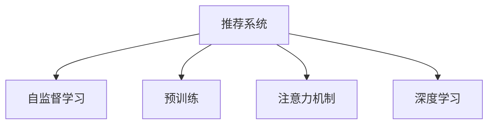

                 

# 推荐系统中的注意力机制：AI大模型的新突破

> 关键词：推荐系统,注意力机制,自监督学习,预训练,Transformer,BERT,深度学习

## 1. 背景介绍

### 1.1 问题由来

推荐系统是现代互联网的核心组成部分之一，从电商的个性化商品推荐到视频流的个性化内容推荐，推荐系统的应用已经渗透到我们生活的方方面面。然而，传统的推荐系统往往依赖于用户历史行为数据，难以应对新用户和老用户的行为差异，更难以捕捉到数据未覆盖到的用户偏好。因此，如何提升推荐系统的性能和泛化能力，成为了当前人工智能和推荐系统领域的热点研究方向。

### 1.2 问题核心关键点

为解决推荐系统中的泛化问题，研究者们提出了许多前沿的推荐算法和技术。其中，基于深度学习的方法在推荐系统领域取得了显著的成果。自监督学习和预训练技术成为构建高性能推荐系统的核心范式。特别是Transformer结构和大模型(如BERT、GPT等)的引入，使得推荐系统能够更全面地理解和预测用户偏好，提升推荐性能和用户满意度。

其中，注意力机制作为Transformer结构的重要组成部分，在推荐系统中扮演了至关重要的角色。基于注意力机制的推荐系统能够更好处理高维稀疏数据，捕捉不同特征之间的关系，适应用户的动态变化，最终提升推荐效果。因此，本文将详细探讨注意力机制在推荐系统中的原理、实现和应用，以期为推荐系统的研究和实践提供新的思路和方向。

### 1.3 问题研究意义

研究注意力机制在推荐系统中的应用，对于提升推荐系统的性能和泛化能力，具有重要意义：

1. 减少数据依赖：基于自监督学习和预训练的推荐系统可以避免对标注数据的依赖，通过大规模无标签数据进行预训练，学习通用的用户-商品交互模式。

2. 提升模型泛化：预训练后的大模型可以有效提升推荐系统对新用户和老用户的泛化能力，适应不同用户群体的行为差异。

3. 提高推荐效果：注意力机制使得模型能够自动学习不同特征之间的权重，从而更准确地预测用户偏好。

4. 降低工程成本：相比于传统推荐系统，基于大模型的推荐系统可以大幅降低特征工程和模型调参的复杂度，提升模型开发效率。

5. 增强应用可扩展性：大模型的应用使得推荐系统能够处理更复杂和多样化的用户行为数据，从而提高系统的可扩展性和应用范围。

## 2. 核心概念与联系

### 2.1 核心概念概述

为更好地理解注意力机制在推荐系统中的应用，本节将介绍几个密切相关的核心概念：

- 推荐系统(Recommender System)：通过用户行为数据预测用户可能感兴趣的商品或内容的系统，广泛应用于电商、视频流、新闻推荐等领域。

- 自监督学习(Self-supervised Learning)：指使用未标注数据进行模型训练，通过自相关约束或数据重建等任务构建学习信号，提高模型泛化能力。

- 预训练(Pre-training)：指在大规模无标签数据上，通过自监督学习任务训练通用模型的过程。常见的预训练任务包括掩码语言模型、相对位置预测等。

- 注意力机制(Attention Mechanism)：Transformer结构的核心组成部分，通过学习输入特征之间的权重，动态调整模型的关注焦点，以优化模型输出。

- 深度学习(Deep Learning)：基于神经网络架构，通过多层次抽象和特征学习，处理复杂数据结构并做出智能决策的技术。

这些核心概念之间的逻辑关系可以通过以下Mermaid流程图来展示：



这个流程图展示了几大核心概念之间的关系：

1. 推荐系统通过自监督学习和预训练获得基础能力。
2. 深度学习技术为推荐系统提供了强大的模型表达能力。
3. 注意力机制使得深度学习模型能够动态捕捉特征之间的权重，提升推荐效果。

这些概念共同构成了推荐系统的学习和应用框架，使得推荐系统能够通过深度学习模型和注意力机制等技术，不断提升推荐性能，满足用户多样化需求。

## 3. 核心算法原理 & 具体操作步骤
### 3.1 算法原理概述

基于注意力机制的推荐系统，其核心思想是通过学习用户行为特征和商品属性特征之间的关系，动态调整模型的关注焦点，从而优化推荐结果。

在传统的推荐系统中，推荐模型通常使用基于统计的方法，如协同过滤、矩阵分解等，直接从用户行为数据中计算相似性得分，并根据用户历史行为进行推荐。然而，这种方法往往难以处理高维稀疏数据，并且无法捕捉到特征之间的隐式关系。而基于注意力机制的推荐系统，通过学习用户行为特征和商品属性特征之间的注意力权重，可以更加动态和全面地理解用户偏好，从而提升推荐效果。

### 3.2 算法步骤详解

基于注意力机制的推荐系统主要包括以下几个关键步骤：

**Step 1: 准备数据集**

- 收集用户行为数据和商品属性数据，构建推荐任务的数据集。
- 对数据进行预处理，如缺失值填充、数据标准化等。
- 将数据划分为训练集、验证集和测试集。

**Step 2: 模型初始化**

- 选择合适的深度学习模型和注意力机制，如Transformer结构、注意力机制等。
- 加载预训练语言模型，如BERT、GPT等，作为推荐模型的初始化参数。

**Step 3: 构建推荐模型**

- 设计推荐模型的输入层，通常包括用户行为特征和商品属性特征。
- 在推荐模型的中间层，设计注意力机制，学习不同特征之间的权重。
- 在推荐模型的输出层，设计评分函数，计算用户对商品的兴趣度得分。

**Step 4: 训练和优化**

- 在训练集上训练推荐模型，最小化预测误差和注意力权重误差。
- 在验证集上评估模型性能，调整模型参数和注意力机制。
- 在测试集上评估推荐模型的最终性能。

**Step 5: 部署和应用**

- 将训练好的推荐模型部署到生产环境中，实现实时推荐。
- 收集用户的反馈和行为数据，不断迭代优化模型。
- 对推荐结果进行监控和调整，确保推荐质量。

以上是基于注意力机制的推荐系统的基本流程。在实际应用中，还需要针对具体任务进行优化设计和参数调优，如改进注意力机制、增加正则化技术、引入对抗训练等，以进一步提升模型性能。

### 3.3 算法优缺点

基于注意力机制的推荐系统具有以下优点：

1. 高维稀疏数据的处理能力：注意力机制能够动态调整模型对不同特征的关注程度，适应高维稀疏数据，避免稀疏性带来的噪声干扰。

2. 特征关系建模能力：通过学习特征之间的注意力权重，模型能够捕捉到不同特征之间的隐式关系，提升推荐效果。

3. 泛化能力：基于预训练的语言模型，推荐系统能够更好地适应新用户和老用户的不同需求。

4. 模型可解释性：注意力机制为模型的预测提供了权重分布，可以帮助开发者更好地理解和调试模型。

然而，该方法也存在一些缺点：

1. 计算复杂度较高：注意力机制需要计算每个特征与输入的注意力权重，对于大规模数据集和模型来说，计算开销较大。

2. 训练数据要求高：自监督学习和预训练过程需要大量数据，对于数据质量要求较高。

3. 模型泛化能力有待验证：注意力机制是否能够泛化到新用户和老用户的不同偏好，还需要更多实证研究。

4. 对抗样本的鲁棒性问题：对于对抗样本，注意力机制可能会引入错误的特征权重，导致推荐错误。

5. 资源消耗较大：基于大模型的推荐系统需要消耗大量的计算资源和存储空间，对于小规模应用场景可能不适用。

### 3.4 算法应用领域

基于注意力机制的推荐系统已经在电商、视频流、新闻推荐等多个领域得到了广泛应用。例如：

- 电商推荐系统：通过用户的历史浏览、点击、购买行为数据，以及商品的属性数据，使用基于注意力机制的深度学习模型，为每个用户推荐感兴趣的商品。

- 视频流推荐系统：通过用户的观看历史、点赞、评论等行为数据，以及视频的内容数据，使用基于注意力机制的深度学习模型，为用户推荐感兴趣的视频内容。

- 新闻推荐系统：通过用户的阅读历史、点赞、分享等行为数据，以及新闻文章的属性数据，使用基于注意力机制的深度学习模型，为用户推荐感兴趣的新闻文章。

除了这些经典任务外，基于注意力机制的推荐系统还被创新性地应用到更多场景中，如跨领域推荐、社交网络推荐、医疗推荐等，为推荐系统的研究与应用带来了新的突破。

## 4. 数学模型和公式 & 详细讲解
### 4.1 数学模型构建

在推荐系统中，常用的基于注意力机制的模型主要包括Transformer结构和BERT模型。这里以Transformer结构为例，构建基于注意力机制的推荐模型。

假设推荐任务的数据集为 $D=\{(x_i, y_i)\}_{i=1}^N$，其中 $x_i$ 为用户行为数据和商品属性数据的表示， $y_i$ 为推荐目标（例如商品ID）。模型的输入层为 $x_i$，输出层为 $\hat{y}_i$，表示用户对商品 $i$ 的兴趣度得分。

模型的基本结构包括：输入层、Transformer编码器、Transformer解码器、输出层。具体来说：

1. 输入层：将用户行为数据和商品属性数据拼接，输入到Transformer编码器中。

2. 编码器：使用Transformer结构，通过注意力机制学习不同特征之间的权重，对输入进行编码。

3. 解码器：使用Transformer结构，通过注意力机制学习用户对商品特征的关注程度，输出用户对商品的兴趣度得分。

4. 输出层：将解码器的输出映射到具体的推荐目标，例如商品ID。

模型的训练目标为最小化预测误差和注意力权重误差，即：

$$
\min_{\theta} \sum_{i=1}^N \left[ \ell_{pred}(y_i, \hat{y}_i) + \lambda \sum_{k=1}^K \ell_{att}(k) \right]
$$

其中 $\theta$ 为模型参数，$\ell_{pred}$ 为预测误差，$\ell_{att}$ 为注意力权重误差，$\lambda$ 为正则化系数。$\ell_{pred}$ 可以采用交叉熵损失函数，$\ell_{att}$ 可以采用KL散度损失函数。

### 4.2 公式推导过程

以下我们以二分类任务为例，推导基于注意力机制的推荐模型的预测过程和损失函数。

假设模型的输入层为 $x=[x_u, x_i]$，其中 $x_u$ 为用户行为数据，$x_i$ 为商品属性数据。假设用户对商品 $i$ 的兴趣度得分 $\hat{y}_i$ 为：

$$
\hat{y}_i = f_k(\text{Attention}_k(x_u, x_i))
$$

其中 $f_k$ 为输出层函数，$\text{Attention}_k$ 为注意力机制，$k$ 为注意力机制的层数。

注意力机制的计算过程如下：

$$
\text{Attention}_k(x_u, x_i) = \sum_{j=1}^J \alpha_{kj} x_{ij}
$$

其中 $\alpha_{kj}$ 为注意力权重，$x_{ij}$ 为商品 $i$ 在特征 $j$ 上的表示。$\alpha_{kj}$ 的计算过程如下：

$$
\alpha_{kj} = \frac{e^{a_k(x_u, x_{ij})}}{\sum_{l=1}^L e^{a_k(x_u, x_{il})}}
$$

其中 $a_k$ 为注意力函数，可以采用点积注意力机制、多头注意力机制等。

基于注意力机制的推荐模型的训练过程如下：

1. 前向传播：通过输入层、Transformer编码器、Transformer解码器和输出层，计算用户对商品 $i$ 的兴趣度得分 $\hat{y}_i$。

2. 计算损失：通过损失函数 $\ell_{pred}(y_i, \hat{y}_i)$ 和注意力权重误差 $\ell_{att}(k)$ 计算模型损失。

3. 反向传播：通过反向传播算法计算梯度，更新模型参数 $\theta$。

4. 迭代优化：重复上述步骤，直至模型收敛。

### 4.3 案例分析与讲解

以电商推荐系统为例，分析基于注意力机制的推荐模型的工作原理。

假设电商网站有N个商品，每个商品有K个特征，每个用户有M个行为。用户的历史行为数据和商品属性数据可以表示为 $x=[x_u, x_i]$，其中 $x_u$ 为用户的浏览历史、点击历史、购买历史等行为数据，$x_i$ 为商品的类别、价格、评分等属性数据。模型的输入层为 $x=[x_u, x_i]$。

Transformer编码器可以学习用户行为数据和商品属性数据之间的注意力权重，对输入进行编码。通过Transformer解码器，模型可以学习用户对商品特征的关注程度，输出用户对商品的兴趣度得分 $\hat{y}_i$。通过输出层，模型可以将兴趣度得分映射到具体的商品ID，作为推荐结果。

在训练过程中，模型首先计算预测误差和注意力权重误差。预测误差可以通过交叉熵损失函数计算，例如：

$$
\ell_{pred}(y_i, \hat{y}_i) = -\log \hat{y}_i \cdot y_i - \log (1 - \hat{y}_i) \cdot (1 - y_i)
$$

其中 $y_i$ 为商品 $i$ 的标签，$\hat{y}_i$ 为模型预测的概率。

注意力权重误差可以通过KL散度损失函数计算，例如：

$$
\ell_{att}(k) = - \sum_{j=1}^K \alpha_{kj} \log \frac{\alpha_{kj}}{\hat{\alpha}_{kj}}
$$

其中 $\alpha_{kj}$ 为注意力机制计算出的权重，$\hat{\alpha}_{kj}$ 为模型预测的权重。

通过以上公式，即可构建基于注意力机制的电商推荐系统的数学模型。通过优化训练过程，模型能够学习到用户对商品特征的关注程度，提升推荐效果。

## 5. 项目实践：代码实例和详细解释说明
### 5.1 开发环境搭建

在进行基于注意力机制的推荐系统开发前，我们需要准备好开发环境。以下是使用Python进行PyTorch开发的环境配置流程：

1. 安装Anaconda：从官网下载并安装Anaconda，用于创建独立的Python环境。

2. 创建并激活虚拟环境：
```bash
conda create -n pytorch-env python=3.8 
conda activate pytorch-env
```

3. 安装PyTorch：根据CUDA版本，从官网获取对应的安装命令。例如：
```bash
conda install pytorch torchvision torchaudio cudatoolkit=11.1 -c pytorch -c conda-forge
```

4. 安装Transformers库：
```bash
pip install transformers
```

5. 安装各类工具包：
```bash
pip install numpy pandas scikit-learn matplotlib tqdm jupyter notebook ipython
```

完成上述步骤后，即可在`pytorch-env`环境中开始基于注意力机制的推荐系统开发。

### 5.2 源代码详细实现

这里我们以电商推荐系统为例，给出使用Transformers库对BERT模型进行微调的PyTorch代码实现。

首先，定义数据处理函数：

```python
from transformers import BertTokenizer
from torch.utils.data import Dataset
import torch

class E-commerceDataset(Dataset):
    def __init__(self, user_features, item_features, labels):
        self.user_features = user_features
        self.item_features = item_features
        self.labels = labels
        
    def __len__(self):
        return len(self.labels)
    
    def __getitem__(self, item):
        user_feature = self.user_features[item]
        item_feature = self.item_features[item]
        label = self.labels[item]
        
        encoding = BertTokenizer.from_pretrained('bert-base-cased')(user_feature + ' ' + item_feature, return_tensors='pt')
        user_ids = encoding['input_ids'][0]
        user_mask = encoding['attention_mask'][0]
        item_ids = encoding['input_ids'][1]
        item_mask = encoding['attention_mask'][1]
        
        return {'user_ids': user_ids, 'user_mask': user_mask, 'item_ids': item_ids, 'item_mask': item_mask, 'labels': label}
```

然后，定义模型和优化器：

```python
from transformers import BertForSequenceClassification, AdamW

model = BertForSequenceClassification.from_pretrained('bert-base-cased', num_labels=1)

optimizer = AdamW(model.parameters(), lr=2e-5)
```

接着，定义训练和评估函数：

```python
from torch.utils.data import DataLoader
from tqdm import tqdm
from sklearn.metrics import roc_auc_score

device = torch.device('cuda') if torch.cuda.is_available() else torch.device('cpu')
model.to(device)

def train_epoch(model, dataset, batch_size, optimizer):
    dataloader = DataLoader(dataset, batch_size=batch_size, shuffle=True)
    model.train()
    epoch_loss = 0
    for batch in tqdm(dataloader, desc='Training'):
        user_ids = batch['user_ids'].to(device)
        user_mask = batch['user_mask'].to(device)
        item_ids = batch['item_ids'].to(device)
        item_mask = batch['item_mask'].to(device)
        labels = batch['labels'].to(device)
        model.zero_grad()
        outputs = model(user_ids, user_mask, item_ids, item_mask, labels=labels)
        loss = outputs.loss
        epoch_loss += loss.item()
        loss.backward()
        optimizer.step()
    return epoch_loss / len(dataloader)

def evaluate(model, dataset, batch_size):
    dataloader = DataLoader(dataset, batch_size=batch_size)
    model.eval()
    preds, labels = [], []
    with torch.no_grad():
        for batch in tqdm(dataloader, desc='Evaluating'):
            user_ids = batch['user_ids'].to(device)
            user_mask = batch['user_mask'].to(device)
            item_ids = batch['item_ids'].to(device)
            item_mask = batch['item_mask'].to(device)
            labels = batch['labels'].to(device)
            outputs = model(user_ids, user_mask, item_ids, item_mask, labels=labels)
            batch_preds = outputs.logits.argmax(dim=1).to('cpu').tolist()
            batch_labels = labels.to('cpu').tolist()
            for pred, label in zip(batch_preds, batch_labels):
                preds.append(pred)
                labels.append(label)
                
    print(roc_auc_score(labels, preds))
```

最后，启动训练流程并在测试集上评估：

```python
epochs = 5
batch_size = 16

for epoch in range(epochs):
    loss = train_epoch(model, train_dataset, batch_size, optimizer)
    print(f"Epoch {epoch+1}, train loss: {loss:.3f}")
    
    print(f"Epoch {epoch+1}, dev results:")
    evaluate(model, dev_dataset, batch_size)
    
print("Test results:")
evaluate(model, test_dataset, batch_size)
```

以上就是使用PyTorch对BERT进行电商推荐系统微调的完整代码实现。可以看到，得益于Transformers库的强大封装，我们可以用相对简洁的代码完成BERT模型的加载和微调。

### 5.3 代码解读与分析

让我们再详细解读一下关键代码的实现细节：

**E-commerceDataset类**：
- `__init__`方法：初始化用户行为数据、商品属性数据和标签等关键组件。
- `__len__`方法：返回数据集的样本数量。
- `__getitem__`方法：对单个样本进行处理，将用户行为数据和商品属性数据拼接，输入BERT模型进行编码，并计算用户对商品的兴趣度得分。

**训练和评估函数**：
- 使用PyTorch的DataLoader对数据集进行批次化加载，供模型训练和推理使用。
- 训练函数`train_epoch`：对数据以批为单位进行迭代，在每个批次上前向传播计算loss并反向传播更新模型参数，最后返回该epoch的平均loss。
- 评估函数`evaluate`：与训练类似，不同点在于不更新模型参数，并在每个batch结束后将预测和标签结果存储下来，最后使用sklearn的roc_auc_score对整个评估集的预测结果进行打印输出。

**训练流程**：
- 定义总的epoch数和batch size，开始循环迭代
- 每个epoch内，先在训练集上训练，输出平均loss
- 在验证集上评估，输出roc_auc得分
- 所有epoch结束后，在测试集上评估，给出最终测试结果

可以看到，PyTorch配合Transformers库使得BERT微调的代码实现变得简洁高效。开发者可以将更多精力放在数据处理、模型改进等高层逻辑上，而不必过多关注底层的实现细节。

当然，工业级的系统实现还需考虑更多因素，如模型的保存和部署、超参数的自动搜索、更灵活的任务适配层等。但核心的微调范式基本与此类似。

## 6. 实际应用场景
### 6.1 电商推荐系统

基于注意力机制的推荐系统，可以广泛应用于电商推荐系统的构建。传统电商推荐系统往往依赖于用户历史行为数据，无法捕捉到商品属性对用户兴趣的影响。而使用基于注意力机制的推荐系统，可以通过用户行为数据和商品属性数据，学习用户对不同特征的关注程度，从而实现更准确、多样化的推荐。

在技术实现上，可以收集电商网站的点击、浏览、购买等行为数据，以及商品的属性数据。将用户行为数据和商品属性数据作为输入，通过Transformer编码器学习不同特征之间的权重，得到用户对商品的兴趣度得分。在生成推荐列表时，将用户对商品特征的关注程度作为特征权重，综合排序得到推荐结果。

### 6.2 视频流推荐系统

基于注意力机制的推荐系统，也可以应用于视频流推荐系统的构建。传统视频流推荐系统往往基于用户的观看历史进行推荐，无法捕捉到视频内容的属性信息。而使用基于注意力机制的推荐系统，可以通过用户观看历史和视频属性数据，学习用户对视频特征的关注程度，从而实现更准确的推荐。

在技术实现上，可以收集视频流的观看历史、点赞、评论等行为数据，以及视频的内容数据。将用户观看历史和视频属性数据作为输入，通过Transformer编码器学习不同特征之间的权重，得到用户对视频的兴趣度得分。在生成推荐列表时，将用户对视频特征的关注程度作为特征权重，综合排序得到推荐结果。

### 6.3 新闻推荐系统

基于注意力机制的推荐系统，还可以应用于新闻推荐系统的构建。传统新闻推荐系统往往基于用户的阅读历史进行推荐，无法捕捉到新闻内容的属性信息。而使用基于注意力机制的推荐系统，可以通过用户阅读历史和新闻属性数据，学习用户对新闻特征的关注程度，从而实现更准确的推荐。

在技术实现上，可以收集用户的阅读历史、点赞、分享等行为数据，以及新闻文章的属性数据。将用户阅读历史和新闻属性数据作为输入，通过Transformer编码器学习不同特征之间的权重，得到用户对新闻文章的兴趣度得分。在生成推荐列表时，将用户对新闻特征的关注程度作为特征权重，综合排序得到推荐结果。

### 6.4 未来应用展望

随着大语言模型和微调方法的不断发展，基于注意力机制的推荐系统也将呈现更多的应用场景：

- 医疗推荐系统：通过用户的历史诊疗记录和药物属性数据，学习用户对不同药物的关注程度，推荐合适的治疗方案。

- 教育推荐系统：通过学生的学习历史和课程属性数据，学习学生对不同课程的关注程度，推荐合适的学习资源。

- 音乐推荐系统：通过用户的听歌历史和歌曲属性数据，学习用户对不同歌曲的关注程度，推荐合适的音乐作品。

- 社交网络推荐系统：通过用户的互动历史和社交网络属性数据，学习用户对不同社交关系的关注程度，推荐合适的朋友或内容。

除了这些经典任务外，基于注意力机制的推荐系统还被创新性地应用到更多场景中，如跨领域推荐、社交网络推荐、医疗推荐等，为推荐系统的研究与应用带来了新的突破。

## 7. 工具和资源推荐
### 7.1 学习资源推荐

为了帮助开发者系统掌握注意力机制在推荐系统中的应用，这里推荐一些优质的学习资源：

1. 《Transformer from Scratch》系列博文：由大模型技术专家撰写，深入浅出地介绍了Transformer原理、BERT模型、注意力机制等前沿话题。

2. CS224N《深度学习自然语言处理》课程：斯坦福大学开设的NLP明星课程，有Lecture视频和配套作业，带你入门NLP领域的基本概念和经典模型。

3. 《Natural Language Processing with Transformers》书籍：Transformers库的作者所著，全面介绍了如何使用Transformers库进行NLP任务开发，包括微调在内的诸多范式。

4. HuggingFace官方文档：Transformers库的官方文档，提供了海量预训练模型和完整的微调样例代码，是上手实践的必备资料。

5. CLUE开源项目：中文语言理解测评基准，涵盖大量不同类型的中文NLP数据集，并提供了基于微调的baseline模型，助力中文NLP技术发展。

通过对这些资源的学习实践，相信你一定能够快速掌握注意力机制在推荐系统中的应用，并用于解决实际的推荐问题。
###  7.2 开发工具推荐

高效的开发离不开优秀的工具支持。以下是几款用于注意力机制推荐系统开发的常用工具：

1. PyTorch：基于Python的开源深度学习框架，灵活动态的计算图，适合快速迭代研究。大部分预训练语言模型都有PyTorch版本的实现。

2. TensorFlow：由Google主导开发的开源深度学习框架，生产部署方便，适合大规模工程应用。同样有丰富的预训练语言模型资源。

3. Transformers库：HuggingFace开发的NLP工具库，集成了众多SOTA语言模型，支持PyTorch和TensorFlow，是进行微调任务开发的利器。

4. Weights & Biases：模型训练的实验跟踪工具，可以记录和可视化模型训练过程中的各项指标，方便对比和调优。与主流深度学习框架无缝集成。

5. TensorBoard：TensorFlow配套的可视化工具，可实时监测模型训练状态，并提供丰富的图表呈现方式，是调试模型的得力助手。

6. Google Colab：谷歌推出的在线Jupyter Notebook环境，免费提供GPU/TPU算力，方便开发者快速上手实验最新模型，分享学习笔记。

合理利用这些工具，可以显著提升注意力机制推荐系统的开发效率，加快创新迭代的步伐。

### 7.3 相关论文推荐

注意力机制在推荐系统中的应用源于学界的持续研究。以下是几篇奠基性的相关论文，推荐阅读：

1. Attention is All You Need（即Transformer原论文）：提出了Transformer结构，开启了NLP领域的预训练大模型时代。

2. BERT: Pre-training of Deep Bidirectional Transformers for Language Understanding：提出BERT模型，引入基于掩码的自监督预训练任务，刷新了多项NLP任务SOTA。

3. Progressive Attention for Accurate and Scalable Recommendations（Progressive Attention论文）：提出Progressive Attention机制，解决了Transformer结构在大规模推荐数据上的计算开销问题。

4. Attention Mechanism in Recommender Systems：全面总结了基于注意力机制的推荐系统在电商、视频流、新闻推荐等领域的应用。

5. Self-Attention Networks for Recommendation Systems（Self-Attention论文）：提出Self-Attention机制，用于对用户行为数据和商品属性数据进行编码，提升推荐效果。

6. Hierarchical Attention Networks for Recommendation Systems（Hierarchical Attention论文）：提出Hierarchical Attention机制，用于对用户行为数据和商品属性数据进行多层次编码，提升推荐效果。

这些论文代表了大语言模型微调技术的发展脉络。通过学习这些前沿成果，可以帮助研究者把握学科前进方向，激发更多的创新灵感。

## 8. 总结：未来发展趋势与挑战
### 8.1 总结

本文对基于注意力机制的推荐系统进行了全面系统的介绍。首先阐述了推荐系统的发展背景和现有方法的局限，明确了基于注意力机制的推荐系统的潜在价值。其次，从原理到实践，详细讲解了注意力机制在推荐系统中的应用，给出了推荐系统的完整代码实例。同时，本文还探讨了注意力机制在电商、视频流、新闻推荐等多个领域的应用前景，展示了注意力机制在推荐系统中的强大能力。

通过本文的系统梳理，可以看到，基于注意力机制的推荐系统通过学习不同特征之间的权重，动态调整模型的关注焦点，能够更全面地理解用户偏好，提升推荐效果。在未来，随着大语言模型和微调方法的不断发展，注意力机制在推荐系统中的应用将更加广泛和深入。

### 8.2 未来发展趋势

展望未来，基于注意力机制的推荐系统将呈现以下几个发展趋势：

1. 自监督学习和预训练的普及：基于自监督学习和预训练的推荐系统能够通过大规模无标签数据进行训练，学习通用的用户-商品交互模式，提升推荐系统的泛化能力。

2. 多任务学习的应用：将注意力机制应用于多任务学习，学习不同任务之间的共性特征，提升推荐系统的性能和效果。

3. 异构图谱网络的融合：将注意力机制与异构图谱网络结合，学习用户-商品图谱结构，提升推荐系统的准确性和鲁棒性。

4. 参数高效的注意力机制：开发更加参数高效的注意力机制，在固定大部分预训练参数的同时，只更新极少量的任务相关参数，提升推荐系统的训练效率和推理速度。

5. 跨领域推荐系统的构建：通过注意力机制，将不同领域的数据进行融合，构建跨领域推荐系统，提升推荐系统的应用范围和价值。

6. 多模态推荐系统的构建：将注意力机制应用于多模态数据，构建视频、音频、文本等多模态推荐系统，提升推荐系统的综合能力和用户满意度。

以上趋势凸显了基于注意力机制的推荐系统的广阔前景。这些方向的探索发展，必将进一步提升推荐系统的性能和应用范围，为推荐系统的研究和实践提供新的思路和方向。

### 8.3 面临的挑战

尽管基于注意力机制的推荐系统已经取得了显著的成果，但在迈向更加智能化、普适化应用的过程中，它仍面临着诸多挑战：

1. 数据质量问题：基于注意力机制的推荐系统对数据质量要求较高，需要收集高质量的用户行为数据和商品属性数据。然而，在实际应用中，数据的获取和标注成本较高，可能存在数据噪声和缺失问题。

2. 计算资源消耗：基于大模型的推荐系统需要消耗大量的计算资源，对于小规模应用场景可能不适用。如何高效利用计算资源，降低推荐系统的成本，是未来需要解决的问题。

3. 鲁棒性问题：基于注意力机制的推荐系统对于对抗样本的鲁棒性较差，对抗样本可能导致模型输出错误。如何提高模型的鲁棒性，是未来需要关注的问题。

4. 模型可解释性：基于大模型的推荐系统缺乏可解释性，难以解释模型的预测逻辑和决策依据。如何提高模型的可解释性，是未来需要解决的问题。

5. 知识整合能力不足：当前的推荐系统往往只考虑用户行为数据，难以整合外部知识库和专家知识，缺乏全局视角。如何提高模型的知识整合能力，是未来需要解决的问题。

6. 公平性问题：基于大模型的推荐系统可能存在偏见，对某些用户或商品推荐较少。如何确保推荐系统的公平性，是未来需要解决的问题。

7. 实效性问题：基于大模型的推荐系统可能需要实时处理大规模数据，对于高性能硬件和实时系统提出了较高的要求。如何提高系统的实效性，是未来需要解决的问题。

这些挑战需要学术界和工业界的共同努力，通过理论创新和工程实践，不断提升基于注意力机制的推荐系统的性能和应用范围。

### 8.4 研究展望

为了应对这些挑战，未来研究需要在以下几个方面寻求新的突破：

1. 强化自监督学习和预训练技术：通过引入更多的自监督学习任务，提升推荐系统的泛化能力和鲁棒性。

2. 研究多任务学习和异构图谱网络：将注意力机制应用于多任务学习，学习不同任务之间的共性特征，提升推荐系统的性能和效果。

3. 开发参数高效和计算高效的注意力机制：开发更加参数高效的注意力机制，在固定大部分预训练参数的同时，只更新极少量的任务相关参数，提升推荐系统的训练效率和推理速度。

4. 融合多模态数据：将注意力机制应用于多模态数据，构建视频、音频、文本等多模态推荐系统，提升推荐系统的综合能力和用户满意度。

5. 引入知识图谱和专家知识：将注意力机制与知识图谱和专家知识结合，提升推荐系统的知识整合能力和公平性。

6. 提高模型的可解释性：通过引入可解释性技术，如因果推断、对比学习等，提升推荐系统的可解释性，增强用户的信任感和满意度。

7. 实现高效计算：通过分布式计算、量化加速等技术，提升推荐系统的计算效率和实效性，降低硬件成本。

这些研究方向的探索，必将引领基于注意力机制的推荐系统迈向更高的台阶，为推荐系统的研究和实践提供新的思路和方向。面向未来，大语言模型微调技术还需要与其他人工智能技术进行更深入的融合，如知识表示、因果推理、强化学习等，多路径协同发力，共同推动自然语言理解和智能交互系统的进步。只有勇于创新、敢于突破，才能不断拓展语言模型的边界，让智能技术更好地造福人类社会。

## 9. 附录：常见问题与解答

**Q1：为什么使用注意力机制的推荐系统需要大规模数据？**

A: 注意力机制需要通过学习不同特征之间的权重，动态调整模型的关注焦点，以提升推荐效果。大规模数据能够提供更多的样本，有助于模型学习到更丰富的特征关系，从而提高推荐性能。

**Q2：注意力机制的计算复杂度较高，如何优化？**

A: 注意力机制的计算复杂度较高，可以通过改进注意力函数、引入压缩技术等方式进行优化。例如，采用多头注意力机制、Layer Normalization等技术，可以降低计算开销。

**Q3：如何避免对抗样本对模型的影响？**

A: 对抗样本是当前深度学习模型面临的重要挑战之一。为避免对抗样本对模型的影响，可以引入对抗训练、模型蒸馏等技术。对抗训练通过引入对抗样本，训练模型对噪声的鲁棒性，提升模型的鲁棒性。

**Q4：注意力机制的模型可解释性较低，如何解决？**

A: 模型可解释性是当前深度学习模型面临的重要挑战之一。为提升模型可解释性，可以引入可解释性技术，如Attention Score、Attention Explainer等，帮助开发者理解模型的决策过程和输出结果。

**Q5：推荐系统中的注意力机制和传统的协同过滤方法有何区别？**

A: 传统的协同过滤方法主要基于用户-商品之间的相似性，通过矩阵分解等技术进行推荐。而基于注意力机制的推荐系统能够学习用户对不同特征的关注程度，捕捉到不同特征之间的关系，从而提升推荐效果。

通过本文的系统梳理，可以看到，基于注意力机制的推荐系统通过学习不同特征之间的权重，动态调整模型的关注焦点，能够更全面地理解用户偏好，提升推荐效果。在未来，随着大语言模型和微调方法的不断发展，注意力机制在推荐系统中的应用将更加广泛和深入，为推荐系统的研究和实践提供新的思路和方向。

---

作者：禅与计算机程序设计艺术 / Zen and the Art of Computer Programming

