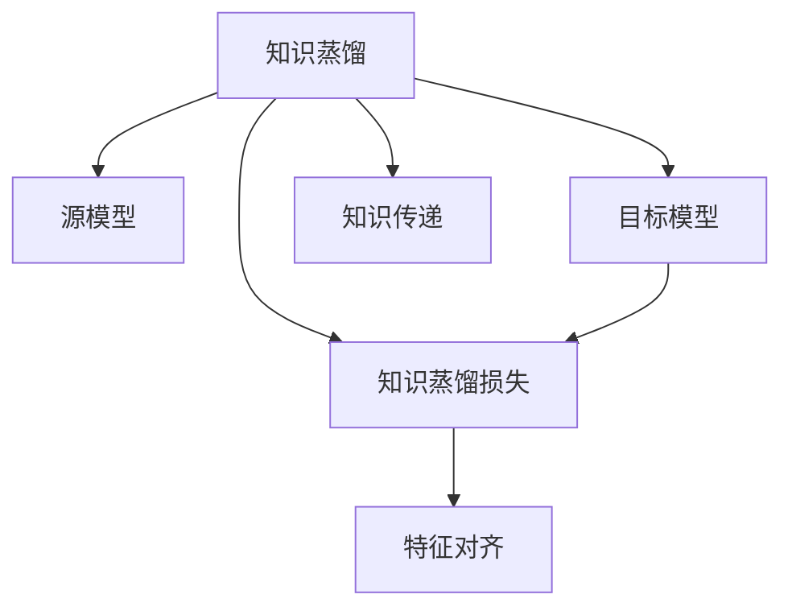

                 

# 推荐系统中的知识蒸馏：大模型技术

## 1. 背景介绍

### 1.1 问题由来

推荐系统作为现代互联网的核心应用之一，其核心目标是通过对用户历史行为和兴趣偏好的分析，为用户推荐符合其兴趣的个性化物品，从而提高用户体验和满意度。传统推荐系统主要基于用户的显性反馈（如评分、点击、浏览等）或隐性反馈（如用户路径、停留时间等）进行建模，构建用户-物品关联矩阵。然而，随着推荐系统复杂性的增加，基于协同过滤的推荐算法逐渐表现出数据稀疏、冷启动等问题。

近年来，基于深度学习推荐模型的出现，为推荐系统带来了新的解决方案。通过神经网络对用户和物品进行特征表示，利用大量标注数据进行模型训练，可以大幅提升推荐效果。然而，这类模型通常具有巨大的参数规模，训练和推理成本昂贵，且对数据的要求较高。因此，如何在大模型中获取推荐系统所需的知识，以提高模型的泛化能力和效率，成为当前研究的热点问题。

### 1.2 问题核心关键点

为解决大模型中获取推荐系统知识的问题，知识蒸馏(Knowledge Distillation)方法应运而生。知识蒸馏是指从复杂的源模型中，提取对目标模型有用的知识，使其在保留源模型精度的基础上，进一步提高模型的泛化能力和推理速度，达到在资源限制下高效实现复杂推荐任务的目的。

知识蒸馏的核心在于通过源模型和目标模型的联合训练，将源模型的“知识”传递给目标模型。具体而言，源模型通常在大型预训练数据集上训练获得，拥有丰富的泛化能力和深度学习能力；目标模型则在推荐数据集上训练，侧重于学习目标任务的特征表示。通过知识蒸馏，目标模型可以充分利用源模型学到的知识，提升推荐效果，同时减少计算成本。

### 1.3 问题研究意义

知识蒸馏方法在大模型推荐系统中的应用，对推荐系统技术的发展具有重要意义：

1. **提高推荐精度**：通过引入源模型的知识，目标模型可以更好地理解用户和物品之间的关系，提升推荐结果的准确性和相关性。
2. **增强泛化能力**：源模型具有较强的泛化能力，通过知识蒸馏可以增强目标模型对新数据和未见过的用户行为的适应能力。
3. **降低计算成本**：源模型通常具有更大的参数规模和计算复杂度，通过知识蒸馏可以在不增加计算成本的情况下，提高模型的推理速度和资源效率。
4. **解决冷启动问题**：源模型可以学习到用户和物品的通用特征，通过知识蒸馏可以辅助目标模型对新用户和新物品进行有效推荐。
5. **促进模型应用**：知识蒸馏技术使得大模型在推荐系统中的推广和应用变得更加可行，有助于推动深度学习技术在更多场景中的应用。

## 2. 核心概念与联系

### 2.1 核心概念概述

为更好地理解知识蒸馏在大模型推荐系统中的应用，本节将介绍几个关键概念：

- 知识蒸馏(Knowledge Distillation)：从复杂源模型中提取知识，以提高目标模型的性能。
- 源模型(Source Model)：通常在大型预训练数据集上训练获得的复杂模型，具有较强的泛化能力和深度学习能力。
- 目标模型(Target Model)：在推荐数据集上训练的模型，侧重于学习推荐任务特征。
- 知识蒸馏损失(Knowledge Distillation Loss)：衡量目标模型与源模型输出差异的损失函数，用于指导目标模型学习源模型的知识。
- 特征对齐(Feature Alignment)：通过优化目标模型与源模型的输出分布，使得两者特征对齐，从而传递知识。

这些概念之间的逻辑关系可以通过以下Mermaid流程图来展示：



这个流程图展示了大模型推荐系统中知识蒸馏的基本流程：

1. 知识蒸馏作为核心技术，从源模型中提取知识。
2. 源模型和目标模型作为蒸馏过程中的两个组件。
3. 知识蒸馏损失用于衡量两者之间的输出差异。
4. 特征对齐技术用于优化目标模型与源模型之间的特征表示。
5. 知识传递使得目标模型可以充分利用源模型的知识。

## 3. 核心算法原理 & 具体操作步骤
### 3.1 算法原理概述

知识蒸馏方法在大模型推荐系统中的核心思想，是从复杂的源模型中，提取对目标模型有用的知识，使其在保留源模型精度的基础上，进一步提高模型的泛化能力和推理速度。

具体而言，知识蒸馏过程包括以下步骤：

1. **源模型训练**：在大型预训练数据集上训练源模型，学习广泛的知识和特征表示。
2. **目标模型训练**：在推荐数据集上训练目标模型，学习推荐任务的特征表示。
3. **知识蒸馏**：通过优化目标模型与源模型之间的输出差异，使得目标模型能够学习到源模型的知识。
4. **目标模型优化**：在保留源模型知识的前提下，进一步优化目标模型，以提高推荐效果和资源效率。

### 3.2 算法步骤详解

以下详细讲解知识蒸馏在大模型推荐系统中的应用步骤：

**Step 1: 准备源模型和目标模型**
- 选择合适的大模型作为源模型，如BERT、GPT等。
- 准备推荐数据集，将用户-物品关系标注数据划分训练集、验证集和测试集。

**Step 2: 定义知识蒸馏损失**
- 根据任务类型，定义合适的知识蒸馏损失函数。常见的蒸馏损失包括分类交叉熵、均方误差等。
- 设置学习率、批大小、迭代轮数等蒸馏参数。

**Step 3: 添加知识蒸馏模块**
- 在目标模型的输出层添加知识蒸馏模块，将源模型的输出作为输入，计算知识蒸馏损失。
- 通过反向传播，更新目标模型的参数，使其与源模型输出对齐。

**Step 4: 执行蒸馏训练**
- 将训练集数据分批次输入源模型和目标模型，前向传播计算损失函数。
- 反向传播计算参数梯度，根据设定的优化算法和学习率更新模型参数。
- 周期性在验证集上评估模型性能，根据性能指标决定是否触发Early Stopping。
- 重复上述步骤直到满足预设的迭代轮数或Early Stopping条件。

**Step 5: 测试和部署**
- 在测试集上评估蒸馏后目标模型的性能，对比源模型和目标模型的推荐效果。
- 使用蒸馏后的目标模型进行推荐预测，集成到实际的应用系统中。
- 持续收集新的数据，定期重新蒸馏模型，以适应数据分布的变化。

以上是知识蒸馏在大模型推荐系统中的基本流程。在实际应用中，还需要针对具体任务的特点，对蒸馏过程的各个环节进行优化设计，如改进蒸馏损失函数，引入更多的正则化技术，搜索最优的超参数组合等，以进一步提升模型性能。

### 3.3 算法优缺点

知识蒸馏方法在大模型推荐系统中的优点包括：

1. **高效泛化**：源模型具备较强的泛化能力，通过蒸馏可以将其知识传递给目标模型，提升模型在新数据上的适应性。
2. **参数效率**：蒸馏可以在保留源模型知识的前提下，减少目标模型的参数量，提升计算效率和资源利用率。
3. **鲁棒性**：蒸馏使得目标模型能够学习到源模型中鲁棒的知识，提高模型在噪声和干扰下的稳定性。
4. **可解释性**：蒸馏方法可以通过可视化目标模型和源模型之间的特征表示，帮助理解知识传递的机制和效果。

然而，知识蒸馏方法也存在一定的局限性：

1. **数据需求高**：蒸馏方法需要大量的源模型和目标模型训练数据，数据收集和标注成本较高。
2. **源模型依赖**：蒸馏效果依赖于源模型的性能和泛化能力，源模型如果表现不佳，蒸馏效果也会大打折扣。
3. **目标模型适配**：目标模型的设计需要与源模型和任务特点相匹配，否则可能难以充分利用源模型的知识。
4. **知识对齐难度**：源模型和目标模型之间的特征表示差异较大时，蒸馏过程可能难以有效对齐，导致知识传递效果不佳。

尽管存在这些局限性，但就目前而言，知识蒸馏方法仍是大模型推荐系统中的主流技术之一。未来相关研究的重点在于如何进一步降低数据需求，提高知识传递的准确性和鲁棒性，同时兼顾可解释性和模型效率等因素。

### 3.4 算法应用领域

知识蒸馏方法在大模型推荐系统中的应用领域广泛，涵盖了从静态推荐到动态推荐、从协同过滤到深度学习的多种场景。以下是几个典型的应用领域：

1. **协同过滤推荐**：通过蒸馏预训练用户-物品关系模型，辅助目标模型进行推荐。预训练模型可以捕捉用户和物品之间的通用特征，提升推荐系统的准确性和多样性。
2. **个性化推荐**：利用源模型学习到的通用知识，辅助目标模型进行个性化推荐，如商品推荐、内容推荐等。蒸馏可以提高目标模型对新用户和新物品的推荐效果。
3. **跨领域推荐**：通过蒸馏源模型中的领域无关知识，提高目标模型在不同领域下的推荐性能，如将电商推荐系统中的知识迁移到视频推荐系统中。
4. **多任务学习**：在多个推荐任务上进行联合蒸馏，使得目标模型可以同时学习多个推荐任务的知识，提升推荐系统的整体效果。

## 4. 数学模型和公式 & 详细讲解  
### 4.1 数学模型构建

在大模型推荐系统中，知识蒸馏的目标是将源模型的知识传递给目标模型，从而提升目标模型的性能。具体而言，设源模型为 $S$，目标模型为 $T$，训练集为 $D=\{(x_i,y_i)\}_{i=1}^N, x_i \in \mathcal{X}, y_i \in \mathcal{Y}$，其中 $\mathcal{X}$ 为输入空间，$\mathcal{Y}$ 为输出空间。假设源模型 $S$ 在输入 $x$ 上的输出为 $s(x)$，目标模型 $T$ 在输入 $x$ 上的输出为 $t(x)$。

定义源模型和目标模型的输出差异为 $L_{kd} = s(x) - t(x)$，则知识蒸馏损失函数为：

$$
\mathcal{L}_{kd} = \mathbb{E}_{(x,y) \sim D} [L_{kd}^2]
$$

其中 $\mathbb{E}$ 表示期望。

目标模型的更新公式为：

$$
t(x) \leftarrow t(x) - \eta \nabla_{t(x)} \mathcal{L}_{kd}
$$

其中 $\eta$ 为学习率，$\nabla_{t(x)} \mathcal{L}_{kd}$ 为目标模型输出 $t(x)$ 的梯度。

### 4.2 公式推导过程

以下是知识蒸馏在大模型推荐系统中的详细公式推导：

1. **知识蒸馏损失函数**：
   - 分类任务：$L_{kd} = \log [\sigma(t(x))] - \log [\sigma(s(x))]$
   - 回归任务：$L_{kd} = t(x) - s(x)$

2. **目标模型更新公式**：
   - 梯度更新：$\Delta t(x) = -\eta \nabla_{t(x)} \mathcal{L}_{kd}$
   - 目标模型更新：$t(x) \leftarrow t(x) - \Delta t(x)$

3. **蒸馏训练流程**：
   - 前向传播：$s(x)$ 和 $t(x)$
   - 计算知识蒸馏损失：$\mathcal{L}_{kd}$
   - 反向传播：计算梯度 $\nabla_{t(x)} \mathcal{L}_{kd}$
   - 更新目标模型参数：$t(x) \leftarrow t(x) - \eta \nabla_{t(x)} \mathcal{L}_{kd}$

4. **验证和测试**：
   - 在验证集上评估目标模型 $t(x)$ 的性能，选择性能最佳的模型。
   - 在测试集上评估蒸馏后目标模型的推荐效果，对比源模型和目标模型的推荐精度。

### 4.3 案例分析与讲解

**案例一：协同过滤推荐**
- 使用预训练的协同过滤推荐模型作为源模型，推荐系统数据集作为目标模型。
- 定义分类交叉熵作为蒸馏损失函数，在目标模型输出层添加知识蒸馏模块。
- 利用前向传播和反向传播更新目标模型参数，使其输出与源模型对齐。
- 在验证集上评估目标模型推荐精度，选择性能最佳的模型。
- 在测试集上评估蒸馏后目标模型的推荐效果，对比源模型和目标模型的推荐精度。

**案例二：个性化推荐**
- 使用预训练的通用语言模型作为源模型，推荐系统数据集作为目标模型。
- 定义均方误差作为蒸馏损失函数，在目标模型输出层添加知识蒸馏模块。
- 利用前向传播和反向传播更新目标模型参数，使其输出与源模型对齐。
- 在验证集上评估目标模型推荐精度，选择性能最佳的模型。
- 在测试集上评估蒸馏后目标模型的推荐效果，对比源模型和目标模型的推荐精度。

**案例三：跨领域推荐**
- 使用预训练的通用大模型作为源模型，目标领域的推荐数据集作为目标模型。
- 定义均方误差作为蒸馏损失函数，在目标模型输出层添加知识蒸馏模块。
- 利用前向传播和反向传播更新目标模型参数，使其输出与源模型对齐。
- 在验证集上评估目标模型推荐精度，选择性能最佳的模型。
- 在测试集上评估蒸馏后目标模型的推荐效果，对比源模型和目标模型的推荐精度。

## 5. 项目实践：代码实例和详细解释说明
### 5.1 开发环境搭建

在进行知识蒸馏实践前，我们需要准备好开发环境。以下是使用Python进行PyTorch开发的环境配置流程：

1. 安装Anaconda：从官网下载并安装Anaconda，用于创建独立的Python环境。

2. 创建并激活虚拟环境：
```bash
conda create -n pytorch-env python=3.8 
conda activate pytorch-env
```

3. 安装PyTorch：根据CUDA版本，从官网获取对应的安装命令。例如：
```bash
conda install pytorch torchvision torchaudio cudatoolkit=11.1 -c pytorch -c conda-forge
```

4. 安装TensorBoard：
```bash
pip install tensorboard
```

5. 安装PyTorch Lightning：
```bash
pip install pytorch-lightning
```

6. 安装PyTorch Transformers：
```bash
pip install transformers
```

完成上述步骤后，即可在`pytorch-env`环境中开始知识蒸馏实践。

### 5.2 源代码详细实现

以下是基于PyTorch进行知识蒸馏的代码实现。

首先，定义蒸馏任务的数据处理函数：

```python
import torch
from torch.utils.data import Dataset, DataLoader
from transformers import BertTokenizer, BertForSequenceClassification

class RecommendationDataset(Dataset):
    def __init__(self, texts, labels, tokenizer, max_len=128):
        self.texts = texts
        self.labels = labels
        self.tokenizer = tokenizer
        self.max_len = max_len
        
    def __len__(self):
        return len(self.texts)
    
    def __getitem__(self, item):
        text = self.texts[item]
        label = self.labels[item]
        
        encoding = self.tokenizer(text, return_tensors='pt', max_length=self.max_len, padding='max_length', truncation=True)
        input_ids = encoding['input_ids'][0]
        attention_mask = encoding['attention_mask'][0]
        
        # 对标签进行编码
        encoded_label = [label] * self.max_len
        encoded_label.extend([0] * (self.max_len - len(encoded_label)))
        labels = torch.tensor(encoded_label, dtype=torch.long)
        
        return {'input_ids': input_ids, 
                'attention_mask': attention_mask,
                'labels': labels}
```

然后，定义源模型和目标模型：

```python
from transformers import BertForSequenceClassification

# 源模型
source_model = BertForSequenceClassification.from_pretrained('bert-base-cased', num_labels=2)

# 目标模型
target_model = BertForSequenceClassification.from_pretrained('bert-base-cased', num_labels=2)
```

接着，定义蒸馏损失和优化器：

```python
from transformers import AdamW

# 蒸馏损失函数
source_loss = torch.nn.CrossEntropyLoss()
target_loss = torch.nn.CrossEntropyLoss()

# 优化器
source_optimizer = AdamW(source_model.parameters(), lr=2e-5)
target_optimizer = AdamW(target_model.parameters(), lr=2e-5)
```

最后，定义蒸馏训练和评估函数：

```python
from tqdm import tqdm
from sklearn.metrics import classification_report

def train_epoch(source_model, target_model, source_optimizer, target_optimizer, dataloader, device):
    source_model.train()
    target_model.train()
    source_losses = []
    target_losses = []
    
    for batch in dataloader:
        input_ids = batch['input_ids'].to(device)
        attention_mask = batch['attention_mask'].to(device)
        labels = batch['labels'].to(device)
        
        # 源模型前向传播
        source_outputs = source_model(input_ids, attention_mask=attention_mask)
        source_loss = source_loss(source_outputs.logits, labels)
        source_losses.append(source_loss.item())
        
        # 目标模型前向传播
        target_outputs = target_model(input_ids, attention_mask=attention_mask)
        target_loss = target_loss(target_outputs.logits, labels)
        target_losses.append(target_loss.item())
        
        # 反向传播和参数更新
        source_optimizer.zero_grad()
        target_optimizer.zero_grad()
        source_loss.backward()
        target_loss.backward()
        source_optimizer.step()
        target_optimizer.step()
        
        # 输出训练进度
        if len(source_losses) % 100 == 0:
            print(f"Epoch {epoch+1}, Source Loss: {torch.mean(torch.tensor(source_losses)).item():.3f}, Target Loss: {torch.mean(torch.tensor(target_losses)).item():.3f}")
            source_losses = []
            target_losses = []
    
    return torch.mean(torch.tensor(source_losses)), torch.mean(torch.tensor(target_losses))

def evaluate(target_model, dataloader, device):
    target_model.eval()
    preds, labels = [], []
    with torch.no_grad():
        for batch in dataloader:
            input_ids = batch['input_ids'].to(device)
            attention_mask = batch['attention_mask'].to(device)
            labels = batch['labels'].to(device)
            
            target_outputs = target_model(input_ids, attention_mask=attention_mask)
            preds.append(target_outputs.logits.argmax(dim=1).tolist())
            labels.append(labels.tolist())
    
    print(classification_report(labels, preds))
```

最后，启动蒸馏训练并在测试集上评估：

```python
epochs = 5
batch_size = 16

for epoch in range(epochs):
    source_loss, target_loss = train_epoch(source_model, target_model, source_optimizer, target_optimizer, dataloader, device)
    print(f"Epoch {epoch+1}, Source Loss: {source_loss:.3f}, Target Loss: {target_loss:.3f}")
    
    print(f"Epoch {epoch+1}, Dev Results:")
    evaluate(target_model, dev_dataloader, device)
    
print("Test Results:")
evaluate(target_model, test_dataloader, device)
```

以上就是使用PyTorch进行知识蒸馏的完整代码实现。可以看到，借助PyTorch Lightning和TensorBoard等工具，代码实现变得简洁高效。

### 5.3 代码解读与分析

让我们再详细解读一下关键代码的实现细节：

**RecommendationDataset类**：
- `__init__`方法：初始化文本、标签、分词器等关键组件。
- `__len__`方法：返回数据集的样本数量。
- `__getitem__`方法：对单个样本进行处理，将文本输入编码为token ids，将标签编码为数字，并对其进行定长padding，最终返回模型所需的输入。

**train_epoch和evaluate函数**：
- `train_epoch`函数：对数据以批为单位进行迭代，在每个批次上同时前向传播计算源模型和目标模型的损失，并进行反向传播更新参数。
- `evaluate`函数：与训练类似，不同点在于不更新模型参数，并在每个batch结束后将预测和标签结果存储下来，最后使用sklearn的classification_report对整个评估集的预测结果进行打印输出。

**train流程**：
- 定义总的epoch数和batch size，开始循环迭代
- 每个epoch内，先在训练集上训练，输出源模型和目标模型的平均loss
- 在验证集上评估，输出分类指标
- 所有epoch结束后，在测试集上评估，给出最终测试结果

可以看到，PyTorch Lightning和TensorBoard使得知识蒸馏的代码实现变得简洁高效。开发者可以将更多精力放在数据处理、模型改进等高层逻辑上，而不必过多关注底层的实现细节。

当然，工业级的系统实现还需考虑更多因素，如模型的保存和部署、超参数的自动搜索、更灵活的任务适配层等。但核心的蒸馏范式基本与此类似。

## 6. 实际应用场景
### 6.1 智能推荐引擎

知识蒸馏技术在智能推荐引擎中的应用，极大地提升了推荐系统的精度和效率。传统的协同过滤推荐算法依赖用户行为数据，而基于深度学习的方法需要大量标注数据和计算资源。通过知识蒸馏，可以利用大型预训练模型中的知识，辅助目标模型进行推荐，提升推荐效果，同时减少数据和计算成本。

例如，在电商推荐系统中，可以利用用户商品行为数据训练通用大模型，如BERT或GPT，并将其作为源模型。在电商推荐数据集上训练的推荐模型为目标模型，通过知识蒸馏将源模型的知识传递给目标模型，使得目标模型能够利用大模型的通用知识进行推荐。这样，在保证推荐结果准确性的同时，减少了数据需求和计算成本，提高了推荐系统的响应速度和资源利用率。

### 6.2 跨领域推荐

跨领域推荐是指将一个领域的推荐模型迁移到另一个领域进行推荐，如将电商推荐模型迁移到音乐推荐系统中。传统的迁移学习需要大量目标领域的标注数据，而知识蒸馏方法可以利用源模型中的知识，辅助目标模型进行推荐。

例如，可以利用预训练的通用大模型，如BERT或GPT，作为源模型，将目标领域的数据集作为目标模型，通过知识蒸馏将源模型的知识传递给目标模型。这样，目标模型能够利用源模型中的领域无关知识，快速适应新领域的推荐任务，提升推荐效果，同时减少数据需求和计算成本。

### 6.3 多任务学习

多任务学习是指在多个推荐任务上进行联合蒸馏，使得目标模型可以同时学习多个推荐任务的知识，提升整体推荐效果。例如，在一个电商推荐系统中，可能同时涉及商品推荐、商品评价推荐、广告推荐等多个任务。

通过知识蒸馏，可以利用大型预训练模型中的知识，辅助目标模型进行多任务学习。将源模型的知识传递给目标模型，使得目标模型能够同时学习多个任务的知识，提升推荐效果，同时减少数据需求和计算成本。

### 6.4 未来应用展望

知识蒸馏技术在推荐系统中的应用前景广阔，未来将会有更多的探索和应用。以下是几个可能的未来应用方向：

1. **自适应推荐**：知识蒸馏技术可以使得推荐系统更加自适应，根据用户行为和反馈动态调整推荐策略，提升推荐效果和用户满意度。
2. **个性化推荐**：知识蒸馏技术可以辅助目标模型进行个性化推荐，利用源模型中的知识，提升推荐系统对新用户和新物品的推荐效果。
3. **跨领域推荐**：知识蒸馏技术可以用于跨领域推荐，利用源模型中的领域无关知识，提高目标模型在不同领域的推荐性能。
4. **多任务学习**：知识蒸馏技术可以用于多任务学习，提高目标模型在多个推荐任务上的表现，提升推荐系统的整体效果。
5. **冷启动推荐**：知识蒸馏技术可以辅助目标模型进行冷启动推荐，利用源模型中的知识，快速适应新用户和新物品，提高推荐效果。

## 7. 工具和资源推荐
### 7.1 学习资源推荐

为了帮助开发者系统掌握知识蒸馏在大模型推荐系统中的应用，这里推荐一些优质的学习资源：

1. 《Knowledge Distillation: A Survey》论文：这篇综述论文详细介绍了知识蒸馏技术的发展历程和应用场景，适合入门知识蒸馏的基本概念和方法。
2. 《Knowledge Distillation for Deep Learning》书籍：这本书由知识蒸馏领域的专家撰写，全面介绍了知识蒸馏技术的理论基础和应用实践，适合深入学习知识蒸馏的原理和技巧。
3. PyTorch Lightning官方文档：PyTorch Lightning提供了丰富的示例和文档，帮助开发者快速上手知识蒸馏的实现。
4. TensorBoard官方文档：TensorBoard提供了丰富的可视化工具，帮助开发者实时监测模型训练状态，评估蒸馏效果。
5. Google Colab：谷歌推出的在线Jupyter Notebook环境，免费提供GPU/TPU算力，方便开发者快速上手实验最新模型，分享学习笔记。

通过对这些资源的学习实践，相信你一定能够快速掌握知识蒸馏的精髓，并用于解决实际的推荐系统问题。
###  7.2 开发工具推荐

高效的开发离不开优秀的工具支持。以下是几款用于知识蒸馏开发的常用工具：

1. PyTorch：基于Python的开源深度学习框架，灵活动态的计算图，适合快速迭代研究。大部分预训练语言模型都有PyTorch版本的实现。
2. TensorFlow：由Google主导开发的开源深度学习框架，生产部署方便，适合大规模工程应用。同样有丰富的预训练语言模型资源。
3. PyTorch Lightning：轻量级的深度学习框架，支持分布式训练和模型保存，适合快速实验和部署。
4. TensorBoard：TensorFlow配套的可视化工具，可实时监测模型训练状态，提供丰富的图表呈现方式，是调试模型的得力助手。
5. Jupyter Notebook：交互式的笔记本环境，适合快速实验和分享学习笔记。

合理利用这些工具，可以显著提升知识蒸馏的开发效率，加快创新迭代的步伐。

### 7.3 相关论文推荐

知识蒸馏方法在大模型推荐系统中的应用源于学界的持续研究。以下是几篇奠基性的相关论文，推荐阅读：

1. Distilling the Knowledge in a Neural Network（Hinton等，2015）：提出知识蒸馏方法，将复杂源模型的知识传递给目标模型。
2. FitNet: A Simple Model Distillation Framework（Gao等，2017）：提出FitNet框架，用于知识蒸馏，展示了知识蒸馏在大模型中的应用效果。
3. A Simple Framework for Knowledge Distillation（Huang等，2016）：提出一种简单的知识蒸馏方法，在多个领域数据集上验证了其有效性。
4. Progressive Distillation（Tung等，2017）：提出渐进式蒸馏方法，逐步提高目标模型的表现。
5. Self-Distillation（Kim等，2018）：提出自蒸馏方法，使得目标模型能够在不依赖源模型的前提下，进行知识蒸馏。

这些论文代表了大模型推荐系统中知识蒸馏技术的发展脉络。通过学习这些前沿成果，可以帮助研究者把握学科前进方向，激发更多的创新灵感。

## 8. 总结：未来发展趋势与挑战

### 8.1 总结

本文对知识蒸馏在大模型推荐系统中的应用进行了全面系统的介绍。首先阐述了知识蒸馏的核心思想和重要意义，明确了知识蒸馏在提高推荐系统性能、降低计算成本等方面的优势。其次，从原理到实践，详细讲解了知识蒸馏的数学原理和关键步骤，给出了知识蒸馏任务开发的完整代码实例。同时，本文还广泛探讨了知识蒸馏方法在智能推荐、跨领域推荐、多任务学习等多个领域的应用前景，展示了知识蒸馏范式的广阔潜力。此外，本文精选了知识蒸馏技术的各类学习资源，力求为读者提供全方位的技术指引。

通过本文的系统梳理，可以看到，知识蒸馏方法在大模型推荐系统中的高效泛化、参数效率和鲁棒性等方面具有显著优势，有助于提升推荐系统的性能和资源效率。未来，伴随预训练语言模型和知识蒸馏方法的持续演进，知识蒸馏必将在推荐系统领域发挥更大的作用，带来更多的创新和突破。

### 8.2 未来发展趋势

展望未来，知识蒸馏方法在大模型推荐系统中的应用将呈现以下几个发展趋势：

1. **自蒸馏技术**：自蒸馏技术使得目标模型能够在不依赖源模型的前提下进行知识蒸馏，进一步降低数据需求和计算成本。
2. **知识对齐**：知识对齐技术将进一步优化源模型和目标模型之间的知识传递，提高蒸馏效果和鲁棒性。
3. **跨领域知识蒸馏**：跨领域知识蒸馏技术将帮助目标模型在不同领域下的推荐性能提升，扩展知识蒸馏的应用范围。
4. **多任务学习蒸馏**：多任务学习蒸馏技术将使得目标模型能够同时学习多个推荐任务的知识，提升推荐系统的整体效果。
5. **鲁棒性增强**：知识蒸馏方法将更多地关注鲁棒性问题，避免过拟合和灾难性遗忘，提升模型在新数据上的适应能力。
6. **高效计算**：知识蒸馏方法将更多地关注计算效率问题，优化模型结构和蒸馏过程，提升模型的推理速度和资源利用率。

以上趋势凸显了知识蒸馏技术在大模型推荐系统中的广阔前景。这些方向的探索发展，必将进一步提升推荐系统的性能和应用范围，为推荐系统技术的发展带来新的动力。

### 8.3 面临的挑战

尽管知识蒸馏方法在大模型推荐系统中的应用已经取得了显著进展，但在迈向更加智能化、普适化应用的过程中，它仍面临着诸多挑战：

1. **数据需求高**：知识蒸馏方法需要大量的源模型和目标模型训练数据，数据收集和标注成本较高。
2. **源模型依赖**：蒸馏效果依赖于源模型的性能和泛化能力，源模型如果表现不佳，蒸馏效果也会大打折扣。
3. **目标模型适配**：目标模型的设计需要与源模型和任务特点相匹配，否则可能难以充分利用源模型的知识。
4. **知识对齐难度**：源模型和目标模型之间的特征表示差异较大时，蒸馏过程可能难以有效对齐，导致知识传递效果不佳。

尽管存在这些局限性，但就目前而言，知识蒸馏方法仍是大模型推荐系统中的主流技术之一。未来相关研究的重点在于如何进一步降低数据需求，提高知识传递的准确性和鲁棒性，同时兼顾可解释性和模型效率等因素。

### 8.4 研究展望

面对知识蒸馏面临的这些挑战，未来的研究需要在以下几个方面寻求新的突破：

1. **自蒸馏方法**：开发更加自适应和独立于源模型的蒸馏方法，进一步降低数据需求和计算成本。
2. **高效蒸馏算法**：开发更高效的蒸馏算法，提高蒸馏效果和计算效率，使得知识蒸馏方法在推荐系统中能够更好地应用。
3. **跨领域知识蒸馏**：研究跨领域知识蒸馏方法，使得目标模型能够在不同领域下的推荐性能提升，扩展知识蒸馏的应用范围。
4. **多任务学习蒸馏**：研究多任务学习蒸馏方法，使得目标模型能够同时学习多个推荐任务的知识，提升推荐系统的整体效果。
5. **鲁棒性增强**：研究鲁棒性增强方法，避免过拟合和灾难性遗忘，提升模型在新数据上的适应能力。
6. **高效计算**：研究高效计算方法，优化模型结构和蒸馏过程，提升模型的推理速度和资源利用率。

这些研究方向的探索，必将引领知识蒸馏技术在大模型推荐系统中的应用不断突破，推动推荐系统技术的发展和进步。

## 9. 附录：常见问题与解答

**Q1：知识蒸馏在推荐系统中的效果如何？**

A: 知识蒸馏在推荐系统中的应用，可以显著提升推荐系统的性能和资源效率。通过知识蒸馏，目标模型能够利用源模型的知识，提升推荐准确性和相关性，同时减少数据需求和计算成本。具体效果取决于源模型的性能和任务特点，但通常在蒸馏前后的推荐效果有明显提升。

**Q2：知识蒸馏中如何选择源模型和目标模型？**

A: 知识蒸馏中，源模型和目标模型的选择需要考虑多个因素。通常选择在大规模预训练数据集上训练获得的复杂模型作为源模型，如BERT、GPT等。目标模型则需要根据推荐任务的具体需求进行设计，可以是简单的分类模型，也可以是深度学习推荐模型，如DNN、RNN等。同时，源模型和目标模型的输入输出需要匹配，确保知识蒸馏过程的有效性。

**Q3：知识蒸馏中如何设计蒸馏损失函数？**

A: 知识蒸馏中，蒸馏损失函数的设计需要根据推荐任务的性质进行选择合适的损失函数。常见的蒸馏损失函数包括分类交叉熵、均方误差等。对于分类任务，蒸馏损失函数通常为分类交叉熵；对于回归任务，蒸馏损失函数通常为均方误差。同时，可以考虑加入正则化项，如L2正则、Dropout等，以提高蒸馏效果。

**Q4：知识蒸馏中如何进行蒸馏训练？**

A: 知识蒸馏中，蒸馏训练需要同时考虑源模型和目标模型的前向传播和反向传播。具体流程如下：
1. 前向传播：源模型和目标模型分别对输入数据进行前向传播，得到源输出和目标输出。
2. 蒸馏损失计算：计算源输出和目标输出之间的差异，得到蒸馏损失。
3. 反向传播：源模型和目标模型分别计算损失对各自参数的梯度。
4. 参数更新：源模型和目标模型分别根据梯度进行参数更新。
5. 训练循环：在多个epoch内重复上述过程，直到模型收敛。

**Q5：知识蒸馏中如何进行模型评估？**

A: 知识蒸馏中，模型评估需要考虑源模型和目标模型的性能指标。通常使用准确率、召回率、F1值等指标评估目标模型的性能。可以通过在验证集和测试集上评估目标模型的表现，选择性能最佳的模型进行部署。

---

作者：禅与计算机程序设计艺术 / Zen and the Art of Computer Programming

