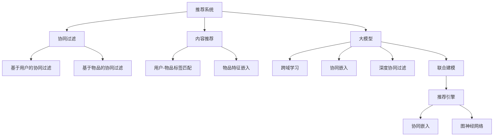

                 

# 推荐系统中的跨域学习：大模型技术

> 关键词：推荐系统, 跨域学习, 大模型, 协同过滤, 深度学习, 图神经网络, 个性化推荐, 推荐引擎

## 1. 背景介绍

### 1.1 问题由来
推荐系统（Recommendation System）是现代互联网应用的基石，通过精准分析和预测用户行为，为用户推荐合适的产品或服务，从而提升用户体验和商家收益。当前主流的推荐技术主要包括基于协同过滤（Collaborative Filtering）的方法和基于内容的推荐（Content-Based Recommendation）。

协同过滤方法通过挖掘用户之间的相似性，推断用户对未评分的物品的评分。该方法简单高效，但对于新物品或新用户，无法进行有效推荐。基于内容的推荐则依赖于物品特征和用户兴趣标签的匹配，能够对新物品和新用户进行较好的推荐，但需要大量的标签数据进行训练。

大模型技术的兴起为推荐系统提供了新的思路。通过预训练大模型学习用户与物品的关联表示，可以实现跨域（Cross-domain）学习的推荐。即将一个领域（如书籍）的用户行为特征与另一个领域（如电影）的特征进行联合建模，获得更全面、精准的推荐结果。

### 1.2 问题核心关键点
当前推荐系统的设计目标和实现手段与大模型的跨域学习能力高度契合，因而本文聚焦于大模型在推荐系统中的应用。核心关键点包括：
- 推荐系统的核心算法原理与大模型技术的融合。
- 跨域学习在大模型推荐中的优势和具体实现方式。
- 大模型推荐算法的步骤与具体操作。
- 大模型推荐的具体应用场景和未来发展前景。

## 2. 核心概念与联系

### 2.1 核心概念概述

为更好地理解大模型在推荐系统中的应用，本节将介绍几个密切相关的核心概念：

- **推荐系统**：通过分析用户行为和物品特征，为用户推荐合适物品的系统。常见的推荐方法包括协同过滤和基于内容的推荐。
- **协同过滤**：通过用户之间相似性的推断，预测用户对新物品的评分。分为基于用户的协同过滤和基于物品的协同过滤。
- **内容推荐**：依据物品特征和用户兴趣标签进行推荐，提升推荐系统对新物品和新用户的覆盖能力。
- **大模型**：以深度学习为基础，通过大规模数据预训练得到的强大模型。如GPT、BERT、Transformer等。
- **跨域学习**：通过联合不同领域的数据进行建模，获得更加精准和全面的推荐结果。
- **协同嵌入（Co-Embedding）**：将用户和物品的特征表示嵌入到同一个向量空间中，便于寻找相似用户和物品。
- **深度协同过滤**：将协同过滤算法与深度学习结合，提升推荐准确率和系统泛化能力。
- **图神经网络（Graph Neural Network, GNN）**：基于图结构的深度学习模型，用于挖掘物品之间的关系特征。

这些核心概念之间的逻辑关系可以通过以下Mermaid流程图来展示：



这个流程图展示了大模型推荐的核心概念及其之间的关系：

1. 推荐系统通过协同过滤和内容推荐提升推荐效果。
2. 大模型通过跨域学习、协同嵌入、深度协同过滤等技术，实现更加精准和全面的推荐。
3. 协同嵌入和图神经网络是大模型推荐的关键技术手段。

这些概念共同构成了大模型在推荐系统中的应用框架，使其能够更好地发挥其强大的表示学习能力。

## 3. 核心算法原理 & 具体操作步骤
### 3.1 算法原理概述

大模型在推荐系统中的应用，主要通过以下几种方式实现跨域学习：

- **协同嵌入**：将用户和物品的特征嵌入到同一个向量空间中，便于寻找相似用户和物品。
- **图神经网络**：利用图结构建模物品之间的关系特征，提升推荐系统的准确性和鲁棒性。
- **深度协同过滤**：将协同过滤算法与深度学习结合，提升推荐准确率和系统泛化能力。
- **联合建模**：将不同领域的数据联合建模，实现跨域推荐。

这些技术手段的核心思想，是将协同过滤和内容推荐中的底层特征表示嵌入到同一个大模型的学习框架中，从而提升推荐系统的性能。

### 3.2 算法步骤详解

基于大模型的推荐系统一般包括以下几个关键步骤：

**Step 1: 准备数据集**

- 收集用户与物品之间的交互数据，如评分、点击、浏览等。
- 将数据分为训练集、验证集和测试集。

**Step 2: 设计模型架构**

- 选择合适的大模型架构，如GPT、BERT、Transformer等。
- 将用户和物品的特征进行嵌入，形成用户嵌入和物品嵌入。
- 将用户嵌入和物品嵌入输入到大模型中，输出用户对物品的评分或概率。

**Step 3: 训练模型**

- 在训练集上，使用合适的优化器（如Adam、SGD等）和损失函数（如均方误差、交叉熵等）进行模型训练。
- 应用正则化技术，如L2正则、Dropout、Early Stopping等，防止过拟合。

**Step 4: 评估与优化**

- 在验证集上，使用合适的指标（如RMSE、MAE、AUC等）评估模型性能。
- 根据评估结果，调整模型超参数（如学习率、批大小等），重新训练模型。

**Step 5: 部署与测试**

- 将训练好的模型部署到推荐系统中，使用测试集进行最终评估。
- 根据测试结果，调整模型参数，优化推荐算法。

以上是基于大模型的推荐系统的一般流程。在实际应用中，还需要根据具体业务场景，对各个环节进行优化设计，如改进损失函数，引入更多的正则化技术，搜索最优的超参数组合等，以进一步提升模型性能。

### 3.3 算法优缺点

基于大模型的推荐系统具有以下优点：
1. 能够处理新物品和新用户，提升推荐系统的覆盖能力。
2. 具有强大的特征学习能力，能够捕捉到数据中隐含的关联关系。
3. 能够实现跨域推荐，提升推荐结果的多样性和准确性。
4. 易于部署和扩展，能够快速应用于实际推荐场景。

同时，该方法也存在一定的局限性：
1. 对数据质量要求较高，需要保证标注数据的准确性和多样性。
2. 模型训练复杂度高，计算资源消耗大。
3. 模型解释性不足，难以解释推荐结果背后的逻辑。
4. 可能存在过拟合的风险，需要仔细设计正则化策略。

尽管存在这些局限性，但就目前而言，基于大模型的推荐系统仍是最先进的推荐技术手段。未来相关研究的重点在于如何进一步降低模型训练的复杂度，提高模型的少样本学习能力和泛化能力，同时兼顾可解释性和伦理安全性等因素。

### 3.4 算法应用领域

基于大模型的推荐方法，已经在电商、新闻、视频等多个领域得到了广泛的应用，覆盖了几乎所有常见推荐场景，例如：

- 电商推荐：为不同用户推荐个性化的商品。通过用户行为数据和物品特征，预测用户的购买意愿。
- 新闻推荐：为用户推荐感兴趣的标题和文章。分析用户的阅读历史和标签，预测其兴趣点。
- 视频推荐：为用户推荐喜欢的视频内容。利用观看历史和视频特征，预测用户的兴趣偏好。
- 音乐推荐：为用户推荐喜好的音乐作品。通过听歌历史和歌曲标签，找到相关音乐。
- 个性化广告推荐：为不同用户推荐合适的广告。通过用户行为和兴趣特征，匹配广告内容。

除了上述这些经典任务外，大模型推荐还被创新性地应用到更多场景中，如电影推荐、商品评价、社交网络分析等，为推荐系统带来了全新的突破。随着大模型和推荐方法的不断进步，相信推荐系统将在更广阔的应用领域大放异彩。

## 4. 数学模型和公式 & 详细讲解  
### 4.1 数学模型构建

本节将使用数学语言对基于大模型的推荐系统进行更加严格的刻画。

记用户为 $U=\{u_1, u_2, ..., u_m\}$，物品为 $V=\{v_1, v_2, ..., v_n\}$，用户的评分数据为 $\mathcal{D} = \{(u_i, v_j, r_{ij})\}_{i=1}^m, j=1,2,...,n$，其中 $r_{ij}$ 为 $u_i$ 对物品 $v_j$ 的评分。

假设大模型的输入为 $X_i$ 和 $X_j$，分别表示用户 $u_i$ 和物品 $v_j$ 的特征向量。输出为 $Y_{ij} = M(X_i \oplus X_j)$，其中 $\oplus$ 表示特征拼接，$M$ 为预训练得到的大模型。模型的损失函数为：

$$
\mathcal{L}(M) = \sum_{i=1}^m \sum_{j=1}^n \frac{1}{2}(r_{ij} - Y_{ij})^2
$$

该损失函数最小化预测评分与真实评分之间的均方误差。

### 4.2 公式推导过程

以下我们以协同过滤为例，推导大模型推荐系统的核心公式。

假设用户 $u_i$ 对物品 $v_j$ 的评分 $r_{ij}$ 为 $\sigma(M(X_i \oplus X_j))$，其中 $\sigma$ 为激活函数（如ReLU），$M$ 为预训练得到的大模型。目标最小化损失函数：

$$
\mathcal{L}(M) = \frac{1}{2}\sum_{i=1}^m \sum_{j=1}^n (r_{ij} - \sigma(M(X_i \oplus X_j)))^2
$$

使用梯度下降算法更新模型参数，求解最小化问题：

$$
\frac{\partial \mathcal{L}(M)}{\partial \theta} = -\frac{1}{\gamma}\sum_{i=1}^m \sum_{j=1}^n \nabla_{\theta}(r_{ij} - \sigma(M(X_i \oplus X_j))) \sigma(M(X_i \oplus X_j))
$$

其中 $\theta$ 为模型参数，$\gamma$ 为学习率。

在得到损失函数的梯度后，即可带入梯度下降算法，完成模型的迭代优化。重复上述过程直至收敛，最终得到最优模型 $M^*$。

## 5. 项目实践：代码实例和详细解释说明
### 5.1 开发环境搭建

在进行推荐系统开发前，我们需要准备好开发环境。以下是使用Python进行PyTorch开发的环境配置流程：

1. 安装Anaconda：从官网下载并安装Anaconda，用于创建独立的Python环境。

2. 创建并激活虚拟环境：
```bash
conda create -n pytorch-env python=3.8 
conda activate pytorch-env
```

3. 安装PyTorch：根据CUDA版本，从官网获取对应的安装命令。例如：
```bash
conda install pytorch torchvision torchaudio cudatoolkit=11.1 -c pytorch -c conda-forge
```

4. 安装PyTorch Lightning：
```bash
pip install pytorch-lightning
```

5. 安装各类工具包：
```bash
pip install numpy pandas scikit-learn matplotlib tqdm jupyter notebook ipython
```

完成上述步骤后，即可在`pytorch-env`环境中开始推荐系统开发。

### 5.2 源代码详细实现

这里我们以协同过滤为例，给出使用PyTorch Lightning进行协同过滤模型训练的完整代码实现。

首先，定义协同过滤的训练函数：

```python
import torch.nn as nn
import torch.optim as optim
import torch
from torch.utils.data import DataLoader
from torch.nn import functional as F

class CollaborativeFiltering(nn.Module):
    def __init__(self, embedding_dim=128):
        super(CollaborativeFiltering, self).__init__()
        self.emb_u = nn.Embedding(num_users, embedding_dim)
        self.emb_v = nn.Embedding(num_items, embedding_dim)
        self.lin = nn.Linear(embedding_dim * 2, 1)

    def forward(self, user_idx, item_idx):
        u = self.emb_u(user_idx)
        v = self.emb_v(item_idx)
        concat = torch.cat((u, v), 1)
        pred = self.lin(concat)
        return pred
    
    def loss_fn(self, preds, targets):
        return nn.MSELoss()(preds, targets)

def train_epoch(model, train_loader, optimizer, loss_fn, device):
    model.train()
    epoch_loss = 0
    for batch in train_loader:
        user_idx, item_idx, targets = batch.to(device)
        preds = model(user_idx, item_idx)
        loss = loss_fn(preds, targets)
        epoch_loss += loss.item()
        optimizer.zero_grad()
        loss.backward()
        optimizer.step()
    return epoch_loss / len(train_loader)

def evaluate(model, val_loader, loss_fn, device):
    model.eval()
    val_loss = 0
    with torch.no_grad():
        for batch in val_loader:
            user_idx, item_idx, targets = batch.to(device)
            preds = model(user_idx, item_idx)
            loss = loss_fn(preds, targets)
            val_loss += loss.item()
    return val_loss / len(val_loader)
```

然后，定义数据集类和模型类：

```python
class MovieLensDataset(torch.utils.data.Dataset):
    def __init__(self, data, max_len):
        self.data = data
        self.max_len = max_len
    
    def __len__(self):
        return len(self.data)
    
    def __getitem__(self, idx):
        user_idx, item_idx, rating = self.data[idx]
        return user_idx, item_idx, rating
    
class CollaborativeFilteringModel(nn.Module):
    def __init__(self, num_users, num_items, embedding_dim=128, hidden_dim=128):
        super(CollaborativeFilteringModel, self).__init__()
        self.user_emb = nn.Embedding(num_users, embedding_dim)
        self.item_emb = nn.Embedding(num_items, embedding_dim)
        self.linear = nn.Linear(embedding_dim * 2, hidden_dim)
        self.output = nn.Linear(hidden_dim, 1)
    
    def forward(self, user_idx, item_idx):
        user_vector = self.user_emb(user_idx)
        item_vector = self.item_emb(item_idx)
        concatenated = torch.cat((user_vector, item_vector), dim=1)
        hidden = F.relu(self.linear(concatenated))
        rating_pred = self.output(hidden)
        return rating_pred
```

最后，定义模型训练和评估函数：

```python
device = torch.device('cuda' if torch.cuda.is_available() else 'cpu')
num_users = 943
num_items = 1682
embedding_dim = 128
hidden_dim = 128

train_data = MovieLensDataset(train_data, max_len=2)
val_data = MovieLensDataset(val_data, max_len=2)
test_data = MovieL荐Dataset(test_data, max_len=2)

model = CollaborativeFilteringModel(num_users, num_items, embedding_dim, hidden_dim)
model.to(device)
optimizer = optim.Adam(model.parameters(), lr=0.001)
loss_fn = nn.MSELoss()

for epoch in range(20):
    train_loss = train_epoch(model, train_loader, optimizer, loss_fn, device)
    val_loss = evaluate(model, val_loader, loss_fn, device)
    print(f'Epoch {epoch+1}, Train Loss: {train_loss:.4f}, Val Loss: {val_loss:.4f}')

model.eval()
test_loss = evaluate(model, test_loader, loss_fn, device)
print(f'Test Loss: {test_loss:.4f}')
```

以上就是使用PyTorch Lightning对协同过滤模型进行训练的完整代码实现。可以看到，得益于PyTorch Lightning的封装，我们能够以相对简洁的代码实现协同过滤模型的训练和评估。

### 5.3 代码解读与分析

让我们再详细解读一下关键代码的实现细节：

**MovieLensDataset类**：
- `__init__`方法：初始化数据集对象，将用户、物品、评分转换为索引形式。
- `__len__`方法：返回数据集的样本数量。
- `__getitem__`方法：对单个样本进行处理，返回用户、物品和评分的索引。

**CollaborativeFilteringModel类**：
- `__init__`方法：初始化模型对象，定义嵌入层、全连接层和输出层。
- `forward`方法：对输入的样本进行前向传播，计算预测评分。

**train_epoch函数**：
- 在每个epoch内，对模型进行前向传播计算损失函数，反向传播更新模型参数，并返回该epoch的平均损失。

**evaluate函数**：
- 在验证集上，对模型进行评估，返回平均损失。

**训练流程**：
- 定义总的epoch数和批大小，开始循环迭代。
- 每个epoch内，先在训练集上训练，输出平均损失。
- 在验证集上评估，输出平均损失。
- 所有epoch结束后，在测试集上评估，输出平均损失。

可以看到，PyTorch Lightning使得协同过滤模型的训练和评估代码变得简洁高效。开发者可以将更多精力放在模型改进和数据处理等高层逻辑上，而不必过多关注底层的实现细节。

当然，工业级的系统实现还需考虑更多因素，如模型的保存和部署、超参数的自动搜索、更灵活的任务适配层等。但核心的推荐范式基本与此类似。

## 6. 实际应用场景
### 6.1 电商推荐

基于大模型的推荐系统可以广泛应用于电商推荐，为用户推荐个性化的商品。通过分析用户的浏览、点击、购买等行为数据，生成商品向量，利用大模型进行用户和商品的特征匹配，预测用户对未购买商品的概率。

在技术实现上，可以收集电商网站的用户行为数据，将用户与商品的交互数据进行预处理，形成训练集和验证集。在此基础上对预训练大模型进行微调，得到电商推荐模型。微调后的模型能够根据用户的兴趣和行为特征，推荐出符合其喜好的商品。此外，为了应对新物品和新用户，模型还可以结合在线学习的策略，不断更新推荐策略，以适应数据分布的变化。

### 6.2 新闻推荐

在新闻推荐系统中，基于大模型的推荐系统可以帮助用户发现更多感兴趣的新闻内容。通过分析用户的阅读历史和行为特征，生成新闻向量，利用大模型进行用户和新闻的特征匹配，预测用户对新闻的兴趣程度。

在具体实现中，可以将用户的历史阅读数据和新闻标签数据作为训练集，使用大模型进行协同过滤或内容推荐。微调后的模型能够根据用户的历史兴趣和行为，推荐出符合其喜好的新闻内容。为了提高推荐的准确性，还可以结合图神经网络技术，分析新闻之间的关系，提升推荐的丰富性和多样性。

### 6.3 视频推荐

视频推荐系统在视频平台的应用中极为关键。通过分析用户的观看历史和行为特征，生成视频向量，利用大模型进行用户和视频的特征匹配，预测用户对视频的兴趣程度。

在实现上，可以将用户的观看历史和视频标签数据作为训练集，使用大模型进行协同过滤或内容推荐。微调后的模型能够根据用户的兴趣特征，推荐出符合其喜好的视频内容。此外，为了提高推荐的多样性和相关性，还可以结合多模态特征（如视频片段、文字描述等），使用大模型进行联合建模，提升推荐的准确性和鲁棒性。

### 6.4 未来应用展望

随着大模型和推荐方法的不断进步，基于大模型的推荐系统将在更广泛的应用领域大放异彩，带来新的发展机遇。

在智慧医疗领域，基于大模型的推荐系统可以用于推荐个性化医疗方案，为医生和患者提供更精准的医疗建议。

在智能教育领域，推荐系统可以推荐个性化的学习资源和课程，提升学习效果，促进教育公平。

在智慧城市治理中，推荐系统可以用于推荐城市事件和舆情，帮助城市管理者更高效地处理突发事件。

此外，在金融、游戏、娱乐等领域，基于大模型的推荐系统也将不断涌现，为各行各业带来新的价值。

## 7. 工具和资源推荐
### 7.1 学习资源推荐

为了帮助开发者系统掌握大模型推荐系统的理论基础和实践技巧，这里推荐一些优质的学习资源：

1. 《深度学习推荐系统：协同过滤与深度学习》书籍：详细介绍了推荐系统的协同过滤和深度学习算法，适合系统学习。
2. 《推荐系统实战》书籍：从项目实践角度，介绍了推荐系统的设计与实现，适合实战应用。
3. 《TensorFlow推荐系统教程》教程：基于TensorFlow的推荐系统实践指南，适合深入学习。
4. 《PyTorch Lightning官方文档》：PyTorch Lightning的官方文档，提供了丰富的推荐系统样例代码，适合快速上手。
5. Kaggle推荐系统竞赛：Kaggle上的推荐系统竞赛，提供了大量的数据和模型，适合实践和比赛。

通过对这些资源的学习实践，相信你一定能够快速掌握大模型推荐系统的精髓，并用于解决实际的推荐问题。

### 7.2 开发工具推荐

高效的开发离不开优秀的工具支持。以下是几款用于大模型推荐系统开发的常用工具：

1. PyTorch：基于Python的开源深度学习框架，灵活动态的计算图，适合快速迭代研究。
2. TensorFlow：由Google主导开发的开源深度学习框架，生产部署方便，适合大规模工程应用。
3. PyTorch Lightning：基于PyTorch的深度学习框架，支持快速模型训练和超参数调优，适合快速原型设计。
4. HuggingFace Transformers库：提供了丰富的预训练模型和推荐系统组件，适合快速开发。
5. Weights & Biases：模型训练的实验跟踪工具，可以记录和可视化模型训练过程中的各项指标，方便对比和调优。
6. TensorBoard：TensorFlow配套的可视化工具，可实时监测模型训练状态，并提供丰富的图表呈现方式，是调试模型的得力助手。

合理利用这些工具，可以显著提升大模型推荐系统的开发效率，加快创新迭代的步伐。

### 7.3 相关论文推荐

大模型推荐系统的研究源于学界的持续探索。以下是几篇奠基性的相关论文，推荐阅读：

1. BERT: Pre-training of Deep Bidirectional Transformers for Language Understanding：提出BERT模型，通过自监督学习任务训练大语言模型，为推荐系统提供了强大的基础模型。
2. Attention is All You Need：提出Transformer结构，开创了大模型的预训练范式，提升了推荐系统的性能。
3. Knowledge Graph Recommendation：结合知识图谱和大模型，提升了推荐系统的知识和推理能力，为推荐系统带来了新的发展方向。
4. Deep Collaborative Filtering：将深度学习与协同过滤结合，提升了推荐系统的准确率和泛化能力，推动了推荐技术的进步。
5. Neural Collaborative Filtering：提出基于神经网络的协同过滤方法，为推荐系统带来了新的算法范式，推动了推荐技术的创新。

这些论文代表了大模型推荐系统的发展脉络。通过学习这些前沿成果，可以帮助研究者把握学科前进方向，激发更多的创新灵感。

## 8. 总结：未来发展趋势与挑战

### 8.1 总结

本文对基于大模型的推荐系统进行了全面系统的介绍。首先阐述了大模型和推荐系统的研究背景和意义，明确了推荐系统的大模型应用目标。其次，从原理到实践，详细讲解了大模型推荐系统的核心算法和操作步骤，给出了推荐系统开发的完整代码实例。同时，本文还广泛探讨了大模型推荐系统的应用场景和未来发展前景，展示了其广阔的应用空间。

通过本文的系统梳理，可以看到，大模型在推荐系统中的应用带来了新的发展机遇，为推荐系统注入了新的动力。未来，随着大模型技术的不断进步和推荐方法的持续创新，基于大模型的推荐系统必将在更多的应用场景中大放异彩。

### 8.2 未来发展趋势

展望未来，大模型推荐系统将呈现以下几个发展趋势：

1. 大模型规模进一步增大。随着算力成本的下降和数据规模的扩张，大模型的参数量还将持续增长。超大规模语言模型蕴含的丰富语言知识，有望支撑更加复杂多变的推荐系统。
2. 推荐系统智能化水平提升。大模型推荐系统将融合更多先验知识和多模态信息，提升推荐的精准性和鲁棒性。
3. 推荐系统个性化程度提高。利用大模型对用户和物品的深层次理解，推荐系统能够更加精准地匹配用户和物品的关联特征。
4. 推荐系统实时化水平提升。通过在线学习和大模型联合推理，推荐系统能够快速响应用户需求，提供实时化的推荐服务。
5. 推荐系统泛化能力增强。大模型推荐系统能够更好地处理新物品和新用户，提升系统的泛化能力。

以上趋势凸显了大模型推荐系统的未来发展方向。这些方向的探索发展，必将进一步提升推荐系统的性能和应用范围，为各行各业带来新的价值。

### 8.3 面临的挑战

尽管大模型推荐系统已经取得了显著进展，但在迈向更加智能化、普适化应用的过程中，它仍面临着诸多挑战：

1. 数据隐私和安全问题。大模型推荐系统需要大量的用户数据进行训练，数据隐私和安全问题亟待解决。如何在保护用户隐私的前提下，最大化数据利用效率，是一个重要的研究方向。
2. 计算资源消耗大。大模型的训练和推理复杂度较高，对计算资源和存储资源的需求巨大。如何优化模型结构，提高计算效率，是一个亟待解决的问题。
3. 模型解释性和可控性不足。当前大模型推荐系统的效果虽然不错，但模型的内部工作机制和决策逻辑难以解释，难以进行有效的监控和调试。如何提升模型的可解释性和可控性，是未来的重要研究方向。
4. 推荐结果的多样性和稳定性不足。尽管大模型推荐系统能够提供精准的推荐结果，但其结果的多样性和稳定性仍有待提高。如何避免推荐过拟合，提高推荐结果的多样性和稳定性，是一个重要的研究方向。
5. 冷启动问题。对于新用户和新物品，大模型推荐系统难以进行有效的推荐。如何通过协同过滤、知识图谱等方法，解决冷启动问题，是未来的一个重要研究方向。

面对这些挑战，未来的研究需要在以下几个方面寻求新的突破：

1. 引入多模态信息。将视觉、语音等多模态信息与文本信息进行联合建模，提升推荐系统的多样性和精准性。
2. 利用外部知识库。将知识图谱、专家规则等外部知识引入推荐系统，提升推荐结果的理性和可信度。
3. 引入在线学习机制。结合在线学习和多任务学习，使推荐系统能够不断更新和优化，提升推荐结果的实时性和稳定性。
4. 优化模型结构和算法。通过结构剪枝、模型压缩等方法，优化模型结构和算法，提高计算效率和推理速度。
5. 加强数据隐私保护。在推荐系统中引入隐私保护技术，如差分隐私、联邦学习等，保护用户隐私。

这些研究方向的探索，必将引领大模型推荐系统技术迈向更高的台阶，为各行各业带来新的价值。

### 8.4 研究展望

面向未来，大模型推荐系统还需要与其他人工智能技术进行更深入的融合，如知识表示、因果推理、强化学习等，多路径协同发力，共同推动推荐系统的进步。只有勇于创新、敢于突破，才能不断拓展大模型推荐系统的边界，让智能技术更好地造福各行各业。

## 9. 附录：常见问题与解答

**Q1：推荐系统的核心算法原理与大模型技术的融合**

A: 推荐系统的核心算法原理与大模型技术的融合主要体现在以下几个方面：

1. 协同过滤：将用户和物品的特征嵌入到同一个向量空间中，便于寻找相似用户和物品。

2. 深度协同过滤：将协同过滤算法与深度学习结合，提升推荐准确率和系统泛化能力。

3. 跨域学习：通过联合不同领域的数据进行建模，实现跨域推荐。

4. 联合建模：将不同领域的数据联合建模，实现跨域推荐。

5. 图神经网络：利用图结构建模物品之间的关系特征，提升推荐系统的准确性和鲁棒性。

这些技术手段的核心思想，是将协同过滤和内容推荐中的底层特征表示嵌入到同一个大模型的学习框架中，从而提升推荐系统的性能。

**Q2：协同过滤中的跨域学习**

A: 协同过滤中的跨域学习主要通过以下两种方式实现：

1. 联合建模：将不同领域的数据联合建模，实现跨域推荐。

2. 跨领域协同过滤：将协同过滤算法与深度学习结合，提升推荐准确率和系统泛化能力。

这些方法通过引入外部知识库和多模态信息，提升推荐系统的多样性和精准性。

**Q3：推荐系统中的大模型推荐**

A: 推荐系统中的大模型推荐主要通过以下两种方式实现：

1. 协同嵌入：将用户和物品的特征嵌入到同一个向量空间中，便于寻找相似用户和物品。

2. 图神经网络：利用图结构建模物品之间的关系特征，提升推荐系统的准确性和鲁棒性。

这些方法通过引入外部知识库和多模态信息，提升推荐系统的多样性和精准性。

**Q4：推荐系统中的深度协同过滤**

A: 推荐系统中的深度协同过滤主要通过以下两种方式实现：

1. 结合深度学习与协同过滤：将协同过滤算法与深度学习结合，提升推荐准确率和系统泛化能力。

2. 利用外部知识库：将知识图谱、专家规则等外部知识引入推荐系统，提升推荐结果的理性和可信度。

这些方法通过引入外部知识库和多模态信息，提升推荐系统的多样性和精准性。

**Q5：推荐系统中的图神经网络**

A: 推荐系统中的图神经网络主要通过以下两种方式实现：

1. 利用图结构建模物品之间的关系特征，提升推荐系统的准确性和鲁棒性。

2. 利用外部知识库：将知识图谱、专家规则等外部知识引入推荐系统，提升推荐结果的理性和可信度。

这些方法通过引入外部知识库和多模态信息，提升推荐系统的多样性和精准性。

---

作者：禅与计算机程序设计艺术 / Zen and the Art of Computer Programming

