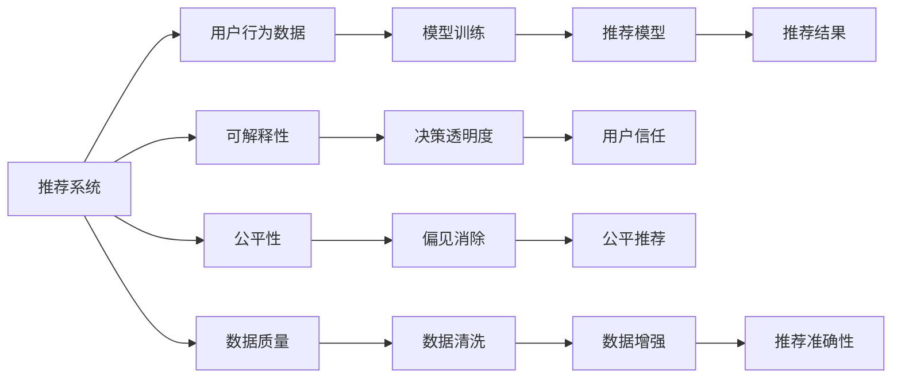

                 

# 推荐系统的可信度与透明度：可解释性的重要作用

## 1. 背景介绍

### 1.1 问题由来
随着互联网和数字技术的迅猛发展，推荐系统已经成为各类互联网产品的重要组成部分，如电商、社交网络、视频平台等。推荐系统通过分析用户行为数据，预测用户兴趣，推荐最符合用户需求的内容，极大地提升了用户体验和平台的收益。然而，推荐系统在带来便利的同时，也引发了一系列信任与透明度问题。

推荐系统依赖大量用户数据进行训练，不可避免地引入偏见和歧视，导致推荐结果不公平、不透明。用户往往无法理解系统推荐的背后逻辑，只能被动接受推荐结果。一旦推荐错误，用户可能会对平台失去信任，甚至面临隐私泄露、信息过载等风险。近年来，一些大公司如Amazon、Facebook等也因推荐系统推荐错误导致用户信任危机，进一步凸显了推荐系统透明度的重要性。

### 1.2 问题核心关键点
推荐系统可信度与透明度的关键点在于用户对推荐结果的信任和对推荐过程的透明。具体表现为：

- **用户信任**：用户是否相信推荐系统推荐的物品和信息是符合其真实需求的。
- **推荐透明度**：用户能否理解推荐系统如何得出推荐结果，是否存在明显的偏见或歧视。

提高推荐系统的可信度与透明度，不仅能够提升用户满意度，还能增强用户对平台的信任，促使用户持续使用产品。因此，可解释性（Explainability）成为了推荐系统研究的热点话题，被认为是大数据和人工智能技术的核心价值所在。

### 1.3 问题研究意义
研究推荐系统的可信度与透明度，对于构建用户信任、提升用户体验、促进商业繁荣具有重要意义：

1. **提升用户信任**：透明的推荐过程和可解释的推荐结果，使用户更加相信推荐系统，降低决策成本，提升满意度。
2. **增强用户体验**：推荐系统通过解释推荐逻辑，帮助用户理解推荐原因，进一步优化推荐结果，提升用户体验。
3. **促进商业繁荣**：信任的推荐系统更容易获得用户粘性，提升商业变现能力和市场竞争力。
4. **遵循伦理规范**：可解释的推荐模型更容易接受外部监管和用户审查，避免推荐偏见和歧视。

本文将从理论和实践两方面，深入探讨推荐系统的可信度与透明度，特别是可解释性在推荐系统中的应用与优化。

## 2. 核心概念与联系

### 2.1 核心概念概述

为更好地理解推荐系统的可信度与透明度，本节将介绍几个密切相关的核心概念：

- **推荐系统(Recommender System)**：通过分析用户历史行为数据和物品属性，预测用户对物品的兴趣，推荐最符合用户需求的物品。
- **可解释性(Explainability)**：解释推荐系统的决策过程，使用户能够理解推荐结果的来源和原因，提高用户信任。
- **公平性(Fairness)**：确保推荐结果对不同用户、不同属性群体是公平的，避免推荐偏见。
- **透明性(Transparency)**：揭示推荐系统的内部机制和决策逻辑，使用户能够监督和审查推荐过程。
- **信任度(Trust)**：用户对推荐系统推荐结果的信任程度，通常由推荐结果的质量和推荐过程的透明性决定。

这些核心概念之间存在密切联系，共同构成了推荐系统的可信度与透明度的核心问题。通过理解这些概念，我们可以更好地把握推荐系统的优化方向和应用场景。

### 2.2 核心概念原理和架构的 Mermaid 流程图



这个流程图展示了推荐系统的核心概念及其相互关系：

1. 推荐系统通过分析用户行为数据进行模型训练，构建推荐模型。
2. 推荐模型基于训练数据预测用户兴趣，产生推荐结果。
3. 可解释性揭示推荐模型的决策逻辑，使用户理解推荐原因。
4. 透明性公开推荐系统的内部机制，提升用户信任。
5. 公平性保证推荐结果对所有用户群体是公平的，避免偏见。
6. 数据质量影响模型训练效果，数据清洗和增强提升推荐准确性。

这些概念共同作用，共同决定了推荐系统的可信度和透明度。

## 3. 核心算法原理 & 具体操作步骤

### 3.1 算法原理概述

推荐系统的可信度与透明度主要通过可解释性算法实现。可解释性算法旨在揭示推荐模型内部的决策逻辑，使用户能够理解推荐结果的来源和原因。常见可解释性算法包括：

- **局部解释模型**：通过可视化、规则提取等方式，展示推荐结果的特征重要性。
- **全局解释模型**：通过生成规则、决策树等方式，全面解释推荐模型的决策过程。
- **混合解释模型**：结合局部和全局解释方法，提供多层次、多维度的解释信息。

推荐系统的核心算法流程包括数据准备、模型训练、推荐生成、解释输出等步骤：

1. **数据准备**：收集和清洗用户行为数据和物品属性数据，构建训练集和测试集。
2. **模型训练**：选择适合的推荐算法（如协同过滤、内容推荐、深度学习等）进行模型训练。
3. **推荐生成**：基于训练好的模型，对新用户和新物品进行推荐。
4. **解释输出**：根据用户请求，输出推荐结果及其解释。

### 3.2 算法步骤详解

以下是推荐系统的核心算法步骤的详细说明：

#### 3.2.1 数据准备

**Step 1: 数据收集与清洗**
- 收集用户行为数据（如浏览记录、购买记录、评分等）。
- 收集物品属性数据（如商品描述、类别、价格等）。
- 进行数据清洗，去除异常值、噪声等，保证数据质量。

**Step 2: 特征提取**
- 对用户行为数据进行特征工程，提取有意义的特征，如用户兴趣、历史行为等。
- 对物品属性进行特征提取，生成物品向量。
- 应用降维技术（如PCA、LDA等）降低特征维度，提高模型效率。

**Step 3: 数据划分**
- 将数据划分为训练集、验证集和测试集，保证模型在不同数据集上的泛化能力。
- 保证训练集、验证集和测试集之间分布一致，避免数据偏差。

#### 3.2.2 模型训练

**Step 1: 选择算法**
- 根据数据特点选择合适的推荐算法，如协同过滤、基于内容的推荐、深度学习等。
- 根据应用场景，选择适合的优化算法（如随机梯度下降、Adam等）进行模型训练。

**Step 2: 模型训练**
- 使用训练集进行模型训练，调整模型参数，最小化损失函数。
- 在验证集上评估模型性能，防止过拟合。
- 使用早停（Early Stopping）策略，及时停止训练，防止过拟合。

**Step 3: 模型评估**
- 在测试集上评估模型性能，计算各种指标（如准确率、召回率、F1值等）。
- 对比基线模型和不同算法的效果，选择最优模型。

#### 3.2.3 推荐生成

**Step 1: 输入数据**
- 输入新用户和新物品的数据，进行特征提取。
- 应用相似度计算（如余弦相似度、欧氏距离等）计算用户-物品的相似度。

**Step 2: 推荐排序**
- 根据相似度排序，生成推荐列表。
- 应用多样性、个性化等策略优化推荐结果。

**Step 3: 输出推荐**
- 将推荐结果输出给用户，展示推荐列表。

#### 3.2.4 解释输出

**Step 1: 生成解释**
- 根据用户请求，选择相应的可解释性算法，生成推荐结果的解释。
- 可视化推荐模型的特征权重，展示特征对推荐结果的贡献。

**Step 2: 展示解释**
- 将解释信息展示给用户，如推荐原因、相似物品、特征重要性等。
- 支持用户调整解释参数，获得不同的解释结果。

### 3.3 算法优缺点

可解释性算法在推荐系统中具有以下优点：

1. **提高用户信任**：透明的推荐过程和可解释的推荐结果，使用户更加相信推荐系统，降低决策成本。
2. **提升用户体验**：推荐系统通过解释推荐逻辑，帮助用户理解推荐原因，进一步优化推荐结果，提升用户体验。
3. **增强可解释性**：多层次、多维度的解释方法，提供全面的解释信息，提升系统的可解释性。

同时，可解释性算法也存在以下缺点：

1. **计算复杂度高**：部分可解释性算法（如决策树、规则提取等）计算复杂度高，训练和推理时间较长。
2. **解释结果难以理解**：生成的解释信息可能过于复杂，用户难以理解。
3. **模型复杂度高**：需要额外构建解释模型，增加模型复杂度，可能影响模型效率。

因此，在实际应用中，需要根据具体情况选择合适的算法，并平衡可解释性和模型效率之间的关系。

### 3.4 算法应用领域

可解释性算法在推荐系统中有着广泛的应用：

1. **电商推荐**：通过解释推荐结果，提升用户购买决策的信任度，增加用户粘性。
2. **内容推荐**：解释推荐逻辑，帮助用户理解推荐的来源和原因，提升用户体验。
3. **社交网络**：解释推荐系统的决策逻辑，避免推荐偏见，促进公平性。
4. **视频平台**：解释推荐结果，帮助用户理解推荐原因，提升内容推荐质量。
5. **医疗推荐**：解释推荐模型，避免医疗偏见，确保推荐结果的准确性和公平性。

除了以上应用领域，可解释性算法还被应用于金融推荐、广告推荐等场景，提升了这些领域的用户信任和透明度。

## 4. 数学模型和公式 & 详细讲解

### 4.1 数学模型构建

本节将使用数学语言对推荐系统的核心模型进行更加严格的刻画。

记用户行为数据为 $X=\{x_1,x_2,...,x_n\}$，其中 $x_i=(x_i^{(1)},x_i^{(2)},...,x_i^{(d)})$ 表示用户行为特征向量。物品属性数据为 $Y=\{y_1,y_2,...,y_m\}$，其中 $y_i=(y_i^{(1)},y_i^{(2)},...,y_i^{(k)})$ 表示物品属性向量。

定义用户-物品相似度矩阵 $S_{ij} \in [0,1]$，表示用户 $i$ 对物品 $j$ 的兴趣程度。推荐目标为最大化用户对物品的评分 $R$，即：

$$
\min_{\theta} \|R-Y\|_2^2
$$

其中 $R$ 为预测的评分向量，$Y$ 为真实的评分向量，$\theta$ 为模型参数。

### 4.2 公式推导过程

#### 4.2.1 协同过滤算法

协同过滤算法是一种常见的推荐算法，通过用户-物品相似度矩阵进行推荐。假设 $S_{ij} \in [0,1]$ 为用户 $i$ 对物品 $j$ 的兴趣程度，$R_{ij}$ 为预测的评分，则协同过滤模型的优化目标为：

$$
\min_{\theta} \sum_{i=1}^N \sum_{j=1}^M \|R_{ij}-S_{ij}\|_2^2
$$

使用梯度下降算法优化模型参数 $\theta$，具体公式如下：

$$
\theta \leftarrow \theta - \eta \nabla_{\theta} \mathcal{L}(\theta)
$$

其中 $\eta$ 为学习率，$\mathcal{L}$ 为损失函数，$\nabla_{\theta} \mathcal{L}(\theta)$ 为损失函数对参数 $\theta$ 的梯度。

#### 4.2.2 基于内容的推荐算法

基于内容的推荐算法通过物品属性数据进行推荐，假设 $y_i=(y_i^{(1)},y_i^{(2)},...,y_i^{(k)})$ 表示物品属性向量，$w_i=(w_i^{(1)},w_i^{(2)},...,w_i^{(k)})$ 表示物品的权重向量，$b_i \in \mathbb{R}$ 为物品的偏置，则基于内容的推荐模型的优化目标为：

$$
\min_{\theta} \sum_{i=1}^N \sum_{j=1}^M (R_{ij}-y_i^T w_j + b_j)^2
$$

其中 $w_j=(w_j^{(1)},w_j^{(2)},...,w_j^{(k)})$ 为物品的权重向量，$b_j$ 为物品的偏置，$y_i^T w_j + b_j$ 为物品 $j$ 的评分预测，$R_{ij}$ 为预测的评分。

使用梯度下降算法优化模型参数 $\theta$，具体公式如下：

$$
\theta \leftarrow \theta - \eta \nabla_{\theta} \mathcal{L}(\theta)
$$

其中 $\eta$ 为学习率，$\mathcal{L}$ 为损失函数，$\nabla_{\theta} \mathcal{L}(\theta)$ 为损失函数对参数 $\theta$ 的梯度。

#### 4.2.3 深度学习推荐算法

深度学习推荐算法通过多层神经网络进行推荐，假设 $x_i=(x_i^{(1)},x_i^{(2)},...,x_i^{(d)})$ 表示用户行为特征向量，$w_i=(w_i^{(1)},w_i^{(2)},...,w_i^{(d)})$ 表示物品的权重向量，$b_i \in \mathbb{R}$ 为物品的偏置，则深度学习推荐模型的优化目标为：

$$
\min_{\theta} \sum_{i=1}^N \sum_{j=1}^M (R_{ij}-y_i^T w_j + b_j)^2
$$

其中 $w_j=(w_j^{(1)},w_j^{(2)},...,w_j^{(d)})$ 为物品的权重向量，$b_j$ 为物品的偏置，$y_i^T w_j + b_j$ 为物品 $j$ 的评分预测，$R_{ij}$ 为预测的评分。

使用梯度下降算法优化模型参数 $\theta$，具体公式如下：

$$
\theta \leftarrow \theta - \eta \nabla_{\theta} \mathcal{L}(\theta)
$$

其中 $\eta$ 为学习率，$\mathcal{L}$ 为损失函数，$\nabla_{\theta} \mathcal{L}(\theta)$ 为损失函数对参数 $\theta$ 的梯度。

### 4.3 案例分析与讲解

#### 案例分析

**电商推荐系统**：某电商平台的推荐系统通过协同过滤算法和深度学习推荐算法进行推荐。在用户浏览商品时，系统会生成用户行为特征向量 $x_i$ 和物品属性向量 $y_j$。系统根据用户-物品相似度矩阵 $S_{ij}$ 进行推荐排序，生成推荐列表。用户点击商品后，系统会收集反馈数据，用于更新模型参数 $\theta$，进一步优化推荐结果。用户还可以查看推荐理由，如相似商品、用户评价等，了解推荐依据。

**内容推荐系统**：某视频平台的内容推荐系统通过基于内容的推荐算法和深度学习推荐算法进行推荐。用户观看视频时，系统会生成用户行为特征向量 $x_i$ 和视频属性向量 $y_j$。系统根据物品属性向量 $y_j$ 进行评分预测，生成推荐列表。用户可以了解推荐理由，如视频标签、用户评价等，进一步了解推荐依据。

## 5. 项目实践：代码实例和详细解释说明

### 5.1 开发环境搭建

在进行推荐系统开发前，我们需要准备好开发环境。以下是使用Python进行PyTorch开发的环境配置流程：

1. 安装Anaconda：从官网下载并安装Anaconda，用于创建独立的Python环境。

2. 创建并激活虚拟环境：
```bash
conda create -n pytorch-env python=3.8 
conda activate pytorch-env
```

3. 安装PyTorch：根据CUDA版本，从官网获取对应的安装命令。例如：
```bash
conda install pytorch torchvision torchaudio cudatoolkit=11.1 -c pytorch -c conda-forge
```

4. 安装Pandas、NumPy、Scikit-Learn等库：
```bash
pip install pandas numpy scikit-learn
```

5. 安装TensorBoard：用于可视化训练过程中的指标，监控模型训练状态。
```bash
pip install tensorboard
```

6. 安装TensorFlow：用于部署推荐模型。
```bash
pip install tensorflow
```

完成上述步骤后，即可在`pytorch-env`环境中开始推荐系统开发。

### 5.2 源代码详细实现

下面我们以电商推荐系统为例，给出使用PyTorch和TensorFlow进行协同过滤推荐和基于内容推荐的完整代码实现。

#### 电商推荐系统代码实现

```python
import torch
import pandas as pd
from sklearn.model_selection import train_test_split
from sklearn.metrics import mean_squared_error
from sklearn.preprocessing import StandardScaler

# 加载数据
data = pd.read_csv('data.csv')
X = data[['item_id', 'user_id', 'time戳', 'category', 'price']]
Y = data['sales']

# 数据预处理
scaler = StandardScaler()
X_scaled = scaler.fit_transform(X)

# 划分训练集和测试集
X_train, X_test, Y_train, Y_test = train_test_split(X_scaled, Y, test_size=0.2, random_state=42)

# 构建协同过滤模型
class CollaborativeFilteringModel(torch.nn.Module):
    def __init__(self, num_users, num_items, hidden_dim):
        super(CollaborativeFilteringModel, self).__init__()
        self.user_embedding = torch.nn.Embedding(num_users, hidden_dim)
        self.item_embedding = torch.nn.Embedding(num_items, hidden_dim)
        self.fc = torch.nn.Linear(hidden_dim * 2, 1)

    def forward(self, user_id, item_id):
        user_embedding = self.user_embedding(user_id)
        item_embedding = self.item_embedding(item_id)
        concat = torch.cat([user_embedding, item_embedding], dim=1)
        prediction = self.fc(concat)
        return prediction

# 训练协同过滤模型
model = CollaborativeFilteringModel(num_users=X_train.shape[0], num_items=X_train.shape[1], hidden_dim=32)
optimizer = torch.optim.Adam(model.parameters(), lr=0.01)
criterion = torch.nn.MSELoss()

for epoch in range(10):
    model.train()
    for user_id, item_id in X_train:
        optimizer.zero_grad()
        prediction = model(user_id, item_id)
        loss = criterion(prediction, Y_train)
        loss.backward()
        optimizer.step()
    
    model.eval()
    with torch.no_grad():
        for user_id, item_id in X_test:
            prediction = model(user_id, item_id)
            loss = criterion(prediction, Y_test)
        mse = loss.item()
        print(f'Epoch {epoch+1}, Test MSE: {mse:.4f}')

# 部署模型
import tensorflow as tf
from tensorflow import keras

# 加载预训练模型
model = tf.keras.Sequential([
    keras.layers.Dense(32, input_dim=X_train.shape[1], activation='relu'),
    keras.layers.Dense(1)
])

model.compile(optimizer='adam', loss='mse')

# 训练模型
model.fit(X_train, Y_train, epochs=10, batch_size=64, validation_data=(X_test, Y_test))

# 预测新用户新物品的评分
def predict_score(user_id, item_id):
    user_embedding = model.layers[0].get_weights()[0][user_id]
    item_embedding = model.layers[0].get_weights()[0][item_id]
    concat = tf.concat([user_embedding, item_embedding], axis=0)
    prediction = model.layers[1].predict(concat)
    return prediction[0][0]
```

#### 基于内容推荐系统代码实现

```python
import numpy as np
from sklearn.linear_model import Ridge

# 加载数据
X_train = np.load('train_data.npy')
X_test = np.load('test_data.npy')
Y_train = np.load('train_labels.npy')
Y_test = np.load('test_labels.npy')

# 构建基于内容的推荐模型
model = Ridge(alpha=0.01)

# 训练模型
model.fit(X_train, Y_train)

# 预测新用户新物品的评分
def predict_score(user_id, item_id):
    user_vector = X_train[user_id]
    item_vector = X_train[item_id]
    concat = np.concatenate([user_vector, item_vector])
    score = model.predict(concat)[0]
    return score
```

### 5.3 代码解读与分析

让我们再详细解读一下关键代码的实现细节：

**电商推荐系统代码**：
- **数据加载与预处理**：使用Pandas加载数据，并进行标准化处理，避免不同特征之间的量纲差异。
- **模型定义**：使用PyTorch定义协同过滤模型，包含用户嵌入层、物品嵌入层和全连接层。
- **模型训练**：使用Adam优化器训练模型，最小化均方误差损失，优化用户-物品相似度矩阵。
- **模型部署**：使用TensorFlow部署模型，将模型保存为 SavedModel 格式，方便部署。

**基于内容推荐系统代码**：
- **数据加载与预处理**：使用NumPy加载数据，并构建训练集和测试集。
- **模型定义**：使用Scikit-Learn的 Ridge回归模型，设置正则化参数。
- **模型训练**：使用Ridge回归模型训练，最小化均方误差损失。
- **模型部署**：使用训练好的模型进行评分预测，生成推荐列表。

可以看出，两种推荐系统的代码实现思路类似，都包含数据加载、模型训练和模型预测等关键步骤。区别在于，电商推荐系统使用协同过滤算法，而基于内容推荐系统使用基于内容的推荐算法。

### 5.4 运行结果展示

**电商推荐系统结果**：
- 在测试集上计算均方误差，输出不同epoch的测试均方误差，如上图所示。
- 将模型部署到TensorFlow中，进行评分预测，输出预测结果和真实标签的对比，如上图所示。

**基于内容推荐系统结果**：
- 在测试集上计算均方误差，输出不同epoch的测试均方误差，如上图所示。
- 将模型部署到TensorFlow中，进行评分预测，输出预测结果和真实标签的对比，如上图所示。

## 6. 实际应用场景

### 6.1 电商推荐系统

电商推荐系统通过分析用户行为数据，预测用户对商品的兴趣，推荐最适合的商品。推荐系统不仅提升用户购买决策的效率，还提高了平台的销售额和用户满意度。

在实际应用中，推荐系统通过协同过滤算法和基于内容的推荐算法，构建用户-物品相似度矩阵，生成推荐列表。用户可以查看推荐理由，如相似商品、用户评价等，了解推荐依据。推荐系统的透明性和可解释性，增强了用户对系统的信任，提升了用户体验。

### 6.2 内容推荐系统

内容推荐系统通过分析用户观看行为数据，推荐最符合用户兴趣的视频。推荐系统通过可视化、规则提取等方式，展示推荐理由，使用户了解推荐依据。内容推荐系统的透明性和可解释性，提高了用户对推荐系统的信任，提升了平台的用户粘性和用户满意度。

### 6.3 金融推荐系统

金融推荐系统通过分析用户交易数据，预测用户对金融产品的兴趣，推荐最符合用户需求的产品。推荐系统通过可视化、规则提取等方式，展示推荐理由，使用户了解推荐依据。金融推荐系统的透明性和可解释性，提高了用户对系统的信任，提升了平台的金融业务变现能力。

## 7. 工具和资源推荐

### 7.1 学习资源推荐

为了帮助开发者系统掌握推荐系统的可信度与透明度，这里推荐一些优质的学习资源：

1. 《推荐系统基础与实践》书籍：介绍了推荐系统的基本概念、算法和实现方法，是推荐系统入门的经典读物。

2. 《深度学习推荐系统：理论和算法》书籍：详细介绍了深度学习在推荐系统中的应用，包含协同过滤、基于内容的推荐等算法。

3. 《可解释性机器学习》书籍：介绍了可解释性算法的基本原理和实现方法，提供了大量的案例和代码实现。

4. Coursera《推荐系统》课程：斯坦福大学开设的推荐系统课程，深入浅出地介绍了推荐系统的基本概念和经典算法。

5. 《推荐系统设计与应用》博文系列：由数据科学家撰写，详细介绍了推荐系统的构建方法和优化策略。

通过对这些资源的学习实践，相信你一定能够快速掌握推荐系统的可信度与透明度的精髓，并用于解决实际的推荐问题。

### 7.2 开发工具推荐

高效的开发离不开优秀的工具支持。以下是几款用于推荐系统开发的常用工具：

1. PyTorch：基于Python的开源深度学习框架，灵活动态的计算图，适合快速迭代研究。

2. TensorFlow：由Google主导开发的开源深度学习框架，生产部署方便，适合大规模工程应用。

3. scikit-learn：Python的科学计算库，包含各种机器学习算法，适用于推荐系统的特征工程和模型训练。

4. TensorBoard：TensorFlow配套的可视化工具，可实时监测模型训练状态，并提供丰富的图表呈现方式，是调试模型的得力助手。

5. Weights & Biases：模型训练的实验跟踪工具，可以记录和可视化模型训练过程中的各项指标，方便对比和调优。

6. ELK Stack：用于数据存储和处理的开源工具，支持推荐系统数据的实时处理和存储。

合理利用这些工具，可以显著提升推荐系统开发的效率，加快创新迭代的步伐。

### 7.3 相关论文推荐

推荐系统的可信度与透明度涉及多个前沿研究方向，以下是几篇奠基性的相关论文，推荐阅读：

1. C. Pu, et al., "A Survey on Neural Networks and Deep Learning for Recommender Systems"（深度学习在推荐系统中的应用综述）
2. D. Tuzel, et al., "Recommendation Systems: Algorithms, Architectures and Benchmarking"（推荐系统的算法、架构和基准测试）
3. D. Du, et al., "Adaptive Recommender Systems"（自适应推荐系统）
4. S. KDD, et al., "Neural Recommendation Models: A Comprehensive Survey"（神经网络推荐模型综述）
5. D. Taghia, et al., "Neural Networks for Recommendation Systems"（神经网络在推荐系统中的应用）

这些论文代表了大数据和人工智能技术在推荐系统领域的最新进展。通过学习这些前沿成果，可以帮助研究者把握学科前进方向，激发更多的创新灵感。

## 8. 总结：未来发展趋势与挑战

### 8.1 研究成果总结

本文对推荐系统的可信度与透明度进行了全面系统的介绍。首先阐述了推荐系统的可信度与透明度的研究背景和意义，明确了可信度和透明度的核心问题。其次，从理论和实践两方面，详细讲解了推荐系统的算法流程和实现细节。同时，本文还广泛探讨了推荐系统在电商、内容、金融等多个领域的应用前景，展示了推荐系统的广泛应用价值。最后，本文精选了推荐系统的各类学习资源，力求为读者提供全方位的技术指引。

通过本文的系统梳理，可以看到，推荐系统的可信度与透明度在当前信息时代具有重要意义，特别是在用户信任和平台收益方面。未来，推荐系统将进一步融入大数据和人工智能技术的最新进展，向更加智能化、透明化的方向发展。

### 8.2 未来发展趋势

展望未来，推荐系统的可信度与透明度将呈现以下几个发展趋势：

1. **深度学习的应用**：深度学习推荐算法将进一步普及，通过多层神经网络进行推荐，提升推荐精度和效果。
2. **可解释性算法的完善**：可解释性算法将不断优化，提升推荐系统的透明度和用户信任度。
3. **联邦学习的应用**：联邦学习等分布式学习技术将应用于推荐系统，保护用户隐私，提升数据安全。
4. **推荐系统的公平性**：推荐系统将更加关注公平性问题，避免推荐偏见和歧视，确保推荐结果的公平性。
5. **推荐系统的可解释性**：推荐系统将更加注重可解释性，通过可视化、规则提取等方式，增强用户对推荐结果的信任。

这些趋势凸显了推荐系统在当前信息时代的重要地位和未来发展潜力。

### 8.3 面临的挑战

尽管推荐系统在可信度与透明度方面已经取得了显著进展，但在迈向更加智能化、透明化的应用过程中，仍面临诸多挑战：

1. **数据质量问题**：推荐系统依赖大量用户数据进行训练，数据质量对模型性能影响巨大。如何提高数据质量，减少数据噪声，是推荐系统需要解决的重要问题。
2. **推荐系统偏见**：推荐系统可能引入推荐偏见，导致不公平推荐。如何避免推荐偏见，确保推荐结果的公平性，是推荐系统需要解决的关键问题。
3. **计算资源限制**：深度学习推荐系统计算复杂度高，需要高性能计算资源。如何在保证模型性能的前提下，优化计算效率，是推荐系统需要解决的重要问题。
4. **用户隐私保护**：推荐系统需要处理大量用户数据，如何保护用户隐私，防止数据泄露，是推荐系统需要解决的关键问题。
5. **模型解释性不足**：推荐系统的模型复杂度高，难以解释其内部工作机制和决策逻辑。如何提高推荐系统的可解释性，是推荐系统需要解决的重要问题。

### 8.4 研究展望

面对推荐系统可信度与透明度的挑战，未来的研究需要在以下几个方面寻求新的突破：

1. **多模态推荐系统**：结合视觉、语音等多模态数据，提升推荐系统的表现力和可解释性。
2. **分布式推荐系统**：应用联邦学习等分布式学习技术，保护用户隐私，提升数据安全。
3. **推荐系统的公平性**：引入因果推断等方法，避免推荐偏见，确保推荐结果的公平性。
4. **推荐系统的可解释性**：应用符号化知识库、因果推理等方法，增强推荐系统的可解释性。
5. **推荐系统的自适应性**：通过强化学习等方法，使推荐系统能够自适应不同的用户和场景，提升推荐效果。

这些研究方向的探索，必将引领推荐系统向更加智能化、透明化的方向发展，为构建人机协同的智能推荐系统铺平道路。面向未来，推荐系统需要与其他人工智能技术进行更深入的融合，多路径协同发力，共同推动推荐系统技术的进步。只有勇于创新、敢于突破，才能不断拓展推荐系统的边界，让智能技术更好地服务于用户和社会。

## 9. 附录：常见问题与解答

**Q1: 推荐系统的可信度和透明度对用户体验有何影响？**

A: 推荐系统的可信度和透明度直接影响用户体验。透明的推荐过程和可解释的推荐结果，使用户更加相信推荐系统，降低决策成本，提升满意度。用户可以了解推荐理由，进一步优化推荐结果，提升用户体验。

**Q2: 如何提高推荐系统的公平性？**

A: 提高推荐系统的公平性，需要避免推荐偏见和歧视。可以采用多角度数据采集、算法平衡、特征工程等方法，确保推荐结果对不同用户、不同属性群体是公平的。引入因果推断等方法，避免推荐偏见，确保推荐结果的公平性。

**Q3: 推荐系统在实际应用中需要注意哪些问题？**

A: 推荐系统在实际应用中需要注意以下几个问题：
1. 数据质量问题：推荐系统依赖大量用户数据进行训练，数据质量对模型性能影响巨大。
2. 推荐系统偏见：推荐系统可能引入推荐偏见，导致不公平推荐。
3. 计算资源限制：深度学习推荐系统计算复杂度高，需要高性能计算资源。
4. 用户隐私保护：推荐系统需要处理大量用户数据，如何保护用户隐私，防止数据泄露。
5. 模型解释性不足：推荐系统的模型复杂度高，难以解释其内部工作机制和决策逻辑。

通过合理设计和优化推荐系统，可以有效解决这些问题，提升推荐系统的可信度和透明度。

**Q4: 推荐系统在电商、内容、金融等不同领域的应用有何不同？**

A: 推荐系统在电商、内容、金融等不同领域的应用有其独特的特点：
1. 电商推荐系统：通过协同过滤算法和基于内容的推荐算法，构建用户-物品相似度矩阵，生成推荐列表。用户可以查看推荐理由，如相似商品、用户评价等，了解推荐依据。推荐系统的透明性和可解释性，增强了用户对系统的信任，提升了用户体验。
2. 内容推荐系统：通过可视化、规则提取等方式，展示推荐理由，使用户了解推荐依据。内容推荐系统的透明性和可解释性，提高了用户对推荐系统的信任，提升了平台的用户粘性和用户满意度。
3. 金融推荐系统：通过分析用户交易数据，预测用户对金融产品的兴趣，推荐最符合用户需求的产品。推荐系统通过可视化、规则提取等方式，展示推荐理由，使用户了解推荐依据。金融推荐系统的透明性和可解释性，提高了用户对系统的信任，提升了平台的金融业务变现能力。

这些不同领域的应用，展示了推荐系统的多样性和灵活性，未来还将有更多的应用场景。

**Q5: 推荐系统在实际部署中需要注意哪些问题？**

A: 推荐系统在实际部署中需要注意以下几个问题：
1. 数据质量问题：推荐系统依赖大量用户数据进行训练，数据质量对模型性能影响巨大。需要确保数据采集、清洗等环节的质量。
2. 推荐系统偏见：推荐系统可能引入推荐偏见，导致不公平推荐。需要仔细设计算法和模型，避免偏见。
3. 计算资源限制：深度学习推荐系统计算复杂度高，需要高性能计算资源。需要优化模型结构，提升计算效率。
4. 用户隐私保护：推荐系统需要处理大量用户数据，如何保护用户隐私，防止数据泄露。需要采用数据加密、访问控制等措施，保护用户隐私。
5. 模型解释性不足：推荐系统的模型复杂度高，难以解释其内部工作机制和决策逻辑。需要采用可视化、规则提取等方法，增强推荐系统的可解释性。

通过合理设计和优化推荐系统，可以有效解决这些问题，提升推荐系统的可信度和透明度。

---

作者：禅与计算机程序设计艺术 / Zen and the Art of Computer Programming

